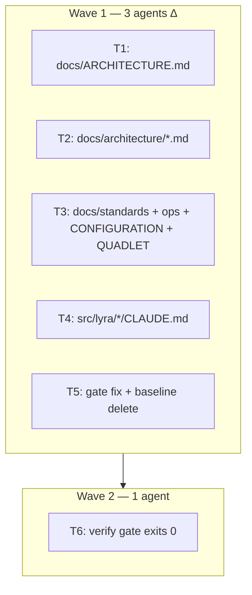

## Summary

Systematic purge of 108 unique dead-ref pairs across 24 docs + CLAUDE.md files, plus a gate path-resolution fix for `packages/*/CLAUDE.md`. 3 agents, 2 waves, ~18 ops.

## Architecture

## Bootstrap Context

From spec: 108 unique dead-ref pairs in `tools/doc_drift_baseline.txt`. Resolution strategy per token: update to live path/symbol, annotate with `deleted #NNNN`, or remove if irrelevant.

## Agents

| Agent | Tasks | Files |
|-------|-------|-------|
| doc-writer-A | T1, T2, T3 | Living docs |
| doc-writer-B | T4 | CLAUDE.md network |
| backend-dev-A | T5, T6 | Gate fix + verification |

## Wave Structure

2 waves, max 3 parallel agents. Elapsed ~1 session vs ~3 sequential.

| Wave | Trigger | Agents | Tasks |
|------|---------|--------|-------|
| 1 | start | 3 ∆ | doc-writer-A: T1·T2·T3 | doc-writer-B: T4 | backend-dev-A: T5 |
| 2 | Wave 1 done | 1 | backend-dev-A: T6 |

### Budget — per task

| Task | Items | Class | Est. ops | Split? |
|------|-------|-------|----------|--------|
| T1 | 11 refs | bounded | 3 | — |
| T2 | 62 refs | bounded | 6 | — |
| T3 | 24 refs | bounded | 4 | — |
| T4 | 9 refs | bounded | 3 | — |
| T5 | 2 changes | judgmental | 4 | — |
| T6 | 1 check | trivial | 1 | — |

**Total estimated ops: 21**

### Budget — per agent instance

| Instance | Tasks | Σ ops | Subjects | Split? |
|----------|-------|-------|----------|--------|
| doc-writer-A | T1, T2, T3 | 13 | docs, refs | — |
| doc-writer-B | T4 | 3 | claude-md | — |
| backend-dev-A | T5, T6 | 5 | gate, verify | — |

## Micro-Tasks

### T1 — Fix docs/ARCHITECTURE.md dead refs

| Field | Value |
|-------|-------|
| Description | Update 11 dead backtick refs in docs/ARCHITECTURE.md |
| File path | docs/ARCHITECTURE.md |
| Code snippet | — (string edits only) |
| Verify command | `grep "docs/ARCHITECTURE.md::" tools/doc_drift_baseline.txt` |
| Expected output | empty |
| Time estimate | 3 min |
| [P] | Y |
| Agent | doc-writer-A |
| Agent instance | doc-writer-A |
| Subject | docs |
| Spec trace | SC-1 |
| Slice | S1 |
| Phase | RED |
| Difficulty | 2 |

### T2 — Fix docs/architecture/*.md dead refs

| Field | Value |
|-------|-------|
| Description | Update dead backtick refs across all docs/architecture/*.md files |
| File path | docs/architecture/*.md |
| Code snippet | — |
| Verify command | `grep "docs/architecture/" tools/doc_drift_baseline.txt` |
| Expected output | empty |
| Time estimate | 8 min |
| [P] | Y |
| Agent | doc-writer-A |
| Agent instance | doc-writer-A |
| Subject | docs |
| Spec trace | SC-1 |
| Slice | S1 |
| Phase | RED |
| Difficulty | 2 |

### T3 — Fix docs/standards + ops + CONFIGURATION + QUADLET

| Field | Value |
|-------|-------|
| Description | Update dead refs in standards, ops, and top-level operational docs |
| File path | docs/standards/*.md, docs/ops/*.md, docs/CONFIGURATION.md, docs/QUADLET-DEPLOYMENT.md |
| Code snippet | — |
| Verify command | `grep -E "docs/standards/|docs/ops/|docs/CONFIGURATION|docs/QUADLET" tools/doc_drift_baseline.txt` |
| Expected output | empty |
| Time estimate | 5 min |
| [P] | Y |
| Agent | doc-writer-A |
| Agent instance | doc-writer-A |
| Subject | docs |
| Spec trace | SC-1 |
| Slice | S1 |
| Phase | RED |
| Difficulty | 2 |

### T4 — Fix src/lyra/*/CLAUDE.md dead refs

| Field | Value |
|-------|-------|
| Description | Update dead backtick refs in src/lyra/*/CLAUDE.md files |
| File path | src/lyra/*/CLAUDE.md |
| Code snippet | — |
| Verify command | `grep "src/lyra/" tools/doc_drift_baseline.txt` |
| Expected output | empty |
| Time estimate | 3 min |
| [P] | Y |
| Agent | doc-writer-B |
| Agent instance | doc-writer-B |
| Subject | claude-md |
| Spec trace | SC-2 |
| Slice | S2 |
| Phase | RED |
| Difficulty | 2 |

### T5 — Fix gate path resolution + delete baseline

| Field | Value |
|-------|-------|
| Description | Fix check_doc_drift.py to resolve package-relative paths in packages/*/CLAUDE.md; delete baseline file |
| File path | tools/check_doc_drift.py, tools/doc_drift_baseline.txt |
| Code snippet | Update `_resolve_path` to resolve `src/...` relative to package root when scanning packages/*/CLAUDE.md |
| Verify command | `uv run python tools/check_doc_drift.py` |
| Expected output | `doc-drift: OK — 0 new violations (0 in burn-down baseline).` |
| Time estimate | 5 min |
| [P] | Y |
| Agent | backend-dev-A |
| Agent instance | backend-dev-A |
| Subject | gate |
| Spec trace | SC-3 |
| Slice | S3 |
| Phase | RED |
| Difficulty | 3 |

### T6 — Verify gate exits 0

| Field | Value |
|-------|-------|
| Description | Final verification: gate runs clean, no baseline file exists |
| File path | — |
| Code snippet | — |
| Verify command | `uv run python tools/check_doc_drift.py && test ! -f tools/doc_drift_baseline.txt` |
| Expected output | `doc-drift: OK — 0 new violations (0 in burn-down baseline).` |
| Time estimate | 1 min |
| [P] | N |
| Agent | backend-dev-A |
| Agent instance | backend-dev-A |
| Subject | verify |
| Spec trace | SC-1, SC-2, SC-3 |
| Slice | S3 |
| Phase | RED-GATE |
| Difficulty | 1 |

## Task Seeding Blueprint

### Wave 1 — no deps, 3 agents ∆

| Task | Agent instance | blockedBy | Subject |
|------|---------------|-----------|---------|
| T1 | doc-writer-A | — | docs |
| T2 | doc-writer-A | — | docs |
| T3 | doc-writer-A | — | docs |
| T4 | doc-writer-B | — | claude-md |
| T5 | backend-dev-A | — | gate |

### Wave 2 — after Wave 1, 1 agent

| Task | Agent instance | blockedBy | Subject |
|------|---------------|-----------|---------|
| T6 | backend-dev-A | T5 | verify |

## Task IDs

<!-- Generated by /plan. Used by /implement to resume tasks on session restart. -->
- T1: 13
- T2: 14
- T3: 15
- T4: 16
- T5: 17
- T6: 18
