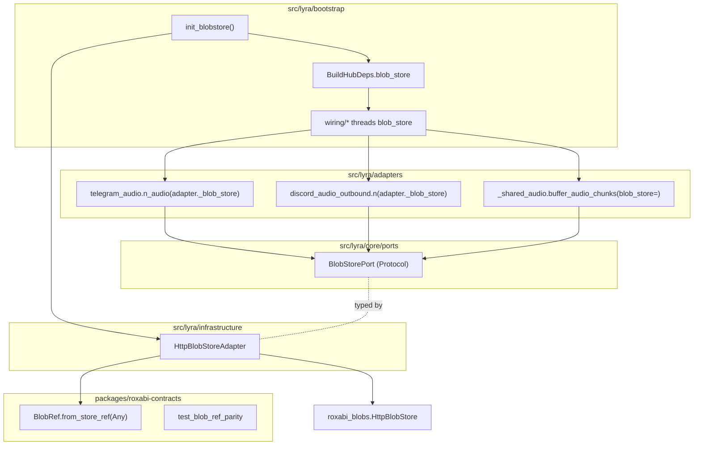
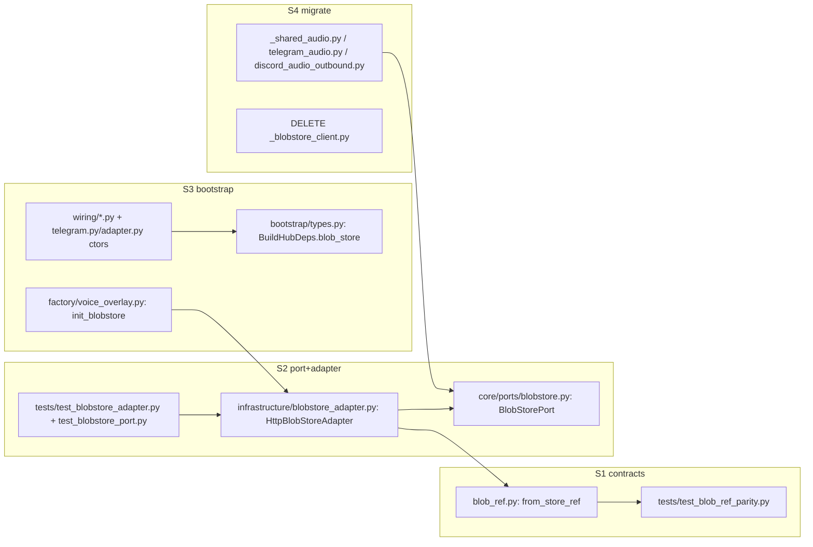

## Summary

Add `BlobStorePort` (core/ports) + `HttpBlobStoreAdapter` (infrastructure) + canonical
`BlobRef.from_store_ref` (roxabi-contracts), wire the port through bootstrap into the hub
and both channel adapters, migrate the 3 `get_blobstore_client()` callsites, and delete the
bare factory. Largely **sequential** (S1→S2→S3→S4, S5 trails); parallelism is thin and
mostly test-pairing.

## Architecture

### Data flow

### File × function map

## Agents

| Agent instance | Tasks | Files | Subject |
|---|---|---|---|
| backend-dev-A | T2 | `packages/roxabi-contracts/src/roxabi_contracts/blob_ref.py`, `…/pyproject.toml` | conversion |
| backend-dev-B | T4, T5 | `src/lyra/core/ports/blobstore.py` + `__init__.py`, `src/lyra/infrastructure/blobstore_adapter.py` | port, adapter |
| backend-dev-C | T6, T7, T8 | `bootstrap/factory/voice_overlay.py` (or new `blobstore_factory.py`), `bootstrap/types.py`, `factory/hub_builder.py`, `factory/unified.py`, `wiring/{standalone_telegram,standalone_discord,bootstrap_wiring}.py`, `adapters/telegram/telegram.py`, `adapters/discord/adapter.py` | wiring |
| backend-dev-D | T9, T10, T11 | `adapters/shared/_shared_audio.py`, `adapters/telegram/telegram_audio.py`, `adapters/discord/discord_audio_outbound.py`, **delete** `adapters/shared/_blobstore_client.py` | migration |
| tester-A | T1, T3, T12 + gates G1–G4 | `packages/roxabi-contracts/tests/`, `tests/` (adapter/port/regression) | testing |
| doc-writer-A | T13 | `src/lyra/infrastructure/CLAUDE.md`, `src/lyra/blobstore/CLAUDE.md`, commit ADR-082 + `meta.json` | docs |

Instance split rationale: per-instance caps (≤4 tasks, ≤2 subjects) force backend into 4
focused sessions (contracts / port+adapter / wiring / migration). They run mostly
sequentially (dependency chain), each a fresh context — not for parallelism but for focus.

## Wave Structure

5 logical waves (by slice), max 2–3 parallel agents (thin — refactor is sequential).
Elapsed ~1–1.5 days vs ~1.5–2 sequential.

| Wave | Trigger | Agents (∥) | Tasks |
|------|---------|-----------|-------|
| 1 (S1) | start | tester-A → backend-dev-A | T1 (RED) → T2 (GREEN) → G1 |
| 2 (S2) | G1 | backend-dev-B ∥ tester-A | T4→T5 ; T3 (RED) → G2 |
| 3 (S3) | G2 | backend-dev-C ∥ doc-writer-A | T6→{T7,T8} → G3 ; T13 starts |
| 4 (S4) | G3 | backend-dev-D ∥ tester-A | {T9,T10}→T11 ; T12 → G4 |
| 5 | G4 | doc-writer-A | T13 finalize + commit ADR/meta |

### Budget — per task

| Task | Items | Class | Est. ops | Split? |
|------|-------|-------|----------|--------|
| T1 parity+conv tests | 2 files | judgmental | 6 | — |
| T2 from_store_ref + bump | 2 files | bounded | 4 | — |
| T3 port+adapter tests | 2 files | judgmental | 6 | — |
| T4 BlobStorePort | 2 files | bounded | 4 | — |
| T5 HttpBlobStoreAdapter | 1 file | judgmental | 6 | — |
| T6 init_blobstore | 1 file | bounded | 4 | — |
| T7 BuildHubDeps field | 3 files | judgmental | 6 | — |
| T8 ctor + wiring threading | 5 files | judgmental | 10 | — |
| T9 migrate _shared_audio | 1 file | judgmental | 6 | — |
| T10 migrate tg/dc audio | 2 files | judgmental | 6 | — |
| T11 delete factory | 2 files | bounded | 4 | — |
| T12 regression test | 1 file | bounded | 4 | — |
| T13 docs | 3 files | bounded | 5 | — |
| G1–G4 gates | run tests | trivial | 2 ea | — |

**Total estimated ops: ~89** (no task > 50).

### Budget — per agent instance

| Instance | Tasks | Σ ops | Subjects | Split? |
|----------|-------|-------|----------|--------|
| backend-dev-A | T2 | 4 | conversion | — |
| backend-dev-B | T4,T5 | 10 | port, adapter (2) | — |
| backend-dev-C | T6,T7,T8 | 20 | wiring (1) | — |
| backend-dev-D | T9,T10,T11 | 16 | migration (1) | — |
| tester-A | T1,T3,T12,G1–G4 | 24 | testing (1) | — |
| doc-writer-A | T13 | 5 | docs (1) | — |

All instances within caps (≤4 tasks, ≤2 subjects, ≤50 ops).

## Consistency Report

Spec criteria (12) → tasks: SC1→T4 · SC2→T5 · SC3→T2 · SC4→T1/T2 · SC5→T2 · SC6→T6 ·
SC7→T7/T8 · SC8→T9/T10 (grep) · SC9→T11 · SC10→T9/T12 · SC11→G2/G3 (pyright+ruff+importlinter) ·
SC12→T4/T13. Covered: 12/12. Untraced tasks: none. Exemptions: none.

## Micro-Tasks

### S1 — contracts (RED → GREEN)
- **T1** [tester-A · RED · diff 2] Write `packages/roxabi-contracts/tests/test_blob_ref_parity.py`: (a) `set(WireBlobRef.model_fields) == set(StorageBlobRef.model_fields) - {"id","is_sentinel"}` — import storage fields by listing them as a frozenset constant (NO roxabi_blobs import in contracts test is fine, but a parity test MAY import roxabi_blobs in `[testing]`); (b) `from_store_ref` round-trips a synthetic storage-shaped object preserving `created_at`. Verify: `uv run pytest packages/roxabi-contracts -k parity` → FAILS (method absent). Spec: SC3/SC4.
- **T2** [backend-dev-A · GREEN · diff 2 · blockedBy T1] Add `from_store_ref(cls, store_ref: Any) -> BlobRef` to `blob_ref.py` (`model_validate(store_ref.model_dump(exclude={"id","is_sentinel"}))`); bump `pyproject.toml` 0.4.0→0.4.1. Verify: `uv run pytest packages/roxabi-contracts -k parity` → PASS. Spec: SC3/SC4/SC5.
- **G1** [tester-A · RED-GATE · blockedBy T2] All S1 tests green; `uv run ruff check packages/roxabi-contracts`.

### S2 — port + adapter (RED → GREEN)
- **T3** [tester-A · RED · diff 3 · blockedBy T2] `tests/.../test_blobstore_port.py` (runtime_checkable: a MockBlobStore instance `isinstance(_, BlobStorePort)`) + `test_blobstore_adapter.py` (adapter.put converts via from_store_ref; raises on PENDING_STORE_KEY). Verify: FAILS (port/adapter absent).
- **T4** [backend-dev-B · GREEN · diff 2 · blockedBy T2] Create `src/lyra/core/ports/blobstore.py` (`BlobStorePort`, `@runtime_checkable`, put/get/exists, wire return, no delete — mirror http_store.py:93 put sig exactly); export in `core/ports/__init__.py`. Verify: `uv run pyright src/lyra/core/ports/blobstore.py`. Spec: SC1.
- **T5** [backend-dev-B · GREEN · diff 3 · blockedBy T4] Create `src/lyra/infrastructure/blobstore_adapter.py` (`HttpBlobStoreAdapter` wraps `HttpBlobStore`; put→from_store_ref→reject PENDING_STORE_KEY; get/exists passthrough). Verify: `uv run pytest -k blobstore_adapter` PASS. Spec: SC2.
- **G2** [tester-A · RED-GATE · blockedBy T5,T3] S2 tests green; `uv run lint-imports` (importlinter clean — core/ports imports only roxabi_contracts). Spec: SC11.

### S3 — bootstrap + injection seam (GREEN)
- **T6** [backend-dev-C · GREEN · diff 2 · blockedBy T5] `init_blobstore() -> BlobStorePort` in `factory/voice_overlay.py` (or new `factory/blobstore_factory.py` — folder at 12-cap, fits). Reads `LYRA_BLOBSTORE_URL` + token **once**. Verify: `uv run pyright`. Spec: SC6.
- **T7** [backend-dev-C · GREEN · diff 3 · blockedBy T6] Add `blob_store: BlobStorePort | None` to `BuildHubDeps` (`bootstrap/types.py`); set from `init_blobstore()` at construction sites (`hub_builder.py`, `unified.py`). Verify: `uv run pyright src/lyra/bootstrap`. Spec: SC7.
- **T8** [backend-dev-C · GREEN · diff 5 · blockedBy T6] Add `blob_store` kwarg to `TelegramAdapter` + `DiscordAdapter` `__init__` (store `self._blob_store`); thread through `wiring/{standalone_telegram,standalone_discord,bootstrap_wiring}.py`. Verify: `uv run pyright`. Spec: SC7.
- **G3** [tester-A · RED-GATE · blockedBy T7,T8] `uv run pyright` + `uv run lint-imports` clean; adapters construct with blob_store. Spec: SC11.

### S4 — migration + deletion (GREEN → REFACTOR)
- **T9** [backend-dev-D · GREEN · diff 3 · blockedBy T8] `_shared_audio.py`: add `blob_store: BlobStorePort` param to `buffer_audio_chunks` + `buffer_and_render_audio`; replace `get_blobstore_client()` + hand-built `ContractBlobRef(...)` with `await blob_store.put(...)` (port returns wire ref directly, carries created_at). Update callers to pass `blob_store`. Verify: `uv run pytest -k audio`. Spec: SC8/SC10.
- **T10** [backend-dev-D · GREEN · diff 3 · blockedBy T8] `telegram_audio.n_audio` + `discord_audio_outbound.n`: use `adapter._blob_store` instead of `get_blobstore_client()`. Verify: `uv run pytest -k 'telegram or discord'`. Spec: SC8.
- **T11** [backend-dev-D · REFACTOR · diff 2 · blockedBy T9,T10] Delete `get_blobstore_client()` + `src/lyra/adapters/shared/_blobstore_client.py`; remove imports. Verify: `rg -c get_blobstore_client src/lyra` → 0. Spec: SC9.
- **T12** [tester-A · GREEN · diff 2 · blockedBy T9] Regression test: `_shared_audio` PUT path produces a wire BlobRef with `created_at` populated (not defaulted-fresh). Verify: `uv run pytest -k audio` PASS. Spec: SC10.
- **G4** [tester-A · RED-GATE · blockedBy T11,T12] `rg -c get_blobstore_client src/lyra`=0; full `uv run pytest` + `uv run pyright` + `uv run ruff check .` clean.

### S5 — docs (parallel after T5)
- **T13** [doc-writer-A · diff 2 · blockedBy T5] Amend `src/lyra/infrastructure/CLAUDE.md` (HttpBlobStoreAdapter), `src/lyra/blobstore/CLAUDE.md` (in-process consumers use BlobStorePort). Stage + commit ADR-082 + `meta.json` (already in worktree). Confirm no root CLAUDE.md registry change needed. Spec: SC12.

## Task Seeding Blueprint

<!-- Used by /implement to seed TaskCreate. T-numbers ref this list, not session IDs.
     Seed in wave order; within a wave, rows with same blockedBy are ∥. -->

### Wave 1 — start
| Task | Agent instance | blockedBy | Subject |
|------|---------------|-----------|---------|
| T1 | tester-A | — | testing |
| T2 | backend-dev-A | T1 | conversion |
| G1 | tester-A | T2 | testing |

### Wave 2 — after G1
| Task | Agent instance | blockedBy | Subject |
|------|---------------|-----------|---------|
| T3 | tester-A | T2 | testing |
| T4 | backend-dev-B | T2 | port |
| T5 | backend-dev-B | T4 | adapter |
| G2 | tester-A | T5,T3 | testing |

### Wave 3 — after G2
| Task | Agent instance | blockedBy | Subject |
|------|---------------|-----------|---------|
| T6 | backend-dev-C | T5 | wiring |
| T7 | backend-dev-C | T6 | wiring |
| T8 | backend-dev-C | T6 | wiring |
| T13 | doc-writer-A | T5 | docs |
| G3 | tester-A | T7,T8 | testing |

### Wave 4 — after G3
| Task | Agent instance | blockedBy | Subject |
|------|---------------|-----------|---------|
| T9 | backend-dev-D | T8 | migration |
| T10 | backend-dev-D | T8 | migration |
| T11 | backend-dev-D | T9,T10 | migration |
| T12 | tester-A | T9 | testing |
| G4 | tester-A | T11,T12 | testing |

## Task IDs

<!-- Generated by /plan. Consumed by /implement to re-attach tasks after /compact / session restart. -->
- T1: 13 — testing (S1 RED)
- T2: 14 — conversion (S1 GREEN)
- G1: 15 — testing (S1 RED-GATE)
- T3: 16 — testing (S2 RED)
- T4: 17 — port (S2 GREEN)
- T5: 18 — adapter (S2 GREEN)
- G2: 19 — testing (S2 RED-GATE)
- T6: 20 — wiring (S3 GREEN)
- T7: 21 — wiring (S3 GREEN)
- T8: 22 — wiring (S3 GREEN)
- T13: 23 — docs (S5)
- G3: 24 — testing (S3 RED-GATE)
- T9: 25 — migration (S4 GREEN)
- T10: 26 — migration (S4 GREEN)
- T11: 27 — migration (S4 REFACTOR)
- T12: 28 — testing (S4 GREEN)
- G4: 29 — testing (S4 RED-GATE final)

Dev-pipeline tasks (kind dev-pipeline): #1–#12 (triage..cleanup); plan-tasks above are #13–#29.
