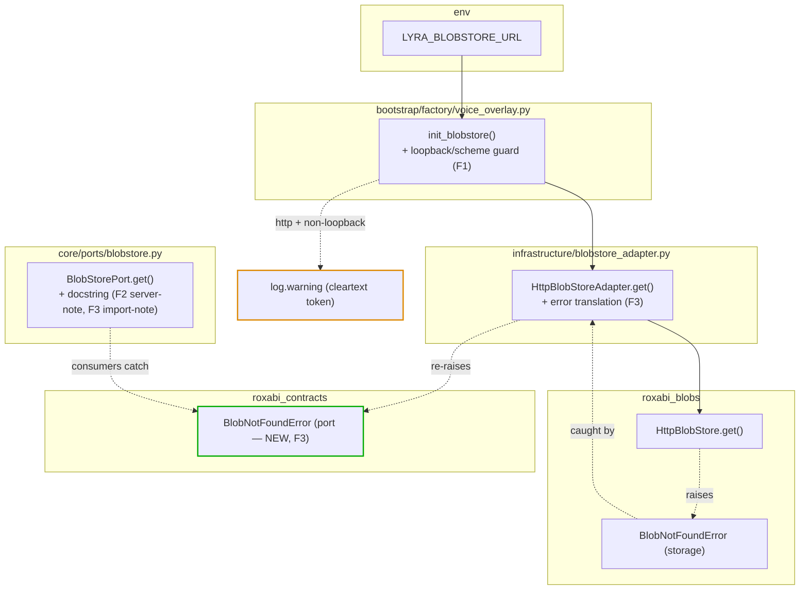
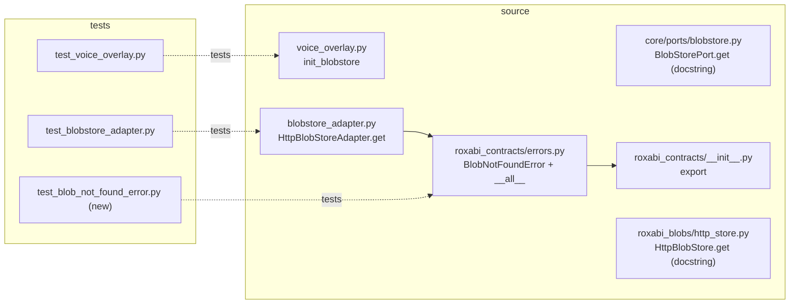

## Summary

Close 3 deferred ADR-082/#1546 review findings via TDD: F1 non-loopback-`http` warning in
`init_blobstore`, F2 server-enforcement docstrings (no code/test — already test-locked), F3
port-level `BlobNotFoundError` in `roxabi_contracts` + `HttpBlobStoreAdapter.get` translation
preserving the `contracts ⊥ blobs` decoupling.

## Architecture

### Data + error flow

### File × Function map

## Agents

| Agent instance | Tasks | Files | Subjects |
|----------------|-------|-------|----------|
| tester-A | T1, T2, T3 | `tests/bootstrap/test_voice_overlay.py`, `packages/roxabi-contracts/tests/test_blob_not_found_error.py` (new), `tests/infrastructure/test_blobstore_adapter.py` | config, errors |
| backend-dev-A | T5, T8 | `src/lyra/bootstrap/factory/voice_overlay.py` | config |
| backend-dev-B | T4, T6, T7, T9 | `packages/roxabi-blobs/src/roxabi_blobs/http_store.py`, `packages/roxabi-contracts/src/roxabi_contracts/errors.py` + `__init__.py`, `src/lyra/infrastructure/blobstore_adapter.py`, `src/lyra/core/ports/blobstore.py` | docs, errors |

backend-dev-A ⊥ backend-dev-B (disjoint files) → parallel-safe.

## Wave Structure

3 waves, max 2 parallel agents. Elapsed ~1 short session vs ~3 sequential.

| Wave | Trigger | Agents | Tasks |
|------|---------|--------|-------|
| 1 | start | 2 ∥ | tester-A: T1→T2→T3 (RED) · backend-dev-B: T4 (F2 docs, dep-free) |
| 2 | Wave 1 done | 2 ∥ | backend-dev-A: T5 (GREEN) · backend-dev-B: T6→T7 (GREEN) |
| 3 | Wave 2 done | 2 ∥ | backend-dev-A: T8 (RED-GATE S1) · backend-dev-B: T9 (RED-GATE S3) |

### Budget — per task

| Task | Items | Class | Est. ops | Split? |
|------|-------|-------|----------|--------|
| T1 voice_overlay RED test | 1 | judgmental | 5 | — |
| T2 contracts error RED test | 1 | bounded | 3 | — |
| T3 adapter RED test | 1 | judgmental | 5 | — |
| T4 http_store docstring (F2) | 1 | trivial | 2 | — |
| T5 init_blobstore guard (F1) | 1 | judgmental | 5 | — |
| T6 contracts BlobNotFoundError + exports | 1 | bounded | 4 | — |
| T7 adapter translation + port docstring | 1 | judgmental | 6 | — |
| T8 RED-GATE S1 | 1 | bounded | 2 | — |
| T9 RED-GATE S3 | 1 | bounded | 3 | — |

**Total estimated ops: 35**

### Budget — per agent instance

| Instance | Tasks | Σ ops | Subjects | Split? |
|----------|-------|-------|----------|--------|
| tester-A | T1, T2, T3 | 13 | config, errors | — (3≤4, 2≤2) |
| backend-dev-A | T5, T8 | 7 | config | — |
| backend-dev-B | T4, T6, T7, T9 | 15 | docs, errors | — (4≤4, 2≤2) |

No split required. (A single backend-dev would carry config+errors+docs = 3 subjects > 2 → the
2-way split above is the cap resolution.)

## Consistency Report

8/8 success criteria covered:

| SC | Covered by |
|----|-----------|
| SC1 warn non-loopback-http; silent loopback/https | T1, T5, T8 |
| SC2 never rejects (returns adapter) | T1, T5 |
| SC3 docstrings server-enforcement note | T4 (http_store), T7 (port) |
| SC4 contracts BlobNotFoundError exists/importable/Exception | T2, T6 |
| SC5 adapter.get raises contracts error on 404 | T3, T7, T9 |
| SC6 port docstring import-from-contracts; grep server-only | T7 |
| SC7 contracts no roxabi_blobs import; server files unchanged | T6 (+ import-linter at validate) |
| SC8 existing suites pass | T8, T9 (+ validate) |

Uncovered: none. Untraced tasks: none. Exemptions: none.

## Micro-Tasks

### Slice S1 — F1 HTTPS-scheme warning

**T1 [RED · S1 · config · tester-A]** — failing test for the loopback guard.
- File: `tests/bootstrap/test_voice_overlay.py`
- Snippet: parametrize `init_blobstore` over `LYRA_BLOBSTORE_URL` ∈ {`http://10.0.0.5:8449` → warns, `http://localhost:8449` → silent, `http://127.0.0.1:8449` → silent, `https://host:8449` → silent}; assert via `caplog`; assert return is not None (token file present fixture).
- Verify: `uv run pytest tests/bootstrap/test_voice_overlay.py -k loopback -q`
- Expected: fails (guard not implemented) — RED.
- Trace: SC1, SC2 · Difficulty 3 · dep: —

**T5 [GREEN · S1 · config · backend-dev-A]** — implement guard.
- File: `src/lyra/bootstrap/factory/voice_overlay.py` (`init_blobstore`)
- Snippet: after `base_url = os.environ.get(...)`, parse with `urlsplit`; `host = parts.hostname`; loopback := `host == "localhost"` or (`host` parses as IP and `ipaddress.ip_address(host).is_loopback`); if `parts.scheme == "http"` and not loopback → `log.warning("LYRA_BLOBSTORE_URL %s is non-loopback http — bearer token sent in cleartext (mitigated by Tailnet WireGuard); prefer https", base_url)`. Never raise.
- Verify: `uv run pytest tests/bootstrap/test_voice_overlay.py -k loopback -q`
- Expected: passes — GREEN.
- Trace: SC1, SC2 · Difficulty 2 · dep: T1

**T8 [RED-GATE · S1 · config · backend-dev-A]** — confirm S1 green + no regression in file.
- Verify: `uv run pytest tests/bootstrap/test_voice_overlay.py -q`
- Expected: all green.
- dep: T5

### Slice S2 — F2 server-enforcement docstrings (no test — already locked)

**T4 [GREEN · S2 · docs · backend-dev-B]** — `HttpBlobStore.get` docstring.
- File: `packages/roxabi-blobs/src/roxabi_blobs/http_store.py` (`get`)
- Snippet: append note — `store_key` is server-issued/opaque; the **server** enforces path containment (`FsBlobStore._safe_resolve_in_root`, traversal → 404, no oracle); do NOT add client-side sanitisation (breaks legacy `:path` slash keys). Regression-locked by `tests/blobstore/test_serve_api.py::TestPathTraversal` + `packages/roxabi-blobs/tests/test_security.py::TestPathTraversal`.
- Verify: `grep -n "server.*enforces\|_safe_resolve_in_root" packages/roxabi-blobs/src/roxabi_blobs/http_store.py`
- Expected: note present.
- Trace: SC3 · Difficulty 1 · dep: — (the port-side server-note lands in T7's docstring edit)

### Slice S3 — F3 port-level BlobNotFoundError + adapter translation

**T2 [RED · S3 · errors · tester-A]** — failing test for the contracts error.
- File: `packages/roxabi-contracts/tests/test_blob_not_found_error.py` (new)
- Snippet: `from roxabi_contracts import BlobNotFoundError as A`; `from roxabi_contracts.errors import BlobNotFoundError as B`; assert `A is B`; assert `issubclass(A, Exception)`; assert `str(A("k")) ` carries the key.
- Verify: `uv run pytest packages/roxabi-contracts/tests/test_blob_not_found_error.py -q`
- Expected: fails (ImportError) — RED.
- Trace: SC4 · Difficulty 2 · dep: —

**T3 [RED · S3 · errors · tester-A]** — failing test for adapter translation.
- File: `tests/infrastructure/test_blobstore_adapter.py`
- Snippet: stub/fake `HttpBlobStore` whose `get` raises `roxabi_blobs.BlobNotFoundError`; wrap in `HttpBlobStoreAdapter`; `pytest.raises(roxabi_contracts.BlobNotFoundError)` on `await adapter.get("k")`; assert it is NOT a `roxabi_blobs.BlobNotFoundError` instance.
- Verify: `uv run pytest tests/infrastructure/test_blobstore_adapter.py -k translat -q`
- Expected: fails — RED.
- Trace: SC5 · Difficulty 3 · dep: —

**T6 [GREEN · S3 · errors · backend-dev-B]** — define + export contracts error.
- Files: `packages/roxabi-contracts/src/roxabi_contracts/errors.py`, `packages/roxabi-contracts/src/roxabi_contracts/__init__.py`
- Snippet: `class BlobNotFoundError(Exception): """Raised by BlobStorePort.get when an opaque store_key is absent."""` (mirror `roxabi_blobs` public shape — single positional). Add to `errors.__all__` and package `__init__` import + `__all__`. **No `roxabi_blobs` import.**
- Verify: `uv run pytest packages/roxabi-contracts/tests/test_blob_not_found_error.py -q && uv run lint-imports`
- Expected: error test green; import-linter green.
- Trace: SC4, SC7 · Difficulty 2 · dep: T2

**T7 [GREEN · S3 · errors+docs · backend-dev-B]** — adapter translation + port docstring.
- Files: `src/lyra/infrastructure/blobstore_adapter.py` (`get`), `src/lyra/core/ports/blobstore.py` (`get` docstring)
- Snippet: in `HttpBlobStoreAdapter.get`, wrap the wrapped-store call: `except roxabi_blobs.BlobNotFoundError as e: raise BlobNotFoundError(str(e)) from e` (contracts import already legal in this seam). Port `get` docstring: state callers import `BlobNotFoundError` from **`roxabi_contracts`**; add the server-enforces-traversal note (F2). Translation scope note: only `get()` (delete not on port).
- Verify: `uv run pytest tests/infrastructure/test_blobstore_adapter.py -q; grep -rn "from roxabi_blobs import BlobNotFoundError" src/lyra`
- Expected: adapter test green; grep matches only `_handlers.py`/`_keys.py` (server).
- Trace: SC3, SC5, SC6 · Difficulty 3 · dep: T3, T6

**T9 [RED-GATE · S3 · errors · backend-dev-B]** — confirm S3 green.
- Verify: `uv run pytest packages/roxabi-contracts/tests/test_blob_not_found_error.py tests/infrastructure/test_blobstore_adapter.py -q && uv run lint-imports`
- Expected: all green; decoupling intact.
- dep: T7

## Task Seeding Blueprint

<!-- Used by /implement to seed TaskCreate calls on session start.
     Format: T{n} | agent-instance | blockedBy | subject
     blockedBy refs T-numbers within this list (not session task IDs).
     Seed in wave order; within a wave all rows are parallel (∥). -->

### Wave 1 — no deps, 2 agents ∥

| Task | Agent instance | blockedBy | Subject |
|------|---------------|-----------|---------|
| T1 | tester-A | — | config |
| T2 | tester-A | — | errors |
| T3 | tester-A | — | errors |
| T4 | backend-dev-B | — | docs |

### Wave 2 — after RED tests, 2 agents ∥

| Task | Agent instance | blockedBy | Subject |
|------|---------------|-----------|---------|
| T5 | backend-dev-A | T1 | config |
| T6 | backend-dev-B | T2 | errors |
| T7 | backend-dev-B | T3, T6 | errors |

### Wave 3 — RED-GATE, 2 agents ∥

| Task | Agent instance | blockedBy | Subject |
|------|---------------|-----------|---------|
| T8 | backend-dev-A | T5 | config |
| T9 | backend-dev-B | T7 | errors |

## Task IDs

<!-- Generated by /plan. Used by /implement to resume tasks on session restart (survives /compact). -->
- T1: 13 — config (RED·S1 · tester-A)
- T2: 14 — errors (RED·S3 · tester-A)
- T3: 15 — errors (RED·S3 · tester-A)
- T4: 16 — docs (S2 · backend-dev-B)
- T5: 17 — config (GREEN·S1 · backend-dev-A) ← blockedBy T1
- T6: 18 — errors (GREEN·S3 · backend-dev-B) ← blockedBy T2
- T7: 19 — errors (GREEN·S3 · backend-dev-B) ← blockedBy T3, T6
- T8: 20 — config (RED-GATE·S1 · backend-dev-A) ← blockedBy T5
- T9: 21 — errors (RED-GATE·S3 · backend-dev-B) ← blockedBy T7
