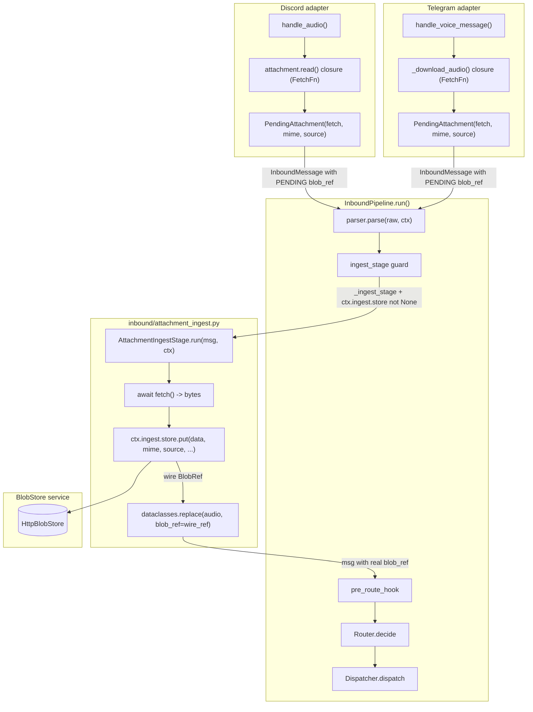
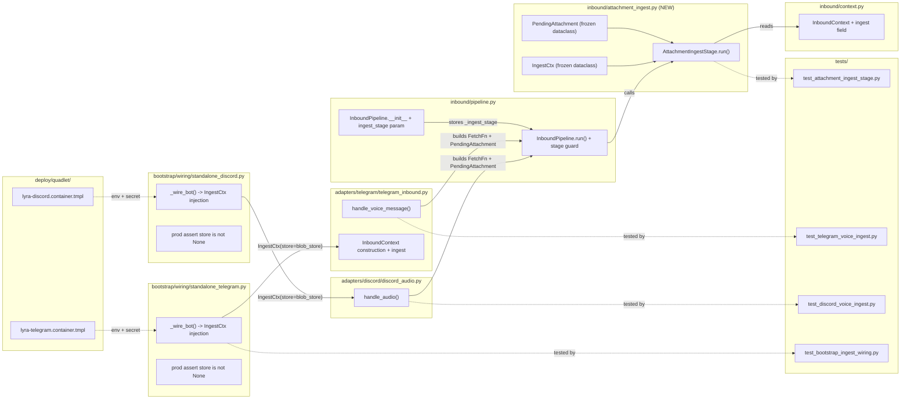

## Summary

Implements the stage-axis central attachment ingest foundation (S1–S4 + S8): adds
`AttachmentIngestStage` to `src/lyra/inbound/`, wires both Telegram and Discord voice
paths through a `FetchFn` closure so bytes flow to `BlobStorePort.put()` inside the
pipeline (before hub enqueue), and injects the production `IngestCtx` via bootstrap
with a hard assert and updated Quadlet secrets.

## Architecture

### Data Flow



### File x Function Map



## Agents

| Agent | Task count | Files |
|-------|-----------|-------|
| tester-A | 5 (RED tasks S1+S2+S8) | `tests/inbound/test_attachment_ingest_stage.py`, `tests/bootstrap/test_bootstrap_ingest_wiring.py` |
| tester-B | 3 (RED tasks S3+S4) | `tests/adapters/telegram/test_telegram_voice_ingest.py`, `tests/adapters/discord/test_discord_voice_ingest.py` |
| backend-dev-A | 4 (GREEN S1+S2) | `src/lyra/inbound/attachment_ingest.py`, `src/lyra/inbound/context.py`, `src/lyra/inbound/pipeline.py` |
| backend-dev-B | 4 (GREEN S3+S4) | `src/lyra/adapters/telegram/telegram_inbound.py`, `src/lyra/adapters/discord/discord_audio.py`, `src/lyra/adapters/discord/discord_inbound.py` |
| devops-A | 3 (GREEN S8) | `src/lyra/bootstrap/wiring/standalone_telegram.py`, `src/lyra/bootstrap/wiring/standalone_discord.py`, `deploy/quadlet/lyra-telegram.container.tmpl`, `deploy/quadlet/lyra-discord.container.tmpl` |

## Wave Structure

5 waves, max 2 parallel agents. Elapsed ~3 sessions vs ~5 sequential.

| Wave | Trigger | Agents | Tasks |
|------|---------|--------|-------|
| 1 | start | 2 ∥ | tester-A: T1+T2 · tester-B: T3+T4 |
| 2 | Wave 1 done | 1 | tester-A: T5 (bootstrap RED) — RED-GATE S1+S2+S8 |
| 3 | Wave 2 done (RED-GATE clear) | 2 ∥ | backend-dev-A: T6+T7 · devops-A: T8 |
| 4 | Wave 3 done | 2 ∥ | backend-dev-B: T9+T10 · tester-B: sentinel (RED-GATE S3+S4) |
| 5 | Wave 4 done (RED-GATE S3+S4 clear) | 2 ∥ | backend-dev-B: T11+T12 · devops-A: T13+T14 |

### Budget — per task

| Task | Description | Est. ops | Split? |
|------|-------------|----------|--------|
| T1 | Write stage unit tests (store=None no-op + fetch-fail degraded + happy path) | 18 | — |
| T2 | Write context/pipeline unit tests (IngestCtx field + _ingest_stage param) | 12 | — |
| T3 | Write Telegram voice ingest integration test (FetchFn closure + pipeline route) | 14 | — |
| T4 | Write Discord voice ingest integration test (symmetric) | 14 | — |
| T5 | Write bootstrap wiring tests (prod assert store is not None + IngestCtx inject) | 16 | — |
| T6 | Implement attachment_ingest.py (PendingAttachment + IngestCtx + AttachmentIngestStage) | 28 | — |
| T7 | Wire context.py + pipeline.py (ingest field + _ingest_stage param + guard in run()) | 22 | — |
| T8 | Implement standalone_telegram.py + standalone_discord.py IngestCtx injection + prod assert | 24 | — |
| T9 | Refactor telegram_inbound.handle_voice_message (FetchFn closure + pipeline routing) | 26 | — |
| T10 | Refactor discord_audio.handle_audio (FetchFn closure + pipeline routing) | 26 | — |
| T11 | Wire InboundContext.ingest into telegram_inbound handle_voice_message InboundContext ctor | 14 | — |
| T12 | Wire InboundContext.ingest into discord_inbound handle_audio InboundContext build path | 14 | — |
| T13 | Add LYRA_BLOBSTORE_URL + LYRA_BLOBSTORE_TOKEN_PATH env to lyra-telegram.container.tmpl | 10 | — |
| T14 | Add LYRA_BLOBSTORE_URL + LYRA_BLOBSTORE_TOKEN_PATH env + Secret to lyra-discord.container.tmpl | 10 | — |

**Total estimated ops: 248**

### Budget — per agent instance

Caps: `Σ ops > 50` OR `|tasks| > 4` OR `distinct subjects > 2` → split into new instance.

| Instance | Tasks | Σ ops | Subjects | Split? |
|----------|-------|-------|----------|--------|
| tester-A | T1, T2, T5 | 46 | stage, bootstrap | — |
| tester-B | T3, T4 | 28 | telegram, discord | — (parallel-safe, separate files) |
| backend-dev-A | T6, T7 | 50 | stage, pipeline | — (boundary: 50 ops exactly) |
| backend-dev-B | T9, T10, T11, T12 | 80 | telegram, discord | YES → split |

backend-dev-B exceeds 50 ops (80) and 4 tasks. Split:

| Instance | Tasks | Σ ops | Subjects | Split? |
|----------|-------|-------|----------|--------|
| backend-dev-B | T9, T11 | 40 | telegram | — |
| backend-dev-C | T10, T12 | 40 | discord | — |
| devops-A | T8, T13, T14 | 44 | bootstrap, quadlet | — |

T9+T11 are Telegram-only (independent files), T10+T12 Discord-only — the split also
maps to the platform boundary, which is the natural isolation axis.

## Micro-Tasks

> Ordering: RED tasks first, then RED-GATE sentinel, then GREEN tasks.
> S3/S4 (adapter wiring) RED tasks run in Wave 1 ∥ with S1/S2 RED tasks.

---

### Slice S1+S2: Descriptor, IngestCtx, Stage skeleton + voice path

#### Task 1: Write stage unit tests (store=None no-op, fetch-fail degraded, happy path) → tester-A
- **File:** `tests/inbound/test_attachment_ingest_stage.py`
- **Snippet:**
  ```python
  async def test_store_none_is_noop(pipeline_with_no_store, pending_voice_msg):
      msg = await pipeline_with_no_store.run(pending_voice_msg)
      assert msg.audio.blob_ref.store_key == PENDING_STORE_KEY

  async def test_fetch_fail_keeps_pending(stage_with_store, failing_fetch_msg):
      msg = await stage_with_store.run(failing_fetch_msg, ctx_with_store)
      assert msg.audio.blob_ref.store_key == PENDING_STORE_KEY  # degraded

  async def test_happy_path_stamps_real_blob_ref(stage_with_store, voice_msg):
      msg = await stage_with_store.run(voice_msg, ctx_with_store)
      assert msg.audio.blob_ref.store_key != PENDING_STORE_KEY
  ```
- **Verify:** `grep -q 'test_store_none_is_noop\|test_fetch_fail_keeps_pending\|test_happy_path' tests/inbound/test_attachment_ingest_stage.py` (ready)
- **Expected:** All three test stubs present
- **Time:** 20 min
- **Difficulty:** 3
- **Traces:** N1, N3, N4
- **Slice:** S1, S2
- **Phase:** RED
- **Agent instance:** tester-A

#### Task 2: Write context + pipeline unit tests → tester-A [P]
- **File:** `tests/inbound/test_inbound_context_ingest.py`
- **Snippet:**
  ```python
  def test_inbound_context_ingest_defaults_none():
      ctx = InboundContext(router=..., session=..., dispatch=...)
      assert ctx.ingest is None

  def test_pipeline_accepts_ingest_stage_none():
      p = InboundPipeline()
      assert p._ingest_stage is None
  ```
- **Verify:** `grep -q 'test_inbound_context_ingest_defaults_none\|test_pipeline_accepts_ingest_stage_none' tests/inbound/test_inbound_context_ingest.py` (ready)
- **Expected:** Both test stubs present
- **Time:** 12 min
- **Difficulty:** 2
- **Traces:** N1, N2
- **Slice:** S1
- **Phase:** RED
- **Agent instance:** tester-A

#### Task 5: Write bootstrap wiring tests (prod assert + IngestCtx inject) → tester-A
- **File:** `tests/bootstrap/test_bootstrap_ingest_wiring.py`
- **Snippet:**
  ```python
  def test_prod_assert_raises_when_store_none(mock_ingest_ctx_no_store):
      with pytest.raises(AssertionError, match="ctx.ingest.store"):
          _assert_prod_ingest_store(mock_ingest_ctx_no_store)

  def test_ingest_ctx_injected_with_blob_store(wired_tg_ctx, mock_blob_store):
      assert wired_tg_ctx.ingest is not None
      assert wired_tg_ctx.ingest.store is mock_blob_store
  ```
- **Verify:** `grep -q 'test_prod_assert_raises_when_store_none\|test_ingest_ctx_injected_with_blob_store' tests/bootstrap/test_bootstrap_ingest_wiring.py` (ready)
- **Expected:** Both test stubs present
- **Time:** 18 min
- **Difficulty:** 3
- **Traces:** N11 (S8)
- **Slice:** S8
- **Phase:** RED
- **Agent instance:** tester-A

#### RED-GATE: S1 + S2 + S8 RED complete → tester-A
- **Verify:** Tasks T1, T2, T5 marked complete
- **Phase:** RED-GATE

#### Task 6: Implement attachment_ingest.py → backend-dev-A
- **File:** `src/lyra/inbound/attachment_ingest.py`
- **Snippet:**
  ```python
  from __future__ import annotations
  import dataclasses
  import logging
  from collections.abc import Awaitable, Callable
  from dataclasses import dataclass
  from typing import TYPE_CHECKING
  if TYPE_CHECKING:
      from lyra.core.messaging.message import InboundMessage
      from lyra.core.ports.blobstore import BlobStorePort

  FetchFn = Callable[[], Awaitable[bytes]]
  log = logging.getLogger(__name__)

  @dataclass(frozen=True)
  class PendingAttachment:
      fetch: FetchFn
      mime: str
      source: str
      platform_ref: str | None = None
      platform_message_id: str | None = None
      filename: str | None = None

  @dataclass(frozen=True)
  class IngestCtx:
      store: "BlobStorePort | None"

  class AttachmentIngestStage:
      async def run(self, msg: "InboundMessage", ctx: "IngestCtx") -> "InboundMessage":
          if msg.audio is None or not hasattr(msg.audio, "blob_ref"):
              return msg
          pending = getattr(msg, "_pending_attachment", None)
          if pending is None or ctx.store is None:
              return msg  # store=None no-op passthrough
          try:
              data = await pending.fetch()
          except Exception:
              log.exception("fetch failed — degraded (PENDING preserved)")
              return msg  # degraded: keep PENDING_STORE_KEY
          wire_ref = await ctx.store.put(
              data,
              mime=pending.mime,
              source=pending.source,
              filename=pending.filename,
              platform_ref=pending.platform_ref,
              platform_message_id=pending.platform_message_id,
          )
          new_audio = dataclasses.replace(msg.audio, blob_ref=wire_ref)
          return dataclasses.replace(msg, audio=new_audio)
  ```
  Note: `_pending_attachment` field on `InboundMessage` must be added or passed via
  context; exact attachment carrier to be decided during GREEN implementation (see
  architecture note below).
- **Verify:** `uv run pyright src/lyra/inbound/attachment_ingest.py` (ready)
- **Expected:** No type errors
- **Time:** 30 min
- **Difficulty:** 4
- **Traces:** N1, N3
- **Slice:** S1, S2
- **Phase:** GREEN
- **Agent instance:** backend-dev-A

  > **Architecture note (implementor):** The `PendingAttachment` must reach
  > `AttachmentIngestStage.run()`. Two valid shapes: (a) add
  > `pending_attachment: PendingAttachment | None = None` field to `InboundMessage`
  > (additive, default None — same pattern as `audio`), OR (b) pass it through
  > `IngestCtx`. Shape (a) is preferred: the stage already receives `msg`, and adding
  > a field to `InboundMessage` avoids coupling `IngestCtx` to the per-message
  > descriptor. Implementor decides; document in code comment.

#### Task 7: Wire InboundContext.ingest + InboundPipeline._ingest_stage → backend-dev-A
- **File:** `src/lyra/inbound/context.py`, `src/lyra/inbound/pipeline.py`
- **Snippet for context.py:**
  ```python
  # Add to InboundContext (after existing fields):
  ingest: "IngestCtx | None" = None
  # TYPE_CHECKING import: from lyra.inbound.attachment_ingest import IngestCtx
  ```
  **Snippet for pipeline.py `__init__`:**
  ```python
  def __init__(
      self,
      router: Router | None = None,
      session_builder: SessionBuilder | None = None,
      dispatcher: Dispatcher | None = None,
      ingest_stage: "AttachmentIngestStage | None" = None,
  ) -> None:
      ...
      self._ingest_stage = ingest_stage
  ```
  **Snippet for pipeline.py `run()` — insert after `msg = parser.parse(raw, ctx)` / None guard, before `pre_route_hook`:**
  ```python
  if (
      self._ingest_stage is not None
      and ctx.ingest is not None
      and ctx.ingest.store is not None
  ):
      msg = await self._ingest_stage.run(msg, ctx.ingest)
  ```
- **Verify:** `uv run pytest tests/inbound/test_inbound_context_ingest.py -x` (deferred)
- **Expected:** Both tests pass
- **Time:** 22 min
- **Difficulty:** 3
- **Traces:** N2, N4
- **Slice:** S1
- **Phase:** GREEN
- **Agent instance:** backend-dev-A

---

### Slice S3: Wire Telegram voice

#### Task 3: Write Telegram voice ingest integration test → tester-B [P]
- **File:** `tests/adapters/telegram/test_telegram_voice_ingest.py`
- **Snippet:**
  ```python
  async def test_tg_voice_routes_via_pipeline_not_direct_push(mock_adapter, mock_voice_msg):
      """handle_voice_message must call pipeline.run(), not push_to_hub_guarded directly."""
      with patch("lyra.adapters.telegram.telegram_inbound._pipeline") as mock_pipeline:
          await handle_voice_message(mock_adapter, mock_voice_msg)
          mock_pipeline.run.assert_called_once()

  async def test_tg_fetch_fn_closure_wraps_download_audio(mock_adapter, mock_voice_msg):
      """FetchFn closure must call _download_audio, not pre-download bytes."""
      with patch("lyra.adapters.telegram.telegram_inbound._download_audio") as dl:
          dl.return_value = (MagicMock(read_bytes=lambda: b"ogg"), None)
          await handle_voice_message(mock_adapter, mock_voice_msg)
          assert not dl.called  # closure not yet awaited — stage calls it
  ```
- **Verify:** `grep -q 'test_tg_voice_routes_via_pipeline_not_direct_push\|test_tg_fetch_fn_closure' tests/adapters/telegram/test_telegram_voice_ingest.py` (ready)
- **Expected:** Both test stubs present
- **Time:** 15 min
- **Difficulty:** 3
- **Traces:** N5
- **Slice:** S3
- **Phase:** RED
- **Agent instance:** tester-B

#### RED-GATE: S3 RED complete → tester-B
- **Verify:** Task T3 marked complete
- **Phase:** RED-GATE

#### Task 9: Refactor telegram_inbound.handle_voice_message — FetchFn closure → backend-dev-B
- **File:** `src/lyra/adapters/telegram/telegram_inbound.py`
- **Snippet:**
  ```python
  from lyra.inbound.attachment_ingest import FetchFn, IngestCtx, PendingAttachment

  async def handle_voice_message(adapter: TelegramAdapter, msg: Any) -> None:
      ...
      # Build FetchFn closure capturing adapter + file_id (lazy — not called here)
      async def _tg_voice_fetch() -> bytes:
          tmp_path, _ = await _download_audio(
              adapter, file_id, getattr(voice, "duration", None)
          )
          try:
              return tmp_path.read_bytes()
          finally:
              tmp_path.unlink(missing_ok=True)

      pending = PendingAttachment(
          fetch=_tg_voice_fetch,
          mime="audio/ogg",
          source="telegram",
          platform_ref=file_id,
          platform_message_id=str(message_id) if message_id is not None else None,
      )
      hub_audio = normalize_audio(adapter, msg, pending=pending, ...)
      # Route via pipeline (not push_to_hub_guarded):
      inbound_ctx = InboundContext(
          router=..., session=..., dispatch=...,
          ingest=adapter._ingest_ctx,  # injected by bootstrap
      )
      await _pipeline.run(msg_raw, inbound_ctx, parser, ...)
  ```
  Note: `normalize_audio` signature will need updating to accept `pending` instead
  of `audio_bytes` — implementor decides the exact carrier shape (see T6 note).
- **Verify:** `uv run pytest tests/adapters/telegram/test_telegram_voice_ingest.py -x` (deferred)
- **Expected:** Both Telegram voice tests pass
- **Time:** 28 min
- **Difficulty:** 4
- **Traces:** N5
- **Slice:** S3
- **Phase:** GREEN
- **Agent instance:** backend-dev-B

#### Task 11: Wire InboundContext.ingest into handle_voice_message InboundContext ctor → backend-dev-B
- **File:** `src/lyra/adapters/telegram/telegram_inbound.py`
- **Snippet:**
  ```python
  # In handle_voice_message, when building inbound_ctx:
  inbound_ctx = InboundContext(
      router=RouterCtx(...),
      session=SessionCtx(...),
      dispatch=DispatchCtx(...),
      ingest=adapter._ingest_ctx,  # set by bootstrap via standalone_telegram._wire_bot
  )
  ```
  Also wire `adapter._ingest_ctx: IngestCtx | None = None` onto `TelegramAdapter`
  (bootstrap sets it post-construction, same pattern as `_outbound_listener`).
- **Verify:** `grep -n 'ingest=adapter._ingest_ctx' src/lyra/adapters/telegram/telegram_inbound.py` (ready)
- **Expected:** Match found in file
- **Time:** 14 min
- **Difficulty:** 2
- **Traces:** N5, N11 (partial)
- **Slice:** S3, S8
- **Phase:** GREEN
- **Agent instance:** backend-dev-B

---

### Slice S4: Wire Discord voice

#### Task 4: Write Discord voice ingest integration test → tester-B [P]
- **File:** `tests/adapters/discord/test_discord_voice_ingest.py`
- **Snippet:**
  ```python
  async def test_dc_voice_routes_via_pipeline_not_direct_push(mock_dc_adapter, mock_dc_msg, mock_audio_att):
      with patch("lyra.adapters.discord.discord_audio._pipeline") as mock_pipeline:
          await handle_audio(mock_dc_adapter, mock_dc_msg, mock_audio_att, TrustLevel.PUBLIC)
          mock_pipeline.run.assert_called_once()

  async def test_dc_fetch_fn_wraps_attachment_read(mock_dc_adapter, mock_dc_msg, mock_audio_att):
      """attachment.read() must be deferred inside FetchFn, not pre-downloaded."""
      with patch.object(mock_audio_att, "read") as mock_read:
          await handle_audio(mock_dc_adapter, mock_dc_msg, mock_audio_att, TrustLevel.PUBLIC)
          mock_read.assert_not_called()  # closure not yet awaited — stage calls it
  ```
- **Verify:** `grep -q 'test_dc_voice_routes_via_pipeline_not_direct_push\|test_dc_fetch_fn_wraps_attachment_read' tests/adapters/discord/test_discord_voice_ingest.py` (ready)
- **Expected:** Both test stubs present
- **Time:** 15 min
- **Difficulty:** 3
- **Traces:** N6
- **Slice:** S4
- **Phase:** RED
- **Agent instance:** tester-B

#### RED-GATE: S4 RED complete → tester-B
- **Verify:** Task T4 marked complete
- **Phase:** RED-GATE

#### Task 10: Refactor discord_audio.handle_audio — FetchFn closure, pipeline routing → backend-dev-C
- **File:** `src/lyra/adapters/discord/discord_audio.py`
- **Snippet:**
  ```python
  from lyra.inbound.attachment_ingest import FetchFn, IngestCtx, PendingAttachment

  async def handle_audio(adapter, message, audio_attachment, trust):
      ...
      # Pre-download size guard stays (early rejection before CDN fetch):
      att_size = getattr(audio_attachment, "size", None)
      if att_size is None or att_size > adapter._max_audio_bytes:
          ...  # same user-facing error as today
          return

      # Defer actual download to FetchFn closure (CDN eager: stage runs in-pipeline)
      async def _dc_audio_fetch() -> bytes:
          return await audio_attachment.read()

      pending = PendingAttachment(
          fetch=_dc_audio_fetch,
          mime=getattr(audio_attachment, "content_type", "audio/ogg"),
          source="discord",
          platform_ref=None,
          platform_message_id=str(message.id),
      )
      hub_audio = normalize_audio(message, pending=pending, ...)
      inbound_ctx = InboundContext(
          router=..., session=..., dispatch=...,
          ingest=adapter._ingest_ctx,
      )
      adapter._start_typing(message.channel.id)
      await _pipeline.run(message, inbound_ctx, parser_or_raw, ...)
  ```
  Note: magic-byte guard (`is_valid_audio_magic`) must move inside the FetchFn OR
  into the stage. Because the stage is platform-agnostic, magic-byte checking belongs
  inside the FetchFn closure on the Discord side — implementor places it there.
- **Verify:** `uv run pytest tests/adapters/discord/test_discord_voice_ingest.py -x` (deferred)
- **Expected:** Both Discord voice tests pass
- **Time:** 28 min
- **Difficulty:** 4
- **Traces:** N6
- **Slice:** S4
- **Phase:** GREEN
- **Agent instance:** backend-dev-C

#### Task 12: Wire InboundContext.ingest into discord handle_audio InboundContext build path → backend-dev-C
- **File:** `src/lyra/adapters/discord/discord_audio.py`, `src/lyra/adapters/discord/discord_inbound.py`
- **Snippet:**
  ```python
  # discord_audio.py handle_audio — InboundContext ctor:
  inbound_ctx = InboundContext(
      router=RouterCtx(...),
      session=SessionCtx(...),
      dispatch=DispatchCtx(...),
      ingest=adapter._ingest_ctx,
  )
  # discord_inbound.py — add _pipeline with ingest_stage param (parallel to T7 TG):
  _pipeline = InboundPipeline(
      router=_router, session_builder=_session_builder, dispatcher=_dispatcher,
      # ingest_stage injected post-construction by bootstrap, or set here from adapter
  )
  ```
  Also wire `adapter._ingest_ctx: IngestCtx | None = None` onto `DiscordAdapter`.
- **Verify:** `grep -n 'ingest=adapter._ingest_ctx' src/lyra/adapters/discord/discord_audio.py` (ready)
- **Expected:** Match found
- **Time:** 14 min
- **Difficulty:** 2
- **Traces:** N6, N11 (partial)
- **Slice:** S4, S8
- **Phase:** GREEN
- **Agent instance:** backend-dev-C

---

### Slice S8: Bootstrap wiring + prod assert + Quadlet

#### Task 8: Inject IngestCtx in standalone_telegram + standalone_discord + prod assert → devops-A
- **File:** `src/lyra/bootstrap/wiring/standalone_telegram.py`, `src/lyra/bootstrap/wiring/standalone_discord.py`
- **Snippet for standalone_telegram.py `_wire_bot()`:**
  ```python
  from lyra.inbound.attachment_ingest import AttachmentIngestStage, IngestCtx

  # After blob_store = init_blobstore() (already present at module level):
  ingest_ctx = IngestCtx(store=blob_store)
  ingest_stage = AttachmentIngestStage() if blob_store is not None else None

  # Inside _wire_bot():
  adapter = TelegramAdapter(..., blob_store=blob_store)
  adapter._ingest_ctx = ingest_ctx  # post-construction injection

  # Prod assert — after adapter construction, before astart():
  if ingest_stage is not None:
      assert ingest_ctx.store is not None, (
          "Production bootstrap: ctx.ingest.store is None — "
          "LYRA_BLOBSTORE_URL + LYRA_BLOBSTORE_TOKEN_PATH must be configured"
      )

  # Wire pipeline with ingest_stage:
  # (if pipeline is process-singleton, rebuild with ingest_stage param)
  ```
  Same pattern in `standalone_discord.py`.
- **Verify:** `uv run pytest tests/bootstrap/test_bootstrap_ingest_wiring.py -x` (deferred)
- **Expected:** Prod assert test passes; IngestCtx inject test passes
- **Time:** 25 min
- **Difficulty:** 3
- **Traces:** N11
- **Slice:** S8
- **Phase:** GREEN
- **Agent instance:** devops-A

#### Task 13: Add blobstore env + secret to lyra-telegram.container.tmpl → devops-A
- **File:** `deploy/quadlet/lyra-telegram.container.tmpl`
- **Snippet:**
  ```ini
  # BlobStore configuration — required for AttachmentIngestStage (S8, issue #1551).
  # Token delivered as Podman secret (type=mount, tmpfs-backed per ADR-054).
  # Rotation: podman secret create --replace lyra_blobstore_token ... + restart.
  Environment=LYRA_BLOBSTORE_URL=http://lyra-blobstore:8449
  Environment=LYRA_BLOBSTORE_TOKEN_PATH=/run/secrets/lyra_blobstore_token
  Secret=lyra_blobstore_token,type=mount,uid=1500,gid=1500,mode=0400,target=/run/secrets/lyra_blobstore_token
  ```
  Insert after the `LYRA_TYPING_ENABLED` env block, before `{{bot_secrets}}`.
  Pattern copied from `lyra-blobstore.container` D4 secret block (underscore naming
  convention for non-NATS secrets per deploy/CLAUDE.md).
- **Verify:** `grep -q 'lyra_blobstore_token' deploy/quadlet/lyra-telegram.container.tmpl` (ready)
- **Expected:** Match found
- **Time:** 10 min
- **Difficulty:** 1
- **Traces:** N11
- **Slice:** S8
- **Phase:** GREEN
- **Agent instance:** devops-A

#### Task 14: Add blobstore env + secret to lyra-discord.container.tmpl → devops-A
- **File:** `deploy/quadlet/lyra-discord.container.tmpl`
- **Snippet:** Same three lines as T13 (LYRA_BLOBSTORE_URL, LYRA_BLOBSTORE_TOKEN_PATH, Secret=lyra_blobstore_token), same insertion point.
- **Verify:** `grep -q 'lyra_blobstore_token' deploy/quadlet/lyra-discord.container.tmpl` (ready)
- **Expected:** Match found
- **Time:** 10 min
- **Difficulty:** 1
- **Traces:** N11
- **Slice:** S8
- **Phase:** GREEN
- **Agent instance:** devops-A

---

## Consistency Report

- Criteria covered: 8/8 (all sub-spec S1–S4+S8 ACs have at least one task)
- Uncovered criteria: none

| Sub-spec AC | Covered by |
|---|---|
| `AttachmentIngestStage` stamps real `BlobRef` for voice, both platforms | T1 (RED) + T6 (GREEN) |
| Telegram + Discord plug via `FetchFn` closure; zero ingest logic duplicated | T3+T9+T11, T4+T10+T12 |
| `grep -n 'store.put(' src/lyra/adapters/` = 0 | T9+T10 (remove direct put) |
| `inbound-no-adapters` importlinter green | T6 (attachment_ingest.py uses no adapter imports) |
| `IngestCtx.store: BlobStorePort | None`; stage calls `store.put()`; `store=None` no-op | T1 (no-op test) + T6 (impl) |
| Prod bootstrap asserts `ctx.ingest.store is not None` | T5 (RED) + T8 (GREEN) |
| `lyra-telegram.container` + `lyra-discord.container` carry blobstore url + token secret | T13, T14 |
| `InboundContext.ingest: IngestCtx | None = None` default; `InboundPipeline(ingest_stage=None)` | T2 (RED) + T7 (GREEN) |

- Tasks without spec backing: none
- Gold plating exemptions: none

## Task Seeding Blueprint

<!-- Wave order; within a wave all rows are parallel (∥).
     blockedBy refs T-numbers within this list.
     Agent instances: tester-A, tester-B, backend-dev-A, backend-dev-B, backend-dev-C, devops-A -->

### Wave 1 — no deps, 2 agents ∥

| Task | Agent instance | blockedBy | Subject |
|------|---------------|-----------|---------|
| T1 | tester-A | — | stage |
| T2 | tester-A | — | pipeline |
| T3 | tester-B | — | telegram |
| T4 | tester-B | — | discord |

### Wave 2 — after Wave 1

| Task | Agent instance | blockedBy | Subject |
|------|---------------|-----------|---------|
| T5 | tester-A | T1, T2 | bootstrap |

### RED-GATE (S1+S2+S8): T1+T2+T5 complete before Wave 3

### Wave 3 — RED-GATE S1+S2+S8 clear, 2 agents ∥

| Task | Agent instance | blockedBy | Subject |
|------|---------------|-----------|---------|
| T6 | backend-dev-A | T1, T2, T5 | stage |
| T7 | backend-dev-A | T2 | pipeline |
| T8 | devops-A | T5 | bootstrap |

### RED-GATE (S3+S4): T3+T4 complete before Wave 4 adapter GREEN tasks

### Wave 4 — T6+T7 done, RED-GATE S3+S4 clear, 2 agents ∥

| Task | Agent instance | blockedBy | Subject |
|------|---------------|-----------|---------|
| T9 | backend-dev-B | T6, T7, T3 | telegram |
| T11 | backend-dev-B | T7 | telegram |
| T10 | backend-dev-C | T6, T7, T4 | discord |
| T12 | backend-dev-C | T7 | discord |

### Wave 5 — Wave 4 done, 1 agent

| Task | Agent instance | blockedBy | Subject |
|------|---------------|-----------|---------|
| T13 | devops-A | T8 | quadlet |
| T14 | devops-A | T8 | quadlet |

## Task IDs

<!-- Generated by /plan. Used by /implement to resume tasks on session restart. -->
- T1: 14 — stage RED tests (tester-A)
- T2: 15 — context/pipeline RED tests (tester-A)
- T3: 16 — Telegram voice RED test (tester-B)
- T4: 17 — Discord voice RED test (tester-B)
- T5: 18 — bootstrap wiring RED tests (tester-A)
- T6: 19 — attachment_ingest.py GREEN (backend-dev-A)
- T7: 20 — context+pipeline GREEN (backend-dev-A)
- T8: 21 — bootstrap inject+assert GREEN (devops-A)
- T9: 22 — Telegram FetchFn GREEN (backend-dev-B)
- T10: 23 — Discord FetchFn GREEN (backend-dev-C)
- T11: 24 — Telegram ingest-ctx wiring (backend-dev-B)
- T12: 25 — Discord ingest-ctx wiring (backend-dev-C)
- T13: 26 — Telegram quadlet secret (devops-A)
- T14: 27 — Discord quadlet secret (devops-A)
