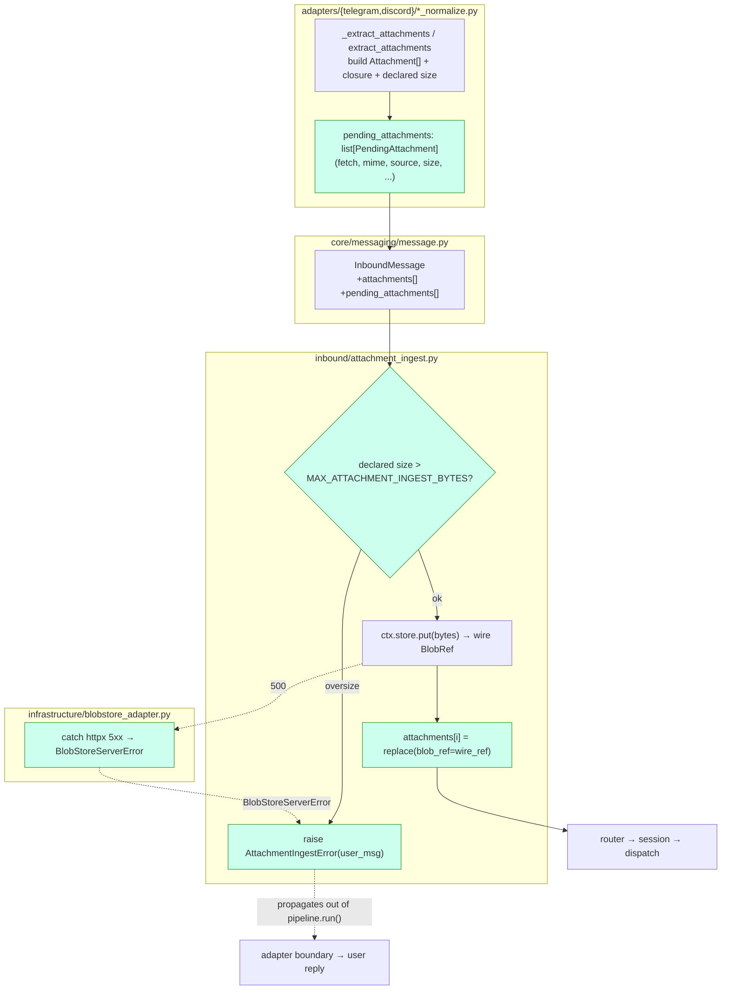
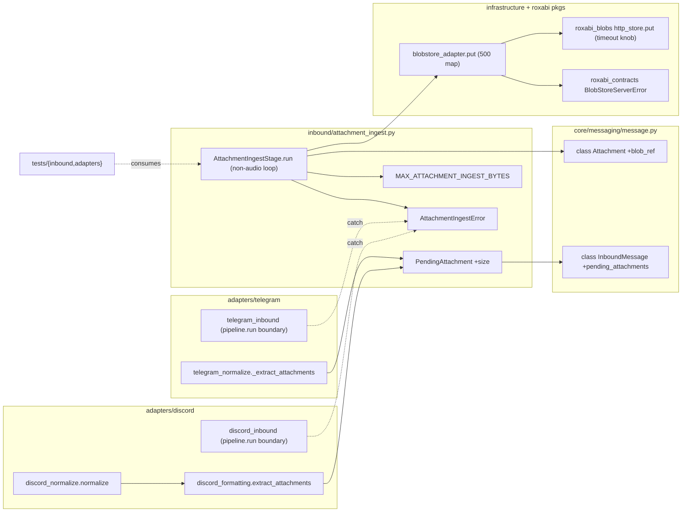

## Summary

Extend the central `AttachmentIngestStage` (#1551) to non-audio attachments
(image/document/video/sticker/animation/GIF) on Telegram + Discord. Today the stage's
non-audio branch (`attachment_ingest.py:95-97`) **stores the blob but discards the
returned `wire_ref`**, and `normalize()` never sets a pending descriptor → the branch is
dead for real traffic. This plan adds the `Attachment.blob_ref` wire field, a
multi-attachment pending carrier, a pre-download size guard, an HTTP-500→user-error map,
and wires both adapters to emit fetch closures.

## Design decisions (resolved at plan gate, 2026-05-31)

| # | Decision | Resolution |
|---|---|---|
| D1 | attachment multiplicity | **Full multi.** Add `InboundMessage.pending_attachments: list[Any]` (transient, `repr=False`, NATS-cleared), index-aligned with `attachments`. Stage iterates + stamps each `attachments[i].blob_ref`. Voice singular `pending_attachment` untouched (no regression). |
| D2 | size-guard + user-error placement | **Stage-owns + raise-to-boundary.** Declared `size` rides on `PendingAttachment`; stage enforces `MAX_ATTACHMENT_INGEST_BYTES` **before** fetch + catches typed 500; signals via `raise AttachmentIngestError(user_message)`; each adapter's `pipeline.run()` call-site catches → replies via its existing reply helper. Stage stays platform-agnostic. V1 limitation: a mixed text+oversize message is dropped wholesale (rare; follow-up). |
| D3 | typed 500 at infra seam | `HttpBlobStoreAdapter.put` catches `httpx.HTTPStatusError` 5xx → raises `roxabi_contracts.BlobStoreServerError` (mirrors its existing 404→`BlobNotFoundError`), so `lyra.inbound` never imports httpx. |
| D4 | write timeout (parent Open-Q1) | **Construction-time knob** (corrected from per-call): `HttpBlobStore` write timeout reads `LYRA_BLOBSTORE_WRITE_TIMEOUT_S` (default raised 5→30 s) — sufficient for 20 MiB over slow CDN→PUT. No `BlobStorePort` signature change (ADR-067 locked). A higher ceiling is harmless for small audio uploads. |

**Axial guard (carried from parent spec §Slices):** `PendingAttachment.source` is metadata
only — it must never drive a branch in `AttachmentIngestStage.run()`. Stage logic stays
platform-agnostic; only the adapters differ.

## Architecture

### Data flow

### File × function map

## Agents

| Agent instance | Tasks | Files | Subjects |
|---|---|---|---|
| backend-dev-A | T4, T5 | `inbound/attachment_ingest.py`, `packages/roxabi-blobs/.../http_store.py` | stage, blobs |
| backend-dev-B | T2, T3, T15 | `core/messaging/message.py`, `infrastructure/blobstore_adapter.py`, `packages/roxabi-contracts/...`, audit | model, infra |
| backend-dev-C | T8, T9, T12, T13 | `adapters/telegram/{telegram_normalize,telegram_inbound}.py`, `adapters/discord/{discord_formatting,discord_normalize,discord_inbound}.py` | telegram, discord |
| tester-A | T1, T6 | `tests/inbound/test_attachment_ingest_nonaudio.py` | stage |
| tester-B | T7, T10, T11, T14 | `tests/adapters/{telegram,discord}/test_*_nonaudio_ingest.py` | telegram, discord |

## Wave Structure

4 waves, max 4 parallel agents. Elapsed ~4 sequential-equivalent units vs ~15 fully serial.

| Wave | Trigger | Agents | Tasks |
|---|---|---|---|
| 1 | start | 4 ∥ | tester-A: T1 · tester-B: T7→T11 · backend-dev-B: T2→T3 · backend-dev-A: T5 |
| 2 | Wave 1 done | 1 | backend-dev-A: T4 (stage loop — needs T2 model + T3 typed-500) |
| 3 | Wave 2 done | 1 | backend-dev-C: T8→T9→T12→T13 (adapter wiring — needs T4 + T5) |
| 4 | Wave 3 done | 3 ∥ | tester-A: T6 (S5 gate) · tester-B: T10,T14 (S6/S7 gates) · backend-dev-B: T15 (audit + validate) |

### Budget — per task

| Task | Items | Class | Est. ops | Split? |
|---|---|---|---|---|
| T1 unit tests (S5) | 1 | judgmental | 5 | — |
| T2 model fields | 2 | bounded | 3 | — |
| T3 typed-500 seam | 2 | judgmental | 5 | — |
| T4 stage non-audio loop | 1 | judgmental | 6 | — |
| T5 blobs timeout knob | 1 | bounded | 3 | — |
| T6 S5 RED-GATE | 1 | bounded | 2 | — |
| T7 TG e2e tests | 1 | judgmental | 5 | — |
| T8 TG closures | 1 | judgmental | 5 | — |
| T9 TG boundary reply | 1 | bounded | 3 | — |
| T10 S6 RED-GATE | 1 | bounded | 2 | — |
| T11 DC e2e tests | 1 | judgmental | 5 | — |
| T12 DC closures | 1 | judgmental | 5 | — |
| T13 DC boundary reply | 1 | bounded | 3 | — |
| T14 S7 RED-GATE + #1066 note | 1 | bounded | 3 | — |
| T15 audit sites + validate | ~8 sites | judgmental | 6 | — |

**Total estimated ops: ~64** (across 5 instances, no single task > 50).

### Budget — per agent instance

| Instance | Tasks | Σ ops | Subjects | Split? |
|---|---|---|---|---|
| backend-dev-A | T4, T5 | 9 | stage, blobs | — |
| backend-dev-B | T2, T3, T15 | 14 | model, infra | — |
| backend-dev-C | T8, T9, T12, T13 | 16 | telegram, discord | — (4 tasks = cap, 2 subjects) |
| tester-A | T1, T6 | 7 | stage | — |
| tester-B | T7, T10, T11, T14 | 15 | telegram, discord | — (4 tasks = cap, 2 subjects) |

## Consistency Report

Spec success-criteria (1552 spec) → task coverage:

| SC | Covered by |
|---|---|
| real `BlobRef` into `Attachment.blob_ref`, all non-audio types, both platforms | T2, T4, T8, T12 |
| `MAX_ATTACHMENT_INGEST_BYTES` enforced **before** download; reject + log + user error | T4 (guard + raise), T9/T13 (reply) |
| stage catches HTTP 500 → user-facing error (no silent propagation) | T3 (typed seam), T4 (catch+raise), T9/T13 (reply) |
| zero ingest duplication; `source` never branches in stage | T4 (single loop, source = metadata only) |
| all `Attachment` construction sites audited for new field | T15 |
| #1066 closed-as-superseded on merge | T14 (note) + PR linkage |

Untraced tasks: none. Exemptions: D4 timeout (parent Open-Q1, folded into T5).

## Micro-Tasks

### Slice S5 — `Attachment.blob_ref` + stage non-audio + size guard + 500-map (N7,N8)

**T1 [RED] [P] — tester-A — unit tests for non-audio stage**
- File: `tests/inbound/test_attachment_ingest_nonaudio.py`
- Cover: (a) `Attachment.blob_ref` defaults `None`; (b) stage stamps real `blob_ref` for a non-audio pending; (c) oversize declared size → `AttachmentIngestError` raised **and** `fetch` never awaited; (d) `put()` raising `BlobStoreServerError` → `AttachmentIngestError`; (e) N attachments → each `blob_ref` stamped; (f) voice path (`msg.audio` set) unchanged; (g) `pending_attachments` cleared on return (NATS safety).
- Verify: `uv run pytest tests/inbound/test_attachment_ingest_nonaudio.py -q` (RED — fails until T2–T4).
- Spec trace: S5 / SC1-3. Difficulty 3.

**T2 [GREEN] — backend-dev-B — model fields**
- File: `src/lyra/core/messaging/message.py`
- `Attachment`: add `blob_ref: BlobRef | None = None` (import `from roxabi_contracts import BlobRef`). `InboundMessage`: add `pending_attachments: list[Any] = field(default_factory=list, repr=False)` with the same "transient, never serialized, cleared by stage" docstring as `pending_attachment`.
- Verify: `uv run python -c "from lyra.core.messaging.message import Attachment, InboundMessage; a=Attachment(type='image', url_or_path_or_bytes='x', mime_type='image/png'); assert a.blob_ref is None"`
- Spec trace: N7 / S5. Difficulty 2.

**T3 [GREEN] — backend-dev-B — typed 500 at infra seam (D3)**
- Files: `packages/roxabi-contracts/src/roxabi_contracts/` (add `BlobStoreServerError` beside `BlobNotFoundError`, export in `__init__`), `src/lyra/infrastructure/blobstore_adapter.py` (wrap `put` body: `except httpx.HTTPStatusError as e: if e.response.status_code >= 500: raise BlobStoreServerError(...) from e; raise`).
- Verify: `uv run python -c "from roxabi_contracts import BlobStoreServerError"` + `uv run pytest tests/ -k blobstore_adapter -q`
- Spec trace: parent §4, SC "no silent propagation". Difficulty 3.

**T4 [GREEN] — backend-dev-A — stage non-audio loop + const + size + error (N8)**
- File: `src/lyra/inbound/attachment_ingest.py`
- Add module const `MAX_ATTACHMENT_INGEST_BYTES = int(os.environ.get("LYRA_MAX_ATTACHMENT_INGEST_BYTES", 20 * 1024 * 1024))` (mirror `LYRA_MAX_AUDIO_BYTES`). Add `size: int | None = None` to `PendingAttachment`. Add `class AttachmentIngestError(Exception)` carrying `user_message: str`. Implement non-audio path: iterate `msg.pending_attachments`; per item — if `size is not None and size > MAX` → log + `raise AttachmentIngestError("…too large…")` (**before** `fetch`); else `data = await p.fetch()`; `try: ref = await ctx.store.put(...)` `except BlobStoreServerError: raise AttachmentIngestError("…couldn't store…")`; rebuild `attachments[i] = replace(att, blob_ref=ref)`. Always return with `pending_attachments=()`/`[]` cleared. Keep the audio branch as-is. `source` must NOT branch logic.
- Verify: `uv run pytest tests/inbound/test_attachment_ingest_nonaudio.py -q` (now GREEN) + `uv run python -m pytest --co -q tests/inbound >/dev/null`
- Spec trace: N8 / SC1-4. Difficulty 4.

**T5 [GREEN] [P] — backend-dev-A — write-timeout knob (D4, parent Open-Q1)**
- File: `packages/roxabi-blobs/src/roxabi_blobs/http_store.py`
- Make the client write timeout configurable: read `LYRA_BLOBSTORE_WRITE_TIMEOUT_S` (default `30.0`) at client construction (`httpx.Timeout(write=<env>, connect=5.0, read=5.0, pool=5.0)` or equivalent). Document the 20 MiB CDN→PUT rationale.
- Verify: `uv run pytest packages/roxabi-blobs -q`
- Spec trace: parent Open-Q1. Difficulty 2.

**T6 [RED-GATE S5] — tester-A — S5 green + layer clean**
- Verify: `uv run pytest tests/inbound -q` green; `uv run lint-imports` (importlinter) green — **`lyra.inbound` imports neither `httpx` nor `discord`/`aiogram`**; `bash tools/check_file_length.sh` for touched files ≤300.
- Spec trace: SC "import-layers green". Difficulty 2.

### Slice S6 — Wire Telegram non-audio (N9)

**T7 [RED] [P] — tester-B — Telegram e2e**
- File: `tests/adapters/telegram/test_telegram_nonaudio_ingest.py`
- Cover: photo/document update → `normalize()` sets `pending_attachments` (closure + declared `size`); through pipeline → `attachments[0].blob_ref` real before hub; oversize file_size → `AttachmentIngestError` → `bot.send_message` "too large" reply, no hub push.
- Verify: `uv run pytest tests/adapters/telegram/test_telegram_nonaudio_ingest.py -q` (RED).
- Spec trace: S6. Difficulty 3.

**T8 [GREEN] — backend-dev-C — Telegram closures**
- File: `src/lyra/adapters/telegram/telegram_normalize.py`
- `_extract_attachments(adapter, msg)` (add `adapter` param): for each media, build a `PendingAttachment(fetch=<closure: adapter.bot.get_file + download by file_id>, mime=…, source="telegram", size=<media.file_size>, platform_ref=file_id, filename=…)`. `normalize()` sets both `attachments=` and `pending_attachments=`. Keep `lyra.inbound` import of `PendingAttachment` under `TYPE_CHECKING` already present.
- Verify: `uv run pytest tests/adapters/telegram -q -k "attachment or nonaudio"`
- Spec trace: N9 / S6. Difficulty 3.

**T9 [GREEN] — backend-dev-C — Telegram boundary reply**
- File: `src/lyra/adapters/telegram/telegram_inbound.py` (the `pipeline.run(...)` call site in `handle_message`)
- Wrap the pipeline call: `except AttachmentIngestError as e:` → reply with `adapter._msg("attachment_too_large", e.user_message)` via `adapter.bot.send_message(**_make_send_kwargs(...))` (mirror audio-too-large at `:133`), then return.
- Verify: `uv run pytest tests/adapters/telegram -q`
- Spec trace: S6 / D2. Difficulty 2.

**T10 [RED-GATE S6] — tester-B — Telegram green**
- Verify: `uv run pytest tests/adapters/telegram -q` green.
- Spec trace: S6 AC. Difficulty 1.

### Slice S7 — Wire Discord non-audio (N10) — closes #1066

**T11 [RED] [P] — tester-B — Discord e2e**
- File: `tests/adapters/discord/test_discord_nonaudio_ingest.py`
- Cover: message with **multiple** attachments → each `blob_ref` stamped before hub; oversize (`attachment.size`) → `AttachmentIngestError` → channel reply, no hub push.
- Verify: `uv run pytest tests/adapters/discord/test_discord_nonaudio_ingest.py -q` (RED).
- Spec trace: S7 (multi-attachment is the Discord-specific AC). Difficulty 3.

**T12 [GREEN] — backend-dev-C — Discord closures**
- Files: `src/lyra/adapters/discord/discord_formatting.py` (`extract_attachments` → also return paired `PendingAttachment`s: `fetch=<a.read>`, `size=a.size`), `src/lyra/adapters/discord/discord_normalize.py` (set `pending_attachments`). Keep `discord` imports out of `lyra.inbound`.
- Verify: `uv run pytest tests/adapters/discord -q -k "attachment or nonaudio"`
- Spec trace: N10 / S7. Difficulty 3.

**T13 [GREEN] — backend-dev-C — Discord boundary reply**
- File: `src/lyra/adapters/discord/discord_inbound.py` (the `pipeline.run(...)` call site)
- `except AttachmentIngestError as e:` → reply in-channel with `e.user_message`, then return.
- Verify: `uv run pytest tests/adapters/discord -q`
- Spec trace: S7 / D2. Difficulty 2.

**T14 [RED-GATE S7] — tester-B — Discord green + #1066 note**
- Verify: `uv run pytest tests/adapters/discord -q` green. Add PR body line `Closes #1066 as superseded` (linkage at /pr).
- Spec trace: S7 AC + #1066 disposition. Difficulty 1.

### Cross-cutting

**T15 [REFACTOR] — backend-dev-B — audit construction sites + full validate**
- Audit every `Attachment(` construction site (`git grep -n "Attachment("` in `src/` + `tests/`) — additive default means none must change, but confirm. Run full gate suite.
- Verify: `uv run ruff format . && uv run ruff check . && uv run pyright && uv run pytest -q && uv run lint-imports`
- Spec trace: SC "all construction sites audited". Difficulty 3.

## Task Seeding Blueprint

<!-- Used by /implement to seed TaskCreate calls. T-numbers ref within this list. -->

### Wave 1 — no deps, 4 agents ∥

| Task | Agent instance | blockedBy | Subject |
|---|---|---|---|
| T1 | tester-A | — | stage |
| T2 | backend-dev-B | — | model |
| T3 | backend-dev-B | T2 | infra |
| T5 | backend-dev-A | — | blobs |
| T7 | tester-B | — | telegram |
| T11 | tester-B | T7 | discord |

### Wave 2 — after T2,T3,T5

| Task | Agent instance | blockedBy | Subject |
|---|---|---|---|
| T4 | backend-dev-A | T2, T3, T5 | stage |

### Wave 3 — after T4

| Task | Agent instance | blockedBy | Subject |
|---|---|---|---|
| T8 | backend-dev-C | T4 | telegram |
| T9 | backend-dev-C | T8 | telegram |
| T12 | backend-dev-C | T4 | discord |
| T13 | backend-dev-C | T12 | discord |

### Wave 4 — gates + audit

| Task | Agent instance | blockedBy | Subject |
|---|---|---|---|
| T6 | tester-A | T1, T4 | stage |
| T10 | tester-B | T7, T9 | telegram |
| T14 | tester-B | T11, T13 | discord |
| T15 | backend-dev-B | T4, T9, T13 | model |

## Task IDs

<!-- Generated by /plan. Used by /implement to resume tasks on session restart. -->
- T1: 12 — stage (RED unit)
- T2: 13 — model
- T3: 14 — infra (typed 500)
- T4: 15 — stage (non-audio loop)
- T5: 16 — blobs (timeout knob)
- T6: 17 — stage (S5 RED-GATE)
- T7: 18 — telegram (RED e2e)
- T8: 19 — telegram (closures)
- T9: 20 — telegram (boundary reply)
- T10: 21 — telegram (S6 RED-GATE)
- T11: 22 — discord (RED e2e)
- T12: 23 — discord (closures)
- T13: 24 — discord (boundary reply)
- T14: 25 — discord (S7 RED-GATE + #1066)
- T15: 26 — model (audit + validate)
