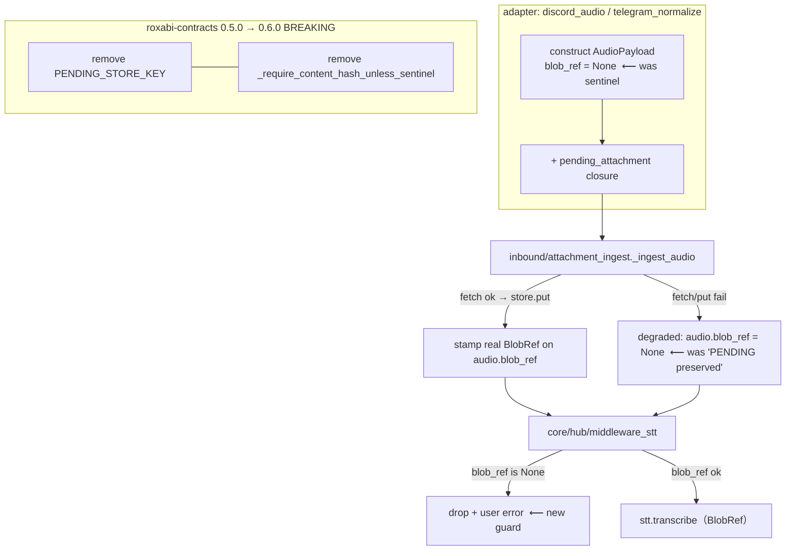

## Summary

Retire the `PENDING_STORE_KEY = "__pending__"` sentinel (a transition-only placeholder now
obsolete after #1551/#1552). The change is **coupled**: removing the public export from
`roxabi-contracts` breaks every importer at once, so all edits land in one PR/commit. Two
`blob_ref` fields flip to Optional (`None` = no/unresolved blob); the consumption guard
swaps the sentinel check for an empty-`store_key` check; the package gets a breaking bump.

## Architecture (data flow — the retired handoff)

## Pinned Decisions

| # | Decision | Resolution |
|---|----------|-----------|
| D1 | `AudioPayload.blob_ref` Optional? | `BlobRef → BlobRef \| None` (audio_payload.py:24). `None` = unresolved/degraded. |
| D2 | `SynthesisResult.blob_ref` Optional? | `BlobRef → BlobRef \| None` (core/ports/tts.py:32). 5 `nats_tts_codec` error branches return `blob_ref=None`; `tts_dispatch.py:250,258` deref only on success (already guarded by `error`/`unavailable`) — **verify**. |
| D3 | Consumption guard (ADR-082) | `blobstore_adapter.py:79`: `wire.store_key == PENDING_STORE_KEY` → `not wire.store_key` (empty `store_key` = contract violation; invariant preserved, `store_key` opaque). |
| D4 | Validator removal safe? | Remove `_require_content_hash_unless_sentinel` (blob_ref.py:83-86). Post-migration **no** `BlobRef` carries `content_hash=""` (all sentinels gone) → the reject-path it guarded is dead. Update `blobstore_adapter.exists()` docstring (its rationale cites this validator). |
| D5 | Breaking bump | `roxabi-contracts` 0.5.0 → 0.6.0. `TtsResponse.blob_ref` already `BlobRef\|None` (models.py:57) + validator has **no** sentinel coupling → no contract-model change beyond the const/validator removal. |

## ⚠ Risk to resolve FIRST (T1 — gates the STT edits)

`simple_agent_prompts.py:137` → `await stt.transcribe(audio_bytes, mime)` passes **raw bytes**
through the `isinstance(audio, bytes)` branch (`nats_stt_client.py:58-66`) that builds a sentinel
`BlobRef`. Neither that helper nor `NatsSttClient` holds a BlobStore handle — the sentinel WAS the
workaround. Removing the bytes branch + narrowing `STTProtocol.transcribe` to `BlobRef` (core/ports/stt.py:18)
breaks this caller.

**T1 must determine, by reading the STT worker path, how bytes currently reach the worker** (inline in
the encoded `SttRequest` vs a blob fetch on `store_key="__pending__"` which cannot resolve), then choose:
- **(a)** migrate `simple_agent_prompts` to store-then-transcribe (needs a `BlobStorePort` threaded in), or
- **(b)** confirm the bytes path is vestigial/broken → delete it + the caller's bytes usage, or
- **(c)** if a real bytes-STT path must survive, escalate — the spec's "remove the bytes branch" premise is then partly invalid.

T1's outcome decides T7's `nats_stt_client` edit. If (a) balloons (DI rework), pause and surface before proceeding.

## Agents

| Instance | Tasks | Files | Subjects |
|----------|-------|-------|----------|
| backend-dev-A | T1–T7 (coupled code sweep, one commit) | contracts pkg, core/ports, core/hub, adapters, inbound, infra, nats, cli | stt, contracts, core, infra, nats |
| tester-A | T8 | tests/ (stt, voice-degraded, guard, grep-gate) | voice-tests |

Single code instance: the contracts-export removal makes T2–T7 atomic (parallel agents would hit
transient broken states + overlapping edits). Mostly mechanical (`sentinel → None`) + D1–D5 judgment.

## Tasks

| T | Description | Files | blockedBy | parallel-safe |
|---|-------------|-------|-----------|---------------|
| T1 | **Resolve STT-bytes risk** (investigate worker path → decide a/b/c) | `agents/simple_agent_prompts.py:137`, `nats/nats_stt_client.py:52-66`, STT worker path | — | N |
| T2 | Remove sentinel + validator; bump 0.6.0 | `roxabi_contracts/blob_ref.py` (17,83-86,docstrings), `__init__.py` (14,28), `voice/builders.py:87`, `pyproject.toml` | T1 | N |
| T3 | Flip both blob_ref types Optional + narrow STT proto | `core/audio_payload.py:24`, `core/ports/tts.py:32`, `core/ports/stt.py:18` | T2 | N |
| T4 | Core consumers: degraded guard + deref safety + docstring | `core/hub/middleware/middleware_stt.py:112-116` (None→drop+error), `core/tts_dispatch.py:250,258` (verify), `core/ports/blobstore.py:47` | T3 | N |
| T5 | Adapters + inbound → `blob_ref=None` | `adapters/discord/discord_audio.py:114-122`, `adapters/telegram/telegram_normalize.py:227+`, `inbound/attachment_ingest.py:157-159,113-115` | T3 | N |
| T6 | Infra guard replacement + docs | `infrastructure/blobstore_adapter.py:79-84,107-118`, `infrastructure/CLAUDE.md:23,30` | T3 | N |
| T7 | NATS + CLI sentinel removal (per T1) | `nats/nats_stt_client.py` (bytes branch), `nats/nats_tts_codec.py` (21,33,90,103,115,127 → None), `cli_voice_smoke.py:17,227` | T1, T3 | N |
| T8 | Tests + grep gate | `tests/**` — STT-real-BlobRef, voice-degraded→None drop+error, guard rejects empty store_key, `grep PENDING_STORE_KEY src/ packages/ = 0`, version bump | T4, T5, T6, T7 | N |

## Wave Structure

2 waves, 2 instances. Elapsed ~1 session (coupled) vs same sequential.

| Wave | Trigger | Agents | Tasks |
|------|---------|--------|-------|
| 1 | start | backend-dev-A | T1→T2→T3→T4→T5→T6→T7 (sequential, one commit) |
| 2 | Wave 1 done | tester-A | T8 |

### Budget — per task

| Task | Items | Class | Est. ops | Split? |
|------|-------|-------|----------|--------|
| T1 | 1 | exploratory | 10 | — |
| T2 | 4 | judgmental | 6 | — |
| T3 | 3 | judgmental | 6 | — |
| T4 | 3 | judgmental | 6 | — |
| T5 | 3 | bounded | 6 | — |
| T6 | 2 | judgmental | 5 | — |
| T7 | 3 | judgmental | 8 | — |
| T8 | 5 | judgmental | 14 | — |

**Total estimated ops: ~61**

### Budget — per agent instance

| Instance | Tasks | Σ ops | Subjects | Split? |
|----------|-------|-------|----------|--------|
| backend-dev-A | T1–T7 | 47 | stt, contracts, core, infra, nats | — (coupled change; subjects share the single `blob_ref` contract — splitting risks mid-state breakage. §6 mechanical-sweep exception applies.) |
| tester-A | T8 | 14 | voice-tests | — |

## Task Seeding Blueprint

<!-- Used by /implement to seed TaskCreate calls on session start. -->

### Wave 1 — no deps, backend-dev-A (sequential chain, one commit)

| Task | Agent instance | blockedBy | Subject |
|------|---------------|-----------|---------|
| T1 | backend-dev-A | — | stt |
| T2 | backend-dev-A | T1 | contracts |
| T3 | backend-dev-A | T2 | core |
| T4 | backend-dev-A | T3 | core |
| T5 | backend-dev-A | T3 | adapters |
| T6 | backend-dev-A | T3 | infra |
| T7 | backend-dev-A | T1,T3 | nats |

### Wave 2 — after Wave 1, tester-A

| Task | Agent instance | blockedBy | Subject |
|------|---------------|-----------|---------|
| T8 | tester-A | T4,T5,T6,T7 | voice-tests |

## Task IDs

<!-- Generated by /plan. Used by /implement to resume tasks on session restart. -->
- T1: 11 — stt (resolve bytes-risk)
- T2: 12 — contracts (remove sentinel + validator, bump 0.6.0)
- T3: 13 — core (blob_ref types Optional + STT proto)
- T4: 14 — core (degraded guard + deref safety)
- T5: 15 — adapters (adapters + inbound → None)
- T6: 16 — infra (guard replacement)
- T7: 17 — nats (nats + cli sentinel removal)
- T8: 18 — voice-tests (tests + grep gate)
