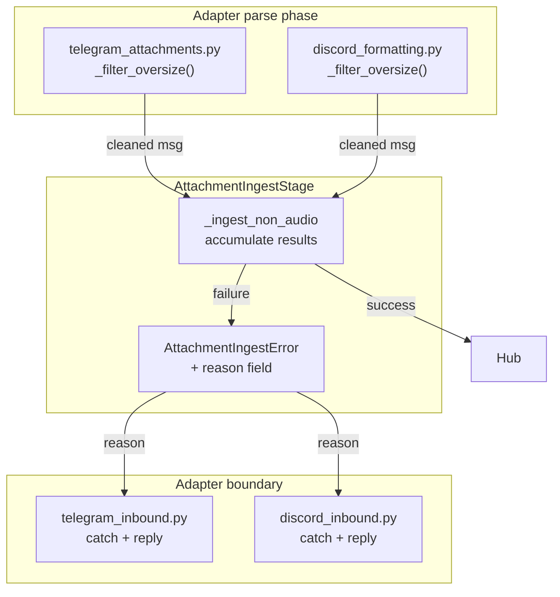
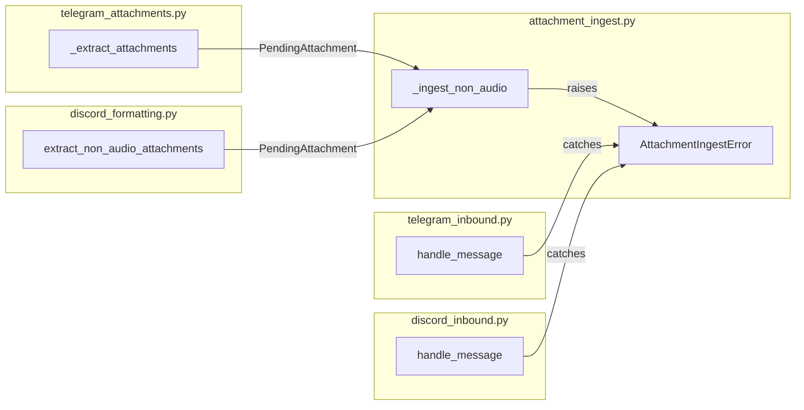

## Summary

Refactor `AttachmentIngestError` to carry a machine-readable `reason`, move the oversize guard to adapter parse phase (text preserved), and make `_ingest_non_audio` accumulate per-item results before raising a summary error. Five files across two platforms + tests.

## Architecture

### Data flow

### File × Function map

## Bootstrap Context

- `MAX_ATTACHMENT_INGEST_BYTES` is an env-var in `attachment_ingest.py` (default 20 MiB).
- `PendingAttachment` carries `size` (declared by platform). Both Telegram and Discord set it.
- `AttachmentIngestError` is caught at adapter boundary (not in pipeline).
- Audio path (`_ingest_audio`) degrades to `blob_ref=None` on any error — untouched by this plan.

## Agents

| Agent | Tasks | Files | Subjects |
|-------|-------|-------|----------|
| backend-dev-A | T1, T3 | `attachment_ingest.py` | error |
| backend-dev-B | T2, T11–T13 | `attachment_ingest.py` | error, ingest |
| backend-dev-C | T4–T7 | `telegram_attachments.py`, `telegram_inbound.py` | telegram, attachments |
| backend-dev-D | T8–T10 | `discord_formatting.py`, `discord_inbound.py` | discord, inbound |
| tester-A | T14–T17 | test files | test |

## Wave Structure

3 waves, max 4 parallel agents. Estimated ~30 min sequential vs ~15 min parallel.

| Wave | Trigger | Agents | Tasks |
|------|---------|--------|-------|
| 1 | start | backend-dev-A | T1 |
| 2 | T1 done | backend-dev-B, C, D ∆ | T2, T11–T13 + T4–T10 |
| 3 | Wave 2 done | tester-A | T14–T17 |

### Budget — per task

| Task | Items | Class | Est. ops | Split? |
|------|-------|-------|----------|--------|
| T1 | 1 | bounded | 3 | — |
| T2 | 3 | bounded | 3 | — |
| T3 | 1 | trivial | 1 | — |
| T4 | 1 | bounded | 3 | — |
| T5 | 5 | judgmental | 6 | — |
| T6 | 1 | judgmental | 6 | — |
| T7 | 1 | bounded | 3 | — |
| T8 | 1 | bounded | 3 | — |
| T9 | 1 | judgmental | 6 | — |
| T10 | 1 | bounded | 3 | — |
| T11 | 1 | judgmental | 6 | — |
| T12 | 1 | bounded | 3 | — |
| T13 | 1 | bounded | 3 | — |
| T14 | 1 | judgmental | 5 | — |
| T15 | 1 | judgmental | 5 | — |
| T16 | 1 | judgmental | 5 | — |
| T17 | 1 | judgmental | 5 | — |

**Total estimated ops: 62**

### Budget — per agent instance

| Instance | Tasks | Σ ops | Subjects | Split? |
|----------|-------|--------|----------|--------|
| backend-dev-A | T1, T3 | 4 | error | — |
| backend-dev-B | T2, T11–T13 | 15 | error, ingest | — |
| backend-dev-C | T4–T7 | 15 | telegram, attachments | — |
| backend-dev-D | T8–T10 | 12 | discord, inbound | — |
| tester-A | T14–T17 | 20 | test | — |

## Consistency Report

| Spec criterion | Covered by | Status |
|----------------|----------|--------|
| SC-1: `reason` field | T1 | ✓ |
| SC-2: All raise sites pass reason | T2, T3 | ✓ |
| SC-3: Telegram filter | T4, T5 | ✓ |
| SC-4: Discord filter | T8 | ✓ |
| SC-5: "too large" reply | T6, T9 | ✓ |
| SC-6: Graceful drop (no text) | T7, T10 | ✓ |
| SC-7: Accumulate results | T11 | ✓ |
| SC-8: Preserve earlier attachments | T11, T13 | ✓ |
| SC-9: Post-fetch = storage_error | T2 | ✓ |
| SC-10: Audio path unchanged | T14–T17 | ✓ |
| SC-11: No error from audio | T14–T17 | ✓ |

**Covered: 11/11 | Uncovered: 0 | Untraced: 0 | Exemptions: 0**

## Micro-Tasks

### S1 — Error type (A4)

| ID | Description | File | Agent | Slice | Phase | `[P]` |
|----|-------------|------|-------|-------|-------|-------|
| T1 | Add `reason: Literal["oversize", "storage_error"]` to `AttachmentIngestError` | `attachment_ingest.py` | backend-dev-A | S1 | RED | — |
| T2 | Update all 3 raise sites in `_ingest_non_audio` to pass correct `reason` | `attachment_ingest.py` | backend-dev-B | S1 | GREEN | — |
| T3 | Verify no other `AttachmentIngestError` raise sites exist (grep) | `src/` | backend-dev-A | S1 | RED-GATE | — |

### S2 — Telegram adapter (A1)

| ID | Description | File | Agent | Slice | Phase | `[P]` |
|----|-------------|------|-------|-------|-------|-------|
| T4 | Import `MAX_ATTACHMENT_INGEST_BYTES` into `telegram_attachments.py` | `telegram_attachments.py` | backend-dev-C | S2 | RED | — |
| T5 | Filter oversize attachments in `_extract_attachments` (skip items > MAX) | `telegram_attachments.py` | backend-dev-C | S2 | GREEN | — |
| T6 | Send "too large" reply when oversize attachments filtered | `telegram_inbound.py` | backend-dev-C | S2 | GREEN | — |
| T7 | Handle no-text + only-oversize: drop gracefully (return, no pipeline) | `telegram_inbound.py` | backend-dev-C | S2 | GREEN | — |

### S3 — Discord adapter (A1)

| ID | Description | File | Agent | Slice | Phase | `[P]` |
|----|-------------|------|-------|-------|-------|-------|
| T8 | Filter oversize attachments in `extract_non_audio_attachments` | `discord_formatting.py` | backend-dev-D | S3 | GREEN | — |
| T9 | Send "too large" reply when oversize attachments filtered | `discord_inbound.py` | backend-dev-D | S3 | GREEN | — |
| T10 | Handle no-text + only-oversize: drop gracefully (return, no pipeline) | `discord_inbound.py` | backend-dev-D | S3 | GREEN | — |

### S4 — Accumulate results (A2)

| ID | Description | File | Agent | Slice | Phase | `[P]` |
|----|-------------|------|-------|-------|-------|-------|
| T11 | Refactor `_ingest_non_audio` loop to accumulate per-item results | `attachment_ingest.py` | backend-dev-B | S4 | RED | — |
| T12 | Create `AttachmentResult` dataclass (success/failure + blob_ref) | `attachment_ingest.py` | backend-dev-B | S4 | RED | — |
| T13 | Stamp successful blob_refs before raising summary `AttachmentIngestError` | `attachment_ingest.py` | backend-dev-B | S4 | GREEN | — |

### S5 — Integration tests

| ID | Description | File | Agent | Slice | Phase | `[P]` |
|----|-------------|------|-------|-------|-------|-------|
| T14 | Test text+oversize: message reaches hub with text preserved | test | tester-A | S5 | GREEN | — |
| T15 | Test partial failure: earlier attachments preserved on storage error | test | tester-A | S5 | GREEN | — |
| T16 | Test `AttachmentIngestError` reason field is populated correctly | test | tester-A | S5 | GREEN | — |
| T17 | Test adapter oversize filter: oversize removed, text proceeds | test | tester-A | S5 | GREEN | — |

## Task Seeding Blueprint

### Wave 1 — no deps, 1 agent

| Task | Agent instance | blockedBy | Subject |
|------|---------------|-----------|---------|
| T1 | backend-dev-A | — | error |
| T3 | backend-dev-A | — | error |

### Wave 2 — after T1, 3 agents ∆

| Task | Agent instance | blockedBy | Subject |
|------|---------------|-----------|---------|
| T2 | backend-dev-B | T1 | error |
| T11 | backend-dev-B | T1 | ingest |
| T12 | backend-dev-B | T1 | ingest |
| T13 | backend-dev-B | T11 | ingest |
| T4 | backend-dev-C | T1 | telegram |
| T5 | backend-dev-C | T4 | attachments |
| T6 | backend-dev-C | T5 | telegram |
| T7 | backend-dev-C | T5 | telegram |
| T8 | backend-dev-D | T1 | discord |
| T9 | backend-dev-D | T8 | discord |
| T10 | backend-dev-D | T8 | discord |

### Wave 3 — after Wave 2, 1 agent

| Task | Agent instance | blockedBy | Subject |
|------|---------------|-----------|---------|
| T14 | tester-A | T2, T13 | test |
| T15 | tester-A | T2, T13 | test |
| T16 | tester-A | T2, T13 | test |
| T17 | tester-A | T2, T13 | test |

## Task IDs

<!-- Generated by /plan. Used by /implement to resume tasks on session restart. -->
- T1: #9 — error
- T2: #10 — error
- T3: #11 — error
- T4: #12 — telegram
- T5: #13 — attachments
- T6: #14 — telegram
- T7: #15 — telegram
- T8: #16 — discord
- T9: #17 — discord
- T10: #18 — discord
- T11: #19 — ingest
- T12: #20 — ingest
- T13: #21 — ingest
- T14: #22 — test
- T15: #23 — test
- T16: #24 — test
- T17: #25 — test
