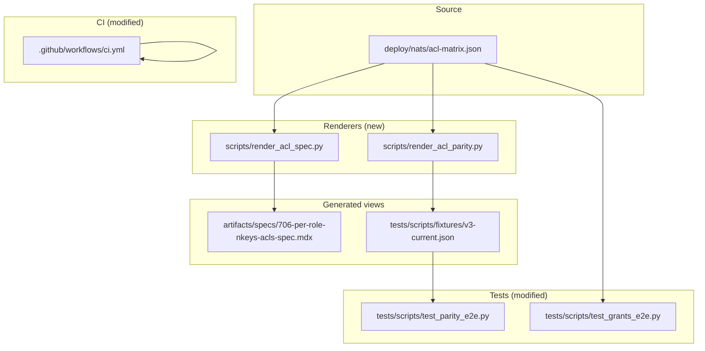
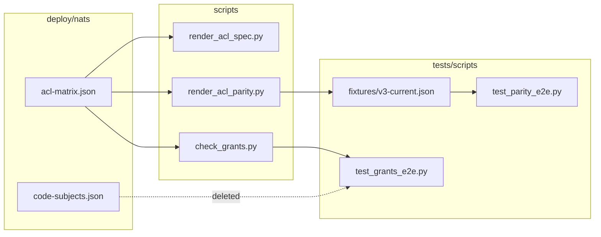

## Summary

Generate 2 Python renderer scripts from existing shell logic, fold code-subjects assertions into e2e tests, and retire the manual-sync CI drift gate. All generated views derive from `acl-matrix.json` at build/test time.

## Architecture

## Agents

| Agent | Tasks | Files | Subject diversity |
|---|---|---|---|
| **backend-dev-A** | T1, T3, T8 | `scripts/render_acl_spec.py`, `scripts/render_acl_parity.py`, `scripts/check_grants.py` | renderer, grants |
| **tester-A** | T5, T6, T7, T12 | `tests/scripts/test_parity_e2e.py`, `tests/scripts/test_grants_e2e.py`, `tests/scripts/fixtures/` | e2e, fixture |
| **devops-A** | T9, T10, T11 | `.github/workflows/ci.yml`, `Makefile`, `artifacts/specs/706-per-role-nkeys-acls-spec.mdx` | ci, makefile, docs |

## Wave Structure

4 waves, max 3 parallel agents. Elapsed ~1 day vs ~3 days sequential.

| Wave | Trigger | Agents | Tasks |
|------|---------|--------|-------|
| 1 | start | 3 ∥ | backend-dev-A: T1 · T3 · devops-A: T11 · tester-A: T7 |
| 2 | Wave 1 done | 2 ∥ | backend-dev-A: T2 · T4 · tester-A: T5 |
| 3 | Wave 2 done | 2 ∥ | backend-dev-A: T8 · tester-A: T6 |
| 4 | Wave 3 done | 2 ∥ | devops-A: T9 · T10 · tester-A: T12 |

### Budget — per task

| Task | Items | Class | Est. ops | Split? |
|------|-------|-------|----------|--------|
| T1 | 1 | bounded | 3 | — |
| T2 | 1 | trivial | 2 | — |
| T3 | 1 | bounded | 3 | — |
| T4 | 1 | trivial | 2 | — |
| T5 | 1 | judgmental | 5 | — |
| T6 | 1 | judgmental | 5 | — |
| T7 | 1 | trivial | 1 | — |
| T8 | 1 | judgmental | 5 | — |
| T9 | 1 | trivial | 2 | — |
| T10 | 1 | trivial | 2 | — |
| T11 | 1 | trivial | 1 | — |
| T12 | 1 | bounded | 3 | — |

**Total estimated ops: 34**

### Budget — per agent instance

| Instance | Tasks | Σ ops | Subjects | Split? |
|----------|-------|-------|----------|--------|
| backend-dev-A | T1, T2, T3, T4, T8 | 18 | renderer, grants | — |
| tester-A | T5, T6, T7, T12 | 14 | e2e, fixture | — |
| devops-A | T9, T10, T11 | 5 | ci, makefile, docs | — |

## Consistency Report

| Spec criterion | Covered by task | Trace |
|---|---|---|
| `scripts/render_acl_spec.py` exists | T1 | SC-1 |
| Generates spec table from acl-matrix.json | T1, T2 | SC-1 |
| `scripts/render_acl_parity.py` exists | T3 | SC-2 |
| Generates effective-JSON parity fixture | T3, T4 | SC-2 |
| `tests/scripts/fixtures/v3-current.json` auto-generated | T3, T4 | SC-3 |
| `test_parity_e2e.py` uses generated fixture | T5 | SC-3 |
| `deploy/nats/code-subjects.json` deleted | T7 | SC-4 |
| code-subjects assertions folded into e2e | T6 | SC-4 |
| `check_grants.py` retired or refactored | T8 | SC-5 |
| `check-acl-matrix-spec.sh` removed from CI | T9 | SC-6 |
| `check-acl-authconf-drift.sh` remains | T9 | SC-7 |
| `check_subject_literals.py` remains | T9 | SC-8 |
| `check_acl_matrix_retired.py` remains | T9 | SC-9 |
| README or Makefile target for regeneration | T10 | SC-10 |
| Spec table header notes auto-generated | T11 | — |

**Coverage:** 14/14 criteria covered. 0 untraced, 0 uncovered.

## Micro-Tasks

### Slice S1 — Spec table renderer

#### T1: Create `scripts/render_acl_spec.py`

- **Description:** Extract the table-rendering logic from `scripts/check-acl-matrix-spec.sh` into a standalone Python script. The script reads `deploy/nats/acl-matrix.json`, computes effective ACLs (group expansion + request_reply_flows inbox derivation), and writes the markdown table into the sentinel block of `artifacts/specs/706-per-role-nkeys-acls-spec.mdx`.
- **Files:** `scripts/render_acl_spec.py` (new)
- **Code snippet:** Reuses `scripts/_loader.py` (`load_matrix`) and `scripts/_effective.py` (`effective_grants`) for consistency.
- **Verify command:** `uv run python scripts/render_acl_spec.py --dry-run` (prints table to stdout without writing)
- **Expected output:** Markdown table with subjects as rows, identities as columns, cells showing PUB/SUB/PUB+SUB/—
- **Time estimate:** 5 min
- **Agent:** backend-dev-A
- **Subject:** renderer
- **Phase:** RED
- **Spec trace:** SC-1, U2

#### T2: Run `render_acl_spec.py` and verify

- **Description:** Run the script in update mode and verify the generated spec table matches the current manual table (or diff shows expected improvements). Use `git diff` to inspect changes.
- **Files:** `artifacts/specs/706-per-role-nkeys-acls-spec.mdx`
- **Verify command:** `uv run python scripts/render_acl_spec.py && git diff artifacts/specs/706-per-role-nkeys-acls-spec.mdx`
- **Expected output:** Diff shows sentinel block updated with generated table; no other changes
- **Time estimate:** 3 min
- **Agent:** backend-dev-A
- **Subject:** renderer
- **Phase:** RED-GATE
- **Spec trace:** SC-1

#### T11: Update spec header to note auto-generated

- **Description:** Add a comment at the top of `706-per-role-nkeys-acls-spec.mdx` (above the sentinel block) stating that the ACL table is auto-generated from `acl-matrix.json` via `scripts/render_acl_spec.py` and should not be edited manually.
- **Files:** `artifacts/specs/706-per-role-nkeys-acls-spec.mdx`
- **Verify command:** `head -5 artifacts/specs/706-per-role-nkeys-acls-spec.mdx`
- **Expected output:** Contains "Auto-generated" or "DO NOT EDIT" comment
- **Time estimate:** 2 min
- **Agent:** devops-A
- **Subject:** docs
- **Phase:** REFACTOR
- **Spec trace:** —

### Slice S2 — Parity fixture renderer

#### T3: Create `scripts/render_acl_parity.py`

- **Description:** Extract the effective-JSON computation from `scripts/check-acl-matrix-spec.sh` (Pass 1: group expansion + Pass 2: inbox derivation) into a standalone Python script. The script writes the effective JSON to `tests/scripts/fixtures/v3-current.json` (or stdout).
- **Files:** `scripts/render_acl_parity.py` (new)
- **Code snippet:** Reuses `scripts/_loader.py` and `scripts/_effective.py` for consistency.
- **Verify command:** `uv run python scripts/render_acl_parity.py --dry-run | head -20`
- **Expected output:** JSON with `identities` and `groups` fields expanded
- **Time estimate:** 5 min
- **Agent:** backend-dev-A
- **Subject:** renderer
- **Phase:** RED
- **Spec trace:** SC-2, SC-3, U3

#### T4: Generate parity fixture and verify

- **Description:** Run `render_acl_parity.py` to generate `tests/scripts/fixtures/v3-current.json`. Compare with existing `v2-prod.json` to ensure structural parity.
- **Files:** `tests/scripts/fixtures/v3-current.json` (new)
- **Verify command:** `uv run python scripts/render_acl_parity.py > tests/scripts/fixtures/v3-current.json && python -c "import json; d=json.load(open('tests/scripts/fixtures/v3-current.json')); print(len(d['identities']), 'identities')"`
- **Expected output:** JSON valid, contains same active identities as live matrix
- **Time estimate:** 3 min
- **Agent:** backend-dev-A
- **Subject:** fixture
- **Phase:** RED-GATE
- **Spec trace:** SC-2, SC-3

### Slice S3 — Fold code-subjects into e2e

#### T5: Modify `test_parity_e2e.py` to use generated fixture

- **Description:** Update `tests/scripts/test_parity_e2e.py` to load `tests/scripts/fixtures/v3-current.json` (generated from live matrix) instead of the hardcoded `v2-prod.json`. The test should still render auth.conf and boot nats-server.
- **Files:** `tests/scripts/test_parity_e2e.py`
- **Code snippet:** Replace `matrix_path = REPO_ROOT / "tests/scripts/fixtures/v2-prod.json"` with `matrix_path = REPO_ROOT / "tests/scripts/fixtures/v3-current.json"`
- **Verify command:** `uv run pytest tests/scripts/test_parity_e2e.py -v -k "test_rendered_auth_conf_parses_correctly"`
- **Expected output:** Test passes with v3-current.json
- **Time estimate:** 5 min
- **Agent:** tester-A
- **Subject:** e2e
- **Phase:** RED
- **Spec trace:** SC-3, U4

#### T6: Fold code-subjects assertions into e2e test

- **Description:** Move `scripts/check_grants.py` assertions into a new `tests/scripts/test_grants_e2e.py` that reads `deploy/nats/acl-matrix.json` directly (not `code-subjects.json`). The test validates that all required subjects from the matrix are covered by the appropriate identities.
- **Files:** `tests/scripts/test_grants_e2e.py` (new), `tests/scripts/test_parity_e2e.py` (modified)
- **Code snippet:** Import `check_grants.py` logic or extract the core validation into a testable function.
- **Verify command:** `uv run pytest tests/scripts/test_grants_e2e.py -v`
- **Expected output:** All grants assertions pass without `code-subjects.json`
- **Time estimate:** 5 min
- **Agent:** tester-A
- **Subject:** e2e
- **Phase:** RED
- **Spec trace:** SC-4, SC-5, U4

#### T7: Delete `deploy/nats/code-subjects.json`

- **Description:** Remove the `code-subjects.json` file since its assertions are now covered by the e2e test.
- **Files:** `deploy/nats/code-subjects.json` (deleted)
- **Verify command:** `ls deploy/nats/code-subjects.json`
- **Expected output:** File not found
- **Time estimate:** 1 min
- **Agent:** tester-A
- **Subject:** fixture
- **Phase:** RED
- **Spec trace:** SC-4

#### T8: Modify or retire `scripts/check_grants.py`

- **Description:** Refactor `scripts/check_grants.py` to read from `acl-matrix.json` directly (remove `code-subjects.json` dependency), OR retire it if all its assertions are now covered by `test_grants_e2e.py`. If retired, update any CI references.
- **Files:** `scripts/check_grants.py`
- **Verify command:** `uv run python scripts/check_grants.py --help` (if kept) or `grep -r "check_grants" .github/workflows/` (if retired)
- **Expected output:** Script runs without `code-subjects.json` OR no CI references remain
- **Time estimate:** 5 min
- **Agent:** backend-dev-A
- **Subject:** grants
- **Phase:** RED
- **Spec trace:** SC-5

### Slice S4 — CI gate cleanup

#### T9: Remove `check-acl-matrix-spec.sh` from CI

- **Description:** Remove the `check-acl-matrix-spec.sh` step from `.github/workflows/ci.yml`. Ensure `check-acl-authconf-drift.sh`, `check_subject_literals.py`, and `check_acl_matrix_retired.py` remain.
- **Files:** `.github/workflows/ci.yml`
- **Verify command:** `grep -c "check-acl-matrix-spec" .github/workflows/ci.yml || echo 0`
- **Expected output:** `0` (no references)
- **Time estimate:** 2 min
- **Agent:** devops-A
- **Subject:** ci
- **Phase:** RED
- **Spec trace:** SC-6, SC-7, SC-8, SC-9

#### T10: Add Makefile target for regeneration

- **Description:** Add a `make regen-acl` target (or `make nats-regen`) that runs `render_acl_spec.py` and `render_acl_parity.py` in sequence. Document the target in the root README or Makefile comments.
- **Files:** `Makefile` (or `pyproject.toml` if no Makefile)
- **Verify command:** `make regen-acl --dry-run` (or equivalent)
- **Expected output:** Commands listed for both renderers
- **Time estimate:** 2 min
- **Agent:** devops-A
- **Subject:** makefile
- **Phase:** REFACTOR
- **Spec trace:** SC-10

#### T12: Run full test suite

- **Description:** Run the full test suite for the scripts/tests directory to verify nothing is broken.
- **Files:** `tests/scripts/`
- **Verify command:** `uv run pytest tests/scripts/ -v`
- **Expected output:** All tests pass
- **Time estimate:** 3 min
- **Agent:** tester-A
- **Subject:** e2e
- **Phase:** GREEN
- **Spec trace:** —

## Task Seeding Blueprint

<!-- Used by /implement to seed TaskCreate calls on session start.
     Format: T{n} | agent-instance | blockedBy | subject
     blockedBy refs T-numbers within this list (not session task IDs).
     Agent instances are named (tester-A/B, backend-dev-A/B, devops-A)
     so parallel tasks map to distinct spawned agents.
     Seed in wave order; within a wave all rows are parallel (∥). -->

### Wave 1 — no deps, 3 agents ∥

| Task | Agent instance | blockedBy | Subject |
|------|---------------|-----------|---------|
| T1 | backend-dev-A | — | renderer |
| T3 | backend-dev-A | — | renderer |
| T7 | tester-A | — | fixture |
| T11 | devops-A | — | docs |

### Wave 2 — after Wave 1, 2 agents ∥

| Task | Agent instance | blockedBy | Subject |
|------|---------------|-----------|---------|
| T2 | backend-dev-A | T1 | renderer |
| T4 | backend-dev-A | T3 | fixture |
| T5 | tester-A | T7 | e2e |

### Wave 3 — after Wave 2, 2 agents ∥

| Task | Agent instance | blockedBy | Subject |
|------|---------------|-----------|---------|
| T6 | tester-A | T5 | e2e |
| T8 | backend-dev-A | T4 | grants |

### Wave 4 — after Wave 3, 2 agents ∥

| Task | Agent instance | blockedBy | Subject |
|------|---------------|-----------|---------|
| T9 | devops-A | T6, T8 | ci |
| T10 | devops-A | T8 | makefile |
| T12 | tester-A | T9, T10 | e2e |

## Task IDs

<!-- Generated by /plan. Used by /implement to resume tasks on session restart. -->
- T1: 11 — renderer
- T2: 15 — renderer
- T3: 12 — renderer
- T4: 16 — fixture
- T5: 17 — e2e
- T6: 18 — e2e
- T7: 13 — fixture
- T8: 19 — grants
- T9: 20 — ci
- T10: 21 — makefile
- T11: 14 — docs
- T12: 22 — e2e
