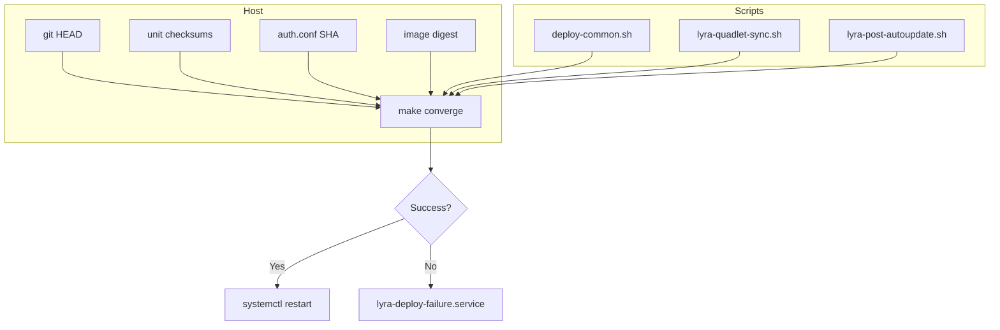
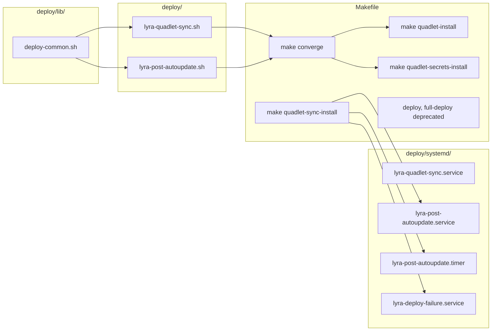

## Summary

Implement `make converge` as the single atomic deploy verb for Lyra on M₁. Wire it to both the existing sync timer (`lyra-quadlet-sync`) and a new autoupdate digest poll (`lyra-post-autoupdate`). Add `flock` concurrency guard, `OnFailure` journal notification, and PATH fix for `.venv/bin`.

## Architecture

### Data Flow

### File x Function Map

## Bootstrap Context

From [analysis](artifacts/analyses/1578-collapse-deploy-atomic-analysis.mdx): Shape 2 recommended. The new `make converge` target is change-gated, idempotent, and atomic. `flock -n` prevents concurrency. `lyra-post-autoupdate` replaces `podman-auto-update` for lyra units by polling digest directly. PATH fix includes `.venv/bin`.

## Agents

| Agent | Task count | Files |
|-------|-----------|-------|
| devops-A | 6 | Makefile, deploy/lib/deploy-common.sh, deploy/lyra-quadlet-sync.sh |
| devops-B | 5 | deploy/systemd/*, deploy/quadlet/*.container |
| doc-writer | 1 | deploy/CLAUDE.md |
| tester | 5 | Verification scripts |

## Wave Structure

4 waves, max 3 parallel agents. Elapsed ~1 day vs ~3 days sequential.

| Wave | Trigger | Agents | Tasks |
|------|---------|--------|-------|
| 1 | start | 3 ∥ | devops-A: T1→T2→T3 · devops-B: T5→T7→T8→T9 · doc-writer: T12 |
| 2 | Wave 1 done | 2 ∥ | devops-A: T4→T10→T11 · devops-B: T6 |
| 3 | Wave 2 done | 1 | devops-B: T13 |
| 4 | Wave 3 done | 1 | tester: T14→T15→T16→T17→T18 |

### Budget — per task

| Task | Items | Class | Est. ops | Split? |
|------|-------|-------|----------|--------|
| T1 deploy-common.sh | 1 | bounded | 3 | — |
| T2 make converge | 1 | judgmental | 6 | — |
| T3 restart list | 1 | trivial | 1 | — |
| T4 sync script | 1 | bounded | 3 | — |
| T5 sync service PATH | 1 | trivial | 1 | — |
| T6 post-autoupdate script | 1 | judgmental | 5 | — |
| T7 post-autoupdate service | 1 | bounded | 2 | — |
| T8 post-autoupdate timer | 1 | trivial | 1 | — |
| T9 failure service | 1 | bounded | 2 | — |
| T10 quadlet-sync-install | 1 | bounded | 2 | — |
| T11 deprecate targets | 1 | trivial | 1 | — |
| T12 update docs | 1 | bounded | 2 | — |
| T13 remove labels | 1 | trivial | 2 | — |
| T14 verify converge | 1 | bounded | 3 | — |
| T15 verify idempotency | 1 | bounded | 2 | — |
| T16 verify flock | 1 | bounded | 2 | — |
| T17 verify change detection | 1 | bounded | 2 | — |
| T18 verify PATH | 1 | bounded | 2 | — |

**Total estimated ops: 40**

### Budget — per agent instance

| Instance | Tasks | Σ ops | Subjects | Split? |
|----------|-------|-------|----------|--------|
| devops-A | T1, T2, T3, T4, T10, T11 | 16 | deploy-script, makefile | — |
| devops-B | T5, T6, T7, T8, T9, T13 | 13 | systemd, container-config | — |
| doc-writer | T12 | 2 | docs | — |
| tester | T14-T18 | 11 | verification | — |

## Consistency Report

- Criteria covered: 17/17
- Uncovered criteria: none
- Tasks without spec backing: none
- Gold plating exemptions applied: 0

## Micro-Tasks

### Slice V1: make converge target + shared library

#### Task 1: Create deploy/lib/deploy-common.sh [P] → devops-A
- **File:** `deploy/lib/deploy-common.sh`
- **Snippet:** `flock -n /run/user/$(id -u)/lyra-deploy.lock ...`
- **Verify:** `bash -n deploy/lib/deploy-common.sh`
- **Expected:** no syntax errors
- **Time:** 3 min
- **Difficulty:** 2
- **Traces:** SC-5, SC-6
- **Phase:** RED

#### Task 2: Add make converge to Makefile → devops-A
- **File:** `Makefile`
- **Snippet:** `converge: ...` with change detection, git pull, NO_RESTART=1, regen, secrets, restart
- **Verify:** `make -n converge` (dry run)
- **Expected:** shows all commands without errors
- **Time:** 6 min
- **Difficulty:** 3
- **Traces:** SC-1, SC-2, SC-3, SC-4, SC-15
- **Phase:** RED

#### Task 3: Add lyra-blobstore to restart list → devops-A
- **File:** `Makefile`
- **Snippet:** `LYRA_RESTART_UNITS := lyra-hub ... lyra-blobstore`
- **Verify:** `grep lyra-blobstore Makefile`
- **Expected:** line found
- **Time:** 1 min
- **Difficulty:** 1
- **Traces:** SC-16
- **Phase:** RED

#### RED-GATE: V1 complete → tester
- **Verify:** T1-T3 marked complete
- **Phase:** RED-GATE

### Slice V2: Sync script wiring

#### Task 4: Modify lyra-quadlet-sync.sh → devops-A
- **File:** `deploy/lyra-quadlet-sync.sh`
- **Snippet:** `source deploy/lib/deploy-common.sh; converge_if_changed`
- **Verify:** `bash -n deploy/lyra-quadlet-sync.sh`
- **Expected:** no syntax errors
- **Time:** 3 min
- **Difficulty:** 2
- **Traces:** SC-7
- **Phase:** RED

#### Task 5: Fix PATH in sync service → devops-B
- **File:** `deploy/systemd/lyra-quadlet-sync.service`
- **Snippet:** `Environment="PATH=%h/projects/lyra/.venv/bin:%h/.local/bin:..."`
- **Verify:** `grep .venv/bin deploy/systemd/lyra-quadlet-sync.service`
- **Expected:** line found
- **Time:** 1 min
- **Difficulty:** 1
- **Traces:** SC-8
- **Phase:** RED

#### RED-GATE: V2 complete → tester
- **Verify:** T4-T5 marked complete
- **Phase:** RED-GATE

### Slice V3: Autoupdate digest poll

#### Task 6: Create lyra-post-autoupdate.sh → devops-A
- **File:** `deploy/lyra-post-autoupdate.sh`
- **Snippet:** `skopeo inspect docker://ghcr.io/roxabi/lyra:staging-svc | jq -r '.Digest'`
- **Verify:** `bash -n deploy/lyra-post-autoupdate.sh`
- **Expected:** no syntax errors
- **Time:** 5 min
- **Difficulty:** 3
- **Traces:** SC-9, SC-10
- **Phase:** RED

#### Task 7: Create lyra-post-autoupdate.service → devops-B
- **File:** `deploy/systemd/lyra-post-autoupdate.service`
- **Snippet:** `[Service] Type=oneshot ExecStart=...`
- **Verify:** `grep -q "lyra-post-autoupdate.sh" deploy/systemd/lyra-post-autoupdate.service`
- **Expected:** line found
- **Time:** 2 min
- **Difficulty:** 1
- **Traces:** SC-10
- **Phase:** RED

#### Task 8: Create lyra-post-autoupdate.timer → devops-B
- **File:** `deploy/systemd/lyra-post-autoupdate.timer`
- **Snippet:** `[Timer] OnCalendar=*:0/5`
- **Verify:** `grep -q "OnCalendar" deploy/systemd/lyra-post-autoupdate.timer`
- **Expected:** line found
- **Time:** 1 min
- **Difficulty:** 1
- **Traces:** SC-9
- **Phase:** RED

#### RED-GATE: V3 complete → tester
- **Verify:** T6-T8 marked complete
- **Phase:** RED-GATE

### Slice V4: Failure notification

#### Task 9: Create lyra-deploy-failure.service → devops-B
- **File:** `deploy/systemd/lyra-deploy-failure.service`
- **Snippet:** `[Unit] OnFailure=... [Service] ExecStart=logger...`
- **Verify:** `grep -q "OnFailure" deploy/systemd/lyra-deploy-failure.service`
- **Expected:** line found
- **Time:** 2 min
- **Difficulty:** 1
- **Traces:** SC-11
- **Phase:** RED

#### RED-GATE: V4 complete → tester
- **Verify:** T9 marked complete
- **Phase:** RED-GATE

### Slice V5: Unit installation + deprecation

#### Task 10: Expand quadlet-sync-install → devops-A
- **File:** `Makefile`
- **Snippet:** `quadlet-sync-install: ... cp lyra-post-autoupdate.* ...`
- **Verify:** `grep -q "lyra-post-autoupdate" Makefile`
- **Expected:** line found
- **Time:** 2 min
- **Difficulty:** 1
- **Traces:** SC-12
- **Phase:** RED

#### Task 11: Deprecate deploy and full-deploy → devops-A
- **File:** `Makefile`
- **Snippet:** `deploy: ; @echo "DEPRECATED: use make converge"`
- **Verify:** `make deploy`
- **Expected:** deprecation warning printed
- **Time:** 1 min
- **Difficulty:** 1
- **Traces:** SC-13
- **Phase:** RED

#### Task 12: Update deploy/CLAUDE.md → doc-writer
- **File:** `deploy/CLAUDE.md`
- **Snippet:** Document `make converge` and trigger wiring
- **Verify:** `grep -q "make converge" deploy/CLAUDE.md`
- **Expected:** line found
- **Time:** 2 min
- **Difficulty:** 1
- **Traces:** SC-14
- **Phase:** RED

#### Task 13: Remove autoupdate labels from container files → devops-B
- **File:** `deploy/quadlet/*.container`
- **Snippet:** Remove `Label=io.containers.autoupdate=registry`
- **Verify:** `grep -q "autoupdate=registry" deploy/quadlet/*.container || echo "none found"`
- **Expected:** "none found"
- **Time:** 2 min
- **Difficulty:** 1
- **Traces:** SC-10 (related)
- **Phase:** RED

#### RED-GATE: V5 complete → tester
- **Verify:** T10-T13 marked complete
- **Phase:** RED-GATE

### Verification

#### Task 14: Verify make converge runs → tester
- **Verify:** `make converge` (dry-run or in test env)
- **Expected:** completes without error
- **Time:** 3 min
- **Difficulty:** 2
- **Traces:** SC-1
- **Phase:** GREEN

#### Task 15: Verify idempotency → tester
- **Verify:** Run `make converge` twice
- **Expected:** second run exits 0 with no changes
- **Time:** 2 min
- **Difficulty:** 2
- **Traces:** SC-2
- **Phase:** GREEN

#### Task 16: Verify flock → tester
- **Verify:** `flock -n /run/user/$(id -u)/lyra-deploy.lock sleep 5 &` then `make converge`
- **Expected:** second invocation exits 0 silently
- **Time:** 2 min
- **Difficulty:** 2
- **Traces:** SC-4
- **Phase:** GREEN

#### Task 17: Verify change detection → tester
- **Verify:** `make converge` when no changes exist
- **Expected:** exits 0 immediately
- **Time:** 2 min
- **Difficulty:** 2
- **Traces:** SC-3
- **Phase:** GREEN

#### Task 18: Verify PATH fix → tester
- **Verify:** `systemctl --user cat lyra-quadlet-sync.service | grep .venv/bin`
- **Expected:** `.venv/bin` in PATH
- **Time:** 2 min
- **Difficulty:** 1
- **Traces:** SC-17
- **Phase:** GREEN

## Task Seeding Blueprint

### Wave 1 — no deps, 3 agents ∥

| Task | Agent instance | blockedBy | Subject |
|------|---------------|-----------|---------|
| T1 | devops-A | — | deploy-script |
| T2 | devops-A | — | makefile |
| T3 | devops-A | — | makefile |
| T5 | devops-B | — | systemd |
| T7 | devops-B | — | systemd |
| T8 | devops-B | — | systemd |
| T9 | devops-B | — | systemd |
| T12 | doc-writer | — | docs |

### Wave 2 — after Wave 1, 2 agents ∥

| Task | Agent instance | blockedBy | Subject |
|------|---------------|-----------|---------|
| T4 | devops-A | T1, T2 | deploy-script |
| T6 | devops-A | T1, T2 | deploy-script |
| T10 | devops-A | T2 | makefile |
| T11 | devops-A | T2 | makefile |

### Wave 3 — after Wave 2, 1 agent

| Task | Agent instance | blockedBy | Subject |
|------|---------------|-----------|---------|
| T13 | devops-B | T7, T8 | container-config |

### Wave 4 — after Wave 3, 1 agent

| Task | Agent instance | blockedBy | Subject |
|------|---------------|-----------|---------|
| T14 | tester | T2, T4 | verification |
| T15 | tester | T2, T4 | verification |
| T16 | tester | T2, T4 | verification |
| T17 | tester | T2, T4 | verification |
| T18 | tester | T5 | verification |

## Task IDs

<!-- Generated by /plan. Used by /implement to resume tasks on session restart. -->
- T1: #14 — deploy-script
- T2: #15 — makefile
- T3: #16 — makefile
- T4: #17 — deploy-script
- T5: #18 — systemd
- T6: #19 — deploy-script
- T7: #20 — systemd
- T8: #21 — systemd
- T9: #22 — systemd
- T10: #23 — makefile
- T11: #24 — makefile
- T12: #25 — docs
- T13: #26 — container-config
- T14: #27 — verification
- T15: #28 — verification
- T16: #29 — verification
- T17: #30 — verification
- T18: #31 — verification
