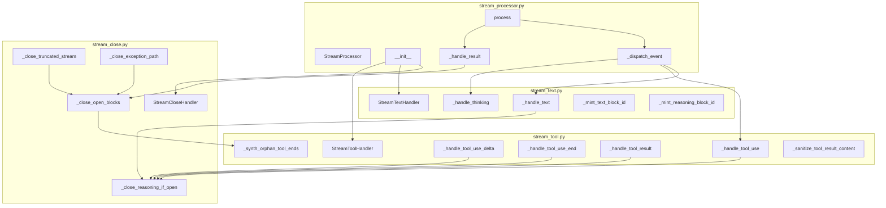
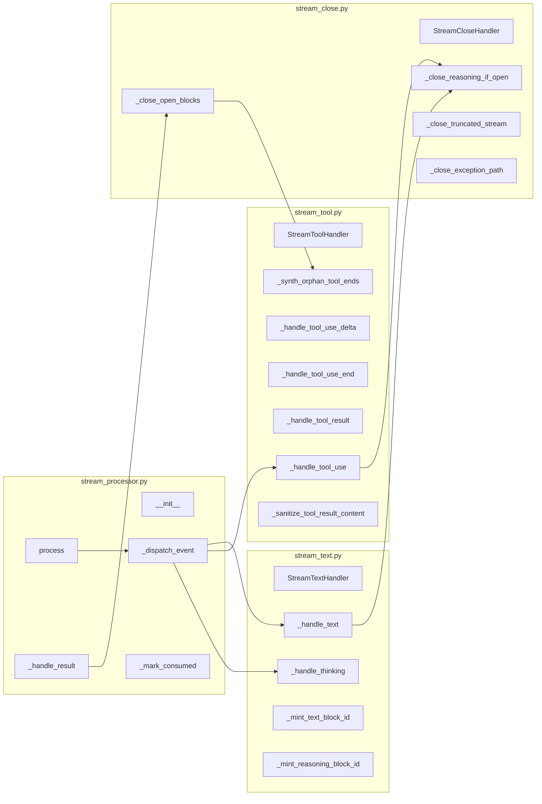

## Summary

Extract 7+ event handlers and 4 close helpers from `stream_processor.py` (550 lines) into 3
focused modules: `stream_close.py`, `stream_text.py`, `stream_tool.py`. The orchestrator
`stream_processor.py` becomes a thin wrapper that instantiates handler classes and delegates.
Zero functional change — pure reorganization.

## Architecture

### Data flow



### File × Function map



## Bootstrap Context

Analysis was skipped (F-lite). Frame provided full context.

Key patterns from current code:
- `StateMachine[str, str]` — simple mutable container; passed by reference
- All handlers are sync generators (`Iterator[RenderEvent]`), no `await` inside
- `_close_reasoning_if_open` is called at top of every non-Thinking handler
- `_close_open_blocks` calls `_synth_orphan_tool_ends` (orphan tool-end synthesis)
- `_handle_result` duplicates close logic (parallel path to `_close_open_blocks`)

## Agents

| Agent | Tasks | Files | Subject(s) |
|-------|-------|-------|------------|
| backend-dev-A | T2, T3 | stream_close.py, stream_text.py | close-handlers, text-handlers |
| backend-dev-B | T4, T5 | stream_tool.py, stream_close.py | tool-handlers, close-handlers |
| backend-dev-C | T6 | stream_processor.py, __init__.py | orchestrator, exports |
| tester-A | T1, T7, T8 | — | baseline, tests, quality-gates |

## Wave Structure

5 waves, max 3 parallel agents. All ≈ 20 min sequential.

| Wave | Trigger | Agents | Tasks |
|------|---------|--------|-------|
| 1 | start | tester-A, backend-dev-A | T1, T2 |
| 2 | T2 done | backend-dev-A, backend-dev-B | T3, T4 |
| 3 | T4 done | backend-dev-B | T5 |
| 4 | T3, T5 done | backend-dev-C | T6 |
| 5 | T6 done | tester-A | T7, T8 |

### Budget — per task

| Task | Items | Class | Est. ops | Split? |
|------|-------|-------|----------|--------|
| T1 | 1 | trivial | 2 | — |
| T2 | 3 | bounded | 6 | — |
| T3 | 2 | bounded | 4 | — |
| T4 | 4 | bounded | 8 | — |
| T5 | 2 | bounded | 4 | — |
| T6 | 2 | judgmental | 5 | — |
| T7 | 2 | trivial | 2 | — |
| T8 | 2 | trivial | 2 | — |

**Total estimated ops: 33**

### Budget — per agent instance

| Instance | Tasks | Σ ops | Subjects | Split? |
|----------|-------|-------|----------|--------|
| backend-dev-A | T2, T3 | 10 | close-handlers, text-handlers | — |
| backend-dev-B | T4, T5 | 12 | tool-handlers, close-handlers | — |
| backend-dev-C | T6 | 5 | orchestrator, exports | — |
| tester-A | T1, T7, T8 | 6 | baseline, tests, quality-gates | — |

## Consistency Report

- **Covered:** 8/8 affordances (N1–N9, S1–S2 mapped to tasks)
- **Uncovered:** none
- **Untraced:** none
- **Exemptions:** 0

## Micro-Tasks

### Slice 1: Extract close helpers

#### T1: RED — Verify _close_reasoning_if_open exists in stream_processor.py [P]
- **Agent:** tester-A
- **File:** `src/lyra/core/processors/stream_processor.py`
- **Verify:** `grep -q '_close_reasoning_if_open' src/lyra/core/processors/stream_processor.py`
- **Expected:** exit 0
- **Time:** 1 min | **Difficulty:** 1
- **Trace:** N9 | **Phase:** RED

#### T2: GREEN — Create stream_close.py with StreamCloseHandler [blocked by T1]
- **Agent:** backend-dev-A
- **File:** `src/lyra/core/processors/stream_close.py`
- **Snippet:**
  ```python
  class StreamCloseHandler:
      def __init__(self, sm_text, sm_reasoning, sm_tool, tool_id_to_name, tool_handler) -> None: ...
      def close_reasoning_if_open(self) -> Iterator[ReasoningEndRenderEvent]: ...
      def close_truncated_stream(self) -> Iterator[RenderEvent]: ...
      def close_exception_path(self) -> Iterator[RenderEvent]: ...
  ```
- **Verify:** `test -f src/lyra/core/processors/stream_close.py && pyright src/lyra/core/processors/stream_close.py`
- **Expected:** exit 0
- **Time:** 5 min | **Difficulty:** 3
- **Trace:** N8, N9 | **Phase:** GREEN

### Slice 2: Extract text + reasoning handlers

#### T3: GREEN — Create stream_text.py with StreamTextHandler + minting helpers [blocked by T2]
- **Agent:** backend-dev-A
- **File:** `src/lyra/core/processors/stream_text.py`
- **Snippet:**
  ```python
  class StreamTextHandler:
      def __init__(self, sm_text, sm_reasoning, show_intermediate) -> None: ...
      def handle_text(self, event: TextLlmEvent) -> Iterator[RenderEvent]: ...
      def handle_thinking(self, event: ThinkingLlmEvent) -> Iterator[RenderEvent]: ...
  def _mint_text_block_id() -> str: ...
  def _mint_reasoning_block_id() -> str: ...
  ```
- **Verify:** `test -f src/lyra/core/processors/stream_text.py && pyright src/lyra/core/processors/stream_text.py`
- **Expected:** exit 0
- **Time:** 4 min | **Difficulty:** 3
- **Trace:** N1, N2, S2 | **Phase:** GREEN

### Slice 3: Extract tool handlers

#### T4: GREEN — Create stream_tool.py with StreamToolHandler + constants + sanitization [blocked by T2]
- **Agent:** backend-dev-B
- **File:** `src/lyra/core/processors/stream_tool.py`
- **Snippet:**
  ```python
  _NON_SENSITIVE_TOOL_NAMES: frozenset[str] = frozenset({"glob", "grep", "ls", "todoread", "todowrite"})
  _MAX_CONTENT_BYTES = 65_536
  _REDACTED_PLACEHOLDER = "[redacted — tool output suppressed for security]"
  _TRUNCATED_SENTINEL = "…[truncated]"

  class StreamToolHandler:
      def __init__(self, sm_tool, tool_id_to_name) -> None: ...
      def handle_tool_use(self, event: ToolUseLlmEvent) -> Iterator[RenderEvent]: ...
      def handle_tool_use_delta(self, event: ToolUseDeltaLlmEvent) -> Iterator[RenderEvent]: ...
      def handle_tool_use_end(self, event: ToolUseEndLlmEvent) -> Iterator[RenderEvent]: ...
      def handle_tool_result(self, event: ToolResultLlmEvent) -> Iterator[RenderEvent]: ...
      def synth_orphan_tool_ends(self) -> Iterator[ToolCallEndRenderEvent]: ...
  ```
- **Verify:** `test -f src/lyra/core/processors/stream_tool.py && pyright src/lyra/core/processors/stream_tool.py`
- **Expected:** exit 0
- **Time:** 6 min | **Difficulty:** 3
- **Trace:** N3, N4, N5, N6, S1 | **Phase:** GREEN

#### T5: GREEN — Update stream_close.py with _close_open_blocks (delegates to StreamToolHandler) [blocked by T4]
- **Agent:** backend-dev-B
- **File:** `src/lyra/core/processors/stream_close.py`
- **Snippet:**
  ```python
  def close_open_blocks(self, reason: str) -> Iterator[RenderEvent]:
      # ... close reasoning, close text ...
      yield from self._tool_handler.synth_orphan_tool_ends()
  ```
- **Verify:** `pyright src/lyra/core/processors/stream_close.py`
- **Expected:** exit 0
- **Time:** 3 min | **Difficulty:** 2
- **Trace:** N8, N9 | **Phase:** GREEN

### Slice 4: Thin orchestrator

#### T6: GREEN — Update stream_processor.py + __init__.py [blocked by T3, T5]
- **Agent:** backend-dev-C
- **Files:** `src/lyra/core/processors/stream_processor.py`, `src/lyra/core/processors/__init__.py`
- **Snippet:**
  ```python
  class StreamProcessor:
      def __init__(self, *, show_intermediate: bool = True) -> None:
          # ... existing init ...
          self._close_handler = StreamCloseHandler(self._sm_text, self._sm_reasoning, self._sm_tool, self._tool_id_to_name, self._tool_handler)
          self._text_handler = StreamTextHandler(self._sm_text, self._sm_reasoning, show_intermediate)
          self._tool_handler = StreamToolHandler(self._sm_tool, self._tool_id_to_name)
  ```
- **Verify:** `pyright src/lyra/core/processors/stream_processor.py && pyright src/lyra/core/processors/__init__.py`
- **Expected:** exit 0
- **Time:** 5 min | **Difficulty:** 3
- **Trace:** N7, All | **Phase:** GREEN

### Final verification

#### T7: GREEN — Run streaming tests, verify zero regressions [blocked by T6]
- **Agent:** tester-A
- **File:** `tests/core/test_stream_processor.py`
- **Verify:** `uv run pytest tests/core/test_stream_processor.py -v`
- **Expected:** all pass
- **Time:** 3 min | **Difficulty:** 2
- **Trace:** SC-5 | **Phase:** GREEN

#### T8: GREEN — Verify file length + import-linter passes [blocked by T6]
- **Agent:** tester-A
- **Files:** all modified
- **Verify:** `bash tools/check_file_length.sh && uv run importlinter`
- **Expected:** exit 0
- **Time:** 2 min | **Difficulty:** 1
- **Trace:** SC-1, SC-2, SC-3, SC-4, SC-9 | **Phase:** GREEN

## Task Seeding Blueprint

### Wave 1 — start, 2 agents ∑

| Task | Agent instance | blockedBy | Subject |
|------|---------------|-----------|---------|
| T1 | tester-A | — | baseline |
| T2 | backend-dev-A | — | close-handlers |

### Wave 2 — T2 done, 2 agents ∑

| Task | Agent instance | blockedBy | Subject |
|------|---------------|-----------|---------|
| T3 | backend-dev-A | T2 | text-handlers |
| T4 | backend-dev-B | T2 | tool-handlers |

### Wave 3 — T4 done, 1 agent

| Task | Agent instance | blockedBy | Subject |
|------|---------------|-----------|---------|
| T5 | backend-dev-B | T4 | close-handlers |

### Wave 4 — T3, T5 done, 1 agent

| Task | Agent instance | blockedBy | Subject |
|------|---------------|-----------|---------|
| T6 | backend-dev-C | T3, T5 | orchestrator |

### Wave 5 — T6 done, 1 agent

| Task | Agent instance | blockedBy | Subject |
|------|---------------|-----------|---------|
| T7 | tester-A | T6 | tests |
| T8 | tester-A | T6 | quality-gates |

## Task IDs

<!-- Generated by /plan. Used by /implement to resume tasks on session restart. -->
- T1: 12 — baseline
- T2: 13 — close-handlers
- T3: 14 — text-handlers
- T4: 15 — tool-handlers
- T5: 16 — close-handlers
- T6: 17 — orchestrator
- T7: 18 — tests
- T8: 19 — quality-gates
