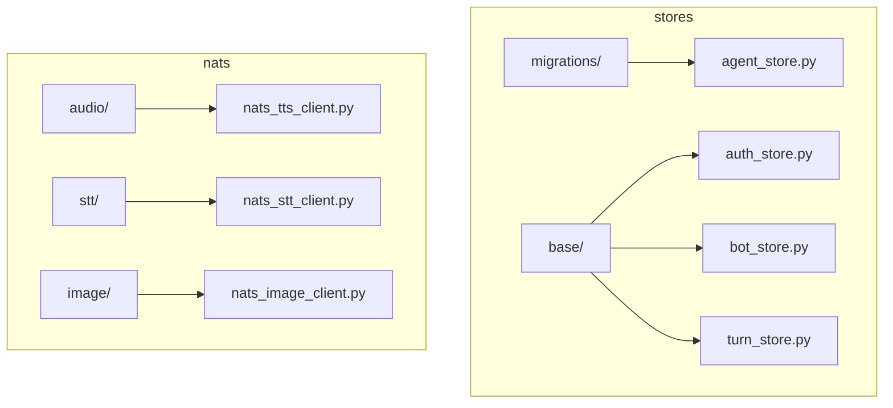
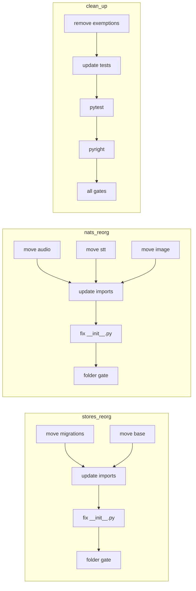

## Summary

Mechanical refactor: split `stores/` into `migrations/` + `base/` and `nats/` into `audio/` + `stt/` + `image/` subpackages. Move files, update imports, fix `__init__.py` re-exports, remove exemptions. No functional changes.

## Architecture

## Bootstrap Context

None — pure refactor, no new modules or patterns.

## Agents

| Agent | Task count | Files |
|-------|------------|-------|
| backend-dev-A | 6 | stores/*, nats/* |
| backend-dev-B | 6 | nats/*, tests/*, tools/* |

## Wave Structure

2 waves, max 2 parallel agents. Elapsed ~1 session vs ~2 sequential.

| Wave | Trigger | Agents | Tasks |
|------|---------|--------|-------|
| 1 | start | 2 ∆ | backend-dev-A: T1·T2·T3·T4·T5 — backend-dev-B: T6·T7·T8·T9·T10·T11 |
| 2 | Wave 1 done | 2 ∆ | backend-dev-A: T12 — backend-dev-B: T13·T14·T15·T16 |

### Budget — per task

| Task | Items | Class | Est. ops | Split? |
|------|-------|-------|----------|--------|
| T1 | 2 files | bounded | 3 | — |
| T2 | 3 files | bounded | 3 | — |
| T3 | 8 import sites | bounded | 4 | — |
| T4 | 1 file | bounded | 2 | — |
| T5 | 1 script | trivial | 1 | — |
| T6 | 4 files | bounded | 3 | — |
| T7 | 3 files | bounded | 3 | — |
| T8 | 2 files | bounded | 2 | — |
| T9 | 6 import sites | bounded | 4 | — |
| T10 | 1 file | bounded | 2 | — |
| T11 | 1 script | trivial | 1 | — |
| T12 | 1 file | trivial | 1 | — |
| T13 | 9 test files | bounded | 4 | — |
| T14 | test suite | bounded | 5 | — |
| T15 | typecheck | bounded | 4 | — |
| T16 | all gates | bounded | 3 | — |

**Total estimated ops: 38**

### Budget — per agent instance

| Instance | Tasks | Σ ops | Subjects | Split? |
|----------|-------|-------|----------|--------|
| backend-dev-A | T1, T2, T3, T4, T5, T12 | 14 | stores, config | — |
| backend-dev-B | T6, T7, T8, T9, T10, T11, T13, T14, T15, T16 | 24 | nats, tests, tools | — |

## Micro-Tasks

### Slice 1 — Reorg stores

| # | Task | Description | Files | Verify | Phase | [P] |
|---|------|-------------|-------|--------|-------|-----|
| T1 | Move migrations | Create `stores/migrations/__init__.py`, move `agent_store_migrations.py` + `bot_store_migrations.py` | `src/lyra/infrastructure/stores/migrations/` | `ls src/lyra/infrastructure/stores/migrations/*.py | wc -l` == 2 | GREEN | Y |
| T2 | Move base | Create `stores/base/__init__.py`, move `sqlite_base.py` + `message_index.py` + `bot_agent_map.py` | `src/lyra/infrastructure/stores/base/` | `ls src/lyra/infrastructure/stores/base/*.py | wc -l` == 3 | GREEN | Y |
| T3 | Update stores imports | Change `from lyra.infrastructure.stores.sqlite_base` to `from lyra.infrastructure.stores.base.sqlite_base` in all store files; change migration imports | `stores/{agent,bot,auth,identity_alias,message_index,prefs,thread,turn}_store.py`, `stores/bot_agent_map.py` | `grep -r "from lyra.infrastructure.stores.sqlite_base" src/lyra/infrastructure/stores/` returns empty | GREEN | N |
| T4 | Fix stores __init__.py | Update `stores/__init__.py` to import from `base.*` and `migrations.*` as needed | `stores/__init__.py` | `python -c "from lyra.infrastructure.stores import SqliteStore, MessageIndex"` | GREEN | N |
| T5 | RED-GATE stores | Run `tools/check_folder_size.sh` for `stores/` | `tools/folder_exemptions.txt` | Exit code 0 | RED | N |

### Slice 2 — Reorg nats

| # | Task | Description | Files | Verify | Phase | [P] |
|---|------|-------------|-------|--------|-------|-----|
| T6 | Move audio | Create `nats/audio/__init__.py`, move `nats_tts_client.py`, `nats_tts_codec.py`, `tts_engine_selector.py`, `tts_text_normalization.py` | `src/lyra/nats/audio/` | `ls src/lyra/nats/audio/*.py | wc -l` == 4 | GREEN | Y |
| T7 | Move stt | Create `nats/stt/__init__.py`, move `nats_stt_client.py`, `nats_stt_codec.py`, `stt_helpers.py` | `src/lyra/nats/stt/` | `ls src/lyra/nats/stt/*.py | wc -l` == 3 | GREEN | Y |
| T8 | Move image | Create `nats/image/__init__.py`, move `nats_image_client.py`, `nats_image_codec.py` | `src/lyra/nats/image/` | `ls src/lyra/nats/image/*.py | wc -l` == 2 | GREEN | Y |
| T9 | Update nats imports | Change imports in `nats/*.py` for moved modules | `nats/nats_tts_client.py`, `nats/nats_stt_client.py`, `nats/nats_image_client.py`, `nats/nats_channel_proxy.py`, `nats/__init__.py`, `bootstrap/factory/voice_overlay.py` | `grep -r "from lyra.nats.nats_tts_client" src/lyra/nats/` returns empty | GREEN | N |
| T10 | Fix nats __init__.py | Update `nats/__init__.py` to import from `audio.*`, `stt.*`, `image.*` | `nats/__init__.py` | `python -c "from lyra.nats import NatsTtsClient, NatsSttClient, NatsImageClient"` | GREEN | N |
| T11 | RED-GATE nats | Run `tools/check_folder_size.sh` for `nats/` | `tools/folder_exemptions.txt` | Exit code 0 | RED | N |

### Slice 3 — Clean exemptions

| # | Task | Description | Files | Verify | Phase | [P] |
|---|------|-------------|-------|--------|-------|-----|
| T12 | Remove exemptions | Delete `src/lyra/infrastructure/stores` and `src/lyra/nats` lines from `tools/folder_exemptions.txt` | `tools/folder_exemptions.txt` | `grep -c "src/lyra/infrastructure/stores\|src/lyra/nats" tools/folder_exemptions.txt` == 0 | GREEN | Y |
| T13 | Update test imports | Update test files importing moved submodules | `tests/core/test_sqlite_base_wal.py`, `tests/core/test_message_index.py`, `tests/infrastructure/test_agent_store_migration.py`, `tests/infrastructure/test_bot_store_migration.py`, `tests/nats/test_nats_tts_client.py`, `tests/nats/test_nats_tts_codec.py`, `tests/nats/test_nats_stt_client.py`, `tests/nats/test_nats_image_client.py`, `tests/bootstrap/test_voice_overlay.py` | `grep -r "from lyra.infrastructure.stores.sqlite_base" tests/` returns empty | GREEN | N |
| T14 | Run tests | `uv run pytest` | all | Exit code 0 | GREEN | N |
| T15 | Run typecheck | `uv run pyright` | all | Exit code 0 | GREEN | N |
| T16 | Final RED-GATE | Run all quality gates (`pre-commit run --all-files` or individual checks) | all | Exit code 0 | RED | N |

## Consistency Report

| Spec Criterion | Covered by | Status |
|----------------|------------|--------|
| SC-1: stores root ≤ 12 | T1, T2, T5 | ✓ |
| SC-2: stores/migrations ≤ 12 | T1, T5 | ✓ |
| SC-3: stores/base ≤ 12 | T2, T5 | ✓ |
| SC-4: nats root ≤ 12 | T6, T7, T8, T11 | ✓ |
| SC-5: nats/audio ≤ 12 | T6, T11 | ✓ |
| SC-6: nats/stt ≤ 12 | T7, T11 | ✓ |
| SC-7: nats/image ≤ 12 | T8, T11 | ✓ |
| SC-8: exemptions removed | T12 | ✓ |
| SC-9: folder gate passes | T5, T11, T16 | ✓ |
| SC-10: tests pass | T14 | ✓ |
| SC-11: no import errors | T15 | ✓ |
| SC-12: re-exports accessible | T4, T10 | ✓ |

**Untraced:** None
**Exemptions:** None

## Task IDs

<!-- Generated by /plan. Used by /implement to resume tasks on session restart. -->
- T1: 10 — stores
- T2: 11 — stores
- T3: 12 — stores
- T4: 13 — stores
- T5: 14 — stores
- T6: 15 — nats
- T7: 16 — nats
- T8: 17 — nats
- T9: 18 — nats
- T10: 19 — nats
- T11: 20 — nats
- T12: 21 — config
- T13: 22 — tests
- T14: 23 — tests
- T15: 24 — tests
- T16: 25 — tools

## Task Seeding Blueprint

### Wave 1 — no deps, 2 agents ∆

| Task | Agent instance | blockedBy | Subject |
|------|---------------|-----------|---------|
| T1 | backend-dev-A | — | stores |
| T2 | backend-dev-A | — | stores |
| T3 | backend-dev-A | T1, T2 | stores |
| T4 | backend-dev-A | T3 | stores |
| T5 | backend-dev-A | T4 | stores |
| T6 | backend-dev-B | — | nats |
| T7 | backend-dev-B | — | nats |
| T8 | backend-dev-B | — | nats |
| T9 | backend-dev-B | T6, T7, T8 | nats |
| T10 | backend-dev-B | T9 | nats |
| T11 | backend-dev-B | T10 | nats |

### Wave 2 — after Wave 1, 2 agents ∆

| Task | Agent instance | blockedBy | Subject |
|------|---------------|-----------|---------|
| T12 | backend-dev-A | T5, T11 | config |
| T13 | backend-dev-B | T5, T11 | tests |
| T14 | backend-dev-B | T13 | tests |
| T15 | backend-dev-B | T13 | tests |
| T16 | backend-dev-B | T14, T15 | tools |
