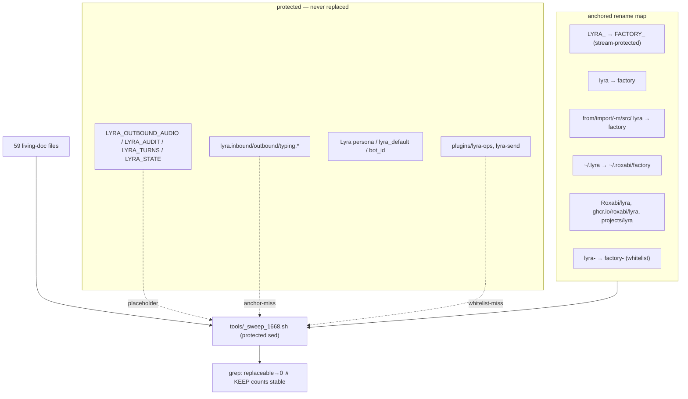
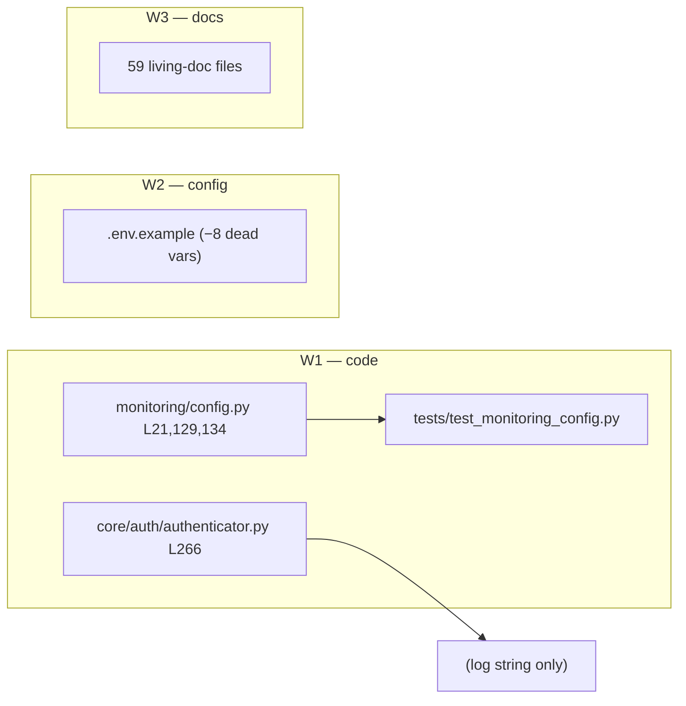

## Summary

Apply the scoped rename map to 59 living-doc files (782 hits) + remove 8 dead `.env.example`
vars + align `FACTORY_CONFIG` default to `config.toml` in 2 code spots and 1 test. Doc sweep
via a **protected sed script** (stream-name placeholders + import/verb anchoring) so the KEEP
set — subjects `lyra.*`, streams `LYRA_*`, persona, plugin dirs — is never touched.

## Architecture

### Replacement data flow

### File × change map

## Agents

| Agent instance | Tasks | Files |
|---|---|---|
| backend-dev-A | T1 | `monitoring/config.py`, `core/auth/authenticator.py`, `tests/test_monitoring_config.py` |
| devops-A | T2 | `.env.example` |
| doc-writer-A | T3 | `tools/_sweep_1668.sh` (throwaway) + 59 living-doc files |
| tester-A | T4 | (verification — full suite + gates) |

## Wave Structure

2 waves, max 3 parallel agents. Elapsed ~1 pass vs ~4 sequential.

| Wave | Trigger | Agents | Tasks |
|---|---|---|---|
| 1 | start | 3 ∥ | backend-dev-A: T1 · devops-A: T2 · doc-writer-A: T3 |
| 2 | Wave 1 done | 1 | tester-A: T4 (RED-GATE: all gates green) |

### Budget — per task

| Task | Items | Class | Est. ops | Split? |
|---|---|---|---|---|
| T1 config align + test | 3 files | bounded | 8 | — |
| T2 dead env vars | 1 file | trivial | 3 | — |
| T3 doc sweep (script+apply+verify) | 59 files | judgmental | 28 | — (<50) |
| T4 verification suite | gates | bounded | 8 | — |

**Total estimated ops: ~47**

### Budget — per agent instance

| Instance | Tasks | Σ ops | Subjects | Split? |
|---|---|---|---|---|
| backend-dev-A | T1 | 8 | config | — |
| devops-A | T2 | 3 | env | — |
| doc-writer-A | T3 | 28 | docs | — |
| tester-A | T4 | 8 | verify | — |

## Consistency Report

- Covered: SC-1 (T3), SC-2 (T2), SC-3 (T1), SC-4 (T3 verify), SC-5 (T4), SC-6 (T4) — 6/6.
- Uncovered: none. Untraced tasks: none. Exemptions: none.

## Micro-Tasks

### Slice S1 — Config-filename alignment  [backend-dev-A · subject: config]

- **T1** — Replace `lyra.toml`→`config.toml` in `src/factory/monitoring/config.py` (L21 docstring, L129 docstring, L134 `os.environ.get("FACTORY_CONFIG", ...)` default) and the log string in `src/factory/core/auth/authenticator.py:266`; update the matching expectation in `tests/test_monitoring_config.py`.
  - Verify: `grep -rn 'lyra.toml' src/factory && echo FAIL || echo OK` → OK; `uv run pytest tests/test_monitoring_config.py -q`
  - Spec trace: SC-3 · Phase: GREEN · Difficulty: 2

### Slice S2 — Dead env vars  [devops-A · subject: env]

- **T2** — Delete from `.env.example`: `FACTORY_STT_ENABLED`, `FACTORY_TTS_ENABLED`, `FACTORY_TTS_ENGINE`, `FACTORY_TTS_VOICE`, `FACTORY_TTS_LANGUAGE`, `FACTORY_STT_TIMEOUT`, `FACTORY_CONFIG_SECRET`, and the deprecated `TTS_ENGINE` line (+ any now-orphaned section header/comment). Do NOT wire flag-gates.
  - Verify: `grep -nE 'FACTORY_(STT_ENABLED|TTS_ENABLED|TTS_ENGINE|TTS_VOICE|TTS_LANGUAGE|STT_TIMEOUT|CONFIG_SECRET)' .env.example && echo FAIL || echo OK`; confirm zero readers unchanged: `git grep -nE 'FACTORY_STT_ENABLED|FACTORY_TTS_ENABLED' -- 'src/**' && echo HAS_READER || echo NO_READER`
  - Spec trace: SC-2 · Phase: GREEN · Difficulty: 1

### Slice S3 — Living-doc sweep  [doc-writer-A · subject: docs]

- **T3** — Write `tools/_sweep_1668.sh`: a protected sed over the living-doc fileset
  (`CLAUDE.md` anywhere, `README/CONTRIBUTING/SECURITY`, `docs/**` ∖ `history`+`adr`,
  `deploy/**.md`, `packages/**` ∖ CHANGELOG). Order: (1) placeholder-protect stream names
  `LYRA_(OUTBOUND_AUDIO|AUDIT|TURNS|STATE)`; (2) apply rename map with anchoring —
  `LYRA_`→`FACTORY_`, `~/.lyra`→`~/.roxabi/factory`, `Roxabi/lyra`→`Roxabi/roxabi-factory`,
  `ghcr.io/roxabi/lyra`→`ghcr.io/roxabi/factory`, `projects/lyra`→`projects/roxabi-factory`,
  `(from |import |-m |src/)lyra`→`\1factory`, `lyra-(nats|hub|telegram|discord|clipool|turn-writer|blobstore)`→`factory-\1`,
  `\blyra (hub|start|agent|bot|adapter|turn-writer)`→`factory \1`; (3) restore placeholders.
  Dry-run preview (`git diff --stat`), apply, then **delete the script**.
  - Verify (SC-1): `git grep -nE '<replaceable patterns>' -- <living fileset> | grep -ivE '<keep>'` → 0
  - Verify (SC-4 / KEEP stable): subjects `lyra.` count, stream names, `"Lyra"`/`lyra_default`, `plugins/lyra-(ops|send)`, `lyra_session_id` — before/after diff on those patterns = empty. Eyeball `git diff` for any subject/persona hit → revert if found.
  - Spec trace: SC-1, SC-4 · Phase: GREEN · Difficulty: 3

### Slice S-GATE — Verification  [tester-A · subject: verify]

- **T4** [RED-GATE] — After T1–T3: `uv run pytest -q` (full suite green), `uv run python tools/check_doc_drift.py` (or via pre-push), `uv run ruff format . && uv run ruff check .`, `uv run pyright`. All green → gate passes.
  - Verify: each command exit 0.
  - Spec trace: SC-5, SC-6 · Phase: RED-GATE · Difficulty: 2 · blockedBy: T1, T2, T3

## Task Seeding Blueprint

<!-- Used by /implement to seed TaskCreate calls. T-numbers ref this list. -->

### Wave 1 — no deps, 3 agents ∥

| Task | Agent instance | blockedBy | Subject |
|---|---|---|---|
| T1 | backend-dev-A | — | config |
| T2 | devops-A | — | env |
| T3 | doc-writer-A | — | docs |

### Wave 2 — after Wave 1, 1 agent

| Task | Agent instance | blockedBy | Subject |
|---|---|---|---|
| T4 | tester-A | T1, T2, T3 | verify |

## Task IDs

<!-- Generated by /plan. Used by /implement to resume tasks on session restart. -->
- T1: 12 — config (backend-dev-A)
- T2: 13 — env (devops-A)
- T3: 14 — docs (doc-writer-A)
- T4: 15 — verify (tester-A) — blockedBy T1,T2,T3
