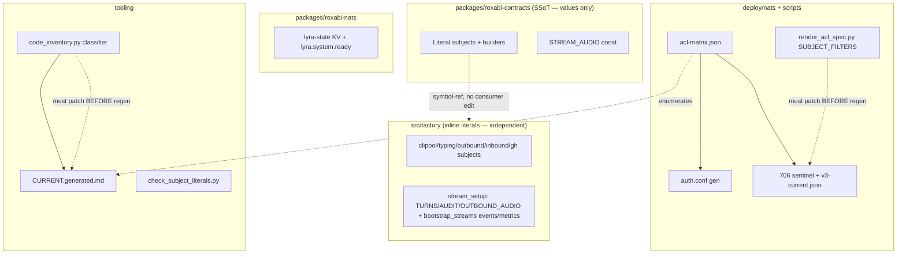
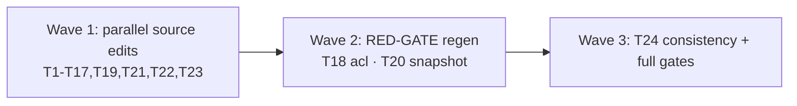

## Summary

Mechanical, type-safe rename of the NATS wire namespace `lyra.*` → `factory.*` (subjects +
stream/KV name constants) across roxabi-contracts, ~25 inline subject literals, the roxabi-nats
SDK, the ACL matrix + generated artifacts, tooling, tests and docs — one breaking PR, gate-green,
Phase-4-cutover-ready. File groups are largely disjoint → 9 parallel agent instances in wave 1;
two RED-GATE regen tasks in wave 2; final consistency sweep in wave 3.

## Architecture

## Bootstrap Context

Full file:line inventory + per-stream migration strategy in
`artifacts/analyses/1670-nats-subjects-factory-wire-contract-analysis.mdx`. Decisions: D2=No
(roxabi-nats SDK in this PR; satellites re-pin contracts **and** nats), D5=Yes (owner lyra→factory
×6). Two latent bugs fixed inline (checks_audio.py dup; auth.conf KV direct-get path). Phase-4
runbook (live stream recreate + LYRA_AUDIT copy) is a separate ticket (T23). `bootstrap_streams.py`
is not CI-covered → manual staging smoke. `make nats-regen-authconf` restarts factory-nats → dev
uses template-only/drift path, never against prod.

## Agents

| Agent instance | Tasks | Files (primary) |
|---|---|---|
| backend-dev-A | T1,T2,T3 | `packages/roxabi-contracts/**` |
| backend-dev-B | T4,T5,T6 | clipool_worker.py, hub_llm_client.py, llm_client.py, nats_bus.py, subject_literals_allowlist.txt, mint_failure_subscriber.py |
| backend-dev-C | T7,T8 | nats_channel_proxy.py, audio_publish.py, nats_outbound_listener.py, audio_consumer_bootstrap.py, typing_publisher.py, wiring_helpers.py, standalone_{telegram,discord}.py |
| backend-dev-D | T9,T10,T11,T13 | turn_writer/stream_setup.py, audit/jetstream_sink.py, outbound_audio/stream_setup.py, monitoring/checks_audio.py, deploy/nats/bootstrap_streams.py |
| backend-dev-E | T14,T15 | packages/roxabi-nats/readiness.py, blobstore/serve.py, blobstore/audit_sink.py |
| devops-A | T16,T17,T18,T23 | deploy/nats/acl-matrix.json, scripts/render_acl_spec.py, (regen outputs), gh issues |
| devops-B | T19,T20 | tools/code_inventory.py, scripts/check_subject_literals.py, tools/smoke_llm_e2e.sh, docs/architecture/CURRENT.generated.md |
| tester-A | T21 | tests/** + tests/scripts/fixtures/{v1,v2,v3-current}.json |
| doc-writer-A | T22 | docs/ARCHITECTURE.md, GETTING-STARTED.md, ADRs, CLAUDE.md (nats/adapters/turn_writer/blobstore) |

## Wave Structure

3 waves, max 9 parallel agents. Elapsed ~3 waves vs ~24 sequential.

| Wave | Trigger | Agents | Tasks |
|------|---------|--------|-------|
| 1 | start | 9 ∥ | A: T1→T2→T3 · B: T4,T5,T6 · C: T7,T8 · D: T9,T10,T11,T13 · E: T14→T15 · devops-A: T16→T17 · devops-B: T19 · tester-A: T21 · doc-writer-A: T22 · devops-A: T23 |
| 2 | Wave 1 done | 2 ∥ | devops-A: T18 (regen ACL, needs T16,T17) · devops-B: T20 (regen snapshot, needs T19 + all subject renames T1-T16) |
| 3 | Wave 2 done | 1 | T24 final consistency + full pytest + all gates |

### Budget — per task

| Task | Items | Class | Est. ops | Split? |
|------|-------|-------|----------|--------|
| T1 contracts subjects+STREAM_AUDIO | 9 files | judgmental | 7 | — |
| T3 contracts tests | 8 files | bounded | 5 | — |
| T4-T8 inline subjects | ~17 files | bounded | 4 each | — |
| T9-T13 streams | 5 files | bounded | 4 each | — |
| T14-T15 sdk+serve | 3 files | judgmental | 5 each | — |
| T16 acl-matrix | 1 file | judgmental | 6 | — |
| T17 filter patch | 1 line | trivial | 2 | — |
| T18 acl regen ⊕ | 3 outputs | judgmental | 6 | — |
| T19 tooling | 3 files | bounded | 5 | — |
| T20 snapshot regen ⊕ | 1 output | bounded | 4 | — |
| T21 tests/fixtures | ~14 files | judgmental | 8 | — |
| T22 docs | ~10 files | judgmental | 8 | — |
| T23 coord issues | 4 issues | bounded | 5 | — |
| T24 final consistency | repo-wide | judgmental | 6 | — |

**Total estimated ops: ~120**

### Budget — per agent instance

| Instance | Tasks | Σ ops | Subjects | Split? |
|----------|-------|-------|----------|--------|
| backend-dev-A | T1,T2,T3 | 14 | contracts | — |
| backend-dev-B | T4,T5,T6 | 12 | inline-subjects | — |
| backend-dev-C | T7,T8 | 8 | inline-subjects | — |
| backend-dev-D | T9,T10,T11,T13 | 16 | streams | — |
| backend-dev-E | T14,T15 | 10 | sdk-kv | — |
| devops-A | T16,T17,T18,T23 | 19 | acl, issues | — (4 tasks, 2 subjects — at cap) |
| devops-B | T19,T20 | 9 | tooling | — |
| tester-A | T21 | 8 | tests | — |
| doc-writer-A | T22 | 8 | docs | — |

## Consistency Report

- Slices covered: 7/7. Criteria covered: 13/13 (SC sub-bullets included).
- Untraced tasks: none.
- Exemptions: `v3-pre-grant-group.json` (frozen baseline — intentionally NOT renamed);
  kept `lyra` refs (persona `lyra_default`, `bot_id "lyra"`, logger `lyra.security`, module-path
  docstrings) — intentionally NOT renamed.

## Micro-Tasks

> Rename rule for all tasks: `lyra.` (wire subject) → `factory.`, `LYRA_`/`lyra-` (stream/KV name)
> → `FACTORY_`/`factory-`. Do NOT touch persona/`bot_id`/logger/module-path `lyra` refs. Preserve
> `Literal[...]` typing (no downgrade to `str`).

### Slice 1 — Contracts SSoT (backend-dev-A) · Wave 1

- **T1** [contracts] Rename all `lyra.*` subject Literals + f-string builders across the 9
  `packages/roxabi-contracts/src/roxabi_contracts/*/subjects.py`; also `STREAM_AUDIO` value
  `LYRA_OUTBOUND_AUDIO`→`FACTORY_OUTBOUND_AUDIO`. **Verify:** `grep -rn 'lyra\.' packages/roxabi-contracts/src` → only docstrings remain (fix those too) ; `uv run pyright packages/roxabi-contracts`. Trace SC-1.
- **T2** [contracts] Bump version `0.6.0`→`0.7.0` in `packages/roxabi-contracts/pyproject.toml`; `uv lock`. **Verify:** `grep '0.7.0' packages/roxabi-contracts/pyproject.toml`. Trace SC-1. (blockedBy T1)
- **T3** [contracts] Update the 8 contracts test files `lyra.*`→`factory.*`. **Verify:** `uv run pytest packages/roxabi-contracts`. Trace SC-1. (blockedBy T1)

### Slice 2 — Inline subjects (backend-dev-B, backend-dev-C) · Wave 1

- **T4** [inline-subjects] clipool: `clipool_worker.py:36-38`, `hub_llm_client.py:33,42`, `llm/llm_client.py:34` (`lyra.clipool.*`→`factory.clipool.*`). **Verify:** `grep -rn 'lyra\.clipool' src` → 0. Trace SC-2.
- **T5** [inline-subjects] inbound: `nats_bus.py:67` `lyra.inbound`→`factory.inbound`; drop `lyra.inbound` line from `scripts/subject_literals_allowlist.txt`. **Verify:** `uv run python scripts/check_subject_literals.py`. Trace SC-2.
- **T6** [inline-subjects] gh: `mint_failure_subscriber.py:31` `lyra.gh.mint_failure.>`→`factory.*`. **Verify:** `grep -rn 'lyra\.gh' src` → 0. Trace SC-2.
- **T7** [inline-subjects] outbound: `nats_channel_proxy.py:125,142,222,289`, `audio_publish.py:90`, `nats_outbound_listener.py:69`, `mint_failure_subscriber.py:47`, `audio_consumer_bootstrap.py:27,85` (`lyra.outbound.*`→`factory.*`). **Verify:** `grep -rn 'lyra\.outbound' src` → 0. Trace SC-2.
- **T8** [inline-subjects] typing: `transport/typing_publisher.py:76`, `wiring_helpers.py:201,213`, `standalone_telegram.py:120`, `standalone_discord.py:161` (`lyra.typing.*`→`factory.*`). **Verify:** `grep -rn 'lyra\.typing' src` → 0. Trace SC-2.

### Slice 3 — Stream/KV name constants + co-located subjects (backend-dev-D) · Wave 1

- **T9** [streams] `turn_writer/stream_setup.py`: `LYRA_TURNS`→`FACTORY_TURNS`, `SUBJECT_FILTER` + `subjects=` `lyra.turns.*`→`factory.*`. **Verify:** `grep -rn 'LYRA_TURNS\|lyra\.turns' src` → 0. Trace SC-3.
- **T10** [streams] `audit/jetstream_sink.py`: `LYRA_AUDIT`→`FACTORY_AUDIT`, `_SUBJECT_PREFIX` + `subjects=` `lyra.audit.*`→`factory.*`. *(optional/axial: add `STREAM_AUDIT` const to contracts + import; else leave inline)*. **Verify:** `grep -rn 'LYRA_AUDIT\|lyra\.audit' src/factory/infrastructure` → 0. Trace SC-3.
- **T11** [streams] `outbound_audio/stream_setup.py:50` subjects→`factory.*`; `monitoring/checks_audio.py:40` **import `STREAM_AUDIO` from contracts** (latent bug 2, no bare literal); `*_audio_sent` KV `lyra_`→`factory_`. **Verify:** `grep -rn 'LYRA_OUTBOUND_AUDIO\|lyra_outbound_audio_sent\|lyra\.outbound\.audio' src` → 0. Trace SC-3.
- **T13** [streams] `deploy/nats/bootstrap_streams.py`: `lyra-events`→`factory-events`, `lyra-metrics`→`factory-metrics`, subjects `lyra.event.>`/`lyra.metric.>`→`factory.*`. **Verify:** `grep -n 'lyra' deploy/nats/bootstrap_streams.py` → 0. Trace SC-3.

### Slice 4 — roxabi-nats SDK + serve.py (backend-dev-E) · Wave 1

- **T14** [sdk-kv] `packages/roxabi-nats/readiness.py`: `lyra-state`→`factory-state` KV, `READINESS_SUBJECT` `lyra.system.ready`→`factory.system.ready`; bump roxabi-nats version; update its tests. **Verify:** `uv run pytest packages/roxabi-nats` ; `grep -rn 'lyra' packages/roxabi-nats/src` → 0. Trace SC-4.
- **T15** [sdk-kv] `blobstore/serve.py:70,75` `lyra-state`→`factory-state`; `blobstore/audit_sink.py` publish subject `lyra.audit.blobs.*`→`factory.*` (keep logger `lyra.security`). **Verify:** `grep -rn 'lyra-state\|lyra\.audit\.blobs' src/factory/blobstore` → 0. Trace SC-4. (blockedBy T14)

### Slice 5 — ACL (devops-A) · Wave 1 (T16,T17) → Wave 2 (T18)

- **T16** [acl] `deploy/nats/acl-matrix.json`: all `lyra.*` subjects→`factory.*`; `owner:"lyra"`→`"factory"` on the 6 ids; `lyra.system.ready`→`factory.system.ready`; fix latent bug 1 (`$JS.API.DIRECT.GET.LYRA_STATE`→`KV_factory-state`). **Pre-check:** grep `factory-acl check grants` for hardcoded owner string first. **Verify:** `grep -n '"lyra' deploy/nats/acl-matrix.json` → 0. Trace SC-5.
- **T17** [acl] Patch `scripts/render_acl_spec.py:31` `SUBJECT_FILTERS` += `"factory."`. **Verify:** `grep -n 'factory\.' scripts/render_acl_spec.py`. Trace SC-6. (blockedBy —; **must precede T18**)
- **T18** ⊕RED-GATE [acl] After T16+T17: regenerate auth.conf (template-only/drift path — **NOT** live `nats-regen-authconf` against prod), `make nats-regen-specs` (706 sentinel + `v3-current.json`). **Verify:** `bash scripts/check-acl-authconf-drift.sh` && `bash scripts/check-acl-specs-drift.sh` exit 0 ; `uv run pytest tests/scripts/test_parity_e2e.py` ; `git status tests/scripts/fixtures/v3-pre-grant-group.json` unchanged. Trace SC-6. (blockedBy T16,T17)

### Slice 6 — Tooling + tests + docs (devops-B, tester-A, doc-writer-A) · Wave 1 (T19,T21,T22) → Wave 2 (T20)

- **T19** [tooling] `code_inventory.py:299,318,601,677` classifier += `factory.`; `check_subject_literals.py:176` scanner += `factory.`; `smoke_llm_e2e.sh:17,113` `lyra.llm.generate.request`→`factory.*`. **Verify:** `uv run python scripts/check_subject_literals.py`. Trace SC-7. (**must precede T20**)
- **T20** ⊕RED-GATE [tooling] After T19 + all subject renames: regenerate `docs/architecture/CURRENT.generated.md` via `uv run python tools/generate_architecture_snapshot.py .`. **Verify:** `bash tools/check_architecture_snapshot.sh` exit 0 ; `grep -c 'lyra\.' docs/architecture/CURRENT.generated.md` → 0. Trace SC-7. (blockedBy T19, T1-T16)
- **T21** [tests] Rename `lyra.*`→`factory.*` in test files + fixtures `v1-legacy/v2-prod/v2-with-retired/v3-current.json`, clipool/mint-failure/audio/loader/voice-smoke tests. **Do NOT touch `v3-pre-grant-group.json`.** **Verify:** `uv run pytest` (suite) ; `git status tests/scripts/fixtures/v3-pre-grant-group.json` unchanged. Trace SC-8,SC-10.
- **T22** [docs] `docs/ARCHITECTURE.md`, `GETTING-STARTED.md`, ADRs (077, archive/050, 046), CLAUDE.md (`nats/`, `adapters/`, `turn_writer/`) subject tables, `blobstore/CLAUDE.md` prose `lyra.audit.blobs.*`. **Verify:** `uv run python tools/check_doc_drift.py`. Trace SC-9.

### Slice 7 — Coordination (devops-A) · Wave 1

- **T23** [issues] Create Phase-4 prod-cutover ticket (per-stream plan incl. LYRA_AUDIT create-new+copy+verify+delete, durable-consumer re-provision, secret rotation, timer-stays-disabled); update voiceCLI#189/llmCLI#105/imageCLI#104 to add roxabi-nats re-pin. Use issue-triage for any blocked-by/parent links. **Verify:** issues exist + reference roxabi-nats. Trace SC-13.

### Slice final — Consistency (tester-A) · Wave 3

- **T24** ⊕RED-GATE Repo-wide: `grep -rnE 'lyra\.(event|metric|gh|image|jobs|llm|turns|voice|verify|outbound|inbound|clipool|typing|system|audit|results|progress)' src packages` → 0 (excluding kept refs); zero `LYRA_*`/`lyra-state`/`lyra-events|metrics` stream constants; full `uv run pytest` + all pre-push gates green; confirm `podman-auto-update.timer` disabled + manual `bootstrap_streams.py` staging smoke noted in PR. Trace SC-8,SC-10,SC-11,SC-12. (blockedBy T18,T20,T21)

## Task Seeding Blueprint

<!-- Used by /implement. T-numbers ref this list; blockedBy within-list. Seed in wave order. -->

### Wave 1 — no deps, 9 agents ∥

| Task | Agent instance | blockedBy | Subject |
|------|---------------|-----------|---------|
| T1 | backend-dev-A | — | contracts |
| T2 | backend-dev-A | T1 | contracts |
| T3 | backend-dev-A | T1 | contracts |
| T4 | backend-dev-B | — | inline-subjects |
| T5 | backend-dev-B | — | inline-subjects |
| T6 | backend-dev-B | — | inline-subjects |
| T7 | backend-dev-C | — | inline-subjects |
| T8 | backend-dev-C | — | inline-subjects |
| T9 | backend-dev-D | — | streams |
| T10 | backend-dev-D | — | streams |
| T11 | backend-dev-D | — | streams |
| T13 | backend-dev-D | — | streams |
| T14 | backend-dev-E | — | sdk-kv |
| T15 | backend-dev-E | T14 | sdk-kv |
| T16 | devops-A | — | acl |
| T17 | devops-A | — | acl |
| T19 | devops-B | — | tooling |
| T21 | tester-A | — | tests |
| T22 | doc-writer-A | — | docs |
| T23 | devops-A | — | issues |

### Wave 2 — after Wave 1, 2 agents ∥

| Task | Agent instance | blockedBy | Subject |
|------|---------------|-----------|---------|
| T18 | devops-A | T16, T17 | acl |
| T20 | devops-B | T19, T16, T1 | tooling |

### Wave 3 — after Wave 2, 1 agent

| Task | Agent instance | blockedBy | Subject |
|------|---------------|-----------|---------|
| T24 | tester-A | T18, T20, T21 | consistency |

## Task IDs

<!-- Generated by /plan. Used by /implement to resume tasks on session restart. -->
- T1: 13 — contracts
- T2: 14 — contracts
- T3: 15 — contracts
- T4: 16 — inline-subjects
- T5: 17 — inline-subjects
- T6: 18 — inline-subjects
- T7: 19 — inline-subjects
- T8: 20 — inline-subjects
- T9: 21 — streams
- T10: 22 — streams
- T11: 23 — streams
- T13: 24 — streams
- T14: 25 — sdk-kv
- T15: 26 — sdk-kv
- T16: 27 — acl
- T17: 28 — acl
- T18: 29 — acl (RED-GATE)
- T19: 30 — tooling
- T20: 31 — tooling (RED-GATE)
- T21: 32 — tests
- T22: 33 — docs
- T23: 34 — issues
- T24: 35 — consistency (RED-GATE)
