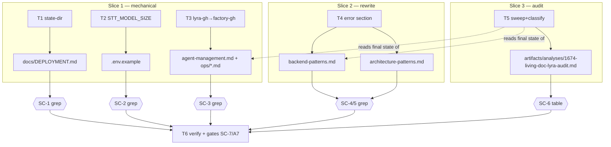
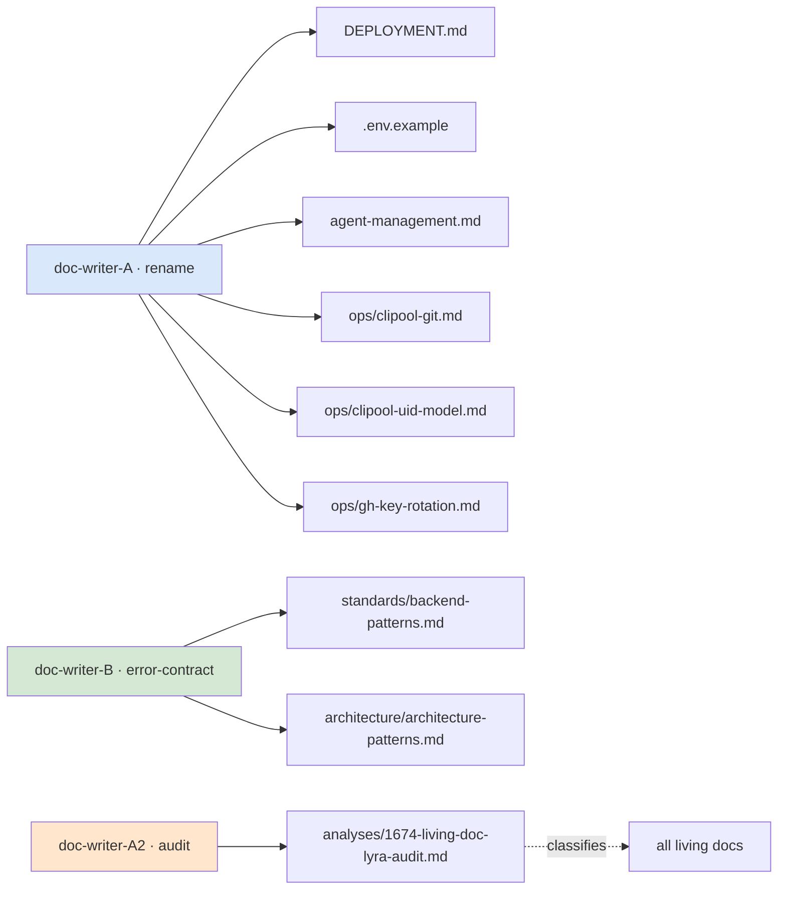

## Summary

Apply the judgment-tail of the `lyra→factory` rename: 3 mechanical fixes (state-dir,
`STT_MODEL_SIZE` advert, `lyra-gh` paths/binary), a rewrite of the error-handling doc section
to the real multi-site contract, and a full living-doc `lyra` audit producing a committed
KEEP/FIX table. Disjoint-file parallel waves avoid the #1668 shared-worktree clobber.

## Architecture

### Data flow (SC → task → files → verify)

### File × ownership map

Wave-1 file sets (DWA vs DWB) are disjoint → safe ∥. DWA2 (audit) runs in Wave 2 alone.

## Agents

| Agent instance | Tasks | Files | Subject |
|---|---|---|---|
| doc-writer-A | T1, T2, T3 | DEPLOYMENT.md, .env.example, agent-management.md, ops/{clipool-git,clipool-uid-model,gh-key-rotation}.md | rename |
| doc-writer-B | T4 | standards/backend-patterns.md, architecture/architecture-patterns.md | error-contract |
| doc-writer-A2 | T5 | artifacts/analyses/1674-living-doc-lyra-audit.md (+ straggler fixes anywhere) | audit |
| lead | T6 | — (verify + gates) | verify |

No tester instance: verification is grep/gate-based (no code under test); SC greps are the "tests".

## Wave Structure

3 waves, max 2 parallel agents. Elapsed ~2 units vs ~4 sequential.

| Wave | Trigger | Agents | Tasks |
|------|---------|--------|-------|
| 1 | start | 2 ∥ | doc-writer-A: T1→T2→T3 · doc-writer-B: T4 |
| 2 | Wave 1 done (barrier) | 1 | doc-writer-A2: T5 |
| 3 | Wave 2 done | 1 (lead) | lead: T6 |

Barrier before Wave 2: T5 audits the *final* state of all files, so it must follow T1–T4.

### Budget — per task

| Task | Items | Class | Est. ops | Split? |
|------|-------|-------|----------|--------|
| T1 state-dir | 1 line | trivial | 2 | — |
| T2 STT_MODEL_SIZE | 1 line | trivial | 2 | — |
| T3 lyra-gh | ~8 refs / 4 files | bounded | 6 | — |
| T4 error rewrite | 2 sections | judgmental | 8 | — |
| T5 audit | ~423 occ classify + table | exploratory | 14 | — |
| T6 verify+gates | 7 SC + A7 | bounded | 5 | — |

**Total estimated ops: ~37**

### Budget — per agent instance

| Instance | Tasks | Σ ops | Subjects | Split? |
|----------|-------|-------|----------|--------|
| doc-writer-A | T1, T2, T3 | 10 | rename | — |
| doc-writer-B | T4 | 8 | error-contract | — |
| doc-writer-A2 | T5 | 14 | audit | — |
| lead | T6 | 5 | verify | — |

## Consistency Report

- Success criteria covered: 7 / 7 (SC-1→T1, SC-2→T2, SC-3→T3, SC-4→T4, SC-5→T4, SC-6→T5, SC-7→T6).
- Affordances covered: 7 / 7 (A1→T1, A2→T2, A3→T3, A4/A5→T4, A6→T5, A7→T6).
- Uncovered: none. Untraced tasks: none.
- Exemptions: tester phase (no code under test); RED-GATE sentinels N/A for doc edits (verification = grep).

## Micro-Tasks

### Slice 1 — mechanical (doc-writer-A, Wave 1)

**T1 — state-dir `lyra`→`factory` in DEPLOYMENT.md**
- File: `docs/DEPLOYMENT.md` (L84)
- Action: `~/.local/state/lyra/logs/deploy.log` → `~/.local/state/factory/logs/deploy.log`
- Verify: `git ls-files '*.md' '*.mdx' | grep -vE '^(docs/history/|docs/architecture/adr/|artifacts/)' | grep -vE '(^|/)CHANGELOG' | grep -v '^docs/architecture/CURRENT.generated.md' | xargs grep -In "state/lyra"` → 0 lines
- Subject: rename · Slice: S1 · Difficulty: 1

**T2 — drop `STT_MODEL_SIZE` advert from .env.example**
- File: `.env.example` (L10)
- Action: delete the commented line `# STT_MODEL_SIZE= … DEPRECATED …`
- Verify: `grep -c STT_MODEL_SIZE .env.example` → 0 AND `grep -c STT_MODEL_SIZE src/factory/bootstrap/factory/voice_overlay.py` → ≥1 (fallback untouched)
- Subject: rename · Slice: S1 · Difficulty: 1

**T3 — `lyra-gh`→`factory-gh` across 4 ops docs**
- Files: `docs/agent-management.md`, `docs/ops/clipool-git.md`, `docs/ops/clipool-uid-model.md`, `docs/ops/gh-key-rotation.md`
- Action: `deploy/lyra-gh/`→`deploy/factory-gh/`, `/opt/lyra-gh/`→`/opt/factory-gh/`, `git-credential-lyra-gh`→`git-credential-factory-gh`, `lyra-gh` shim → `factory-gh`. Verify each hit is the path/binary (not a NATS subject/persona) before editing.
- Verify: `<universe> | xargs grep -In "lyra-gh\|git-credential-lyra-gh"` → 0 lines
- Subject: rename · Slice: S1 · Difficulty: 2

### Slice 2 — error-section rewrite (doc-writer-B, Wave 1)

**T4 — rewrite error-handling doc section to real contract**
- Files: `docs/standards/backend-patterns.md`, `docs/architecture/architecture-patterns.md`
- Action: remove all `LyraUserError`/`ErrorBoundaryMiddleware`/`Audio*Error`/`SttError` prose. Describe the ACTUAL mechanism (read the code first, cite nothing from memory):
  - cross-layer exception classes: `src/factory/core/exceptions.py` (`StreamChunkTimeout`, `WorkerUnavailableError`, `HubUnavailableError`, `ScrapeFailed`, `VaultWriteFailed`)
  - stream errors → user reply: `src/factory/outbound/error_handler.py` (`OutboundErrorHandler.classify_stream_error` → template keys `error_timeout`/`error_stream`)
  - STT errors → user reply: `src/factory/core/hub/middleware/middleware_stt.py` catching `STTNoiseError`/`STTUnavailableError` (`src/factory/core/ports/stt.py`)
  - do NOT invent a base class; `WorkerUnavailableError` = cross-layer exception, not described as a distinct user reply unless a catch site is found.
- Verify: `grep -rEn "LyraUserError|ErrorBoundaryMiddleware|AudioDownloadError|AudioTooLargeError|AudioInvalidFormatError|SttError" docs/standards/backend-patterns.md docs/architecture/architecture-patterns.md` → 0; every class/path named in the new prose appears in `grep -rEn "^class " src/factory/core/exceptions.py src/factory/core/ports/stt.py` ∪ `outbound/error_handler.py` ∪ `middleware_stt.py`
- Subject: error-contract · Slice: S2 · Difficulty: 4

### Slice 3 — living-doc audit (doc-writer-A2, Wave 2)

**T5 — sweep, classify, write audit table, fix stragglers**
- File (new): `artifacts/analyses/1674-living-doc-lyra-audit.md`; straggler fixes anywhere in living docs
- Action: over the living-docs universe, enumerate every `lyra`/`Lyra` occurrence → table `file | line | token | verdict | rationale` (verdict ∈ KEEP_persona / KEEP_nats_subject / KEEP_stream / KEEP_plugin / KEEP_host_part2 / KEEP_history / FIX_*). Apply any FIX not already done by T1–T4. KEEP set per spec edge-cases (persona, `lyra.*`/`LYRA_*`/`lyra-state`, plugins `lyra-send`/`lyra-ops`, host-identity, ADR history).
- Verify: audit file exists with required columns; 0 rows `FIX_*` left unapplied; `git diff` shows `workspaces.lyra`/`/lyra` (CONFIGURATION.md), ADR-043 `lyra/scripts/` (deployment.md), `CURRENT.generated.md` unchanged
- Subject: audit · Slice: S3 · Difficulty: 3

### Verify (lead, Wave 3)

**T6 — KEEP-unchanged + quality gates**
- Action: confirm A7 (git diff clean on CONFIGURATION.md alias lines, deployment.md ADR-043 lines, CURRENT.generated.md); run gates
- Verify: `uv run ruff check .` && `uv run pyright` && `uv run pytest` && `uv run python tools/check_doc_drift.py` all exit 0
- Subject: verify · Slice: — · Difficulty: 2

## Task Seeding Blueprint

<!-- Used by /implement to seed TaskCreate calls. T-numbers ref this list, not session IDs.
     Seed in wave order; within a wave all rows are parallel (∥). -->

### Wave 1 — no deps, 2 agents ∥

| Task | Agent instance | blockedBy | Subject |
|------|---------------|-----------|---------|
| T1 | doc-writer-A | — | rename |
| T2 | doc-writer-A | T1 | rename |
| T3 | doc-writer-A | T2 | rename |
| T4 | doc-writer-B | — | error-contract |

### Wave 2 — after Wave 1 barrier, 1 agent

| Task | Agent instance | blockedBy | Subject |
|------|---------------|-----------|---------|
| T5 | doc-writer-A2 | T1, T2, T3, T4 | audit |

### Wave 3 — after Wave 2, 1 agent (lead)

| Task | Agent instance | blockedBy | Subject |
|------|---------------|-----------|---------|
| T6 | lead | T5 | verify |

## Task IDs

<!-- Generated by /plan. Used by /implement to resume tasks on session restart. -->
- T1: 26 — rename (state-dir, doc-writer-A)
- T2: 27 — rename (STT_MODEL_SIZE, doc-writer-A)
- T3: 28 — rename (lyra-gh, doc-writer-A)
- T4: 29 — error-contract (rewrite, doc-writer-B)
- T5: 30 — audit (sweep+table, doc-writer-A2)
- T6: 31 — verify (gates, lead)
