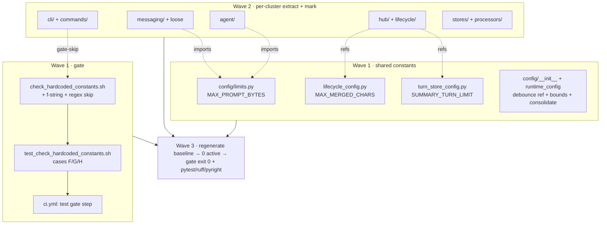
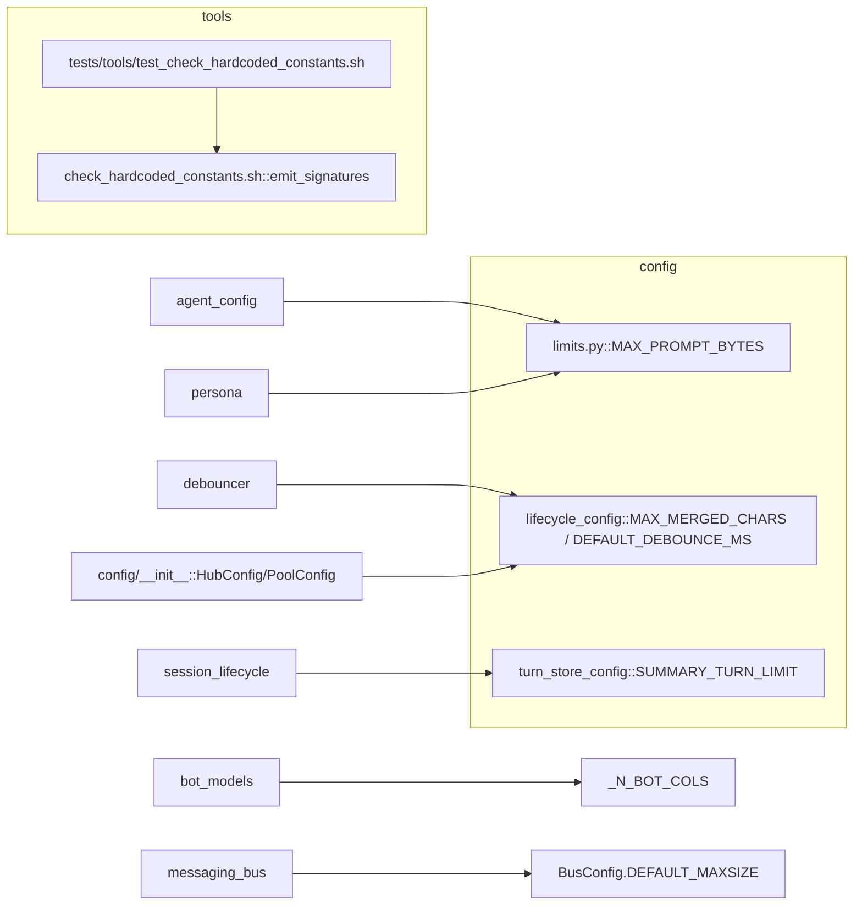

## Summary

Shape 3 burn-down: add two narrow skip rules to the bash gate (Wave 1), create shared constants
(`config/limits.py`, `LifecycleConfig.MAX_MERGED_CHARS`, `TurnStoreConfig.SUMMARY_TURN_LIMIT`) in
Wave 1, then fan out per-directory cluster agents (Wave 2) each owning all extractions + `# const-ok:`
markers for its files, and finally regenerate the baseline to 0 active entries and verify the gate
exits 0 (Wave 3).

## Architecture

## Bootstrap Context

Full per-entry verdict + the 15-refactor table live in
`artifacts/analyses/1698-burn-down-hardcoded-constants-analysis.mdx` (Appendix). Each Wave-2 agent
reads its cluster rows from that appendix + the baseline file
(`grep -v '^#' tools/hardcoded_constants_baseline.txt | grep <cluster-prefix>`).

Marker convention: append `# const-ok: <reason>` to a flagged line that is a *definition* or a true
non-number. NEVER mark a usage-site magic number — extract it instead. Preserve every numeric value
verbatim (pure refactor).

## Agents

| Agent instance | Cluster | Tasks | Files |
|---|---|---|---|
| devops-A | gate + CI + teardown | T1,T2,T3,T19 | `tools/check_hardcoded_constants.sh`, `tests/tools/test_check_hardcoded_constants.sh`, `.github/workflows/ci.yml`, baseline |
| backend-dev-A | config/ | T4,T5,T6,T7 | `config/limits.py`(new), `config/__init__.py`, `lifecycle_config.py`, `turn_store_config.py`, `bus_config.py`, `dispatch_config.py`, `memory_config.py`, `platform_config.py`, `runtime_config.py` |
| backend-dev-B | agent/ | T8,T9,T10 | `agent_config.py`, `agent_builder.py`, `bot_models.py`, `schema/bot_schema.py`, `agent.py`, `agent_refiner.py`, `agent_models.py` |
| backend-dev-C | cli/ + commands/ | T11,T12,T13 | `command_loader.py`, `session_commands.py`, `builtin_commands.py`, `cli_pool_send.py`, `cli_streaming_parser.py`, `cli_pool.py`, `cli/protocol/*.py` |
| backend-dev-D | hub/ + lifecycle/ | T14,T15 | `session_lifecycle.py`, `debouncer.py`, `event_bus.py`, `hub.py`, `outbound/outbound_errors.py`, `middleware/middleware_stt.py`, `circuit_breaker.py` |
| backend-dev-E | messaging/ + loose | T16,T17 | `messaging/bus.py`, `inbound_bus.py`, `tool_display_config.py`, `persona.py`, `trace.py`, `tts_dispatch.py` |
| backend-dev-F | stores/ + processors/ | T18 | `stores/pairing_config.py`, `stores/identity_alias_store_protocol.py`, `processors/_scraping.py`, `processors/stream_text.py`, `processors/stream_tool.py` |

## Wave Structure

3 waves, max 6 parallel agents. Elapsed ~3 sequential-agent-passes vs ~19 fully sequential.

| Wave | Trigger | Agents | Tasks |
|------|---------|--------|-------|
| 1 | start | 2 ∥ | devops-A: T1→T2→T3 · backend-dev-A: T4→T5→T6→T7 |
| 2 | Wave 1 done | 5 ∥ | backend-dev-B: T8→T9→T10 · backend-dev-C: T11→T12→T13 · backend-dev-D: T14→T15 · backend-dev-E: T16→T17 · backend-dev-F: T18 |
| 3 | Wave 2 done | 1 | devops-A: T19 (RED-GATE) |

### Budget — per task

| Task | Items | Class | Est. ops | Split? |
|------|-------|-------|----------|--------|
| T1 gate skip rules | 2 rules | judgmental | 6 | — |
| T2 test cases F/G/H | 3 | bounded | 5 | — |
| T3 CI wire | 1 | bounded | 3 | — |
| T4 create limits.py | 1 | trivial | 2 | — |
| T5 shared consts + extract + consolidate | 5 | judgmental | 8 | — |
| T6 runtime bounds | 3 | bounded | 5 | — |
| T7 config markers | ~9 | bounded | 5 | — |
| T8 agent_config import + history_size | 2 | judgmental | 5 | — |
| T9 agent extracts | 3 | judgmental | 6 | — |
| T10 agent markers | ~4 | bounded | 4 | — |
| T11 commands extract + markers | ~5 | judgmental | 6 | — |
| T12 cli markers | ~8 | bounded | 5 | — |
| T13 verify f-string gate-skip | 1 | trivial | 2 | — |
| T14 hub/lifecycle refs | 2 | judgmental | 5 | — |
| T15 hub/lifecycle markers | ~8 | bounded | 6 | — |
| T16 bus extract + persona import | 2 | judgmental | 5 | — |
| T17 messaging+loose markers | ~5 | bounded | 5 | — |
| T18 stores+processors markers | ~9 | bounded | 6 | — |
| T19 regenerate + verify (RED-GATE) | 1 | judgmental | 6 | — |

**Total estimated ops: ~101**

### Budget — per agent instance

| Instance | Tasks | Σ ops | Subjects | Split? |
|----------|-------|-------|----------|--------|
| devops-A | T1,T2,T3,T19 | 20 | gate, baseline | — |
| backend-dev-A | T4,T5,T6,T7 | 20 | config | — |
| backend-dev-B | T8,T9,T10 | 15 | agent | — |
| backend-dev-C | T11,T12,T13 | 13 | cli, commands | — |
| backend-dev-D | T14,T15 | 11 | hub, lifecycle | — |
| backend-dev-E | T16,T17 | 10 | messaging, misc | — |
| backend-dev-F | T18 | 6 | stores, processors | — |

All instances ≤4 tasks, ≤2 subjects, Σ ops ≤50 → no split required.

## Consistency Report

Covered: 12/12 success criteria. Mapping —
SC(f-string skip)→T1,T2 · SC(regex skip)→T1,T2 · SC(false-neg guard)→T2 · SC(7 EXTRACT)→T8,T9,T11,T14,T16,T5 ·
SC(8 NEW-CONFIG)→T5,T6,T9,T11,T14 · SC(MAX_PROMPT_BYTES SSoT)→T4,T8,T16 · SC(MAX_MERGED_CHARS SSoT)→T5,T14 ·
SC(all flagged carry marker)→T7,T10,T12,T15,T17,T18 · SC(0 active entries)→T19 · SC(gate exit 0)→T19 ·
SC(no value change)→all (human review) · SC(pytest/ruff/pyright)→T19.
Uncovered: none. Untraced tasks: none. Exemptions: none.

## Micro-Tasks

### Slice 1 — Gate precision (devops-A)

**T1** [gate] Add two skip conditions to `emit_signatures` awk block in `tools/check_hardcoded_constants.sh`:
(a) f-string format spec — skip when content matches `:[<>^=]?[0-9]+[df]?` inside `{…}`; (b) regex
quantifier — skip when a `\\[dDwWsS]` escape-class immediately precedes `{N}`/`{N,}`/`{N,M}` (so Python
set literals are NOT exempted). Phase: GREEN · Verify: `bash tools/check_hardcoded_constants.sh; echo $?`
unchanged on current tree until baseline regen · Diff: 5 · Spec: SC1,SC2.

**T2** [gate] blockedBy T1 — extend `tests/tools/test_check_hardcoded_constants.sh` with case F (a file
with `f"{x:<20}"` is NOT flagged), G (a file with `re.compile(r"\\d{8,12}")` is NOT flagged), H
(false-negative guard: a file with `_planted = 4096` IS flagged). Phase: RED→GREEN · Verify:
`bash tests/tools/test_check_hardcoded_constants.sh` all pass · Diff: 4 · Spec: SC1,SC2,SC3.

**T3** [gate] blockedBy T2 — add CI step "Test hardcoded-constants gate" to `.github/workflows/ci.yml`
running `bash tests/tools/test_check_hardcoded_constants.sh` (currently CI runs only the gate itself).
Phase: GREEN · Verify: `grep -n test_check_hardcoded .github/workflows/ci.yml` · Diff: 2 · Spec: SC1.

### Slice 2/3 — config/ cluster (backend-dev-A)

**T4** [config] Create `src/factory/core/config/limits.py` with `MAX_PROMPT_BYTES = 64 * 1024  # const-ok: shared byte-limit, single SSoT`. Phase: GREEN · Verify: `python -c "from factory.core.config.limits import MAX_PROMPT_BYTES; assert MAX_PROMPT_BYTES==65536"` · Spec: SC(MAX_PROMPT_BYTES).

**T5** [config] In `lifecycle_config.py` add `MAX_MERGED_CHARS: int = 4096  # const-ok: named config default`; in `turn_store_config.py` add `SUMMARY_TURN_LIMIT: int = 20  # const-ok: named config default`; in `config/__init__.py` replace `debounce_ms = 300`→`LifecycleConfig.DEFAULT_DEBOUNCE_MS` and both `max_merged_chars = 4096`→`LifecycleConfig.MAX_MERGED_CHARS`; in `runtime_config.py` replace `debounce_ms = 300`→`LifecycleConfig.DEFAULT_DEBOUNCE_MS`. Phase: GREEN · Verify: `uv run pyright src/factory/core/config` · Spec: SC(EXTRACT debounce), SC(MAX_MERGED_CHARS), SC(SUMMARY_TURN_LIMIT).

**T6** [config] In `runtime_config.py` add module consts `_MAX_DEBOUNCE_MS = 5000`, `_MAX_MAX_STEPS = 50`, `_MAX_EXTRA_INSTRUCTIONS_LEN = 500` (each `# const-ok: named validation bound`) and reference them in the three `iv > …`/`len(value) > …` guards. Phase: GREEN · Verify: `uv run pytest -k runtime_config` · Spec: SC(NEW-CONFIG bounds).

**T7** [config] Append `# const-ok: named config default` to remaining config/ DEFINITION lines: `bus_config` (3), `dispatch_config` (1), `memory_config` (3), `platform_config` (2), `turn_store_config.DEFAULT_GET_TURNS_LIMIT`, `config/__init__` (max_pools/rate_limit/rate_window). Phase: REFACTOR · Verify: `bash tools/check_hardcoded_constants.sh` flags none in config/ after T1+regen · Spec: SC(markers).

### Slice 2/3 — agent/ cluster (backend-dev-B, blockedBy T4)

**T8** [agent] In `agent_config.py` replace local `_MAX_PROMPT_BYTES = 64*1024` with `from factory.core.config.limits import MAX_PROMPT_BYTES` (rename uses); in `agent_builder.py` resolve `history_size=…get("history_size", 50)` by letting `SmartRoutingConfig` apply its field default (drop the literal) or reference the field default. Phase: GREEN · Verify: `uv run pytest -k agent_config` · Spec: SC(MAX_PROMPT_BYTES), SC(EXTRACT history_size).

**T9** [agent] `bot_models.py`: `if len(row) != 11`→`!= _N_BOT_COLS` (import from `schema/bot_schema.py`); `agent.py`: `token_budget=700`→module const `_IDENTITY_RECALL_TOKEN_BUDGET = 700  # const-ok: …`; `agent_refiner.py`: `max_turns: int = 20`→module const `_MAX_REFINER_TURNS = 20  # const-ok: …`. Phase: GREEN · Verify: `uv run pytest -k "bot_models or agent_refiner"` · Spec: SC(EXTRACT _N_BOT_COLS), SC(NEW-CONFIG token_budget/max_turns).

**T10** [agent] Markers: `bot_models.DEFAULT_THREAD_HOT_HOURS`, `bot_schema._N_BOT_COLS`, `agent_config.history_size`, `agent_models.py` two docstring lines (`# const-ok: column count in docstring`). Phase: REFACTOR · Verify: gate flags none in agent/ · Spec: SC(markers).

### Slice 2/3 — cli/ + commands/ cluster (backend-dev-C, blockedBy T1)

**T11** [commands] `command_loader.py`: extract `_DEFAULT_PRIORITY = 100  # const-ok: …`, use in field default + `data.get("priority", _DEFAULT_PRIORITY)`; `session_commands.py`: `_truncate(…, 40)`→`_TITLE_RESUME = 40  # const-ok: …`; mark `_TITLE_MAX` + the three time-math guards (`# const-ok: seconds-per-minute/hour/day`). Phase: GREEN · Verify: `uv run pytest -k "command_loader or session_commands"` · Spec: SC(EXTRACT priority), SC(NEW _TITLE_RESUME), SC(markers).

**T12** [cli] Markers on cli DEFINITION lines: `cli_pool_send` (4 fields), `cli_streaming_parser._BUS_BOUND_MESSAGE_MAX_LEN`, `cli/protocol/*` (default_timeout ×2, limit), `cli_pool.py` docstring example. Phase: REFACTOR · Verify: gate flags none in cli/ · Spec: SC(markers).

**T13** [commands] Verify the 10 `builtin_commands.py` f-string width lines are gate-skipped after T1 (no marker needed). If still flagged, mark them. Phase: REFACTOR · Verify: `bash tools/check_hardcoded_constants.sh` no builtin_commands hits · Spec: SC1.

### Slice 2/3 — hub/ + lifecycle/ cluster (backend-dev-D, blockedBy T5)

**T14** [lifecycle] `session_lifecycle.py`: `limit=20`→`TurnStoreConfig.SUMMARY_TURN_LIMIT`; `debouncer.py`: `_MAX_MERGED_CHARS = 4096`→`_MAX_MERGED_CHARS = LifecycleConfig.MAX_MERGED_CHARS`. Phase: GREEN · Verify: `uv run pytest -k "session_lifecycle or debouncer"` · Spec: SC(SUMMARY_TURN_LIMIT), SC(MAX_MERGED_CHARS SSoT).

**T15** [hub] Markers: `event_bus` (`__init__ maxsize` def + docstring example), `hub.BUS_SIZE`, `outbound_errors` (`_NOTIFY_TS_REAP_THRESHOLD`, `_SCOPE_REAP_THRESHOLD`, docstring 429, `status==429 or >=500` → `# const-ok: well-known HTTP status codes`), `middleware_stt` (`# const-ok: ms→s unit math`), `circuit_breaker.py` docstring example. Phase: REFACTOR · Verify: gate flags none in hub/+lifecycle/ · Spec: SC(markers).

### Slice 2/3 — messaging/ + loose (backend-dev-E, blockedBy T4)

**T16** [messaging] `messaging/bus.py`: Protocol `maxsize: int = 100`→`= BusConfig.DEFAULT_MAXSIZE` (import BusConfig); `persona.py`: replace local `_MAX_PROMPT_BYTES`→`from factory.core.config.limits import MAX_PROMPT_BYTES`. Phase: GREEN · Verify: `uv run pytest -k "messaging or persona"` · Spec: SC(EXTRACT bus maxsize), SC(MAX_PROMPT_BYTES SSoT).

**T17** [misc] Markers: `inbound_bus.py` docstring examples, `tool_display_config.py` (bash_max_len, throttle_ms), `trace.py` regex (`# const-ok: regex quantifiers`), `tts_dispatch.py` `len(text) < 10` (`# const-ok: min-length heuristic`). Phase: REFACTOR · Verify: gate flags none in messaging/ + trace/tts · Spec: SC(markers).

### Slice 2/3 — stores/ + processors/ (backend-dev-F)

**T18** [stores] Markers: `pairing_config.py` (_MAX_CODE_ATTEMPTS, rate_limit_window, session_max_age_days, ttl_seconds), `identity_alias_store_protocol.py` (ttl_seconds), `_scraping._SAFE_SCRAPE_MAX_CHARS`, `stream_tool._MAX_CONTENT_BYTES`, `stream_text.py` two docstring lines. Phase: REFACTOR · Verify: gate flags none in stores/+processors/ · Spec: SC(markers).

### Slice 4 — teardown (devops-A)

**T19** [baseline] RED-GATE · blockedBy ALL above — regenerate: `bash tools/check_hardcoded_constants.sh --generate-baseline > tools/hardcoded_constants_baseline.txt`; assert `grep -vc '^#' tools/hardcoded_constants_baseline.txt` == 0; assert `bash tools/check_hardcoded_constants.sh; echo $?` == 0; run `uv run pytest && uv run ruff check . && uv run pyright`. If any line still flagged → it surfaces in the regenerated baseline → return to the owning cluster agent (do NOT mask). Phase: RED-GATE · Verify: all four assertions green · Spec: SC(0 active), SC(gate exit 0), SC(pytest/ruff/pyright).

## Wave Structure — Task Seeding Blueprint

## Task Seeding Blueprint

<!-- Used by /implement to seed TaskCreate calls. T{n} | agent-instance | blockedBy | subject.
     blockedBy refs T-numbers (not session task IDs). Seed in wave order; within a wave ∥. -->

### Wave 1 — no deps, 2 agents ∥

| Task | Agent instance | blockedBy | Subject |
|------|---------------|-----------|---------|
| T1 | devops-A | — | gate |
| T2 | devops-A | T1 | gate |
| T3 | devops-A | T2 | gate |
| T4 | backend-dev-A | — | config |
| T5 | backend-dev-A | T4 | config |
| T6 | backend-dev-A | T5 | config |
| T7 | backend-dev-A | T6 | config |

### Wave 2 — after Wave 1, 5 agents ∥

| Task | Agent instance | blockedBy | Subject |
|------|---------------|-----------|---------|
| T8 | backend-dev-B | T4 | agent |
| T9 | backend-dev-B | T8 | agent |
| T10 | backend-dev-B | T9 | agent |
| T11 | backend-dev-C | T1 | commands |
| T12 | backend-dev-C | T11 | cli |
| T13 | backend-dev-C | T12 | commands |
| T14 | backend-dev-D | T5 | lifecycle |
| T15 | backend-dev-D | T14 | hub |
| T16 | backend-dev-E | T4 | messaging |
| T17 | backend-dev-E | T16 | misc |
| T18 | backend-dev-F | T5 | stores |

### Wave 3 — after Wave 2, 1 agent

| Task | Agent instance | blockedBy | Subject |
|------|---------------|-----------|---------|
| T19 | devops-A | T3,T7,T10,T13,T15,T17,T18 | baseline |

## Task IDs

<!-- Generated by /plan. Used by /implement to resume tasks on session restart. -->
- T1: 13 — gate (devops-A)
- T2: 14 — gate (devops-A)
- T3: 15 — gate (devops-A)
- T4: 16 — config (backend-dev-A)
- T5: 17 — config (backend-dev-A)
- T6: 18 — config (backend-dev-A)
- T7: 19 — config (backend-dev-A)
- T8: 20 — agent (backend-dev-B)
- T9: 21 — agent (backend-dev-B)
- T10: 22 — agent (backend-dev-B)
- T11: 23 — commands (backend-dev-C)
- T12: 24 — cli (backend-dev-C)
- T13: 25 — commands (backend-dev-C)
- T14: 26 — lifecycle (backend-dev-D)
- T15: 27 — hub (backend-dev-D)
- T16: 28 — messaging (backend-dev-E)
- T17: 29 — misc (backend-dev-E)
- T18: 30 — stores (backend-dev-F)
- T19: 31 — baseline (devops-A)
