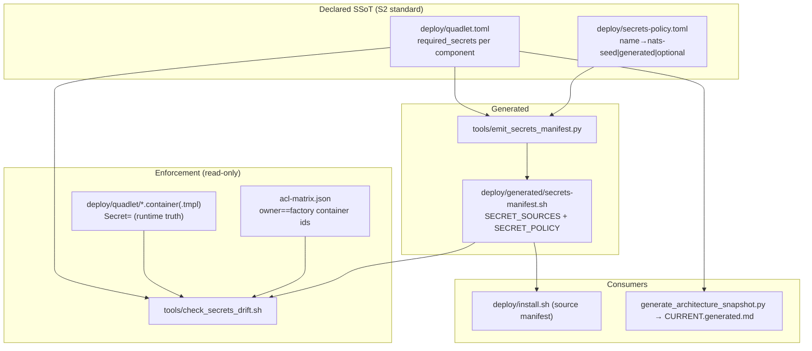

## Summary

Fix 8 cutover-exposed deploy/seed defects. Spine = #9: `deploy/quadlet.toml required_secrets` becomes the enforced secrets SSoT, derived into `install.sh` via a generated manifest, guarded by a drift gate cross-checking unit `Secret=` directives + acl-matrix (owner=factory). Six bounded fixes alongside.

## Architecture

## Agents

| Instance | Slices | Files | Subject |
|----------|--------|-------|---------|
| devops-A | S1 (gen) | secrets-policy.toml, emit_secrets_manifest.py, quadlet.toml, secrets-manifest.sh | secrets-gen |
| devops-B | S1 (scripts), S5 | install.sh, Makefile | install-scripts |
| devops-C | S2 | check_secrets_drift.sh, .claude/stack.yml, acl-matrix.json | gate |
| backend-A | S3 | scripts/_modes.py | genkeys |
| backend-B | S4 | agent_cmd/bots/init.py | bot-seed |
| backend-C | S6 | git_ownership_probe.py, container-deployment-standard.md | probe |
| tester-A | S7 | genkeys + bot tests | genkeys/bot |
| tester-B | S7 | emitter + gate + install.sh tests | secrets |
| tester-C | S7 | probe tests | probe |

## Wave Structure

3 waves, max 4 parallel agents. Elapsed ~3 units vs ~9 sequential.

| Wave | Trigger | Agents | Tasks |
|------|---------|--------|-------|
| 1 | start | 4 ∥ | devops-A: T1→T2→T3→T4 · backend-A: T8→T9 · backend-B: T10 · backend-C: T12→T13 |
| 2 | Wave 1 done (T4 for devops-B/C) | 2 ∥ | devops-B: T5→T11 · devops-C: T6→T7 |
| 3 | impl done per slice | 3 ∥ | tester-A: T15,T16 · tester-B: T14,T18 · tester-C: T17 |

### Budget — per task

| Task | Class | Est. ops |
|------|-------|----------|
| T1 secrets-policy.toml | bounded | 3 |
| T2 emit_secrets_manifest.py | exploratory | 10 |
| T3 complete quadlet.toml | bounded | 3 |
| T4 generate manifest | trivial | 2 |
| T5 install.sh rewrite + #13 symlink | judgmental | 6 |
| T6 check_secrets_drift.sh | judgmental | 6 |
| T7 stack.yml + acl annotate | bounded | 3 |
| T8 _seeds_dir unify (#10) | bounded | 3 |
| T9 root-guard relax (#7) | judgmental | 6 |
| T10 bot owner_users coerce (#11) | judgmental | 5 |
| T11 Makefile reorder (#12) | trivial | 2 |
| T12 probe hint (#14) | bounded | 3 |
| T13 standard doc rule (#14) | bounded | 3 |
| T14 emitter/gate tests | judgmental | 6 |
| T15 genkeys tests | judgmental | 5 |
| T16 bot tests | bounded | 3 |
| T17 probe tests | bounded | 3 |
| T18 install.sh dry-run test | bounded | 3 |

**Total estimated ops: ~75**

### Budget — per agent instance

| Instance | Tasks | Σ ops | Subjects | Split? |
|----------|-------|-------|----------|--------|
| devops-A | T1,T2,T3,T4 | 18 | secrets-gen | — |
| devops-B | T5,T11 | 8 | install-scripts | — |
| devops-C | T6,T7 | 9 | gate | — |
| backend-A | T8,T9 | 9 | genkeys | — |
| backend-B | T10 | 5 | bot-seed | — |
| backend-C | T12,T13 | 6 | probe | — |
| tester-A | T15,T16 | 8 | genkeys,bot | — |
| tester-B | T14,T18 | 9 | secrets | — |
| tester-C | T17 | 3 | probe | — |

All instances ≤4 tasks, ≤2 subjects, Σ ops ≤50 — no split required.

## Micro-Tasks

### S1 — secrets SSoT spine (#9, #13)
- **T1** [P] `deploy/secrets-policy.toml` (new) — one row per factory secret: `factory-nats-*`=nats-seed (source `nkeys/<identity>.seed`), `factory_blobstore_token`=generated, `factory-gh-pem`/`factory-claude-oauth`=optional. devops-A · subject: secrets-gen · V1.
  - Verify: `python3 -c "import tomllib,sys;tomllib.load(open('deploy/secrets-policy.toml','rb'))"`
- **T2** `tools/emit_secrets_manifest.py` (new) — read `quadlet.toml` `required_secrets` + `secrets-policy.toml`; emit `deploy/generated/secrets-manifest.sh` with `declare -A SECRET_SOURCES` + `SECRET_POLICY`. Parse helper for unit `Secret=` (`name=value.split(",")[0]`) reused by gate. devops-A · subject: secrets-gen · V1. blockedBy T1.
- **T3** `deploy/quadlet.toml` — complete `required_secrets` for all 8 components to match unit `Secret=` (add: telegram/discord `factory_blobstore_token`; clipool `factory-claude-oauth`; gh-helper `factory-gh-pem`+`factory-nats-gh-helper`; blobstore `factory-nats-blobstore`). devops-A · subject: secrets-gen · V1.
- **T4** generate `deploy/generated/secrets-manifest.sh` (run emitter) + commit. devops-A · V1. blockedBy T2,T3.
  - Verify: `grep factory-nats-gh-helper deploy/generated/secrets-manifest.sh`
- **T5** `deploy/install.sh` — replace hardcoded `SEEDS` with `source deploy/generated/secrets-manifest.sh`; iterate `SECRET_SOURCES`/`SECRET_POLICY` (optional→skip-if-absent). Fix #13: blob symlink step guards a pre-existing non-symlink dir (error+hint or safe replace). devops-B · subject: install-scripts · V1. blockedBy T4.
  - Verify: `bash deploy/install.sh --dry-run 2>&1 | grep factory-nats-gh-helper`

### S2 — drift gate (#9)
- **T6** `tools/check_secrets_drift.sh` (new) — assert: (a) every unit `Secret=` name (filter owner=factory) ∈ `required_secrets`, (b) `required_secrets` == generated manifest names, (c) `factory-nats-*` == acl-matrix `owner==factory & type==container` identities; optional secrets → SKIP. Hard-fail on undeclared. devops-C · subject: gate · V2. blockedBy T3,T4.
  - Verify: `bash tools/check_secrets_drift.sh; echo $?`
- **T7** register gate in `.claude/stack.yml quality_gates` (`secrets_drift`, pre-push + CI on deploy/); annotate `acl-matrix.json` `deploy.secret` comment "derived — see quadlet.toml". devops-C · subject: gate · V2. blockedBy T6.

### S3 — genkeys unification (#7, #10)
- **T8** [P] `scripts/_modes.py` `_seeds_dir()` → `factory_data_dir()/"nkeys"` (import `factory.paths`); keep `SEEDS_DIR` override (#10). backend-A · subject: genkeys · V3.
  - Verify: `grep -n "factory_data_dir" scripts/_modes.py`
- **T9** `scripts/_modes.py` — relax `_require_root()` (#7): make `/etc/nats/nkeys` dual-write opt-in (flag/env), drop blanket root for seed generation; update docstrings + error hints to name `--regen-authconf`/`--add-identity` rootless paths. **Confirm** no live `/etc/nats/nkeys` consumer first (host nats.service retired). backend-A · subject: genkeys · V3. blockedBy T8.

### S4 — bot seed coercion (#11)
- **T10** [P] `agent_cmd/bots/init.py` — `_BotSeedEntry.owner_users`/`trusted_users` accept `list[int|str]` + field validator coercing each→`str`; change `_merge_bots` line ~172 reject-non-str → coerce-to-str. BotRow stays `list[str]`. backend-B · subject: bot-seed · V4.
  - Verify: `uv run python -c "from factory.agent_cmd.bots.init import _BotSeedEntry; print(_BotSeedEntry.model_validate({'owner_users':[7377831990]}).owner_users)"`

### S5 — atomic install (#12)
- **T11** `Makefile quadlet-install` — move `@uv run factory bot init` to **before** the `@rm -f $(QUADLET_DIR)/factory*` line. devops-B · subject: install-scripts · V5. blockedBy T5 (same file region).
  - Verify: `awk '/quadlet-install:/{f=1} f&&/bot init/{print NR": init"} f&&/rm -f/{print NR": rm"}' Makefile | head`

### S6 — probe + standard (#14)
- **T12** [P] `bootstrap/infra/git_ownership_probe.py` — before `os.path.isdir`, detect `os.path.islink(target)` && unresolved → `log.error` with remediation hint "cross-ns bridge symlink must be RELATIVE". backend-C · subject: probe · V6.
  - Verify: `grep -n "islink\|relative" src/factory/bootstrap/infra/git_ownership_probe.py`
- **T13** [P] `~/projects/docs/container-deployment-standard.md` — add standard: "cross-namespace bridge symlinks MUST be relative". backend-C · subject: probe · V6.

### S7 — tests (RED-GATE per slice)
- **T14** tester-B — `tools/emit_secrets_manifest.py` + `check_secrets_drift.sh` tests: drift detection, owner=factory filter (no voicecli false-positive), optional-skip, undeclared→fail. V2. blockedBy T6,T7.
- **T15** tester-A — extend `tests/scripts/test_genkeys_modes*.py`: `_seeds_dir()` honors ROXABI_FACTORY_DIR + SEEDS_DIR; no `.lyra`; root-guard relaxed for rootless seed gen. V3. blockedBy T9.
- **T16** tester-A — bot init: int `owner_users` coerced, rows seeded, idempotent. V4. blockedBy T10.
- **T17** tester-C — `git_ownership_probe` dangling/absolute symlink → remediation hint, not generic crash. V6. blockedBy T12.
- **T18** tester-B — `install.sh --dry-run` lists all 7 factory-nats-* incl gh-helper; blob symlink guard against pre-existing dir. V1. blockedBy T5.

## Task Seeding Blueprint

<!-- Used by /implement to seed TaskCreate. T{n} | agent-instance | blockedBy | subject. blockedBy refs T-numbers. -->

### Wave 1 — no deps, 4 agents ∥
| Task | Agent instance | blockedBy | Subject |
|------|---------------|-----------|---------|
| T1 | devops-A | — | secrets-gen |
| T2 | devops-A | T1 | secrets-gen |
| T3 | devops-A | — | secrets-gen |
| T4 | devops-A | T2,T3 | secrets-gen |
| T8 | backend-A | — | genkeys |
| T9 | backend-A | T8 | genkeys |
| T10 | backend-B | — | bot-seed |
| T12 | backend-C | — | probe |
| T13 | backend-C | — | probe |

### Wave 2 — after T4, 2 agents ∥
| Task | Agent instance | blockedBy | Subject |
|------|---------------|-----------|---------|
| T5 | devops-B | T4 | install-scripts |
| T11 | devops-B | T5 | install-scripts |
| T6 | devops-C | T3,T4 | gate |
| T7 | devops-C | T6 | gate |

### Wave 3 — tests after impl, 3 agents ∥
| Task | Agent instance | blockedBy | Subject |
|------|---------------|-----------|---------|
| T14 | tester-B | T6,T7 | secrets |
| T18 | tester-B | T5 | secrets |
| T15 | tester-A | T9 | genkeys |
| T16 | tester-A | T10 | bot-seed |
| T17 | tester-C | T12 | probe |

## Task IDs

<!-- Generated by /plan. Used by /implement to resume tasks on session restart. -->
- T1: 14 — secrets-gen
- T2: 15 — secrets-gen
- T3: 16 — secrets-gen
- T4: 17 — secrets-gen
- T5: 18 — install-scripts
- T6: 19 — gate
- T7: 20 — gate
- T8: 21 — genkeys
- T9: 22 — genkeys
- T10: 23 — bot-seed
- T11: 24 — install-scripts
- T12: 25 — probe
- T13: 26 — probe
- T14: 27 — secrets
- T15: 28 — genkeys
- T16: 29 — bot-seed
- T17: 30 — probe
- T18: 31 — secrets

## Consistency Report

- Acceptance criteria covered: 8/8 defects (#9→T1-T7, #13→T5, #7→T9, #10→T8, #11→T10, #12→T11, #14→T12-T13). Tests: 5 slices covered (T14-T18).
- Untraced tasks: none.
- Exemptions: none.
