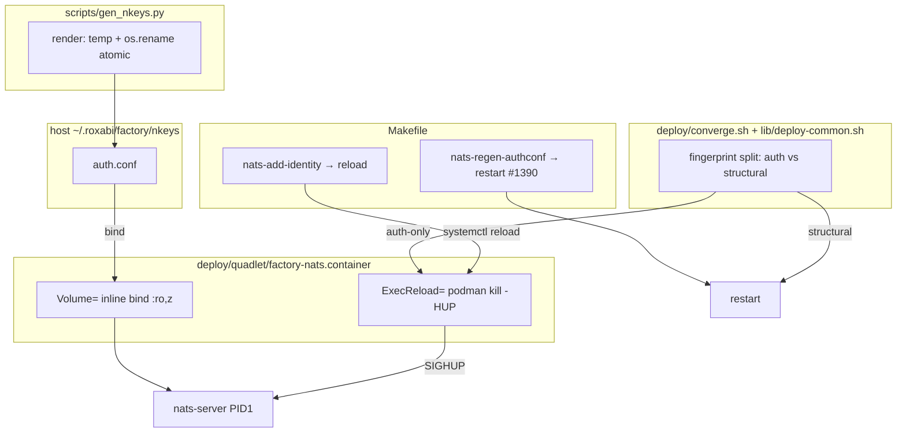
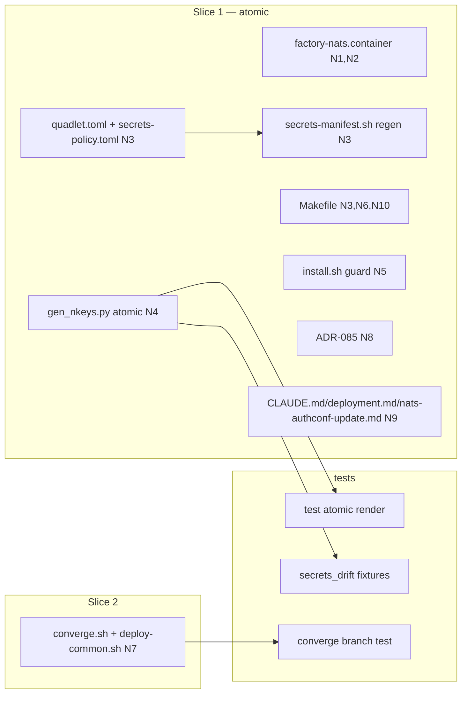

## Summary

Switch `auth.conf` from a Podman `type=mount` secret to an inline bind mount + add `ExecReload=`
SIGHUP wiring, so a pure `make nats-add-identity` reloads `factory-nats` live with zero client
restart. Slice 1 (delivery + add-path + secret-drop + docs/ADR) is **atomic**; Slice 2 adds the
converge auth-only reload branch. Deploy is gated behind an M₁ SIGHUP spike.

## Architecture

## Bootstrap Context

- Approved analysis: `artifacts/analyses/1719-nats-identity-add-sighup-bind-mount-analysis.mdx`
  (Shape C; F1-F14 findings; 3-reviewer pass).
- Approved spec: `artifacts/specs/1719-nats-identity-add-sighup-bind-mount-spec.mdx`.
- **Inline-bind precedent:** `factory-nats.container:20` (`nats-container.conf` `:ro,z`) — copy the form.
- **`turns.db` first-boot pattern:** `install.sh:291-296` — copy for the auth.conf guard.
- **Manifest is generated:** `python3 tools/emit_secrets_manifest.py` → `deploy/generated/secrets-manifest.sh` (never hand-edit).
- `check_secrets_drift.sh` excludes `factory-nats-auth` from check (c); checks (a)+(b) still bind.
- **Spike-gate:** code can merge on CI-green; deploy to M₁ blocked until the SIGHUP spike passes.

## Agents

| Agent instance | Tasks | Files |
|----------------|-------|-------|
| devops-A | T1, T2, T3 | factory-nats.container, quadlet.toml, secrets-policy.toml, secrets-manifest.sh |
| devops-B | T4, T5 | Makefile, install.sh |
| devops-C | T12 | converge.sh, deploy-common.sh |
| backend-dev-A | T6 | scripts/gen_nkeys.py |
| doc-writer-A | T7, T8 | adr/085-…mdx, deploy/CLAUDE.md, deployment.md, nats-authconf-update.md |
| tester-A | T9, T10, T11 | tests (atomic render, secrets_drift), Slice-1 RED-GATE |
| tester-B | T13, T14 | tests (converge), Slice-2 RED-GATE |

## Micro-Tasks

### Slice 1 — Delivery + add-path (atomic)

**T1** [P] · devops-A · subject: quadlet · SC-1 · diff 3
Edit `deploy/quadlet/factory-nats.container`: replace L28 `Secret=factory-nats-auth,type=mount,target=/etc/nats/nkeys/auth.conf,mode=0444` → `Volume=%h/.roxabi/factory/nkeys/auth.conf:/etc/nats/nkeys/auth.conf:ro,z`; add to `[Service]`/container `ExecReload=/usr/bin/podman kill --signal=HUP factory-nats`; update the ADR-054 comment (L25-27) to cite ADR-085.
Verify: `grep -E 'Volume=.*auth.conf|ExecReload=.*HUP' deploy/quadlet/factory-nats.container && ! grep -q 'Secret=factory-nats-auth' deploy/quadlet/factory-nats.container`

**T2** [P] · devops-A · subject: secrets · SC-1 · diff 2
Remove `factory-nats-auth` from `deploy/quadlet.toml` `[component.nats].required_secrets`; remove the `nats-auth` entry from `deploy/secrets-policy.toml`.
Verify: `! grep -q 'factory-nats-auth' deploy/quadlet.toml && ! grep -q 'nats-auth' deploy/secrets-policy.toml`

**T3** · devops-A · subject: secrets · SC-1,SC-2 · diff 1 · blockedBy T1,T2
Run `python3 tools/emit_secrets_manifest.py`; confirm `factory-nats-auth` removed from generated file.
Verify: `! grep -q 'factory-nats-auth' deploy/generated/secrets-manifest.sh`

**T4** · devops-B · subject: makefile · SC-5,SC-6(M₁) · diff 4
Edit `Makefile`: delete `podman secret create --replace factory-nats-auth` at L214 (`quadlet-secrets-install`), L342 (`nats-regen-authconf`), L370 (`nats-add-identity`); rewrite `nats-add-identity` restart+client-fan-out (L370-377) → `systemctl --user reload factory-nats` (no client loop); leave `nats-regen-authconf` restart loop intact.
Verify: `! grep -q 'podman secret create --replace factory-nats-auth' Makefile && grep -q 'reload factory-nats' Makefile`

**T5** · devops-B · subject: provisioning · SC-4 · diff 3
Edit `deploy/install.sh`: add first-boot guard rendering auth.conf to host path if absent, **before** the unit-copy step (~L298), mirroring the `turns.db` pre-create at L291-296; keep the UDET-placeholder validation at L56-64.
Verify: `grep -n 'auth.conf' deploy/install.sh | head` (guard present before unit copy)

**T6** [P] · backend-dev-A · subject: render · SC-4 · diff 3
Edit `scripts/gen_nkeys.py`: write auth.conf via NamedTemporaryFile (same dir) + `os.replace`/`os.rename` (atomic); never truncate-in-place.
Verify: `grep -E 'os\.(replace|rename)|NamedTemporaryFile' scripts/gen_nkeys.py`

**T7** [P] · doc-writer-A · subject: docs · SC-3 · diff 3
Create `docs/architecture/adr/085-public-aclbundle-bindmount-sighup.mdx`: amend/supersede ADR-055 — public ACL bundle (auth.conf, no `S…` seeds) exempt from `type=mount`, may use inline bind for live SIGHUP reload; private seeds unchanged; record Shape B as rejected (frame:55). Add to `adr/meta.json`.
Verify: `ls docs/architecture/adr/085-*.mdx && grep -q '085' docs/architecture/adr/meta.json`

**T8** · doc-writer-A · subject: docs · SC-2,SC-3 · diff 3 · blockedBy T7
Update `deploy/CLAUDE.md` (L145 carve-out + L95-97 convergence-step prose), `docs/architecture/deployment.md` (Volumes table + "Credentials use type=mount" invariant L225), `docs/ops/nats-authconf-update.md` ("Why restart not SIGHUP" → new add path); cite ADR-085.
Verify: `python3 tools/check_doc_drift.py`

**T9** · tester-A · subject: tests · SC-4 · diff 3 · blockedBy T6
Add unit test asserting `gen_nkeys` writes auth.conf atomically (temp file created in target dir, renamed; no partial content observable).
Verify: `uv run pytest -k 'gen_nkeys and atomic' -q`

**T10** · tester-A · subject: tests · SC-2 · diff 2 · blockedBy T2,T3
Update any test fixtures / expectations referencing `factory-nats-auth` as a required secret so `check_secrets_drift.sh` passes.
Verify: `bash tools/check_secrets_drift.sh`

**T11 · RED-GATE Slice 1** · tester-A · subject: tests · SC-1,2,3,4,5 · blockedBy T1-T10
Run full gate: `bash tools/check_secrets_drift.sh && bash tools/check_volumes_table.sh && python3 tools/check_doc_drift.py && uv run ruff check . && uv run pyright && uv run pytest -q`. All must pass.
Verify: exit 0 on all.

### Slice 2 — Converge auth-only reload branch

**T12** · devops-C · subject: converge · SC-6(M₁) · diff 4 · blockedBy T11
Edit `deploy/converge.sh` + `deploy/lib/deploy-common.sh`: split the `:`-joined fingerprint (handle `none` + 3-vs-4-field), branch auth-only drift → `systemctl --user reload factory-nats` (no client fan-out); structural drift → existing restart; drop `podman secret create --replace factory-nats-auth` (converge.sh:48).
Verify: `grep -q 'reload factory-nats' deploy/converge.sh && ! grep -q 'podman secret create --replace factory-nats-auth' deploy/converge.sh`

**T13** · tester-B · subject: tests · SC-6 · diff 3 · blockedBy T12
Add a test for the fingerprint-split helper (auth-only vs structural classification); if reload path is shell-only, assert via extracted bash function or document as M₁-only with a code-level assertion on the classifier.
Verify: `uv run pytest -k 'converge and (fingerprint or reload)' -q` (or documented M₁-only)

**T14 · RED-GATE Slice 2** · tester-B · subject: tests · blockedBy T12,T13
Re-run full gate (as T11). All must pass.
Verify: exit 0 on all.

## Wave Structure

6 waves, max 4 parallel agents. Elapsed ~1 week vs ~2 sequential.

| Wave | Trigger | Agents | Tasks |
|------|---------|--------|-------|
| 1 | start | 4 ∥ | devops-A: T1→T2 · devops-B: T4→T5 · backend-dev-A: T6 · doc-writer-A: T7 |
| 2 | Wave 1 done | 3 ∥ | devops-A: T3 · doc-writer-A: T8 · tester-A: T9, T10 |
| 3 | Wave 2 done | 1 | tester-A: T11 (RED-GATE Slice 1) |
| 4 | Slice 1 green | 1 | devops-C: T12 |
| 5 | Wave 4 done | 1 | tester-B: T13 |
| 6 | Wave 5 done | 1 | tester-B: T14 (RED-GATE Slice 2) |

### Budget — per task

| Task | Items | Class | Est. ops | Split? |
|------|-------|-------|----------|--------|
| T1 | 1 | judgmental | 4 | — |
| T2 | 1 | bounded | 3 | — |
| T3 | 1 | trivial | 2 | — |
| T4 | 1 | judgmental | 6 | — |
| T5 | 1 | judgmental | 5 | — |
| T6 | 1 | judgmental | 5 | — |
| T7 | 1 | judgmental | 6 | — |
| T8 | 1 | judgmental | 6 | — |
| T9 | 1 | judgmental | 5 | — |
| T10 | 1 | bounded | 3 | — |
| T11 | 1 | bounded | 3 | — |
| T12 | 1 | judgmental | 6 | — |
| T13 | 1 | judgmental | 5 | — |
| T14 | 1 | bounded | 3 | — |

**Total estimated ops: ~62**

### Budget — per agent instance

| Instance | Tasks | Σ ops | Subjects | Split? |
|----------|-------|-------|----------|--------|
| devops-A | T1, T2, T3 | 9 | quadlet, secrets | — |
| devops-B | T4, T5 | 11 | makefile, provisioning | — |
| devops-C | T12 | 6 | converge | — |
| backend-dev-A | T6 | 5 | render | — |
| doc-writer-A | T7, T8 | 12 | docs | — |
| tester-A | T9, T10, T11 | 11 | tests | — |
| tester-B | T13, T14 | 8 | tests | — |

## Consistency Report

- Success criteria covered: 8/8 (SC1→T1,T2,T3; SC2→T3,T10,T8; SC3→T7,T8; SC4→T5,T6,T9; SC5→T4; SC6→T12; SC7→T4(regen unchanged); SC8 spike→operator gate, not a code task).
- Affordances covered: N1,N2→T1; N3→T2,T3,T4,T10; N4→T6,T9; N5→T5; N6→T4; N7→T12; N8→T7; N9→T8; N10→T4.
- Uncovered: none.
- Untraced tasks: none.
- Exemptions: SC8 (M₁ spike) is an operator gate, no code task; SC6/zero-drop M₁-validated post-merge.

## Task Seeding Blueprint

<!-- Used by /implement to seed TaskCreate calls on session start.
     T{n} | agent-instance | blockedBy | subject. blockedBy refs T-numbers. -->

### Wave 1 — no deps, 4 agents ∥

| Task | Agent instance | blockedBy | Subject |
|------|---------------|-----------|---------|
| T1 | devops-A | — | quadlet |
| T2 | devops-A | T1 | secrets |
| T4 | devops-B | — | makefile |
| T5 | devops-B | T4 | provisioning |
| T6 | backend-dev-A | — | render |
| T7 | doc-writer-A | — | docs |

### Wave 2 — after Wave 1

| Task | Agent instance | blockedBy | Subject |
|------|---------------|-----------|---------|
| T3 | devops-A | T1, T2 | secrets |
| T8 | doc-writer-A | T7 | docs |
| T9 | tester-A | T6 | tests |
| T10 | tester-A | T2, T3 | tests |

### Wave 3 — Slice 1 RED-GATE

| Task | Agent instance | blockedBy | Subject |
|------|---------------|-----------|---------|
| T11 | tester-A | T1, T2, T3, T4, T5, T6, T7, T8, T9, T10 | tests |

### Wave 4 — Slice 2 (after Slice 1 green)

| Task | Agent instance | blockedBy | Subject |
|------|---------------|-----------|---------|
| T12 | devops-C | T11 | converge |

### Wave 5 — Slice 2 test

| Task | Agent instance | blockedBy | Subject |
|------|---------------|-----------|---------|
| T13 | tester-B | T12 | tests |

### Wave 6 — Slice 2 RED-GATE

| Task | Agent instance | blockedBy | Subject |
|------|---------------|-----------|---------|
| T14 | tester-B | T12, T13 | tests |

## Task IDs

<!-- Generated by /plan. Used by /implement to resume tasks on session restart. -->
- T1: 13 — quadlet (devops-A)
- T2: 14 — secrets (devops-A)
- T3: 15 — secrets (devops-A)
- T4: 16 — makefile (devops-B)
- T5: 17 — provisioning (devops-B)
- T6: 18 — render (backend-dev-A)
- T7: 19 — docs (doc-writer-A)
- T8: 20 — docs (doc-writer-A)
- T9: 21 — tests (tester-A)
- T10: 22 — tests (tester-A)
- T11: 23 — tests / RED-GATE Slice 1 (tester-A)
- T12: 24 — converge (devops-C)
- T13: 25 — tests (tester-B)
- T14: 26 — tests / RED-GATE Slice 2 (tester-B)
