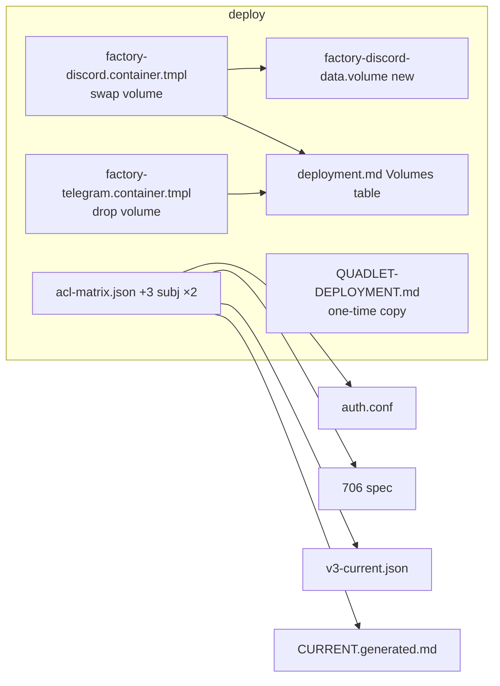

## Summary

Introduce a `LastSessionStore` driven port; adapters write+read last-session to a new
`factory-turns-meta` KV bucket while the hub keeps the TurnStore file path; then drop the
adapter TurnStore wiring (standalone + unified), relocate discord.db to a private volume,
grant the ACL, and make the Volumes table truthful — so `factory-data.volume` is hub-only.

## Architecture

```mermaid
flowchart TD
  subgraph core[core/ports]
    P[last_session_store.py<br/>LastSessionStore Protocol]
  end
  subgraph infra[infrastructure/stores]
    KV[turn_session_kv.py<br/>KvLastSessionStore]
  end
  subgraph wiring[bootstrap/wiring]
    W[TurnStoreLastSession<br/>hub no-op set]
    SD[standalone_discord.py]
    ST[standalone_telegram.py]
    BW[bootstrap_wiring.py<br/>unified path]
  end
  subgraph inbound[inbound]
    SB[session_builder.py<br/>ctx.last_session get/set]
    CX[context.py<br/>SessionCtx.last_session]
  end
  subgraph boot[bootstrap]
    OS[bootstrap_stores.open_stores<br/>provision factory-turns-meta]
  end
  P --> KV --> SD & ST & BW
  P --> W --> BW
  CX --> SB --> P
  OS --> KV
  KV -.kv.put/get.-> NATS[(factory-turns-meta)]
  W -.file.-> TDB[(turns.db hub)]
```



## Bootstrap Context

- Mirror `src/factory/infrastructure/stores/message_index_kv.py` (#1059) for KV store + `ensure_kv`.
- Provision site: `src/factory/bootstrap/bootstrap_stores.py` `open_stores` (~:294, where msg-index is provisioned).
- ACL pattern: copy the `factory_outbound_audio_sent` **adapter publish** grant shape (3 subjects), NOT msg-index (hub-only). Regen chain per spec ACL section.
- Read seam: `src/factory/inbound/session_builder.py:94` (read) + `:105-121` `_turnstore_update_fn` (write). Hub inject: `bootstrap_wiring.py:213,270`.

## Agents

| Agent instance | Tasks | Files | Subject |
|----------------|-------|-------|---------|
| backend-dev-A | T1–T4 | core/ports, infrastructure/stores, bootstrap (provision + wrapper) | port, kv |
| backend-dev-B | T5–T8 | inbound, bootstrap/wiring (standalone+unified), adapters | session, wiring |
| devops-A | T10 | acl-matrix.json + 4 regen artifacts | acl |
| devops-B | T11–T13 | deploy/quadlet, deployment.md, QUADLET-DEPLOYMENT.md | deploy |
| tester-A | T20–T22 | tests | tests |

## Wave Structure

3 waves, max 3 parallel agents. Elapsed ~1 day vs ~2 sequential.

| Wave | Trigger | Agents | Tasks |
|------|---------|--------|-------|
| 1 | start | 3 ∥ | backend-dev-A: T1→T2→T3, T4 · devops-A: T10 · devops-B: T11,T12→T13 |
| 2 | backend-dev-A done | 1 | backend-dev-B: T5→{T6,T7}→T8 |
| 3 | Wave 2 done | 1 | tester-A: T20,T21,T22 → T30 RED-GATE |

### Budget — per task

| Task | Items | Class | Est. ops | Split? |
|------|-------|-------|----------|--------|
| T1 port | 1 | bounded | 2 | — |
| T2 KvLastSessionStore | 1 | judgmental | 6 | — |
| T3 provision | 1 | bounded | 3 | — |
| T4 wrapper | 1 | bounded | 3 | — |
| T5 SessionBuilder/ctx | 2 | judgmental | 6 | — |
| T6 standalone wiring | 2 | judgmental | 6 | — |
| T7 unified wiring | 1 | judgmental | 4 | — |
| T8 adapter ctors+inbound | 4 | judgmental | 8 | — |
| T10 ACL + regen | 5 | exploratory | 14 | — (atomic; staged last) |
| T11 discord volume | 2 | bounded | 4 | — |
| T12 telegram drop | 1 | trivial | 2 | — |
| T13 deployment.md + runbook | 2 | judgmental | 6 | — |
| T20 KV/wrapper unit tests | 3 | judgmental | 8 | — |
| T21 SessionBuilder test | 1 | judgmental | 5 | — |
| T22 adapter-boot integration | 2 | judgmental | 8 | — |
| T30 RED-GATE | 1 | bounded | 4 | — |

**Total estimated ops: ~97**

### Budget — per agent instance

| Instance | Tasks | Σ ops | Subjects | Split? |
|----------|-------|-------|----------|--------|
| backend-dev-A | T1,T2,T3,T4 | 14 | port, kv | — |
| backend-dev-B | T5,T6,T7,T8 | 24 | session, wiring | — |
| devops-A | T10 | 14 | acl | — |
| devops-B | T11,T12,T13 | 12 | deploy | — |
| tester-A | T20,T21,T22 | 21 | tests | — |

## Consistency Report

Covered: 11/11 breadboard affordances (N1–N11 + N6b). Spec criteria → tasks:

| Spec criterion | Task |
|----------------|------|
| volume off adapter templates (grep empty) | T11,T12,T30 |
| factory-data.volume hub-only | T11,T12,T30 |
| no adapter store under ~/.roxabi/factory (both paths) | T6,T7,T8,T22 |
| SessionBuilder via ctx.last_session only | T5,T21 |
| bucket name byte-matches ACL prefix | T2,T10,T20 |
| hub session resolution unchanged | T4,T5,T21 |
| bucket provisioned idempotently; bind tolerates missing | T2,T3,T20 |
| ACL grants + 4-artifact regen + secrets_drift green | T10,T30 |
| deployment.md truthful + volumes_table green | T13,T30 |
| QUADLET runbook one-time copy + cleanup | T13 |
| pytest/ruff/pyright green | T30 |
| .importlinter allows inbound→core.ports | T1 (verify) |

Untraced tasks: none. Exemptions: epic AC#3/#4 verification + AC#2 prod cleanup = manual close (D10), not code tasks.

## Micro-Tasks

### Slice S1 — KV store + provisioning (backend-dev-A)

**T1** — `LastSessionStore` Protocol · `src/factory/core/ports/last_session_store.py` · subject: port · SC-trace: N1 · Difficulty 1
```python
class LastSessionStore(Protocol):
    async def get_last_session(self, pool_id: str) -> str | None: ...
    async def set_last_session(self, pool_id: str, session_id: str) -> None: ...
```
Verify: `grep -q "class LastSessionStore" src/factory/core/ports/last_session_store.py && grep -n "inbound" .importlinter` (confirm inbound→core.ports legal). 

**T2** — `KvLastSessionStore` · `src/factory/infrastructure/stores/turn_session_kv.py` (mirror `message_index_kv.py`) · subject: kv · N2 · Diff 3 · blockedBy T1
- `KV_BUCKET = "factory-turns-meta"` (byte-match ACL); `_kv_config(retention_days)` with TTL.
- `ensure_kv(js, retention_days)` create-or-bind (`BadRequestError` catch).
- `connect(js)`: bind; on missing bucket → `_kv=None` + warn (no raise).
- `get_last_session(pool_id)` → `kv.get(f"last_session.{pool_id}")` → None on `KeyNotFoundError`/`NoKeysError`/`_kv is None`.
- `set_last_session(pool_id, sid)` → `kv.put`.
Verify: `uv run pyright src/factory/infrastructure/stores/turn_session_kv.py`

**T3** — provision in `open_stores` · `src/factory/bootstrap/bootstrap_stores.py` · subject: kv · N4 · Diff 2 · blockedBy T2
Call `ensure_kv` alongside the msg-index provisioning. Verify: `grep -n "factory-turns-meta" src/factory/bootstrap/bootstrap_stores.py`

**T4** — `TurnStoreLastSession` wrapper · `src/factory/bootstrap/wiring/` · subject: port · N3 · Diff 2 · blockedBy T1
get→`ts.get_last_session`; set→no-op. Verify: `grep -q "class TurnStoreLastSession" src/factory/bootstrap/wiring/*.py`

### Slice S2 — SessionBuilder port (backend-dev-B)

**T5** — SessionCtx field + read/write swap · `src/factory/inbound/context.py` + `session_builder.py` · subject: session · N5 · Diff 3 · blockedBy T1
- `context.py`: add `last_session: LastSessionStore | None = None`.
- `session_builder.py:94`: replace `ts.get_last_session(_pool_id)` → `ctx.last_session.get_last_session(_pool_id)` (guard None).
- `_turnstore_update_fn`: after `publish_start_session`, add `await ctx.last_session.set_last_session(pool_id, session_id)` (guard None).
Verify: `grep -n "ctx.last_session" src/factory/inbound/session_builder.py && ! grep -n "ts.get_last_session" src/factory/inbound/session_builder.py`

### Slice S3 — drop adapter TurnStore (backend-dev-B)

**T6** — standalone wiring · `standalone_discord.py`, `standalone_telegram.py` · subject: wiring · N6 · Diff 3 · blockedBy T2,T5
Remove TurnStore open (`_create_dc_stores` turns.db; tg `:45`) + teardown closes (`:81`/`:100`); construct + connect `KvLastSessionStore`; inject into adapter as `last_session`. Discord keeps ThreadStore.
Verify: `! grep -n "TurnStore(" src/factory/bootstrap/wiring/standalone_*.py`

**T7** — unified wiring · `bootstrap_wiring.py:213,270` · subject: wiring · N6b · Diff 2 · blockedBy T2,T5
Swap `turn_store=deps.hub._turn_store` → `last_session=TurnStoreLastSession(deps.hub._turn_store)` (hub) for adapter ctors. Verify: `grep -n "last_session=" src/factory/bootstrap/wiring/bootstrap_wiring.py`

**T8** — adapter constructors + inbound wiring · `telegram.py`, `discord/adapter.py`, `telegram_inbound.py`, `discord_inbound.py` · subject: wiring · N7 · Diff 3 · blockedBy T6,T7
Swap `turn_store: TurnStoreProtocol|None` → `last_session: LastSessionStore|None`; SessionCtx construction passes `last_session`. Verify: `uv run pyright src/factory/adapters/telegram src/factory/adapters/discord`

### Slice S4 — ACL grants + regen (devops-A)

**T10** — ACL + regen (atomic, staged last) · `deploy/nats/acl-matrix.json` + 4 artifacts · subject: acl · N8 · Diff 4
- Add to telegram-adapter + discord-adapter **publish**: `$KV.factory-turns-meta.>`, `$JS.API.STREAM.INFO.KV_factory-turns-meta`, `$JS.API.STREAM.MSG.GET.KV_factory-turns-meta`. turn-writer unchanged.
- Regen: auth.conf → 706 spec + v3-current.json → CURRENT.generated.md (confirm genkeys flag).
Verify: `bash scripts/check-acl-authconf-drift.sh && bash scripts/check-acl-specs-drift.sh && bash tools/check_secrets_drift.sh`

### Slice S5 — quadlet volumes + docs (devops-B)

**T11** — discord private volume · `deploy/quadlet/factory-discord-data.volume` (new, bind `%h/.roxabi/factory-discord`) + `factory-discord.container.tmpl` swap · subject: deploy · N9 · Diff 2
Verify: `grep -n "factory-discord-data" deploy/quadlet/factory-discord.container.tmpl`

**T12** — telegram volume drop · `factory-telegram.container.tmpl` remove `Volume=factory-data.volume` · subject: deploy · N10 · Diff 1 · 
Verify: `! grep -n "factory-data.volume" deploy/quadlet/factory-telegram.container.tmpl`

**T13** — deployment.md + runbook · `docs/architecture/deployment.md` (de-stale adapter rows + discord-private row) + `docs/QUADLET-DEPLOYMENT.md` (one-time copy section) · subject: docs · N11 · Diff 3 · blockedBy T11,T12
Verify: `bash tools/check_volumes_table.sh`

### Slice tests (tester-A)

**T20** — unit: KvLastSessionStore + wrapper · subject: tests · Diff 3 · blockedBy T2,T4
put/get round-trip; miss→None; missing-bucket bind→None (no raise); bucket name == `factory-turns-meta`; TurnStoreLastSession set is no-op. Verify: `uv run pytest -k "turn_session_kv or last_session"`

**T21** — SessionBuilder port test · subject: tests · Diff 2 · blockedBy T5
reads via ctx.last_session; None → new session; set called after assignment. Verify: `uv run pytest -k session_builder`

**T22** — integration: adapter boots w/o turns.db · subject: tests · Diff 3 · blockedBy T8
standalone + unified wiring construct adapters without opening turns.db. Verify: `uv run pytest -k "adapter_boot or standalone_wiring"`

### RED-GATE

**T30** — final gate · subject: gate · blockedBy T8,T10,T13,T20,T21,T22
`grep` adapters have no `factory-data.volume`; `volumes_table`, `secrets_drift`, acl-drift green; `uv run pytest && uv run ruff check . && uv run pyright`.

## Task Seeding Blueprint

<!-- Used by /implement to seed TaskCreate calls. T{n} | agent-instance | blockedBy | subject. blockedBy refs T-numbers. -->

### Wave 1 — no deps, 3 agents ∥

| Task | Agent instance | blockedBy | Subject |
|------|---------------|-----------|---------|
| T1 | backend-dev-A | — | port |
| T2 | backend-dev-A | T1 | kv |
| T3 | backend-dev-A | T2 | kv |
| T4 | backend-dev-A | T1 | port |
| T10 | devops-A | — | acl |
| T11 | devops-B | — | deploy |
| T12 | devops-B | — | deploy |
| T13 | devops-B | T11,T12 | docs |

### Wave 2 — after backend-dev-A, 1 agent

| Task | Agent instance | blockedBy | Subject |
|------|---------------|-----------|---------|
| T5 | backend-dev-B | T1 | session |
| T6 | backend-dev-B | T2,T5 | wiring |
| T7 | backend-dev-B | T2,T5 | wiring |
| T8 | backend-dev-B | T6,T7 | wiring |

### Wave 3 — after Wave 2, 1 agent

| Task | Agent instance | blockedBy | Subject |
|------|---------------|-----------|---------|
| T20 | tester-A | T2,T4 | tests |
| T21 | tester-A | T5 | tests |
| T22 | tester-A | T8 | tests |
| T30 | tester-A | T8,T10,T13,T20,T21,T22 | gate |

## Task IDs

<!-- Generated by /plan. Used by /implement to resume tasks on session restart. -->
- T1: 12 — port (backend-dev-A)
- T2: 13 — kv (backend-dev-A)
- T3: 14 — kv (backend-dev-A)
- T4: 15 — port (backend-dev-A)
- T5: 16 — session (backend-dev-B)
- T6: 17 — wiring (backend-dev-B)
- T7: 18 — wiring (backend-dev-B)
- T8: 19 — wiring (backend-dev-B)
- T10: 20 — acl (devops-A)
- T11: 21 — deploy (devops-B)
- T12: 22 — deploy (devops-B)
- T13: 23 — docs (devops-B)
- T20: 24 — tests (tester-A)
- T21: 25 — tests (tester-A)
- T22: 26 — tests (tester-A)
- T30: 27 — gate (tester-A)
