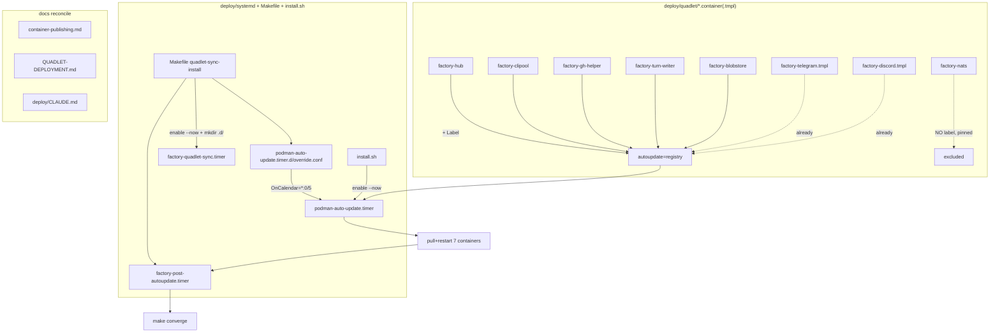
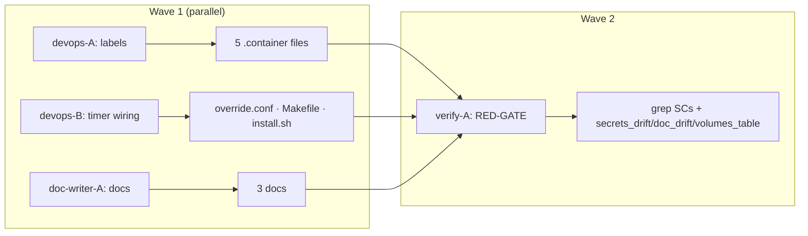

## Summary

Repair M₁ auto-deploy by encoding three latent fixes in the repo (AutoUpdate label coverage,
`enable --now` + drop-in for the 5-min cadence, `install.sh` host-timer enable) and reconciling
three docs + an M₁ remediation runbook. Pure devops + docs; no application code.

## Architecture





## Bootstrap Context

Reference conventions (read before editing):
- Label placement: `deploy/quadlet/factory-telegram.container.tmpl:14` (`Label=...` immediately after `Image=`).
- Makefile target: `Makefile:188–199` (`quadlet-sync-install`) — preserve `cp factory-deploy-failure.service` (~194).
- Host-timer idempotent pattern: `deploy/provision.sh:245–256` (model for install.sh, but drop the `is-active` guard).
- Doc tables: `docs/ops/container-publishing.md:128–139` (Containers managed), `:171–185` (manual pull), `deploy/CLAUDE.md:103–108` (timer table).

## Agents

| Agent instance | Tasks | Files |
|----------------|-------|-------|
| devops-A | T1 | 5 `deploy/quadlet/*.container` (+ nats negative assert) |
| devops-B | T2, T3, T4 | `deploy/systemd/podman-auto-update.timer.d/override.conf`, `Makefile`, `deploy/install.sh` |
| doc-writer-A | T5, T6, T7 | `docs/ops/container-publishing.md`, `docs/QUADLET-DEPLOYMENT.md`, `deploy/CLAUDE.md` |
| verify-A | T8 | (read-only) gates + grep assertions |

## Wave Structure

2 waves, max 3 parallel agents. Elapsed ~1 session vs ~2 sequential.

| Wave | Trigger | Agents | Tasks |
|------|---------|--------|-------|
| 1 | start | 3 ∥ | devops-A: T1 · devops-B: T2→T3→T4 · doc-writer-A: T5, T6, T7 |
| 2 | Wave 1 done | 1 | verify-A: T8 (RED-GATE) |

### Budget — per task

| Task | Items | Class | Est. ops | Split? |
|------|-------|-------|----------|--------|
| T1 labels | 5 files | bounded | 8 | — |
| T2 drop-in | 1 new file | trivial | 2 | — |
| T3 Makefile | 1 target | judgmental | 5 | — |
| T4 install.sh | 1 insert | bounded | 3 | — |
| T5 container-publishing.md | multi-section | judgmental | 6 | — |
| T6 QUADLET-DEPLOYMENT.md | 1 section | judgmental | 5 | — |
| T7 deploy/CLAUDE.md | 1 table row | bounded | 3 | — |
| T8 verify gates | 3 gates + greps | judgmental | 6 | — |

**Total estimated ops: ~38**

### Budget — per agent instance

| Instance | Tasks | Σ ops | Subjects | Split? |
|----------|-------|-------|----------|--------|
| devops-A | T1 | 8 | labels | — |
| devops-B | T2,T3,T4 | 10 | deploy-wiring | — (3 tasks ≤4, 1 subject) |
| doc-writer-A | T5,T6,T7 | 14 | docs | — (3 tasks ≤4, 1 subject) |
| verify-A | T8 | 6 | gates | — |

## Consistency Report

Covered: SC1→T1, SC2→T3, SC3→T2+T3, SC4→T4, SC5→T5, SC6→T5, SC7→T7, SC8→T6, SC10(gates)→T8.
SC9 (prod-green, operator-run on M₁) — intentionally untraced to a code task; verified post-merge
by operator, recorded on #1729. Documented in T6 runbook.
Uncovered: none. Untraced: SC9 (by design). Exemptions: SC9.

## Micro-Tasks

### Slice V1 — AutoUpdate label coverage

**T1** [devops-A · subject: labels · SC1 · V1 · GREEN · diff:2]
Add `Label=io.containers.autoupdate=registry` into the `[Container]` section (immediately after
the `Image=` line) of: `factory-hub.container`, `factory-clipool.container`,
`factory-gh-helper.container`, `factory-turn-writer.container`, `factory-blobstore.container`.
Do **not** touch `factory-nats.container` (pinned). Mirror placement from
`factory-telegram.container.tmpl:14`.
Verify: `grep -l 'autoupdate=registry' deploy/quadlet/*.container deploy/quadlet/*.container.tmpl | wc -l` → 7; `grep -L 'autoupdate=registry' deploy/quadlet/factory-nats.container` matches.

### Slice V2 — Timer start + cadence

**T2** [devops-B · subject: deploy-wiring · SC3 · V2 · GREEN · diff:1]
Create `deploy/systemd/podman-auto-update.timer.d/override.conf`:
```ini
[Timer]
OnCalendar=
OnCalendar=*:0/5
RandomizedDelaySec=0
```
(The empty `OnCalendar=` resets the apt-shipped `daily` value before setting the 5-min cadence.)
Verify: `grep -q 'OnCalendar=\*:0/5' deploy/systemd/podman-auto-update.timer.d/override.conf`.

**T3** [devops-B · subject: deploy-wiring · SC2,SC3 · V2 · GREEN · diff:3] (blockedBy T2)
Edit `Makefile` `quadlet-sync-install` target: change the two `systemctl --user enable` lines
(~197–198) to `enable --now`. Add before `daemon-reload`:
`@mkdir -p "$(QUADLET_SYNC_DST)/podman-auto-update.timer.d"` then
`@cp "$(QUADLET_SYNC_SRC)/podman-auto-update.timer.d/override.conf" "$(QUADLET_SYNC_DST)/podman-auto-update.timer.d/"`.
**Preserve** the existing `cp factory-deploy-failure.service` line (~194).
Verify: `grep -c 'enable --now factory' Makefile` → 2; `grep -q 'mkdir -p.*podman-auto-update.timer.d' Makefile`; `grep -q 'factory-deploy-failure.service' Makefile`.

**T4** [devops-B · subject: deploy-wiring · SC4 · V2 · GREEN · diff:2] (blockedBy T3)
In `deploy/install.sh`, after the sync-timer install (step 9, ~line 296), add an idempotent
block: `run systemctl --user enable --now podman-auto-update.timer` (no `is-active` guard) +
an `[ok]` echo. Match install.sh's `run`/`log`/`echo` style.
Verify: `grep -q 'enable --now podman-auto-update.timer' deploy/install.sh`.

### Slice V3 — Doc reconcile + runbook

**T5** [doc-writer-A · subject: docs · SC5,SC6 · V3 · GREEN · diff:3]
`docs/ops/container-publishing.md`: (a) "Containers managed" table → all 8 factory containers
with correct AutoUpdate column — add `factory-gh-helper`, `factory-turn-writer`,
`factory-blobstore`; remove cross-repo `voicecli-tts`/`voicecli-stt` rows (point a note at the
voiceCLI repo); nats = none. (b) Fix stale "M₁ manual pull + restart" section (~171–185) to list
all 7 service containers, aligned to `deploy/CLAUDE.md` converge order. (c) Document the 3-timer
model + correct cadence; replace the bare "No manual intervention is needed after a staging
merge" with a prerequisite-qualified statement (timers must be enabled).
Verify: `! grep -q 'No manual intervention is needed' docs/ops/container-publishing.md`; table has gh-helper/turn-writer/blobstore, no voicecli rows.

**T6** [doc-writer-A · subject: docs · SC7-runbook(→QUADLET) · V3 · GREEN · diff:3]
`docs/QUADLET-DEPLOYMENT.md`: expand the existing "Auto-update not pulling" diagnostic entry
(~line 384) into a full **M₁ remediation runbook** — idempotent commands: re-run
`make quadlet-sync-install` (installs drop-in + `enable --now`), `systemctl --user enable --now
podman-auto-update.timer`, `daemon-reload`, then verify (`podman auto-update --dry-run` → 7,
`is-enabled`/`is-active` for the 3 timers). Note operator records output on #1729.
Verify: section contains `podman auto-update --dry-run` + all three timer names.

**T7** [doc-writer-A · subject: docs · SC7 · V3 · GREEN · diff:2]
`deploy/CLAUDE.md`: add a `podman-auto-update.timer` row to the timer table (~103–108)
(host-static, installed by provision.sh/install.sh, pulls images for registry-labelled
containers) and retitle "Two systemd user timers" → "Three systemd user timers".
Verify: `grep -q 'podman-auto-update.timer' deploy/CLAUDE.md`.

### RED-GATE V-final

**T8** [verify-A · subject: gates · SC1-8,SC10 · GREEN · diff:3] (blockedBy T1,T3,T4,T5,T6,T7)
Run all SC grep assertions (T1–T7 verify commands) + the three pre-push gates that touch these
paths: `bash tools/check_secrets_drift.sh`, `python tools/check_doc_drift.py`,
`bash tools/check_volumes_table.sh`. All must pass. Report any failure with file:line.
Verify: all gates exit 0; all SC greps satisfied.

## Task Seeding Blueprint

<!-- Used by /implement to seed TaskCreate calls. blockedBy refs T-numbers, not session IDs. -->

### Wave 1 — no deps, 3 agents ∥

| Task | Agent instance | blockedBy | Subject |
|------|---------------|-----------|---------|
| T1 | devops-A | — | labels |
| T2 | devops-B | — | deploy-wiring |
| T3 | devops-B | T2 | deploy-wiring |
| T4 | devops-B | T3 | deploy-wiring |
| T5 | doc-writer-A | — | docs |
| T6 | doc-writer-A | — | docs |
| T7 | doc-writer-A | — | docs |

### Wave 2 — after Wave 1, 1 agent

| Task | Agent instance | blockedBy | Subject |
|------|---------------|-----------|---------|
| T8 | verify-A | T1,T3,T4,T5,T6,T7 | gates |

## Task IDs

<!-- Generated by /plan. Used by /implement to resume tasks on session restart. -->
- T1: 13 — labels
- T2: 14 — deploy-wiring
- T3: 15 — deploy-wiring (blockedBy T2)
- T4: 16 — deploy-wiring (blockedBy T3)
- T5: 17 — docs
- T6: 18 — docs
- T7: 19 — docs
- T8: 20 — gates (blockedBy T1,T3,T4,T5,T6,T7)
