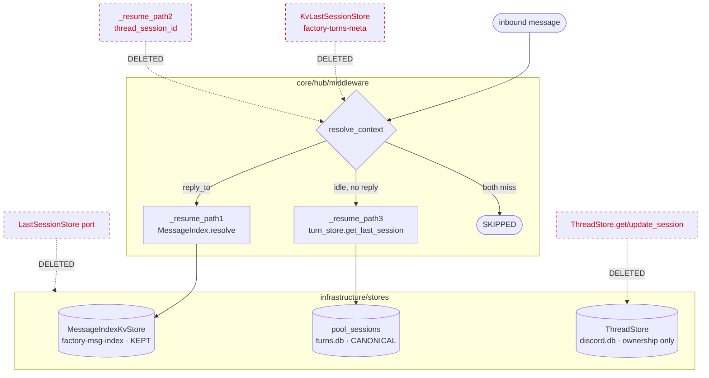

## Summary

Deletion-dominant consolidation: `turns.db` `pool_sessions` becomes the sole last-session SSoT.
Remove hub path-2 + `ResumeStatus.FRESH`, the inbound path-2 producer + `thread_session_id`, the
`LastSessionStore` port + `KvLastSessionStore` + `factory-turns-meta` provisioning, the ThreadStore
session-pointer methods, and the dead ACL grants; reserve a nullable `cwd` column for #1805.
13 single-surface agent instances, 4 waves, 3 parallel review blocks + 1 reconcile.

## Architecture

### Data flow — post-change resume topology



### File × function map — what each instance touches

```mermaid
flowchart LR
  subgraph B[Slice B · block α — hub flow]
    pv[path_validation.py\n−_resume_path2 −get_session_pool_id]
    ms[middleware_submit.py\n−_notify_session_fallthrough]
    pt[pipeline_types.py\n−FRESH −SESSION_FALLTHROUGH_MSG]
    mp[message_pipeline.py\n−re-export]
    tsp[turn_store_protocol.py\n−get_session_pool_id]
    tsq[turn_store_queries.py\n−get_session_pool_id]
  end
  subgraph Cin[Slice C · block α — inbound]
    sb[session_builder.py\n−_build_last_session_path\nstrip _build_thread_path]
    cx[context.py\n−thread_sessions_cache −last_session]
    mg[message.py\n−thread_session_id ×2]
  end
  subgraph Cinfra[Slice C · block β — teardown]
    tsk[turn_session_kv.py ⌫]
    lsp[last_session_store.py ⌫]
    lsw[last_session_wiring.py ⌫]
    bs[bootstrap_stores.py\n−ensure_turns_meta_kv]
    bw[bootstrap_wiring.py\n−last_session=]
    st[standalone_telegram/discord.py\n−KvLastSessionStore]
    tg[telegram.py · discord/adapter.py\n−last_session −_thread_sessions]
    th[thread_store{,_protocol}.py\n−get/update_session]
    dt[discord_threads.py\n−persist/retrieve_thread_session]
  end
  subgraph A[Slice A · block β — migration]
    ts[turn_store.py\n+v5 cwd ALTER]
  end
  subgraph G[Slice C · block γ — deploy/docs]
    acl[acl-matrix.json → auth.conf + CURRENT.generated + fixtures]
    docs[inbound/CLAUDE.md · deployment.md · QUADLET-DEPLOYMENT.md]
  end

  pv --> ms
  sb --> cx
  tsk --> bs
  tsk --> bw
  th --> dt
```

## Bootstrap Context

Grounded by the analysis (`artifacts/analyses/1777-single-ssot-last-session-analysis.mdx`) + a
plan-time re-verification (2026-06-09). Two drift corrections folded in:

- **D-a (FRESH surface wider):** `ResumeStatus.FRESH` lives at `pipeline_types.py:39`,
  `SESSION_FALLTHROUGH_MSG` at `:43` + `__all__:72`, re-exported in `message_pipeline.py:11/20/28`.
  Slice B edits both files, not just `middleware_submit.py`.
- **D-b (bucket provisioning narrower):** `hub_standalone.py:171` is `ensure_kv(_audio_js)` =
  **audio** bucket — NOT touched. `factory-turns-meta` is provisioned **only** at
  `bootstrap_stores.py:316`. `ensure_kv` is file-local (3 separate defs: turn_session_kv,
  message_index_kv, stream_setup) — deleting `turn_session_kv.py`'s copy is safe.

Reference patterns: v4 `cli_session_id` migration (`turn_store.py:125-137`) is the template for the
v5 `cwd` ADD COLUMN; `_resume_path1` (kept) shows the resolve-path return contract.

## Agents

13 single-surface instances (≤1 surface, ≤4 tasks, ≤2 subjects each).

| Instance | Agent | Tasks | Surface (subject) | Review block |
|---|---|---|---|---|
| tester-migrate | tester | T1 | migration test | β |
| bd-migrate | backend-dev | T2 | cwd migration | β |
| tester-hub | tester | T3, T8 | hub regression | α |
| bd-hub | backend-dev | T4→T5→T6→T7 | hub resume teardown | α |
| bd-inbound | backend-dev | T9→T10→T11 | inbound producer removal | α |
| tester-inbound | tester | T17 | builder tests | α |
| bd-infra | backend-dev | T12→T13→T14 | LastSessionStore teardown | β |
| tester-infra | tester | T18 | kv/bootstrap tests | β |
| bd-adapters | backend-dev | T15 | adapter ctor cleanup | β |
| bd-threadstore | backend-dev | T16 | ThreadStore reduce | β |
| tester-discord | tester | T19 | thread/discord tests | β |
| devops-acl | devops | T20 | ACL fan-out | γ |
| doc-acl | doc-writer | T21 | docs | γ |

## Wave Structure

4 waves, max 7 parallel. Elapsed ~4 agent-cycles vs ~13 sequential.

| Wave | Trigger | Agents ∥ | Tasks |
|---|---|---|---|
| 1 | start | 2 | tester-migrate: T1 · tester-hub: T3 |
| 2 | W1 RED done | 3 | bd-migrate: T2 · bd-hub: T4→T5→T6→T7 · tester-hub: T8 |
| — | **RED-GATE B** | — | `uv run pytest tests/core tests/integration tests/infrastructure/stores -q` green ∧ `grep -rn "ResumeStatus.FRESH\|_resume_path2" src/` ∅ |
| 3 | slice B code done | 6 | bd-inbound: T9→T10→T11 · bd-infra: T12→T13→T14 · bd-adapters: T15 · bd-threadstore: T16 · devops-acl: T20 · doc-acl: T21 |
| 4 | W3 code done | 3 | tester-inbound: T17 · tester-infra: T18 · tester-discord: T19 |
| — | **RED-GATE C** | — | full `uv run pytest -q` + `pyright` + `ruff check .` + import-linter + doc_drift + secrets_drift + architecture_snapshot all green |
| — | review | 3 teams + 1 | α ‖ β ‖ γ + reconcile (see Review Blocks) |

### Budget — per task

| Class | Tasks | Ops/item |
|---|---|---|
| trivial (1-2) | T10 | ~2 |
| bounded (2-3) | T1,T2,T11,T12,T13,T15,T21 | ~3 |
| judgmental (4-6) | T3,T4,T5,T6,T7,T8,T9,T14,T16,T17,T19,T20 | ~5 |
| exploratory (8-15) | T18 | ~9 |

**Total estimated ops: ~96.** No per-task split required (max single task = T18 ≈ 9 < 50).

### Budget — per agent instance

| Instance | Tasks | Σ ops | Subjects | Split? |
|---|---|---|---|---|
| bd-hub | T4,T5,T6,T7 | 14 | resume-teardown | — |
| tester-hub | T3,T8 | 12 | hub-regression | — |
| bd-inbound | T9,T10,T11 | 11 | inbound | — |
| bd-infra | T12,T13,T14 | 11 | teardown | — |
| tester-infra | T18 | 9 | kv-bootstrap | — |
| devops-acl | T20 | 8 | acl | — |
| bd-threadstore | T16 | 6 | thread-store | — |
| tester-inbound | T17 | 6 | builder | — |
| bd-adapters | T15 | 4 | adapters | — |
| tester-discord | T19 | 5 | thread-test | — |
| doc-acl | T21 | 4 | docs | — |
| bd-migrate | T2 | 3 | migration | — |
| tester-migrate | T1 | 3 | migration-test | — |

All instances ≤50 ops, ≤4 tasks, ≤2 subjects. No force-splits.

## Review Blocks

Single atomic PR; the diff is partitioned into 3 cohesive review units dispatched in parallel,
plus a reconcile agent for the α/β seam.

| Block | Reviewers | File → block map |
|---|---|---|
| **α resume behavior** | architect · axial-adr-review · tester | `core/hub/middleware/{path_validation,middleware_submit}.py`, `core/hub/pipeline/{pipeline_types,message_pipeline}.py`, `core/stores/turn_store_protocol.py`, `infrastructure/stores/turn_store_queries.py`, `inbound/{session_builder,context}.py`, `core/messaging/message.py`, `tests/core/test_{middleware,submit_middleware_context}.py`, `tests/inbound/test_session_builder.py`, `tests/integration/test_session_*.py`, `tests/nats/test_sanitize.py` |
| **β teardown structure** | architect · backend-dev · tester | `infrastructure/stores/{turn_store,thread_store}.py`, `infrastructure/stores/turn_session_kv.py`⌫, `core/ports/last_session_store.py`⌫, `core/stores/thread_store_protocol.py`, `bootstrap/wiring/{last_session_wiring⌫,bootstrap_wiring,standalone_telegram,standalone_discord}.py`, `bootstrap/bootstrap_stores.py`, `adapters/telegram/telegram.py`, `adapters/discord/{adapter,discord_threads}.py`, `tests/bootstrap/*`, `tests/infrastructure/stores/test_turn_session_kv.py`⌫, `tests/adapters/test_discord_threads.py`, `tests/core/test_thread_store_protocol.py`, `tests/test_bootstrap_credential_resolution.py` |
| **γ deploy/ops/docs** | devops · security-auditor · axial-adr-review · doc-writer | `deploy/nats/{acl-matrix.json,auth.conf}`, `docs/architecture/CURRENT.generated.md`, `tests/scripts/fixtures/v3-*.json`, `src/factory/inbound/CLAUDE.md`, `docs/architecture/deployment.md`, `docs/QUADLET-DEPLOYMENT.md` |

**Reconcile agent** (cross-block seam): `grep -rn "LastSessionStore\|KvLastSessionStore\|get_session_pool_id\|thread_session_id\|ThreadSession\|_resume_path2\|SESSION_FALLTHROUGH_MSG\|ResumeStatus.FRESH" src/ tests/` → only expected survivors (none in src; tests only where intentionally kept). Confirms α removed all callers that β's deletions would orphan, + axial inbound↔core↔infra consistency.

## Consistency Report

Covered: 12/12 success criteria. Untraced tasks: 0. Exemptions: none.

| SC | Tasks |
|---|---|
| SC-1 /clear fresh | T3 |
| SC-2 reply-to path-1 (both platforms) | T3, T8 |
| SC-3 path-3 sole reader; symbols absent | T4, T9, T11, T17 |
| SC-4a path-2 gone, notify not called | T3, T4, T5 |
| SC-4b no FRESH member/assert | T6 |
| SC-5 UX-gap accepted (doc-note) | T5 |
| SC-6 port/KV/wiring/get_session_pool_id deleted | T7, T12, T14, T15, T18 |
| SC-7 ThreadStore reduced, columns dead+comment | T16, T19 |
| SC-8 thread_session_id fields removed | T10 |
| SC-9 cwd v5 migration | T1, T2 |
| SC-10 ACL fan-out | T20 |
| SC-11 docs | T21 |
| SC-12 suite green, bucket unprovisioned | T13 |

## Micro-Tasks

### Slice A — cwd column reservation (block β)

#### T1 — RED: v5 cwd migration test [tester-migrate · A · β · RED · diff 2]
- **File:** `tests/infrastructure/stores/test_turn_store_migrations.py` (or existing migration test)
- **Do:** assert after `connect()` `pool_sessions` has nullable `cwd`; re-running `connect()` is idempotent (no error on existing column).
- **Verify:** `uv run pytest tests/infrastructure/stores -k "cwd or migration" -q`
- **Expected:** RED (column not yet added) · **Time:** 4m · blockedBy: —

#### T2 — v5 ALTER TABLE cwd [bd-migrate · A · β · GREEN · diff 3]
- **File:** `src/factory/infrastructure/stores/turn_store.py` (~125-137 v4 pattern)
- **Do:** add v5 block `try: ALTER TABLE pool_sessions ADD COLUMN cwd TEXT except ... 'duplicate column' in str(exc)`. Reserved, unwired.
- **Verify:** `uv run pytest tests/infrastructure/stores -k "cwd or migration" -q` → GREEN
- **Skeleton:** mirror v4 `cli_session_id` guard · **Time:** 4m · blockedBy: T1

### Slice B — hub path-2 removal + FRESH drop (block α)

#### T3 — RED: resurrection + reply-to + SKIPPED regression [tester-hub · B · α · RED · diff judgmental]
- **Files:** `tests/core/test_middleware.py`, `tests/core/test_submit_middleware_context.py`
- **Do:** add/convert — (1) `/clear`→next msg = new session_id in pool_sessions, pre-clear not resumed; (2) reply to pre-clear msg resumes via path-1 (assert `MessageIndex.resolve` taken, spy/mock — TG + Discord DM + thread); (3) TG-DM no-prior → `SKIPPED`, `_notify_session_fallthrough` NOT called. Convert existing `ResumeStatus.FRESH` asserts → `SKIPPED`; delete path-2-reject cases.
- **Verify:** `uv run pytest tests/core/test_middleware.py tests/core/test_submit_middleware_context.py -q`
- **Expected:** RED until T4-T7 · **Time:** 8m · blockedBy: —

#### T4 — delete _resume_path2 [bd-hub · B · α · GREEN · diff 4]
- **File:** `src/factory/core/hub/middleware/path_validation.py`
- **Do:** delete `_resume_path2` (105-167); in `resolve_context` drop the path-2 call (44) + the `get_session_pool_id` use (128); `return ResumeStatus.SKIPPED` (52, drop the `FRESH if path2_attempted` ternary); drop `DiscordMeta`/`TelegramMeta` imports; update docstring (34).
- **Verify:** `grep -nE "_resume_path2|get_session_pool_id|FRESH" src/factory/core/hub/middleware/path_validation.py` → ∅
- **Skeleton:** `resolve_context = path1 → path3 → SKIPPED` · **Time:** 5m · blockedBy: T3

#### T5 — delete FRESH notify branch [bd-hub · B · α · GREEN · diff 3]
- **File:** `src/factory/core/hub/middleware/middleware_submit.py`
- **Do:** delete the `if status == ResumeStatus.FRESH` branch (117-118) + `_notify_session_fallthrough` (122-145) + the `SESSION_FALLTHROUGH_MSG` import (19). **SC-5 note:** add a one-line comment at the (now SKIPPED) site recording that the silent interim is intentional per #1777, fresh-fallback UX returns with #1805.
- **Verify:** `grep -nE "FRESH|_notify_session_fallthrough|SESSION_FALLTHROUGH" src/factory/core/hub/middleware/middleware_submit.py` → ∅
- **Time:** 4m · blockedBy: T4

#### T6 — remove FRESH enum + fallthrough constant [bd-hub · B · α · GREEN · diff 4]
- **Files:** `src/factory/core/hub/pipeline/pipeline_types.py`, `src/factory/core/hub/pipeline/message_pipeline.py`
- **Do:** remove `ResumeStatus.FRESH` (pipeline_types:39); remove `SESSION_FALLTHROUGH_MSG` def (43) + `_SESSION_FALLTHROUGH_MSG` alias (48) + `__all__` entry (72); in message_pipeline remove the import (11) + alias (20) + `__all__` entries (28-29).
- **Verify:** `grep -rn "FRESH\|SESSION_FALLTHROUGH" src/factory/core/hub/pipeline/` → ∅
- **Time:** 4m · blockedBy: T5

#### T7 — remove dead get_session_pool_id [bd-hub · B · α · GREEN · diff 3]
- **Files:** `src/factory/core/stores/turn_store_protocol.py` (76), `src/factory/infrastructure/stores/turn_store_queries.py` (70-85)
- **Do:** remove `get_session_pool_id` from the protocol + the SQL impl (dead after T4).
- **Verify:** `grep -rn "get_session_pool_id" src/factory/` → ∅
- **Time:** 3m · blockedBy: T6

#### T8 — integration/sanitize test sweep [tester-hub · B · α · REFACTOR · diff judgmental]
- **Files:** `tests/integration/test_session_{telegram,dm_discord,reply_to}.py`, `tests/nats/test_sanitize.py`
- **Do:** remove `get_session_pool_id` / path-2 / `thread_session_id` references; keep the path-1 reply-to test green; ensure TG + Discord DM resume via path-3.
- **Verify:** `uv run pytest tests/integration tests/nats/test_sanitize.py -q` → GREEN
- **Time:** 6m · blockedBy: T7

### Slice C — adapter producers + port + ThreadStore + ACL/docs

#### T9 — strip session_builder path-2 producer [bd-inbound · C · α · GREEN · diff judgmental]
- **File:** `src/factory/inbound/session_builder.py`
- **Do:** delete `_build_last_session_path` (87-136); in `_build_thread_path` remove `th.get_session` (168) + `_th.update_session` (204-209) + the `thread_session_id=_stored.session_id` inject (224) → thread path = claim-routing only; in `build()` drop the `last_session` gate (76-81); rewrite docstring (27-39) to drop LastSessionStore/last_session prose.
- **Verify:** `grep -nE "_build_last_session_path|last_session|update_session|thread_session_id" src/factory/inbound/session_builder.py` → ∅
- **Time:** 6m · blockedBy: T7

#### T10 — delete thread_session_id meta fields [bd-inbound · C · α · GREEN · diff 2]
- **File:** `src/factory/core/messaging/message.py` (38, 48)
- **Do:** delete `TelegramMeta.thread_session_id` + `DiscordMeta.thread_session_id`.
- **Verify:** `grep -n "thread_session_id" src/factory/core/messaging/message.py` → ∅; `uv run pyright src/factory/core/messaging/message.py`
- **Time:** 2m · blockedBy: T9

#### T11 — strip SessionCtx fields [bd-inbound · C · α · GREEN · diff 3]
- **File:** `src/factory/inbound/context.py`
- **Do:** remove `thread_sessions_cache` (86) + `last_session` (87) fields; drop `LastSessionStore` (34) + `ThreadSession` (38) imports; update docstrings (13, 65, 77).
- **Verify:** `grep -nE "thread_sessions_cache|last_session|ThreadSession|LastSessionStore" src/factory/inbound/context.py` → ∅
- **Time:** 3m · blockedBy: T10

#### T12 — delete KV store + port + wiring files [bd-infra · C · β · GREEN · diff 3]
- **Files (delete):** `src/factory/infrastructure/stores/turn_session_kv.py`, `src/factory/core/ports/last_session_store.py`, `src/factory/bootstrap/wiring/last_session_wiring.py`
- **Verify:** `test ! -f src/factory/infrastructure/stores/turn_session_kv.py && test ! -f src/factory/core/ports/last_session_store.py && test ! -f src/factory/bootstrap/wiring/last_session_wiring.py && echo OK`
- **Time:** 2m · blockedBy: T7

#### T13 — drop turns-meta provisioning [bd-infra · C · β · GREEN · diff 3]
- **File:** `src/factory/bootstrap/bootstrap_stores.py`
- **Do:** remove `ensure_kv as ensure_turns_meta_kv` import (34) + `await ensure_turns_meta_kv(js)` call (316). **KEEP** the msg-index `ensure_kv` import (30) + call (315). **DRIFT-D-b:** do NOT touch `hub_standalone.py` (its `ensure_kv` is audio).
- **Verify:** `grep -n "turns_meta\|factory-turns-meta" src/factory/bootstrap/bootstrap_stores.py` → ∅; `grep -n "ensure_kv" src/factory/bootstrap/bootstrap_stores.py` → still shows msg-index
- **Time:** 3m · blockedBy: T12

#### T14 — remove LastSessionStore wiring [bd-infra · C · β · GREEN · diff 5]
- **Files:** `src/factory/bootstrap/wiring/bootstrap_wiring.py` (214, 284), `src/factory/bootstrap/wiring/standalone_telegram.py` (21, 92, 110), `src/factory/bootstrap/wiring/standalone_discord.py` (23, 111, 133)
- **Do:** remove `last_session=TurnStoreLastSession(...)`; remove `KvLastSessionStore` import + instance + wiring in both standalone modules.
- **Verify:** `grep -rnE "TurnStoreLastSession|KvLastSessionStore|last_session=" src/factory/bootstrap/` → ∅
- **Time:** 5m · blockedBy: T13

#### T15 — adapter ctor cleanup [bd-adapters · C · β · GREEN · diff 4]
- **Files:** `src/factory/adapters/telegram/telegram.py` (19, 84, 100), `src/factory/adapters/discord/adapter.py` (14, 21, 104, 131, 134)
- **Do:** remove `last_session` param/field + `LastSessionStore` import (both); remove `ThreadSession` import (14) + `_thread_sessions` field (134) in discord adapter.
- **Verify:** `grep -rnE "last_session|_thread_sessions|ThreadSession|LastSessionStore" src/factory/adapters/telegram/telegram.py src/factory/adapters/discord/adapter.py` → ∅
- **Time:** 4m · blockedBy: T7

#### T16 — ThreadStore reduce [bd-threadstore · C · β · GREEN · diff judgmental]
- **Files:** `src/factory/core/stores/thread_store_protocol.py` (15, 36, 46), `src/factory/infrastructure/stores/thread_store.py` (107-121, 147-158, 32-33), `src/factory/adapters/discord/discord_threads.py` (11, 58, 126)
- **Do:** remove `get_session`/`update_session` from protocol + impl + the `ThreadSession` dataclass (unused after); keep `claim`/`is_owned`/`get_thread_ids`/`release`; add an inline `# columns session_id/pool_id orphaned by #1777 — left dead (additive schema)` comment at the DDL (29-33); remove `persist_thread_session`/`retrieve_thread_session` + `ThreadSession` import from discord_threads, keep `persist_thread_claim`/`restore_hot_threads`.
- **Verify:** `grep -rnE "get_session|update_session|persist_thread_session|retrieve_thread_session" src/factory/core/stores/thread_store_protocol.py src/factory/infrastructure/stores/thread_store.py src/factory/adapters/discord/discord_threads.py` → ∅; `grep -n "orphaned by #1777" src/factory/infrastructure/stores/thread_store.py`
- **Time:** 6m · blockedBy: T7

#### T17 — rewrite session_builder tests [tester-inbound · C · α · REFACTOR · diff judgmental]
- **File:** `tests/inbound/test_session_builder.py`
- **Do:** drop `_build_last_session_path`, `last_session=`, `ThreadSession`, `update_session` cases; keep/adjust thread-claim routing tests for the reduced `_build_thread_path`.
- **Verify:** `uv run pytest tests/inbound/test_session_builder.py -q` → GREEN
- **Time:** 6m · blockedBy: T9, T10, T11

#### T18 — kv/bootstrap test cleanup [tester-infra · C · β · REFACTOR · diff exploratory]
- **Files:** delete `tests/infrastructure/stores/test_turn_session_kv.py`; gut/delete `tests/bootstrap/test_discord_kv_wiring.py` + `tests/bootstrap/test_adapter_boot_no_turns_db.py`; depatch `tests/bootstrap/conftest.py` (33-34, 73-86) + `tests/bootstrap/test_adapter_standalone.py` + `tests/test_bootstrap_credential_resolution.py` (remove `KvLastSessionStore`/`LastSessionStore`/`TurnStoreLastSession` patch targets)
- **Verify:** `grep -rnE "KvLastSessionStore|TurnStoreLastSession|ensure_turns_meta" tests/bootstrap tests/test_bootstrap_credential_resolution.py` → ∅; `uv run pytest tests/bootstrap tests/test_bootstrap_credential_resolution.py -q` → GREEN
- **Time:** 9m · blockedBy: T12, T13, T14

#### T19 — thread/discord test cleanup [tester-discord · C · β · REFACTOR · diff 5]
- **Files:** `tests/bootstrap/test_bootstrap_stores.py` (drop `ensure_turns_meta_kv` assert), `tests/adapters/test_discord_threads.py` (delete `TestPersistThreadSessionEviction` + `TestRetrieveThreadSession`), `tests/core/test_thread_store_protocol.py` (remove `get_session`/`update_session` tests, keep claim/is_owned)
- **Verify:** `uv run pytest tests/adapters/test_discord_threads.py tests/core/test_thread_store_protocol.py tests/bootstrap/test_bootstrap_stores.py -q` → GREEN
- **Time:** 5m · blockedBy: T16

#### T20 — ACL fan-out [devops-acl · C · γ · GREEN · diff judgmental]
- **Files:** `deploy/nats/acl-matrix.json` (TG 93-95, DC 125-127), regen `deploy/nats/auth.conf` + `docs/architecture/CURRENT.generated.md` + `tests/scripts/fixtures/v3-current.json` + `tests/scripts/fixtures/v3-pre-grant-group.json`
- **Do:** remove the 3 `factory-turns-meta` grants from telegram-adapter + discord-adapter; regenerate every ACL-derived artifact (per the ACL-regen fan-out). Confirm `secrets_drift` + `architecture_snapshot` gates pass.
- **Verify:** `grep -rn "factory-turns-meta" deploy/nats/ docs/architecture/CURRENT.generated.md` → ∅ (except KEPT hub/other identities if any — confirm none for adapters); `bash tools/check_secrets_drift.sh && bash tools/check_architecture_snapshot.sh`
- **Time:** 8m · blockedBy: —

#### T21 — doc corrections [doc-acl · C · γ · GREEN · diff 4]
- **Files:** `src/factory/inbound/CLAUDE.md` (28, 48), `docs/architecture/deployment.md` (149), `docs/QUADLET-DEPLOYMENT.md` (139)
- **Do:** strike `thread_sessions_cache` + `persist/retrieve_thread_session`-stay-in-adapters prose; rewrite "last-session via NATS KV `factory-turns-meta`" → "via `turns.db` path-3".
- **Verify:** `python3 tools/check_doc_drift.py`; `grep -rn "factory-turns-meta\|thread_sessions_cache" src/factory/inbound/CLAUDE.md docs/architecture/deployment.md docs/QUADLET-DEPLOYMENT.md` → ∅
- **Time:** 4m · blockedBy: —

## Task Seeding Blueprint

<!-- Used by /implement to seed TaskCreate calls. T{n} | agent-instance | blockedBy | subject | review_block.
     blockedBy refs T-numbers within this list. Seed in wave order; within a wave parallel rows are ∥. -->

### Wave 1 — no deps, 2 ∥
| Task | Agent instance | blockedBy | Subject | Block |
|---|---|---|---|---|
| T1 | tester-migrate | — | migration-test | β |
| T3 | tester-hub | — | hub-regression | α |

### Wave 2 — after W1 RED, 3 ∥ (bd-hub chains T4→T5→T6→T7)
| Task | Agent instance | blockedBy | Subject | Block |
|---|---|---|---|---|
| T2 | bd-migrate | T1 | migration | β |
| T4 | bd-hub | T3 | resume-teardown | α |
| T5 | bd-hub | T4 | resume-teardown | α |
| T6 | bd-hub | T5 | resume-teardown | α |
| T7 | bd-hub | T6 | resume-teardown | α |
| T8 | tester-hub | T7 | hub-regression | α |

### Wave 3 — after slice B code (T7), 6 ∥
| Task | Agent instance | blockedBy | Subject | Block |
|---|---|---|---|---|
| T9 | bd-inbound | T7 | inbound | α |
| T10 | bd-inbound | T9 | inbound | α |
| T11 | bd-inbound | T10 | inbound | α |
| T12 | bd-infra | T7 | teardown | β |
| T13 | bd-infra | T12 | teardown | β |
| T14 | bd-infra | T13 | teardown | β |
| T15 | bd-adapters | T7 | adapters | β |
| T16 | bd-threadstore | T7 | thread-store | β |
| T20 | devops-acl | — | acl | γ |
| T21 | doc-acl | — | docs | γ |

### Wave 4 — after W3 code, 3 ∥
| Task | Agent instance | blockedBy | Subject | Block |
|---|---|---|---|---|
| T17 | tester-inbound | T9,T10,T11 | builder | α |
| T18 | tester-infra | T12,T13,T14 | kv-bootstrap | β |
| T19 | tester-discord | T16 | thread-test | β |

## Task IDs

<!-- Generated by /plan. Used by /implement to re-attach tasks on session restart. -->
- T1: 11 — migration-test (tester-migrate)
- T2: 12 — migration (bd-migrate) ⟵ T1
- T3: 13 — hub-regression (tester-hub)
- T4: 14 — resume-teardown (bd-hub) ⟵ T3
- T5: 15 — resume-teardown (bd-hub) ⟵ T4
- T6: 16 — resume-teardown (bd-hub) ⟵ T5
- T7: 17 — resume-teardown (bd-hub) ⟵ T6
- T8: 18 — hub-regression (tester-hub) ⟵ T7
- T9: 19 — inbound (bd-inbound) ⟵ T7
- T10: 20 — inbound (bd-inbound) ⟵ T9
- T11: 21 — inbound (bd-inbound) ⟵ T10
- T12: 22 — teardown (bd-infra) ⟵ T7
- T13: 23 — teardown (bd-infra) ⟵ T12
- T14: 24 — teardown (bd-infra) ⟵ T13
- T15: 25 — adapters (bd-adapters) ⟵ T7
- T16: 26 — thread-store (bd-threadstore) ⟵ T7
- T17: 27 — builder (tester-inbound) ⟵ T9,T10,T11
- T18: 28 — kv-bootstrap (tester-infra) ⟵ T12,T13,T14
- T19: 29 — thread-test (tester-discord) ⟵ T16
- T20: 30 — acl (devops-acl)
- T21: 31 — docs (doc-acl)
