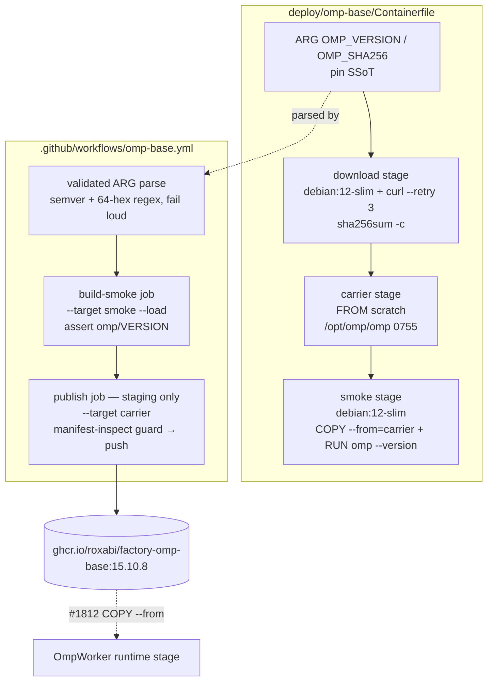
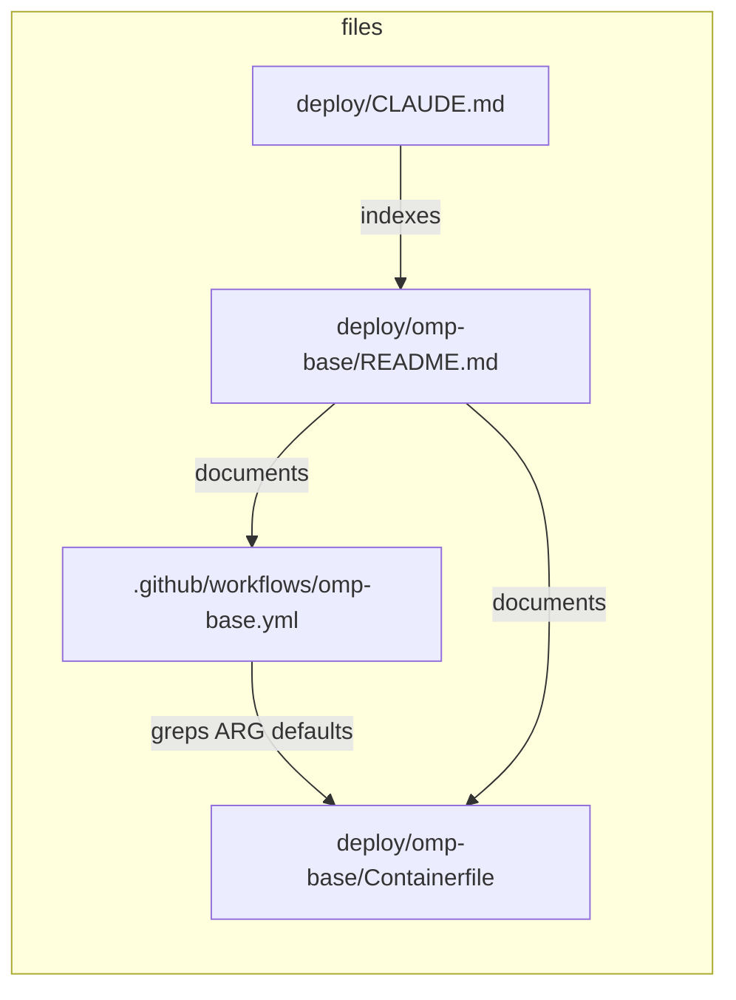

## Summary

Four micro-tasks across 2 agents: devops-A writes the 3-stage Containerfile
then the 2-job publish workflow; doc-writer-A writes the bump-runbook README
and updates the deploy/CLAUDE.md registry. Both spec slices ship in one PR
(slice 2 builds directly on slice 1's Containerfile).

## Architecture





## Agents

| Agent instance | Tasks | Files |
|---|---|---|
| devops-A | T1, T2 | deploy/omp-base/Containerfile · .github/workflows/omp-base.yml |
| doc-writer-A | T3, T4 | deploy/omp-base/README.md · deploy/CLAUDE.md |

tester: **skipped (exemption)** — no pytest-reachable surface; verification is
build-native (negative sha test, smoke stage, workflow greps) and embedded in
each task's verify command + `/validate`.

## Wave Structure

2 waves, max 2 parallel agents.

| Wave | Trigger | Agents | Tasks |
|------|---------|--------|-------|
| 1 | start | 2 ∥ | devops-A: T1 · doc-writer-A: T3→T4 |
| 2 | T1 done | 1 | devops-A: T2 |

### Budget — per task

| Task | Items | Class | Est. ops | Split? |
|------|-------|-------|----------|--------|
| T1 Containerfile + local verify | 1 file + 3 builds | judgmental | 10 | — |
| T2 workflow | 1 file + lint greps | judgmental | 6 | — |
| T3 README | 1 file | bounded | 3 | — |
| T4 CLAUDE.md line + gates | 1 edit + 2 gate runs | trivial | 3 | — |

**Total estimated ops: 22**

### Budget — per agent instance

| Instance | Tasks | Σ ops | Subjects | Split? |
|----------|-------|-------|----------|--------|
| devops-A | T1, T2 | 16 | containerfile, workflow | — |
| doc-writer-A | T3, T4 | 6 | runbook, registry | — |

## Consistency Report

7/7 success criteria covered, 6/6 breadboard nodes traced, 0 uncovered.
SC1+SC2←T1 · SC3+SC4+SC5←T2 · SC6←T3+T4 · SC7←T4 verify.
N1+N2←T1 · N3+N4←T2 · N5←T3 · N6←T4.
Exemption: no RED phase / RED-GATE sentinels — infra-only change, no test
framework surface (see Agents note).

## Micro-Tasks

### V1 — carrier image builds + verifies locally

**T1 — Write `deploy/omp-base/Containerfile` (3 stages)** · devops-A · GREEN · diff 2 · ~8 min
- File: `deploy/omp-base/Containerfile`
- Shape:
  ```dockerfile
  ARG OMP_VERSION=v15.10.8
  ARG OMP_SHA256=b877091c91ebdc8c8d907c4b62681895cd3ae049815858aea7b69ac1d53b7c7b
  FROM debian:12-slim AS download
  ARG OMP_VERSION
  ARG OMP_SHA256
  RUN apt-get update && apt-get install -y --no-install-recommends ca-certificates curl && rm -rf /var/lib/apt/lists/*
  RUN curl -fL --retry 3 --retry-delay 5 \
        "https://github.com/can1357/oh-my-pi/releases/download/${OMP_VERSION}/omp-linux-x64" \
        -o /tmp/omp \
   && echo "${OMP_SHA256}  /tmp/omp" | sha256sum -c - \
   && chmod 0755 /tmp/omp

  FROM scratch AS carrier
  COPY --from=download /tmp/omp /opt/omp/omp
  # ADR-053 carve-out: no USER — scratch carrier never executes (no ld-linux).

  FROM debian:12-slim AS smoke
  COPY --from=carrier /opt/omp/omp /usr/local/bin/omp
  RUN omp --version
  ```
- Verify:
  `podman build --target carrier -t omp-carrier-test deploy/omp-base` → exit 0;
  `podman build --target smoke deploy/omp-base` → exit 0 (build-time exec proof);
  `podman build --target carrier --build-arg OMP_SHA256=$(printf 'a%.0s' {1..64}) deploy/omp-base` → **non-zero exit** (sha mismatch);
  `podman run --rm omp-carrier-test 2>&1 | grep -qi 'no command\|exec'` ∨ inspect: `podman image inspect omp-carrier-test --format '{{.RootFS.Layers | len}}'` → 1 layer.
- Expected: positive builds green, corrupted-sha build fails at `sha256sum -c`.
- Spec trace: SC1, SC2 · N1, N2

### V2 — CI gate + publish + docs

**T2 — Write `.github/workflows/omp-base.yml` (2 jobs)** · devops-A · GREEN · diff 3 · ~8 min · blockedBy T1
- File: `.github/workflows/omp-base.yml`
- Shape: `on: pull_request + push: branches [staging], paths: ['deploy/omp-base/**']`;
  `permissions: contents: read, packages: write`;
  job `build-smoke`: checkout (SHA-pinned per publish.yml) → parse step
  (`grep '^ARG OMP_VERSION=' deploy/omp-base/Containerfile | cut -d= -f2` +
  regex validation `^v[0-9]+\.[0-9]+\.[0-9]+$` / `^[0-9a-f]{64}$`, `exit 1` on
  mismatch, expose via `$GITHUB_OUTPUT`) → setup-buildx →
  build `--target smoke --load` w/ `cache-from/to type=gha,scope=omp-base` →
  `docker run --rm <smoke-tag> omp --version | grep -Fx "omp/${VER#v}"`;
  job `publish`: `if: github.ref == 'refs/heads/staging'`, `needs: build-smoke`,
  re-parse → login-action (SHA-pinned) → build `--target carrier --load` →
  guard: `docker manifest inspect ghcr.io/roxabi/factory-omp-base:${VER#v}`
  exit 0 → `::warning::tag exists, skipping push` + exit 0; else tag + push.
- Verify:
  `python3 -c "import yaml,sys; yaml.safe_load(open('.github/workflows/omp-base.yml'))"` → exit 0;
  `grep -c 'b877091c' .github/workflows/omp-base.yml` → 0;
  `grep -Ec 'uses: [^@]+@[0-9a-f]{40}' .github/workflows/omp-base.yml` ≥ 3;
  `grep -q 'needs: build-smoke' …` → exit 0.
- Expected: valid YAML, no literal pin copy, all actions SHA-pinned.
- Spec trace: SC3, SC4, SC5 · N3, N4

**T3 — Write `deploy/omp-base/README.md`** · doc-writer-A · GREEN · diff 1 · ~5 min · [P]
- File: `deploy/omp-base/README.md`
- Shape: sections — Purpose (carrier image, immutable tag = omp version);
  Pin SSoT (the two ARGs, current pin v15.10.8 + sha); Bump procedure
  (edit 2 ARGs → PR → CI build-smoke gates → merge publishes new tag →
  #1812 bumps its `COPY --from` ref; deep omp_rpc e2e on bump = #1812 CI);
  Consumption (`COPY --from=ghcr.io/roxabi/factory-omp-base:15.10.8
  /opt/omp/omp /usr/local/bin/omp`, consumer must be glibc-based — ldd:
  libc/libm/libpthread/libdl); Immutability guard semantics (tag exists →
  skip+warn, content change ⇒ version bump); ADR-053 carve-out (no USER in
  scratch carrier).
- Verify: `grep -q 'Bump procedure\|bump' deploy/omp-base/README.md && grep -q 'COPY --from' deploy/omp-base/README.md` → exit 0.
- Spec trace: SC6 · N5

**T4 — Update `deploy/CLAUDE.md` scope line + run untouched-gates check** · doc-writer-A · GREEN · diff 1 · ~3 min · blockedBy T3
- File: `deploy/CLAUDE.md` (append `omp-base/` to the Scope line, pattern of #1811's `omp/` entry)
- Verify: `grep -q 'omp-base/' deploy/CLAUDE.md` → exit 0;
  `python3 tools/check_doc_drift.py` → exit 0;
  `bash tools/check_secrets_drift.sh` → exit 0 (proves SC7: secrets surface untouched).
- Spec trace: SC6, SC7 · N6

## Task Seeding Blueprint

<!-- Used by /implement to seed TaskCreate calls on session start.
     Format: T{n} | agent-instance | blockedBy | subject -->

### Wave 1 — no deps, 2 agents ∥

| Task | Agent instance | blockedBy | Subject |
|------|---------------|-----------|---------|
| T1 | devops-A | — | containerfile |
| T3 | doc-writer-A | — | runbook |

### Wave 2 — after Wave 1

| Task | Agent instance | blockedBy | Subject |
|------|---------------|-----------|---------|
| T2 | devops-A | T1 | workflow |
| T4 | doc-writer-A | T3 | registry |

## Ref Patterns

- `.github/workflows/publish.yml` — action SHA pins, permissions block, GHCR login
- `~/projects/roxabi-ml-base/.github/workflows/build-base.yml` — standalone path-triggered structure
- `Dockerfile` (repo root) — apt hygiene (`--no-install-recommends` + rm lists same RUN)
- `deploy/omp/README.md` — sibling README tone/structure (#1811)

## Task IDs

<!-- Generated by /plan. Used by /implement to resume tasks on session restart. -->
- T1: 24 — containerfile
- T2: 25 — workflow
- T3: 26 — runbook
- T4: 27 — registry
