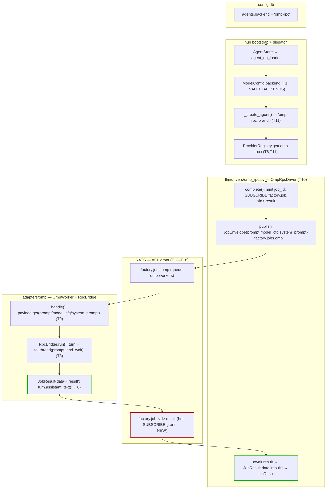
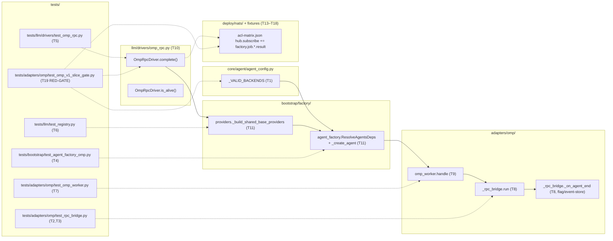

## Summary

Wire `omp-rpc` as a selectable, **hub-side** LLM backend for the non-streaming turn path,
and grant the hub the NATS subscribe it needs to receive results. 19 micro-tasks across 4
waves, TDD (RED → GREEN → REFACTOR → RED-GATE). The slice also lands the **empty-result
bridge fix** (`_rpc_bridge` reads a non-existent `AgentEndEvent.result` today → every omp
JobResult ships `data=None`). Later slices (V2 session/pool, V3 concurrency, V4 streaming,
V5 per-job override, V6 parity runbook) are out of scope and planned by re-running `/plan`.

**Module decisions (grounded):** `OmpRpcDriver` lives at `src/factory/llm/drivers/omp_rpc.py`
(mirrors `ClaudeCliDriver` in `cli.py`); NATS round-trip uses **deterministic
subscribe-before-publish** on `factory.job.<id>.result`; bridge fix uses **Path B** (`run()`
is sole publisher after `asyncio.to_thread`, `_on_agent_end` becomes an event-store sentinel).

**Known V1 limitation (open decision #4 — pending sign-off):** the worker reads
`model_cfg`/`system_prompt` from the enriched payload for wire/backward-compat, but does
**not yet apply** them — V1 omp uses its `models.yml` default model + construction-time
config. Per-turn model/system-prompt application requires per-job client construction (the
OmpPool slice, V2).

## Architecture

### Data flow (config → driver → NATS → worker → result)

### File × function map

## Agents

| Instance | Domain | Tasks | Files |
|---|---|---|---|
| backend-dev-A | backend | T1, T8 | agent_config.py, _rpc_bridge.py |
| backend-dev-B | backend | T9, T11 | omp_worker.py, agent_factory.py, providers.py |
| backend-dev-C | backend | T10 | llm/drivers/omp_rpc.py |
| tester-A | tester | T2→T3 | test_rpc_bridge.py |
| tester-B | tester | T4→T6 | test_agent_factory_omp.py, test_registry.py |
| tester-C | tester | T5 | test_omp_rpc.py |
| tester-D | tester | T7, T19 | test_omp_worker.py, test_omp_v1_slice_gate.py |
| devops-A | devops | T13→T14/T15/T16/T17→T18 | acl-matrix.json + 5 generated artifacts |
| doc-writer-A | docs | T12 | llm/CLAUDE.md, adapters/omp/CLAUDE.md |

## Wave Structure

4 waves, max 6 parallel agents. Elapsed ≈ 4 sequential phases vs ~19 sequential tasks.

| Wave | Trigger | Agents | Tasks |
|------|---------|--------|-------|
| 1 | plan approved | 6 ∥ | backend-dev-A: T1 · tester-A: T2→T3 · tester-B: T4→T6 · tester-C: T5 · tester-D: T7 · devops-A: T13 |
| 2 | W1 done (T1,T2,T3,T4,T5,T6,T7,T13) | 3 ∥ | backend-dev-A: T8 · backend-dev-C: T10 · devops-A: T14→T15→T16→T17 |
| 3 | W2 done (T8,T10,T14–T17) | 2 ∥ | backend-dev-B: T9→T11 · devops-A: T18 |
| 4 | W3 done (T9,T11,T18) | 2 ∥ | doc-writer-A: T12 · tester-D: T19 (RED-GATE) |

### Budget — per task

| Task | Class | Est. ops | Split? |
|------|-------|----------|--------|
| T1 types | XS | 3 | — |
| T2,T3 bridge RED | S | 10,12 | — |
| T4 wiring RED | S | 8 | — |
| T5 driver RED | M | 33 | — (single atomic concern) |
| T6 registry RED | S | 12 | — |
| T7 worker compat RED | S | 8 | — |
| T8 bridge GREEN | S | 6 | — |
| T9 worker GREEN | XS | 4 | — |
| T10 driver GREEN | M | 15 | — |
| T11 wiring GREEN | S | 9 | — |
| T12 docs REFACTOR | XS | 1 | — |
| T13–T18 ACL fan-out | XS each | 3+4+4+4+4+4 = 23 | — (single-domain cascade) |
| T19 RED-GATE | S | 8 | — |

**Total estimated ops: ~156** (no task > 50 → no per-task split required).

### Budget — per agent instance

| Instance | Tasks | Σ ops | Subjects | Split? |
|----------|-------|-------|----------|--------|
| backend-dev-A | T1, T8 | 9 | types, bridge | — (sequential prereq) |
| backend-dev-B | T9, T11 | 13 | worker, wiring | — |
| backend-dev-C | T10 | 15 | driver | — |
| tester-A | T2, T3 | 22 | bridge | — |
| tester-B | T4, T6 | 20 | wiring, registry | — |
| tester-C | T5 | 33 | driver | — (1 subject, atomic) |
| tester-D | T7, T19 | 16 | worker, gate | — (split across W1/W4) |
| doc-writer-A | T12 | 1 | docs | — |
| devops-A | T13–T18 | 23 | 6 ACL artifacts | **exception**: 6 subjects > 2, kept on one instance — strict cascade (T13 → {T14,T15,T16,T17} → T18) over shared JSON/generated files; cross-instance split would create merge conflicts. Single-domain (NATS ACL fan-out). |

## Consistency Report

Spec breadboard refs covered: **5/5** (N1, N3, N4, N7, N9).

| Spec ref | Tasks | Status |
|----------|-------|--------|
| N1 driver publish/round-trip | T2,T3,T8 (bridge), T5,T10 (driver), T19 (gate) | covered |
| N3 payload model_cfg | T5,T10 (driver sends), T9 (worker reads) | covered (sent+read; **applied=V2**) |
| N4 provider registration | T1, T11, T12 | covered |
| N7 backend resolution | T4, T6, T11 | covered |
| N9 hub ACL grant | T7, T13–T18, T19 | covered |

Untraced (foundational/gate, no single spec clause): T1 (frozenset prereq), T12 (doc_drift gate from stack.yml).
Uncovered: none.

## Micro-Tasks

> Slice V1. Phases: RED (fail-first) → GREEN (impl) → REFACTOR (docs) → RED-GATE (merge sentinel).
> `[P]` = parallel-safe within its wave. All paths relative to the worktree root.

### Wave 1 — RED tests + foundations (6 ∥)

**T1 [P] · backend-dev-A · GREEN · types · N4 · difficulty 1**
Add `"omp-rpc"` to `_VALID_BACKENDS` frozenset.
- File: `src/factory/core/agent/agent_config.py:19`
- Snippet: `_VALID_BACKENDS = frozenset({"claude-cli", "nats", "omp-rpc"})`
- Verify: `grep -n '_VALID_BACKENDS' src/factory/core/agent/agent_config.py | grep omp-rpc`
- Expected: frozenset includes `omp-rpc`; existing tests pass.

**T2 [P] · tester-A · RED · bridge · N1 · difficulty 2**
Assert `_on_agent_end`/`run` publishes `data={"result": turn.assistant_text}`, NOT `{}`. Use an
`AgentEndEvent` with **no** `.result` attr (bare `object()`); set `bridge._last_turn =
SimpleNamespace(assistant_text="hello from omp")`.
- File: `tests/adapters/omp/test_rpc_bridge.py`
- Verify: `uv run pytest tests/adapters/omp/test_rpc_bridge.py::test_on_agent_end_data_contains_assistant_text -x`
- Expected: FAILS on current code (line 289 `getattr(event,"result",None)` → `data={}`).

**T3 · tester-A · RED · bridge · N1 · difficulty 2** (after T2)
Assert `run()` stores the `PromptTurn` returned by `prompt_and_wait` on `bridge._last_turn`.
- File: `tests/adapters/omp/test_rpc_bridge.py`
- Verify: `uv run pytest tests/adapters/omp/test_rpc_bridge.py::test_run_captures_last_turn -x`
- Expected: FAILS (return value discarded at line 201 today).

**T4 [P] · tester-B · RED · wiring · N7 · difficulty 2**
Assert `_create_agent()` raises `ValueError` for `backend="omp-rpc"` **before** wiring (documents the gap; flips at T11).
- File: `tests/bootstrap/test_agent_factory_omp.py` (new; confirm `tests/bootstrap/` layout)
- Verify: `uv run pytest tests/bootstrap/test_agent_factory_omp.py::test_create_agent_omp_rpc_raises_before_wiring -x`
- Expected: PASSES (gap confirmed).

**T5 [P] · tester-C · RED · driver · N3 · difficulty 3**
RED tests for `OmpRpcDriver.complete()`/`is_alive()`: (a) happy path → `LlmResult.result=="ok"`;
(b) timeout → `LlmResult.error` set; (c) error `JobResult` → `LlmResult.error` set. Use a **sync**
`MagicMock` NATS client (omp_rpc is thread-based, not async). Pin the published envelope shape
(keys `prompt`, `model_cfg`, `system_prompt`); do **not** hard-pin the subject string.
- File: `tests/llm/drivers/test_omp_rpc.py` (new; mirror existing `tests/llm/` layout)
- Verify: `uv run pytest tests/llm/drivers/test_omp_rpc.py -x` → `ImportError` before T10.
- Note: verify `LlmResult` field names against `core/ports/llm.py` (`.result`/`.error`/`.ok` unaudited).

**T6 · tester-B · RED · registry · N7 · difficulty 1** (after T4)
`ProviderRegistry` register/get for `"omp-rpc"` (generic registry → passes immediately; regression guard). `get()` raises **KeyError** (not ValueError) for unregistered.
- File: `tests/llm/test_registry.py`
- Verify: `uv run pytest tests/llm/test_registry.py -k omp_rpc -x`

**T7 [P] · tester-D · RED · worker · N9 · difficulty 2**
Backward-compat: old payload `{"prompt": "x"}` (no `model_cfg`/`system_prompt`) → `worker.handle()`
does not raise, calls `bridge.run(prompt="x", job_id=…)`. Must keep passing after T9.
- File: `tests/adapters/omp/test_omp_worker.py`
- Verify: `uv run pytest tests/adapters/omp/test_omp_worker.py::test_handle_prompt_only_payload_backward_compat -x`

**T13 [P] · devops-A · GREEN · acl-matrix · N9 · difficulty 2**
Append `"factory.job.*.result"` to the **hub** identity `subscribe` array in `acl-matrix.json`
(omp-worker already **publishes** it; hub subscribe is absent). Sole source-of-truth edit; T14–T18 regen from it.
- File: `deploy/nats/acl-matrix.json`
- Verify: `python3 -c "import json; d=json.load(open('deploy/nats/acl-matrix.json')); assert 'factory.job.*.result' in d['identities']['hub']['subscribe']; print('OK')"`

### Wave 2 — GREEN impl + ACL regen (3 ∥)

**T8 · backend-dev-A · GREEN · bridge · N1 · difficulty 3** (after T1,T2,T3)
Bridge fix, **Path B**. In `_rpc_bridge.py`: (1) add `_last_turn: Any|None=None` +
`_last_agent_end_event: Any|None=None` (reset at start of `run()`); (2) `_on_agent_end(event)`
**stores** `self._last_agent_end_event = event` only — no publish, no `_schedule_publish`;
(3) `run()` captures `turn = await asyncio.to_thread(self._client.prompt_and_wait, prompt)`,
stores `self._last_turn`, then (sole publisher, on the event loop) sets `_result_sent=True` and
publishes `_make_result(job_id, status="success", data={"result": <text>})` where
`text = turn.assistant_text` (fallback: last assistant message in `_last_agent_end_event.messages`, else `""`);
(4) `publish_error` keeps its `if self._result_sent: return` guard.
Preserve: digest gate, ADR-073 (`type(exc).__name__` only), `tool_input` never bus-published.
- File: `src/factory/adapters/omp/_rpc_bridge.py`
- Verify: `uv run pytest tests/adapters/omp/test_rpc_bridge.py -x`
- Expected: T2+T3 pass; existing bridge tests unchanged.

**T10 · backend-dev-C · GREEN · driver · N3 · difficulty 3** (after T5,T13)
Create `src/factory/llm/drivers/omp_rpc.py` — `class OmpRpcDriver` implementing the `LlmProvider`
Protocol (mirror `ClaudeCliDriver` shape in `drivers/cli.py`). `complete()`: mint `job_id`
(`uuid4().hex`), **subscribe `factory.job.<id>.result` BEFORE publishing**,
`publish JobEnvelope(job_name="omp", payload={"prompt": text, "model_cfg": model_cfg.model_dump(),
"system_prompt": system_prompt}, reply_to=…)` to `factory.jobs.omp`, `await asyncio.wait_for(fut, timeout)`,
unsubscribe in `finally`, map `JobResult` → `LlmResult` (`data["result"]` on success; `error` set on
error/timeout, `retryable=True`). `is_alive()` → `True` (V1). `capabilities = {"streaming": False}`.
ADR-073: no `str(exc)` in bus/error fields.
- File: `src/factory/llm/drivers/omp_rpc.py`
- Verify: `uv run pyright src/factory/llm/drivers/omp_rpc.py && uv run pytest tests/llm/drivers/test_omp_rpc.py -x`
- Note: confirm `JobEnvelope.to_bytes()`/`JobResult.from_bytes()` (or `model_validate_json`) entry points in `roxabi_contracts.jobs`.

**T14 · devops-A · GREEN · acl-fixture · N9 · difficulty 2** (after T13)
**Hand-mirror** `"factory.job.*.result"` into the hub `subscribe` array of
`tests/scripts/fixtures/v3-pre-grant-group.json` (NOT script-generated; gated by CI-only
`test_v4_render_set_equals_v3_render`). Must exactly match T13.
- Verify: `python3 -c "import json; d=json.load(open('tests/scripts/fixtures/v3-pre-grant-group.json')); print('factory.job.*.result' in str(d))"`

**T15 · devops-A · GREEN · v3-current · N9 · difficulty 1** (after T13)
Regen `tests/scripts/fixtures/v3-current.json` from the matrix.
- Cmd: `uv run python scripts/render_acl_parity.py`
- Verify: `bash tools/check_secrets_drift.sh; grep 'factory.job.\*.result' tests/scripts/fixtures/v3-current.json`

**T16 · devops-A · GREEN · 706-spec · N9 · difficulty 1** (after T13)
Regen the 706 spec (sentinel block).
- File: `artifacts/specs/706-per-role-nkeys-acls-spec.mdx`
- Cmd: `uv run python scripts/render_acl_spec.py`
- Verify: `grep -c 'factory.job.\*.result' artifacts/specs/706-per-role-nkeys-acls-spec.mdx` (≥2: omp-worker publish + hub subscribe)

**T17 · devops-A · GREEN · auth-conf · N9 · difficulty 2** (after T13)
Regen `deploy/nats/auth.conf` hub block to include the subscribe permission.
- Cmd (worktree, no seeds): `uv run factory-acl genkeys --template-only` to confirm grant shape.
  M1 actual regen at deploy: `sudo env "PATH=$PATH" factory-acl genkeys --regen-authconf` (needs nkey seeds).
- Verify: `grep 'factory.job.\*.result' deploy/nats/auth.conf`
- ⚠️ **CI/deploy caveat:** auth.conf is seed-dependent on M1; a clean local pre-push does NOT catch auth.conf drift. M1 converge (`make nats-regen-authconf`) regenerates from real seeds at deploy time.

**T18 · devops-A · GREEN · arch-snapshot · N9 · difficulty 1** (after T13,T15,T16)
Regen the architecture snapshot (gated by `architecture_snapshot` pre-push).
- File: `docs/architecture/CURRENT.generated.md`
- Cmd: `uv run python tools/generate_architecture_snapshot.py .`
- Verify: `bash tools/check_architecture_snapshot.sh`

### Wave 3 — wiring + final regen (2 ∥)

**T9 · backend-dev-B · GREEN · worker · N9 · difficulty 1** (after T7,T8)
In `omp_worker.handle()`: read `model_cfg = payload.get("model_cfg", {})` and
`system_prompt = payload.get("system_prompt", "")`. **V1 = read-and-validate only** (see open
decision #4) — defaults keep old `{"prompt": …}` payloads valid; do NOT change `bridge.run()`
signature (that is V2).
- File: `src/factory/adapters/omp/omp_worker.py`
- Verify: `uv run pytest tests/adapters/omp/test_omp_worker.py -x`

**T11 · backend-dev-B · GREEN · wiring · N7 · difficulty 3** (after T4,T6,T10)
(1) Add `omp_rpc_driver: LlmProvider | None = None` to `ResolveAgentsDeps` (agent_factory.py).
(2) In `providers._build_shared_base_providers()` add the param; `providers["omp-rpc"] =
omp_rpc_driver` when not None (no decorator — driver owns its own timeout). (3) `_create_agent()`:
add `omp-rpc` branch mirroring `nats` (get from registry; `ValueError` if registry missing,
`RuntimeError` if key absent). (4) thread `omp_rpc_driver` through `_resolve_agents()`. Add
`test_create_agent_omp_rpc_with_driver_succeeds`.
- Files: `src/factory/bootstrap/factory/agent_factory.py`, `src/factory/bootstrap/factory/providers.py`, `tests/bootstrap/test_agent_factory_omp.py`
- Verify: `uv run pytest tests/bootstrap/test_agent_factory_omp.py -x && uv run pyright src/factory/bootstrap/factory/`

### Wave 4 — docs + merge gate (2 ∥)

**T12 [P] · doc-writer-A · REFACTOR · docs · N4 · difficulty 1** (after T11)
Add `OmpRpcDriver` row to the Drivers table in `src/factory/llm/CLAUDE.md` (key `omp-rpc`,
transport "NATS JobEnvelope → factory.jobs.omp", `streaming=False`); update
`src/factory/adapters/omp/CLAUDE.md` to note `_on_agent_end` is now a flag/event-store sentinel (Path B).
- Verify: `python3 tools/check_doc_drift.py`

**T19 · tester-D · RED-GATE · gate · N1 · difficulty 2** (after T8,T9,T10,T11,T12,T13,T14,T15,T16,T17,T18)
Merge-blocking slice gate `tests/adapters/omp/test_omp_v1_slice_gate.py`: (1)
`test_hub_has_result_subscribe_grant` — `acl-matrix.json` hub subscribe contains
`factory.job.*.result`; (2) `test_omp_rpc_in_agent_config_valid_backends` — `omp-rpc` ∈
`_VALID_BACKENDS`; (3) `test_omp_driver_round_trip_mock` — `OmpRpcDriver.complete()` with mocked
NATS returns non-empty `LlmResult.result`. **All 3 pass → merge clear.**
- Verify: `uv run pytest tests/adapters/omp/test_omp_v1_slice_gate.py -v`

## RED-GATE sentinels

| After | Gate |
|-------|------|
| T18 (all GREEN done) | **T19** — 3 slice-gate tests must pass before PR merge: ACL grant present, `omp-rpc` backend valid, driver round-trips non-empty. Any failure → fix the upstream task (T13 / T1 / T10–T11) and re-run. |

## Task Seeding Blueprint

<!-- Used by /implement to seed TaskCreate calls. T# refs are within this blueprint.
     Instances are named so parallel tasks map to distinct spawned agents.
     Seed in wave order; within a wave all rows are parallel (∥). -->

### Wave 1 — no deps, 6 agents ∥

| Task | Agent instance | blockedBy | Subject |
|------|---------------|-----------|---------|
| T1 | backend-dev-A | — | types |
| T2 | tester-A | — | bridge (RED) |
| T3 | tester-A | T2 | bridge (RED) |
| T4 | tester-B | — | wiring (RED) |
| T5 | tester-C | — | driver (RED) |
| T6 | tester-B | T4 | registry (RED) |
| T7 | tester-D | — | worker (RED) |
| T13 | devops-A | — | acl-matrix (GREEN) |

### Wave 2 — after Wave 1, 3 agents ∥

| Task | Agent instance | blockedBy | Subject |
|------|---------------|-----------|---------|
| T8 | backend-dev-A | T1,T2,T3 | bridge (GREEN) |
| T10 | backend-dev-C | T5,T13 | driver (GREEN) |
| T14 | devops-A | T13 | acl-fixture (GREEN) |
| T15 | devops-A | T13 | v3-current (GREEN) |
| T16 | devops-A | T13 | 706-spec (GREEN) |
| T17 | devops-A | T13 | auth-conf (GREEN) |

### Wave 3 — after Wave 2, 2 agents ∥

| Task | Agent instance | blockedBy | Subject |
|------|---------------|-----------|---------|
| T9 | backend-dev-B | T7,T8 | worker (GREEN) |
| T11 | backend-dev-B | T4,T6,T10 | wiring (GREEN) |
| T18 | devops-A | T13,T15,T16 | arch-snapshot (GREEN) |

### Wave 4 — after Wave 3, 2 agents ∥

| Task | Agent instance | blockedBy | Subject |
|------|---------------|-----------|---------|
| T12 | doc-writer-A | T11 | docs (REFACTOR) |
| T19 | tester-D | T8,T9,T10,T11,T12,T13,T14,T15,T16,T17,T18 | v1-slice-gate (RED-GATE) |

## Out of scope (later slices, re-run /plan)

- **V2** OmpPool + native-session memory + `session_dir` named volume; **applies** `model_cfg`/`system_prompt` per session.
- **V3** OmpPool concurrency (CliPool parity).
- **V4** streaming bridge — fixes the two remaining `_rpc_bridge` event-attr bugs (`tool_call_id`, `assistant_message_event`).
- **V5** per-job backend override (`backend_hint` on `InboundMessage`, resolved in `SubmitToPoolMiddleware`).
- **V6** parity runbook + flip gate.

## Implementation-verification items (read before coding)

- `LlmResult` field names (`.result` / `.error` / `.ok` / `retryable`) — `core/ports/llm.py`.
- `JobEnvelope`/`JobResult` (de)serialization entry points — `packages/roxabi-contracts/.../jobs`.
- `tests/bootstrap/` actual layout (file path for T4/T11 test).
- omp_rpc `prompt_and_wait` return / `PromptTurn.assistant_text` + `require_assistant_text()` raise-on-None.

## Task IDs

<!-- Generated by /plan. Used by /implement to resume tasks on session restart. -->
- T1: 12 — types (W1, backend-dev-A)
- T2: 13 — bridge RED (W1, tester-A)
- T3: 14 — bridge RED (W1, tester-A) ← T2
- T4: 15 — wiring RED (W1, tester-B)
- T5: 16 — driver RED (W1, tester-C)
- T6: 17 — registry RED (W1, tester-B) ← T4
- T7: 18 — worker RED (W1, tester-D)
- T13: 19 — acl-matrix GREEN (W1, devops-A)
- T8: 20 — bridge GREEN (W2, backend-dev-A) ← T1,T2,T3
- T10: 21 — driver GREEN (W2, backend-dev-C) ← T5,T13
- T14: 22 — acl-fixture GREEN (W2, devops-A) ← T13
- T15: 23 — v3-current GREEN (W2, devops-A) ← T13
- T16: 24 — 706-spec GREEN (W2, devops-A) ← T13
- T17: 25 — auth-conf GREEN (W2, devops-A) ← T13
- T9: 26 — worker GREEN (W3, backend-dev-B) ← T7,T8
- T11: 27 — wiring GREEN (W3, backend-dev-B) ← T4,T6,T10
- T18: 28 — arch-snapshot GREEN (W3, devops-A) ← T13,T15,T16
- T12: 29 — docs REFACTOR (W4, doc-writer-A) ← T11
- T19: 30 — v1-slice-gate RED-GATE (W4, tester-D) ← T8,T9,T10,T11,T12,T13,T14,T15,T16,T17,T18
