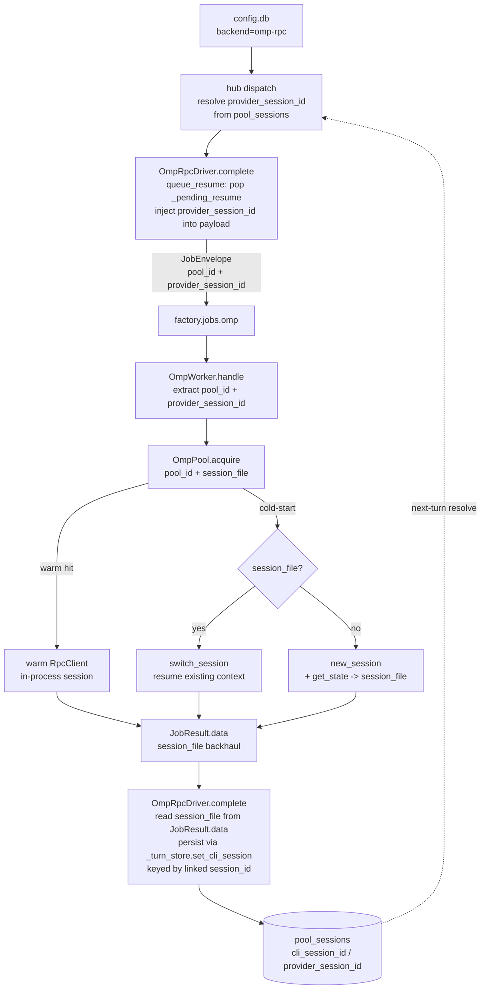

## Summary

Slice V2 wires hub-driven native-session memory into the omp runtime by mirroring the exact pattern LlmClient uses for clipool: a `_turn_store`-backed `queue_resume` / `complete` backhaul loop that persists and resolves the `.jsonl` session_file as `provider_session_id` in `pool_sessions`. Axis A (dispatch unification) introduces two standalone `runtime_checkable` Protocols (`SessionAware`, `WorkspaceAware`) in `core/ports/llm.py`, replacing four separate `_cli_pool`/`_cli_nats_driver` branch sites in `simple_agent.py` with two resolved-once attributes. Axis B reuses the existing `cli_session_id` column and `TurnStoreSessionMixin` as-is (no migration), deferring the cosmetic rename to a filed follow-up. The worker gains `OmpPool` (warm `RpcClient` per `pool_id`, LRU-capped, `switch_session`/`new_session`+`get_state` cold-start), wired into `OmpWorker.handle()`; `OmpRpcDriver` gains real SessionAware methods mirroring LlmClient — NOT stubs.

---

## Architecture

### Data-flow: hub-driven session round-trip



### File x function map

```mermaid
flowchart LR
    subgraph core/ports/llm.py
        SA[SessionAware Protocol\nlink_lyra_session\nreset\nqueue_resume]
        WA[WorkspaceAware Protocol\nswitch_cwd]
        ALL[__all__ export]
    end

    subgraph core/simple_agent.py
        SB[_session_backend: SessionAware|None\n_workspace_backend: WorkspaceAware|None\nresolved in __init__ via isinstance]
        RB[reset_backend\n_maybe_register_reset\n_maybe_register_resume\nlink call in process]
    end

    subgraph llm/drivers/omp_rpc.py
        ORD[OmpRpcDriver\n_turn_store injected\n_pending_resume dict\n_lyra_sessions dict\nqueue_resume / reset / link_lyra_session\ncomplete: inject+backhaul session_file]
    end

    subgraph adapters/omp/omp_pool.py
        OP[OmpPool\nclients dict pool_id→RpcClient\nacquire / release / aclose\nLRU cap=OMP_POOL_CAP]
    end

    subgraph adapters/omp/omp_worker.py
        OW[OmpWorker.handle\nextract pool_id+provider_session_id\nsession_file in JobResult.data]
    end

    subgraph infrastructure/stores/turn_store_session.py
        TSS[TurnStoreSessionMixin\nget_cli_session / _set_cli_session\nreused as-is for omp token]
    end

    subgraph roxabi_contracts / core/llm_types.py
        JE[JobEnvelope.payload\n+pool_id +provider_session_id optional]
        JR[JobResult.data\n+session_file optional]
    end

    subgraph tests
        T_PROTO[test_llm_protocols.py\nfalsification evidence]
        T_AGENT[test_simple_agent.py\nparametrized reset x3 backends]
        T_OMP[test_omp_rpc_driver.py\nrecall + isolation + wire-compat]
        T_POOL[test_omp_pool.py\nunit]
        T_WRK[test_omp_worker.py\nunit]
    end

    SA --> SB
    WA --> SB
    SB --> RB
    ORD -->|implements| SA
    ORD --> TSS
    ORD --> JE
    ORD --> JR
    OW --> OP
    OW --> JE
    OW --> JR
    T_PROTO --> SA
    T_PROTO --> WA
    T_AGENT --> SB
    T_OMP --> ORD
    T_POOL --> OP
    T_WRK --> OW
```

---

## Agents

| Instance | Type | Tasks | Subjects |
|----------|------|-------|---------|
| backend-dev-1 | backend-dev | T1, T2 | protocol, contract |
| backend-dev-2 | backend-dev | T3, T4 | pool, worker |
| backend-dev-3 | backend-dev | T5, T6 | bootstrap, resume |
| backend-dev-4 | backend-dev | T7, T12 | dispatch, followup |
| devops-1 | devops | T8, T9 | deploy, manifest |
| tester-1 | tester | T10, T11 | tests, integration |

---

## Wave Structure

| Wave | Trigger | Agents | Tasks |
|------|---------|--------|-------|
| W1 | start | backend-dev-1, devops-1 | T1, T2, T8 |
| W2 | T1+T2 done | backend-dev-2, backend-dev-3 | T3, T4, T5, T6 |
| W3 | T3+T4+T5+T6 done | backend-dev-4 | T7 |
| W4 | T8 done | devops-1 | T9 |
| W5 | T6+T7 done | tester-1 | T10 |
| W6 | T4+T5+T6+T7+T8+T9 done | tester-1 | T11 |
| W7 | T7 done | backend-dev-4 | T12 |

### Budget — per task

| Task | Class | Est ops | Split? |
|------|-------|---------|--------|
| T1 | RED | 18 | N |
| T2 | RED | 10 | N |
| T3 | GREEN | 28 | N |
| T4 | GREEN | 20 | N |
| T5 | GREEN | 12 | N |
| T6 | GREEN | 32 | N |
| T7 | REFACTOR | 30 | N |
| T8 | GREEN | 16 | N |
| T9 | GREEN | 12 | N |
| T10 | GREEN | 35 | N |
| T11 | RED-GATE | 15 | N |
| T12 | FOLLOW-UP | 6 | N |

### Budget — per agent instance

| Instance | Tasks | Σ ops | Subjects | Split? |
|----------|-------|-------|---------|--------|
| backend-dev-1 | T1, T2 | 28 | protocol, contract | N |
| backend-dev-2 | T3, T4 | 48 | pool, worker | N |
| backend-dev-3 | T5, T6 | 44 | bootstrap, resume | N |
| backend-dev-4 | T7, T12 | 36 | dispatch, followup | N |
| devops-1 | T8, T9 | 28 | deploy, manifest | N |
| tester-1 | T10, T11 | 50 | tests, integration | N |

---

## Consistency Report

**Spec Success Criteria covered: 11/16**

| Criterion | Covered by |
|-----------|-----------|
| omp-rpc backend routes to OmpRpcDriver | T6, T7 |
| ProviderRegistry resolves omp-rpc | T6 (providers.py wiring) |
| OmpRpcDriver extends NatsDriverBase + satisfies LlmProvider | T1 (protocol) + T6 |
| JobEnvelope.payload optional fields, wire-compat old envelope | T2, T10 |
| job_id hub-minted, worker never publishes to factory.jobs.omp | T4, T10 |
| Agent remembers context across turns via hub-resolved session token | T6, T10 |
| No cross-conversation bleed | T3, T10 |
| OmpPool concurrency (CliPool parity) | T3 (pool) — concurrency test deferred to Slice 3 |
| Worker stays dumb executor (no config.db, no backend branching) | T4 |
| clipool no-regression | T7, T10 |
| Driver subscriptions torn down on completion/error | T6 |

**Deferred / out-of-scope for Slice V2:**

| Criterion | Reason |
|-----------|--------|
| stream() / JobProgress→LlmEvent | Slice 4 |
| OmpPool wall-clock concurrency test | Slice 3 |
| Per-job override (N6) | Slice 5; NEEDS-CLARIFICATION transport unresolved |
| Parity runbook / flip gate (N8) | Slice 6 |
| hub NATS progress grant (factory.job.*.progress) | Slice 4 |
| Observability: runtime tag in turn log | Not in V2 scope |

**Traces to N5/N10:**

- N5 (native-session resume): fully addressed by T2 (contracts), T6 (OmpRpcDriver backhaul), T3 (OmpPool cold-start switch_session/new_session+get_state), T10 (recall+isolation tests).
- N10 (OmpPool CliPool mirror): fully addressed by T3 (omp_pool.py), T4 (OmpWorker wiring), T5 (bootstrap injection).

---

## Micro-Tasks

### Phase: RED

#### T1 — SessionAware + WorkspaceAware protocols

**Description:** Add two standalone `runtime_checkable` Protocols to `core/ports/llm.py`, export in `__all__`. Add protocol membership tests with falsification evidence (git-stash method -> assert isinstance FAILS -> stash pop -> assert PASS).

**File paths:**
- `src/factory/core/ports/llm.py` (modify)
- `tests/core/test_llm_protocols.py` (new)

**Code shape:**

```python
# src/factory/core/ports/llm.py  (add after LlmProvider/StreamingLlmProvider)

@runtime_checkable
class SessionAware(Protocol):
    def link_lyra_session(self, pool_id: str, lyra_session_id: str) -> None: ...
    async def reset(self, pool_id: str) -> None: ...
    async def queue_resume(self, pool_id: str, session_id: str) -> bool: ...

@runtime_checkable
class WorkspaceAware(Protocol):
    async def switch_cwd(self, pool_id: str, cwd: Path) -> None: ...

# Append to __all__: "SessionAware", "WorkspaceAware"
```

```python
# tests/core/test_llm_protocols.py
# Falsification: git stash omp_rpc.py -> run -> assert FAIL -> stash pop -> assert PASS
# + assert isinstance(cli_pool, SessionAware)
# + assert isinstance(cli_pool, WorkspaceAware)
# + assert isinstance(llm_client, SessionAware)
# + assert isinstance(llm_client, WorkspaceAware)
# + assert isinstance(omp_rpc_driver, SessionAware)
# + assert not isinstance(omp_rpc_driver, WorkspaceAware)
```

**Verify:**
```bash
cd /home/mickael/projects/roxabi-factory/.claude/worktrees/1813-runtime-selection-v2 && uv run pytest tests/core/test_llm_protocols.py -v
```
**Expected:** All protocol membership assertions pass; falsification evidence documented inline.

**Agent instance:** backend-dev-1 | **Subject:** protocol | **Spec trace:** N5, Success Criteria row 3 | **Difficulty:** 3/10 | [P] parallel with T2, T8

---

#### T2 — JobEnvelope.payload + JobResult.data convention + wire-compat tests

**Description:** Add optional `pool_id`, `provider_session_id` to `JobEnvelope.payload` and optional `session_file` to `JobResult.data` (convention-only, untyped `dict[str,Any]`). Tests: old `{"prompt": str}`-only envelope validates; `session_file` round-trips through worker stub.

**File paths:**
- `packages/roxabi-contracts/` or `src/factory/core/llm_types.py` — confirm exact location of `JobEnvelope`/`JobResult` docstring/convention (read before editing)
- `tests/llm/test_job_contracts.py` (new or extend existing)

**Code shape:**

```python
# JobEnvelope.payload (dict[str, Any]) — convention update (docstring/comment):
# Optional keys: pool_id: str, provider_session_id: str | None
# Required: prompt: str  (old {"prompt": str} envelope still valid)

# JobResult.data (dict[str, Any] | None) — convention update:
# Optional key: session_file: str  (absent on old results — consumers must .get())
```

```python
# tests/llm/test_job_contracts.py
def test_old_envelope_validates():
    env = JobEnvelope(job_id="j1", payload={"prompt": "hi"}, reply_to=None)
    assert env.payload["prompt"] == "hi"
    assert env.payload.get("pool_id") is None  # absent = wire-compat

def test_session_file_roundtrip():
    result = JobResult(job_id="j1", status="success",
                       data={"result": "ok", "session_file": "/tmp/s.jsonl"})
    assert result.data["session_file"] == "/tmp/s.jsonl"
```

**Verify:**
```bash
cd /home/mickael/projects/roxabi-factory/.claude/worktrees/1813-runtime-selection-v2 && uv run pytest tests/llm/test_job_contracts.py -v
```
**Expected:** Wire-compat tests pass; old envelope without pool_id/provider_session_id accepted.

**Agent instance:** backend-dev-1 | **Subject:** contract | **Spec trace:** N4, N5, Success Criteria row 4 | **Difficulty:** 2/10 | [P] parallel with T1, T8

---

### Phase: GREEN

#### T3 — OmpPool (new omp_pool.py)

**Description:** Implement `OmpPool` in `src/factory/adapters/omp/omp_pool.py`. Warm `RpcClient` per `pool_id`, `acquire(pool_id, session_file)` (warm hit reuse; cold-start: `switch_session(session_file)` if token present, else `new_session()` then `get_state()` to obtain minted `session_file`). `release(pool_id)`, `aclose()`. LRU evict beyond `OMP_POOL_CAP` env/config (default 4, NOT hardcoded). Unit tests covering warm-hit, cold-start-with-token, cold-start-no-token, LRU evict.

**File paths:**
- `src/factory/adapters/omp/omp_pool.py` (new)
- `tests/adapters/omp/test_omp_pool.py` (new)

**Code shape:**

```python
# src/factory/adapters/omp/omp_pool.py

import os
from collections import OrderedDict
from pathlib import Path

OMP_POOL_CAP_DEFAULT = 4

class OmpPool:
    def __init__(self, rpc_client_factory, cap: int | None = None) -> None:
        self._factory = rpc_client_factory
        self._cap = cap or int(os.environ.get("OMP_POOL_CAP", OMP_POOL_CAP_DEFAULT))
        self._clients: OrderedDict[str, object] = OrderedDict()  # LRU order

    async def acquire(self, pool_id: str, session_file: str | None) -> object:
        if pool_id in self._clients:
            self._clients.move_to_end(pool_id)  # LRU touch
            return self._clients[pool_id]
        # cold-start
        client = self._factory()
        if session_file:
            await client.switch_session(session_file)
        else:
            await client.new_session()
            state = await client.get_state()
            # session_file now available via state.session_file
        self._clients[pool_id] = client
        self._clients.move_to_end(pool_id)
        if len(self._clients) > self._cap:
            oldest_id, oldest_client = self._clients.popitem(last=False)
            await oldest_client.aclose()
        return client

    def release(self, pool_id: str) -> None:
        pass  # warm client stays in pool; eviction is LRU

    async def aclose(self) -> None:
        for client in self._clients.values():
            await client.aclose()
        self._clients.clear()
```

**Verify:**
```bash
cd /home/mickael/projects/roxabi-factory/.claude/worktrees/1813-runtime-selection-v2 && uv run pytest tests/adapters/omp/test_omp_pool.py -v
```
**Expected:** warm-hit, cold-start-resume, cold-start-new, LRU evict tests pass. No bare `time.sleep` (event-based waits only).

**Agent instance:** backend-dev-2 | **Subject:** pool | **Spec trace:** N10, Success Criteria rows 7, 8 | **Difficulty:** 5/10 | deps: T2

---

#### T4 — Wire OmpPool into OmpWorker.handle()

**Description:** Modify `src/factory/adapters/omp/omp_worker.py`. In `handle()` (~line 130), extract `pool_id` and `provider_session_id` from `envelope.payload` (absent = wire-compat defaults: `pool_id` fallback to `job_id`, `session_file = None`). Use `OmpPool.acquire(pool_id, session_file)`. Always write `session_file` into `JobResult.data` (obtain post-call via `client.get_state()` if not already known from cold-start; on warm hits the session_file is the already-known value from pool state). Replace the single shared `no_session=True` `RpcClient`. Unit tests: dumb-executor invariant (no config.db access, no backend branching), `session_file` in result, wire-compat with old envelope.

**File paths:**
- `src/factory/adapters/omp/omp_worker.py` (modify)
- `tests/adapters/omp/test_omp_worker.py` (modify or new)

**Code shape:**

```python
# omp_worker.py handle() — new extraction block
pool_id = envelope.payload.get("pool_id", envelope.job_id)
session_file = envelope.payload.get("provider_session_id") or None

client = await self._pool.acquire(pool_id, session_file)
# ... prompt_and_wait ...
# after terminal result, obtain current session_file:
state = await client.get_state()
result_data = {**base_result_data, "session_file": state.session_file}
```

**Verify:**
```bash
cd /home/mickael/projects/roxabi-factory/.claude/worktrees/1813-runtime-selection-v2 && uv run pytest tests/adapters/omp/test_omp_worker.py -v
```
**Expected:** dumb-executor test passes (no config.db import in omp_worker); session_file present in result.data; old-envelope compat test passes.

**Agent instance:** backend-dev-2 | **Subject:** worker | **Spec trace:** N10, Success Criteria row 9 | **Difficulty:** 4/10 | deps: T3

---

#### T5 — Construct OmpPool in _bootstrap_omp_standalone, inject into OmpWorker

**Description:** In `src/factory/bootstrap/standalone/worker_standalone.py` (~line 154), construct `OmpPool` (with the `RpcClient` factory from `_rpc_bridge`), inject into `OmpWorker`. Ensure `OmpPool.aclose()` is called on shutdown.

**File paths:**
- `src/factory/bootstrap/standalone/worker_standalone.py` (modify)

**Code shape:**

```python
# worker_standalone.py _bootstrap_omp_standalone()
from factory.adapters.omp.omp_pool import OmpPool

omp_pool = OmpPool(rpc_client_factory=lambda: RpcClient(...))
worker = OmpWorker(pool=omp_pool, ...)
# register cleanup: omp_pool.aclose() on shutdown
```

**Verify:**
```bash
cd /home/mickael/projects/roxabi-factory/.claude/worktrees/1813-runtime-selection-v2 && uv run pytest tests/bootstrap/ -k omp -v
```
**Expected:** bootstrap smoke test constructs OmpPool+OmpWorker without error; no bare sleeps.

**Agent instance:** backend-dev-3 | **Subject:** bootstrap | **Spec trace:** N10 | **Difficulty:** 3/10 | deps: T3, T4

---

#### T6 — OmpRpcDriver real SessionAware: _turn_store, queue_resume, link_lyra_session, reset, complete backhaul

**Description:** Modify `src/factory/llm/drivers/omp_rpc.py`. Add `_turn_store` (injected; same pattern as LlmClient:61-62), `_pending_resume: dict[str,str]`, `_lyra_sessions: dict[str,str]`. Implement:
- `link_lyra_session(pool_id, session_id)`: store mapping.
- `queue_resume(pool_id, session_id)`: `tok = await self._turn_store.get_cli_session(session_id)`; if tok: `self._pending_resume[pool_id] = tok`; return bool. EXACT LlmClient mirror.
- `reset(pool_id)`: drop `_pending_resume[pool_id]` entry (hub-side cold-start next turn); document that the worker's `OmpPool` will cold-start because no session_file arrives on the next envelope.
- `complete()`: pop `self._pending_resume.get(pool_id)` -> include as `provider_session_id` in `envelope.payload`; after terminal `JobResult`, read `session_file` from `result.data`; persist via `self._turn_store` set method keyed by linked `session_id` (first-turn mint -> backhaul -> persist -> next-turn resolve). Wire `_turn_store` at registration in `src/factory/llm/providers.py` (~line 70).

**File paths:**
- `src/factory/llm/drivers/omp_rpc.py` (modify)
- `src/factory/llm/providers.py` (modify: inject _turn_store)
- `tests/llm/drivers/test_omp_rpc_driver.py` (extend)

**Code shape:**

```python
# omp_rpc.py additions
class OmpRpcDriver(NatsDriverBase):
    def __init__(self, ..., turn_store: TurnStoreSessionMixin) -> None:
        ...
        self._turn_store = turn_store
        self._pending_resume: dict[str, str] = {}
        self._lyra_sessions: dict[str, str] = {}

    def link_lyra_session(self, pool_id: str, lyra_session_id: str) -> None:
        self._lyra_sessions[pool_id] = lyra_session_id

    async def reset(self, pool_id: str) -> None:
        # Drop hub-side pending token; worker OmpPool will cold-start
        # (no session_file in next envelope -> new_session() on worker side)
        self._pending_resume.pop(pool_id, None)

    async def queue_resume(self, pool_id: str, session_id: str) -> bool:
        tok = await self._turn_store.get_cli_session(session_id)
        if tok:
            self._pending_resume[pool_id] = tok
        return bool(tok)

    async def complete(self, pool_id: str, text: str, model_cfg, system_prompt: str, *, messages=None) -> LlmResult:
        session_file = self._pending_resume.pop(pool_id, None)
        envelope = JobEnvelope(
            job_id=...,
            payload={
                "prompt": text,
                "pool_id": pool_id,
                "provider_session_id": session_file,
                "model": model_cfg.model,
                "system_prompt": system_prompt,
            },
        )
        # ... publish + await JobResult ...
        result_session_file = (result.data or {}).get("session_file")
        if result_session_file:
            session_id = self._lyra_sessions.get(pool_id)
            if session_id:
                await self._turn_store._set_cli_session(session_id, result_session_file)
        return LlmResult(...)
```

**Verify:**
```bash
cd /home/mickael/projects/roxabi-factory/.claude/worktrees/1813-runtime-selection-v2 && uv run pytest tests/llm/drivers/test_omp_rpc_driver.py -v
```
**Expected:** queue_resume/link/reset/backhaul tests pass; `isinstance(driver, SessionAware)` asserts True; `isinstance(driver, WorkspaceAware)` asserts False.

**Agent instance:** backend-dev-3 | **Subject:** resume | **Spec trace:** N5, Success Criteria rows 6, 11 | **Difficulty:** 7/10 | deps: T1, T2

---

### Phase: REFACTOR

#### T7 — simple_agent.py: unify 4 branch sites, update CLAUDE.md files

**Description:** In `src/factory/agents/simple_agent.py`, resolve `_session_backend: SessionAware | None` and `_workspace_backend: WorkspaceAware | None` once in `__init__` (first that isinstance-matches among `cli_pool`, `cli_nats_driver`, `provider`). Replace four branch sites: `reset_backend()` (~106-109), `_maybe_register_reset()` (~160), `_maybe_register_resume()` (~182), `link_lyra_session` call in `process()` (~225-228). When `_workspace_backend is None`, pass `workspace_fn=None` to `pool.register_session_callbacks`. Keep `cli_pool=`/`cli_nats_driver=` kwargs for backward-compat construction. Greps scoped to attribute refs (`self._cli_pool`, `self._cli_nats_driver`), not bare names (kwargs survive). Update `src/factory/agents/CLAUDE.md` (two->three backend paths, new table). Update `src/factory/llm/CLAUDE.md` (OmpRpcDriver row: now session-aware).

**File paths:**
- `src/factory/agents/simple_agent.py` (modify)
- `src/factory/agents/CLAUDE.md` (modify)
- `src/factory/llm/CLAUDE.md` (modify)
- `tests/agents/test_simple_agent.py` (modify)

**Code shape:**

```python
# simple_agent.py __init__ additions
from factory.core.ports.llm import SessionAware, WorkspaceAware

self._session_backend: SessionAware | None = None
self._workspace_backend: WorkspaceAware | None = None
for candidate in [cli_pool, cli_nats_driver, provider]:
    if candidate is None:
        continue
    if self._session_backend is None and isinstance(candidate, SessionAware):
        self._session_backend = candidate
    if self._workspace_backend is None and isinstance(candidate, WorkspaceAware):
        self._workspace_backend = candidate

# reset_backend() — unified, fixes latent cli_nats_driver silent-drop:
async def reset_backend(self, pool_id: str) -> None:
    if self._session_backend is not None:
        await self._session_backend.reset(pool_id)
```

```python
# tests/agents/test_simple_agent.py — new/updated tests:
# test_reset_backend_delegates_to_session_backend_nats_driver
# test_reset_backend_noop_when_no_session_backend (replaces prior "no cli_pool" test)
# parametrize reset over 3 backend types: CliPool, LlmClient (nats), OmpRpcDriver
# clipool no-regression: resume/reset/link/switch_cwd all called correctly
```

**Verify:**
```bash
cd /home/mickael/projects/roxabi-factory/.claude/worktrees/1813-runtime-selection-v2 && uv run pytest tests/agents/test_simple_agent.py -v && uv run pyright src/factory/agents/simple_agent.py
```
**Expected:** All agent tests pass incl. 3-backend parametrized reset; pyright clean; clipool no-regression green.

**Agent instance:** backend-dev-4 | **Subject:** dispatch | **Spec trace:** N5, N6, Success Criteria rows 6, 10 | **Difficulty:** 6/10 | deps: T1, T6

---

### Phase: GREEN (deploy)

#### T8 — Deploy: named volume factory-omp-sessions + .volume unit + After= + quadlet.toml + DEPLOYMENT.md

**Description:** Replace the ephemeral `Tmpfs` for `PI_CODING_AGENT_DIR` in `deploy/quadlet/factory-omp.container` (lines ~35-37) with a persistent named volume `factory-omp-sessions` mounted at the same path. Keep `$HOME/.omp` Tmpfs (~line 28, native modules) and `models.yml` `:ro` bind. Create `deploy/quadlet/factory-omp-sessions.volume` unit. Declare volume in `deploy/quadlet.toml`. Add `After=factory-omp-sessions.service` to `factory-omp.container`. Update `docs/DEPLOYMENT.md` Volumes table (required by `check_volumes_table.sh`).

**File paths:**
- `deploy/quadlet/factory-omp.container` (modify)
- `deploy/quadlet/factory-omp-sessions.volume` (new)
- `deploy/quadlet.toml` (modify)
- `docs/DEPLOYMENT.md` (modify: Volumes table)

**Code shape:**

```ini
# deploy/quadlet/factory-omp-sessions.volume
[Volume]
Label=app=factory
```

```ini
# factory-omp.container — replace Tmpfs for PI_CODING_AGENT_DIR:
# Before: Tmpfs=/home/agent/.omp-sessions:size=512m  (or equivalent)
# After:
Volume=factory-omp-sessions.volume:/home/agent/.omp-sessions:z
# After= addition:
After=factory-omp-sessions.service
```

```toml
# deploy/quadlet.toml — add under volumes section:
[[volumes]]
name = "factory-omp-sessions"
unit = "factory-omp-sessions.volume"
```

**Verify:**
```bash
cd /home/mickael/projects/roxabi-factory/.claude/worktrees/1813-runtime-selection-v2 && uv run python tools/check_volumes_table.sh 2>&1 | tail -5
```
**Expected:** `check_volumes_table` passes (prose in DEPLOYMENT.md matches Volume= directives).

**Agent instance:** devops-1 | **Subject:** deploy | **Spec trace:** NEEDS-CLARIFICATION #2 resolved: option (b) | **Difficulty:** 3/10 | [P] parallel with T1, T2

---

#### T9 — Manifest-install: Makefile + quadlet-install-verify.sh + converge.sh

**Description:** Add `factory-omp.container` to `ADAPTER_TEMPLATES` in `Makefile` quadlet-install target. Add `factory-omp` to `UNITS` array in `deploy/quadlet-install-verify.sh`. Add `factory-omp` to the restart fan-out in `deploy/converge.sh`. All three are required by `check_quadlet_manifest_install.sh`.

**File paths:**
- `Makefile` (modify)
- `deploy/quadlet-install-verify.sh` (modify)
- `deploy/converge.sh` (modify)

**Code shape:**

```makefile
# Makefile — ADAPTER_TEMPLATES addition:
ADAPTER_TEMPLATES += factory-omp.container
```

```bash
# quadlet-install-verify.sh — UNITS array:
UNITS=( ... factory-omp ... )
```

```bash
# converge.sh — restart fan-out:
systemctl --user restart factory-omp.service
```

**Verify:**
```bash
cd /home/mickael/projects/roxabi-factory/.claude/worktrees/1813-runtime-selection-v2 && bash tools/check_quadlet_manifest_install.sh
```
**Expected:** `check_quadlet_manifest_install` passes — factory-omp present in all three files.

**Agent instance:** devops-1 | **Subject:** manifest | **Spec trace:** quadlet-manifest-install gap memory | **Difficulty:** 2/10 | deps: T8

---

### Phase: RED-GATE

#### T10 — Unit tests: cross-turn recall, cross-conversation isolation, conformance falsification, clipool no-regression

**Description:** Implement the blocking tester tasks. Must use event-based waits only (no bare `time.sleep` — `test_sleep` gate).

Tests required:

1. **Conformance falsification** (`tests/core/test_llm_protocols.py`): run via subprocess stub — stash omp_rpc.py method body -> assert `isinstance(driver, SessionAware)` FAILS (or correct signature check fails) -> restore -> assert PASS. Document inline that `runtime_checkable` only checks name presence, not signatures.

2. **test_omp_session_recall_across_turns** (`tests/llm/drivers/test_omp_rpc_driver.py`): call `driver.complete()` twice with same `pool_id`/`session_id`; assert the `provider_session_id` injected into the second envelope equals the `session_file` backhaul-persisted after the first. Token actually round-trips (not a no-op check).

3. **test_omp_cross_conversation_isolation** (`tests/llm/drivers/test_omp_rpc_driver.py`): two distinct `pool_id`/`session_id` pairs -> assert distinct tokens, no bleed between `_pending_resume` entries.

4. **clipool no-regression** (`tests/agents/test_simple_agent.py`): existing `CliPool` resume/reset/link/switch_cwd all still called correctly post-refactor. Parametrize reset over 3 backend types.

5. **wire-compat** (`tests/llm/test_job_contracts.py`): JetStream replay of `{"prompt": "old"}` envelope consumed without KeyError on pool_id/provider_session_id absence.

**File paths:**
- `tests/core/test_llm_protocols.py` (extend from T1)
- `tests/llm/drivers/test_omp_rpc_driver.py` (extend from T6)
- `tests/agents/test_simple_agent.py` (extend from T7)
- `tests/llm/test_job_contracts.py` (extend from T2)

**Code shape:**

```python
# test_omp_session_recall_across_turns
async def test_omp_session_recall_across_turns(driver, mock_turn_store, mock_nats):
    pool_id, session_id = "p1", "s1"
    driver.link_lyra_session(pool_id, session_id)
    # Turn 1: cold start, no pending token
    result1 = await driver.complete(pool_id, "tell me x", model_cfg, "sys")
    # Simulate worker backhaul: JobResult.data has session_file
    # (mock_nats returns JobResult with data={"session_file": "/tmp/s1.jsonl"})
    persisted = await mock_turn_store.get_cli_session(session_id)
    assert persisted == "/tmp/s1.jsonl"
    # Turn 2: queue_resume then complete
    resumed = await driver.queue_resume(pool_id, session_id)
    assert resumed is True
    result2 = await driver.complete(pool_id, "what was x?", model_cfg, "sys")
    envelope2 = mock_nats.last_published_envelope
    assert envelope2.payload["provider_session_id"] == "/tmp/s1.jsonl"
```

**Verify:**
```bash
cd /home/mickael/projects/roxabi-factory/.claude/worktrees/1813-runtime-selection-v2 && uv run pytest tests/core/test_llm_protocols.py tests/llm/drivers/test_omp_rpc_driver.py tests/agents/test_simple_agent.py tests/llm/test_job_contracts.py -v && bash tools/check_test_sleep.sh
```
**Expected:** All 5 test groups pass; `check_test_sleep` finds no bare sleeps in new test files.

**Agent instance:** tester-1 | **Subject:** tests | **Spec trace:** N5, N10, tester BLOCKING findings | **Difficulty:** 7/10 | deps: T6, T7

---

#### T11 — Integration smoke (CI-skipped, M1-manual)

**Description:** Integration tests gated by `INTEGRATION=1` env var (CI-skipped). Three scenarios against live `factory-omp` container on M1:

1. **Cold-start mints + persists session_file**: send a job with no `provider_session_id`; assert `JobResult.data["session_file"]` is non-empty; assert `pool_sessions` row created for the session_id.
2. **Resume calls switch_session**: send a second job with `provider_session_id` set; assert the warm client returned the same session context (check via a recall question or session_id in omp state).
3. **Cap evict**: fill pool beyond `OMP_POOL_CAP`; assert oldest entry evicted, new entry accepted, no `PoolCapError`.

**File paths:**
- `tests/integration/test_omp_session_integration.py` (new)

**Code shape:**

```python
# tests/integration/test_omp_session_integration.py
import os, pytest

pytestmark = pytest.mark.skipif(
    not os.getenv("INTEGRATION"), reason="INTEGRATION tests — run manually on M1"
)

async def test_cold_start_mints_session_file(): ...
async def test_resume_calls_switch_session(): ...
async def test_cap_evict_no_error(): ...
```

**Verify (M1-manual):**
```bash
INTEGRATION=1 uv run pytest tests/integration/test_omp_session_integration.py -v -s
```
**Expected:** All 3 scenarios pass on M1 against live factory-omp; CI skips cleanly.

**Agent instance:** tester-1 | **Subject:** integration | **Spec trace:** N5, N10, Slice V2 demo | **Difficulty:** 5/10 | deps: T4, T5, T6, T7, T8, T9

---

### Phase: FOLLOW-UP

#### T12 — File GitHub issue: cosmetic rename cli_session_id -> provider_session_id

**Description:** File a GitHub issue to track the cosmetic rename of `cli_session_id` -> `provider_session_id` in `pool_sessions` table and `TurnStoreSessionMixin` methods (47 callsites). NOT a drift-undo. Explicitly scope: rename only, + per-backend token separation IF V5 per-job-override lands a second concurrent backend per agent. Include migration note: rename requires a DB migration for `pool_sessions` column.

**File paths:** None (GitHub issue only)

**Verify:**
```bash
gh issue view <filed-issue-number> --json title,body
```
**Expected:** Issue filed with scope, rationale (deferred from V2), and V5 trigger condition.

**Agent instance:** backend-dev-4 | **Subject:** followup | **Spec trace:** Known constraints / session model | **Difficulty:** 1/10 | deps: T7

---

## Task Seeding Blueprint

### Wave 1 (start)

| Task | Agent instance | blockedBy | Subject |
|------|---------------|-----------|---------|
| T1 | backend-dev-1 | — | protocol |
| T2 | backend-dev-1 | — | contract |
| T8 | devops-1 | — | deploy |

### Wave 2 (T1 + T2 done)

| Task | Agent instance | blockedBy | Subject |
|------|---------------|-----------|---------|
| T3 | backend-dev-2 | T2 | pool |
| T4 | backend-dev-2 | T3 | worker |
| T5 | backend-dev-3 | T3, T4 | bootstrap |
| T6 | backend-dev-3 | T1, T2 | resume |

### Wave 3 (T3 + T4 + T5 + T6 done)

| Task | Agent instance | blockedBy | Subject |
|------|---------------|-----------|---------|
| T7 | backend-dev-4 | T1, T6 | dispatch |

### Wave 4 (T8 done)

| Task | Agent instance | blockedBy | Subject |
|------|---------------|-----------|---------|
| T9 | devops-1 | T8 | manifest |

### Wave 5 (T6 + T7 done)

| Task | Agent instance | blockedBy | Subject |
|------|---------------|-----------|---------|
| T10 | tester-1 | T6, T7 | tests |

### Wave 6 (T4 + T5 + T6 + T7 + T8 + T9 done)

| Task | Agent instance | blockedBy | Subject |
|------|---------------|-----------|---------|
| T11 | tester-1 | T4, T5, T6, T7, T8, T9 | integration |

### Wave 7 (T7 done)

| Task | Agent instance | blockedBy | Subject |
|------|---------------|-----------|---------|
| T12 | backend-dev-4 | T7 | followup |

---

## Task IDs

<!-- Generated by /plan. Used by /implement to resume tasks on session restart. -->
- T1: 10 — protocol (backend-dev-1)
- T2: 11 — contract (backend-dev-1)
- T3: 12 — pool (backend-dev-2)
- T4: 13 — worker (backend-dev-2)
- T5: 14 — bootstrap (backend-dev-3)
- T6: 15 — resume (backend-dev-3)
- T7: 16 — dispatch (backend-dev-4)
- T8: 17 — deploy (devops-1)
- T9: 18 — manifest (devops-1)
- T10: 19 — tests (tester-1)
- T11: 20 — integration (tester-1)
- T12: 21 — followup (backend-dev-4)
