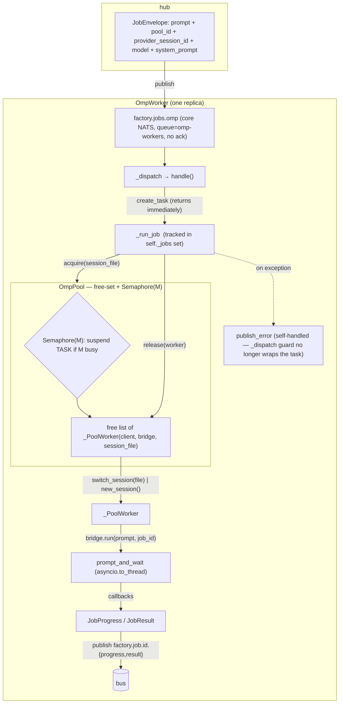
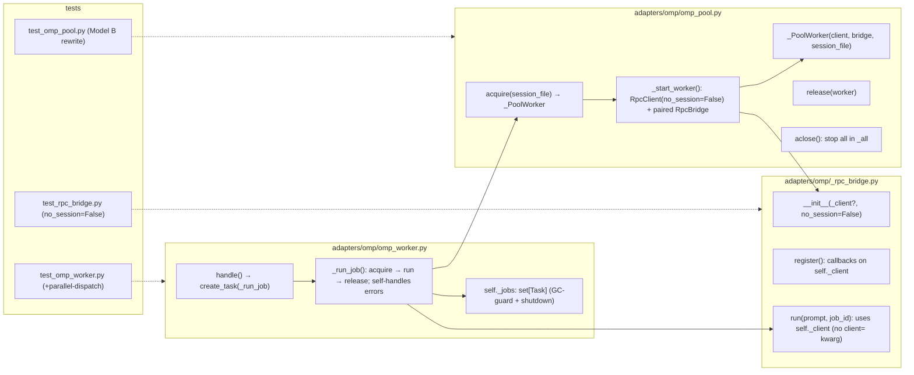

## Summary

Slice 3 of #1813: make one `factory-omp` replica execute distinct conversations **in
parallel**. Pivot the `OmpPool` from Model A (one warm `RpcClient` pinned per `pool_id`,
LRU-evicted) to **Model B** (flat free-set of M interchangeable warm `(RpcClient, RpcBridge)`
workers, RAM-bounded, durable `.jsonl` sessions resumed per turn via `switch_session` ~4ms),
settled by the V3 spike (`artifacts/spikes/1813-v3/RESULT.md`). Carries the prerequisite
`no_session=True→False` flip — which also fixes V2's silently-no-op session resume.

## Architecture

### Data flow



### File × Function map



## Bootstrap Context

`_bootstrap_omp_standalone` (`src/factory/bootstrap/standalone/worker_standalone.py:154`)
constructs `OmpPool()` then `OmpWorker(pool=pool, identity_name="omp-worker")` — **public
constructor signatures stay stable**, so bootstrap does not change. `factory-omp.container`
already mounts the `factory-omp-sessions` named volume at `PI_CODING_AGENT_DIR`
(`/home/factory/.config/omp-pi`, PR #1897) → durable `.jsonl` sessions persist with no deploy
change. omp uses **core NATS** (`adapter_base.py:145`, `nc.subscribe(... cb=_dispatch)`), **no
JetStream ack** → task-spawn introduces no delivery-semantics regression (already at-most-once;
liveness via heartbeat N7).

## Agents

| Agent instance | Tasks | Files | Subject |
|----------------|-------|-------|---------|
| backend-dev-A | T1–T4 (+T5 gate) | `omp_pool.py`, `_rpc_bridge.py`, `omp_worker.py`, `omp/CLAUDE.md` | omp-concurrency |
| tester-A | T6–T8 (+T9 gate) | `test_omp_pool.py`, `test_omp_worker.py`, `test_rpc_bridge.py` | omp-tests |

## Wave Structure

2 waves, max 1 parallel agent/wave (one cohesive subsystem refactor — tests follow the
built internal contract; no cross-agent parallelism to exploit). Elapsed ≈ sequential.

| Wave | Trigger | Agents | Tasks |
|------|---------|--------|-------|
| 1 | start | backend-dev-A | T1→T2→T3→T4 → T5 (RED-GATE) |
| 2 | Wave 1 done | tester-A | T6 ∥ T7 ∥ T8 → T9 (GREEN-GATE) |

### Budget — per task

| Task | Items | Class | Est. ops | Split? |
|------|-------|-------|----------|--------|
| T1 omp_pool Model B | 1 file | exploratory | 10 | — |
| T2 _rpc_bridge flip+inject | 1 file | judgmental | 6 | — |
| T3 omp_worker concurrency | 1 file | judgmental | 8 | — |
| T4 CLAUDE.md doc | 1 file | bounded | 3 | — |
| T5 RED-GATE | — | bounded | 3 | — |
| T6 test_omp_pool rewrite | 1 file | judgmental | 8 | — |
| T7 test_omp_worker +parallel | 1 file | judgmental | 8 | — |
| T8 test_rpc_bridge flips | 1 file | trivial | 3 | — |
| T9 GREEN-GATE | — | bounded | 3 | — |

**Total estimated ops: ~52**

### Budget — per agent instance

| Instance | Tasks | Σ ops | Subjects | Split? |
|----------|-------|-------|----------|--------|
| backend-dev-A | T1,T2,T3,T4 (T5 gate) | 30 | omp-concurrency | — (4 impl tasks = cap; gate is a sentinel, not a surface) |
| tester-A | T6,T7,T8 (T9 gate) | 22 | omp-tests | — |

## Consistency Report

Slice-3 success criteria (spec) → tasks:

| Criterion (spec) | Tasks | Status |
|---|---|---|
| OmpPool concurrency: 2 conversations parallel, wall-clock < serialized | T1, T3, **T7** | covered |
| No cross-conversation bleed (distinct session_id) | T1 (switch_session per turn), T6, T7 | covered |
| Durable sessions survive eviction/restart (`no_session=False`) | T1, T2, T6 | covered |
| Worker stays dumb executor (no config.db / backend read) | T3 (preserves; no new reads) | covered (no regression) |

Out-of-slice criteria (other plans, NOT this artifact): streaming bridge (Slice 4),
per-job override (Slice 5), parity runbook (Slice 6), `result_data` shape clarification #3
(Slice 1/4 driver), #1910 model/timeout pin (pre-default-flip).

## Micro-Tasks

### Wave 1 — source refactor (backend-dev-A) · Slice V3 · Phase GREEN

**T1 — `OmpPool` Model A → Model B**
- File: `src/factory/adapters/omp/omp_pool.py`
- Shape:
  ```python
  @dataclass
  class _PoolWorker:
      client: Any            # omp_rpc.RpcClient (sync, blocking)
      bridge: Any            # paired RpcBridge (1:1)
      session_file: str | None = None
  # OmpPool: self._free: list[_PoolWorker]; self._all: list[_PoolWorker]
  #          self._sem = asyncio.Semaphore(_read_cap())   # construct in __init__ (Lock precedent)
  # remove: _entries, _lru_counter, _maybe_evict, LRU helpers
  async def acquire(self, session_file: str | None) -> _PoolWorker:
      await self._sem.acquire()
      worker = self._free.pop() if self._free else await self._start_worker()
      if session_file is not None:
          await asyncio.to_thread(worker.client.switch_session, session_file)
          worker.session_file = session_file
      else:
          await asyncio.to_thread(worker.client.new_session)
          state = await asyncio.to_thread(worker.client.get_state)
          worker.session_file = getattr(state, "session_file", None)
      return worker
  def release(self, worker: _PoolWorker) -> None:
      self._free.append(worker); self._sem.release()
  async def _start_worker(self) -> _PoolWorker:  # no_session=False; _verify_digest; pair RpcBridge(_client=client)
  async def aclose(self) -> None:  # stop every worker in self._all
  ```
- Keep `OMP_POOL_CAP` env name; redefine meaning = **max concurrent workers (RAM-sized)** in the module docstring + `_read_cap` comment. NO env rename.
- Verify: `uv run --frozen pyright src/factory/adapters/omp/omp_pool.py` clean; `wc -l` < 300 SLOC gate.
- Spec trace: SC "OmpPool concurrency" / N10 · Difficulty 4 · Subject omp-concurrency

**T2 — `_rpc_bridge` `no_session` flip + client injection**
- File: `src/factory/adapters/omp/_rpc_bridge.py`
- Changes: `no_session=True → False` (line ~147); add `__init__(..., _client: Any | None = None)` — if provided, adopt it instead of constructing (pool builds client once, pairs bridge); `_verify_digest` still unconditional at top; remove `client=None` kwarg from `run()` and the `active_client` indirection → always `self._client`. `register()` unchanged (callbacks already on `self._client`, now correct under 1:1 pairing). `run()` keeps `self._result_sent = False` reset at top (serial-per-bridge safety invariant — documented in CLAUDE.md, do not remove).
- Verify: `uv run --frozen pyright src/factory/adapters/omp/_rpc_bridge.py` clean.
- Spec trace: SC "Durable sessions" · Difficulty 3 · Subject omp-concurrency · blockedBy T1

**T3 — `OmpWorker` concurrent dispatch + drop reach-in**
- File: `src/factory/adapters/omp/omp_worker.py`
- Shape:
  ```python
  # __init__: self._jobs: set[asyncio.Task] = set()   # GC-guard + shutdown
  async def handle(self, msg, payload) -> None:
      task = asyncio.create_task(self._run_job(msg, payload))
      self._jobs.add(task); task.add_done_callback(self._jobs.discard)
      # returns immediately → frees the core-NATS dispatch loop
  async def _run_job(self, msg, payload) -> None:
      job_id = ...; pool_id = ...; provider_session_id = ...
      worker = await self._pool.acquire(provider_session_id)     # Semaphore(M) suspends the TASK
      try:
          await worker.bridge.run(prompt, job_id, session_file=worker.session_file)
      except Exception:   # noqa: BLE001 — DEBT:boundary-broad-catch; task is outside _dispatch guard
          await self._bridge_publish_error(...)   # self-handle: _dispatch no longer wraps this
      finally:
          self._pool.release(worker)
  async def aclose(self): # cancel/await self._jobs, then pool.aclose()
  ```
- Remove `self._bridge` singleton + `self._pool._entries[pool_id].session_file` reach-in (use `worker.session_file` / `worker.bridge`). Preserve SanitizedError discipline in the error path (`type(exc).__name__`, never `str(exc)`).
- Verify: `uv run --frozen pyright src/factory/adapters/omp/omp_worker.py` clean.
- Spec trace: SC "OmpPool concurrency" / "dumb executor" · Difficulty 4 · Subject omp-concurrency · blockedBy T1, T2

**T4 — `omp/CLAUDE.md` doc correction**
- File: `src/factory/adapters/omp/CLAUDE.md`
- Decouple the two stale claims (lines ~35, ~43): `agent.db` tmpfs-ephemerality (still true for `$HOME/.omp`) vs `no_session` flag (now `False`). `PI_CODING_AGENT_DIR` is now a **persistent named volume** (`factory-omp-sessions`, PR #1897), not tmpfs; durable `.jsonl` sessions live there; `no_session=False` enables `switch_session` resume.
- Verify: `python3 tools/check_doc_drift.py` green; no unbuilt-symbol backticks introduced.
- Spec trace: Known constraint "durable sessions" · Difficulty 2 · Subject omp-concurrency · blockedBy T2

**T5 — RED-GATE (backend-dev-A)**
- Sentinel: source compiles + typechecks; the OLD Model-A `test_omp_pool.py` tests now FAIL (proves the Model B refactor landed). Run `uv run --frozen pyright src/factory/adapters/omp/` (clean) and `uv run --frozen pytest tests/llm/drivers/test_omp_pool.py -q` (expected RED). Do NOT fix the tests here — that is Wave 2.
- Phase RED-GATE · blockedBy T1, T2, T3, T4

### Wave 2 — tests (tester-A) · Slice V3 · Phase GREEN

**T6 — `test_omp_pool.py` Model B rewrite**
- File: `tests/llm/drivers/test_omp_pool.py`
- Replace all 7 Model-A tests. New cases: acquire returns `_PoolWorker` (client+bridge set); `switch_session` called when `session_file` given (and `new_session` not); `new_session`+`get_state` when no `session_file`; `release` returns worker to free list (next acquire == same object); **`Semaphore` blocks beyond M** (M=2: two acquires proceed, third pends until a release); `aclose` stops every worker in `_all` (incl. free); `no_session=False` passed to `RpcClient`. Fix import (`_DEFAULT_CAP`/`_read_cap` → whatever T1 exports).
- Verify: `uv run --frozen pytest tests/llm/drivers/test_omp_pool.py -q` green.
- Spec trace: SC "no bleed" / "durable" · Difficulty 3 · Subject omp-tests · blockedBy T1, T5

**T7 — `test_omp_worker.py` fixture + parallel-dispatch test**
- File: `tests/adapters/omp/test_omp_worker.py`
- Update `_make_pool()` — drop `pool._entries = {...}` reach-in; mock `acquire` to return a fake `_PoolWorker` (with a fake `bridge.run`) + `release`. Update `bridge.run` call assertions (no `client=` kwarg). **Add `test_two_jobs_dispatch_in_parallel`**: pool M=2, each fake `bridge.run` `await asyncio.sleep(0.05)`; fire two `handle()` back-to-back; assert both complete, wall-clock < 0.08s (< 2×0.05 serialized), each `run` called once, `release` called twice. Add `test_handle_returns_before_job_completes` (handle returns < 10ms while run sleeps 100ms).
- Verify: `uv run --frozen pytest tests/adapters/omp/test_omp_worker.py -q` green. No `time.sleep` (test_sleep gate) — use `asyncio.sleep` + `monotonic` deltas.
- Spec trace: SC "OmpPool concurrency: parallel, wall-clock < serialized" · Difficulty 4 · Subject omp-tests · blockedBy T3, T5

**T8 — `test_rpc_bridge.py` `no_session` assertion flips**
- File: `tests/adapters/omp/test_rpc_bridge.py`
- 3 sites (~733 rename test, ~736 docstring, ~764 `is True → is False`). If a test injects `_client`, add a case asserting the injected client is adopted (no second `RpcClient` construction).
- Verify: `uv run --frozen pytest tests/adapters/omp/test_rpc_bridge.py -q` green.
- Spec trace: SC "durable sessions" · Difficulty 1 · Subject omp-tests · blockedBy T2, T5

**T9 — GREEN-GATE (tester-A)**
- Sentinel: `uv run --frozen pytest tests/adapters/omp/ tests/llm/drivers/test_omp_pool.py -q` all green; `uv run --frozen pyright src/factory/adapters/omp/ tests/adapters/omp/` clean; `uv run ruff format --check . && uv run ruff check src/factory/adapters/omp/ tests/adapters/omp/`. Per memory: pyright the changed TESTS too (not just src) — CI runs repo-wide.
- Phase GREEN-GATE · blockedBy T6, T7, T8

## Task Seeding Blueprint

<!-- Used by /implement to seed TaskCreate calls. T{n} | agent-instance | blockedBy | subject.
     blockedBy refs T-numbers in this list. Seed in wave order; within a wave, rows marked ∥ are parallel. -->

### Wave 1 — no deps, backend-dev-A (sequential chain)

| Task | Agent instance | blockedBy | Subject |
|------|---------------|-----------|---------|
| T1 | backend-dev-A | — | omp-concurrency |
| T2 | backend-dev-A | T1 | omp-concurrency |
| T3 | backend-dev-A | T1, T2 | omp-concurrency |
| T4 | backend-dev-A | T2 | omp-concurrency |
| T5 | backend-dev-A | T1, T2, T3, T4 | omp-concurrency |

### Wave 2 — after T5, tester-A (T6 ∥ T7 ∥ T8)

| Task | Agent instance | blockedBy | Subject |
|------|---------------|-----------|---------|
| T6 | tester-A | T1, T5 | omp-tests |
| T7 | tester-A | T3, T5 | omp-tests |
| T8 | tester-A | T2, T5 | omp-tests |
| T9 | tester-A | T6, T7, T8 | omp-tests |

## Open risks

- **`_verify_digest` × M** at pool fill — cache the digest (module-level) or accept the cost (small binary, OS-cached). Not a blocker (T1).
- **Semaphore fairness** — `asyncio.Semaphore` is FIFO-ish; no starvation expected at M=4. If a worker `start()` raises mid-`_start_worker`, the semaphore slot must be released (guard `_start_worker` failure → `self._sem.release()` + re-raise).
- **Fake vs real divergence** — unit tests fake `omp_rpc`; the real parallel `prompt_and_wait` is validated by M₁ podman smoke (out of CI), per the V3 spike + MEMORY "verify container boot on M₁".

## Task IDs

<!-- Generated by /plan. Used by /implement to resume tasks on session restart. -->
- T1: 9 — omp-concurrency (omp_pool Model B)
- T2: 10 — omp-concurrency (_rpc_bridge no_session+inject)
- T3: 11 — omp-concurrency (omp_worker concurrent dispatch)
- T4: 12 — omp-concurrency (omp/CLAUDE.md doc)
- T5: 13 — omp-concurrency (RED-GATE)
- T6: 14 — omp-tests (test_omp_pool rewrite)
- T7: 15 — omp-tests (test_omp_worker +parallel)
- T8: 16 — omp-tests (test_rpc_bridge flips)
- T9: 17 — omp-tests (GREEN-GATE)
