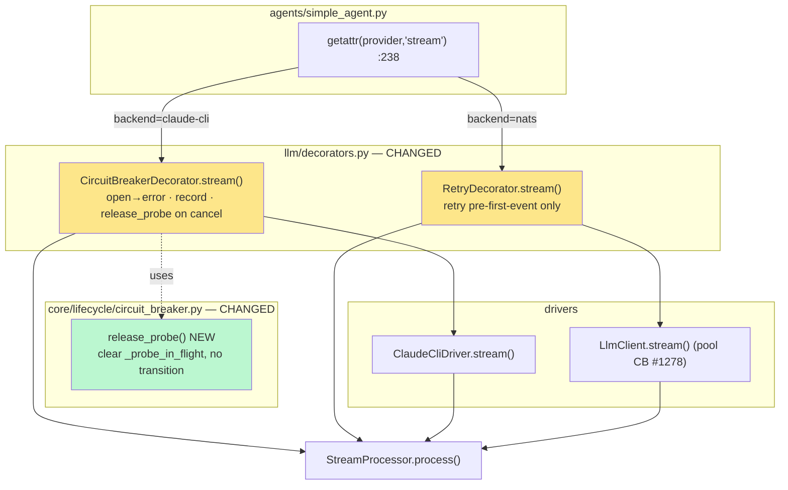
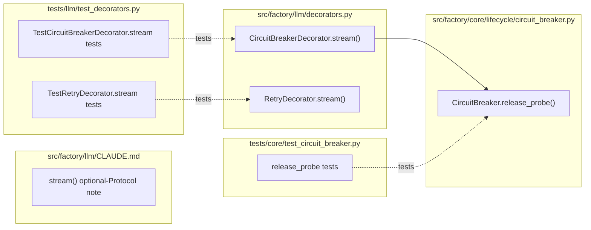

## Summary

Give the LLM streaming path circuit-breaker parity with `complete()` (`claude-cli` backend) plus
connect-time retry (`nats` backend), via `decorators.py` + one new `CircuitBreaker.release_probe()`
method, with TDD (RED tests → GREEN impl → RED-GATE verify) and a one-line `llm/CLAUDE.md` doc fix.

## Architecture

### Data flow



### File × Function map



## Agents

| Agent instance | Tasks | Files |
|----------------|-------|-------|
| tester-A | T1, T2, T7 | `tests/llm/test_decorators.py`, `tests/core/test_circuit_breaker.py` |
| backend-dev-A | T3, T4, T5 | `src/factory/llm/decorators.py`, `src/factory/core/lifecycle/circuit_breaker.py` |
| doc-writer-A | T6 | `src/factory/llm/CLAUDE.md` |

## Wave Structure

3 waves, max 2 parallel agents. Elapsed ~1 short session vs ~1.5 sequential.

| Wave | Trigger | Agents | Tasks |
|------|---------|--------|-------|
| 1 | start | 2 ∥ | tester-A: T1→T2 · doc-writer-A: T6 |
| 2 | Wave 1 (T1,T2) done | 1 | backend-dev-A: T3→T4→T5 |
| 3 | Wave 2 + T6 done | 1 | tester-A: T7 (RED-GATE verify) |

### Budget — per task

| Task | Items | Class | Est. ops | Split? |
|------|-------|-------|----------|--------|
| T1 RED tests CB+release_probe | ~6 tests | judgmental | 8 | — |
| T2 RED tests retry-on-stream | ~3 tests | judgmental | 6 | — |
| T3 release_probe() | 1 method | bounded | 3 | — |
| T4 CircuitBreakerDecorator.stream() | 1 method | judgmental | 8 | — |
| T5 RetryDecorator.stream() | 1 method | judgmental | 6 | — |
| T6 CLAUDE.md doc fix | 1 edit | trivial | 2 | — |
| T7 RED-GATE verify (gates) | 4 cmds | bounded | 5 | — |

**Total estimated ops: 38**

### Budget — per agent instance

| Instance | Tasks | Σ ops | Subjects | Split? |
|----------|-------|-------|----------|--------|
| tester-A | T1, T2, T7 | 19 | stream-resilience, verify | — (2 ≤ 2) |
| backend-dev-A | T3, T4, T5 | 17 | stream-resilience | — |
| doc-writer-A | T6 | 2 | docs | — |

## Consistency Report

Covered: 12/12 success criteria. Untraced tasks: 0. Exemptions: 0.

| SC (spec) | Task(s) |
|-----------|---------|
| open-circuit yields terminal error, no inner call | T1, T4 |
| record_success on clean terminal | T1, T4 |
| record_failure on error-terminal / raise / no-terminal | T1, T4 |
| non-cancel exception re-raised after record_failure | T1, T4 |
| GeneratorExit/CancelledError → no record_failure + release_probe | T1, T3, T4 |
| release_probe clears flag, no transition, idempotent | T1, T3 |
| retry pre-first-event | T2, T5 |
| no retry after first event; order preserved | T2, T5 |
| llm/CLAUDE.md stale line removed; llm.py unchanged | T6, T7 |
| new tests cover all + pass | T1, T2, T7 |
| ruff/pyright/pytest/doc_drift green | T7 |
| no change to nats pool CB / hub circuit (diff) | T7 |

## Micro-Tasks

### Slice 1 — CB on stream (RED → GREEN)

**T1 [RED] [P] — tester-A — subject: stream-resilience — SC: CB-on-stream + release_probe — Difficulty 3**
- Files: `tests/llm/test_decorators.py` (extend `TestCircuitBreakerDecorator`), `tests/core/test_circuit_breaker.py`
- Add async stream tests mirroring the existing `complete()` CB tests:
  - `test_cb_stream_open_circuit_yields_error_without_calling_inner` — `cb.is_open()=True` → consume `stream()`, assert exactly one `ResultLlmEvent(is_error=True, worker_error=None)`, `inner.stream` never awaited.
  - `test_cb_stream_records_success_on_clean_terminal` — inner yields text + `ResultLlmEvent(is_error=False)` → `cb.record_success()` called once.
  - `test_cb_stream_records_failure_on_error_terminal` — inner yields `ResultLlmEvent(is_error=True)` → `cb.record_failure()`.
  - `test_cb_stream_records_failure_on_exception` — inner raises mid-stream → `record_failure()` + exception re-raised.
  - `test_cb_stream_no_failure_on_cancel_releases_probe` — consumer `aclose()` mid-stream → `record_failure` NOT called, `release_probe()` called.
  - In `test_circuit_breaker.py`: `test_release_probe_clears_flag_no_transition` (half-open probe acquired → `release_probe()` → `_probe_in_flight False`, `_state` still HALF_OPEN, next `is_open()` can re-probe) + `test_release_probe_noop_when_closed`.
- Inner mock pattern: `inner.stream = lambda *a, **k: _agen(events)` where `_agen` is a local async generator; `cb = MagicMock(spec=CircuitBreaker)`.
- Verify: `uv run pytest tests/llm/test_decorators.py tests/core/test_circuit_breaker.py -k "stream or release_probe" -q` → **RED** (fail/error: methods not yet implemented).

**T3 [GREEN] — backend-dev-A — subject: stream-resilience — SC: release_probe — Difficulty 2 — blockedBy T1**
- File: `src/factory/core/lifecycle/circuit_breaker.py`
- Add method:
  ```python
  def release_probe(self) -> None:
      """Release a half-open probe slot without recording success/failure.

      Used when a streaming probe turn is cancelled (GeneratorExit /
      CancelledError) before a terminal outcome — prevents _probe_in_flight
      from sticking True and freezing the circuit in pseudo-OPEN. No state
      transition; idempotent (no-op when already cleared / CLOSED).
      """
      self._probe_in_flight = False
  ```
- Verify: `uv run pytest tests/core/test_circuit_breaker.py -k release_probe -q` → GREEN.

**T4 [GREEN] — backend-dev-A — subject: stream-resilience — SC: CB-on-stream — Difficulty 3 — blockedBy T1, T3**
- File: `src/factory/llm/decorators.py` (`CircuitBreakerDecorator.stream`)
- Replace the pass-through body with:
  - `if self._cb.is_open():` → build retry-after message (mirror `complete()` lines 125-133), `yield ResultLlmEvent(is_error=True, duration_ms=0, error_text=msg, worker_error=None)`, `return`.
  - else iterate `self._inner.stream(...)`; track `terminal_seen`/`outcome_recorded`; on terminal `ResultLlmEvent` → `record_success()` (is_error False) / `record_failure()` (is_error True); after loop with no terminal → `record_failure()`.
  - `except (GeneratorExit, asyncio.CancelledError): if not outcome_recorded: self._cb.release_probe(); raise`.
  - `except Exception: if not outcome_recorded: self._cb.record_failure(); raise`.
- Import `asyncio` (already imported in module? verify — add if missing) and `ResultLlmEvent` from `factory.core.messaging.events`.
- Keep ≤300 SLOC (file currently 164).
- Verify: `uv run pytest tests/llm/test_decorators.py -k "stream" -q` → GREEN; `uv run ruff check src/factory/llm/decorators.py`.

### Slice 2 — retry on stream (RED → GREEN)

**T2 [RED] [P] — tester-A — subject: stream-resilience — SC: retry-on-stream — Difficulty 3**
- File: `tests/llm/test_decorators.py` (extend `TestRetryDecorator`)
- Tests:
  - `test_retry_stream_retries_before_first_event` — inner stream raises on attempt 1, yields cleanly on attempt 2 → events forwarded; `asyncio.sleep` patched; attempt count == 2.
  - `test_retry_stream_no_retry_after_first_event` — inner yields one text event then raises → exception propagates, NO second attempt (no replay).
  - `test_retry_stream_forwards_all_events_in_order` — happy path, order preserved.
- Verify: `uv run pytest tests/llm/test_decorators.py -k "retry_stream" -q` → **RED**.

**T5 [GREEN] — backend-dev-A — subject: stream-resilience — SC: retry-on-stream — Difficulty 3 — blockedBy T2, T4**
- File: `src/factory/llm/decorators.py` (`RetryDecorator.stream`)
- Replace pass-through with an attempt loop:
  - `for attempt in range(self._max_retries + 1):` start `self._inner.stream(...)`; set `first_event_seen=False`; iterate: on first non-terminal event set `first_event_seen=True`; `yield` each event.
  - On exception before `first_event_seen` and `attempt < max_retries` → `await asyncio.sleep(backoff_base * 2**attempt)`; `continue`. On exception after `first_event_seen` → re-raise (no replay). On exhausting attempts → re-raise last.
  - No `retryable` field on `ResultLlmEvent` → no early non-retryable abort.
- Verify: `uv run pytest tests/llm/test_decorators.py -k "retry_stream" -q` → GREEN.

### Slice 3 — doc reconciliation

**T6 [P] — doc-writer-A — subject: docs — SC: doc — Difficulty 1**
- File: `src/factory/llm/CLAUDE.md`
- In the "LlmProvider protocol" section, replace the line *"`stream()` is duck-typed optional — callers check `hasattr(provider, "stream")`. Do not add it to the Protocol until all drivers implement it."* with a corrected note: stream() **is** an optional member of the `LlmProvider` Protocol (declared in `core/ports/llm.py:67-75`); callers gate on `getattr(provider, "stream", None)` so providers that don't stream are unaffected.
- Do **not** edit `core/ports/llm.py` (its comment is already correct).
- Verify: `python3 tools/check_doc_drift.py` → pass; `grep -c "do not add it to the Protocol" src/factory/llm/CLAUDE.md` → 0.

### RED-GATE

**T7 [RED-GATE] — tester-A — subject: verify — Difficulty 2 — blockedBy T3, T4, T5, T6**
- Run the full gate set and confirm green:
  - `uv run ruff check . && uv run ruff format --check .`
  - `uv run pyright src/factory/llm/decorators.py src/factory/core/lifecycle/circuit_breaker.py`
  - `uv run pytest tests/llm/test_decorators.py tests/core/test_circuit_breaker.py -q`
  - `python3 tools/check_doc_drift.py`
  - `git diff --stat` → confirm only the 5 intended files changed (no `nats`/hub-circuit/`providers.py` changes).
- After running gates, `git restore uv.lock` if churned (see venv caveat) before staging.

## Constraints / venv caveat

The worktree `.venv` is symlinked to the main repo `.venv`. Running `uv run <gate>` re-points the
editable install to the worktree (so tests see worktree code) but churns `uv.lock` and bakes worktree
paths — known pattern. Mitigation: `git restore uv.lock` before each commit; stage only the intended
files explicitly (never `git add -A`); main-repo venv repair (`uv sync --frozen`) belongs to the
`/cleanup` step after worktree removal.

## Task Seeding Blueprint

<!-- Used by /implement to seed TaskCreate calls on session start.
     Format: T{n} | agent-instance | blockedBy | subject
     blockedBy refs T-numbers within this list (not session task IDs).
     Seed in wave order; within a wave all rows are parallel (∥). -->

### Wave 1 — no deps, 2 agents ∥

| Task | Agent instance | blockedBy | Subject |
|------|---------------|-----------|---------|
| T1 | tester-A | — | stream-resilience |
| T2 | tester-A | T1 | stream-resilience |
| T6 | doc-writer-A | — | docs |

### Wave 2 — after T1,T2; 1 agent

| Task | Agent instance | blockedBy | Subject |
|------|---------------|-----------|---------|
| T3 | backend-dev-A | T1 | stream-resilience |
| T4 | backend-dev-A | T1, T3 | stream-resilience |
| T5 | backend-dev-A | T2, T4 | stream-resilience |

### Wave 3 — after T3,T4,T5,T6; 1 agent

| Task | Agent instance | blockedBy | Subject |
|------|---------------|-----------|---------|
| T7 | tester-A | T3, T4, T5, T6 | verify |

## Task IDs

<!-- Generated by /plan. Used by /implement to resume tasks on session restart. -->
- T1: 12 — stream-resilience (RED tests CB + release_probe)
- T2: 13 — stream-resilience (RED tests retry-on-stream)
- T3: 14 — stream-resilience (release_probe)
- T4: 15 — stream-resilience (CircuitBreakerDecorator.stream)
- T5: 16 — stream-resilience (RetryDecorator.stream)
- T6: 17 — docs (llm/CLAUDE.md reconciliation)
- T7: 18 — verify (RED-GATE)
