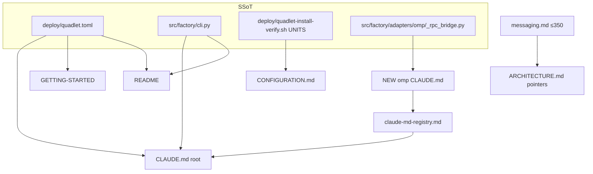
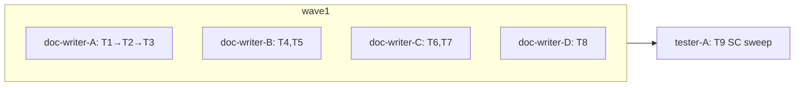

## Summary

Docs-only sweep: 4 parallel doc-writer instances fix the 16-row stale-claims
inventory across 8 files (+1 new CLAUDE.md), then a tester instance verifies
SC1–SC8 (doc_drift + grep sweep + empirical counts).

## Architecture

## Agents

| Instance | Tasks | Files |
|---|---|---|
| doc-writer-A | T1, T2, T3 | `src/factory/adapters/omp/CLAUDE.md` (new), `docs/claude-md-registry.md`, `CLAUDE.md` |
| doc-writer-B | T4, T5 | `docs/GETTING-STARTED.md`, `docs/CONFIGURATION.md` |
| doc-writer-C | T6, T7 | `README.md`, `docs/ARCHITECTURE.md` |
| doc-writer-D | T8 | `docs/architecture/messaging.md` |
| tester-A | T9 | verification only (no edits) |

## Wave Structure

2 waves, max 4 parallel agents.

| Wave | Trigger | Agents | Tasks |
|------|---------|--------|-------|
| 1 | start | 4 ∥ | doc-writer-A: T1→T2→T3 · doc-writer-B: T4,T5 · doc-writer-C: T6,T7 · doc-writer-D: T8 |
| 2 | Wave 1 done | 1 | tester-A: T9 |

### Budget — per task

| Task | Class | Est. ops |
|------|-------|----------|
| T1 omp CLAUDE.md | judgmental | 6 |
| T2 registry row + count | bounded | 3 |
| T3 root CLAUDE.md | judgmental | 5 |
| T4 GETTING-STARTED | judgmental | 5 |
| T5 CONFIGURATION | bounded | 3 |
| T6 README | judgmental | 6 |
| T7 ARCHITECTURE | judgmental | 6 |
| T8 messaging ≤350 | exploratory | 10 |
| T9 SC sweep | judgmental | 6 |

**Total estimated ops: 50**

### Budget — per agent instance

| Instance | Tasks | Σ ops | Subjects | Split? |
|----------|-------|-------|----------|--------|
| doc-writer-A | T1,T2,T3 | 14 | claude-md | — |
| doc-writer-B | T4,T5 | 8 | runbooks | — |
| doc-writer-C | T6,T7 | 12 | onboarding | — |
| doc-writer-D | T8 | 10 | messaging | — (split from C by subject cap) |
| tester-A | T9 | 6 | verification | — |

## Consistency Report

8/8 SCs covered: SC1→T3, SC2→T1+T2+T3, SC3→T4, SC4→T5, SC5→T6, SC6→T7,
SC7→T8, SC8→T9. No uncovered SC, no untraced task. Falsification gate: docs-only
— no test files → all SC rows `⚠ NO TEST — out-of-scope` except SC8 (command-verifiable, run by T9).

## Micro-Tasks

### Slice 1 — agent-facing SSoT (doc-writer-A)

- **T1** — Create `src/factory/adapters/omp/CLAUDE.md`. Read `_rpc_bridge.py`,
  `omp_worker.py`, `deploy/quadlet/factory-omp.container`, `deploy/omp/README.md`
  first. Invariants (verify each in source, ¬invent): `/opt/omp/omp` digest gate
  (`_PINNED_SHA256`, image-build constant, never env), `tool_input` never
  published to NATS bus, `_result_sent` double-publish guard, ADR-073
  SanitizedError discipline, `PI_CODING_AGENT_DIR` → `deploy/omp/` models.yml
  (baseUrl override), runs as `factory:staging` with binary baked from the
  carrier (#1867). Style: match sibling `src/factory/*/CLAUDE.md` ("invariants,
  not inventory", terse). Verify: file exists, ≤60 lines. [Slice V1, SC2]
- **T2** — Add registry row in `docs/claude-md-registry.md` (path + scope) +
  update its header count. Blocked by T1. Verify: `grep adapters/omp docs/claude-md-registry.md`. [V1, SC2]
- **T3** — Root `CLAUDE.md`: line ~87 "Eight containers" → nine + add
  `factory-omp`; line ~71 table title "(NATS 5-process)" → 6-process + add row
  `adapter omp | factory adapter omp | _bootstrap_omp_standalone` (verify vs
  `src/factory/cli.py:143-150`); line ~67 registry count → empirical
  `find . -name CLAUDE.md -not -path './.claude/*' -not -path './node_modules/*' | wc -l`.
  Blocked by T2. Verify: greps + count match. [V1, SC1+SC2]

### Slice 2 — operator runbooks (doc-writer-B)

- **T4** — `docs/GETTING-STARTED.md`: start commands (~:335) + "all eight units"
  (~:372) → nine units incl. `factory-omp`; "Final state" Podman-secrets row
  (~:446) → replace entire inline list with the full `required_secrets` union
  from `deploy/quadlet.toml` (read it — 10 distinct secrets). Verify: greps. [V2, SC3]
- **T5** — `docs/CONFIGURATION.md:665-666`: restart list → mirror the 9-entry
  UNITS array of `deploy/quadlet-install-verify.sh` verbatim. Verify: counts match. [V2, SC4]

### Slice 3 — onboarding + architecture (doc-writer-C, doc-writer-D)

- **T6** — `README.md`: line 45 "Four independent processes" → nine-container
  prose; lines 29-43 diagram → grouped topology (NATS hub + chat adapters +
  workers clipool/omp + gh-helper/turn-writer/blobstore) — group, don't draw 9
  literal boxes; CLI table (~106-112) + `factory adapter omp` row. Verify: greps. [V3, SC5]
- **T7** — `docs/ARCHITECTURE.md`: line 58 "All four processes" → current
  reality; add a short "Jobs & workers" pointer block — OmpWorker, FACTORY_JOBS
  + DLQ, factory-active-jobs KV, WorkEnvelope, `factory.job.<id>.*` — POINTERS
  ONLY to `docs/architecture/messaging.md` + ADR refs, no inline duplication
  (doc_drift safety: backtick only symbols existing in src/). Verify: negative
  grep + pointer present. [V3, SC6]
- **T8** — `docs/architecture/messaging.md`: baseline 368 lines (`wc -l`) —
  **net-compress ≥18 lines while adding**: (a) per-job lifecycle subjects
  `factory.job.<job_id>.steer/.progress/.result` (published by omp
  `_rpc_bridge.py`) in the subject table — distinct from the existing
  `factory.jobs.<domain>.<verb>` WorkQueue dispatch plane (leave that as-is);
  (b) one-line retirement note: pre-#1793 top-level `results/progress` siblings
  unified into `factory.job.<id>.*` (#1793/#1849); (c) bump "Last updated" to
  2026-06-13. Final `wc -l` ≤ 350. Verify: `wc -l` + greps. [V3, SC7]

### Wave 2 — verification (tester-A)

- **T9** — Run SC sweep, NO edits: `python3 tools/check_doc_drift.py` (exit 0);
  negative greps ("Eight containers", "eight units", "Four independent",
  "All four processes", "5-process", "5 containers", pre-edit CONFIGURATION
  restart phrase) across touched docs; `wc -l docs/architecture/messaging.md`
  ≤350; registry count vs `find` count; report per-SC pass/fail table. [SC8 + all]

## Task Seeding Blueprint

<!-- T{n} | agent-instance | blockedBy | subject -->

### Wave 1 — no deps, 4 agents ∥

| Task | Agent instance | blockedBy | Subject |
|------|---------------|-----------|---------|
| T1 | doc-writer-A | — | claude-md |
| T2 | doc-writer-A | T1 | claude-md |
| T3 | doc-writer-A | T2 | claude-md |
| T4 | doc-writer-B | — | runbooks |
| T5 | doc-writer-B | — | runbooks |
| T6 | doc-writer-C | — | onboarding |
| T7 | doc-writer-C | — | onboarding |
| T8 | doc-writer-D | — | messaging |

### Wave 2 — after Wave 1

| Task | Agent instance | blockedBy | Subject |
|------|---------------|-----------|---------|
| T9 | tester-A | T1,T2,T3,T4,T5,T6,T7,T8 | verification |

## Task IDs

<!-- Generated by /plan. Used by /implement to resume tasks on session restart. -->
- T1: 23 — claude-md
- T2: 24 — claude-md
- T3: 25 — claude-md
- T4: 26 — runbooks
- T5: 27 — runbooks
- T6: 28 — onboarding
- T7: 29 — onboarding
- T8: 30 — messaging
- T9: 31 — verification
