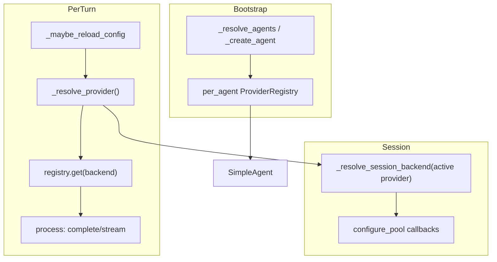

## Summary

Pass `ProviderRegistry` into `SimpleAgent`, resolve the active `LlmProvider`
per turn after `_maybe_reload()`, re-wire `SessionAware` callbacks on backend
transitions, add `backend` to `REFINABLE_FIELDS`, and prove hot-swap with a
mock-registry unit test.

## Architecture

### Data Flow



### File × Function Map

| File | Change |
|------|--------|
| `src/factory/agents/simple_agent.py` | registry injection, `_resolve_provider`, session re-wire |
| `src/factory/bootstrap/factory/agent_factory.py` | pass registry to `SimpleAgent` |
| `src/factory/core/agent/agent.py` | backend transition log in `_maybe_reload_config` |
| `src/factory/core/agent/agent_refiner.py` | add `backend` to `REFINABLE_FIELDS` |
| `tests/agents/test_simple_agent.py` | RED→GREEN backend hot-swap test |

## Agents

| Agent | Task count | Files |
|-------|-----------|-------|
| tester-A | 2 | `tests/agents/test_simple_agent.py` |
| backend-dev-A | 4 | `simple_agent.py`, `agent_factory.py`, `agent.py` |
| backend-dev-B | 1 | `agent_refiner.py` |

## Wave Structure

| Wave | Trigger | Agents | Tasks |
|------|---------|--------|-------|
| 1 | start | 1 | tester-A: T1 (RED) |
| 2 | Wave 1 done | 2 ∥ | backend-dev-A: T2,T3,T4 · backend-dev-B: T5 |
| 3 | Wave 2 done | 1 | tester-A: T6 (GREEN verify) + RED-GATE |

### Budget — per task

| Task | Class | Est. ops |
|------|-------|----------|
| T1 RED hot-swap test | judgmental | 10 |
| T2 registry injection | bounded | 4 |
| T3 per-turn resolve in process() | judgmental | 8 |
| T4 session backend re-wire + reload log | judgmental | 10 |
| T5 REFINABLE_FIELDS backend | trivial | 2 |
| T6 pytest + RED-GATE | trivial | 3 |

**Total estimated ops: 37**

## Consistency Report

- Criteria covered: 6/6 (SC1–SC6)
- Uncovered criteria: none
- Tasks without spec backing: none

## Micro-Tasks

### Slice V1: Registry injection + per-turn resolve

#### Task 1: RED — backend hot-swap test → tester-A
- **File:** `tests/agents/test_simple_agent.py`
- **Snippet:**
  ```python
  def test_process_uses_provider_for_reloaded_backend():
      cli_provider = AsyncMock()
      omp_provider = AsyncMock()
      cli_provider.complete = AsyncMock(return_value=LlmResult(result="cli"))
      omp_provider.complete = AsyncMock(return_value=LlmResult(result="omp"))
      registry = ProviderRegistry()
      registry.register("claude-cli", cli_provider)
      registry.register("omp-rpc", omp_provider)
      # agent_store returns row with backend flipped to omp-rpc after first process
      ...
      assert omp_provider.complete.await_count == 1
  ```
- **Verify:** `uv run pytest tests/agents/test_simple_agent.py::test_process_uses_provider_for_reloaded_backend -x` (deferred)
- **Expected:** FAIL (pre-impl)
- **Traces:** SC1, SC3, SC6
- **Phase:** RED

#### Task 2: Pass ProviderRegistry into SimpleAgent → backend-dev-A
- **File:** `src/factory/bootstrap/factory/agent_factory.py`, `src/factory/agents/simple_agent.py`
- **Snippet:** Add optional `provider_registry: ProviderRegistry | None` param; store on agent; `_create_agent` passes `deps.provider_registry`.
- **Verify:** `uv run pyright src/factory/agents/simple_agent.py` (ready)
- **Traces:** SC3
- **Phase:** GREEN

#### Task 3: Per-turn `_resolve_provider()` in `process()` → backend-dev-A
- **File:** `src/factory/agents/simple_agent.py`
- **Snippet:**
  ```python
  def _resolve_provider(self) -> LlmProvider:
      if self._provider_registry is not None:
          return self._provider_registry.get(self.config.llm_config.backend)
      return self._provider
  ```
  Use `provider = self._resolve_provider()` for `complete`/`stream`/`is_backend_alive`.
- **Verify:** grep `_resolve_provider` in simple_agent.py (ready)
- **Traces:** SC3, SC5
- **Phase:** GREEN

### Slice V2: Session callbacks + patch surface

#### Task 4: Backend transition log + session re-wire → backend-dev-A
- **File:** `src/factory/core/agent/agent.py`, `src/factory/agents/simple_agent.py`
- **Snippet:** Log `backend: {old} -> {new}` in `_maybe_reload_config`; add `_resolve_session_backend(provider)` using `isinstance(provider, SessionAware)` with cli_pool fallback; call on backend change before `configure_pool` paths.
- **Verify:** `grep -q 'backend:' src/factory/core/agent/agent.py` (ready)
- **Traces:** SC1, SC4
- **Phase:** GREEN

#### Task 5: Add `backend` to REFINABLE_FIELDS → backend-dev-B
- **File:** `src/factory/core/agent/agent_refiner.py`
- **Snippet:** Add `"backend"` to the `REFINABLE_FIELDS` frozenset.
- **Verify:** `uv run python -c "from factory.core.agent.agent_refiner import REFINABLE_FIELDS; assert 'backend' in REFINABLE_FIELDS"` (ready)
- **Traces:** SC2
- **Phase:** GREEN

#### Task 6: GREEN verify + RED-GATE → tester-A
- **Verify:** `uv run pytest tests/agents/test_simple_agent.py -x -k backend` (ready)
- **Traces:** SC1–SC6
- **Phase:** GREEN + RED-GATE

## Task Seeding Blueprint

### Wave 1
| Task | Agent | blockedBy | Subject |
|------|-------|-----------|---------|
| T1 | tester-A | — | dispatch |

### Wave 2
| Task | Agent | blockedBy | Subject |
|------|-------|-----------|---------|
| T2 | backend-dev-A | T1 | wiring |
| T3 | backend-dev-A | T2 | dispatch |
| T4 | backend-dev-A | T3 | session |
| T5 | backend-dev-B | — | patch |

### Wave 3
| Task | Agent | blockedBy | Subject |
|------|-------|-----------|---------|
| T6 | tester-A | T2,T3,T4,T5 | gate |

## Task IDs

<!-- Generated by /plan. Used by /implement to resume tasks on session restart. -->
- T1: plan-t1-red-hot-swap — dispatch
- T2: plan-t2-registry-inject — wiring
- T3: plan-t3-per-turn-resolve — dispatch
- T4: plan-t4-session-rewire — session
- T5: plan-t5-refinable-backend — patch
- T6: plan-t6-green-gate — gate