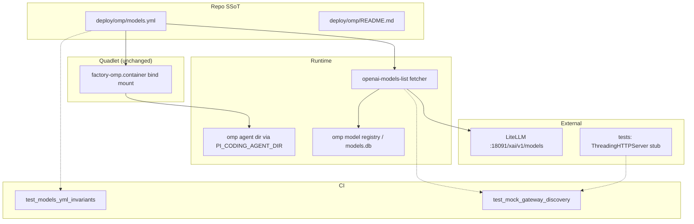
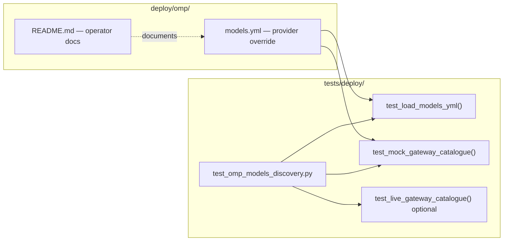

## Summary

Replace the static `models:` list in `deploy/omp/models.yml` with
`discovery: {type: openai-models-list}` against the interim xAI pass-through
URL (`:18091/xai/v1`), update operator docs, and add CI tests under
`tests/deploy/` — static YAML invariants plus a mock-gateway catalogue fetch.

## Architecture

### Data Flow



### File × Function Map



## Bootstrap Context

No analysis artifact — frame + spec only. Discovery shape verified in #1811
against oh-my-pi `model-registry.ts:1395-1408`. Chicken-and-egg rationale and
Quadlet mount pattern documented in `deploy/omp/README.md` (#1811). `factory-omp`
bind mount is stable — this plan does not touch `deploy/quadlet/`.

## Agents

| Agent | Task count | Files |
|-------|-----------|-------|
| devops-A | 1 | `deploy/omp/models.yml` |
| doc-writer-A | 1 | `deploy/omp/README.md` |
| tester-A | 4 | `tests/deploy/test_omp_models_discovery.py` |

## Wave Structure

3 waves, max 3 parallel agents. Elapsed ~1 session vs ~2 sequential.

| Wave | Trigger | Agents | Tasks |
|------|---------|--------|-------|
| 1 | start | 3 ∥ | devops-A: T1 · doc-writer-A: T2 · tester-A: T3 |
| 2 | Wave 1 done | 1 | tester-A: T4→T5 |
| 3 | Wave 2 done | 1 | tester-A: T6 RED-GATE |

### Budget — per task

| Task | Items | Class | Est. ops | Split? |
|------|-------|-------|----------|--------|
| T1 models.yml discovery switch | 1 | bounded | 3 | — |
| T2 README phase docs | 1 | judgmental | 5 | — |
| T3 static YAML invariants (RED) | 1 | bounded | 4 | — |
| T4 mock-gateway discovery test | 1 | judgmental | 8 | — |
| T5 pytest gate | 1 | trivial | 2 | — |
| T6 RED-GATE V2 | 1 | trivial | 1 | — |

**Total estimated ops: 23**

### Budget — per agent instance

| Instance | Tasks | Σ ops | Subjects | Split? |
|----------|-------|-------|----------|--------|
| devops-A | T1 | 3 | deploy | — |
| doc-writer-A | T2 | 5 | docs | — |
| tester-A | T3, T4, T5, T6 | 15 | yaml, discovery | — |

## Consistency Report

- Criteria covered: 5/5 interim success criteria
- Uncovered criteria: target-phase items (deferred per spec)
- Tasks without spec backing: none
- Gold plating exemptions applied: 0

## Micro-Tasks

### Slice V1: Discovery config + docs

#### Task 1: Switch models.yml to discovery mode [P] → devops-A
- **File:** `deploy/omp/models.yml`
- **Snippet:**
  ```yaml
  providers:
    litellm:
      baseUrl: http://roxabituwer.goose-logarithm.ts.net:18091/xai/v1
      api: openai-completions
      apiKey: LITELLM_API_KEY
      discovery:
        type: openai-models-list
  ```
- **Verify:** `grep -q 'openai-models-list' deploy/omp/models.yml && ! grep -q '^    models:' deploy/omp/models.yml` (ready)
- **Expected:** exit 0
- **Time:** 3 min
- **Difficulty:** 2
- **Traces:** SC-1
- **Phase:** GREEN

#### Task 2: Document discovery mode + phase table [P] → doc-writer-A
- **File:** `deploy/omp/README.md`
- **Snippet:** Replace "Why an explicit models: list" section with discovery-mode docs; add interim/target phase table; operator restart procedure; pointers to #1924, llmCLI#129, llmCLI#130.
- **Verify:** `grep -q 'openai-models-list' deploy/omp/README.md && grep -q 'xai/v1' deploy/omp/README.md` (ready)
- **Expected:** exit 0
- **Time:** 5 min
- **Difficulty:** 2
- **Traces:** SC-2
- **Phase:** GREEN

### Slice V2: CI discovery smoke

#### Task 3: Add static YAML invariant tests [P] → tester-A
- **File:** `tests/deploy/test_omp_models_discovery.py`
- **Snippet:**
  ```python
  MODELS_YML = REPO_ROOT / "deploy" / "omp" / "models.yml"

  def test_models_yml_has_discovery_block():
      doc = yaml.safe_load(MODELS_YML.read_text())
      litellm = doc["providers"]["litellm"]
      assert litellm["discovery"]["type"] == "openai-models-list"
      assert "models" not in litellm
      assert litellm["baseUrl"].endswith("/xai/v1")
  ```
- **Verify:** `uv run --frozen pytest tests/deploy/test_omp_models_discovery.py::test_models_yml_has_discovery_block -x` (deferred until T1)
- **Expected:** PASS after T1
- **Time:** 4 min
- **Difficulty:** 2
- **Traces:** SC-3, T1
- **Phase:** RED

#### Task 4: Add mock-gateway catalogue test → tester-A
- **File:** `tests/deploy/test_omp_models_discovery.py`
- **Snippet:**
  ```python
  @pytest.fixture
  def mock_gateway():
      # ThreadingHTTPServer on 127.0.0.1:0 serving GET /xai/v1/models
      # {"data": [{"id": "grok-4-fast", "object": "model"}]}
      ...

  def test_discovery_fetch_returns_grok_model(mock_gateway, tmp_path):
      # Write temp models.yml pointing baseUrl at mock_gateway
      # GET {baseUrl}/models with Authorization: Bearer test-key
      # assert any m["id"].startswith("grok") for m in body["data"]
  ```
- **Verify:** `uv run --frozen pytest tests/deploy/test_omp_models_discovery.py::test_discovery_fetch_returns_grok_model -x` (ready)
- **Expected:** PASS
- **Time:** 8 min
- **Difficulty:** 3
- **Traces:** SC-3, C3, C4, T2
- **Phase:** GREEN

#### Task 5: Run full deploy discovery test module → tester-A
- **File:** `tests/deploy/test_omp_models_discovery.py`
- **Snippet:** _(no file change — verify only)_
- **Verify:** `uv run --frozen pytest tests/deploy/test_omp_models_discovery.py -x` (ready)
- **Expected:** all tests PASS
- **Time:** 2 min
- **Difficulty:** 1
- **Traces:** SC-3
- **Phase:** GREEN

#### RED-GATE: RED complete V2 → tester-A
- **Verify:** T3–T5 complete; `git diff` excludes `deploy/quadlet*`
- **Phase:** RED-GATE

#### Task 6 (optional manual): Live gateway smoke note → doc-writer-A
- **File:** PR description or README footnote
- **Snippet:** Document live validation command for M₁ post-llmCLI#129 deploy.
- **Verify:** manual — recorded in PR body (manual)
- **Expected:** operator checklist present
- **Time:** 3 min
- **Difficulty:** 1
- **Traces:** SC-5
- **Phase:** REFACTOR

## Task Seeding Blueprint

### Wave 1 — no deps, 3 agents ∥

| Task | Agent instance | blockedBy | Subject |
|------|---------------|-----------|---------|
| T1 | devops-A | — | deploy |
| T2 | doc-writer-A | — | docs |
| T3 | tester-A | — | yaml |

### Wave 2 — after Wave 1, 1 agent

| Task | Agent instance | blockedBy | Subject |
|------|---------------|-----------|---------|
| T4 | tester-A | T1, T3 | discovery |
| T5 | tester-A | T4 | discovery |

### Wave 3 — after Wave 2, 1 agent

| Task | Agent instance | blockedBy | Subject |
|------|---------------|-----------|---------|
| T6 | tester-A | T5 | gate |

## Task IDs

<!-- Generated by /plan. Used by /implement to resume tasks on session restart. -->
- T1: plan-t1-deploy — deploy
- T2: plan-t2-docs — docs
- T3: plan-t3-yaml — yaml
- T4: plan-t4-discovery — discovery
- T5: plan-t5-pytest — discovery
- T6: plan-t6-redgate — gate