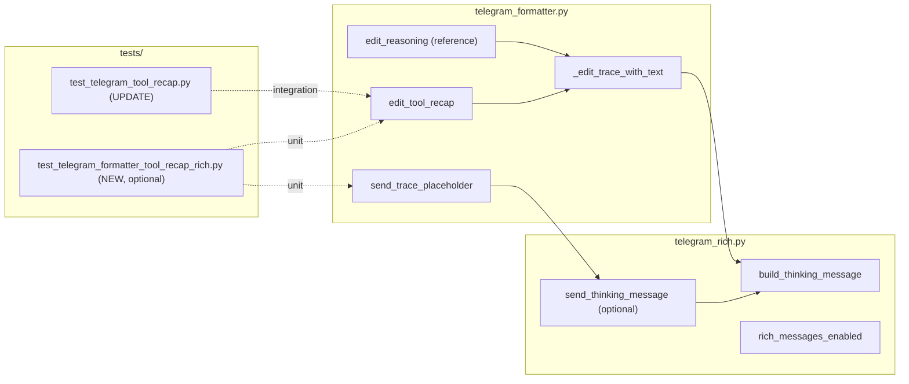

## Summary

Three-slice F-lite delivery. SL1 routes `edit_tool_recap` through the existing
`_edit_trace_with_text` + `build_thinking_message` path (mirror `edit_reasoning`).
SL2 wraps `send_trace_placeholder` initial send in `<tg-thinking>`. SL3 updates
unit + integration tests (extend `test_telegram_tool_recap.py`, add formatter-level
rich-mode tests patterned on `test_telegram_reasoning.py`). Touch: 2 production
files + 1–2 test files; no outbound/emitter changes.

## Architecture

### Data Flow

```mermaid
flowchart TD
  subgraph "outbound (UNCHANGED)"
    EM["OutboundEmitter._on_toolcall_v2"]
    FRL["format_recap_lines"]
  end

  subgraph "telegram_formatter.py (MODIFY)"
    ETR["edit_tool_recap"]
    STP["send_trace_placeholder"]
    ETT["_edit_trace_with_text"]
  end

  subgraph "telegram_rich.py (MODIFY optional)"
    BTM["build_thinking_message"]
    STR["send_thinking_message (NEW helper, if needed)"]
  end

  EM --> FRL
  FRL -->|lines[]| ETR
  ETR -->|rich mode| ETT
  ETT --> BTM
  BTM -->|InputRichMessage.html| API["bot.edit_message_text"]
  STP -->|rich mode| STR
  STR --> BTM
  BTM -->|initial send| API2["bot.send_rich_message"]
  ETR -->|fallback| FB["edit_text_with_fallback"]
  STP -->|fallback| FB2["send_markdownv2_text"]
```

### File × Function Map



## Bootstrap Context

- Source spec: `artifacts/specs/1952-telegram-tool-recap-tg-thinking-spec.mdx`
  (8 SCs, 0 χ, 3 slices).
- Reference pattern: `edit_reasoning` + `_edit_trace_with_text` in
  `telegram_formatter.py` (#1951).
- Reference tests: `tests/adapters/test_telegram_reasoning.py`
  `test_reasoning_rich_mode_no_truncation_no_literal_asterisks`.
- Existing recap tests: `tests/adapters/test_telegram_tool_recap.py` assert
  `rich_message.markdown` — must migrate to `rich_message.html` + `<tg-thinking>`
  after SL1 (SC1/SC6).
- `build_thinking_message` already HTML-escapes content (#1950 backtick audit
  satisfied upstream in `_tool_recap._sanitize` + escape layer).

## Agents

| Agent instance | Role | Slice | Files |
|----------------|------|-------|-------|
| backend-dev-A | Production | SL1, SL2 | `telegram_formatter.py`, `telegram_rich.py` |
| tester-A | Tests | SL3 | `test_telegram_tool_recap.py`, optional new unit test file |

## Wave Structure

2 waves, max 2 parallel agents. Elapsed ~1 session vs ~2 sequential.

| Wave | Trigger | Agents | Tasks |
|------|---------|--------|-------|
| 1 | start | 1 | backend-dev-A: T1→T2 |
| 2 | Wave 1 done | 1 | tester-A: T3→T4→T5 |

### Budget — per task

| Task | Items | Class | Est. ops | Split? |
|------|-------|-------|----------|--------|
| T1 — edit_tool_recap via _edit_trace_with_text | 1 | bounded | 4 | — |
| T2 — send_trace_placeholder thinking wrap | 1 | bounded | 5 | — |
| T3 — unit tests formatter rich mode | 3 | judgmental | 12 | — |
| T4 — update integration tests markdown→html | 2 | judgmental | 10 | — |
| T5 — full pytest gate | 1 | trivial | 2 | — |

**Total estimated ops: 33**

### Budget — per agent instance

| Instance | Tasks | Σ ops | Subjects | Split? |
|----------|-------|-------|----------|--------|
| backend-dev-A | T1, T2 | 9 | telegram-formatter | — |
| tester-A | T3, T4, T5 | 24 | telegram-tests | — |

## Consistency Report

- Criteria covered: 8/8 (SC1–SC8)
- Uncovered criteria: none
- Tasks without spec backing: none
- Gold plating exemptions: SC8 enforced by omission (no Phase 2 formatting)

## Micro-Tasks

### Slice SL1: Rich edit_tool_recap path

#### Task T1: Route edit_tool_recap through _edit_trace_with_text → backend-dev-A
- **File:** `src/factory/adapters/telegram/telegram_formatter.py`
- **Snippet:**
  ```python
  async def edit_tool_recap(self, trace_obj, lines, done):
      del done
      if not lines:
          return
      text = "\n".join(lines)
      await self._edit_trace_with_text(trace_obj, text)
  ```
- **Verify:** `uv run pytest tests/adapters/test_telegram_reasoning.py -q` (ready)
- **Expected:** no regressions in reasoning path
- **Time:** 3 min
- **Difficulty:** 2
- **Traces:** SC1, SC2, SC6
- **Phase:** GREEN

### Slice SL2: Rich send_trace_placeholder

#### Task T2: Send initial trace in build_thinking_message wrapper → backend-dev-A
- **File:** `src/factory/adapters/telegram/telegram_formatter.py` (+ optional `telegram_rich.py` helper)
- **Snippet:**
  ```python
  # rich branch in send_trace_placeholder:
  sent = await bot.send_rich_message(
      chat_id=..., rich_message=build_thinking_message("🔧 …"), ...
  )
  ```
- **Verify:** `uv run python -c "from factory.adapters.telegram.telegram_formatter import TelegramFormatter"` (ready)
- **Expected:** import OK
- **Time:** 5 min
- **Difficulty:** 3
- **Traces:** SC3
- **Phase:** GREEN

#### RED-GATE: SL1+SL2 production complete → tester-A
- **Verify:** T1 + T2 marked complete
- **Phase:** RED-GATE

### Slice SL3: Tests

#### Task T3: Add formatter-level rich recap unit tests [P] → tester-A
- **File:** `tests/adapters/test_telegram_formatter_tool_recap_rich.py` (new) OR extend `test_telegram_reasoning.py` pattern
- **Snippet:**
  ```python
  async def test_tool_recap_rich_mode_uses_tg_thinking():
      # edit_tool_recap → rich_message.html contains <tg-thinking> + recap lines
      # assert "*" not in html
  ```
- **Verify:** `uv run pytest tests/adapters/test_telegram_formatter_tool_recap_rich.py -q` (deferred until file exists)
- **Expected:** pass
- **Time:** 8 min
- **Difficulty:** 3
- **Traces:** SC1, SC2, SC5
- **Phase:** GREEN

#### Task T4: Update integration tests markdown→html assertions → tester-A
- **File:** `tests/adapters/test_telegram_tool_recap.py`
- **Snippet:**
  ```python
  def _rich_html(call) -> str:
      rich = call.kwargs.get("rich_message")
      return (rich.html or "") if rich else ""
  ```
- **Verify:** `uv run pytest tests/adapters/test_telegram_tool_recap.py -q` (deferred)
- **Expected:** pass with html assertions
- **Time:** 10 min
- **Difficulty:** 3
- **Traces:** SC1, SC4, SC6, SC7
- **Phase:** GREEN

#### Task T5: Fallback-mode regression + full suite → tester-A
- **File:** `tests/adapters/test_telegram_tool_recap.py`
- **Snippet:** `monkeypatch.setenv("FACTORY_TELEGRAM_RICH_MESSAGES", "0")` → assert MarkdownV2 path unchanged
- **Verify:** `uv run pytest tests/adapters/ -q --tb=short` (ready)
- **Expected:** all green
- **Time:** 5 min
- **Difficulty:** 2
- **Traces:** SC4, SC7
- **Phase:** GREEN

## Task Seeding Blueprint

### Wave 1 — production, 1 agent

| Task | Agent instance | blockedBy | Subject |
|------|---------------|-----------|---------|
| T1 | backend-dev-A | — | telegram-formatter |
| T2 | backend-dev-A | T1 | telegram-formatter |

### Wave 2 — tests after production

| Task | Agent instance | blockedBy | Subject |
|------|---------------|-----------|---------|
| T3 | tester-A | T2 | telegram-tests |
| T4 | tester-A | T3 | telegram-tests |
| T5 | tester-A | T4 | telegram-tests |

## Task IDs

<!-- Generated by /plan. Used by /implement to resume tasks on session restart. -->
- T1: impl-t1 — telegram-formatter
- T2: impl-t2 — telegram-formatter
- T3: impl-t3 — telegram-tests
- T4: impl-t4 — telegram-tests
- T5: impl-t5 — telegram-tests