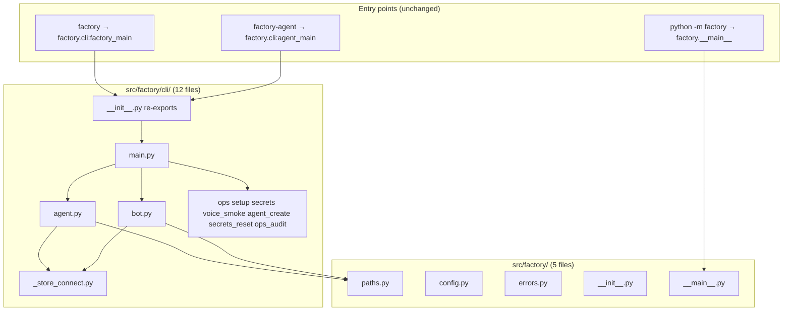
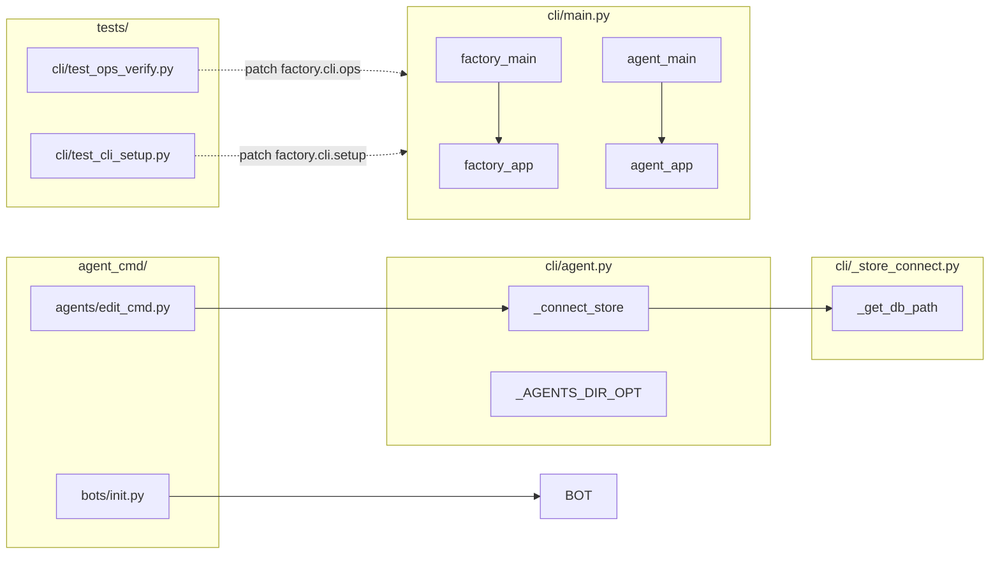

## Summary

Mechanical refactor: atomically replace `src/factory/cli.py` with `factory/cli/` package, move 9 CLI modules, extract `_store_connect.py`, update `agent_cmd/` + test imports/patch strings, remove folder exemption. No functional changes.

## Architecture

### Data Flow

### File × Function Map

## Bootstrap Context

None — pure refactor following #1595 subpackage pattern (`factory/blobstore/cli.py` precedent).

## Agents

| Agent | Task count | Files |
|-------|------------|-------|
| backend-dev-A | 3 | `src/factory/cli/*` |
| backend-dev-B | 3 | `src/factory/agent_cmd/**`, `tests/**` |
| tester-A | 4 | `tests/**`, verify commands |
| devops-A | 2 | `tools/folder_exemptions.txt`, gates |

## Wave Structure

3 waves, max 2 parallel agents. Elapsed ~1 session vs ~2 sequential.

| Wave | Trigger | Agents | Tasks |
|------|---------|--------|-------|
| 1 | start | backend-dev-A | T1→T2→T3→T4 |
| 2 | Wave 1 done | backend-dev-B ∥ | T5, T6, T7 → T8 |
| 3 | Wave 2 done | devops-A + tester-A | T9→T10→T11→T12 |

### Budget — per task

| Task | Items | Class | Est. ops | Split? |
|------|-------|-------|----------|--------|
| T1 | 2 files | bounded | 3 | — |
| T2 | 1 file + imports | bounded | 4 | — |
| T3 | 9 files | bounded | 5 | — |
| T4 | 1 verify | trivial | 1 | — |
| T5 | 7 agent_cmd files | bounded | 4 | — |
| T6 | 6 test import files | bounded | 4 | — |
| T7 | 4 patch-string files | bounded | 3 | — |
| T8 | pytest subset | bounded | 4 | — |
| T9 | 1 file | trivial | 1 | — |
| T10 | 1 script | trivial | 1 | — |
| T11 | full pytest | bounded | 5 | — |
| T12 | grep + console | bounded | 3 | — |

**Total estimated ops: 38**

### Budget — per agent instance

| Instance | Tasks | Σ ops | Subjects | Split? |
|----------|-------|-------|----------|--------|
| backend-dev-A | T1, T2, T3, T4 | 13 | cli, imports | — |
| backend-dev-B | T5, T6, T7, T8 | 15 | agent_cmd, tests | — |
| devops-A | T9, T10 | 2 | config, gates | — |
| tester-A | T11, T12 | 8 | pytest, verify | — |

## Consistency Report

| Spec Criterion | Covered by | Status |
|----------------|------------|--------|
| SC-1: `cli.py` gone, package resolves | T2, T4 | ✓ |
| SC-2: root exactly 5 files | T3, T10 | ✓ |
| SC-3: cli/ exactly 12 files | T1, T3, T10 | ✓ |
| SC-4: re-exports succeed | T1, T4, T12 | ✓ |
| SC-5: exemption removed | T9 | ✓ |
| SC-6: folder-size passes | T10, T12 | ✓ |
| SC-7: `factory --help` | T12 | ✓ |
| SC-8: `factory-agent --help` | T12 | ✓ |
| SC-9: `factory.__main__` unchanged | T2 (no move) | ✓ |
| SC-10: full pytest | T11 | ✓ |
| SC-11: stale-path grep clean | T6, T7, T12 | ✓ |
| SC-12: `_get_db_path` single module | T1 | ✓ |

**Untraced:** None
**Exemptions:** None

## Micro-Tasks

### Slice V1: Scaffold + move + dedup

#### T1: Create `_store_connect.py` + `__init__.py` → backend-dev-A
- **File:** `src/factory/cli/_store_connect.py`, `src/factory/cli/__init__.py`
- **Snippet:** `_get_db_path()` + re-export `factory_main`, `agent_main`, `factory_app`, `agent_app`, `main`
- **Verify:** `test -f src/factory/cli/_store_connect.py && test -f src/factory/cli/__init__.py`
- **Expected:** both files exist
- **Time:** 3 min | **Difficulty:** 2 | **Traces:** SC-12, SC-4 | **Phase:** GREEN

#### T2: Atomically replace `cli.py` → `cli/main.py` → backend-dev-A
- **File:** delete `src/factory/cli.py`, create `src/factory/cli/main.py`
- **Snippet:** former `cli.py` content; imports `factory.cli.agent`, `factory.cli.bot`, etc.
- **Verify:** `test ! -f src/factory/cli.py && test -f src/factory/cli/main.py`
- **Expected:** module file gone, package main exists
- **Time:** 5 min | **Difficulty:** 3 | **Traces:** SC-1 | **Phase:** GREEN

#### T3: Move 9 modules to `factory/cli/` [P] → backend-dev-A
- **File:** `cli_agent.py`→`agent.py`, `cli_bot.py`→`bot.py`, `cli_agent_create.py`→`agent_create.py`, `cli_ops.py`→`ops.py`, `cli_setup.py`→`setup.py`, `cli_voice_smoke.py`→`voice_smoke.py`, `cli_secrets.py`→`secrets.py`, `secrets_reset.py`, `ops_audit.py`
- **Snippet:** wire `agent.py`/`bot.py` to import `_get_db_path` from `_store_connect`; fix `secrets.py`→`secrets_reset`, `ops.py`→`ops_audit`
- **Verify:** `ls src/factory/cli/*.py | wc -l` == 12
- **Expected:** 12 python files in cli/
- **Time:** 8 min | **Difficulty:** 3 | **Traces:** SC-2, SC-3 | **Phase:** GREEN

#### RED-GATE: Slice V1 import smoke → tester-A
- **Verify:** `uv run python -c "from factory.cli import factory_main, agent_main, factory_app, agent_app"`
- **Expected:** exit 0
- **Phase:** RED-GATE | **Traces:** SC-4

### Slice V2: Wire consumers

#### T5: Update `agent_cmd/**` paths → backend-dev-B
- **File:** `src/factory/agent_cmd/agents/{edit_cmd,init,list_cmd}.py`, `platforms/{_commands,platform}.py`, `bots/init.py`
- **Snippet:** `from factory.cli.agent import …` / `from factory.cli.bot import …` (symbols unchanged)
- **Verify:** `rg 'factory\.cli_agent|factory\.cli_bot' src/factory/agent_cmd/` returns empty
- **Expected:** no old paths
- **Time:** 4 min | **Difficulty:** 2 | **Traces:** SC-11 | **Phase:** GREEN

#### T6: Update test imports [P] → backend-dev-B
- **File:** `tests/cli/*`, `tests/test_cli_wizard_create.py`, `tests/core/test_agent_refiner_cli.py`, `tests/nats/test_ops_verify_matrix_drift.py`
- **Verify:** `rg 'from factory\.cli_|import factory\.cli_' tests/ --glob '!*.pyc'`
- **Expected:** only `factory.cli` package imports remain
- **Time:** 4 min | **Difficulty:** 2 | **Traces:** SC-11 | **Phase:** GREEN

#### T7: Update mock patch strings [P] → backend-dev-B
- **File:** `tests/cli/test_ops_verify.py`, `test_cli_setup.py`, `test_voice_smoke.py`, `test_cli_secrets_reset.py`
- **Snippet:** `factory.cli_ops` → `factory.cli.ops`, etc.
- **Verify:** `rg 'factory\.cli_ops|factory\.cli_setup|factory\.cli_voice_smoke|factory\.secrets_reset' tests/`
- **Expected:** empty
- **Time:** 3 min | **Difficulty:** 2 | **Traces:** SC-11 | **Phase:** GREEN

#### RED-GATE: Slice V2 targeted pytest → tester-A
- **Verify:** `uv run pytest tests/cli/ tests/test_cli_wizard_create.py tests/core/test_agent_refiner_cli.py tests/nats/test_ops_verify_matrix_drift.py -q`
- **Expected:** exit 0
- **Phase:** RED-GATE | **Traces:** SC-10

### Slice V3: Gate

#### T9: Remove folder exemption → devops-A
- **File:** `tools/folder_exemptions.txt`
- **Verify:** `grep -c '^src/factory' tools/folder_exemptions.txt` == 0
- **Expected:** no src/factory entry
- **Time:** 1 min | **Difficulty:** 1 | **Traces:** SC-5 | **Phase:** GREEN

#### T10: RED-GATE folder-size → devops-A
- **Verify:** `tools/check_folder_size.sh`
- **Expected:** exit 0
- **Phase:** RED-GATE | **Traces:** SC-6

#### T11: Full pytest → tester-A
- **Verify:** `uv run pytest -q`
- **Expected:** exit 0
- **Time:** 5 min | **Difficulty:** 2 | **Traces:** SC-10 | **Phase:** GREEN

#### T12: Final RED-GATE console + grep → tester-A
- **Verify:** `uv run factory --help && uv run factory-agent --help && rg 'factory\.cli[_\.]|factory\.secrets_reset|factory\.ops_audit' src/ tests/`
- **Expected:** help OK, grep empty
- **Phase:** RED-GATE | **Traces:** SC-7, SC-8, SC-11

## Task Seeding Blueprint

### Wave 1 — backend-dev-A sequential

| Task | Agent instance | blockedBy | Subject |
|------|---------------|-----------|---------|
| T1 | backend-dev-A | — | cli |
| T2 | backend-dev-A | T1 | cli |
| T3 | backend-dev-A | T2 | cli |
| T4 | tester-A | T3 | verify |

### Wave 2 — backend-dev-B parallel then gate

| Task | Agent instance | blockedBy | Subject |
|------|---------------|-----------|---------|
| T5 | backend-dev-B | T4 | agent_cmd |
| T6 | backend-dev-B | T4 | tests |
| T7 | backend-dev-B | T4 | tests |
| T8 | tester-A | T5, T6, T7 | pytest |

### Wave 3 — gate

| Task | Agent instance | blockedBy | Subject |
|------|---------------|-----------|---------|
| T9 | devops-A | T8 | config |
| T10 | devops-A | T9 | gates |
| T11 | tester-A | T10 | pytest |
| T12 | tester-A | T11 | verify |

## Task IDs

<!-- Generated by /plan. Used by /implement to resume tasks on session restart. -->
- T1: plan-1959-t1 — cli
- T2: plan-1959-t2 — cli
- T3: plan-1959-t3 — cli
- T4: plan-1959-t4 — verify
- T5: plan-1959-t5 — agent_cmd
- T6: plan-1959-t6 — tests
- T7: plan-1959-t7 — tests
- T8: plan-1959-t8 — pytest
- T9: plan-1959-t9 — config
- T10: plan-1959-t10 — gates
- T11: plan-1959-t11 — pytest
- T12: plan-1959-t12 — verify