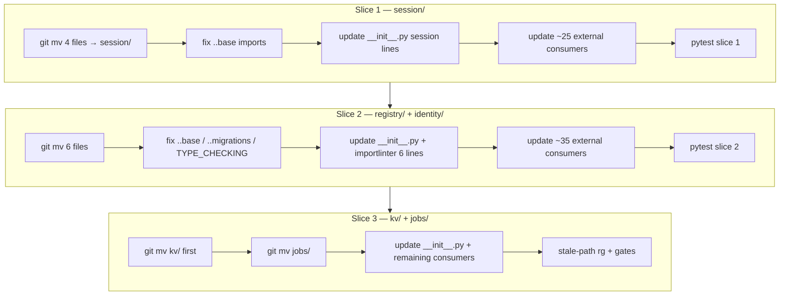
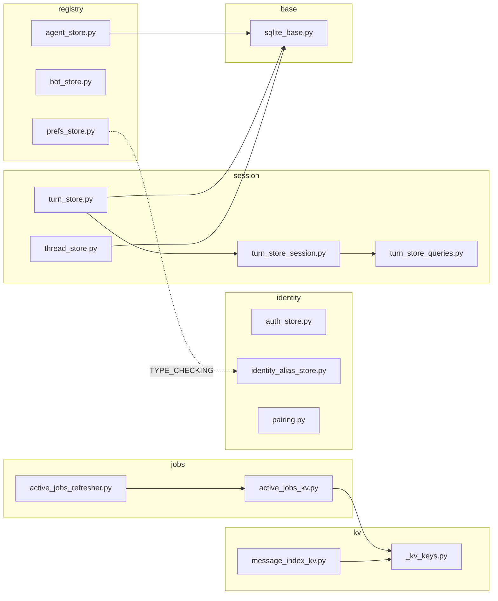

## Summary

Mechanical 3-slice refactor: move 14 root-level store modules into five domain subpackages (`session/`, `registry/`, `identity/`, `jobs/`, `kv/`). Each slice is independently mergeable — moves, internal imports, root `__init__.py`, external consumers, and `.importlinter` lines for modules moved in that slice. No functional changes.

## Architecture

### Data Flow

### File × Function Map

## Bootstrap Context

None — pure refactor following #1595 precedent. `base/` and `migrations/` already exist.

## Agents

| Agent | Task count | Files |
|-------|------------|-------|
| backend-dev-A | 10 | `stores/session/*`, slice-1 consumers |
| backend-dev-B | 10 | `stores/registry/*`, `stores/identity/*`, slice-2 consumers |
| backend-dev-C | 6 | `stores/kv/*`, `stores/jobs/*`, slice-3 consumers, `.importlinter` |
| tester-A | 3 | RED-GATE pytest per slice |

## Wave Structure

3 waves (1 per slice), max 2 parallel agents. Elapsed ~1 session vs ~2 sequential.

| Wave | Trigger | Agents | Tasks |
|------|---------|--------|-------|
| 1 | start | 2 ∥ | backend-dev-A: T1→T2→T3→T4 — tester-A: T5 (after T4) |
| 2 | Wave 1 done | 2 ∥ | backend-dev-B: T6→T7→T8→T9 — tester-A: T10 (after T9) |
| 3 | Wave 2 done | 2 ∥ | backend-dev-C: T11→T12→T13→T14→T15 — tester-A: T16 (after T15) |

### Budget — per task

| Task | Items | Class | Est. ops | Split? |
|------|-------|-------|----------|--------|
| T1 | 4 files + `__init__.py` | bounded | 4 | — |
| T2 | internal imports | bounded | 3 | — |
| T3 | root `__init__.py` | bounded | 2 | — |
| T4 | ~25 consumer files | bounded | 6 | — |
| T5 | pytest | bounded | 4 | — |
| T6 | 6 files + 2 `__init__.py` | bounded | 5 | — |
| T7 | relative + TYPE_CHECKING imports | judgmental | 5 | — |
| T8 | `__init__.py` + `.importlinter` 9 lines | bounded | 4 | — |
| T9 | ~35 consumer files | bounded | 6 | — |
| T10 | pytest | bounded | 4 | — |
| T11 | kv/ move (2 files) | bounded | 3 | — |
| T12 | jobs/ move (2 files) | bounded | 3 | — |
| T13 | remaining consumers + `tools/render_quadlet.py` | bounded | 4 | — |
| T14 | stale-path rg | trivial | 1 | — |
| T15 | lint-imports + check_folder_size | bounded | 3 | — |
| T16 | full pytest | bounded | 4 | — |

**Total estimated ops: 55**

### Budget — per agent instance

| Instance | Tasks | Σ ops | Subjects | Split? |
|----------|-------|-------|----------|--------|
| backend-dev-A | T1–T4 | 15 | session, imports | — |
| backend-dev-B | T6–T9 | 20 | registry, identity | — |
| backend-dev-C | T11–T15 | 15 | kv, jobs, gates | — |
| tester-A | T5, T10, T16 | 12 | pytest | — |

## Micro-Tasks

### Slice 1 — Session subpackage (V1)

| # | Task | Description | Files | Verify | Phase | [P] | Agent | Subject | Spec trace |
|---|------|-------------|-------|--------|-------|-----|-------|---------|------------|
| T1 | Move session files | `git mv` 4 modules + create `session/__init__.py` | `turn_store.py`, `turn_store_queries.py`, `turn_store_session.py`, `thread_store.py` → `session/` | `ls src/factory/infrastructure/stores/session/*.py \| wc -l` == 5 | GREEN | N | backend-dev-A | session | SC-1 |
| T2 | Fix session internal imports | `base.sqlite_base` → `..base.sqlite_base`; fix `turn_store` ↔ `turn_store_session` ↔ `turn_store_queries` sibling imports | `session/*.py` | `grep -r "from factory.infrastructure.stores.base" session/` empty; `grep -r "from factory.infrastructure.stores.turn_store" session/` empty | GREEN | N | backend-dev-A | session | Breadboard session rows |
| T3 | Update root `__init__.py` session lines | Point TurnStore, ThreadStore imports to `session.*` | `stores/__init__.py` | `python -c "from factory.infrastructure.stores import TurnStore, ThreadStore"` | GREEN | N | backend-dev-A | imports | SC-4 |
| T4 | Update session consumers | Direct imports + string mocks in bootstrap, turn_writer, resume_publisher, tests | `bootstrap_stores.py`, `bootstrap_wiring.py`, `turn_writer/*`, `resume_publisher_adapter.py`, `worker_standalone.py`, `hub_standalone*.py`, `tests/core/test_turn_store.py`, `tests/test_bootstrap_credential_resolution.py`, `tests/bootstrap/test_tool_display_wiring.py`, + grep hits | `rg 'factory\.infrastructure\.stores\.(turn_store\|thread_store\|turn_store_queries\|turn_store_session)' src/ tests/ tools/` returns 0 | GREEN | N | backend-dev-A | imports | SC-5 |
| T5 | RED-GATE slice 1 | `uv run pytest` | all | exit 0 | RED-GATE | N | tester-A | pytest | SC-8 |

### Slice 2 — Registry + identity (V2)

| # | Task | Description | Files | Verify | Phase | [P] | Agent | Subject | Spec trace |
|---|------|-------------|-------|--------|-------|-----|-------|---------|------------|
| T6 | Move registry + identity files | `git mv` 6 modules + create `registry/__init__.py`, `identity/__init__.py` | `agent_store.py`, `bot_store.py`, `prefs_store.py`, `auth_store.py`, `identity_alias_store.py`, `pairing.py` | `ls stores/registry/*.py \| wc -l` == 4; `ls stores/identity/*.py \| wc -l` == 4 | GREEN | N | backend-dev-B | registry | SC-1 |
| T7 | Fix registry/identity internal imports | `.base.*` → `..base.*`; `.migrations.*` → `..migrations.*`; TYPE_CHECKING `identity_alias_store` → `..identity.identity_alias_store`; `pairing` TYPE_CHECKING `auth_store` → `.auth_store` | `registry/*.py`, `identity/*.py` | `grep -r "from \.base" registry/` empty | GREEN | N | backend-dev-B | registry | Breadboard registry/identity rows |
| T8 | Update `__init__.py` + `.importlinter` | Root re-exports for registry/identity symbols; rewrite 9 ignore lines (5 module targets) | `stores/__init__.py`, `.importlinter` | `uv run lint-imports` exit 0 (may need T9 for full pass) | GREEN | N | backend-dev-B | importlinter | SC-7 |
| T9 | Update registry/identity consumers | bootstrap, CLI, hub, agents, core protocols docstrings, tests, `tools/render_quadlet.py` | ~35 files from grep | `rg 'factory\.infrastructure\.stores\.(agent_store\|bot_store\|auth_store\|identity_alias_store\|pairing\|prefs_store)' src/ tests/ tools/ .importlinter` returns 0 | GREEN | N | backend-dev-B | imports | SC-5 |
| T10 | RED-GATE slice 2 | `uv run pytest` | all | exit 0 | RED-GATE | N | tester-A | pytest | SC-8 |

### Slice 3 — Jobs + kv + final gate (V3)

| # | Task | Description | Files | Verify | Phase | [P] | Agent | Subject | Spec trace |
|---|------|-------------|-------|--------|-------|-----|-------|---------|------------|
| T11 | Move kv/ first | `git mv` `_kv_keys.py`, `message_index_kv.py` + `kv/__init__.py` | `stores/kv/` | `ls stores/kv/*.py \| wc -l` == 3 | GREEN | N | backend-dev-C | kv | SC-1 |
| T12 | Move jobs/ | `git mv` `active_jobs_kv.py`, `active_jobs_refresher.py` + `jobs/__init__.py`; fix `..kv._kv_keys` import | `stores/jobs/` | `ls stores/jobs/*.py \| wc -l` == 3 | GREEN | N | backend-dev-C | jobs | SC-1 |
| T13 | Update remaining consumers | `bootstrap_stores.py` message_index_kv, `hub_standalone.py`, `core/ports/active_jobs.py`, test helpers, infra store tests | grep hits for active_jobs/message_index_kv | `rg 'factory\.infrastructure\.stores\.(active_jobs_kv\|active_jobs_refresher\|message_index_kv\|_kv_keys)' src/ tests/ tools/` returns 0 | GREEN | N | backend-dev-C | imports | SC-5 |
| T14 | Final root `__init__.py` | Point jobs/kv imports; verify full `__all__` (15 symbols) | `stores/__init__.py` | `python -c "from factory.infrastructure.stores import AgentStore, TurnStore, MessageIndexKvStore, get_pairing_manager"` | GREEN | N | backend-dev-C | imports | SC-4 |
| T15 | Quality gates | `tools/check_folder_size.sh` + `uv run lint-imports` + full stale-path rg | all | all exit 0 | GREEN | N | backend-dev-C | gates | SC-6, SC-7 |
| T16 | RED-GATE final | `uv run pytest` | all | exit 0 | RED-GATE | N | tester-A | pytest | SC-8 |

## Consistency Report

| Spec Criterion | Covered by | Status |
|----------------|------------|--------|
| SC-1: root = 1 `__init__.py` | T1, T6, T11, T12 | ✓ |
| SC-2: subpackage counts | T1, T6, T11, T12 | ✓ |
| SC-3: base/migrations unchanged | (no tasks — constraint) | ✓ |
| SC-4: full `__all__` re-exports | T3, T8, T14 | ✓ |
| SC-5: stale-path grep = 0 | T4, T9, T13, T15 | ✓ |
| SC-6: check_folder_size | T15 | ✓ |
| SC-7: lint-imports | T8, T15 | ✓ |
| SC-8: pytest green | T5, T10, T16 | ✓ |
| SC-9: structural outcome (add under subpackage) | T1–T12 layout | ✓ |

**Uncovered:** None
**Untraced:** None
**Exemptions:** None

## Task Seeding Blueprint

### Wave 1 — Slice 1 (session), 2 agents

| Task | Agent instance | blockedBy | Subject |
|------|---------------|-----------|---------|
| T1 | backend-dev-A | — | session |
| T2 | backend-dev-A | T1 | session |
| T3 | backend-dev-A | T2 | imports |
| T4 | backend-dev-A | T3 | imports |
| T5 | tester-A | T4 | pytest |

### Wave 2 — Slice 2 (registry + identity), 2 agents

| Task | Agent instance | blockedBy | Subject |
|------|---------------|-----------|---------|
| T6 | backend-dev-B | T5 | registry |
| T7 | backend-dev-B | T6 | registry |
| T8 | backend-dev-B | T7 | importlinter |
| T9 | backend-dev-B | T8 | imports |
| T10 | tester-A | T9 | pytest |

### Wave 3 — Slice 3 (kv + jobs + gates), 2 agents

| Task | Agent instance | blockedBy | Subject |
|------|---------------|-----------|---------|
| T11 | backend-dev-C | T10 | kv |
| T12 | backend-dev-C | T11 | jobs |
| T13 | backend-dev-C | T12 | imports |
| T14 | backend-dev-C | T13 | imports |
| T15 | backend-dev-C | T14 | gates |
| T16 | tester-A | T15 | pytest |

## Task IDs

<!-- Generated by /plan. Used by /implement to resume tasks on session restart. -->
- T1: t1 — session
- T2: t2 — session
- T3: t3 — imports
- T4: t4 — imports
- T5: t5 — pytest
- T6: t6 — registry
- T7: t7 — registry
- T8: t8 — importlinter
- T9: t9 — imports
- T10: t10 — pytest
- T11: t11 — kv
- T12: t12 — jobs
- T13: t13 — imports
- T14: t14 — imports
- T15: t15 — gates
- T16: t16 — pytest