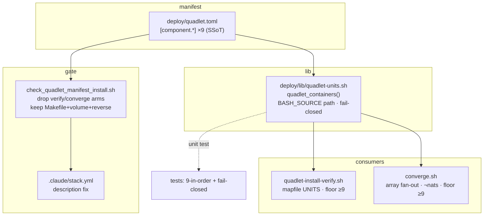
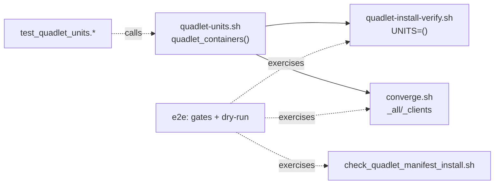

## Summary

Introduce a grep-based helper `deploy/lib/quadlet-units.sh::quadlet_containers()` that derives the container list from `deploy/quadlet.toml` at run time; rewire `quadlet-install-verify.sh` and `converge.sh` to consume it (fail-closed, pipefail-safe); slim the two forward arms out of `check_quadlet_manifest_install.sh`. Option B (runtime derivation) per the approved spec.

## Architecture

## Agents

| Agent instance | Tasks | Files |
|---|---|---|
| devops-A | T1, T3, T4 | `deploy/lib/quadlet-units.sh`, `deploy/quadlet-install-verify.sh`, `deploy/converge.sh` |
| devops-B | T5, T6 | `tools/check_quadlet_manifest_install.sh`, `.claude/stack.yml` |
| tester-A | T2, T7 | `tests/…/test_quadlet_units` (new), e2e gate run |

## Wave Structure

4 waves, max 3 parallel agents. Elapsed ~1 short session vs ~sequential same (tiny F-lite; parallelism is marginal — kept for clean instance separation).

| Wave | Trigger | Agents | Tasks |
|------|---------|--------|-------|
| 1 | start | 1 | devops-A: T1 |
| 2 | T1 done | 2 ∥ | devops-A: T3→T4 · tester-A: T2 |
| 3 | T3,T4 done | 1 | devops-B: T5→T6 |
| 4 | T2,T4,T6 done | 1 | tester-A: T7 |

### Budget — per task

| Task | Items | Class | Est. ops | Split? |
|------|-------|-------|----------|--------|
| T1 helper | 1 | judgmental | 5 | — |
| T2 unit test | 1 | bounded | 4 | — |
| T3 verify rewire | 1 | bounded | 4 | — |
| T4 converge rewire | 1 | judgmental | 5 | — |
| T5 gate slim | 1 | judgmental | 6 | — |
| T6 stack.yml | 1 | trivial | 2 | — |
| T7 e2e verify | 1 | judgmental | 8 | — |

**Total estimated ops: ~34**

### Budget — per agent instance

| Instance | Tasks | Σ ops | Subjects | Split? |
|----------|-------|-------|----------|--------|
| devops-A | T1, T3, T4 | 14 | unit-list | — |
| devops-B | T5, T6 | 8 | gate | — |
| tester-A | T2, T7 | 12 | test | — |

All instances ≤3 tasks, 1 subject, Σ ops < 50 — no splits required.

## Consistency Report

Spec success criteria → tasks: 10/10 covered. Mapping: SC1→T1/T2 · SC2→T3 · SC3→T4 · SC4→T7 · SC5(gate fail-cases)→T5/T7 · SC6(stack desc)→T6 · SC7(fail-closed)→T1/T3/T4 · SC8(pipefail-safe)→T4 · SC9(gates pass+converge no-op)→T7 · SC10(net lines drop)→T7. No untraced tasks. No exemptions.

## Micro-Tasks

### Slice S1 — derivation helper

**T1 — create `deploy/lib/quadlet-units.sh`** · devops-A · subject: unit-list · diff 3 · trace SC1/SC7
- Implement `quadlet_containers()` exactly per spec N1 hardened contract: `${BASH_SOURCE[0]}`-relative toml path; `[[ -f ]]` guard; regex `^container[[:space:]]*=[[:space:]]*"[^"]+"`; `cut -d'"' -f2 | sed 's/\.container$//' | tr -d '[:space:]'`; hard-fail `return 1` on empty.
- Verify: `bash -c 'source deploy/lib/quadlet-units.sh; quadlet_containers'` from repo root AND from `/tmp` → both print the 9 names; `cd /tmp && bash -c 'source <abs>/quadlet-units.sh; quadlet_containers'` still works.
- Expected: `factory-nats factory-hub factory-telegram factory-discord factory-clipool factory-gh-helper factory-turn-writer factory-blobstore factory-omp` (declaration order, newline-separated).

**T2 — unit test for the helper** · tester-A · subject: test · diff 2 · trace SC1 · blockedBy T1
- Add a test (bats-style `.sh` under `tests/scripts/` matching repo convention, or pytest invoking bash — match existing `tests/scripts/` pattern) asserting: (a) exactly 9 names; (b) declaration order; (c) `.container` stripped; (d) a temp toml with 0 components → function returns non-zero (fail-closed); (e) missing toml path → non-zero.
- Verify: run the test → green. Expected: pass.

### Slice S2 — rewire consumers

**T3 — rewire `quadlet-install-verify.sh`** · devops-A · subject: unit-list · diff 2 · trace SC2/SC7 · blockedBy T1
- Replace the literal `UNITS=(…)` (lines 17–27) with `source "$(dirname "${BASH_SOURCE[0]}")/lib/quadlet-units.sh"` + `mapfile -t UNITS < <(quadlet_containers)` + floor guard `[[ ${#UNITS[@]} -ge 9 ]] || { echo "ERROR: quadlet_containers returned ${#UNITS[@]} (<9)"; exit 1; }`. Note the file sources `lib/env.sh` already — keep ordering.
- Verify: `bash -n deploy/quadlet-install-verify.sh`; print `${UNITS[@]}` via a dry harness → equals prior 9.

**T4 — rewire `converge.sh` fan-out** · devops-A · subject: unit-list · diff 3 · trace SC3/SC8 · blockedBy T1
- Source the helper. Replace `for svc in factory-hub … factory-omp` with: `mapfile -t _all_svcs < <(quadlet_containers)`; floor `[[ ${#_all_svcs[@]} -ge 9 ]] || { echo ERROR…; exit 1; }`; `mapfile -t _client_svcs < <(printf '%s\n' "${_all_svcs[@]}" | grep -v '^factory-nats$' || true)`; `for svc in "${_client_svcs[@]}"`. Keep the existing `failed=…` error accumulation. factory-nats stays excluded.
- Verify: `bash -n deploy/converge.sh`; assert `_client_svcs` = prior 8 and excludes `factory-nats`; confirm `set -euo pipefail` not tripped when grep matches (it always matches here, but `|| true` guards the degenerate case).

### Slice S3 — slim the gate

**T5 — slim `check_quadlet_manifest_install.sh`** · devops-B · subject: gate · diff 3 · trace SC5 · blockedBy T3,T4
- Delete ONLY the two grep `if` arms: lines 55–58 (verify-array) + 60–65 (converge-fan-out). Keep the `while` loop + `count++`, the Makefile arm (48–53), volume/network/pod arms, reverse orphan-guard, zero-guard. Update the stale header comment (7–24: drop refs to verify UNITS array + converge fan-out) and the footer message (196–200). Patch the line-66 feed regex to the whitespace-tolerant form `^container[[:space:]]*=[[:space:]]*"[^"]+"` for parity with the helper.
- Verify: `bash tools/check_quadlet_manifest_install.sh` passes on the current tree; temporarily add `[component.fake]` with no file → FAILs (Makefile/reverse arm); revert.

**T6 — fix `.claude/stack.yml` description** · devops-B · subject: gate · diff 1 · trace SC6 · blockedBy T5
- Edit the `quadlet_manifest_install` `description:` to drop "+ verify UNITS + converge fan-out"; keep the Makefile-install + reverse-orphan claims.
- Verify: `grep -A1 'quadlet_manifest_install' .claude/stack.yml` no longer mentions verify/converge fan-out.

### Slice S4 — verification (RED-GATE)

**T7 — end-to-end verification** · tester-A · subject: test · diff 3 · trace SC4/SC9/SC10 · blockedBy T2,T3,T4,T5,T6
- Assert derived verify UNITS == old 9 and derived converge `_client_svcs` == old 8. Run ALL pre-push gates (`check_quadlet_manifest_install.sh`, `check_volumes_table.sh`, `check_secrets_drift.sh`, plus `bash -n` on the 3 shell files). Add-a-10th dry test: append a throwaway `[component.zzz]`+file, confirm it appears in both derived lists with zero edits to the scripts, then revert. Confirm net line delta is negative (lists+arms removed > helper added).
- Verify: all gates exit 0; throwaway add reflected; `git diff --stat` shows net negative on deploy/ + tools/.

## Task Seeding Blueprint

<!-- Used by /implement to seed TaskCreate calls. T{n} | agent-instance | blockedBy | subject -->

### Wave 1 — no deps, 1 agent

| Task | Agent instance | blockedBy | Subject |
|------|---------------|-----------|---------|
| T1 | devops-A | — | unit-list |

### Wave 2 — after T1, 2 agents ∥

| Task | Agent instance | blockedBy | Subject |
|------|---------------|-----------|---------|
| T2 | tester-A | T1 | test |
| T3 | devops-A | T1 | unit-list |
| T4 | devops-A | T3 | unit-list |

### Wave 3 — after T3,T4, 1 agent

| Task | Agent instance | blockedBy | Subject |
|------|---------------|-----------|---------|
| T5 | devops-B | T3,T4 | gate |
| T6 | devops-B | T5 | gate |

### Wave 4 — after T2,T4,T6, 1 agent

| Task | Agent instance | blockedBy | Subject |
|------|---------------|-----------|---------|
| T7 | tester-A | T2,T4,T6 | test |

## Task IDs

<!-- Generated by /plan. Used by /implement to resume tasks on session restart. -->
- T1: 10 — unit-list (devops-A)
- T2: 11 — test (tester-A)
- T3: 12 — unit-list (devops-A)
- T4: 13 — unit-list (devops-A)
- T5: 14 — gate (devops-B)
- T6: 15 — gate (devops-B)
- T7: 16 — test (tester-A)
