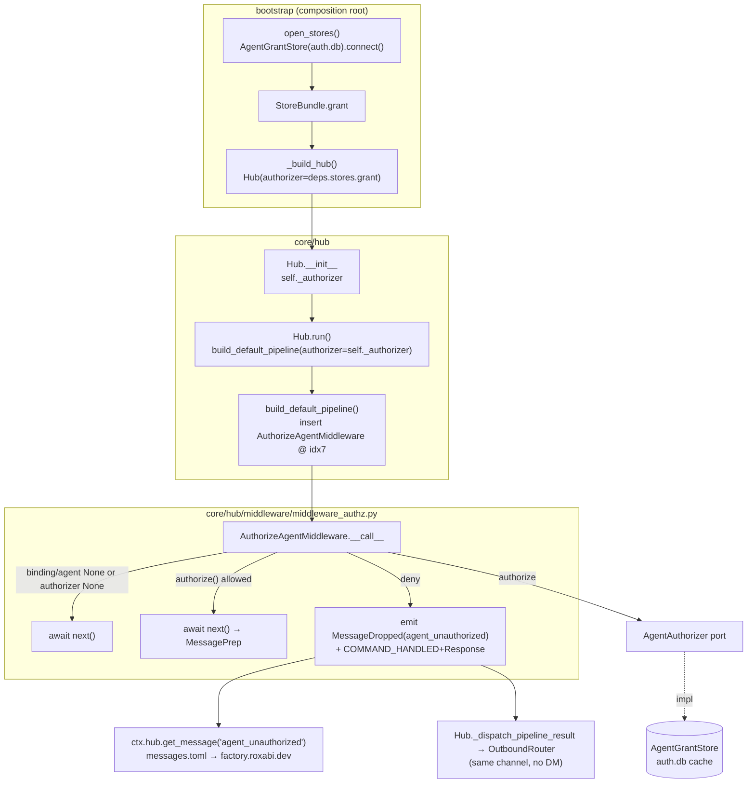
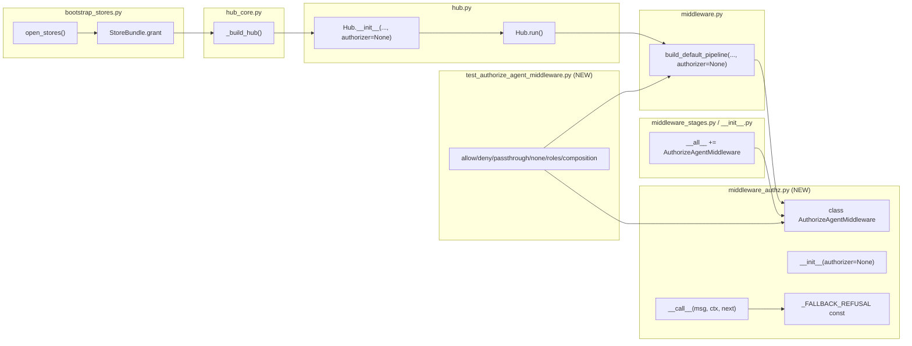

## Summary

Add a standalone hub middleware stage (`middleware_authz.py`) at pipeline index 7
that calls the `AgentAuthorizer` port and refuses unauthorized principals by inline
pull reply + `agent_unauthorized` audit event, then wire the authorizer live through
the bootstrap composition root. One F-lite PR, three review-ordered slices.

## Architecture

### Data flow

### File × Function map

## Reference patterns (inject into agent context)

- **Emit + short-circuit:** `TrustGuardMiddleware` (`middleware_guards.py:78-99`) — `ctx.emit(MessageDropped(...)); return DROP`. Our deny mirrors the emit but returns `COMMAND_HANDLED+Response` instead of `DROP`.
- **COMMAND_HANDLED + Response reply:** `CommandMiddleware._dispatch_command` (`middleware_pool.py:195-204`) — the exact non-command inline-reply shape, incl. `mgr = ctx.hub._msg_manager; mgr.get("generic")` fallback idiom (we use `ctx.hub.get_message("agent_unauthorized")`).
- **Stage skeleton:** `ResolveBindingMiddleware` (`middleware_pool.py:32-77`) — the `async def __call__(self, msg, ctx, next)` shape + `ctx.binding`/`ctx.agent` reads.
- **Store lifecycle:** `AuthStore`/`IdentityAliasStore` open in `open_stores` (`bootstrap_stores.py:287-291`) — copy for `AgentGrantStore` (same `auth.db`).
- **Test fixtures:** `tests/factories/stores.py:74-92` (`agent_grant_store` real-SQLite fixture); `tests/core/conftest.py` `_make_ctx`/`_make_next`; `asyncio_mode='auto'` (no `@pytest.mark.asyncio`).

## Agents

| Agent instance | Tasks | Files | Subject |
|---|---|---|---|
| backend-dev-A | T2, T1, T3 | middleware_authz.py, messages.toml, middleware_stages.py, middleware/__init__.py | authz |
| backend-dev-B | T4, T5 | middleware.py, middleware_pool.py | pipeline |
| backend-dev-C | T6, T7, T8 | bootstrap_stores.py, hub.py, hub_core.py | wiring |
| tester-A | T9 | tests/core/test_authorize_agent_middleware.py | test |
| doc-writer-A | T10, T11 | ADR-090 mdx, CURRENT.generated.md | docs |

## Wave Structure

6 waves, max 5 parallel agents. Elapsed ~1 focused session vs sequential. No two tasks edit the same file → intra-wave parallel-safe.

| Wave | Trigger | Agents | Tasks |
|------|---------|--------|-------|
| 1 | start | 5 ∥ | bd-A: T2 · bd-B: T5 · bd-C: T6 · dw-A: T10 · bd-A: T1 |
| 2 | Wave 1 | 2 ∥ | bd-A: T3 (T2) · bd-B: T4 (T2) |
| 3 | Wave 2 | 2 ∥ | bd-C: T7 (T4) · tester-A: T9 (T2,T4,T1) |
| 4 | Wave 3 | 1 | bd-C: T8 (T6,T7) |
| 5 | Wave 4 | 1 | dw-A: T11 (T2,T3,T4,T6,T7,T8) |
| 6 | Wave 5 | 1 | RED-GATE: validate green |

### Budget — per task

| Task | Items | Class | Est. ops | Split? |
|------|-------|-------|----------|--------|
| T1 messages.toml EN+FR | 1 | bounded | 3 | — |
| T2 stage middleware_authz.py | 1 | judgmental | 6 | — |
| T3 re-exports (2 files) | 2 | trivial | 2 | — |
| T4 pipeline insert + param | 1 | bounded | 3 | — |
| T5 docstring renumber | 1 | trivial | 2 | — |
| T6 StoreBundle + open_stores (4 sites) | 1 | judgmental | 5 | — |
| T7 Hub.__init__ + run() | 1 | bounded | 3 | — |
| T8 hub_core Hub(authorizer=) | 1 | bounded | 3 | — |
| T9 unit tests (7 cases) | 7 | exploratory | 10 | — |
| T10 ADR-090 §5 status note | 1 | bounded | 3 | — |
| T11 snapshot regen + verify | 1 | bounded | 3 | — |

**Total estimated ops: ~43**

### Budget — per agent instance

| Instance | Tasks | Σ ops | Subjects | Split? |
|----------|-------|-------|----------|--------|
| backend-dev-A | T2, T1, T3 | 11 | authz | — |
| backend-dev-B | T4, T5 | 5 | pipeline | — |
| backend-dev-C | T6, T7, T8 | 11 | wiring | — |
| tester-A | T9 | 10 | test | — |
| doc-writer-A | T10, T11 | 6 | docs | — |

## Consistency Report

Covered: 11/11 success criteria. Untraced tasks: 0. Exemptions: none.

| Criterion | Task(s) |
|---|---|
| AC1 import-layers / stage exists | T2 |
| AC2 allow | T2, T9 |
| AC3 deny (emit + COMMAND_HANDLED) | T2, T9 |
| AC4 refusal text (msg-mgr + fallback + bilingual) | T1, T2, T9 |
| AC5 deny-safe pass-through | T2, T9 |
| AC6 fail-open unwired | T2, T9 |
| AC7 args forwarded (roles) | T2, T9 |
| AC8 composition idx7/len11 + re-export | T3, T4, T9 |
| AC9 live wiring | T6, T7, T8 |
| AC10 gates green | T11, RED-GATE |
| AC11 stage renumber | T5 |

## Micro-Tasks

### Slice S1 — stage + refusal text + tests + renumber

**T1 — Add `agent_unauthorized` refusal text** · `src/factory/data/messages.toml` · bd-A · authz · SC4 · RED→GREEN · diff 1
- Add under `[errors.en]`: `agent_unauthorized = "Access not authorized for this agent — visit factory.roxabi.dev"`
- Add under `[errors.fr]`: `agent_unauthorized = "Accès non autorisé pour cet agent — visite factory.roxabi.dev"`
- Verify: `grep -c agent_unauthorized src/factory/data/messages.toml` → `2`

**T2 — Create `AuthorizeAgentMiddleware`** · `src/factory/core/hub/middleware/middleware_authz.py` (CREATE) · bd-A · authz · SC1,2,3,4,5,6,7 · RED→GREEN · diff 3
- `class AuthorizeAgentMiddleware` with `__init__(self, authorizer: AgentAuthorizer | None = None)`.
- `__call__(msg, ctx, next)`:
  - `if ctx.binding is None or ctx.agent is None: return await next(msg, ctx)` (deny-safe).
  - `if self._authorizer is None: return await next(msg, ctx)` (fail-open unwired).
  - `decision = self._authorizer.authorize(agent_name=ctx.binding.agent_name, user_id=msg.user_id, roles=msg.roles)` (sync).
  - `if decision.allowed: return await next(msg, ctx)`.
  - else: `ctx.emit(MessageDropped(msg_id=msg.id, stage=type(self).__name__, reason="agent_unauthorized"))`; `text = ctx.hub.get_message("agent_unauthorized") or _FALLBACK_REFUSAL`; `return PipelineResult(action=Action.COMMAND_HANDLED, response=Response(content=text))`.
- Module const `_FALLBACK_REFUSAL = "Access not authorized for this agent — visit factory.roxabi.dev"`.
- Imports (intra-core only): `from ...auth.agent_grants import AgentAuthorizer` (TYPE_CHECKING ok for annotation), `from ...messaging.message import Response`, `from ..pipeline.pipeline_events import MessageDropped`, `from ..pipeline.pipeline_types import Action, PipelineResult`, `from .middleware import Next, PipelineContext`. **No `factory.infrastructure`/`factory.adapters` import.**
- Verify: `uv run pyright src/factory/core/hub/middleware/middleware_authz.py`

**T3 — Re-export the stage** · `src/factory/core/hub/middleware/middleware_stages.py` + `src/factory/core/hub/middleware/__init__.py` · bd-A · authz · SC8 · GREEN · diff 1 · dep T2
- Add `from .middleware_authz import AuthorizeAgentMiddleware` + add to `__all__` in both.
- Verify: `uv run python -c "from factory.core.hub.middleware import AuthorizeAgentMiddleware"`

**T4 — Insert stage at idx7 + add `authorizer` param** · `src/factory/core/hub/middleware/middleware.py` · bd-B · pipeline · SC8 · GREEN · diff 2 · dep T2
- `build_default_pipeline` signature gains keyword-only `authorizer: AgentAuthorizer | None = None`; add `from ...auth.agent_grants import AgentAuthorizer` under `TYPE_CHECKING`.
- Import `AuthorizeAgentMiddleware` (from `.middleware_authz` or via `.middleware_stages`); insert `AuthorizeAgentMiddleware(authorizer=authorizer)` in the list literal **between** `ResolveBindingMiddleware()` and `MessagePrepMiddleware()`.
- Update the docstring "all 10 stages" → "all 11 stages".
- Verify: `uv run python -c "from factory.core.hub.middleware import build_default_pipeline"` (composition asserted in T9)

**T5 — Renumber stage docstrings** · `src/factory/core/hub/middleware/middleware_pool.py` · bd-B · pipeline · SC11 · REFACTOR · diff 1
- Line 1 file comment `(6–8)` → `(6–9)`.
- `MessagePrepMiddleware` docstring `Stage 7` → `Stage 8`; `CommandMiddleware` docstring `Stage 8` → `Stage 9`. (`ResolveBindingMiddleware` stays `Stage 6`.)
- Verify: `grep -n "Stage 8\|Stage 9\|6–9" src/factory/core/hub/middleware/middleware_pool.py`

**T9 — Unit tests** · `tests/core/test_authorize_agent_middleware.py` (CREATE) · tester-A · test · SC2,3,4,5,6,7,8 · RED→GREEN · diff 3 · dep T2,T4,T1
- Cases: (a) allow → next awaited, no emit; (b) deny → exactly one `MessageDropped(reason="agent_unauthorized")` + `PipelineResult(COMMAND_HANDLED, response.content == refusal)`, next NOT called; (c) `ctx.binding=None` → next, no authorize; (d) `ctx.agent=None` → next; (e) `authorizer=None` → next, no authorize; (f) ROLE grant + `msg.roles=("dc:role:x",)` → allow (args forwarded); (g) composition: `build_default_pipeline(...)` len==11 and `[7]` is `AuthorizeAgentMiddleware`.
- Use real `AgentGrantStore` via `agent_grant_store` fixture (grant a USER principal); `_make_ctx`/`_make_next` patterns; assert `msg_manager is None` fallback path uses `_FALLBACK_REFUSAL`.
- Verify: `uv run pytest tests/core/test_authorize_agent_middleware.py -q`

### Slice S2 — live wiring

**T6 — `StoreBundle.grant` + `open_stores`** · `src/factory/bootstrap/bootstrap_stores.py` · bd-C · wiring · SC9 · GREEN · diff 2
- 4 sites: (1) `StoreBundle` dataclass `grant: AgentGrantStore`; (2) declare `grant_store: AgentGrantStore | None = None` before `try`; (3) inside `try` `grant_store = AgentGrantStore(db_path=vault_dir / "auth.db"); await grant_store.connect()`; (4) add `grant_store` to the `all_stores` close tuple in `finally`; (5) `grant=grant_store` in the `StoreBundle(...)` yield. Add import.
- Verify: `uv run pyright src/factory/bootstrap/bootstrap_stores.py`

**T7 — `Hub.__init__` authorizer + `run()` forward** · `src/factory/core/hub/hub.py` · bd-C · wiring · SC9 · GREEN · diff 2 · dep T4
- `Hub.__init__` gains keyword `authorizer: AgentAuthorizer | None = None`; store `self._authorizer = authorizer` (keep existing `# noqa: PLR0913 — DEBT:wiring-bootstrap-deps`). Add `AgentAuthorizer` to TYPE_CHECKING imports.
- In `run()`, pass `authorizer=self._authorizer` to `build_default_pipeline(...)`.
- Verify: `uv run pyright src/factory/core/hub/hub.py`

**T8 — `_build_hub` passes authorizer** · `src/factory/bootstrap/factory/hub/hub_core.py` · bd-C · wiring · SC9 · GREEN · diff 1 · dep T6,T7
- In the `Hub(...)` constructor call, add `authorizer=deps.stores.grant`.
- Verify: `uv run pyright src/factory/bootstrap/factory/hub/hub_core.py`

### Slice S3 — snapshot + ADR

**T10 — ADR-090 §5 status note** · `docs/architecture/adr/090-agent-scoped-authorization-matrix.mdx` · doc-writer-A · docs · SC10 · REFACTOR · diff 1
- Mark §5 (AuthorizeAgentMiddleware) implemented by #1982 (one-line status note; do not un-backtick unbuilt symbols → keep doc_drift green).
- Verify: `uv run python tools/check_doc_drift.py`

**T11 — Regenerate architecture snapshot** · `docs/architecture/CURRENT.generated.md` · doc-writer-A · docs · SC10 · REFACTOR · diff 1 · dep T2,T3,T4,T6,T7,T8
- Run the architecture-snapshot generator (per `tools/check_architecture_snapshot.sh`) and commit the regenerated artifact.
- Verify: `bash tools/check_architecture_snapshot.sh`

### RED-GATE (slice close)

**RG — Full validate green** · — · all · — · RED-GATE · dep all
- `uv run ruff format . && uv run ruff check . && uv run pyright && uv run pytest -q` + pre-push gates (`import_layers`, `architecture_snapshot`, `file_length`, `folder_size`).

## Task Seeding Blueprint

<!-- Used by /implement to seed TaskCreate calls on session start.
     Format: T{n} | agent-instance | blockedBy | subject
     blockedBy refs T-numbers within this list (not session task IDs). -->

### Wave 1 — no deps, 5 agents ∥

| Task | Agent instance | blockedBy | Subject |
|------|---------------|-----------|---------|
| T1 | backend-dev-A | — | authz |
| T2 | backend-dev-A | — | authz |
| T5 | backend-dev-B | — | pipeline |
| T6 | backend-dev-C | — | wiring |
| T10 | doc-writer-A | — | docs |

### Wave 2 — after Wave 1, 2 agents ∥

| Task | Agent instance | blockedBy | Subject |
|------|---------------|-----------|---------|
| T3 | backend-dev-A | T2 | authz |
| T4 | backend-dev-B | T2 | pipeline |

### Wave 3 — after Wave 2, 2 agents ∥

| Task | Agent instance | blockedBy | Subject |
|------|---------------|-----------|---------|
| T7 | backend-dev-C | T4 | wiring |
| T9 | tester-A | T1, T2, T4 | test |

### Wave 4 — after Wave 3, 1 agent

| Task | Agent instance | blockedBy | Subject |
|------|---------------|-----------|---------|
| T8 | backend-dev-C | T6, T7 | wiring |

### Wave 5 — after Wave 4, 1 agent

| Task | Agent instance | blockedBy | Subject |
|------|---------------|-----------|---------|
| T11 | doc-writer-A | T2, T3, T4, T6, T7, T8 | docs |

### Wave 6 — RED-GATE

| Task | Agent instance | blockedBy | Subject |
|------|---------------|-----------|---------|
| RG | (lead) | T1–T11 | validate |

## Task IDs

<!-- Generated by /plan. Used by /implement to resume tasks on session restart. -->
- T1: 12 — authz (messages.toml)
- T2: 13 — authz (stage)
- T3: 14 — authz (re-export)
- T4: 15 — pipeline (insert idx7)
- T5: 16 — pipeline (docstring renumber)
- T6: 17 — wiring (StoreBundle.grant + open_stores)
- T7: 18 — wiring (Hub.__init__ + run)
- T8: 19 — wiring (hub_core)
- T9: 20 — test (unit tests)
- T10: 21 — docs (ADR-090 §5)
- T11: 22 — docs (snapshot regen)
- RG: 23 — validate (RED-GATE)
