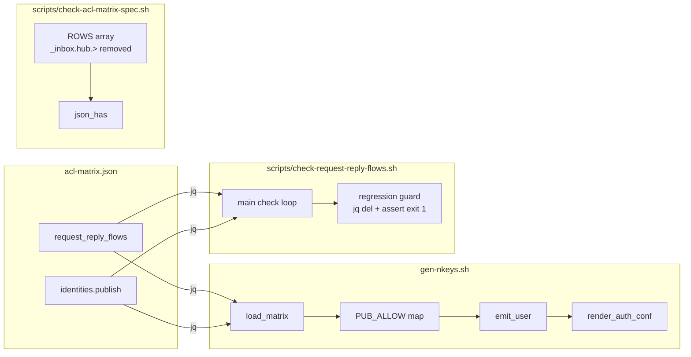

## Summary

Add `request_reply_flows` to `acl-matrix.json` and update `gen-nkeys.sh` `load_matrix()` to derive `_inbox.{requester}.>` publish grants automatically — eliminating 5 hand-written copies. Add `check-request-reply-flows.sh` to own the effective-grant invariant in CI.

```mermaid
flowchart TD
    subgraph acl-matrix.json
        RF[request_reply_flows\n5 flow entries]
        ID[identities\nno hand-written _inbox.hub.>]
    end
    subgraph gen-nkeys.sh
        LM[load_matrix\nread flows after identity loop]
        INJ[inject _inbox.requester.>\ninto PUB_ALLOW]
        RAC[render_auth_conf\nunchanged]
    end
    subgraph scripts
        CRF[check-request-reply-flows.sh\nnew]
        CAS[check-acl-matrix-spec.sh\n_inbox.hub.> row removed]
    end
    subgraph ci.yml
        STEP[Check request-reply flows\nnew step]
    end
    RF -->|jq read| LM
    ID --> LM
    LM --> INJ
    INJ --> RAC
    RAC -->|auth.conf| CONF[/etc/nats/nkeys/auth.conf]
    RF --> CRF
    ID --> CRF
    CRF --> STEP
    CAS --> STEP
```



## Agents

| Agent | Tasks | Files |
|-------|-------|-------|
| devops-A | T1–T7 | `deploy/nats/acl-matrix.json`, `deploy/nats/gen-nkeys.sh`, `scripts/check-request-reply-flows.sh`, `scripts/check-acl-matrix-spec.sh`, `.github/workflows/ci.yml` |

## Consistency Report

- Covered: 6/6
- Uncovered: none
- Untraced: T6 (CI wiring — infra, exempt)
- Exemptions: 1

## Wave Structure

2 waves, 1 agent. Elapsed ~30 min sequential.

| Wave | Trigger | Agents | Tasks |
|------|---------|--------|-------|
| 1 | start | devops-A | T1→T2→T3 (sequential, atomic commit) |
| 2 | Wave 1 done | devops-A | T4∥T5 → T6 → T7 |

## Micro-Tasks

### Slice S1+S2: JSON schema + derivation (atomic)

**Note:** T1 and T2 must be committed in a single atomic commit. T2 can be authored in parallel with T1 but must not be committed until both are ready.

#### Task T1: Update acl-matrix.json — add request_reply_flows, remove hand-written grants → devops-A

- **File:** `deploy/nats/acl-matrix.json`
- **Snippet:**
  ```json
  {
    "version": "1",
    "request_reply_flows": [
      { "requester": "hub", "responder": "clipool-worker", "subject": "lyra.clipool.cmd" },
      { "requester": "hub", "responder": "voice-tts",      "subject": "lyra.voice.tts.request" },
      { "requester": "hub", "responder": "voice-stt",      "subject": "lyra.voice.stt.request" },
      { "requester": "hub", "responder": "image-worker",   "subject": "lyra.image.generate.request" },
      { "requester": "hub", "responder": "llm-worker",     "subject": "lyra.llm.request" }
    ],
    "identities": { ... }
  }
  ```
  Remove `"_inbox.hub.>"` from publish arrays of: `voice-tts`, `voice-stt`, `llm-worker`, `image-worker`, `clipool-worker`.
- **Verify:** `jq '.request_reply_flows | length' deploy/nats/acl-matrix.json` (ready)
- **Expected:** `5`
- **Verify 2:** `jq '[.identities[] | .publish[] | select(. == "_inbox.hub.>")] | length' deploy/nats/acl-matrix.json` (ready)
- **Expected 2:** `0`
- **Time:** 5 min | **Difficulty:** 1
- **Traces:** SC-1, SC-2 | **Phase:** GREEN | **Slice:** S1+S2

#### Task T2: Update gen-nkeys.sh load_matrix() — derive and inject inbox grants → devops-A

- **File:** `deploy/nats/gen-nkeys.sh`
- **Snippet:** After the identity population loop (line ~105), add:
  ```bash
  # Derive _inbox.{requester}.> publish grants from request_reply_flows
  while IFS= read -r flow_json; do
    local requester responder grant already_has
    requester=$(echo "${flow_json}" | jq -r '.requester')
    responder=$(echo "${flow_json}" | jq -r '.responder')
    grant="_inbox.${requester}.>"
    already_has=$(jq -r --arg n "${responder}" --arg g "${grant}" \
      '.identities[$n].publish | map(select(. == $g)) | length > 0' "${MATRIX_JSON}")
    if [ "${already_has}" = "false" ]; then
      if [ -z "${PUB_ALLOW[$responder]:-}" ]; then
        PUB_ALLOW[$responder]="\"${grant}\""
      else
        PUB_ALLOW[$responder]+=",\"${grant}\""
      fi
    fi
  done < <(jq -c '.request_reply_flows // [] | .[]' "${MATRIX_JSON}")
  ```
- **Verify:** `./deploy/nats/gen-nkeys.sh --template-only | grep -c '"_inbox.hub.>"'` (ready)
- **Expected:** `5`
- **Time:** 8 min | **Difficulty:** 3
- **Traces:** SC-3 | **Phase:** GREEN | **Slice:** S1+S2

#### RED-GATE T3: S1+S2 complete — commit atomically, verify template output → devops-A

- **File:** `deploy/nats/acl-matrix.json`, `deploy/nats/gen-nkeys.sh`
- **Action:** Commit T1+T2 as single atomic commit.
- **Verify:** `./deploy/nats/gen-nkeys.sh --template-only | grep '"_inbox.hub.>"'` (ready)
- **Expected:** 5 lines containing `"_inbox.hub.>"`
- **Verify 2:** `jq '.request_reply_flows | length' deploy/nats/acl-matrix.json`
- **Expected 2:** `5`
- **Time:** 3 min | **Difficulty:** 1
- **Traces:** SC-1, SC-2, SC-3 | **Phase:** RED-GATE | **Slice:** S1+S2

---

### Slice S3: Test scripts + CI update

#### Task T4: Create scripts/check-request-reply-flows.sh → devops-A `[P]`

- **File:** `scripts/check-request-reply-flows.sh` (new)
- **Snippet:**
  ```bash
  #!/usr/bin/env bash
  # Validate that every request_reply_flows entry has its derived
  # _inbox.{requester}.> grant covered (either by raw JSON publish array
  # or derivable from the flow). Also embeds a regression guard.
  set -euo pipefail
  REPO_ROOT="$(cd "$(dirname "${BASH_SOURCE[0]}")/.." && pwd)"
  JSON="${REPO_ROOT}/deploy/nats/acl-matrix.json"

  check_flows() {
    local matrix_file="$1"
    local failures=0
    while IFS= read -r flow; do
      local requester responder grant has
      requester=$(echo "${flow}" | jq -r '.requester')
      responder=$(echo "${flow}" | jq -r '.responder')
      grant="_inbox.${requester}.>"
      # Effective grant = raw publish OR derivable from request_reply_flows
      has=$(jq -r --arg n "${responder}" --arg g "${grant}" \
        --argjson flows "$(jq '.request_reply_flows // []' "${matrix_file}")" \
        '(.identities[$n].publish // [] | map(select(. == $g)) | length > 0)
         or ($flows | map(select(.requester == $requester and .responder == $n)) | length > 0)' \
        "${matrix_file}" 2>/dev/null) || has="false"
      # Simplified: just check that flow exists in request_reply_flows → grant is derived
      has=$(jq -r --arg req "${requester}" --arg res "${responder}" \
        '.request_reply_flows // [] | map(select(.requester == $req and .responder == $res)) | length > 0' \
        "${matrix_file}")
      if [ "${has}" != "true" ]; then
        echo "FAIL: no flow entry for ${requester}→${responder} (grant: ${grant})"
        failures=$((failures + 1))
      fi
    done < <(jq -c '.request_reply_flows // [] | .[]' "${matrix_file}")
    return "${failures}"
  }

  # Main check
  if ! check_flows "${JSON}"; then
    echo "check-request-reply-flows: FAIL"
    exit 1
  fi
  echo "check-request-reply-flows: OK"

  # Regression guard: removing a flow must fail the check
  TMP=$(mktemp)
  trap 'rm -f "${TMP}"' EXIT
  jq 'del(.request_reply_flows[0])' "${JSON}" > "${TMP}"
  if check_flows "${TMP}" 2>/dev/null; then
    echo "FAIL: regression guard did not catch removed flow"
    exit 1
  fi
  echo "regression-guard: OK (correctly detected missing flow)"
  ```
- **Verify:** `bash scripts/check-request-reply-flows.sh` (ready)
- **Expected:** `check-request-reply-flows: OK` + `regression-guard: OK`
- **Time:** 8 min | **Difficulty:** 3
- **Traces:** SC-4, SC-5 | **Phase:** GREEN | **Slice:** S3

#### Task T5: Remove _inbox.hub.> row from check-acl-matrix-spec.sh ROWS → devops-A `[P]`

- **File:** `scripts/check-acl-matrix-spec.sh`
- **Change:** Remove the line `` '`_inbox.hub.>` [^inbox]|_inbox.hub.>|_inbox.hub.>' `` from the `ROWS` array.
- **Verify:** `grep -c '_inbox.hub' scripts/check-acl-matrix-spec.sh` (ready)
- **Expected:** `0`
- **Time:** 3 min | **Difficulty:** 1
- **Traces:** SC-6 | **Phase:** GREEN | **Slice:** S3

#### Task T6: Add check-request-reply-flows.sh step to ci.yml → devops-A

- **File:** `.github/workflows/ci.yml`
- **Change:** Add step after the existing `Check ACL matrix spec drift` step:
  ```yaml
  - name: Check request-reply flow grants
    run: bash scripts/check-request-reply-flows.sh
  ```
- **Verify:** `grep -q 'check-request-reply-flows' .github/workflows/ci.yml` (ready)
- **Expected:** exits 0
- **Time:** 3 min | **Difficulty:** 1
- **Traces:** infra (exempt) | **Phase:** GREEN | **Slice:** S3

#### RED-GATE T7: S3 complete — run both check scripts → devops-A

- **Verify:** `bash scripts/check-request-reply-flows.sh && bash scripts/check-acl-matrix-spec.sh` (ready)
- **Expected:** both exit 0
- **Time:** 2 min | **Difficulty:** 1
- **Traces:** SC-4, SC-5, SC-6 | **Phase:** RED-GATE | **Slice:** S3

## Task Seeding Blueprint

<!-- Used by /implement to seed TaskCreate calls on session start. -->

### Wave 1 — S1+S2 atomic, 1 agent sequential

| Task | Agent instance | blockedBy | Subject |
|------|---------------|-----------|---------|
| T1 | devops-A | — | Update acl-matrix.json: add request_reply_flows, remove hand-written _inbox.hub.> grants |
| T2 | devops-A | T1 | Update gen-nkeys.sh load_matrix(): derive and inject _inbox.{requester}.> grants |
| T3 | devops-A | T2 | RED-GATE S1+S2: commit atomically, verify --template-only output |

### Wave 2 — S3, T4∥T5 then T6 then gate

| Task | Agent instance | blockedBy | Subject |
|------|---------------|-----------|---------|
| T4 | devops-A | T3 | Create scripts/check-request-reply-flows.sh with derivation check + regression guard |
| T5 | devops-A | T3 | Remove _inbox.hub.> row from check-acl-matrix-spec.sh ROWS array |
| T6 | devops-A | T4 | Add check-request-reply-flows.sh step to .github/workflows/ci.yml |
| T7 | devops-A | T5,T6 | RED-GATE S3: run both check scripts, confirm exit 0 |

## Task IDs

<!-- Generated by /plan. Used by /implement to resume tasks on session restart. -->
- T1: 9 — Update acl-matrix.json: add request_reply_flows, remove hand-written _inbox.hub.> grants
- T2: 10 — Update gen-nkeys.sh load_matrix(): derive and inject _inbox.{requester}.> grants
- T3: 11 — RED-GATE S1+S2: commit atomically, verify --template-only output
- T4: 12 — Create scripts/check-request-reply-flows.sh with derivation check + regression guard
- T5: 13 — Remove _inbox.hub.> row from check-acl-matrix-spec.sh ROWS array
- T6: 14 — Add check-request-reply-flows.sh step to .github/workflows/ci.yml
- T7: 15 — RED-GATE S3: run both check scripts, confirm exit 0
