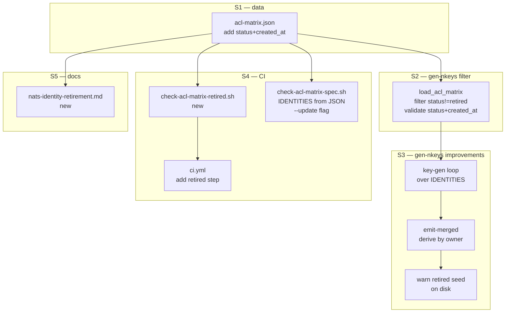
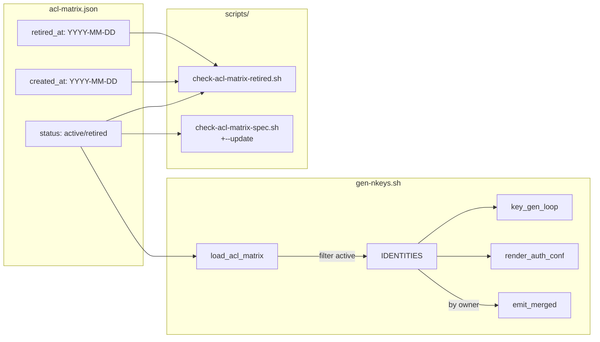

## Summary

Add `status`/`created_at` lifecycle fields to `acl-matrix.json` identities, filter retired identities throughout `gen-nkeys.sh`, add a CI validation script, patch `check-acl-matrix-spec.sh` for dynamic identity derivation + sentinel auto-update, and document the retirement procedure. Single domain (NATS ops), all bash/JSON/YAML/docs — no Python or TS changes.

## Architecture





## Agents

| Agent | Tasks | Files |
|---|---|---|
| devops-A | T1→T2→T3→T4→T5 | `deploy/nats/acl-matrix.json`, `deploy/nats/gen-nkeys.sh` |
| devops-B | T6→T9 | `scripts/check-acl-matrix-retired.sh`, `.github/workflows/ci.yml` |
| devops-C | T7→T8 | `scripts/check-acl-matrix-spec.sh` |
| doc-writer-A | T10 | `docs/ops/nats-identity-retirement.md` |

## Consistency Report

- Covered: 17/17 criteria
- Uncovered: none
- Untraced: none
- Exemptions: 0

## Micro-Tasks

### Slice S1 — acl-matrix.json data update

#### Task T1: Add status + created_at to all 9 identity blocks → devops-A
- **File:** `deploy/nats/acl-matrix.json`
- **Snippet:**
  ```json
  "hub": {
    "status": "active",
    "created_at": "2026-04-21",
    "owner": "lyra",
    ...
  }
  ```
  Dates per spec table: hub/telegram-adapter/discord-adapter/voice-tts/voice-stt/llm-worker/image-worker/monitor → `2026-04-21`; clipool-worker → `2026-04-27`
- **Verify:** `jq -e '[.identities | to_entries[] | select(.value.status and .value.created_at)] | length == 9' deploy/nats/acl-matrix.json && echo ok` (ready)
- **Expected:** `ok`
- **Time:** 3 min | **Difficulty:** 1
- **Traces:** SC-1 | **Phase:** GREEN

#### RED-GATE: S1 complete → devops-B, devops-C, doc-writer-A unblock

---

### Slice S2 — gen-nkeys.sh: filter retired identities in load_acl_matrix()

#### Task T2: Filter retired identities in load_acl_matrix(); validate status + created_at fields → devops-A
- **File:** `deploy/nats/gen-nkeys.sh`
- **Snippet:**
  ```bash
  # Change line ~113 from:
  done < <(jq -r '.identities | keys_unsorted[]' "${MATRIX_JSON}")
  # To (filter retired, validate required fields):
  done < <(jq -r '.identities | to_entries[] | select(.value.status != "retired") | .key' "${MATRIX_JSON}")
  # Add validation inside the loop (after existing field checks):
  for lc_field in status created_at; do
    has=$(jq -r --arg n "${name}" --arg f "${lc_field}" \
      'if .identities[$n] | has($f) then "yes" else "no" end' "${MATRIX_JSON}")
    [ "${has}" = "yes" ] \
      || error "acl-matrix.json: identity '${name}' missing field '${lc_field}'"
  done
  ```
- **Verify:** `bash deploy/nats/gen-nkeys.sh --template-only | grep -c 'permissions'` (ready)
- **Expected:** `9` (all 9 active identities still have permissions blocks)
- **Time:** 5 min | **Difficulty:** 3
- **Traces:** SC-6, N1 | **Phase:** GREEN

---

### Slice S3 — gen-nkeys.sh: key-gen loop + emit-merged fix + warn

#### Task T3: Replace hardcoded key-gen block (lines 659–683) with loop over IDENTITIES[] → devops-A
- **File:** `deploy/nats/gen-nkeys.sh`
- **Snippet:**
  ```bash
  # Replace the hardcoded block with:
  info "Generating nkey pairs in ${SEEDS_DIR}/ ..."
  declare -A PUBKEYS
  for name in "${IDENTITIES[@]}"; do
    PUBKEYS[$name]=$(generate_nkey "${name}")
  done
  render_auth_conf PUBKEYS > "${AUTH_CONF}"
  ```
- **Verify:** `bash deploy/nats/gen-nkeys.sh --template-only` exits 0 (ready)
- **Expected:** exit 0, auth.conf template rendered to stdout
- **Time:** 5 min | **Difficulty:** 2
- **Traces:** SC-10, N2 | **Phase:** GREEN

#### Task T4: Fix --emit-merged-authconf to derive identity lists from IDENTITIES[] by owner → devops-A
- **File:** `deploy/nats/gen-nkeys.sh`
- **Snippet:**
  ```bash
  # Replace hardcoded lists:
  MERGED_LYRA_IDENTITIES=()
  MERGED_VOICE_IDENTITIES=()
  for name in "${IDENTITIES[@]}"; do
    case "${OWNER[$name]}" in
      lyra)     MERGED_LYRA_IDENTITIES+=("${name}") ;;
      voicecli) MERGED_VOICE_IDENTITIES+=("${name}") ;;
    esac
  done
  ```
- **Verify:** `grep -q 'OWNER\[' deploy/nats/gen-nkeys.sh` (ready)
- **Expected:** match found
- **Time:** 5 min | **Difficulty:** 3
- **Traces:** SC-16, N9 | **Phase:** GREEN

#### Task T5: Add warn emission for retired identity with on-disk seed → devops-A
- **File:** `deploy/nats/gen-nkeys.sh`
- **Snippet:**
  ```bash
  # After load_acl_matrix(), iterate all identities (not just IDENTITIES[]):
  while IFS= read -r name; do
    status=$(jq -r --arg n "${name}" '.identities[$n].status' "${MATRIX_JSON}")
    if [ "${status}" = "retired" ]; then
      seed_file="${SEEDS_DIR}/${name}.seed"
      [ -f "${seed_file}" ] && warn "Retired identity '${name}' has a seed on disk: ${seed_file} — consider shredding it"
    fi
  done < <(jq -r '.identities | keys_unsorted[]' "${MATRIX_JSON}")
  ```
- **Verify:** `grep -q 'Retired identity' deploy/nats/gen-nkeys.sh` (ready)
- **Expected:** match found
- **Time:** 3 min | **Difficulty:** 2
- **Traces:** SC-9, N7 | **Phase:** GREEN

---

### Slice S4 — CI: check-acl-matrix-retired.sh + check-acl-matrix-spec.sh patches

#### Task T6: Write scripts/check-acl-matrix-retired.sh → devops-B
- **File:** `scripts/check-acl-matrix-retired.sh` (new)
- **Snippet:**
  ```bash
  #!/usr/bin/env bash
  set -euo pipefail
  REPO_ROOT="$(cd "$(dirname "${BASH_SOURCE[0]}")/.." && pwd)"
  JSON="${REPO_ROOT}/deploy/nats/acl-matrix.json"
  DATE_RE='^[0-9]{4}-[0-9]{2}-[0-9]{2}$'
  errors=0
  while IFS= read -r name; do
    status=$(jq -r --arg n "$name" '.identities[$n].status // empty' "$JSON")
    created=$(jq -r --arg n "$name" '.identities[$n].created_at // empty' "$JSON")
    [ -n "$status" ]  || { echo "ERROR: '$name' missing status";     ((errors++)); }
    [ -n "$created" ] || { echo "ERROR: '$name' missing created_at"; ((errors++)); }
    [[ "$created" =~ $DATE_RE ]] || { echo "ERROR: '$name' created_at invalid: $created"; ((errors++)); }
    if [ "$status" = "retired" ]; then
      retired=$(jq -r --arg n "$name" '.identities[$n].retired_at // empty' "$JSON")
      [ -n "$retired" ] || { echo "ERROR: '$name' retired but missing retired_at"; ((errors++)); }
      [[ "$retired" =~ $DATE_RE ]] || { echo "ERROR: '$name' retired_at invalid: $retired"; ((errors++)); }
      # Check not still in request_reply_flows
      in_flows=$(jq -r --arg n "$name" '[.request_reply_flows[]? | select(.requester==$n or .responder==$n)] | length' "$JSON")
      [ "$in_flows" = "0" ] || { echo "ERROR: '$name' retired but still in request_reply_flows"; ((errors++)); }
    fi
  done < <(jq -r '.identities | keys_unsorted[]' "$JSON")
  [ "$errors" -eq 0 ] && echo "ok — acl-matrix lifecycle fields valid" || exit 1
  ```
- **Verify:** `bash scripts/check-acl-matrix-retired.sh` (ready, after T1)
- **Expected:** `ok — acl-matrix lifecycle fields valid`
- **Time:** 8 min | **Difficulty:** 3
- **Traces:** SC-2,3,4,5,11,12,17, N4,N5,N6 | **Phase:** GREEN

#### Task T7: Patch check-acl-matrix-spec.sh — derive IDENTITIES from JSON (replace line 41) → devops-C
- **File:** `scripts/check-acl-matrix-spec.sh`
- **Snippet:**
  ```bash
  # Replace line 41:
  # IDENTITIES=(hub telegram-adapter ...)
  # With:
  mapfile -t IDENTITIES < <(jq -r '.identities | to_entries[] | select(.value.status == "active") | .key' "$JSON")
  ```
  Note: `$JSON` and `$EFFECTIVE_JSON` are already computed above line 41 in the current script.
- **Verify:** `bash scripts/check-acl-matrix-spec.sh` (ready, after T1)
- **Expected:** exit 0 (no drift)
- **Time:** 5 min | **Difficulty:** 2
- **Traces:** SC-13,14, N8 | **Phase:** GREEN

#### Task T8: Add --update flag to check-acl-matrix-spec.sh → devops-C
- **File:** `scripts/check-acl-matrix-spec.sh`
- **Snippet:**
  ```bash
  # Parse args: if --update, rewrite sentinel block in-place then exit 0
  UPDATE=false
  [[ "${1:-}" == "--update" ]] && UPDATE=true

  # After render_table > "$RENDERED":
  if [ "${UPDATE}" = true ]; then
    awk -v rendered="$RENDERED" '
      /<!-- acl-matrix:begin -->/ { print; found=1; while ((getline line < rendered) > 0) print line; next }
      /<!-- acl-matrix:end -->/ { found=0 }
      !found { print }
    ' "$SPEC" > "${NATS_TMPDIR}/spec_updated.txt"
    cp "${NATS_TMPDIR}/spec_updated.txt" "$SPEC"
    echo "Updated sentinel block in $SPEC"
    exit 0
  fi
  ```
- **Verify:** `bash scripts/check-acl-matrix-spec.sh --update && bash scripts/check-acl-matrix-spec.sh` (ready, after T7)
- **Expected:** `Updated sentinel block in ...` then exit 0 on second run
- **Time:** 5 min | **Difficulty:** 3
- **Traces:** SC-15, N10 | **Phase:** GREEN

#### Task T9: Add check-acl-matrix-retired.sh step to ci.yml → devops-B
- **File:** `.github/workflows/ci.yml`
- **Snippet:**
  ```yaml
  # Insert after "Check ACL matrix spec drift" step (line 67):
        - name: Check ACL matrix lifecycle fields
          run: bash scripts/check-acl-matrix-retired.sh
  ```
- **Verify:** `grep -q 'check-acl-matrix-retired' .github/workflows/ci.yml` (ready)
- **Expected:** match found
- **Time:** 2 min | **Difficulty:** 1
- **Traces:** SC-17, N4,N5,N6 | **Phase:** GREEN

#### RED-GATE: S4 complete → integration verify

---

### Slice S5 — Retirement procedure docs

#### Task T10: Write docs/ops/nats-identity-retirement.md → doc-writer-A
- **File:** `docs/ops/nats-identity-retirement.md` (new)
- **Content outline:**
  - Overview: why status field, audit trail goal
  - Step-by-step retirement procedure (set status/retired_at → remove from flows → run `--regen-authconf` → run `check-acl-matrix-spec.sh --update` → commit → reload NATS → verify → decide seed shred)
  - Adding a new identity (set status: active + created_at)
  - Seed shred decision note (when/how to shred)
  - Reference: `--retire` subcommand is a future issue
- **Verify:** `test -f docs/ops/nats-identity-retirement.md && grep -q 'retired_at' docs/ops/nats-identity-retirement.md` (ready)
- **Expected:** exit 0
- **Time:** 5 min | **Difficulty:** 1
- **Traces:** SC-1..17 (operator path), N7 | **Phase:** GREEN

---

## Wave Structure

3 waves, max 4 parallel agents. ~24 min elapsed vs ~46 min sequential (48% faster).

| Wave | Trigger | Agents | Tasks |
|---|---|---|---|
| 1 | start | 1 | devops-A: T1 |
| 2 | Wave 1 done | 4 ∥ | devops-A: T2 · devops-B: T6 · devops-C: T7 · doc-writer-A: T10 |
| 3 | Wave 2 done | 3 ∥ | devops-A: T3→T4→T5 · devops-B: T9 · devops-C: T8 |

## Task Seeding Blueprint

<!-- Used by /implement to seed TaskCreate calls on session start. -->

### Wave 1 — no deps, 1 agent

| Task | Agent instance | blockedBy | Subject |
|---|---|---|---|
| T1 | devops-A | — | Add status:active + created_at to all 9 identities in acl-matrix.json |

### Wave 2 — after T1, 4 agents ∥

| Task | Agent instance | blockedBy | Subject |
|---|---|---|---|
| T2 | devops-A | T1 | Filter retired identities in load_acl_matrix(); validate status + created_at |
| T6 | devops-B | T1 | Write scripts/check-acl-matrix-retired.sh with all lifecycle validations |
| T7 | devops-C | T1 | Patch check-acl-matrix-spec.sh: derive IDENTITIES from JSON |
| T10 | doc-writer-A | T1 | Write docs/ops/nats-identity-retirement.md |

### Wave 3 — after Wave 2, 3 agents ∥

| Task | Agent instance | blockedBy | Subject |
|---|---|---|---|
| T3 | devops-A | T2 | Replace hardcoded key-gen block with loop over IDENTITIES[] |
| T4 | devops-A | T3 | Fix --emit-merged-authconf to derive identity lists by owner |
| T5 | devops-A | T4 | Add warn for retired identity with on-disk seed |
| T8 | devops-C | T7 | Add --update flag to check-acl-matrix-spec.sh |
| T9 | devops-B | T6 | Add check-acl-matrix-retired.sh step to ci.yml |

## Task IDs

<!-- Generated by /plan. Used by /implement to resume tasks on session restart. -->
- T1: 10 — Add status:active + created_at to all 9 identities in acl-matrix.json
- T2: 11 — Filter retired identities in load_acl_matrix(); validate status + created_at
- T6: 12 — Write scripts/check-acl-matrix-retired.sh with all lifecycle validations
- T7: 13 — Patch check-acl-matrix-spec.sh: derive IDENTITIES from JSON
- T10: 14 — Write docs/ops/nats-identity-retirement.md
- T3: 15 — Replace hardcoded key-gen block with loop over IDENTITIES[]
- T4: 16 — Fix --emit-merged-authconf to derive identity lists by owner
- T5: 17 — Add warn for retired identity with on-disk seed
- T8: 18 — Add --update flag to check-acl-matrix-spec.sh
- T9: 19 — Add check-acl-matrix-retired.sh step to ci.yml
