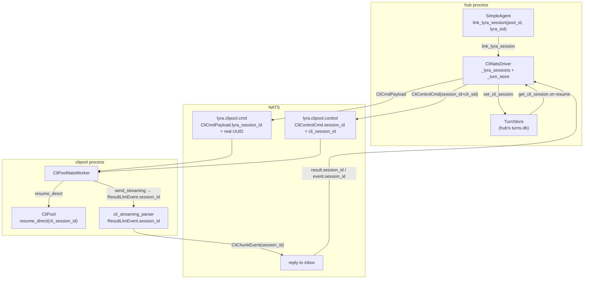
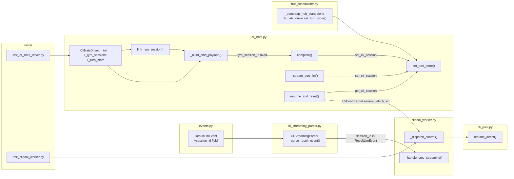

## Summary

Move `lyra_session_id → cli_session_id` persistence from the stateless clipool worker to the
hub-side `CliNatsDriver`, which already runs in the hub process and can access hub's `TurnStore`.
Five files, three slices, no contract field renames.

## Architecture

### Data Flow



### File × Function Map



## Agents

| Agent | Tasks | Files |
|---|---|---|
| `backend-dev-A` | T1–T12 | `events.py`, `cli_streaming_parser.py`, `cli_nats.py`, `clipool_worker.py`, `cli_pool.py`, `hub_standalone.py` |
| `tester-A` | T13–T14 | `tests/` |

## Micro-Tasks

### S1 — Driver stores + forwards lyra_session_id (N1, N2, N3)

RED-GATE S1: all S1 tasks must pass before S2 begins.

---

**T1** — Add state fields and `set_turn_store()` to `CliNatsDriver`
- File: `src/lyra/llm/drivers/cli_nats.py`
- Agent: backend-dev-A
- Phase: RED
- Slice: S1
- Spec trace: SC-1 (N1)
- Difficulty: 1
- Parallel-safe: N (first in chain)
- Time: 3 min

```python
# In CliNatsDriver.__init__:
self._lyra_sessions: dict[str, str] = {}
self._turn_store: TurnStore | None = None

def set_turn_store(self, store: TurnStore) -> None:
    self._turn_store = store
```

Verify: `grep "_lyra_sessions\|_turn_store\|set_turn_store" src/lyra/llm/drivers/cli_nats.py`
Expected: 3+ matches

---

**T2** — Fix `link_lyra_session` (remove no-op, store mapping)
- File: `src/lyra/llm/drivers/cli_nats.py`
- Agent: backend-dev-A
- Phase: RED
- Slice: S1
- Spec trace: SC-2 (N2)
- Difficulty: 1
- Parallel-safe: N (after T1)
- Time: 2 min

```python
def link_lyra_session(self, pool_id: str, lyra_session_id: str) -> None:
    self._lyra_sessions[pool_id] = lyra_session_id
    log.debug("cli_nats: link pool_id=%s → lyra_session=%s", pool_id, lyra_session_id)
```

Verify: `grep -A3 "def link_lyra_session" src/lyra/llm/drivers/cli_nats.py`
Expected: body stores `self._lyra_sessions[pool_id]`, no longer just logs

---

**T3** — Fix `_build_cmd_payload` to use `_lyra_sessions.get(pool_id, pool_id)`
- File: `src/lyra/llm/drivers/cli_nats.py`
- Agent: backend-dev-A
- Phase: RED
- Slice: S1
- Spec trace: SC-3 (N3)
- Difficulty: 1
- Parallel-safe: N (after T2)
- Time: 2 min

```python
lyra_session_id=self._lyra_sessions.get(pool_id, pool_id),
```

Verify: `grep "lyra_session_id" src/lyra/llm/drivers/cli_nats.py`
Expected: `_lyra_sessions.get(pool_id, pool_id)` — not hardcoded `pool_id`

RED-GATE S1 ✓ — verify T1–T3 before proceeding to S2.

---

### S2 — Driver writes cli_session_id to hub TurnStore (N4–N7, N11)

---

**T4** — Add `session_id: str | None = None` to `ResultLlmEvent`
- File: `src/lyra/core/messaging/events.py`
- Agent: backend-dev-A
- Phase: RED
- Slice: S2
- Spec trace: SC-4 (N6)
- Difficulty: 1
- Parallel-safe: Y (independent of T1–T3)
- Time: 2 min

```python
@dataclasses.dataclass
class ResultLlmEvent:
    is_error: bool
    duration_ms: int
    cost_usd: float | None = None
    error_text: str | None = None
    session_id: str | None = None   # ← add
```

Verify: `grep "session_id" src/lyra/core/messaging/events.py`
Expected: `session_id: str | None = None` in `ResultLlmEvent`

---

**T5** — Pass `session_id` from parsed CLI JSON in `cli_streaming_parser.py`
- File: `src/lyra/core/cli/cli_streaming_parser.py`
- Agent: backend-dev-A
- Phase: RED
- Slice: S2
- Spec trace: SC-4 (N6)
- Difficulty: 2
- Parallel-safe: N (after T4)
- Time: 3 min

In `_parse_result_event` (or equivalent), pass `session_id=data.get("session_id")` when constructing `ResultLlmEvent`:

```python
ResultLlmEvent(
    is_error=is_error,
    duration_ms=data.get("duration_ms", 0),
    cost_usd=None,
    error_text=self.error if is_error else None,
    session_id=data.get("session_id") or None,   # ← add
)
```

Verify: `grep -A8 "ResultLlmEvent(" src/lyra/core/cli/cli_streaming_parser.py`
Expected: `session_id=data.get("session_id")` present

---

**T6** — Include `session_id` in streaming result chunk in worker
- File: `src/lyra/adapters/clipool/clipool_worker.py`
- Agent: backend-dev-A
- Phase: RED
- Slice: S2
- Spec trace: SC-5 (N7)
- Difficulty: 2
- Parallel-safe: N (after T5)
- Time: 3 min

In `_handle_cmd_streaming`, when building the `result` chunk:

```python
elif isinstance(event, ResultLlmEvent):
    chunk = _make_chunk(
        cmd.pool_id,
        event_type="result",
        is_error=event.is_error,
        session_id=event.session_id or None,   # ← add
        done=True,
    )
```

Verify: `grep -A6 "event_type=\"result\"" src/lyra/adapters/clipool/clipool_worker.py | grep session_id`
Expected: `session_id=event.session_id` present in streaming result chunk

---

**T7** — Write mapping to TurnStore after `complete()`
- File: `src/lyra/llm/drivers/cli_nats.py`
- Agent: backend-dev-A
- Phase: GREEN
- Slice: S2
- Spec trace: SC-6 (N4)
- Difficulty: 2
- Parallel-safe: N (after T1–T3)
- Time: 4 min

After `reply = await self._request(...)` returns successfully in `complete()`, persist the mapping:

```python
_cli_sid = reply.get("session_id", "")
if _cli_sid and self._turn_store and pool_id in self._lyra_sessions:
    asyncio.get_running_loop().create_task(
        self._turn_store.set_cli_session(self._lyra_sessions[pool_id], _cli_sid)
    )
```

Note: extract session_id from `reply` dict before building `LlmResult`, so it's available for the persist call.

Verify: `grep -A5 "set_cli_session" src/lyra/llm/drivers/cli_nats.py`
Expected: `create_task(self._turn_store.set_cli_session(...))` present in `complete()`

---

**T8** — Write mapping to TurnStore after streaming result
- File: `src/lyra/llm/drivers/cli_nats.py`
- Agent: backend-dev-A
- Phase: GREEN
- Slice: S2
- Spec trace: SC-6 (N5)
- Difficulty: 2
- Parallel-safe: N (after T4–T6, T7)
- Time: 4 min

In `_stream_gen_llm`, when yielding `ResultLlmEvent`, persist the mapping first:

```python
elif event_type == "result":
    _cli_sid = chunk.get("session_id")
    if _cli_sid and self._turn_store and pool_id in self._lyra_sessions:
        asyncio.get_running_loop().create_task(
            self._turn_store.set_cli_session(self._lyra_sessions[pool_id], _cli_sid)
        )
    yield ResultLlmEvent(
        is_error=bool(chunk.get("is_error", False)),
        duration_ms=int(chunk.get("duration_ms", 0)),
        session_id=_cli_sid or None,
    )
    return
```

Verify: `grep -B2 -A6 "event_type == .result" src/lyra/llm/drivers/cli_nats.py | grep set_cli_session`
Expected: `set_cli_session` call present before `ResultLlmEvent` yield

---

**T9** — Inject TurnStore into CliNatsDriver in hub standalone bootstrap
- File: `src/lyra/bootstrap/standalone/hub_standalone.py`
- Agent: backend-dev-A
- Phase: GREEN
- Slice: S2
- Spec trace: SC-6 (N11)
- Difficulty: 1
- Parallel-safe: N (after T1)
- Time: 2 min

After `cli_nats_driver = await build_cli_nats_driver(nc)` (line ~166), add:

```python
if cli_nats_driver is not None:
    cli_nats_driver.set_turn_store(stores.turn)
```

`stores.turn` is already constructed before this point (line 160: `hub.set_turn_store(stores.turn)`).

Verify: `grep -A2 "build_cli_nats_driver" src/lyra/bootstrap/standalone/hub_standalone.py`
Expected: `set_turn_store` call follows driver construction

RED-GATE S2 ✓ — verify T4–T9 before proceeding to S3.

---

### S3 — Worker uses cli_session_id directly for resume (N8, N9, N10)

---

**T10** — Fix `CliNatsDriver.resume_and_reset` to resolve and send `cli_session_id`
- File: `src/lyra/llm/drivers/cli_nats.py`
- Agent: backend-dev-A
- Phase: RED
- Slice: S3
- Spec trace: SC-7 (N8)
- Difficulty: 3
- Parallel-safe: N (after T7–T9: TurnStore must be wired + mapping written)
- Time: 5 min

```python
async def resume_and_reset(self, pool_id: str, session_id: str) -> bool:
    cli_sid: str | None = None
    if self._turn_store is not None:
        cli_sid = await self._turn_store.get_cli_session(session_id)
    payload = self._build_control_payload(
        pool_id, "resume_and_reset", session_id=cli_sid
    )
    reply = await self._request(self.SUBJECT_CONTROL, payload)
    return bool(reply.get("resumed", False))
```

When `cli_sid` is `None` (no mapping yet), sends `session_id=None` → worker treats as cold start.

Verify: `grep -A10 "async def resume_and_reset" src/lyra/llm/drivers/cli_nats.py`
Expected: `get_cli_session` call and `cli_sid` variable present

---

**T11** — Add `CliPool.resume_direct(pool_id, cli_session_id)` method
- File: `src/lyra/core/cli/cli_pool.py`
- Agent: backend-dev-A
- Phase: RED
- Slice: S3
- Spec trace: SC-9 (N10)
- Difficulty: 2
- Parallel-safe: Y (independent of T10)
- Time: 4 min

Add to `CliPool` (after `resume_and_reset`):

```python
async def resume_direct(self, pool_id: str, cli_session_id: str) -> bool:
    """Set up --resume using a pre-resolved cli_session_id (no TurnStore lookup).

    Called by CliPoolNatsWorker which receives cli_session_id directly from hub.
    Returns True if resume was set up, False if no-op (already on that session).
    """
    if not cli_session_id or not SESSION_ID_RE.match(cli_session_id):
        log.warning("[pool:%s] resume_direct: invalid cli_session_id %r", pool_id, cli_session_id)
        return False
    entry = self._entries.get(pool_id)
    if entry is not None and entry.is_alive() and entry.session_id == cli_session_id:
        log.info("[pool:%s] resume_direct: already on session %s — no-op", pool_id, cli_session_id)
        return True
    await self._kill(pool_id, preserve_session=False)
    self._resume_session_ids[pool_id] = cli_session_id
    log.info("[pool:%s] resume_direct: will resume CLI session %s on next spawn", pool_id, cli_session_id)
    return True
```

Verify: `grep "def resume_direct" src/lyra/core/cli/cli_pool.py`
Expected: method exists

---

**T12** — Fix `_dispatch_control` to pass `cmd.session_id` directly to `resume_direct`
- File: `src/lyra/adapters/clipool/clipool_worker.py`
- Agent: backend-dev-A
- Phase: RED
- Slice: S3
- Spec trace: SC-8 (N9)
- Difficulty: 2
- Parallel-safe: N (after T11)
- Time: 3 min

Replace the `resume_and_reset` branch in `_dispatch_control`:

```python
if cmd.op == "resume_and_reset":
    if not cmd.session_id:
        log.warning("clipool_worker: resume_and_reset missing session_id for pool_id=%r", cmd.pool_id)
        return _make_ack(cmd.pool_id, ok=False)
    # cmd.session_id is now cli_session_id (resolved by hub driver)
    resumed = await self._pool.resume_direct(cmd.pool_id, cmd.session_id)
    return _make_ack(cmd.pool_id, ok=True, resumed=resumed)
```

Verify: `grep -A8 "resume_and_reset" src/lyra/adapters/clipool/clipool_worker.py | grep resume_direct`
Expected: `resume_direct` call present, no `TurnStore` reference

RED-GATE S3 ✓ — verify T10–T12 (full round-trip testable after this gate).

---

### Tests

---

**T13** — Unit tests for `CliNatsDriver` session mapping
- File: `tests/llm/drivers/test_cli_nats_driver.py` (create)
- Agent: tester-A
- Phase: GREEN
- Slice: S1+S2
- Spec trace: SC-1–SC-6
- Difficulty: 3
- Parallel-safe: N (after T1–T9)
- Time: 8 min

Tests to cover:
- `link_lyra_session` stores mapping; `_build_cmd_payload` returns linked UUID
- `_build_cmd_payload` falls back to `pool_id` with empty dict (no KeyError)
- `complete()` calls `set_cli_session(lyra_sid, cli_sid)` when TurnStore wired
- `_stream_gen_llm` calls `set_cli_session` when result chunk has `session_id`
- `set_turn_store(None)` — no error, no TurnStore write attempted

Verify: `uv run pytest tests/llm/drivers/test_cli_nats_driver.py -v`
Expected: all tests pass

---

**T14** — Unit tests for `resume_direct` + `_dispatch_control` integration
- File: `tests/adapters/clipool/test_clipool_worker_resume.py` (create or extend)
- Agent: tester-A
- Phase: GREEN
- Slice: S3
- Spec trace: SC-7–SC-10
- Difficulty: 3
- Parallel-safe: N (after T10–T12)
- Time: 8 min

Tests to cover:
- `resume_direct(pool_id, valid_cli_sid)` — kills process, stores `_resume_session_ids[pool_id]`
- `resume_direct(pool_id, already_on_session)` — no-op, returns True
- `resume_direct(pool_id, invalid_sid)` — returns False, no kill
- `_dispatch_control resume_and_reset` — calls `resume_direct`, returns ACK with `resumed`
- `_dispatch_control resume_and_reset` with `session_id=None` — returns `ok=False`
- No TurnStore import in `clipool_worker.py` — verified by grep

Verify: `uv run pytest tests/adapters/clipool/test_clipool_worker_resume.py -v`
Expected: all tests pass

---

## Wave Structure

3 waves, max 2 parallel agents. ~2h sequential → ~1.5h with parallelism.

| Wave | Trigger | Agents | Tasks |
|---|---|---|---|
| 1 | start | 1 (backend-dev-A) | T1→T2→T3 (cli_nats state + link + build_cmd), T4 (events.py, parallel with T1–T3) |
| 2 | Wave 1 done | 1 (backend-dev-A) | T5→T6 (parser + worker streaming), T7→T8 (driver write mapping), T9 (bootstrap), T11 (pool.resume_direct) |
| 3 | Wave 2 done | 1 (backend-dev-A) + 1 (tester-A) | T10 (driver.resume_and_reset), T12 (worker._dispatch_control) → then T13 (tester-A after T1–T9) → T14 (tester-A after T10–T12) |

## Task Seeding Blueprint

<!-- Used by /implement to seed TaskCreate calls on session start. -->

### Wave 1 — no deps, backend-dev-A starts

| Task | Agent instance | blockedBy | Subject |
|---|---|---|---|
| T1 | backend-dev-A | — | Add `_lyra_sessions`, `_turn_store`, `set_turn_store()` to `CliNatsDriver` |
| T4 | backend-dev-A | — | Add `session_id` field to `ResultLlmEvent` |

### Wave 1 (sequential within backend-dev-A)

| Task | Agent instance | blockedBy | Subject |
|---|---|---|---|
| T2 | backend-dev-A | T1 | Fix `link_lyra_session` to store mapping |
| T3 | backend-dev-A | T2 | Fix `_build_cmd_payload` to use `_lyra_sessions.get` |

### Wave 2 — after Wave 1

| Task | Agent instance | blockedBy | Subject |
|---|---|---|---|
| T5 | backend-dev-A | T4 | Pass `session_id` from parsed CLI JSON in `cli_streaming_parser` |
| T6 | backend-dev-A | T5 | Include `session_id` in streaming result chunk in worker |
| T7 | backend-dev-A | T3 | Write mapping to TurnStore after `complete()` |
| T8 | backend-dev-A | T7,T5 | Write mapping to TurnStore after streaming result |
| T9 | backend-dev-A | T1 | Inject TurnStore into CliNatsDriver in hub standalone bootstrap |
| T11 | backend-dev-A | — | Add `CliPool.resume_direct()` method |

### Wave 3 — after Wave 2

| Task | Agent instance | blockedBy | Subject |
|---|---|---|---|
| T10 | backend-dev-A | T8,T9 | Fix `CliNatsDriver.resume_and_reset` to resolve and send `cli_session_id` |
| T12 | backend-dev-A | T11,T6 | Fix `_dispatch_control` to use `resume_direct` |
| T13 | tester-A | T9 | Unit tests for `CliNatsDriver` session mapping |
| T14 | tester-A | T12,T13 | Unit tests for `resume_direct` + `_dispatch_control` integration |

## Task IDs

<!-- Generated by /plan. Used by /implement to resume tasks on session restart. -->
- T1: 12 — Add `_lyra_sessions`, `_turn_store`, `set_turn_store()` to `CliNatsDriver`
- T2: 13 — Fix `link_lyra_session` to store mapping (remove no-op)
- T3: 14 — Fix `_build_cmd_payload` to use `_lyra_sessions.get(pool_id, pool_id)`
- T4: 15 — Add `session_id: str | None = None` to `ResultLlmEvent`
- T5: 16 — Pass `session_id` from parsed CLI JSON in `cli_streaming_parser.py`
- T6: 17 — Include `session_id` in streaming result chunk in `clipool_worker.py`
- T7: 18 — Write mapping to TurnStore after `complete()` in `CliNatsDriver`
- T8: 19 — Write mapping to TurnStore after streaming result in `_stream_gen_llm`
- T9: 20 — Inject TurnStore into CliNatsDriver in hub standalone bootstrap
- T10: 21 — Fix `CliNatsDriver.resume_and_reset` to resolve and send `cli_session_id`
- T11: 22 — Add `CliPool.resume_direct(pool_id, cli_session_id)` method
- T12: 23 — Fix `_dispatch_control` to pass `cmd.session_id` directly to `resume_direct`
- T13: 24 — Unit tests for `CliNatsDriver` session mapping
- T14: 25 — Unit tests for `resume_direct` + `_dispatch_control` integration
