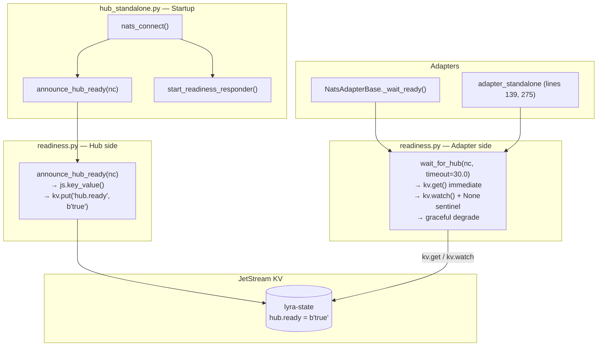
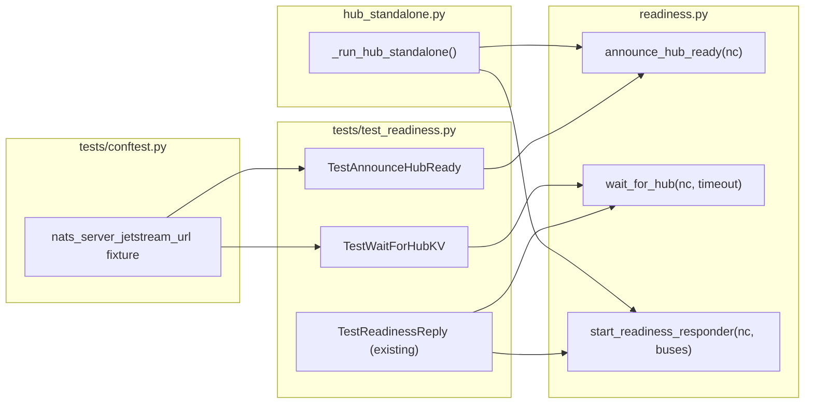

## Summary

Replace `wait_for_hub()` req/reply probe with JetStream KV watch and add
`announce_hub_ready()` to the hub. All changes are confined to
`roxabi-nats/readiness.py`, its test file, `hub_standalone.py`, and the NATS
ACL config. No new modules, no new deps.

## Architecture

### Data Flow



### File × Function Map



## Bootstrap Context

Reference pattern: `src/lyra/infrastructure/audit/jetstream_sink.py` —
`provision()` shows the `add_stream` → `BadRequestError` → `update_stream`
idempotency pattern. For KV: use `key_value()` → on `BucketNotFoundError` →
`create_key_value()`.

Error classes (confirmed): `nats.js.errors.BucketNotFoundError`,
`nats.js.errors.KeyNotFoundError`.

Existing conftest.py spawns `nats-server` without JetStream. New fixture adds
`--jetstream` flag on a separate ephemeral port.

## Agents

| Agent | Tasks | Files |
|-------|-------|-------|
| backend-dev | T2→T5→T6→T9 | `readiness.py`, `hub_standalone.py` |
| tester | T1→T3→T4→T7→T8 | `tests/conftest.py`, `tests/test_readiness.py` |
| devops | T10→T11 | `deploy/nats/auth.conf` |

## Micro-Tasks

### S1 — KV probe core logic

---

**T1** `[P]` — Add JetStream-enabled NATS fixture to conftest.py
- **File:** `packages/roxabi-nats/tests/conftest.py`
- **Snippet:**
  ```python
  @pytest.fixture(scope="session")
  def nats_server_jetstream_url() -> Generator[str, None, None]:
      if not _nats_server_available:
          pytest.skip("nats-server not found in PATH")
      port = _free_port()
      url = f"nats://127.0.0.1:{port}"
      proc = subprocess.Popen(
          ["nats-server", "-p", str(port), "--jetstream"],
          stdout=subprocess.DEVNULL, stderr=subprocess.DEVNULL,
      )
      # wait-for-ready loop (same pattern as existing nats_server_url)
      ...
      yield url
      proc.terminate(); proc.wait()

  @pytest.fixture()
  async def nc_js(nats_server_jetstream_url: str) -> AsyncGenerator[NATS, None]:
      conn = await nats.connect(nats_server_jetstream_url)
      yield conn
      if conn.is_connected:
          await conn.drain()
  ```
- **Verify:** `uv run pytest packages/roxabi-nats/tests/conftest.py --collect-only`
- **Expected:** fixture collected, no import errors
- **Time:** 5 min
- **Agent:** tester
- **Spec trace:** SC-1, SC-2 (prerequisite)
- **Slice:** S1
- **Phase:** RED
- **Difficulty:** 2

---

**T2** `[P]` — Add `announce_hub_ready()` stub to readiness.py
- **File:** `packages/roxabi-nats/src/roxabi_nats/readiness.py`
- **Snippet:**
  ```python
  async def announce_hub_ready(nc: NATS) -> None:
      """Write hub.ready = b'true' to lyra-state KV bucket. No-op if JetStream unavailable."""
      ...  # implementation in T5
  ```
- **Verify:** `uv run python -c "from roxabi_nats.readiness import announce_hub_ready; print('ok')"` (from `packages/roxabi-nats/`)
- **Expected:** `ok`
- **Time:** 3 min
- **Agent:** backend-dev
- **Spec trace:** SC-4, SC-5
- **Slice:** S1
- **Phase:** RED
- **Difficulty:** 1

---

**T3** — Write failing tests for `announce_hub_ready()`
- **File:** `packages/roxabi-nats/tests/test_readiness.py`
- **Snippet:**
  ```python
  @requires_nats_server
  class TestAnnounceHubReady:
      async def test_writes_hub_ready_key(self, nc_js): ...
      async def test_idempotent_second_call(self, nc_js): ...
      async def test_jetstream_unavailable_logs_warning(self, nc, caplog): ...
  ```
- **Verify:** `uv run pytest packages/roxabi-nats/tests/test_readiness.py::TestAnnounceHubReady -v 2>&1 | grep -E "FAILED|ERROR"` — must show failures (not `PASSED`)
- **Expected:** 3 test failures (NotImplementedError or similar)
- **Time:** 8 min
- **Agent:** tester
- **Spec trace:** SC-4, SC-5, SC-6
- **Slice:** S1
- **Phase:** RED
- **Difficulty:** 3

---

**T4** — Write failing tests for `wait_for_hub()` KV paths
- **File:** `packages/roxabi-nats/tests/test_readiness.py`
- **Snippet:**
  ```python
  @requires_nats_server
  class TestWaitForHubKV:
      async def test_kv_immediate_returns_true(self, nc_js): ...
      async def test_kv_watch_returns_true_after_key_written(self, nc_js): ...
      async def test_none_sentinel_skipped(self, nc_js): ...
      async def test_timeout_returns_false_and_warns(self, nc_js): ...
      async def test_jetstream_unavailable_returns_false(self, nc, caplog): ...
      async def test_adapter_logs_immediate(self, nc_js, caplog): ...
      async def test_adapter_logs_watch(self, nc_js, caplog): ...
  ```
- **Verify:** `uv run pytest packages/roxabi-nats/tests/test_readiness.py::TestWaitForHubKV -v 2>&1 | grep -E "FAILED|ERROR"` — must show failures
- **Expected:** 7 test failures
- **Time:** 10 min
- **Agent:** tester
- **Spec trace:** SC-1, SC-2, SC-3, SC-4, SC-7, SC-8
- **Slice:** S1
- **Phase:** RED
- **Difficulty:** 4

---

**RED-GATE S1** — All KV tests written and failing for correct reasons (NotImplementedError / assertion error, not import error)
- **Verify:** `uv run pytest packages/roxabi-nats/tests/test_readiness.py -v 2>&1 | tail -20`
- **Expected:** existing classes PASS; TestAnnounceHubReady + TestWaitForHubKV FAIL

---

**T5** — Implement `announce_hub_ready()`
- **File:** `packages/roxabi-nats/src/roxabi_nats/readiness.py`
- **Snippet:**
  ```python
  async def announce_hub_ready(nc: NATS) -> None:
      from nats.js.errors import BucketNotFoundError
      from nats.js.api import KeyValueConfig, StorageType
      try:
          js = nc.jetstream()
      except Exception:
          log.warning("Hub KV unavailable — JetStream not enabled")
          return
      try:
          kv = await js.key_value("lyra-state")
      except BucketNotFoundError:
          kv = await js.create_key_value(
              KeyValueConfig(bucket="lyra-state", storage=StorageType.FILE)
          )
      await kv.put("hub.ready", b"true")
      log.info("Hub KV ready announced")
  ```
- **Verify:** `uv run pytest packages/roxabi-nats/tests/test_readiness.py::TestAnnounceHubReady -v`
- **Expected:** 3 PASSED
- **Time:** 8 min
- **Agent:** backend-dev
- **Spec trace:** SC-4, SC-5, SC-6, SC-7
- **Slice:** S1
- **Phase:** GREEN
- **Difficulty:** 3

---

**T6** — Implement new `wait_for_hub()` KV paths
- **File:** `packages/roxabi-nats/src/roxabi_nats/readiness.py`
- **Snippet:**
  ```python
  async def wait_for_hub(nc: NATS, *, timeout: float = PROBE_TIMEOUT_S) -> bool:
      from nats.js.errors import BucketNotFoundError, KeyNotFoundError
      deadline = time.monotonic() + timeout
      try:
          js = nc.jetstream()
          try:
              kv = await js.key_value("lyra-state")
          except BucketNotFoundError:
              kv = await js.create_key_value(KeyValueConfig(bucket="lyra-state"))
          entry = await kv.get("hub.ready")
          if entry.value == b"true":
              log.info("Hub ready (KV immediate)")
              return True
      except KeyNotFoundError:
          pass  # fall through to watch
      except Exception:
          log.warning("wait_for_hub: JetStream not enabled — skipping probe")
          return False
      # watch path
      remaining = deadline - time.monotonic()
      if remaining <= 0:
          log.warning("Hub readiness probe timed out after %ss ...", timeout)
          return False
      watcher = await kv.watch("hub.ready")
      try:
          async with asyncio.timeout(remaining):
              async for entry in watcher:
                  if entry is None:
                      continue
                  if entry.value == b"true":
                      log.info("Hub ready (KV watch)")
                      return True
      except TimeoutError:
          pass
      log.warning("Hub readiness probe timed out after %ss ...", timeout)
      return False
  ```
- **Verify:** `uv run pytest packages/roxabi-nats/tests/test_readiness.py::TestWaitForHubKV -v`
- **Expected:** 7 PASSED
- **Time:** 10 min
- **Agent:** backend-dev
- **Spec trace:** SC-1, SC-2, SC-3, SC-4, SC-7, SC-8
- **Slice:** S1
- **Phase:** GREEN
- **Difficulty:** 4

---

**T7** — Verify all existing readiness tests still pass
- **File:** `packages/roxabi-nats/tests/test_readiness.py` (read-only verification)
- **Verify:** `uv run pytest packages/roxabi-nats/tests/test_readiness.py -v`
- **Expected:** all classes PASS including TestReadinessReply, TestReadinessTimeout, TestConcurrentStartup, TestReadinessEmptyBuses, TestWaitForHubUnexpectedError
- **Spec trace:** SC-12
- **Slice:** S1
- **Phase:** REFACTOR
- **Time:** 3 min
- **Agent:** tester
- **Difficulty:** 1

---

### S2 — Hub wiring

---

**T8** — Write test: hub_standalone calls announce_hub_ready before start_readiness_responder
- **File:** `tests/bootstrap/test_hub_standalone.py` (or nearest existing hub test)
- **Snippet:**
  ```python
  async def test_announce_called_before_readiness_responder(monkeypatch):
      calls = []
      monkeypatch.setattr("roxabi_nats.readiness.announce_hub_ready",
                          AsyncMock(side_effect=lambda nc: calls.append("announce")))
      monkeypatch.setattr("roxabi_nats.readiness.start_readiness_responder",
                          AsyncMock(side_effect=lambda nc, buses: calls.append("responder")))
      # trigger hub bootstrap path ...
      assert calls.index("announce") < calls.index("responder")
  ```
- **Verify:** `uv run pytest <hub_test_file> -v -k "announce" 2>&1 | grep FAILED`
- **Expected:** test collected and FAIL (not yet wired)
- **Time:** 5 min
- **Agent:** tester
- **Spec trace:** SC-9
- **Slice:** S2
- **Phase:** RED
- **Difficulty:** 2

---

**T9** — Wire announce_hub_ready(nc) in hub_standalone.py
- **File:** `src/lyra/bootstrap/standalone/hub_standalone.py`
- **Snippet:** After `nc = await nats_connect(...)`, before `readiness_sub = await start_readiness_responder(...)`:
  ```python
  from roxabi_nats.readiness import announce_hub_ready
  await announce_hub_ready(nc)
  ```
- **Verify:** `uv run pytest <hub_test_file> -v -k "announce"` → PASS; `uv run pytest tests/bootstrap/ -v` → all PASS
- **Expected:** T8 test PASSES; no regressions
- **Time:** 5 min
- **Agent:** backend-dev
- **Spec trace:** SC-7, SC-9
- **Slice:** S2
- **Phase:** GREEN
- **Difficulty:** 2

---

### S3 — ACL grants

---

**T10** — Add $JS.API.> to hub publish.allow in auth.conf
- **File:** `deploy/nats/auth.conf`
- **Change:** In hub (`UDUMMYHUB`) block, add `"$JS.API.>"` to `publish.allow` list
- **Verify:** `grep -A5 'UDUMMYHUB' deploy/nats/auth.conf | grep 'JS.API'`
- **Expected:** `"$JS.API.>"` present in hub publish list
- **Time:** 3 min
- **Agent:** devops
- **Spec trace:** SC-13
- **Slice:** S3
- **Phase:** GREEN
- **Difficulty:** 1

---

**T11** — Add $JS.API.> + $KV.lyra-state.> to adapter ACLs in auth.conf
- **File:** `deploy/nats/auth.conf`
- **Change:** For `telegram-adapter`, `discord-adapter`, `clipool-worker`: add `"$JS.API.>"` to publish.allow; add `"$KV.lyra-state.>"` to subscribe.allow
- **Verify:** `grep -A8 'UDUMMYTELEGRAM\|UDUMMYDISCORD\|UDUMMYCLIPOOLWORKER' deploy/nats/auth.conf | grep -c 'JS.API\|KV.lyra'`
- **Expected:** count ≥ 6 (2 entries × 3 identities)
- **Time:** 5 min
- **Agent:** devops
- **Spec trace:** SC-13
- **Slice:** S3
- **Phase:** GREEN
- **Difficulty:** 2

---

## Wave Structure

7 waves, max 2 parallel agents. ~1.5h parallel vs ~2.7h sequential.

| Wave | Trigger | Agents | Tasks |
|------|---------|--------|-------|
| 1 | start | 2 ∥ | tester: T1 · backend-dev: T2 |
| 2 | Wave 1 done | 1 | tester: T3→T4 (same file) |
| RED-GATE | Wave 2 done | — | All KV tests FAIL correctly |
| 3 | RED-GATE | 1 | backend-dev: T5→T6 (same file) |
| 4 | Wave 3 done | 1 | tester: T7 (verify) |
| 5 | Wave 4 done | 1 | tester: T8 (hub test) |
| 6 | Wave 5 done | 1 | backend-dev: T9 · devops: T10→T11 ∥ |
| 7 | Wave 6 done | — | done |

Wave 6 note: T9 (hub wiring) and T10+T11 (ACL, different file) can run in parallel — T10+T11 have no code dependency on T9, only a deployment ordering concern.

## Task Seeding Blueprint

<!-- Used by /implement to seed TaskCreate calls on session start. -->

### Wave 1 — no deps, 2 agents ∥

| Task | Agent instance | blockedBy | Subject |
|------|---------------|-----------|---------|
| T1 | tester | — | Add JetStream fixture to conftest.py |
| T2 | backend-dev | — | Add announce_hub_ready() stub to readiness.py |

### Wave 2 — after Wave 1

| Task | Agent instance | blockedBy | Subject |
|------|---------------|-----------|---------|
| T3 | tester | T1, T2 | Write failing tests for announce_hub_ready() |
| T4 | tester | T3 | Write failing tests for wait_for_hub() KV paths |

### RED-GATE S1 — after Wave 2

| Task | Agent instance | blockedBy | Subject |
|------|---------------|-----------|---------|
| RED-GATE-S1 | tester | T4 | Verify KV tests fail for correct reasons |

### Wave 3 — after RED-GATE

| Task | Agent instance | blockedBy | Subject |
|------|---------------|-----------|---------|
| T5 | backend-dev | RED-GATE-S1 | Implement announce_hub_ready() |
| T6 | backend-dev | T5 | Implement new wait_for_hub() KV paths |

### Wave 4 — after Wave 3

| Task | Agent instance | blockedBy | Subject |
|------|---------------|-----------|---------|
| T7 | tester | T6 | Verify all existing readiness tests still pass |

### Wave 5 — after Wave 4

| Task | Agent instance | blockedBy | Subject |
|------|---------------|-----------|---------|
| T8 | tester | T7 | Write test: hub calls announce_hub_ready before start_readiness_responder |

### Wave 6 — after Wave 5, 2 agents ∥

| Task | Agent instance | blockedBy | Subject |
|------|---------------|-----------|---------|
| T9 | backend-dev | T8 | Wire announce_hub_ready(nc) in hub_standalone.py |
| T10 | devops | T8 | Add $JS.API.> to hub publish.allow in auth.conf |
| T11 | devops | T10 | Add $JS.API.> + $KV.lyra-state.> to adapter ACLs in auth.conf |

## Task IDs

<!-- Generated by /plan. Used by /implement to resume tasks on session restart. -->
- T1: 9 — Add JetStream fixture to conftest.py
- T2: 10 — Add announce_hub_ready() stub to readiness.py
- T3: 11 — Write failing tests for announce_hub_ready()
- T4: 12 — Write failing tests for wait_for_hub() KV paths
- RED-GATE-S1: 13 — Verify KV tests fail for correct reasons
- T5: 14 — Implement announce_hub_ready()
- T6: 15 — Implement new wait_for_hub() KV paths
- T7: 16 — Verify all existing readiness tests still pass
- T8: 17 — Write test for hub_standalone calling announce_hub_ready before start_readiness_responder
- T9: 18 — Wire announce_hub_ready(nc) in hub_standalone.py
- T10+T11: 19 — Update auth.conf with JetStream KV ACL grants
