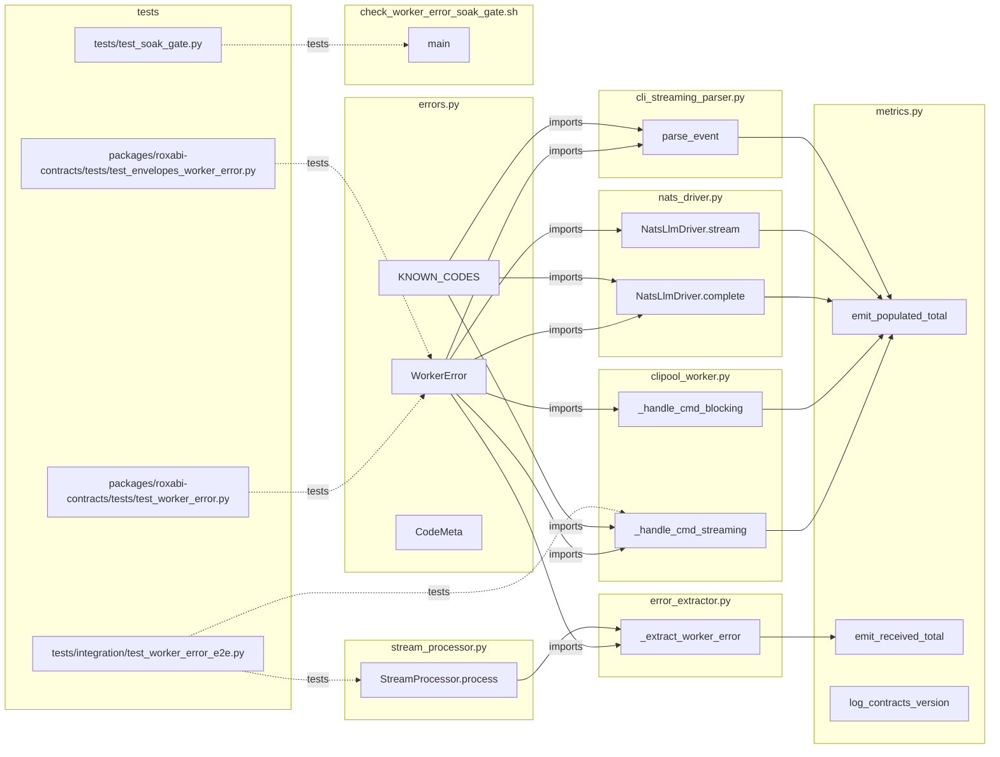

## Summary

Implement P1 + P2 of ADR-066: ship the `WorkerError` Pydantic model, add an additive optional field to 5 reply envelopes, wire the open-string code registry with a CI sync check, populate `worker_error` from `clipool_worker` and `NatsLlmDriver`, route reads through a single hub `_extract_worker_error` helper that replaces the hardcoded English fallback, and ship a fixture-testable soak-gate one-liner whose PASS/FAIL output unblocks the follow-up shim-deletion child issue.

## Architecture

### Data flow (config → contracts → workers → SDK → hub → adapter)

```mermaid
flowchart TD
    subgraph contracts["packages/roxabi-contracts"]
        ERR["errors.py<br/>WorkerError + KNOWN_CODES"]
        REG["docs/error-codes.md"]
        SYNC["scripts/check_codes_sync.py"]
        CLIM["cli/models.py<br/>CliChunkEvent.worker_error"]
        LLMM["llm/models.py<br/>LlmChunkEvent + LlmResponse"]
        VOIM["voice/models.py<br/>Tts/SttResponse"]
        IMGM["image/models.py<br/>ImageResponse<br/>(error_detail removed)"]
    end
    subgraph hub["src/lyra/core/messaging"]
        MET["metrics.py<br/>emit_populated/received"]
        EXT["error_extractor.py<br/>_extract_worker_error"]
    end
    subgraph processors["src/lyra/core/processors"]
        SP["stream_processor.py<br/>(no more 'Something went wrong')"]
    end
    subgraph workers["worker / driver populate"]
        CLW["clipool_worker.py"]
        LLD["NatsLlmDriver.complete + stream"]
        CSP["cli_streaming_parser.py"]
    end
    subgraph bootstrap["src/lyra/bootstrap/standalone"]
        HSB["hub_standalone.py"]
        ASB["adapter_standalone.py"]
        CSB["clipool_standalone.py"]
    end
    subgraph ops["tools + ci + docs"]
        SOAK["tools/check_worker_error_soak_gate.sh"]
        FIXT["tests/fixtures/soak_gate_*.log"]
        CI[".github/workflows/ci.yml"]
        CFG["docs/CONFIGURATION.md"]
        DEP["docs/DEPLOYMENT.md"]
    end

    ERR --> CLIM
    ERR --> LLMM
    ERR --> VOIM
    ERR --> IMGM
    ERR --> EXT
    ERR --> CLW
    ERR --> LLD
    ERR --> CSP
    REG --> SYNC
    SYNC --> CI

    CLW --> MET
    LLD --> MET
    EXT --> MET
    EXT --> SP

    HSB --> MET
    ASB --> MET
    CSB --> MET

    SOAK --> FIXT
    SOAK --> CFG
    DEP --> SOAK

    style ERR fill:#cfc
    style EXT fill:#cfc
    style MET fill:#cfc
```



### File × Function map



## Bootstrap Context

From the analysis (`artifacts/analyses/1016-worker-error-envelope-analysis.mdx`):

- 5 reply envelopes carry 4 error contracts. Cross-cutting unification chosen (Shape B) over per-domain patch.
- 3 SDK silent-drop sites in `roxabi-nats` — synthesis is **driver-side P3 work**, not in this issue. Drivers populate `transport.*` codes themselves in P2 (scaffolding to be removed by P3).
- Counter backend: structured logs (zero-infra). Format pinned in spec C3 as `METRIC <key=val>`.
- ADR-049 forward-compat (`extra="ignore"`) handles cross-repo skew.
- ADR-066 supersedes the worker→hub portion of ADR-006.

## Agents

| Agent instance | Tasks | Files |
|---|---|---|
| **backend-dev-A** | 4 | `packages/roxabi-contracts/src/roxabi_contracts/{errors.py, cli/models.py, llm/models.py, voice/models.py, image/models.py}`; `src/lyra/adapters/clipool/clipool_worker.py` |
| **backend-dev-B** | 5 | `src/lyra/core/messaging/{metrics.py, error_extractor.py}`; `src/lyra/core/cli/cli_streaming_parser.py`; `src/lyra/core/processors/stream_processor.py`; bootstrap files |
| **backend-dev-C** | 2 | `src/lyra/llm/drivers/nats_driver.py` |
| **tester-A** | 6 | contract tests (`packages/roxabi-contracts/tests/`); test doubles (`*/testing.py`); soak-gate fixture test |
| **tester-B** | 2 | `tests/integration/test_worker_error_e2e.py` (skeleton + assertions) |
| **devops-A** | 4 | `packages/roxabi-contracts/scripts/check_codes_sync.py`; `.github/workflows/ci.yml`; `tools/check_worker_error_soak_gate.sh`; fixtures |
| **doc-writer-A** | 3 | `packages/roxabi-contracts/docs/error-codes.md`; `docs/CONFIGURATION.md`; `docs/DEPLOYMENT.md` |
| **RED-GATE** sentinels | 3 | gates only — no files |

Total: 25 micro-tasks across 7 named agent instances + 3 RED-GATEs.

## Wave Structure

10 waves, max 5 parallel agents. Elapsed ~1.5–2 weeks vs ~4 weeks sequential.

| Wave | Trigger | Agents (∥) | Tasks |
|---|---|---|---|
| 1 | start | tester-A · tester-B | tester-A: T1→T2 · tester-B: T3 |
| 2 | Wave 1 done | backend-dev-A · doc-writer-A · devops-A | backend-dev-A: T4 · doc-writer-A: T5 · devops-A: T6 |
| 3 | Wave 2 done | backend-dev-A · tester-A · devops-A | backend-dev-A: T7 · tester-A: T8 · devops-A: T9 |
| 4 | T4 done | backend-dev-B | backend-dev-B: T10→T11 |
| 5 | Waves 3,4 done | RED-GATE | T12 (S1 RED-GATE) |
| 6 | T12 PASS | backend-dev-A · backend-dev-B · backend-dev-C | backend-dev-A: T13 · backend-dev-C: T14→T15 · backend-dev-B: T16→T17→T18 |
| 7 | Wave 6 done | RED-GATE | T19 (S2 RED-GATE — integration test) |
| 8 | T19 PASS | devops-A · doc-writer-A | devops-A: T20→T21 · doc-writer-A: T22→T23 |
| 9 | Wave 8 done | RED-GATE | T24 (S3 RED-GATE — soak gate fixture test) |
| 10 | Wave 9 done | tester-A | T25 (full suite + acceptance evidence) |

## Consistency Report

| Spec criterion | Covered by | Status |
|---|---|---|
| C1 (model + registry + CI sync) | T1, T4, T5, T6, T9 | ✓ |
| C2 (5 envelopes additive + delete `error_detail`) | T2, T7, T8 | ✓ |
| C3 (telemetry: version log + counter format) | T10, T11, T13, T14, T15, T16, T18 | ✓ |
| C4 (workers + drivers populate) | T13, T14, T15, T16 | ✓ |
| C5 (hub helper + fallback removal) — user-observable | T17, T18 | ✓ |
| C6 (integration test) | T3 (skeleton), T19 (assertion) | ✓ |
| C7 (soak gate + fixture test) | T20, T21, T22, T23, T24 | ✓ |

| Affordance | Covered by | Status |
|---|---|---|
| N1 WorkerError model | T4 | ✓ |
| N2 KNOWN_CODES dict | T4 | ✓ |
| N3 error-codes.md | T5 | ✓ |
| N4 check_codes_sync.py | T6, T9 | ✓ |
| N5 worker_error field on 5 envelopes | T7 | ✓ |
| N6 ImageResponse.error_detail deletion | T7 | ✓ |
| N7 roxabi_contracts_version startup log | T11 | ✓ |
| N8 worker_error_populated_total counter | T10, T13, T14, T15, T16 | ✓ |
| N9 worker_error_received_total counter | T10, T18 | ✓ |
| N10 clipool exception → WorkerError | T13 | ✓ |
| N11 LLM driver error → WorkerError | T14, T15 | ✓ |
| N12 CLI parser → WorkerError | T16 | ✓ |
| N13 _extract_worker_error helper | T17 | ✓ |
| N14 hub fallback removal | T18 | ✓ |
| N15 soak gate one-liner | T20 | ✓ |

Coverage: **7/7 criteria** + **15/15 affordances**. No untraced tasks. No exemptions.

## Micro-Tasks

### Slice S1 — Contract foundation (Waves 1–5)

**T1** [P]
- **Description:** Write failing contract tests for `WorkerError` model — construction, field validators (`min_length=1` for code+message; `max_length=2048` for detail with **rejection** not truncation), JSON round-trip, `KNOWN_CODES` dict shape (each entry has `domain`, `default_retryable`, `description`).
- **File:** `packages/roxabi-contracts/tests/test_worker_error.py` (new)
- **Verify:** `cd packages/roxabi-contracts && uv run pytest tests/test_worker_error.py -v`
- **Expected:** Tests fail with `ImportError: cannot import name 'WorkerError'` (target file doesn't exist yet)
- **Time:** 5 min · **Agent:** tester-A · **Spec trace:** SC-C1 / N1 / S1 · **Phase:** RED · **Diff:** 2

**T2** [P]
- **Description:** Write failing tests asserting all 5 reply envelopes accept the optional `worker_error` field (Pydantic construction with `worker_error=WorkerError(...)` succeeds and `.model_dump()` includes the field) and `ImageResponse.error_detail` no longer exists.
- **File:** `packages/roxabi-contracts/tests/test_envelopes_worker_error.py` (new)
- **Verify:** `cd packages/roxabi-contracts && uv run pytest tests/test_envelopes_worker_error.py -v`
- **Expected:** Tests fail (envelopes don't have `worker_error` yet; `error_detail` still exists)
- **Time:** 5 min · **Agent:** tester-A · **Spec trace:** SC-C2 / N5,N6 / S1 · **Phase:** RED · **Diff:** 2

**T3** [P]
- **Description:** Write integration test skeleton (`tests/integration/test_worker_error_e2e.py`) with the 4 assertions from spec C6: (a) `worker_error` populated with expected `code` + non-empty `message`; (b) `_extract_worker_error` returns the same value; (c) rendered `TextRenderEvent.text` equals `WorkerError.message`; (d) captured log records show populated + received `METRIC` lines. Use existing `tests/integration/` patterns; mark test with `@pytest.mark.skip(reason="awaiting impl")` until Wave 6.
- **File:** `tests/integration/test_worker_error_e2e.py` (new)
- **Verify:** `uv run pytest tests/integration/test_worker_error_e2e.py --collect-only`
- **Expected:** Test collected (skipped is OK at this stage)
- **Time:** 10 min · **Agent:** tester-B · **Spec trace:** SC-C6 / S2 · **Phase:** RED · **Diff:** 3

**T4** [P]
- **Description:** Implement `WorkerError` Pydantic model + `KNOWN_CODES` dict + `CodeMeta` dataclass. Initial codes from ADR-066 §"The code namespace" — populate the full set per domain (transport.*, worker.*, cli.*, llm.*, voice.*, image.*). Add `__all__` export.
- **File:** `packages/roxabi-contracts/src/roxabi_contracts/errors.py` (new)
- **Code shape:**
  ```python
  from pydantic import BaseModel, Field
  class WorkerError(BaseModel):
      code: str = Field(min_length=1)
      message: str = Field(min_length=1)
      retryable: bool = True
      detail: str | None = Field(default=None, max_length=2048)
      model_config = {"extra": "ignore"}
  class CodeMeta(BaseModel):
      domain: str
      default_retryable: bool
      description: str
  KNOWN_CODES: dict[str, CodeMeta] = { ... }
  ```
- **Verify:** `cd packages/roxabi-contracts && uv run pytest tests/test_worker_error.py -v`
- **Expected:** All T1 tests pass
- **Time:** 10 min · **Agent:** backend-dev-A · **Spec trace:** SC-C1 / N1,N2 / S1 · **Phase:** GREEN · **Diff:** 3

**T5** [P]
- **Description:** Author `error-codes.md` Markdown table mirroring `KNOWN_CODES`. Columns: `code`, `domain`, `retryable`, `description`. Group by domain section. Header includes a "kept in sync via `scripts/check_codes_sync.py`" line.
- **File:** `packages/roxabi-contracts/docs/error-codes.md` (new)
- **Verify:** `wc -l packages/roxabi-contracts/docs/error-codes.md && head -20 packages/roxabi-contracts/docs/error-codes.md`
- **Expected:** File exists, has all codes from ADR-066
- **Time:** 5 min · **Agent:** doc-writer-A · **Spec trace:** SC-C1 / N3 / S1 · **Phase:** GREEN · **Diff:** 1

**T6** [P]
- **Description:** Write `check_codes_sync.py` script (Python). Parses `KNOWN_CODES` from the `errors` module + parses table rows from `error-codes.md`. Compares both as `set[code]` + spot-checks `domain` + `default_retryable` + `description` fields. Exit 0 on parity, exit 1 on drift with a diff. Must run as `uv run python packages/roxabi-contracts/scripts/check_codes_sync.py` from repo root.
- **File:** `packages/roxabi-contracts/scripts/check_codes_sync.py` (new dir + file). Add `packages/roxabi-contracts/scripts/__init__.py` empty file if needed.
- **Verify:** `uv run python packages/roxabi-contracts/scripts/check_codes_sync.py; echo "exit=$?"`
- **Expected:** `exit=0` (in-sync after T4 + T5)
- **Time:** 10 min · **Agent:** devops-A · **Spec trace:** SC-C1 / N4 / S1 · **Phase:** GREEN · **Diff:** 3

**T7**
- **Description:** Add `worker_error: WorkerError | None = None` field to `CliChunkEvent`, `LlmChunkEvent`, `LlmResponse`, `TtsResponse`, `SttResponse`, `ImageResponse`. **Delete** `error_detail` from `ImageResponse`. Import `WorkerError` from `roxabi_contracts.errors`. Do NOT touch `CliControlAck`. Preserve all existing `@model_validator` invariants on `ok`.
- **Files:** `packages/roxabi-contracts/src/roxabi_contracts/cli/models.py`, `llm/models.py`, `voice/models.py`, `image/models.py`
- **Verify:** `cd packages/roxabi-contracts && uv run pytest tests/test_envelopes_worker_error.py tests/test_cli_models.py tests/test_llm_models.py tests/test_voice_models.py tests/test_image_models.py -v`
- **Expected:** T2 tests pass; existing model tests still pass
- **Time:** 8 min · **Agent:** backend-dev-A · **Spec trace:** SC-C2 / N5,N6 / S1 · **Phase:** GREEN · **Diff:** 2

**T8** [P]
- **Description:** Update test doubles in `voice/testing.py` and `image/testing.py` (FakeTtsWorker/FakeSttWorker/FakeImageWorker patterns) so error paths can populate `worker_error`. Per ADR-049 §3-guards, doubles must be able to construct + serialize the field. Add a constructor helper `with_worker_error(code, message, retryable=True)`.
- **Files:** `packages/roxabi-contracts/src/roxabi_contracts/voice/testing.py`, `image/testing.py`
- **Verify:** `cd packages/roxabi-contracts && uv run pytest tests/ -v`
- **Expected:** Full contracts test suite green
- **Time:** 8 min · **Agent:** tester-A · **Spec trace:** SC-C2 / S1 · **Phase:** GREEN · **Diff:** 2

**T9** [P]
- **Description:** Wire `check_codes_sync.py` into `.github/workflows/ci.yml`. Add a step **before** the pytest step: `name: "Verify error codes registry sync"` running `uv run python packages/roxabi-contracts/scripts/check_codes_sync.py`. CI fails on drift.
- **File:** `.github/workflows/ci.yml`
- **Verify:** `grep -A 2 "check_codes_sync" .github/workflows/ci.yml`
- **Expected:** Step found in workflow
- **Time:** 5 min · **Agent:** devops-A · **Spec trace:** SC-C1 / N4 / S1 · **Phase:** GREEN · **Diff:** 2

**T10**
- **Description:** Create `src/lyra/core/messaging/metrics.py` with three helpers: `emit_populated_total(domain: str)`, `emit_received_total(code: str, domain: str)`, `log_contracts_version()`. All emit via stdlib `logging` at INFO. Format strings (LITERAL — pinned by spec C3):
  - `f"METRIC worker_error_populated_total domain={domain} count=1"`
  - `f"METRIC worker_error_received_total code={code} domain={domain} count=1"`
  - `f"roxabi_contracts_version={roxabi_contracts.__version__}"`
- **File:** `src/lyra/core/messaging/metrics.py` (new)
- **Verify:** Add a small unit test `tests/core/test_metrics_format.py` and run `uv run pytest tests/core/test_metrics_format.py -v`
- **Expected:** Test passes — formats match spec C3 verbatim
- **Time:** 8 min · **Agent:** backend-dev-B · **Spec trace:** SC-C3 / N8,N9 / S1 · **Phase:** GREEN · **Diff:** 3

**T11**
- **Description:** Call `log_contracts_version()` once at startup in `hub_standalone.py`, `adapter_standalone.py`, `clipool_standalone.py` (the bootstrap entrypoints listed in `lyra/CLAUDE.md`). Place after logging is configured but before NATS connection.
- **Files:** `src/lyra/bootstrap/standalone/hub_standalone.py`, `adapter_standalone.py`, `clipool_standalone.py`
- **Verify:** `uv run lyra hub --help 2>&1 | head -1` (sanity), then run `uv run lyra hub` briefly and grep stderr for `roxabi_contracts_version=`
- **Expected:** One log line at startup per process matching the format
- **Time:** 5 min · **Agent:** backend-dev-B · **Spec trace:** SC-C3 / N7 / S1 · **Phase:** GREEN · **Diff:** 2

**T12** — RED-GATE S1
- **Description:** Verify all S1 acceptance: (a) `cd packages/roxabi-contracts && uv run pytest -q` green; (b) `uv run python packages/roxabi-contracts/scripts/check_codes_sync.py` exits 0; (c) `git grep "error_detail" packages/roxabi-contracts/` returns no production hit; (d) brief smoke run of `uv run lyra hub` shows the version log line. Document evidence in PR description.
- **Files:** none — gate only
- **Verify:** Run all four checks
- **Expected:** All four PASS
- **Time:** 10 min · **Agent:** tester-A · **Spec trace:** SC-C1,C2,C3 / S1 · **Phase:** RED-GATE · **Diff:** 1

### Slice S2 — Producers + consumers (Waves 6–7)

**T13**
- **Description:** Update `clipool_worker.py` exception paths in `_handle_cmd_streaming` and `_handle_cmd_blocking` to construct + publish a `CliChunkEvent` with populated `worker_error`. Pick code based on caught exception class (timeouts → `cli.session_lost` if applicable, parse → `cli.parse`, generic → `worker.crash`). Call `emit_populated_total(domain="cli")` on each error publish. Preserve the legacy `is_error=True` flag for backward compat (additive).
- **File:** `src/lyra/adapters/clipool/clipool_worker.py`
- **Verify:** `uv run pytest tests/cli/ tests/adapters/ -q`
- **Expected:** Existing tests still pass; new error paths construct WorkerError
- **Time:** 10 min · **Agent:** backend-dev-A · **Spec trace:** SC-C4 / N10 / S2 · **Phase:** GREEN · **Diff:** 3

**T14**
- **Description:** Update `NatsLlmDriver.complete()` (the non-streaming path) — when timeout/parse/no-responders fires, build `WorkerError(code="transport.timeout"|"transport.parse"|"transport.no_responders", message=..., retryable=...)` and put it in the returned `LlmResult`. Replace the divergent free-text `error` strings. Call `emit_populated_total(domain="llm")` on each error.
- **File:** `src/lyra/llm/drivers/nats_driver.py`
- **Verify:** `uv run pytest tests/llm/drivers/ -q`
- **Expected:** Existing tests pass; timeout test asserts WorkerError shape
- **Time:** 10 min · **Agent:** backend-dev-C · **Spec trace:** SC-C4 / N11 / S2 · **Phase:** GREEN · **Diff:** 3
- **Constraint reminder:** Touch `nats_driver.py` for `worker_error` only — NO `NatsDriverBase` refactor (deferred to P3).

**T15**
- **Description:** Update `NatsLlmDriver.stream()` (and the underlying `_stream_gen` consumer) to yield `ResultLlmEvent` carrying `worker_error` instead of opaque `error_text`. Same code namespace as T14. Converge call shape with T14 — same exception → same code → same message text.
- **File:** `src/lyra/llm/drivers/nats_driver.py`
- **Verify:** `uv run pytest tests/llm/drivers/ -q`
- **Expected:** Existing streaming tests pass; new tests assert WorkerError on stream errors
- **Time:** 10 min · **Agent:** backend-dev-C · **Spec trace:** SC-C4 / N11 / S2 · **Phase:** GREEN · **Diff:** 3

**T16**
- **Description:** Update `cli_streaming_parser.py` to populate `worker_error` for two failure paths: (a) upstream CLI emits an error event → translate to `cli.*` code per the event's intent; (b) parser sees malformed JSON / unknown event → `worker.parse`. Emit `emit_populated_total(domain="cli")` on each.
- **File:** `src/lyra/core/cli/cli_streaming_parser.py`
- **Verify:** `uv run pytest tests/cli/ -q`
- **Expected:** Tests pass
- **Time:** 10 min · **Agent:** backend-dev-B · **Spec trace:** SC-C4 / N12 / S2 · **Phase:** GREEN · **Diff:** 3

**T17**
- **Description:** Create `error_extractor.py` exporting `_extract_worker_error(reply) -> WorkerError | None`. Use `getattr(reply, "worker_error", None)` (safe pattern for envelopes lacking the field, e.g. `CliControlAck`). On `is_error=False ∧ worker_error is not None` contradiction, emit `log.warning("envelope contradiction: is_error=False but worker_error populated (code=%s, type=%s)", we.code, type(reply).__name__)` and **still return `we`** (overrides `is_error`).
- **File:** `src/lyra/core/messaging/error_extractor.py` (new)
- **Verify:** `uv run pytest tests/core/test_error_extractor.py -v` (write a small unit test alongside)
- **Expected:** All cases covered: legacy reply (no field) → None; populated → returns WE; contradiction → returns WE + log.warning captured
- **Time:** 10 min · **Agent:** backend-dev-B · **Spec trace:** SC-C5 / N13 / S2 · **Phase:** GREEN · **Diff:** 3

**T18**
- **Description:** Update `stream_processor.py` to call `_extract_worker_error` on the terminal reply. If returned, render `WorkerError.message` as the user-facing text (still wrap with `is_error=True` for adapter ❌). Call `emit_received_total(code, domain)` on extraction. **Remove** the literal string `"Something went wrong. Please try again."` from this file. When the extractor returns `None` AND the legacy `error_text` shim field is populated, fall back to that (P2 transitional). 
- **File:** `src/lyra/core/processors/stream_processor.py`
- **Verify:** `uv run pytest tests/core/ -q && git grep -F "Something went wrong. Please try again." src/`
- **Expected:** Tests pass; grep returns 0 hits in `src/`
- **Time:** 12 min · **Agent:** backend-dev-B · **Spec trace:** SC-C5 / N14 / S2 · **Phase:** GREEN · **Diff:** 3
- **Constraint reminder:** Do NOT add retry policy or circuit-breaker logic inline. `retryable` flows out via the extractor; consumer policy is separate concern.

**T19** — RED-GATE S2 (integration test acceptance)
- **Description:** Remove `@pytest.mark.skip` from T3's integration test (`tests/integration/test_worker_error_e2e.py`) and assert all 4 conditions from C6: (a) `worker_error` populated with expected `code` + non-empty `message`; (b) `_extract_worker_error` returns same; (c) `TextRenderEvent.text == WorkerError.message`; (d) captured log records show both METRIC lines (use `caplog` fixture).
- **File:** `tests/integration/test_worker_error_e2e.py`
- **Verify:** `uv run pytest tests/integration/test_worker_error_e2e.py -v`
- **Expected:** Test passes end-to-end
- **Time:** 10 min · **Agent:** tester-B · **Spec trace:** SC-C6 / S2 · **Phase:** RED-GATE · **Diff:** 3

### Slice S3 — Soak gate + docs (Waves 8–9)

**T20** [P]
- **Description:** Write `tools/check_worker_error_soak_gate.sh`. Two modes: default reads `journalctl --since "<window>" --no-pager`; `--fixture <path>` reads from a file instead. Greps for `METRIC worker_error_populated_total` lines (per spec C3 format), parses `domain=<value>` to aggregate, counts. Greps for `error_text=` legacy fallback lines, counts. Default window `48h`. Prints exactly `PASS` or `FAIL` to stdout; breakdown to stderr. Gate condition: `populated{cli} > 0 ∧ populated{llm} > 0 ∧ legacy_error_text == 0`. Use POSIX-portable bash + awk + grep (no jq).
- **File:** `tools/check_worker_error_soak_gate.sh` (new, `chmod +x`)
- **Verify:** `bash tools/check_worker_error_soak_gate.sh --help`
- **Expected:** Script prints usage
- **Time:** 15 min · **Agent:** devops-A · **Spec trace:** SC-C7 / N15 / S3 · **Phase:** GREEN · **Diff:** 4

**T21** [P]
- **Description:** Author two fixture log files. `soak_gate_pass.log`: contains ≥1 `METRIC worker_error_populated_total domain=cli count=1`, ≥1 `domain=llm`, ≥1 `METRIC worker_error_received_total code=... domain=...`, zero `error_text=` lines. `soak_gate_fail.log`: missing `domain=llm` lines OR has `error_text=` non-empty.
- **Files:** `tests/fixtures/soak_gate_pass.log`, `tests/fixtures/soak_gate_fail.log` (new)
- **Verify:** `grep -c "domain=" tests/fixtures/soak_gate_pass.log`
- **Expected:** Counts ≥ 2 in pass fixture
- **Time:** 5 min · **Agent:** devops-A · **Spec trace:** SC-C7 / S3 · **Phase:** GREEN · **Diff:** 1

**T22** [P]
- **Description:** Document the `WorkerError` envelope + `tools/check_worker_error_soak_gate.sh` usage in `docs/CONFIGURATION.md`. Show: how to invoke (default + `--fixture`), expected output, gate condition, what code namespace looks like (link to `error-codes.md`). Cross-reference ADR-066 + spec.
- **File:** `docs/CONFIGURATION.md` (modify; section append)
- **Verify:** `grep -A 5 "WorkerError" docs/CONFIGURATION.md`
- **Expected:** New section visible
- **Time:** 8 min · **Agent:** doc-writer-A · **Spec trace:** SC-C7 / S3 · **Phase:** GREEN · **Diff:** 2

**T23** [P]
- **Description:** Add a paragraph to `docs/DEPLOYMENT.md` titled "Soak gate journald retention pre-requisite" explaining: gate reads `journalctl --since "48 hours ago"`; verify with `journalctl --disk-usage` and `journalctl --since "48 hours ago" | head -1`; link to spec C7 + `tools/check_worker_error_soak_gate.sh`.
- **File:** `docs/DEPLOYMENT.md` (modify; section append)
- **Verify:** `grep -A 5 "journald retention" docs/DEPLOYMENT.md`
- **Expected:** Section exists
- **Time:** 5 min · **Agent:** doc-writer-A · **Spec trace:** SC-C7 / S3 · **Phase:** GREEN · **Diff:** 1

**T24** — RED-GATE S3 (soak gate fixture)
- **Description:** Write `tests/test_soak_gate.py` invoking the script via subprocess against both fixtures: `subprocess.run(["bash", "tools/check_worker_error_soak_gate.sh", "--fixture", "tests/fixtures/soak_gate_pass.log"]).stdout == "PASS\n"` and `... fail.log).stdout == "FAIL\n"`. Run via `uv run pytest tests/test_soak_gate.py -v`.
- **File:** `tests/test_soak_gate.py` (new)
- **Verify:** `uv run pytest tests/test_soak_gate.py -v`
- **Expected:** Both assertions pass
- **Time:** 8 min · **Agent:** tester-A · **Spec trace:** SC-C7 / S3 · **Phase:** RED-GATE · **Diff:** 2

### Final integration

**T25**
- **Description:** Run the full suite (`uv run pytest`), `uv run ruff check .`, `uv run pyright`. Confirm all 7 acceptance criteria (C1–C7) pass. Compose evidence block for the PR description quoting exit codes + log excerpts. Open the follow-up child issue tracking the `error_text` shim deletion (post-soak), with `blocked-by` referencing the soak-gate PASS condition.
- **Files:** none (test runs + GH issue creation)
- **Verify:** `uv run pytest --tb=no -q && uv run ruff check . && uv run pyright`
- **Expected:** All green; child issue URL captured
- **Time:** 12 min · **Agent:** tester-A · **Spec trace:** All criteria · **Phase:** REFACTOR (final QA) · **Diff:** 1

## Task Seeding Blueprint

<!-- Used by /implement to seed TaskCreate calls on session start.
     Format: T{n} | agent-instance | blockedBy | subject
     blockedBy refs T-numbers within this list (not session task IDs).
     Agent instances are named so parallel tasks map to distinct spawned agents.
     Seed in wave order; within a wave all rows are parallel (∥). -->

### Wave 1 — no deps, 2 agents ∥

| Task | Agent instance | blockedBy | Subject |
|---|---|---|---|
| T1 | tester-A | — | RED: WorkerError model contract tests |
| T2 | tester-A | T1 | RED: 5-envelope additive field tests |
| T3 | tester-B | — | RED: integration test skeleton (skipped) |

### Wave 2 — after Wave 1, 3 agents ∥

| Task | Agent instance | blockedBy | Subject |
|---|---|---|---|
| T4 | backend-dev-A | T1 | GREEN: WorkerError model + KNOWN_CODES |
| T5 | doc-writer-A | T1 | GREEN: error-codes.md registry table |
| T6 | devops-A | T1 | GREEN: check_codes_sync.py CI script |

### Wave 3 — after Wave 2, 3 agents ∥

| Task | Agent instance | blockedBy | Subject |
|---|---|---|---|
| T7 | backend-dev-A | T2,T4 | GREEN: add worker_error to 5 envelopes; delete error_detail |
| T8 | tester-A | T7 | GREEN: update FakeTtsWorker / FakeSttWorker / FakeImageWorker |
| T9 | devops-A | T6 | GREEN: wire check_codes_sync.py into ci.yml |

### Wave 4 — after T4, 1 agent

| Task | Agent instance | blockedBy | Subject |
|---|---|---|---|
| T10 | backend-dev-B | T4 | GREEN: metrics.py emit helpers + format constants |
| T11 | backend-dev-B | T10 | GREEN: log_contracts_version() in 3 bootstrap files |

### Wave 5 — RED-GATE S1, after Waves 3+4

| Task | Agent instance | blockedBy | Subject |
|---|---|---|---|
| T12 | tester-A | T8,T9,T11 | RED-GATE S1: contracts green, CI sync runs, version logs |

### Wave 6 — after T12, 3 agents ∥

| Task | Agent instance | blockedBy | Subject |
|---|---|---|---|
| T13 | backend-dev-A | T12 | GREEN: clipool_worker populates worker_error |
| T14 | backend-dev-C | T12 | GREEN: NatsLlmDriver.complete() WorkerError |
| T15 | backend-dev-C | T14 | GREEN: NatsLlmDriver.stream() WorkerError (converge) |
| T16 | backend-dev-B | T12 | GREEN: cli_streaming_parser populates worker_error |
| T17 | backend-dev-B | T16 | GREEN: error_extractor.py + log.warning on contradiction |
| T18 | backend-dev-B | T17 | GREEN: stream_processor calls extractor; remove fallback string |

### Wave 7 — RED-GATE S2

| Task | Agent instance | blockedBy | Subject |
|---|---|---|---|
| T19 | tester-B | T13,T15,T18 | RED-GATE S2: integration test C6 passes |

### Wave 8 — after T19, 2 agents ∥

| Task | Agent instance | blockedBy | Subject |
|---|---|---|---|
| T20 | devops-A | T19 | GREEN: tools/check_worker_error_soak_gate.sh |
| T21 | devops-A | T20 | GREEN: soak_gate fixtures (pass + fail) |
| T22 | doc-writer-A | T19 | GREEN: docs/CONFIGURATION.md soak-gate section |
| T23 | doc-writer-A | T22 | GREEN: docs/DEPLOYMENT.md journald retention pre-req |

### Wave 9 — RED-GATE S3

| Task | Agent instance | blockedBy | Subject |
|---|---|---|---|
| T24 | tester-A | T21 | RED-GATE S3: soak-gate prints PASS/FAIL on fixtures |

### Wave 10 — final QA

| Task | Agent instance | blockedBy | Subject |
|---|---|---|---|
| T25 | tester-A | T24,T19 | Final: full pytest + ruff + pyright; open shim-deletion child issue |

## Task IDs

<!-- Generated by /plan. Used by /implement to resume tasks on session restart. -->
- T1: 12 — RED: WorkerError model contract tests
- T2: 13 — RED: 5-envelope additive field tests
- T3: 14 — RED: integration test skeleton (skipped)
- T4: 15 — GREEN: WorkerError model + KNOWN_CODES
- T5: 16 — GREEN: error-codes.md registry table
- T6: 17 — GREEN: check_codes_sync.py CI script
- T7: 18 — GREEN: add worker_error to 5 envelopes; delete error_detail
- T8: 19 — GREEN: update FakeTtsWorker / FakeSttWorker / FakeImageWorker
- T9: 20 — GREEN: wire check_codes_sync.py into ci.yml
- T10: 21 — GREEN: metrics.py emit helpers (METRIC format)
- T11: 22 — GREEN: log_contracts_version() in 3 bootstrap files
- T12: 23 — RED-GATE S1: contracts green, CI sync runs, version logs
- T13: 24 — GREEN: clipool_worker populates worker_error
- T14: 25 — GREEN: NatsLlmDriver.complete() WorkerError
- T15: 26 — GREEN: NatsLlmDriver.stream() WorkerError (converge)
- T16: 27 — GREEN: cli_streaming_parser populates worker_error
- T17: 28 — GREEN: error_extractor.py + log.warning on contradiction
- T18: 29 — GREEN: stream_processor calls extractor; remove fallback string
- T19: 30 — RED-GATE S2: integration test C6 passes
- T20: 31 — GREEN: tools/check_worker_error_soak_gate.sh
- T21: 32 — GREEN: soak_gate fixtures (pass + fail)
- T22: 33 — GREEN: docs/CONFIGURATION.md soak-gate section
- T23: 34 — GREEN: docs/DEPLOYMENT.md journald retention pre-req
- T24: 35 — RED-GATE S3: soak-gate prints PASS/FAIL on fixtures
- T25: 36 — Final: full pytest + ruff + pyright; open shim-deletion child issue
