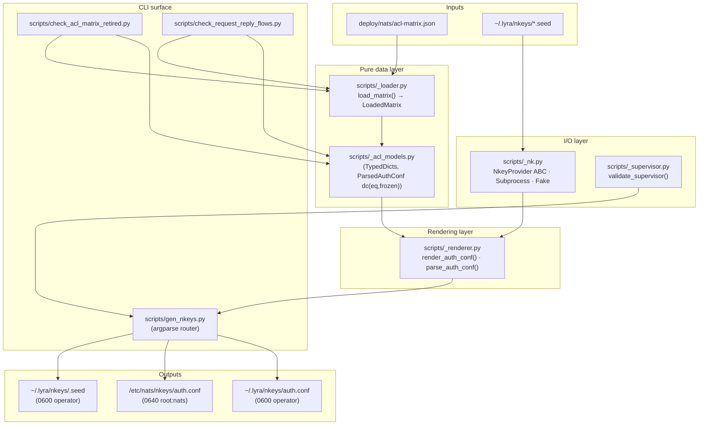
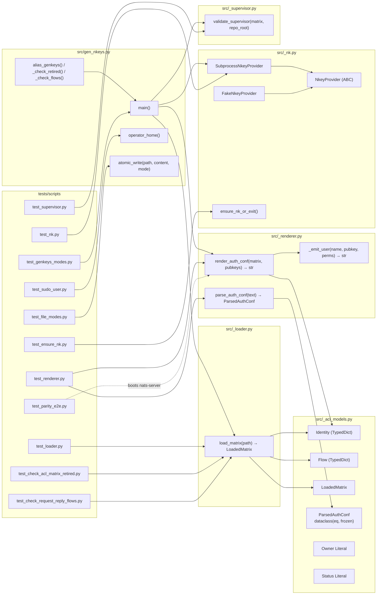

## Summary

Port `deploy/nats/gen-nkeys.sh` (702 LOC) plus the two CI sibling
validators to typed Python under `scripts/`, with rule-level negative
tests and a real-NATS authorization e2e gate. Three slices (read-only
Python with console-script wiring → key-aware modes → parity gate +
caller swap + bash deletion), 36 micro-tasks, ~5 working days.

## Architecture





## Bootstrap Context

Read in order before starting:

1. `artifacts/frames/1017-migrate-gen-nkeys-py-frame.mdx` — constraints (parity bar, sudo model, NkeyProvider, file split).
2. `artifacts/analyses/1017-migrate-gen-nkeys-py-analysis.mdx` — Shape C selection, mode catalog, dual-write at `gen-nkeys.sh:681`, `nk` install via CI step.
3. `artifacts/specs/1017-migrate-gen-nkeys-py-spec.mdx` — Breadboard, 3 slices, 24 acceptance criteria, ParsedAuthConf is `dataclass(eq=True, frozen=True)`.
4. `deploy/nats/gen-nkeys.sh` — the 702-LOC source-of-truth being ported. Port behaviorally, not line-by-line.
5. Reference patterns (read briefly):
   - `tests/deploy/test_gen_supervisor_conf.py` — existing deploy-script test harness (subprocess + dry-run + timeout + diagnostic capture).
   - `.github/workflows/ci.yml:29-41` — `nats-server` install pattern; mirror this for `nk` install (curl + sha256 + tar + install).
   - `scripts/check-acl-matrix-retired.sh`, `scripts/check-request-reply-flows.sh` — sibling validators (exact behavior to port).
6. `pyproject.toml` — `[project.scripts]` block (existing entries: `lyra`, `lyra-agent`); the new entries follow the same pattern.

Two χ items in spec, both defer-to-implementation:
- `_io.atomic_write` / `operator_home` — inline into `gen_nkeys.py` unless a third caller emerges.
- Mutation-survives-removal — manual checklist in test docstrings; reviewer spot-checks.

## Agents

| Agent | Instances | Task count | Files (representative) |
|---|---|---:|---|
| tester | tester-A, tester-B | 13 | `tests/scripts/conftest.py`, all `test_*.py` |
| backend-dev | backend-dev-A, backend-dev-B, backend-dev-C | 13 | `scripts/_acl_models.py`, `_loader.py`, `_renderer.py`, `_supervisor.py`, `_nk.py`, `gen_nkeys.py`, `check_*.py` |
| devops | devops-A | 7 | `pyproject.toml`, `Makefile`, `.github/workflows/ci.yml`, `.importlinter`, bash file deletions |
| doc-writer | doc-writer-A | 3 | `docs/ops/nats-identity-retirement.md`, `docs/ops/nkey-rotation.md`, `docs/GETTING-STARTED.md` |

## Wave Structure

16 waves, max 3 parallel agents. Estimated elapsed ~5 working days
vs ~9 sequential.

| Wave | Trigger | Agents | Tasks |
|------|---------|--------|-------|
| W1 | start | 1 | tester-A: T01 |
| W2 | T01 done | 2 ∥ | tester-A: T02→T05; tester-B: T03→T04→T06 |
| W3 | W2 done | 1 | backend-dev-A: T07 |
| W4 | T07 done | 3 ∥ | backend-dev-A: T08; backend-dev-B: T09→T10; backend-dev-C: T11→T12→T13 |
| W5 | W4 done | 1 | backend-dev-A: T14 |
| W6 | T14 done | 1 | devops-A: T15→T16 |
| W7 | W6 done | 1 | tester-A: T17 (RED-GATE-V1) |
| W8 | T17 done | 2 ∥ | tester-A: T18→T20→T22; tester-B: T19→T21 |
| W9 | W8 done | 1 | backend-dev-A: T23→T24 |
| W10 | T24 done | 1 | tester-B: T25 (RED-GATE-V2) |
| W11 | T25 done | 2 ∥ | tester-A: T26; devops-A: T27 |
| W12 | W11 done | 1 | tester-A: T28 (RED-GATE-V3a) |
| W13 | T28 done | 2 ∥ | devops-A: T29→T30; doc-writer-A: T31→T32→T33 |
| W14 | W13 done | 1 | tester-A: T34 (RED-GATE-V3b) |
| W15 | T34 done | 1 | devops-A: T35 |
| W16 | T35 done | 1 | tester-A: T36 (RED-GATE-V3c) |

## Consistency Report

- Acceptance criteria covered: 24/24
- Unmapped criteria: 0
- Untraced tasks: 0 (every task carries a `Spec trace`)
- Slice coverage: V1 → 17 tasks, V2 → 8 tasks, V3 → 11 tasks
- Exemptions: none

## Micro-Tasks

### Slice V1 — Read-only Python + console-script wiring

#### V1-RED — failing tests first

**T01 [P=N] tester-A · V1 · RED · diff=2 · ~10min**
- Files: `tests/scripts/conftest.py`, `tests/scripts/__init__.py`, `tests/scripts/fixtures/v2-prod.json`, `tests/scripts/fixtures/v1-legacy.json`, `tests/scripts/fixtures/v2-with-retired.json`
- Snippet: `FakeNkeyProvider` with deterministic pubkeys `f"UDET{name.upper().replace('-','')}"`; pytest fixtures `prod_matrix`, `legacy_matrix`, `with_retired_matrix`; helper `bash_render(matrix_path) -> str` that shells out to `deploy/nats/gen-nkeys.sh --template-only --matrix <path>` for parity comparisons.
- Verify: `uv run pytest tests/scripts/conftest.py --collect-only`
- Expected: collection succeeds, 0 tests
- Spec trace: SC-1, SC-4, SC-9
- Ref: `tests/deploy/test_gen_supervisor_conf.py` (subprocess pattern)

**T02 [P=Y after T01] tester-A · V1 · RED · diff=4 · ~25min**
- Files: `tests/scripts/test_loader.py`
- Snippet: positive: `load_matrix(prod_matrix_path)` returns `LoadedMatrix` with all five fields populated. Negatives (≥10): missing `owner` field; missing `status`; invalid `status`; invalid `owner`; invalid `version`; missing `created_at`; bad date format on `retired_at`; duplicate `(requester, responder)` flow pair; v1 + v2 fixture parity. Each negative names its guard in docstring.
- Verify: `uv run pytest tests/scripts/test_loader.py`
- Expected: all tests fail (no `_loader` impl yet)
- Spec trace: SC-9, SC-10
- Ref: `tests/scripts/conftest.py` (T01)

**T03 [P=Y after T01] tester-B · V1 · RED · diff=4 · ~25min**
- Files: `tests/scripts/test_renderer.py`
- Snippet: parity test — `render_auth_conf(prod_matrix, FakeNkeyProvider)` ≡ (parsed equality) with `bash_render(prod_matrix_path)`. Unit tests for: `_emit_user` rendering, retired identity exclusion, `allow_responses` flag honored, inbox-grant derivation from `request_reply_flows`, NATS subject charset on emit, parser idempotence (`parse(render(m)) == parse(parse(render(m)))`).
- Verify: `uv run pytest tests/scripts/test_renderer.py`
- Expected: fail (no `_renderer`)
- Spec trace: SC-4, SC-5, SC-6, SC-22

**T04 [P=Y after T01] tester-B · V1 · RED · diff=3 · ~15min**
- Files: `tests/scripts/test_supervisor.py`
- Snippet: positive: all `owner==lyra` identities present in `deploy/conf.d/lyra-*.conf` or `deploy/quadlet/*.container` with `NATS_NKEY_SEED_PATH` wiring → returns `[]`. Negative: deliberately missing wiring → returns error list naming the unwired identity. Use temp-dir fixtures for `repo_root` to avoid coupling to live deploy files.
- Verify: `uv run pytest tests/scripts/test_supervisor.py`
- Expected: fail (no `_supervisor`)
- Spec trace: SC-3 (validate-supervisor parity)

**T05 [P=Y after T01] tester-A · V1 · RED · diff=3 · ~15min**
- Files: `tests/scripts/test_check_acl_matrix_retired.py`
- Snippet: cover all 5 error classes from `check-acl-matrix-retired.sh`: missing status, missing created_at, bad date format, retired-without-retired_at, retired-still-in-flows. Each as paired (pass + fail) fixtures. Positive case: `prod_matrix` exits 0.
- Verify: `uv run pytest tests/scripts/test_check_acl_matrix_retired.py`
- Expected: fail
- Spec trace: SC-3 (sibling parity)

**T06 [P=Y after T01] tester-B · V1 · RED · diff=3 · ~20min**
- Files: `tests/scripts/test_check_request_reply_flows.py`
- Snippet: cover behaviors from `check-request-reply-flows.sh`: missing requester identity, missing responder identity, subject not covered by requester's publish (NATS-wildcard-aware), `>` suffix matching. Negative tests must mutate the parsed `LoadedMatrix`, not the JSON file.
- Verify: `uv run pytest tests/scripts/test_check_request_reply_flows.py`
- Expected: fail
- Spec trace: SC-3 (sibling parity)

#### V1-GREEN — implementation

**T07 [P=N] backend-dev-A · V1 · GREEN · diff=2 · ~15min**
- Files: `scripts/_acl_models.py`
- Snippet: `Owner = Literal["lyra","voicecli","imagecli","reserved"]`; `Status = Literal["active","retired"]`; `Identity(TypedDict)`, `Flow(TypedDict)`, `LoadedMatrix(TypedDict)`. `@dataclass(eq=True, frozen=True) class ParsedAuthConf` with fields: `default_publish_deny: tuple[str,...]`, `default_subscribe_deny: tuple[str,...]`, `users: tuple[ParsedUser,...]`. `ParsedUser` with `nkey: str`, `publish_allow: frozenset[str]`, `subscribe_allow: frozenset[str]`, `allow_responses: bool`, `comment_name: str`.
- Verify: `uv run pyright scripts/_acl_models.py`
- Expected: 0 errors
- Spec trace: SC-1, SC-23

**T08 [P=N] backend-dev-A · V1 · GREEN · diff=4 · ~40min**
- Files: `scripts/_loader.py`
- Snippet: `load_matrix(path: Path) -> LoadedMatrix` — uses `json.loads`, validates: file exists, `version in {"1","2"}`, every identity has all required fields, status/owner enum membership, date format on `created_at`/`retired_at`, no duplicate `(requester, responder)` flow pairs, retired identities are filtered from active set. Errors: `SystemExit(1)` with message prefixed `error: acl-matrix.json: ...`.
- Verify: `uv run pytest tests/scripts/test_loader.py -x`
- Expected: green
- Spec trace: SC-1, SC-9, SC-10
- Ref: `gen-nkeys.sh:58–145` (load_matrix bash source)

**T09 [P=Y after T07] backend-dev-B · V1 · GREEN · diff=4 · ~50min**
- Files: `scripts/_renderer.py`
- Snippet: `render_auth_conf(matrix: LoadedMatrix, pubkeys: dict[str,str]) -> str` builds the HOCON-ish output via structured emit (string list joined). `_emit_user(name, pubkey, pub_allow, sub_allow, allow_responses) -> str`. Flow → inbox-grant derivation: for each flow, append `_inbox.<requester>.>` to responder's publish allow if not present. `parse_auth_conf(text: str) -> ParsedAuthConf` — recursive-descent parser targeting the exact subset bash emits (curly-brace blocks, bareword keys, `# ` comments, no commas between block items). Skips header lines starting with `#`.
- Verify: `uv run pytest tests/scripts/test_renderer.py -x`
- Expected: green; parity test (T03's bash-vs-python comparison) passes.
- Spec trace: SC-4, SC-5, SC-22, SC-23
- Ref: `gen-nkeys.sh:263–284` (render_auth_conf), `gen-nkeys.sh:176–192` (emit_user)

**T10 [P=Y after T08] backend-dev-B · V1 · GREEN · diff=3 · ~30min**
- Files: `scripts/_supervisor.py`
- Snippet: `validate_supervisor(matrix: LoadedMatrix, repo_root: Path) -> list[str]` — for each `owner==lyra` identity, glob `repo_root/deploy/conf.d/lyra-*.conf` and `repo_root/deploy/quadlet/*.container`; assert ≥1 file references `NATS_NKEY_SEED_PATH=<seed-name>` for that identity; returns list of error strings (empty = pass). CLI dispatcher in `gen_nkeys.py` does `if errors: print(*errors, sep="\n", file=sys.stderr); sys.exit(1)`.
- Verify: `uv run pytest tests/scripts/test_supervisor.py -x`
- Expected: green
- Spec trace: SC-3
- Ref: `gen-nkeys.sh:197–224` (validate_supervisor)

**T11 [P=Y after T07] backend-dev-C · V1 · GREEN · diff=3 · ~25min**
- Files: `scripts/_nk.py`
- Snippet: `class NkeyProvider(ABC)` with `gen_seed() -> bytes`, `pubkey_from_seed(seed: bytes) -> str`. `class FakeNkeyProvider(NkeyProvider)` — deterministic per `name` for tests. `SubprocessNkeyProvider` and `ensure_nk_or_exit` are stubs at this stage (raise `NotImplementedError`); fully implemented in T23.
- Verify: `uv run pyright scripts/_nk.py`; `uv run pytest tests/scripts/conftest.py --collect-only`
- Expected: 0 errors; collection succeeds.
- Spec trace: SC-1

**T12 [P=Y after T08] backend-dev-C · V1 · GREEN · diff=3 · ~25min**
- Files: `scripts/check_acl_matrix_retired.py`
- Snippet: thin CLI: `argparse` accepts `--matrix <path>` (default `deploy/nats/acl-matrix.json`), calls `_loader.load_matrix(path)`, then explicit per-identity assertions (mirror the bash exit-1-with-message pattern). Loaded matrix already filters retired from `IDENTITIES`, so iterate `matrix["identities"]` raw to check the retired subset.
- Verify: `uv run pytest tests/scripts/test_check_acl_matrix_retired.py -x`
- Expected: green
- Spec trace: SC-3
- Ref: `scripts/check-acl-matrix-retired.sh`

**T13 [P=Y after T08] backend-dev-C · V1 · GREEN · diff=4 · ~40min**
- Files: `scripts/check_request_reply_flows.py`
- Snippet: thin CLI: load matrix, assert flow existence + identity existence + subject-coverage (NATS-wildcard-aware: exact match OR grant ends with `.>` AND subject equals or starts with the prefix-without-`>`). Mirror bash exit-1 pattern.
- Verify: `uv run pytest tests/scripts/test_check_request_reply_flows.py -x`
- Expected: green
- Spec trace: SC-3
- Ref: `scripts/check-request-reply-flows.sh`

**T14 [P=N] backend-dev-A · V1 · GREEN · diff=4 · ~45min**
- Files: `scripts/gen_nkeys.py`
- Snippet: top-level `main()` builds an argparse subcommand router: `genkeys` (with all genkeys flags as one subcommand), `validate-supervisor`, `check {retired,flows}`. For Slice 1 only `--template-only`, `--validate-supervisor`, `check retired`, `check flows` are wired to handlers; the remaining genkeys flags exit with `SystemExit("not yet implemented in this slice")` to keep CI green. Three alias helpers: `alias_genkeys()`, `_check_retired()`, `_check_flows()` — each does `sys.argv.insert(1, "<sub>"); main()`.
- Verify: `uv run python scripts/gen_nkeys.py genkeys --template-only --matrix tests/scripts/fixtures/v2-prod.json | head -3`
- Expected: prints rendered HOCON-ish header lines.
- Spec trace: SC-2, SC-3
- Ref: `gen-nkeys.sh:236–246` (mode dispatch)

#### V1-REFACTOR

**T15 [P=Y after T14] devops-A · V1 · REFACTOR · diff=2 · ~10min**
- Files: `pyproject.toml`
- Snippet:
  ```toml
  [project.scripts]
  lyra = "lyra.cli:lyra_main"
  lyra-agent = "lyra.cli:agent_main"
  lyra-acl = "scripts.gen_nkeys:main"
  lyra-genkeys = "scripts.gen_nkeys:alias_genkeys"
  lyra-check-acl-retired = "scripts.gen_nkeys:_check_retired"
  lyra-check-flows = "scripts.gen_nkeys:_check_flows"
  ```
- Verify: `uv sync && which lyra-acl && lyra-acl genkeys --template-only --matrix tests/scripts/fixtures/v2-prod.json | head -3`
- Expected: shim in `.venv/bin/lyra-acl`; command produces output.
- Spec trace: SC-2

**T16 [P=Y after T14] devops-A · V1 · REFACTOR · diff=2 · ~10min**
- Files: `.importlinter` (or a focused pytest)
- Snippet: contract `forbidden` — `name = scripts/* must not import from lyra.*`. If importlinter is not already configured for this kind of cross-package check, write `tests/scripts/test_no_lyra_imports.py` that walks `scripts/*.py` AST and asserts no `import lyra` / `from lyra` lines.
- Verify: `uv run lint-imports` OR `uv run pytest tests/scripts/test_no_lyra_imports.py`
- Expected: 0 violations.
- Spec trace: SC-19

#### V1-RED-GATE

**T17 [P=N] tester-A · V1 · RED-GATE · diff=2 · ~10min**
- Files: none (verification task)
- Snippet: run the full Slice 1 suite; if green, Slice 1 ships.
- Verify: `uv run pytest tests/scripts -k 'not e2e'` and `uv run pyright scripts tests/scripts` and `uv run ruff check scripts tests/scripts` and `uv run ruff format --check scripts tests/scripts`
- Expected: all four green; manual: `lyra-acl genkeys --template-only --matrix tests/scripts/fixtures/v2-prod.json` exits 0.
- Spec trace: V1 demo, SC-21, SC-22

### Slice V2 — Key-aware modes

#### V2-RED

**T18 [P=Y after T17] tester-A · V2 · RED · diff=3 · ~20min**
- Files: `tests/scripts/test_nk.py`
- Snippet: integration test exercising `SubprocessNkeyProvider` against a real `nk` binary on `$PATH`. Pytest skip if `nk` absent locally (CI installs it explicitly). One roundtrip: `gen_seed()` → `pubkey_from_seed(seed)` → assert pubkey starts with `U` (NATS user pubkey prefix).
- Verify: `uv run pytest tests/scripts/test_nk.py`
- Expected: fail (no SubprocessNkeyProvider impl)
- Spec trace: SC-1

**T19 [P=Y after T17] tester-B · V2 · RED · diff=4 · ~40min**
- Files: `tests/scripts/test_genkeys_modes.py`
- Snippet: per-mode tests using `FakeNkeyProvider` injected via DI. `--regen-authconf` writes `~/.lyra/nkeys/auth.conf` parity-equivalent to bash. `--emit-merged-authconf` produces merged-output stdout. `--regenerate --yes` produces both system and user auth.conf. `--show` reads back. `--fix-perms` adjusts modes. Default (no flag) full provisioning writes both `/etc/nats/nkeys/auth.conf` and `~/.lyra/nkeys/auth.conf` (dual-write per `gen-nkeys.sh:681`). All paths under tmp_path; XDG-style dir overrides via env or fixture.
- Verify: `uv run pytest tests/scripts/test_genkeys_modes.py`
- Expected: fail
- Spec trace: SC-2, SC-5, SC-6

**T20 [P=Y after T18] tester-A · V2 · RED · diff=3 · ~15min**
- Files: `tests/scripts/test_sudo_user.py`
- Snippet: monkeypatch `os.environ["SUDO_USER"]` to a fixture user, monkeypatch `pwd.getpwnam` to return a custom home; call `operator_home()`; assert returned path is the fixture user's home, not `/root`. Negative test without `SUDO_USER` falls back to `Path.home()`.
- Verify: `uv run pytest tests/scripts/test_sudo_user.py`
- Expected: fail
- Spec trace: SC-7

**T21 [P=Y after T19] tester-B · V2 · RED · diff=3 · ~15min**
- Files: `tests/scripts/test_file_modes.py`
- Snippet: after each write mode, assert `oct(os.stat(p).st_mode)[-4:]` matches expected: `0600` for seeds + user auth.conf + .bak; `0640` for system auth.conf. Write through `tempfile.NamedTemporaryFile` + `os.replace` is atomic — test intermediate state never observable.
- Verify: `uv run pytest tests/scripts/test_file_modes.py`
- Expected: fail
- Spec trace: SC-5, SC-6

**T22 [P=Y after T20] tester-A · V2 · RED · diff=2 · ~10min**
- Files: `tests/scripts/test_ensure_nk.py`
- Snippet: monkeypatch `shutil.which("nk")` to return `None`; call any genkeys mode that needs `nk`; assert `SystemExit(1)`; assert stderr contains `apt install nats-tools` AND `https://github.com/nats-io/nkeys/releases`.
- Verify: `uv run pytest tests/scripts/test_ensure_nk.py`
- Expected: fail
- Spec trace: SC-8

#### V2-GREEN

**T23 [P=N after T18,T22] backend-dev-A · V2 · GREEN · diff=3 · ~25min**
- Files: `scripts/_nk.py`
- Snippet: implement `SubprocessNkeyProvider.gen_seed()` (`subprocess.run(["nk", "-gen", "user"], ...)` parsing stdout) and `pubkey_from_seed(seed)` (`subprocess.run(["nk", "-inkey", "-", "-pubout"], input=seed, ...)`). `ensure_nk_or_exit()` checks `shutil.which("nk")`, exits 1 with the install hint string from spec. No auto-download.
- Verify: `uv run pytest tests/scripts/test_nk.py tests/scripts/test_ensure_nk.py`
- Expected: green
- Spec trace: SC-1, SC-8

**T24 [P=N after T23,T19,T20,T21] backend-dev-A · V2 · GREEN · diff=5 · ~90min**
- Files: `scripts/gen_nkeys.py`
- Snippet: wire all key-aware modes through the argparse router. Add `operator_home()` helper (`os.environ.get("SUDO_USER")` → `pwd.getpwnam(...).pw_dir` else `Path.home()`); `atomic_write(path, content, mode)` helper (NamedTemporaryFile delete=False → chmod → replace). Mode handlers: `--regen-authconf` (re-render from existing seeds), `--emit-merged-authconf` (lyra+voicecli combined), `--regenerate [--yes]` (atomic backup + wipe + regen, requires root via `os.geteuid()==0`), `--show` (reads system auth.conf, root required), `--fix-perms` (chown/chmod system + user, root required), default (full provisioning + dual-write at line 681 — system 0640 root:nats, user 0600 operator).
- Verify: `uv run pytest tests/scripts/test_genkeys_modes.py tests/scripts/test_sudo_user.py tests/scripts/test_file_modes.py`
- Expected: green
- Spec trace: SC-2, SC-5, SC-6, SC-7
- Ref: `gen-nkeys.sh:370–425` (regen-authconf), `:300–365` (emit-merged), `:498–578` (regenerate), `:430–465` (full mode)

#### V2-RED-GATE

**T25 [P=N] tester-B · V2 · RED-GATE · diff=2 · ~10min**
- Files: none
- Snippet: full unit suite green; manual check of `lyra-acl genkeys --regen-authconf --matrix tests/scripts/fixtures/v2-prod.json` against `bash deploy/nats/gen-nkeys.sh --regen-authconf --matrix ...` — `parse_auth_conf` of both outputs must compare equal.
- Verify: `uv run pytest tests/scripts -k 'not e2e'` and `uv run pyright scripts tests/scripts` and the manual parity diff
- Expected: green; parity diff empty.
- Spec trace: V2 demo

### Slice V3 — Parity gate + caller swap + bash deletion

#### V3a — parity gate green

**T26 [P=Y after T25] tester-A · V3 · RED · diff=5 · ~75min**
- Files: `tests/scripts/test_parity_e2e.py`
- Snippet: pytest fixture starts `nats-server` in a subprocess with the rendered `auth.conf` (`subprocess.Popen(["nats-server", "-c", str(rendered_path), "-ms", "8222"])`); polls `http://localhost:8222/healthz` with 3s timeout; on shutdown, terminates and joins. Test connects (`nats-py`) as one identity per role-class with the matching seed (operator=hub, adapter=telegram-adapter, worker=clipool-worker), then attempts the publish/subscribe subjects in their grants and one not in their grants — asserts allow/deny matches expectation. Retired identity: connect attempt rejects.
- Verify: `uv run pytest tests/scripts/test_parity_e2e.py`
- Expected: fail locally if `nats-server` not on PATH; CI installs it (T27 mirrors that).
- Spec trace: SC-11, SC-12

**T27 [P=Y after T25] devops-A · V3 · GREEN · diff=3 · ~20min**
- Files: `.github/workflows/ci.yml`
- Snippet: add a setup step (parallel to the existing `nats-server` install at lines 29–41) that downloads + sha256-verifies `nk` from `nats-io/nkeys` releases and installs to `/usr/local/bin/nk`. Pin version (e.g. `0.4.0`); template the curl/sha256/tar/install pattern from the nats-server step. The step runs before the parity-e2e job.
- Verify: lint workflow with `actionlint` (or `gh workflow view`); CI run shows `nk` available.
- Expected: ci.yml passes lint; subsequent CI run installs nk.
- Spec trace: SC-13
- Ref: `.github/workflows/ci.yml:29-41` (nats-server install pattern)

**T28 [P=N] tester-A · V3 · RED-GATE · diff=2 · ~5min**
- Files: none
- Snippet: parity-e2e test green in CI on a draft PR (or local run with `nk` + `nats-server` installed). This is the "Slice 3a green" milestone — no caller swap before this.
- Verify: open draft PR; observe parity-e2e job green
- Expected: green
- Spec trace: SC-11, SC-12

#### V3b — caller swap

**T29 [P=Y after T28] devops-A · V3 · GREEN · diff=2 · ~15min**
- Files: `.github/workflows/ci.yml` (lines 70, 73)
- Snippet: replace `bash scripts/check-acl-matrix-retired.sh` and `bash scripts/check-request-reply-flows.sh` with `uv run lyra-check-acl-retired` and `uv run lyra-check-flows`.
- Verify: workflow lint; CI run shows the new commands.
- Expected: green
- Spec trace: SC-14

**T30 [P=Y after T28] devops-A · V3 · GREEN · diff=3 · ~25min**
- Files: `Makefile` (lines 197, 271, 331)
- Snippet: replace `./deploy/nats/gen-nkeys.sh --emit-merged-authconf`, the SSH-heredoc invocation of `bash deploy/nats/gen-nkeys.sh --regen-authconf`, and the local `bash deploy/nats/gen-nkeys.sh --regen-authconf` with `lyra-acl genkeys --emit-merged-authconf` / `lyra-acl genkeys --regen-authconf` (over SSH the venv shim is in PATH; for root-required modes the runbook documents `sudo env "PATH=$PATH" lyra-acl ...`, but these three Makefile sites are the no-root modes per the analysis call-site sweep).
- Verify: `make remote nats-regen-authconf` (or local equivalent against a fixture)
- Expected: succeeds with same output as bash
- Spec trace: SC-15

**T31 [P=Y after T28] doc-writer-A · V3 · GREEN · diff=2 · ~10min**
- Files: `docs/ops/nats-identity-retirement.md`
- Snippet: lines 49 and 111 — drop `sudo` prefix on the `--regen-authconf` invocations; update command to `lyra-acl genkeys --regen-authconf` (or the alias `lyra-genkeys --regen-authconf`).
- Verify: `grep -n "sudo .*regen-authconf" docs/ops/nats-identity-retirement.md` returns 0 lines.
- Expected: 0 matches
- Spec trace: SC-16

**T32 [P=Y after T31] doc-writer-A · V3 · GREEN · diff=2 · ~5min**
- Files: `docs/ops/nkey-rotation.md`
- Snippet: line 105 — same fix; line 63 (`sudo --show`) stays as-is (correct — `--show` reads `/etc/nats/`).
- Verify: `grep -n "sudo .*regen-authconf" docs/ops/nkey-rotation.md` returns 0 lines.
- Expected: 0 matches
- Spec trace: SC-16

**T33 [P=Y after T32] doc-writer-A · V3 · GREEN · diff=2 · ~10min**
- Files: `docs/GETTING-STARTED.md` (or whichever first-run doc exists)
- Snippet: add a one-line note: "If `nk` is not installed: `apt install nats-tools` (or download from https://github.com/nats-io/nkeys/releases and place at `/usr/local/bin/nk`)."
- Verify: `grep -n 'nats-tools' docs/GETTING-STARTED.md`
- Expected: ≥1 match
- Spec trace: SC-8 (operator surface)

**T34 [P=N] tester-A · V3 · RED-GATE · diff=2 · ~5min**
- Files: none
- Snippet: CI green on the swapped path — Python entries are running both validators and the Makefile target works locally.
- Verify: PR CI run green; local `make remote-status-or-equivalent`
- Expected: green
- Spec trace: SC-14, SC-15

#### V3c — bash deletion

**T35 [P=N] devops-A · V3 · GREEN · diff=2 · ~5min**
- Files: `deploy/nats/gen-nkeys.sh`, `scripts/check-acl-matrix-retired.sh`, `scripts/check-request-reply-flows.sh`
- Snippet: `git rm` the three files. No replacement — the Python ports are now sole authoritative implementation.
- Verify: `git ls-files | grep -E '(gen-nkeys\.sh|check-acl-matrix-retired\.sh|check-request-reply-flows\.sh)$'` returns nothing.
- Expected: 0 matches
- Spec trace: SC-17

**T36 [P=N] tester-A · V3 · RED-GATE · diff=2 · ~10min**
- Files: none
- Snippet: final CI run on the deletion commit.
- Verify: PR CI green; `git ls-files | grep '\.sh$' | xargs grep -l 'gen-nkeys\|check-acl\|check-request-reply'` returns nothing.
- Expected: green; 0 stale references.
- Spec trace: SC-17, V3 demo

## Task Seeding Blueprint

<!-- Used by /implement to seed TaskCreate calls on session start.
     Format: T{n} | agent-instance | blockedBy | subject
     blockedBy refs T-numbers within this list (not session task IDs).
     Wave heading comments state the trigger. -->

### Wave 1 — start, 1 agent

| Task | Agent instance | blockedBy | Subject |
|------|---------------|-----------|---------|
| T01 | tester-A | — | conftest + fixtures (v2-prod, v1-legacy, with-retired) |

### Wave 2 — after T01, 2 agents ∥

| Task | Agent instance | blockedBy | Subject |
|------|---------------|-----------|---------|
| T02 | tester-A | T01 | test_loader.py (load_matrix invariants + ≥10 negatives) |
| T03 | tester-B | T01 | test_renderer.py (render+parse+parity vs bash) |
| T04 | tester-B | T03 | test_supervisor.py (supervisor wiring) |
| T05 | tester-A | T02 | test_check_acl_matrix_retired.py |
| T06 | tester-B | T04 | test_check_request_reply_flows.py |

### Wave 3 — after Wave 2, 1 agent

| Task | Agent instance | blockedBy | Subject |
|------|---------------|-----------|---------|
| T07 | backend-dev-A | T02,T03,T04,T05,T06 | scripts/_acl_models.py (TypedDicts, ParsedAuthConf dc) |

### Wave 4 — after T07, 3 agents ∥

| Task | Agent instance | blockedBy | Subject |
|------|---------------|-----------|---------|
| T08 | backend-dev-A | T07 | scripts/_loader.py |
| T09 | backend-dev-B | T07 | scripts/_renderer.py |
| T10 | backend-dev-B | T09 | scripts/_supervisor.py |
| T11 | backend-dev-C | T07 | scripts/_nk.py (ABC + Fake; Subprocess stubbed) |
| T12 | backend-dev-C | T11 | scripts/check_acl_matrix_retired.py |
| T13 | backend-dev-C | T12 | scripts/check_request_reply_flows.py |

### Wave 5 — after Wave 4, 1 agent

| Task | Agent instance | blockedBy | Subject |
|------|---------------|-----------|---------|
| T14 | backend-dev-A | T08,T10,T11,T12,T13 | scripts/gen_nkeys.py (argparse router; Slice-1 subcmds wired) |

### Wave 6 — after T14, 1 agent

| Task | Agent instance | blockedBy | Subject |
|------|---------------|-----------|---------|
| T15 | devops-A | T14 | pyproject.toml [project.scripts] (4 entries) |
| T16 | devops-A | T15 | importlinter contract scripts/ ↛ src/lyra/ |

### Wave 7 — after T16, 1 agent

| Task | Agent instance | blockedBy | Subject |
|------|---------------|-----------|---------|
| T17 | tester-A | T16 | RED-GATE-V1 (full Slice 1 suite green; demo runnable) |

### Wave 8 — after T17, 2 agents ∥

| Task | Agent instance | blockedBy | Subject |
|------|---------------|-----------|---------|
| T18 | tester-A | T17 | test_nk.py (SubprocessNkeyProvider integration) |
| T19 | tester-B | T17 | test_genkeys_modes.py (write modes + dual-write) |
| T20 | tester-A | T18 | test_sudo_user.py (SUDO_USER resolution) |
| T21 | tester-B | T19 | test_file_modes.py (0600/0640) |
| T22 | tester-A | T20 | test_ensure_nk.py (nk absence install hint) |

### Wave 9 — after Wave 8, 1 agent

| Task | Agent instance | blockedBy | Subject |
|------|---------------|-----------|---------|
| T23 | backend-dev-A | T18,T22 | scripts/_nk.py (SubprocessNkeyProvider + ensure_nk_or_exit) |
| T24 | backend-dev-A | T23,T19,T20,T21 | scripts/gen_nkeys.py (key-aware modes + helpers) |

### Wave 10 — after T24, 1 agent

| Task | Agent instance | blockedBy | Subject |
|------|---------------|-----------|---------|
| T25 | tester-B | T24 | RED-GATE-V2 (Slice 2 suite green + manual parity diff) |

### Wave 11 — after T25, 2 agents ∥

| Task | Agent instance | blockedBy | Subject |
|------|---------------|-----------|---------|
| T26 | tester-A | T25 | test_parity_e2e.py (boots nats-server, asserts auth) |
| T27 | devops-A | T25 | ci.yml — install `nk` setup step |

### Wave 12 — after Wave 11, 1 agent

| Task | Agent instance | blockedBy | Subject |
|------|---------------|-----------|---------|
| T28 | tester-A | T26,T27 | RED-GATE-V3a (parity-e2e green on draft PR) |

### Wave 13 — after T28, 2 agents ∥

| Task | Agent instance | blockedBy | Subject |
|------|---------------|-----------|---------|
| T29 | devops-A | T28 | ci.yml:70,73 → Python entry points |
| T30 | devops-A | T29 | Makefile:197,271,331 → Python entry points |
| T31 | doc-writer-A | T28 | docs/ops/nats-identity-retirement.md sudo strip |
| T32 | doc-writer-A | T31 | docs/ops/nkey-rotation.md sudo strip |
| T33 | doc-writer-A | T32 | docs/GETTING-STARTED.md nk install one-liner |

### Wave 14 — after Wave 13, 1 agent

| Task | Agent instance | blockedBy | Subject |
|------|---------------|-----------|---------|
| T34 | tester-A | T30,T33 | RED-GATE-V3b (CI green on swapped path) |

### Wave 15 — after T34, 1 agent

| Task | Agent instance | blockedBy | Subject |
|------|---------------|-----------|---------|
| T35 | devops-A | T34 | git rm 3 bash scripts |

### Wave 16 — after T35, 1 agent

| Task | Agent instance | blockedBy | Subject |
|------|---------------|-----------|---------|
| T36 | tester-A | T35 | RED-GATE-V3c (final CI green; 0 stale refs) |

## Task IDs

<!-- Generated by /plan. Used by /implement to resume tasks on session restart. -->

- T01: 12 — conftest + fixtures
- T02: 13 — test_loader.py
- T03: 14 — test_renderer.py
- T04: 15 — test_supervisor.py
- T05: 16 — test_check_acl_matrix_retired.py
- T06: 17 — test_check_request_reply_flows.py
- T07: 18 — scripts/_acl_models.py
- T08: 19 — scripts/_loader.py
- T09: 20 — scripts/_renderer.py
- T10: 21 — scripts/_supervisor.py
- T11: 22 — scripts/_nk.py (Slice 1 stub)
- T12: 23 — scripts/check_acl_matrix_retired.py
- T13: 24 — scripts/check_request_reply_flows.py
- T14: 25 — scripts/gen_nkeys.py (router, Slice 1)
- T15: 26 — pyproject.toml [project.scripts]
- T16: 27 — importlinter contract
- T17: 28 — RED-GATE-V1
- T18: 29 — test_nk.py
- T19: 30 — test_genkeys_modes.py
- T20: 31 — test_sudo_user.py
- T21: 32 — test_file_modes.py
- T22: 33 — test_ensure_nk.py
- T23: 34 — scripts/_nk.py (SubprocessNkeyProvider)
- T24: 35 — scripts/gen_nkeys.py (key-aware modes)
- T25: 36 — RED-GATE-V2
- T26: 37 — test_parity_e2e.py
- T27: 38 — ci.yml nk install
- T28: 39 — RED-GATE-V3a
- T29: 40 — ci.yml:70,73 swap
- T30: 41 — Makefile swap
- T31: 42 — runbook 1 sudo strip
- T32: 43 — runbook 2 sudo strip
- T33: 44 — GETTING-STARTED nk install
- T34: 45 — RED-GATE-V3b
- T35: 46 — bash deletion
- T36: 47 — RED-GATE-V3c
