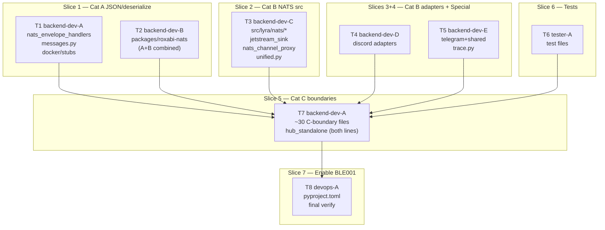
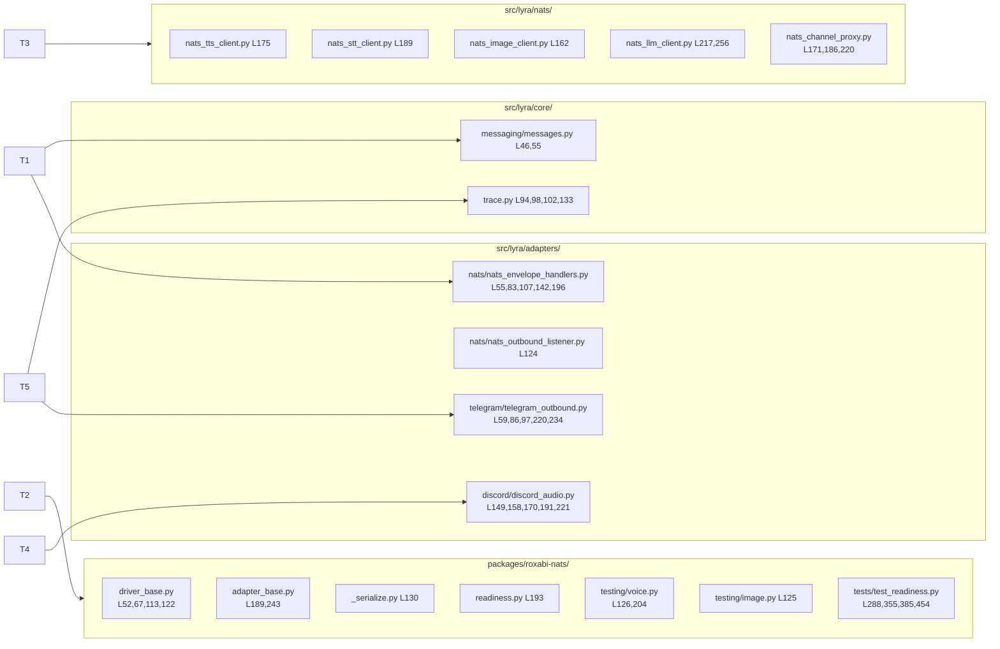

## Summary

Mechanical fix: replace 121 blind `except Exception:` catches across 67 files with specific
exception types or justified `# noqa: BLE001` comments, then enable BLE001 in pyproject.toml.
File-partitioned across 6 parallel agents in wave 1 to prevent conflicts.

## Architecture





## Bootstrap Context

From analysis `artifacts/analyses/1018-fix-ble001-violations-analysis.mdx`:
- Actual category B count (~47) is 2× the issue estimate; category C (~38) is 3× estimate
- `driver_base.py` and `adapter_base.py` (roxabi-nats) have violations in both Cat A and Cat B → T2 handles both to avoid split-file edits
- `hub_standalone.py` has violations in both S2 (L277, NATS close) and S5 (L83, sys.exit) → T7 handles both
- `nats.errors.Error` is confirmed root of full NATS error hierarchy including JetStream errors
- Category C requires per-site logging audit before adding noqa — log additions are behavioral changes; flag in PR

## Agents

| Agent | Tasks | Files |
|-------|-------|-------|
| backend-dev-A | T1, T7 | 4 + ~32 files |
| backend-dev-B | T2 | 6 pkg files |
| backend-dev-C | T3 | 9 src/lyra files |
| backend-dev-D | T4 | 6 discord files |
| backend-dev-E | T5 | 6 telegram+shared+trace files |
| tester-A | T6 | 5 test files |
| devops-A | T8 | 1 file |

## Wave Structure

3 waves, max 6 parallel agents. Elapsed ~4h parallel vs ~12h sequential.

| Wave | Trigger | Agents | Tasks |
|------|---------|--------|-------|
| 1 | start | 6 ∥ | backend-dev-A: T1 · backend-dev-B: T2 · backend-dev-C: T3 · backend-dev-D: T4 · backend-dev-E: T5 · tester-A: T6 |
| 2 | Wave 1 done | 1 | backend-dev-A: T7 |
| 3 | Wave 2 done | 1 | devops-A: T8 |

## Micro-Tasks

### S1/S2 — Category A + roxabi-nats (Wave 1)

---

**T1** · backend-dev-A · S1 · GREEN · parallel-safe: Y · difficulty: 2 · ~30min
**Fix Category A JSON/deserialize violations in src/ files**

Files:
- `src/lyra/adapters/nats/nats_envelope_handlers.py` — L55,83,107,142: `except (ValueError, TypeError)` · L196: `except (json.JSONDecodeError, ValueError)`
- `src/lyra/core/messaging/messages.py` — L46: `except (tomllib.TOMLDecodeError, OSError)` · L55: `except (KeyError, ValueError)`
- `docker/stubs/stt_stub.py` — L47: `except (json.JSONDecodeError, ValueError)`
- `docker/stubs/tts_stub.py` — L54: `except (json.JSONDecodeError, ValueError)`

```python
# Before (L196 example):
except Exception:
    log.warning("NatsOutboundListener: failed to decode message")
# After:
except (json.JSONDecodeError, ValueError):
    log.warning("NatsOutboundListener: failed to decode message")
```

Verify: `uv run ruff check --select BLE001 src/lyra/adapters/nats/nats_envelope_handlers.py src/lyra/core/messaging/messages.py docker/stubs/`
Expected: no BLE001 output for these files
Spec trace: SC-1, SC-4
Agent: backend-dev-A

---

**T2** · backend-dev-B · S1+S2 · GREEN · parallel-safe: Y · difficulty: 2 · ~30min
**Fix ALL packages/roxabi-nats violations (Cat A + Cat B combined)**

Files (fix ALL violations in one pass to avoid split-file conflicts):
- `packages/roxabi-nats/src/roxabi_nats/driver_base.py`
  - L67, L113: `except (json.JSONDecodeError, ValueError)` [Cat A]
  - L52, L122: `except nats.errors.Error` [Cat B]
- `packages/roxabi-nats/src/roxabi_nats/adapter_base.py`
  - L189: `except (json.JSONDecodeError, ValueError)` [Cat A]
  - L243: `except nats.errors.Error` [Cat B]
- `packages/roxabi-nats/src/roxabi_nats/_serialize.py`
  - L130: `except Exception  # noqa: BLE001  # get_type_hints: NameError/AttributeError from forward refs`
- `packages/roxabi-nats/src/roxabi_nats/readiness.py`
  - L193: `except nats.errors.Error`
- `packages/roxabi-nats/src/roxabi_nats/testing/voice.py`
  - L126, L204: `except nats.errors.Error  # connection closing during test teardown`
- `packages/roxabi-nats/src/roxabi_nats/testing/image.py`
  - L125: `except nats.errors.Error  # connection closing during test teardown`

Verify: `uv run ruff check --select BLE001 packages/roxabi-nats/src/`
Expected: 0 violations
Spec trace: SC-1, SC-6
Agent: backend-dev-B

---

### S2 — Category B NATS src (Wave 1)

---

**T3** · backend-dev-C · S2 · GREEN · parallel-safe: Y · difficulty: 2 · ~30min
**Fix Category B NATS transport ops in src/lyra/ (excl. hub_standalone — handled in T7)**

Files:
- `src/lyra/nats/nats_tts_client.py` L175: `except (nats.errors.Error, TimeoutError)`
- `src/lyra/nats/nats_stt_client.py` L189: `except (nats.errors.Error, TimeoutError)`
- `src/lyra/nats/nats_image_client.py` L162: `except (nats.errors.Error, TimeoutError)`
- `src/lyra/nats/nats_llm_client.py` L217, L256: `except (nats.errors.Error, TimeoutError)`
- `src/lyra/nats/nats_channel_proxy.py` L171, L186, L220: `except nats.errors.Error`
- `src/lyra/infrastructure/audit/jetstream_sink.py` L44, L66, L70, L90: `except nats.errors.Error`
- `src/lyra/adapters/nats/nats_outbound_listener.py` L124: `except nats.errors.Error`
- `src/lyra/bootstrap/factory/unified.py` L84: `except nats.errors.Error`
- `src/lyra/infrastructure/stores/sqlite_base.py` L35: `except Exception  # noqa: BLE001  # db teardown`

Verify: `uv run ruff check --select BLE001 src/lyra/nats/ src/lyra/infrastructure/ src/lyra/adapters/nats/nats_outbound_listener.py src/lyra/bootstrap/factory/unified.py`
Expected: 0 violations for these files
Spec trace: SC-6
Agent: backend-dev-C

---

### S3+S4 — Cat B adapters + Special (Wave 1)

---

**T4** · backend-dev-D · S3 · GREEN · parallel-safe: Y · difficulty: 2 · ~30min
**Fix Category B Discord adapter violations**

Files:
- `src/lyra/adapters/discord/discord_audio.py`
  - L149, L170, L191: `except discord.HTTPException`
  - L158: `except (discord.HTTPException, OSError)`
  - L221: `except Exception  # noqa: BLE001  # ThreadStore: non-fatal ownership check`
- `src/lyra/adapters/discord/discord_audio_outbound.py` L105, L159: `except discord.HTTPException`
- `src/lyra/adapters/discord/discord_inbound.py`
  - L83: `except Exception  # noqa: BLE001  # ThreadStore: non-fatal ownership check`
  - L140: `except Exception  # noqa: BLE001  # thread recovery: non-fatal persistence`
- `src/lyra/adapters/discord/discord_outbound.py` L79, L97: `except discord.HTTPException`
- `src/lyra/adapters/discord/lifecycle.py` L51, L67: `except discord.DiscordException`
- `src/lyra/adapters/discord/voice/discord_voice_commands.py` L52: `except discord.DiscordException`

```python
# Before:
except Exception:
    log.warning("Failed to send audio-too-large reply ...")
# After:
except discord.HTTPException:
    log.warning("Failed to send audio-too-large reply ...")
```

Verify: `uv run ruff check --select BLE001 src/lyra/adapters/discord/`
Expected: 0 violations
Spec trace: SC-1, SC-6
Agent: backend-dev-D

---

**T5** · backend-dev-E · S3+S4 · GREEN · parallel-safe: Y · difficulty: 2 · ~25min
**Fix Category B Telegram/shared adapter violations + trace.py ContextVar (Special)**

Files:
- `src/lyra/adapters/telegram/telegram_outbound.py` L59, L86, L97, L220, L234: `except TelegramError`
- `src/lyra/adapters/telegram/telegram_inbound.py` L177, L197: `except TelegramError`
- `src/lyra/adapters/shared/_shared_streaming_emitter.py` L148, L167, L248, L272: `except Exception  # noqa: BLE001  # streaming edit: any send failure is non-fatal`
- `src/lyra/adapters/shared/_inbound_cache.py` L95: `except Exception  # noqa: BLE001  # cache op: non-fatal`
- `src/lyra/adapters/shared/_shared_audio.py` L74: `except Exception  # noqa: BLE001  # audio op: non-fatal`
- `src/lyra/core/trace.py`
  - L94, L98, L102: `except LookupError  # ContextVar.get() — theoretically unreachable`
  - L133: `except Exception  # noqa: BLE001  # logging filter: must never raise`

Note: `TelegramError` — confirm import at top of file; aiogram exports it as `aiogram.exceptions.TelegramError` or `aiogram.utils.exceptions.TelegramError` depending on version. Check existing imports in the file first.

Verify: `uv run ruff check --select BLE001 src/lyra/adapters/telegram/ src/lyra/adapters/shared/ src/lyra/core/trace.py`
Expected: 0 violations
Spec trace: SC-1, SC-4
Agent: backend-dev-E

---

### S6 — Tests (Wave 1)

---

**T6** · tester-A · S6 · GREEN · parallel-safe: Y · difficulty: 1 · ~20min
**Fix Category D test violations**

Files:
- `packages/roxabi-nats/tests/test_readiness.py` L288, L355, L385, L454: `except nats.js.errors.NotFoundError`
- `tests/core/test_pool_manager.py` L366, L373: `except Exception  # noqa: BLE001  # test error capture: any threading error is the test subject`
- `tests/core/test_cli_pool_streaming.py` L116: `except Exception  # noqa: BLE001  # test teardown`
- `tests/core/test_debouncer_pool.py` L195: `except Exception  # noqa: BLE001  # test teardown`
- `tests/core/test_pool_tasks.py` L276: `except Exception  # noqa: BLE001  # test teardown`

Note: `nats.js.errors.NotFoundError` — verify import path in roxabi-nats test context. Check existing imports in `test_readiness.py`.

Verify: `uv run ruff check --select BLE001 tests/ packages/roxabi-nats/tests/`
Expected: 0 violations
Spec trace: SC-7
Agent: tester-A

---

### S5 — Category C Error Boundaries (Wave 2)

---

**T7** · backend-dev-A · S5 · GREEN · difficulty: 3 · ~90min
**Audit and fix Category C error boundary violations (~38 violations, ~32 files)**

**Pre-condition (mandatory):** For each file, before adding `# noqa: BLE001`:
1. Read the 5 lines following each `except Exception` clause
2. Confirm `log.exception`, `log.warning`, `log.error`, or `exc_info=True` is present
3. If absent → add appropriate log line first (see per-file notes below)
4. Then append `  # noqa: BLE001  # top-level boundary` to the except line

**Confirmed logging-present (noqa comment only):**

| File | Line(s) | Comment to add |
|------|---------|----------------|
| `src/lyra/core/session_lifecycle.py` | 146, 182 | `# top-level boundary` |
| `src/lyra/core/pool/pool_processor_exec.py` | 82, 151, 176, 169, 276 | `# top-level boundary` |
| `src/lyra/core/hub/middleware/middleware.py` | 64 | `# top-level boundary` |
| `src/lyra/core/hub/middleware/middleware_submit.py` | 92 | `# top-level boundary` |
| `src/lyra/core/memory/memory_schema.py` | 90 | `# top-level boundary` |
| `src/lyra/core/hub/outbound/outbound_errors.py` | 122 | `# top-level boundary` |
| `src/lyra/core/commands/command_router.py` | 119 | `# top-level boundary` |
| `src/lyra/monitoring/__main__.py` | 70, 76, 87 | `# top-level boundary` |

**sys.exit path (no log needed):**

| File | Line | Comment to add |
|------|------|----------------|
| `src/lyra/bootstrap/standalone/hub_standalone.py` | 83 | `# NATS connect failure: process exits` |
| `src/lyra/bootstrap/standalone/adapter_standalone.py` | 49 | `# NATS connect failure: process exits` |

**hub_standalone.py also has S2 violation (handle in same pass):**
- L277: `except nats.errors.Error` (NATS close teardown — Cat B fix, no noqa)

**agent.py:124 — add log line before noqa:**
```python
# Before:
except Exception:
    return  # DB unavailable — keep cached config
# After:
except Exception:  # noqa: BLE001  # top-level boundary
    log.debug("agent store unavailable — keeping cached config", exc_info=True)
    return
```

**Remaining C violations to audit (check logging, add if absent, then noqa):**
- `src/lyra/bootstrap/factory/agent_factory.py:171`
- `src/lyra/bootstrap/factory/voice_overlay.py:87`
- `src/lyra/bootstrap/infra/embedded_nats.py:181`
- `src/lyra/bootstrap/infra/health.py:61`
- `src/lyra/bootstrap/infra/notify.py:35`
- `src/lyra/agent_cmd/agents/init.py:52,96,105,113`
- `src/lyra/agents/simple_agent.py:138`
- `src/lyra/core/cli/cli_pool_entry.py:51`
- `src/lyra/core/cli/cli_pool_worker.py:118,273`
- `src/lyra/core/cli/cli_protocol_types.py:41`
- `src/lyra/core/cli/cli_streaming.py:164`
- `src/lyra/core/commands/builtin_commands.py:73`
- `src/lyra/core/pool/pool_processor.py:150`
- `src/lyra/core/pool/pool_processor_streaming.py:118`
- `src/lyra/core/tts_dispatch.py:201`
- `src/lyra/cli_agent.py:74`
- `src/lyra/cli_setup.py:113`
- `src/lyra/core/runtime_config.py:121`
- `src/lyra/commands/svc/handlers.py:91`
- `src/lyra/core/agent/agent.py:142`

Flag any site where the log addition changes observable behavior (log level change, exc_info addition where none existed) in the PR description.

Verify: `uv run ruff check --select BLE001 src/lyra/core/ src/lyra/bootstrap/ src/lyra/agent_cmd/ src/lyra/agents/ src/lyra/cli_agent.py src/lyra/cli_setup.py src/lyra/commands/ src/lyra/monitoring/`
Expected: 0 violations
Verify logging: `grep -A5 "noqa: BLE001.*top-level boundary" src/lyra/core/agent/agent.py | grep -c "log\."` → ≥1
Spec trace: SC-5, SC-4
Agent: backend-dev-A

---

### S7 — Enable BLE001 (Wave 3)

---

**T8** · devops-A · S7 · GREEN · difficulty: 1 · ~10min
**Add BLE001 to pyproject.toml ruff select + final zero-violation verify**

File: `pyproject.toml`

Current select line:
```toml
select = ["E", "F", "I", "C901", "PLR0913", "PLR0915"]
```

After:
```toml
select = ["E", "F", "I", "C901", "PLR0913", "PLR0915", "BLE001"]
```

Verify (must ALL pass before committing):
1. `uv run ruff check --select BLE001 .` → exit 0, 0 violations
2. `uv run ruff check .` → exit 0, 0 violations total
3. `uv run pytest` → exit 0, 0 failures

Expected: all three commands exit 0
Spec trace: SC-1, SC-2, SC-7, SC-8
Agent: devops-A

---

## Consistency Report

| Spec criteria | Covered by | Status |
|--------------|-----------|--------|
| SC-1: ruff BLE001 → 0 | T1–T8 | ✓ |
| SC-2: BLE001 in pyproject.toml | T8 | ✓ |
| SC-3: no file-level noqa | T1–T7 (inline only) | ✓ |
| SC-4: every noqa has reason phrase | T1–T7 (comments specified) | ✓ |
| SC-5: Cat C logging present | T7 (per-site audit) | ✓ |
| SC-6: NATS transport ops use nats.errors.Error | T2, T3, T7 | ✓ |
| SC-7: pytest exits 0 | T8 final verify | ✓ |
| SC-8: ruff check . exits 0 | T8 final verify | ✓ |

Covered: 8/8. Uncovered: 0. Untraced: 0.

## Task Seeding Blueprint

<!-- Used by /implement to seed TaskCreate calls on session start. -->

### Wave 1 — no deps, 6 agents ∥

| Task | Agent instance | blockedBy | Subject |
|------|---------------|-----------|---------|
| T1 | backend-dev-A | — | Fix Cat A JSON/deserialize violations in nats_envelope_handlers, messages.py, docker stubs |
| T2 | backend-dev-B | — | Fix ALL packages/roxabi-nats violations (Cat A + Cat B combined) |
| T3 | backend-dev-C | — | Fix Cat B NATS transport ops in src/lyra/nats/, jetstream_sink, nats_channel_proxy, unified.py |
| T4 | backend-dev-D | — | Fix Cat B Discord adapter violations |
| T5 | backend-dev-E | — | Fix Cat B Telegram/shared adapter violations + trace.py ContextVar |
| T6 | tester-A | — | Fix Category D test violations |

### Wave 2 — after Wave 1, 1 agent

| Task | Agent instance | blockedBy | Subject |
|------|---------------|-----------|---------|
| T7 | backend-dev-A | T1,T2,T3,T4,T5,T6 | Audit and fix Category C error boundary violations + hub_standalone.py |

### Wave 3 — after Wave 2, 1 agent

| Task | Agent instance | blockedBy | Subject |
|------|---------------|-----------|---------|
| T8 | devops-A | T7 | Add BLE001 to pyproject.toml select + final zero-violation verify |

## Task IDs

<!-- Generated by /plan. Used by /implement to resume tasks on session restart. -->
- T1: 10 — Fix Cat A JSON/deserialize violations in nats_envelope_handlers, messages.py, docker stubs
- T2: 11 — Fix ALL packages/roxabi-nats violations (Cat A + Cat B combined)
- T3: 12 — Fix Cat B NATS transport ops in src/lyra/nats/, jetstream_sink, nats_channel_proxy, unified.py
- T4: 13 — Fix Cat B Discord adapter violations
- T5: 14 — Fix Cat B Telegram/shared adapter violations + trace.py ContextVar
- T6: 15 — Fix Category D test violations
- T7: 16 — Audit and fix Category C error boundary violations + hub_standalone.py
- T8: 17 — Add BLE001 to pyproject.toml select + final zero-violation verify
