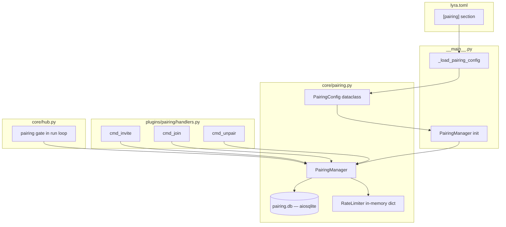
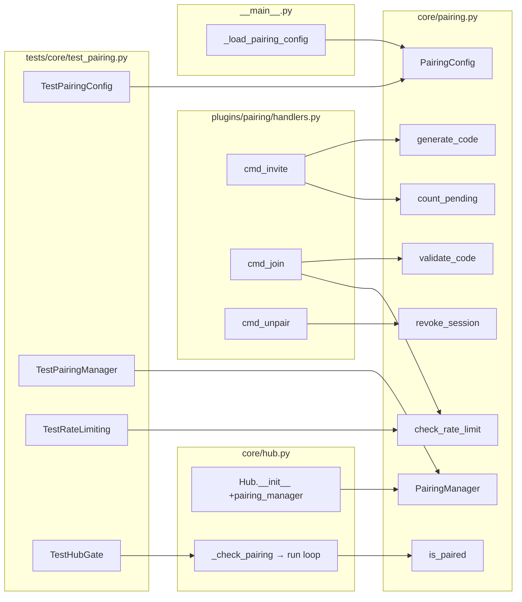

## Summary

Implement invite-code-based pairing (access control) for Lyra. Hub-level `PairingManager` with purpose-built SQLite schema, exposed via `/invite`, `/join`, `/unpair` plugin commands, gated in the Hub run loop. Three slices: core logic → plugin commands → hub gate.

## Architecture

### Data Flow



### File × Function Map



## Agents

| Agent | Tasks | Files |
|-------|-------|-------|
| backend-dev | 10 | `core/pairing.py`, `plugins/pairing/*`, `__main__.py`, `hub.py` |
| tester | 5 | `tests/core/test_pairing.py` |

## Consistency Report

| Metric | Value |
|--------|-------|
| ACs covered | 13/13 |
| Uncovered ACs | 0 |
| Untraced tasks | 0 |

| AC | Tasks |
|----|-------|
| AC1 | T1.1, T1.2, T2.1 |
| AC2 | T1.3, T2.2 |
| AC3 | T1.4, T2.3 |
| AC4 | T1.5, T2.4 |
| AC5 | T2.1, T2.5 |
| AC6 | T2.2, T2.5 |
| AC7 | T2.3, T2.5 |
| AC8 | T3.1, T3.2, T2.6 |
| AC9 | T1.6, T2.5 |
| AC10 | T1.2, T2.5 |
| AC11 | T3.1, T2.6 |
| AC12 | T3.1, T3.3, T2.6 |

## Micro-Tasks

### Slice V1 — Core PairingManager + Config (AC1–AC4)

#### T1.1 — PairingConfig dataclass + from_dict [P]
- **Agent:** backend-dev
- **File:** `src/lyra/core/pairing.py` (create)
- **Spec trace:** AC4
- **Phase:** RED → GREEN
- **Difficulty:** 1
- **Time:** 3 min

```python
# Expected shape
@dataclass(frozen=True)
class PairingConfig:
    alphabet: str = "ABCDEFGHJKLMNPQRSTUVWXYZ23456789"
    code_length: int = 8
    ttl_seconds: int = 3600
    max_pending: int = 3
    session_max_age_days: int = 30
    rate_limit_attempts: int = 5
    rate_limit_window: int = 300
    enabled: bool = False

    @classmethod
    def from_dict(cls, data: dict) -> PairingConfig: ...
```

- **Verify:** `uv run python -c "from lyra.core.pairing import PairingConfig; c = PairingConfig.from_dict({}); print(c.enabled, c.code_length)"`
- **Expected:** `False 8`

#### T1.2 — PairingManager: generate_code + count_pending [P]
- **Agent:** backend-dev
- **File:** `src/lyra/core/pairing.py`
- **Spec trace:** AC1, AC10
- **Phase:** RED → GREEN
- **Difficulty:** 3
- **Time:** 8 min

```python
class PairingManager:
    def __init__(self, config: PairingConfig, db_path: Path, admin_user_ids: set[str]): ...
    async def connect(self) -> None: ...  # init aiosqlite, create tables
    async def close(self) -> None: ...
    async def generate_code(self, admin_identity: str) -> str: ...
    async def _count_pending(self, admin_identity: str) -> int: ...
```

Schema:
```sql
CREATE TABLE IF NOT EXISTS pairing_codes (
    id INTEGER PRIMARY KEY,
    code_hash TEXT NOT NULL UNIQUE,
    created_by TEXT NOT NULL,
    expires_at TEXT NOT NULL,
    created_at TEXT NOT NULL DEFAULT (datetime('now'))
);
CREATE TABLE IF NOT EXISTS paired_sessions (
    id INTEGER PRIMARY KEY,
    identity_key TEXT NOT NULL UNIQUE,
    paired_by_code_hash TEXT NOT NULL,
    paired_at TEXT NOT NULL DEFAULT (datetime('now')),
    expires_at TEXT NOT NULL
);
```

- **Verify:** `uv run pytest tests/core/test_pairing.py::TestGenerateCode -x`
- **Expected:** PASSED

#### T1.3 — PairingManager: validate_code (redeem + create session) [P]
- **Agent:** backend-dev
- **File:** `src/lyra/core/pairing.py`
- **Spec trace:** AC2
- **Phase:** RED → GREEN
- **Difficulty:** 3
- **Time:** 5 min

```python
async def validate_code(self, code: str, identity_key: str) -> tuple[bool, str]:
    """Returns (success, message). On success, creates session + deletes code."""
```

- Hashes input with SHA-256, searches `pairing_codes` for match
- Checks `expires_at` — rejects expired
- Upserts `paired_sessions` (replace if already paired → expiry resets)
- Deletes used code
- **Verify:** `uv run pytest tests/core/test_pairing.py::TestValidateCode -x`
- **Expected:** PASSED

#### T1.4 — PairingManager: is_paired + lazy expiry cleanup
- **Agent:** backend-dev
- **File:** `src/lyra/core/pairing.py`
- **Spec trace:** AC3
- **Phase:** RED → GREEN
- **Difficulty:** 2
- **Time:** 4 min

```python
async def is_paired(self, identity_key: str) -> bool:
    """Check if user has valid (non-expired) session. Deletes expired records."""
```

- Admin check: if `identity_key in self._admin_user_ids` → return True (AC11)
- Query `paired_sessions` by `identity_key`
- If expired → delete row, return False
- **Verify:** `uv run pytest tests/core/test_pairing.py::TestIsPaired -x`
- **Expected:** PASSED

#### T1.5 — Config loading in __main__.py
- **Agent:** backend-dev
- **File:** `src/lyra/__main__.py` (modify)
- **Spec trace:** AC4
- **Phase:** GREEN
- **Difficulty:** 2
- **Time:** 4 min

```python
def _load_pairing_config(config_path: str | None = None) -> PairingConfig:
    """Load [pairing] section from lyra.toml. Missing → defaults."""
```

- Add to `_main()`: load config, init PairingManager, pass to Hub
- PairingManager `connect()` called before `hub.run()`
- PairingManager `close()` called during shutdown
- **Verify:** `uv run pytest tests/test_main.py -x`
- **Expected:** PASSED

#### T1.6 — Rate limiter (in-memory, inside PairingManager) [P]
- **Agent:** backend-dev
- **File:** `src/lyra/core/pairing.py`
- **Spec trace:** AC9
- **Phase:** RED → GREEN
- **Difficulty:** 2
- **Time:** 4 min

```python
def check_rate_limit(self, identity_key: str) -> bool:
    """Returns True if under limit. Prunes old timestamps from sliding window."""

def record_failed_attempt(self, identity_key: str) -> None:
    """Record a failed /join attempt timestamp."""
```

- In-memory `dict[str, deque[float]]` — same pattern as Hub's `_rate_timestamps`
- Resets on process restart (by design)
- **Verify:** `uv run pytest tests/core/test_pairing.py::TestRateLimiting -x`
- **Expected:** PASSED

---

**RED-GATE V1:** `uv run pytest tests/core/test_pairing.py -x -k "not hub and not plugin"` — all core PairingManager tests pass.

---

### Slice V2 — Plugin Commands + Rate Limiting (AC5–AC7, AC9, AC10)

#### T2.1 — Plugin manifest (plugin.toml)
- **Agent:** backend-dev
- **File:** `src/lyra/plugins/pairing/plugin.toml` (create)
- **Spec trace:** AC5
- **Phase:** GREEN
- **Difficulty:** 1
- **Time:** 2 min

```toml
name = "pairing"
description = "Invite-code pairing system for access control"
version = "0.1.0"
priority = 50
enabled = true
timeout = 10.0

[[commands]]
name = "invite"
description = "Generate a pairing code (admin-only)"
handler = "cmd_invite"

[[commands]]
name = "join"
description = "Redeem a pairing code"
handler = "cmd_join"

[[commands]]
name = "unpair"
description = "Revoke a user's paired session (admin-only)"
handler = "cmd_unpair"
```

- **Verify:** `uv run python -c "from lyra.core.plugin_loader import PluginLoader; p = PluginLoader(Path('src/lyra/plugins')); m = [x for x in p.discover() if x.name == 'pairing']; print(len(m[0].commands))"`
- **Expected:** `3`

#### T2.2 — cmd_join handler (with rate limiting)
- **Agent:** backend-dev
- **File:** `src/lyra/plugins/pairing/handlers.py` (create)
- **Spec trace:** AC6, AC9
- **Phase:** RED → GREEN
- **Difficulty:** 3
- **Time:** 5 min

```python
async def cmd_join(msg: Message, pool: Pool, args: list[str]) -> Response:
    """Redeem a pairing code. Rate-limited."""
    # Get PairingManager from module-level reference (set during plugin init)
    # Check enabled → check rate limit → validate code → return result
```

**Dependency injection:** PairingManager must be accessible to handlers. Pattern: module-level `_pairing_manager: PairingManager | None` set by a `configure(pm)` function called from `__main__.py` after plugin load. The plugin loader doesn't support DI, so handlers import from a well-known location.

Approach: `src/lyra/core/pairing.py` exposes a module-level `get_pairing_manager() -> PairingManager | None` + `set_pairing_manager(pm)` pair. Handlers call `get_pairing_manager()`.

- **Verify:** `uv run pytest tests/core/test_pairing.py::TestCmdJoin -x`
- **Expected:** PASSED

#### T2.3 — cmd_unpair handler
- **Agent:** backend-dev
- **File:** `src/lyra/plugins/pairing/handlers.py`
- **Spec trace:** AC7
- **Phase:** RED → GREEN
- **Difficulty:** 2
- **Time:** 4 min

```python
async def cmd_unpair(msg: Message, pool: Pool, args: list[str]) -> Response:
    """Revoke a user's session. Admin-only."""
```

- Check admin → check args → revoke → confirm or "not found"
- **Verify:** `uv run pytest tests/core/test_pairing.py::TestCmdUnpair -x`
- **Expected:** PASSED

#### T2.4 — cmd_invite handler
- **Agent:** backend-dev
- **File:** `src/lyra/plugins/pairing/handlers.py`
- **Spec trace:** AC5, AC10
- **Phase:** RED → GREEN
- **Difficulty:** 2
- **Time:** 4 min

```python
async def cmd_invite(msg: Message, pool: Pool, args: list[str]) -> Response:
    """Generate a pairing code. Admin-only."""
```

- Check admin → check max_pending → generate → return code
- **Verify:** `uv run pytest tests/core/test_pairing.py::TestCmdInvite -x`
- **Expected:** PASSED

#### T2.5 — Handler unit tests
- **Agent:** tester
- **File:** `tests/core/test_pairing.py`
- **Spec trace:** AC5–AC7, AC9, AC10
- **Phase:** GREEN
- **Difficulty:** 2
- **Time:** 5 min

Tests:
- `test_invite_admin_only` — non-admin rejected (AC5)
- `test_invite_max_pending` — refuses at limit (AC10)
- `test_join_valid_code` — creates session (AC6)
- `test_join_no_args` — usage message (AC6)
- `test_join_invalid_code` — error (AC6)
- `test_join_rate_limited` — blocked after 5 fails (AC9)
- `test_unpair_admin_only` — non-admin rejected (AC7)
- `test_unpair_not_found` — returns not found (AC7)
- `test_unpair_success` — session deleted (AC7)
- `test_commands_when_disabled` — returns "not enabled" (AC12)

- **Verify:** `uv run pytest tests/core/test_pairing.py -x -k "Cmd"`
- **Expected:** PASSED

---

**RED-GATE V2:** `uv run pytest tests/core/test_pairing.py -x -k "not hub"` — all core + plugin tests pass.

---

### Slice V3 — Hub Access Gate + Admin Bypass (AC8, AC11, AC12)

#### T3.1 — Hub pairing gate in run loop
- **Agent:** backend-dev
- **File:** `src/lyra/core/hub.py` (modify)
- **Spec trace:** AC8, AC11, AC12
- **Phase:** RED → GREEN
- **Difficulty:** 3
- **Time:** 8 min

```python
# In Hub.__init__:
self._pairing_manager: PairingManager | None = None  # new param

# In Hub.run(), after binding resolution, before command dispatch:
if self._pairing_manager and self._pairing_manager.config.enabled:
    is_join = router and router.is_command(msg) and _is_join_command(msg)
    if not is_join:
        paired = await self._pairing_manager.is_paired(msg.user_id)
        if not paired:
            # In groups: silently drop. In DMs: send rejection.
            if _is_group_message(msg):
                continue
            response = Response(content="You are not paired. Use /join <CODE>.")
            await self.dispatch_response(msg, response)
            continue
```

- `/join` exempt from gate (allows unpaired users to pair)
- Admin bypass handled inside `is_paired()` (checks admin_user_ids)
- `enabled=false` → gate inactive
- Group detection via `TelegramContext.is_group` / `DiscordContext.guild_id`

- **Verify:** `uv run pytest tests/core/test_pairing.py::TestHubGate -x`
- **Expected:** PASSED

#### T3.2 — Hub gate wiring in __main__.py
- **Agent:** backend-dev
- **File:** `src/lyra/__main__.py` (modify)
- **Spec trace:** AC8
- **Phase:** GREEN
- **Difficulty:** 1
- **Time:** 3 min

- Pass `pairing_manager` to `Hub(pairing_manager=pm)`
- Call `set_pairing_manager(pm)` for plugin handler access
- Add `await pm.close()` to shutdown

- **Verify:** `uv run pytest tests/test_main.py -x`
- **Expected:** PASSED

#### T3.3 — Hub gate tests
- **Agent:** tester
- **File:** `tests/core/test_pairing.py`
- **Spec trace:** AC8, AC11, AC12
- **Phase:** GREEN
- **Difficulty:** 3
- **Time:** 5 min

Tests:
- `test_unpaired_user_rejected_dm` — gets rejection message (AC8)
- `test_unpaired_user_silently_dropped_group` — no reply in group (AC8)
- `test_join_exempt_from_gate` — `/join` passes through (AC8)
- `test_admin_bypasses_gate` — admin always passes (AC11)
- `test_gate_inactive_when_disabled` — all messages pass (AC12)
- `test_expired_session_rejected` — lazy cleanup works (AC3)

- **Verify:** `uv run pytest tests/core/test_pairing.py::TestHubGate -x`
- **Expected:** PASSED

---

**RED-GATE V3:** `uv run pytest tests/core/test_pairing.py -x` — all tests pass.

**Final gate:** `uv run pytest -x && uv run ruff check . && uv run pyright` — full suite green.

## Reference Patterns

| Pattern | File | Notes |
|---------|------|-------|
| Plugin structure | `src/lyra/plugins/echo/` | TOML manifest + handlers.py |
| Command handler signature | `plugins/echo/handlers.py` | `async (Message, Pool, list[str]) → Response` |
| Admin check | `core/command_router.py:161` | `sender_id not in self._admin_user_ids` |
| Hub run loop | `core/hub.py:253-305` | Gate goes after binding, before command dispatch |
| Config loading | `__main__.py:35-68` | TOML → tomllib → dataclass |
| Rate limiter | `core/hub.py:92-95` | `deque[float]` sliding window |
| Test helpers | `tests/core/test_command_router.py:49-69` | `make_message()` factory |
