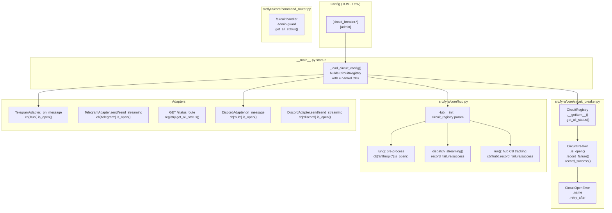
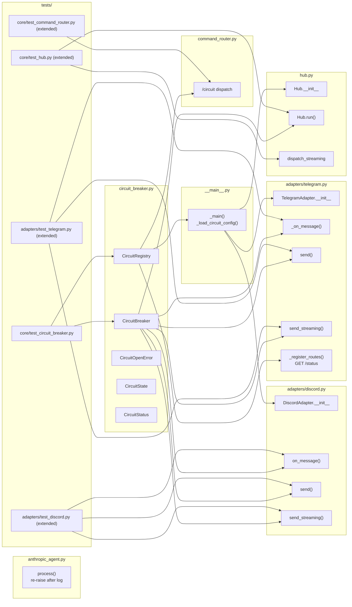

## Summary

Introduce a generic async-native `CircuitBreaker` + `CircuitRegistry` across all four service integration points (Anthropic API, Telegram, Discord, Hub). New `circuit_breaker.py` module + targeted modifications to hub, adapters, command router, and main entry point.

## Architecture





## Agents

| Agent | Slices | Files | Tasks |
|-------|--------|-------|-------|
| backend-dev-1 | S1 | `circuit_breaker.py` (new) | T01 |
| backend-dev-2 | S2 | `anthropic_agent.py`, `hub.py` | T03, T04 |
| backend-dev-3 | S3+S4 | `telegram.py`, `discord.py` | T05, T06 |
| backend-dev-4 | S5 | `command_router.py`, `__main__.py` | T07, T08 |
| tester | S1–S5 | `test_circuit_breaker.py`, `test_hub.py`, `test_telegram.py`, `test_discord.py`, `test_command_router.py` | T02, T09, T10, T11, T12 |

**Parallelism:**
- Phase 1: backend-dev-1 (T01) ∥ tester (T02) — S1 RED+GREEN simultaneously
- RED-GATE S1 before Phase 2
- Phase 2: backend-dev-2 (T03, T04) ∥ backend-dev-3 (T05, T06) ∥ tester (T09, T10, T11)
- RED-GATE S2–S4 before Phase 3
- Phase 3: backend-dev-4 (T07, T08) ∥ tester (T12)
- RED-GATE S5 (full suite)

## Consistency Report

| Criterion | Covered by |
|-----------|------------|
| SC-01: CLOSED→OPEN | T01, T02 |
| SC-02: OPEN→HALF_OPEN | T01, T02 |
| SC-03: HALF_OPEN→CLOSED | T01, T02 |
| SC-04: HALF_OPEN→OPEN (probe fail) | T01, T02 |
| SC-05: HALF_OPEN concurrent fast-fail | T01, T02 |
| SC-06: HALF_OPEN in-flight probe UX | T04, T09 |
| SC-07: Fast-fail reply with retry_after | T04, T09 |
| SC-08: Queued messages get fast-fail | T04, T09 |
| SC-09: Mid-stream failure → record_failure | T04, T09 |
| SC-10: Hub failure/success tracking | T04, T09 |
| SC-11: Telegram hub-circuit drop (HTTP 200) | T05, T10 |
| SC-12: Discord hub-circuit drop | T06, T11 |
| SC-13: Adapter outbound circuit skip + log | T05, T06, T10, T11 |
| SC-14: GET /status JSON | T05, T12 |
| SC-15: /circuit admin gate + table | T07, T12 |
| SC-16: Config-driven, defaults documented | T08, T12 |

Uncovered: none. Untraced: none.

---

## Micro-Tasks

### Slice S1 — Core CircuitBreaker

---

#### T01 · Create `circuit_breaker.py` [backend-dev-1, S1, RED, P:N]

**Description:** Create the core circuit breaker module with all data types and state machine logic.

**File:** `src/lyra/core/circuit_breaker.py` (new)

**Code skeleton:**
```python
from __future__ import annotations
import time
from dataclasses import dataclass
from enum import Enum

class CircuitState(Enum):
    CLOSED = "closed"
    OPEN = "open"
    HALF_OPEN = "half_open"

@dataclass
class CircuitStatus:
    name: str
    state: CircuitState
    failure_count: int
    retry_after: float | None  # seconds remaining, None if not OPEN

class CircuitOpenError(Exception):
    def __init__(self, name: str, retry_after: float) -> None:
        self.name = name
        self.retry_after = retry_after
        super().__init__(f"Circuit '{name}' is open. Retry in {retry_after:.0f}s.")

class CircuitBreaker:
    """Async-safe (single asyncio event loop) circuit breaker.

    Uses a _probe_in_flight bool flag instead of asyncio.Lock because
    asyncio is single-threaded: no await points between check and set
    in is_open(), so no race is possible.
    """
    def __init__(self, name: str, failure_threshold: int = 5,
                 recovery_timeout: int = 60) -> None: ...

    def is_open(self) -> bool:
        """True = reject call (OPEN or HALF_OPEN with probe in flight).
        Side-effect: OPEN→HALF_OPEN transition if timeout elapsed;
        sets _probe_in_flight=True for the first HALF_OPEN caller."""
        ...

    def record_success(self) -> None:
        """HALF_OPEN→CLOSED, reset failure_count and probe flag."""
        ...

    def record_failure(self) -> None:
        """CLOSED: increment count, open if ≥ threshold.
        HALF_OPEN: back to OPEN, reset timer.
        OPEN: reset timer. Always clears probe flag."""
        ...

    def get_status(self) -> CircuitStatus:
        """retry_after = max(0, recovery_timeout - elapsed) if OPEN, else None."""
        ...

class CircuitRegistry:
    def __init__(self) -> None:
        self._circuits: dict[str, CircuitBreaker] = {}

    def register(self, cb: CircuitBreaker) -> None: ...
    def __getitem__(self, name: str) -> CircuitBreaker: ...
    def get(self, name: str) -> CircuitBreaker | None: ...
    def get_all_status(self) -> dict[str, CircuitStatus]: ...
```

**Verify:** `uv run pyright src/lyra/core/circuit_breaker.py && uv run ruff check src/lyra/core/circuit_breaker.py`

**Expected output:** No errors.

**Time estimate:** 8 min | **Spec trace:** SC-01–05 | **Difficulty:** 2

---

#### T02 · State transition tests [tester, S1, RED, P:Y (∥ T01)]

**Description:** Write comprehensive tests covering all state transitions and the HALF_OPEN concurrency scenario.

**File:** `tests/core/test_circuit_breaker.py` (new)

**Code skeleton:**
```python
import time
import pytest
from lyra.core.circuit_breaker import CircuitBreaker, CircuitState, CircuitOpenError, CircuitRegistry

def test_closed_to_open_after_threshold():
    cb = CircuitBreaker("test", failure_threshold=3, recovery_timeout=60)
    cb.record_failure(); cb.record_failure()
    assert cb._state == CircuitState.CLOSED  # not yet
    cb.record_failure()
    assert cb._state == CircuitState.OPEN

def test_open_to_half_open_after_timeout(monkeypatch):
    cb = CircuitBreaker("test", failure_threshold=1, recovery_timeout=1)
    cb.record_failure()
    assert cb.is_open() is True  # OPEN
    monkeypatch.setattr(time, "monotonic", lambda: time.monotonic() + 2)  # advance clock
    assert cb.is_open() is False  # HALF_OPEN, probe slot acquired
    assert cb._state == CircuitState.HALF_OPEN

def test_half_open_success_closes():
    ...

def test_half_open_failure_reopens():
    ...

def test_half_open_concurrent_fast_fails():
    """Second is_open() call while probe in flight returns True (fast-fail)."""
    cb = CircuitBreaker("test", failure_threshold=1, recovery_timeout=0)
    cb.record_failure()
    cb.is_open()  # transitions to HALF_OPEN, acquires probe slot
    assert cb._probe_in_flight is True
    assert cb.is_open() is True  # second caller fast-fails

def test_registry_get_all_status(): ...
def test_circuit_open_error_message(): ...
def test_retry_after_formula(): ...  # max(0, timeout - elapsed)
```

**Verify:** `uv run pytest tests/core/test_circuit_breaker.py -v`

**Expected output:** All tests pass.

**Time estimate:** 8 min | **Spec trace:** SC-01–05 | **Difficulty:** 2

---

### 🔴 RED-GATE S1
```bash
uv run pytest tests/core/test_circuit_breaker.py -v && uv run pyright src/lyra/core/circuit_breaker.py
```
All tests must pass before Phase 2 begins.

---

### Slice S2 — AnthropicAgent fix + Hub LLM circuit

---

#### T03 · Fix AnthropicAgent.process() exception handling [backend-dev-2, S2, RED, P:N]

**Description:** Narrow the broad `except Exception` at line ~141 so exceptions propagate to `dispatch_streaming()`. The `finally:` block must still run (history persist). Add explicit `CircuitOpenError` passthrough comment.

**File:** `src/lyra/agents/anthropic_agent.py`

**Change:**
```python
# BEFORE (line ~141):
except Exception:
    log.exception("Streaming error in AnthropicAgent")
# (exception swallowed — never reaches dispatch_streaming)

# AFTER:
except Exception:
    log.exception("Streaming error in AnthropicAgent")
    raise  # re-raise so Hub.dispatch_streaming() can record the circuit failure
# finally: block unchanged — always persists history
```

**Verify:** `uv run pyright src/lyra/agents/anthropic_agent.py && uv run pytest tests/agents/test_anthropic_agent.py -v`

**Expected output:** No type errors; existing agent tests still pass.

**Time estimate:** 3 min | **Spec trace:** N0, SC-09 | **Difficulty:** 1

---

#### T04 · Hub: inject CircuitRegistry + LLM circuit checks [backend-dev-2, S2+S3, GREEN, P:N]

**Description:** Add `circuit_registry` param to `Hub.__init__`. In `run()`: pre-process anthropic CB check before `agent.process()`; success/failure tracking in `dispatch_streaming()`; hub CB failure/success tracking around the processing block.

**File:** `src/lyra/core/hub.py`

**Changes:**

*1. `__init__` signature:*
```python
from lyra.core.circuit_breaker import CircuitRegistry  # TYPE_CHECKING only

def __init__(self, ..., circuit_registry: CircuitRegistry | None = None) -> None:
    ...
    self.circuit_registry = circuit_registry
```

*2. In `run()`, before `async with pool.lock:`:*
```python
# Anthropic circuit pre-process check
if self.circuit_registry is not None:
    cb = self.circuit_registry.get("anthropic")
    if cb is not None and cb.is_open():
        status = cb.get_status()
        retry_secs = int(status.retry_after or 0)
        reply = Response(
            content=f"Lyra is currently unavailable. Please try again in {retry_secs}s."
        )
        try:
            await self.dispatch_response(msg, reply)
        except Exception as exc:
            log.exception("dispatch_response failed for fast-fail: %s", exc)
        continue
```

*3. Streaming path — wrap `dispatch_streaming()`:*
```python
try:
    await self.dispatch_streaming(msg, result)
    # Success: record for anthropic and hub circuits
    if self.circuit_registry is not None:
        for name in ("anthropic", "hub"):
            cb = self.circuit_registry.get(name)
            if cb is not None:
                cb.record_success()
except Exception as exc:
    log.exception("dispatch_streaming() failed for %s: %s", key, exc)
    if self.circuit_registry is not None:
        for name in ("anthropic", "hub"):
            cb = self.circuit_registry.get(name)
            if cb is not None:
                cb.record_failure()
```

*4. Non-streaming path — hub CB tracking only (no anthropic circuit here):*
```python
try:
    response = await result
    if self.circuit_registry is not None:
        cb = self.circuit_registry.get("hub")
        if cb is not None:
            cb.record_success()
except Exception as exc:
    log.exception("agent.process() raised for %s: %s", key, exc)
    response = Response(content=GENERIC_ERROR_REPLY)
    if self.circuit_registry is not None:
        cb = self.circuit_registry.get("hub")
        if cb is not None:
            cb.record_failure()
```

**Verify:** `uv run pyright src/lyra/core/hub.py && uv run pytest tests/core/test_hub.py -v`

**Expected output:** No type errors; existing hub tests still pass.

**Time estimate:** 10 min | **Spec trace:** N5, N6, N7, SC-06–10 | **Difficulty:** 3

---

#### T09 · Extend hub tests for circuit behavior [tester, S2, RED, P:Y (∥ T03+T04)]

**Description:** Extend `tests/core/test_hub.py` with circuit breaker scenarios.

**File:** `tests/core/test_hub.py` (extend)

**Tests to add:**
```python
def test_anthropic_circuit_open_sends_fast_fail_reply():
    """When circuits['anthropic'] is OPEN, hub sends fast-fail reply, skips agent."""
    registry = CircuitRegistry()
    cb = CircuitBreaker("anthropic", failure_threshold=1, recovery_timeout=60)
    cb.record_failure()  # open the circuit
    registry.register(cb)
    hub = Hub(circuit_registry=registry)
    # ... assert fast-fail reply sent, agent.process not called

def test_mid_stream_failure_records_anthropic_failure():
    """dispatch_streaming exception → circuits['anthropic'].record_failure()"""
    ...

def test_hub_circuit_records_success_on_clean_processing():
    """Clean processing cycle → circuits['hub'].record_success()"""
    ...

def test_queued_messages_get_fast_fail_after_circuit_opens():
    """Messages already in bus get fast-fail reply when circuit is open at dequeue time."""
    ...
```

**Verify:** `uv run pytest tests/core/test_hub.py -v -k circuit`

**Expected output:** All circuit tests pass.

**Time estimate:** 8 min | **Spec trace:** SC-06–10 | **Difficulty:** 3

---

### 🔴 RED-GATE S2
```bash
uv run pytest tests/core/test_hub.py tests/agents/test_anthropic_agent.py -v
```

---

### Slice S3+S4 — Adapter inbound + outbound circuits

---

#### T05 · TelegramAdapter: full CB integration + GET /status [backend-dev-3, S3+S4+S5partial, GREEN, P:Y (∥ T03+T04)]

**Description:** Add `circuit_registry` param; hub circuit check in `_on_message()`; wrap outbound `send()` and `send_streaming()` with `circuits["telegram"]`; add `GET /status` FastAPI route.

**File:** `src/lyra/adapters/telegram.py`

**Changes:**

*1. `__init__` signature + store registry:*
```python
def __init__(self, ..., circuit_registry: CircuitRegistry | None = None) -> None:
    ...
    self._circuit_registry = circuit_registry
```

*2. `_on_message()` — hub circuit guard before `bus.put()`:*
```python
async def _on_message(self, msg) -> None:
    if msg.from_user and getattr(msg.from_user, "is_bot", False):
        return
    hub_msg = self._normalize(msg)

    # Hub circuit guard — drop if hub is overloaded (return normally to aiogram → HTTP 200)
    if self._circuit_registry is not None:
        cb = self._circuit_registry.get("hub")
        if cb is not None and cb.is_open():
            log.warning(
                '{"event": "hub_circuit_open", "platform": "telegram", '
                '"user_id": "%s", "dropped": true}', hub_msg.user_id
            )
            return  # drop silently, aiogram returns {"ok": True} to Telegram

    if self._hub.bus.full():
        await self.bot.send_message(msg.chat.id, "Processing your request…")

    await self._hub.bus.put(hub_msg)
```

*3. `send()` — telegram circuit guard:*
```python
async def send(self, original_msg: Message, response: Response) -> None:
    if self._circuit_registry is not None:
        cb = self._circuit_registry.get("telegram")
        if cb is not None and cb.is_open():
            log.warning('{"event": "telegram_circuit_open", "dropped": true}')
            return
    try:
        sent = await self.bot.send_message(chat_id=ctx.chat_id, text=response.content)
        response.metadata["reply_message_id"] = sent.message_id
        if self._circuit_registry is not None:
            cb = self._circuit_registry.get("telegram")
            if cb is not None:
                cb.record_success()
    except Exception:
        log.exception("send() failed")
        if self._circuit_registry is not None:
            cb = self._circuit_registry.get("telegram")
            if cb is not None:
                cb.record_failure()
```

*4. `send_streaming()` — circuit guard at entry + `record_failure()` in inner stream except:*
```python
async def send_streaming(self, original_msg: Message, chunks: AsyncIterator[str]) -> None:
    if self._circuit_registry is not None:
        cb = self._circuit_registry.get("telegram")
        if cb is not None and cb.is_open():
            log.warning('{"event": "telegram_circuit_open", "dropped": true}')
            async for _ in chunks:  # drain the iterator
                pass
            return
    ...
    try:
        async for chunk in chunks:
            ...
    except Exception:
        log.exception("Stream interrupted")
        if self._circuit_registry is not None:
            cb = self._circuit_registry.get("telegram")
            if cb is not None:
                cb.record_failure()
        ...
    else:
        if self._circuit_registry is not None:
            cb = self._circuit_registry.get("telegram")
            if cb is not None:
                cb.record_success()
    ...
```

*5. `_register_routes()` — add GET /status:*
```python
@self.app.get("/status")
async def get_status() -> dict:
    if self._circuit_registry is None:
        return {"services": {}, "timestamp": datetime.now(timezone.utc).isoformat()}
    all_status = self._circuit_registry.get_all_status()
    return {
        "services": {
            name: {
                "state": s.state.value,
                "retry_after": s.retry_after,
            }
            for name, s in all_status.items()
        },
        "timestamp": datetime.now(timezone.utc).isoformat(),
    }
```

**Verify:** `uv run pyright src/lyra/adapters/telegram.py && uv run pytest tests/adapters/test_telegram.py -v`

**Expected output:** No type errors; existing telegram tests pass.

**Time estimate:** 12 min | **Spec trace:** N8, N10, N11, N14, SC-11, SC-13, SC-14 | **Difficulty:** 3

---

#### T06 · DiscordAdapter: full CB integration [backend-dev-3, S3+S4, GREEN, P:Y (∥ T03+T04)]

**Description:** Same pattern as T05 for Discord — hub circuit guard in `on_message()`; wrap `send()` and `send_streaming()` with `circuits["discord"]`.

**File:** `src/lyra/adapters/discord.py`

**Changes:** Mirror T05 pattern for Discord:
- `__init__`: add `circuit_registry: CircuitRegistry | None = None`
- `on_message()`: hub circuit guard before `bus.put()` → log + return
- `send()`: telegram circuit guard → log + return if OPEN; record_success/failure on outcome
- `send_streaming()`: guard at entry + record_failure in inner except, record_success in else

**Verify:** `uv run pyright src/lyra/adapters/discord.py && uv run pytest tests/adapters/test_discord.py -v`

**Expected output:** No type errors; existing discord tests pass.

**Time estimate:** 8 min | **Spec trace:** N9, N12, N13, SC-12, SC-13 | **Difficulty:** 2

---

#### T10 · Extend Telegram adapter tests for CB [tester, S3+S4, RED, P:Y (∥ T05+T06)]

**Description:** Extend `tests/adapters/test_telegram.py` with circuit scenarios.

**File:** `tests/adapters/test_telegram.py` (extend)

**Tests to add:**
```python
def test_on_message_drops_when_hub_circuit_open():
    """_on_message returns without bus.put() when circuits['hub'] is OPEN. No exception raised."""
    ...

def test_send_skips_when_telegram_circuit_open():
    """send() returns without calling bot.send_message when circuits['telegram'] is OPEN."""
    ...

def test_send_records_failure_on_api_error():
    ...

def test_send_streaming_records_failure_on_stream_interrupted():
    ...

def test_get_status_endpoint_returns_all_circuits():
    """GET /status → JSON with all 4 circuit states."""
    ...
```

**Verify:** `uv run pytest tests/adapters/test_telegram.py -v -k circuit`

**Time estimate:** 8 min | **Spec trace:** SC-11, SC-13, SC-14 | **Difficulty:** 2

---

#### T11 · Extend Discord adapter tests for CB [tester, S3+S4, RED, P:Y (∥ T05+T06)]

**File:** `tests/adapters/test_discord.py` (extend)

**Tests:** Mirror T10 for Discord.

**Verify:** `uv run pytest tests/adapters/test_discord.py -v -k circuit`

**Time estimate:** 5 min | **Spec trace:** SC-12, SC-13 | **Difficulty:** 2

---

### 🔴 RED-GATE S3+S4
```bash
uv run pytest tests/adapters/ tests/core/test_hub.py -v
```

---

### Slice S5 — Status surfaces + config wiring

---

#### T07 · Register `/circuit` command in CommandRouter [backend-dev-4, S5, GREEN, P:N]

**Description:** Add a `/circuit` built-in command handler with admin guard. The handler reads admin user_ids from config and checks sender before returning the status table.

**File:** `src/lyra/core/command_router.py`

**Changes:**

*1. Add `CircuitRegistry` + admin config to `CommandRouter`:*
```python
class CommandRouter:
    def __init__(
        self,
        commands: dict[str, CommandConfig],
        circuit_registry: CircuitRegistry | None = None,
        admin_user_ids: set[str] | None = None,
    ) -> None:
        self.commands = commands
        self._circuit_registry = circuit_registry
        self._admin_user_ids = admin_user_ids or set()
```

*2. In `dispatch()`, add `/circuit` handler before unknown check:*
```python
if command_name == "/circuit":
    return self._circuit_status(msg)
```

*3. New `_circuit_status()` method:*
```python
def _circuit_status(self, msg: Message) -> Response:
    sender_id = f"{msg.platform.value}:{msg.user_id}"
    if self._admin_user_ids and sender_id not in self._admin_user_ids:
        return Response(content="This command is admin-only.")
    if self._circuit_registry is None:
        return Response(content="Circuit breaker not configured.")
    all_status = self._circuit_registry.get_all_status()
    lines = ["Circuit Status", "─" * 38]
    for name, status in sorted(all_status.items()):
        if status.retry_after is not None:
            state_str = f"OPEN      retry in {int(status.retry_after)}s"
        else:
            state_str = f"{status.state.value.upper():<10}(ok)"
        lines.append(f"  {name:<12}{state_str}")
    lines.append("─" * 38)
    return Response(content="\n".join(lines))
```

**Verify:** `uv run pyright src/lyra/core/command_router.py && uv run pytest tests/core/test_command_router.py -v`

**Expected output:** No errors; existing command router tests pass.

**Time estimate:** 8 min | **Spec trace:** N15, SC-15 | **Difficulty:** 2

---

#### T08 · Config loading + CircuitRegistry injection in `__main__.py` [backend-dev-4, S5, GREEN, P:N (after T07)]

**Description:** Add TOML config loading for `[circuit_breaker]` and `[admin]` sections. Build `CircuitRegistry` with 4 named circuits. Inject into Hub and adapters.

**File:** `src/lyra/__main__.py`

**Config file:** Can be `lyra.toml` in the project root or read from env var `LYRA_CONFIG`. Use `tomllib` (Python 3.11+ stdlib) or `tomli` fallback.

**Changes:**

*1. Add config loader:*
```python
import tomllib  # Python 3.11+ stdlib
from lyra.core.circuit_breaker import CircuitBreaker, CircuitRegistry

_CB_DEFAULTS = {"failure_threshold": 5, "recovery_timeout": 60}
_CB_SERVICES = ("anthropic", "telegram", "discord", "hub")

def _load_circuit_config(config_path: str | None = None) -> tuple[CircuitRegistry, set[str]]:
    """Load [circuit_breaker.*] and [admin] from TOML config.

    Returns (CircuitRegistry, admin_user_ids).
    Missing sections use defaults. Missing config file → all defaults.
    """
    raw: dict = {}
    path = config_path or os.environ.get("LYRA_CONFIG", "lyra.toml")
    try:
        with open(path, "rb") as f:
            raw = tomllib.load(f)
    except FileNotFoundError:
        log.info("No config file at %s — using circuit breaker defaults", path)

    cb_section = raw.get("circuit_breaker", {})
    registry = CircuitRegistry()
    for name in _CB_SERVICES:
        cfg = {**_CB_DEFAULTS, **cb_section.get(name, {})}
        registry.register(CircuitBreaker(
            name=name,
            failure_threshold=cfg["failure_threshold"],
            recovery_timeout=cfg["recovery_timeout"],
        ))

    admin_ids: set[str] = set(raw.get("admin", {}).get("user_ids", []))
    return registry, admin_ids
```

*2. In `_main()`, call loader and inject:*
```python
circuit_registry, admin_user_ids = _load_circuit_config()
hub = Hub(circuit_registry=circuit_registry)

# Pass registry to agent's command_router if present
# (command_router is created inside AnthropicAgent/SimpleAgent init via TOML commands)
# Inject after agent creation:
if hasattr(agent, "command_router") and agent.command_router is not None:
    agent.command_router._circuit_registry = circuit_registry
    agent.command_router._admin_user_ids = admin_user_ids

tg_adapter = TelegramAdapter(..., circuit_registry=circuit_registry)
dc_adapter = DiscordAdapter(..., circuit_registry=circuit_registry)
```

**Verify:** `uv run pyright src/lyra/__main__.py && uv run pytest tests/test_main.py -v`

**Expected output:** No errors; existing main tests pass.

**Time estimate:** 10 min | **Spec trace:** N16, SC-16 | **Difficulty:** 3

---

#### T12 · Tests for /circuit command + config loading [tester, S5, RED, P:Y (∥ T07+T08)]

**File:** `tests/core/test_command_router.py` (extend)

**Tests to add:**
```python
def test_circuit_command_returns_status_for_admin():
    """Admin sender → gets formatted status table."""
    ...

def test_circuit_command_denied_for_non_admin():
    """Non-admin sender → 'This command is admin-only.'"""
    ...

def test_circuit_command_shows_retry_after_when_open():
    """OPEN circuit → table shows 'retry in Xs'."""
    ...

def test_load_circuit_config_uses_defaults_when_no_file():
    """Missing lyra.toml → 4 CBs with default thresholds."""
    ...

def test_load_circuit_config_overrides_from_toml(tmp_path):
    """[circuit_breaker.anthropic] failure_threshold=2 → CB threshold=2."""
    ...
```

**Verify:** `uv run pytest tests/core/test_command_router.py -v -k circuit`

**Time estimate:** 8 min | **Spec trace:** SC-15, SC-16 | **Difficulty:** 2

---

### 🔴 RED-GATE S5 (Full Suite)
```bash
uv run pytest -v && uv run pyright && uv run ruff check .
```
All 16 success criteria verified.
