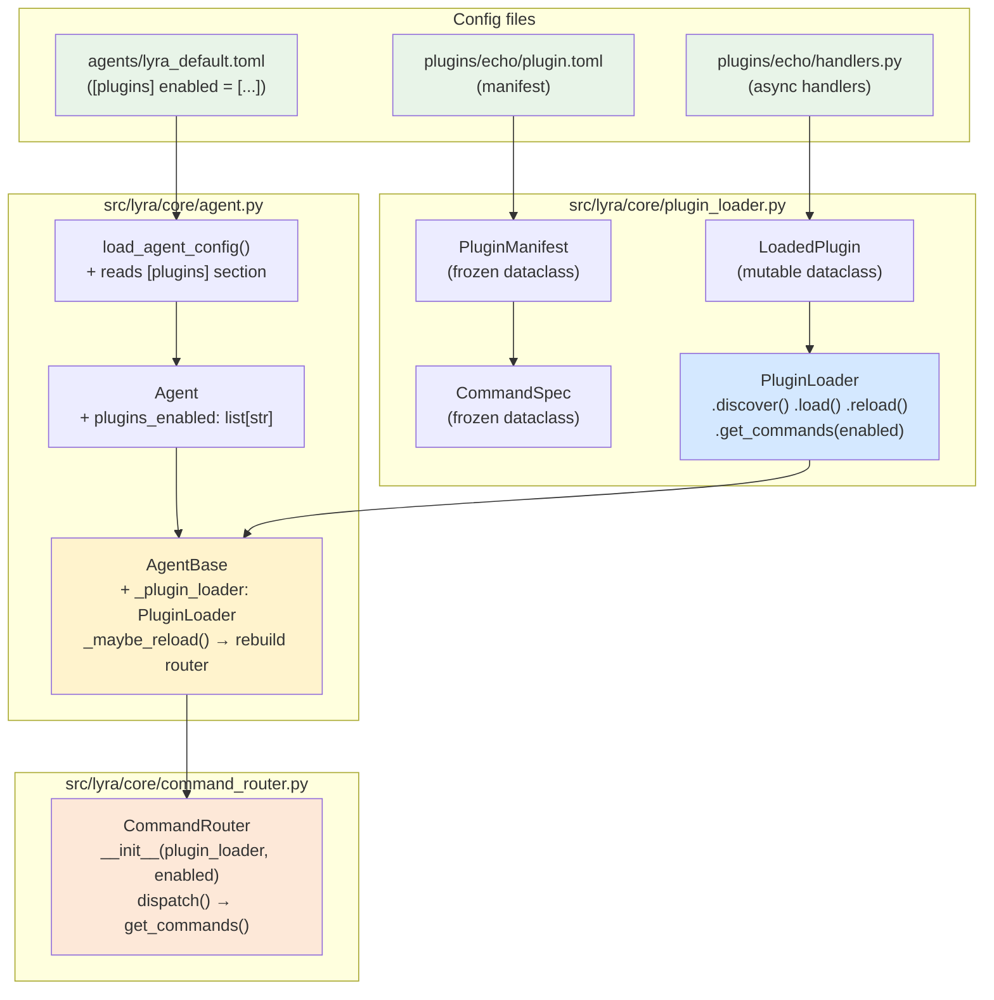
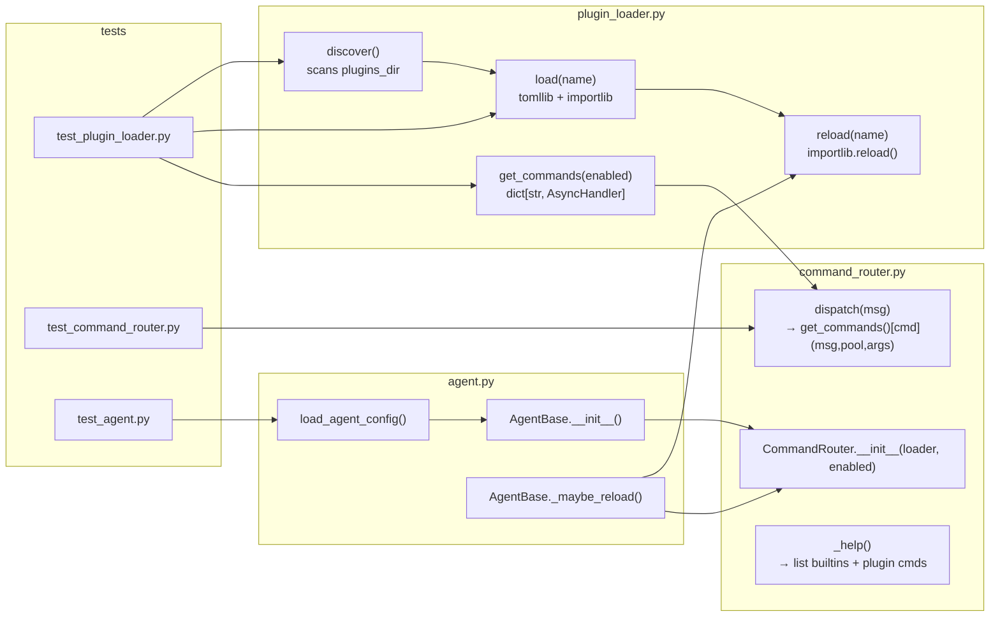

## Summary

Replace the hardcoded `SKILL_REGISTRY` dict and `SkillHandler` subprocess runner in `command_router.py` with a directory-based `PluginLoader` that discovers TOML manifests and dispatches async Python handlers. Four slices: foundation → integration → per-agent config → hot-reload.

---

## Architecture





---

## Bootstrap Context

Reference patterns from existing code:
- `_AGENTS_DIR = Path(__file__).resolve().parent.parent / "agents"` → `plugins_dir` uses same anchor: `Path(__file__).resolve().parent.parent / "plugins"`
- `_maybe_reload()` mtime check pattern in `AgentBase` → extend for plugin file mtimes
- `tomllib.load()` + TOML section parsing → same approach for `plugin.toml`
- `importlib` not yet used but standard library; use `importlib.util.spec_from_file_location` for loading handler modules from filesystem paths

---

## Agents

| Agent | Tasks | Files |
|-------|-------|-------|
| backend-dev | 14 | `plugin_loader.py`, `command_router.py`, `agent.py`, `lyra_default.toml`, `plugins/echo/*` |
| tester | 6 | `test_plugin_loader.py`, `test_command_router.py`, `test_agent.py` |

---

## Consistency Report

| Metric | Value |
|--------|-------|
| Spec criteria covered | 14 / 14 |
| Uncovered criteria | none |
| Untraced tasks | 0 |

---

## Micro-Tasks

---

### V1 — PluginLoader foundation

> Isolated: SKILL_REGISTRY and SkillHandler remain untouched. Entry demo: unit tests pass.

---

#### T1.1 — Create plugins package marker `[P]`

- **File:** `src/lyra/plugins/__init__.py`
- **Description:** Create empty `__init__.py` so `lyra.plugins` is a package
- **Code snippet:**
  ```python
  # src/lyra/plugins/__init__.py
  ```
- **Verify:** `python -c "import lyra.plugins; print('ok')"`
- **Expected output:** `ok`
- **Time:** 2 min
- **Agent:** backend-dev
- **Spec trace:** SC-1
- **Phase:** GREEN
- **Difficulty:** 1

---

#### T1.2 — Define PluginManifest, CommandSpec, LoadedPlugin dataclasses `[P]`

- **File:** `src/lyra/core/plugin_loader.py` (create)
- **Description:** Define the three data structures. `PluginManifest` and `CommandSpec` are frozen dataclasses. `LoadedPlugin` is mutable (module ref). Include all fields from spec data model.
- **Code snippet:**
  ```python
  from __future__ import annotations
  import importlib.util
  import tomllib
  from dataclasses import dataclass, field
  from pathlib import Path
  from types import ModuleType
  from typing import TYPE_CHECKING, Callable

  if TYPE_CHECKING:
      from lyra.core.message import Message, Response
      from lyra.core.pool import Pool

  AsyncHandler = Callable[["Message", "Pool", list[str]], "Response"]

  @dataclass(frozen=True)
  class CommandSpec:
      name: str
      description: str = ""
      handler: str = ""

  @dataclass(frozen=True)
  class PluginManifest:
      name: str
      description: str = ""
      version: str = "0.1.0"
      priority: int = 100
      enabled: bool = True
      timeout: float = 30.0
      commands: tuple[CommandSpec, ...] = field(default=())

  @dataclass
  class LoadedPlugin:
      name: str
      manifest: PluginManifest
      module: ModuleType
      handlers: dict[str, AsyncHandler] = field(default_factory=dict)
  ```
- **Verify:** `python -c "from lyra.core.plugin_loader import PluginManifest, LoadedPlugin; print('ok')"`
- **Expected output:** `ok`
- **Time:** 5 min
- **Agent:** backend-dev
- **Spec trace:** SC-1, SC-2, SC-3
- **Phase:** GREEN
- **Difficulty:** 2

---

#### T1.3 — Implement PluginLoader.discover()

- **File:** `src/lyra/core/plugin_loader.py`
- **Description:** Add `PluginLoader` class with `plugins_dir` and `_loaded` dict. `discover()` iterates immediate subdirs of `plugins_dir`, tries to parse `plugin.toml`, silently skips missing/malformed manifests, returns `list[PluginManifest]`.
- **Code snippet:**
  ```python
  class PluginLoader:
      def __init__(self, plugins_dir: Path) -> None:
          self.plugins_dir = plugins_dir
          self._loaded: dict[str, LoadedPlugin] = {}

      def discover(self) -> list[PluginManifest]:
          manifests: list[PluginManifest] = []
          if not self.plugins_dir.is_dir():
              return manifests
          for subdir in sorted(self.plugins_dir.iterdir()):
              if not subdir.is_dir():
                  continue
              toml_path = subdir / "plugin.toml"
              if not toml_path.exists():
                  continue
              try:
                  with toml_path.open("rb") as f:
                      data = tomllib.load(f)
              except Exception:
                  continue  # silently skip malformed
              try:
                  manifests.append(_parse_manifest(data))
              except (KeyError, TypeError, ValueError):
                  continue
          return manifests
  ```
- **Verify:** unit test `test_discover_finds_echo_plugin` in `test_plugin_loader.py`
- **Expected output:** test passes
- **Time:** 8 min
- **Agent:** backend-dev
- **Spec trace:** SC-1
- **Phase:** GREEN
- **Difficulty:** 2

---

#### T1.4 — Implement PluginLoader.load(name)

- **File:** `src/lyra/core/plugin_loader.py`
- **Description:** `load(name)` finds `plugins_dir/name/plugin.toml`, parses manifest, loads `handlers.py` via `importlib.util.spec_from_file_location`, resolves handler callables from `CommandSpec.handler` string, raises `ValueError` if handler name not found or not callable.
- **Code snippet:**
  ```python
  def load(self, name: str) -> LoadedPlugin:
      plugin_dir = self.plugins_dir / name
      toml_path = plugin_dir / "plugin.toml"
      handlers_path = plugin_dir / "handlers.py"
      with toml_path.open("rb") as f:
          data = tomllib.load(f)
      manifest = _parse_manifest(data)
      spec = importlib.util.spec_from_file_location(
          f"lyra.plugins.{name}.handlers", handlers_path
      )
      module = importlib.util.module_from_spec(spec)
      spec.loader.exec_module(module)
      handlers: dict[str, AsyncHandler] = {}
      for cmd in manifest.commands:
          fn = getattr(module, cmd.handler, None)
          if fn is None or not callable(fn):
              raise ValueError(
                  f"Plugin '{name}': handler '{cmd.handler}' not found or not callable"
              )
          handlers[f"/{cmd.name}"] = fn
      loaded = LoadedPlugin(name=name, manifest=manifest, module=module, handlers=handlers)
      self._loaded[name] = loaded
      return loaded
  ```
- **Verify:** unit test `test_load_resolves_echo_handler`
- **Expected output:** test passes; handler is `cmd_echo`
- **Time:** 8 min
- **Agent:** backend-dev
- **Spec trace:** SC-2
- **Phase:** GREEN
- **Difficulty:** 3

---

#### T1.5 — Implement PluginLoader.get_commands(enabled)

- **File:** `src/lyra/core/plugin_loader.py`
- **Description:** `get_commands(enabled)` iterates `_loaded` entries whose names appear in `enabled`, merges their `handlers` dicts. Returns `dict[str, AsyncHandler]` keyed by `"/cmd-name"`.
- **Code snippet:**
  ```python
  def get_commands(self, enabled: list[str]) -> dict[str, AsyncHandler]:
      result: dict[str, AsyncHandler] = {}
      for name, plugin in self._loaded.items():
          if name in enabled:
              result.update(plugin.handlers)
      return result
  ```
- **Verify:** unit test `test_get_commands_filters_by_enabled`
- **Expected output:** test passes; excluded plugin's command absent from result
- **Time:** 3 min
- **Agent:** backend-dev
- **Spec trace:** SC-3
- **Phase:** GREEN
- **Difficulty:** 1

---

#### T1.6 — Create echo plugin manifest `[P]`

- **File:** `src/lyra/plugins/echo/plugin.toml` (create dir + file)
- **Description:** TOML manifest for echo plugin. Single command `/echo` mapped to `cmd_echo` handler.
- **Code snippet:**
  ```toml
  name = "echo"
  description = "Echo messages back for testing"
  version = "0.1.0"
  priority = 100
  enabled = true
  timeout = 5.0

  [[commands]]
  name = "echo"
  description = "Echo back the message (test command)"
  handler = "cmd_echo"
  ```
- **Verify:** `python -c "import tomllib; d = tomllib.load(open('src/lyra/plugins/echo/plugin.toml','rb')); print(d['name'])"`
- **Expected output:** `echo`
- **Time:** 3 min
- **Agent:** backend-dev
- **Spec trace:** SC-10
- **Phase:** GREEN
- **Difficulty:** 1

---

#### T1.7 — Create echo plugin handlers `[P]`

- **File:** `src/lyra/plugins/echo/handlers.py` (create)
- **Description:** Async `cmd_echo` handler. Joins args and returns as Response. Mirrors current `echo` CLI behavior.
- **Code snippet:**
  ```python
  from __future__ import annotations
  from lyra.core.message import Message, Response
  from lyra.core.pool import Pool

  async def cmd_echo(msg: Message, pool: Pool, args: list[str]) -> Response:
      """Echo back the provided arguments."""
      text = " ".join(args) if args else ""
      return Response(content=text)
  ```
- **Verify:** `python -c "import asyncio; from src.lyra.plugins.echo.handlers import cmd_echo; print('ok')"`
- **Expected output:** importable
- **Time:** 3 min
- **Agent:** backend-dev
- **Spec trace:** SC-10
- **Phase:** GREEN
- **Difficulty:** 1

---

#### T1.8 — Write PluginLoader unit tests (RED → GREEN)

- **File:** `tests/core/test_plugin_loader.py` (create)
- **Description:** Tests for: `discover()` finds valid plugins; `discover()` skips dirs without `plugin.toml`; `discover()` skips malformed TOML; `load()` resolves handler callable; `load()` raises `ValueError` for missing handler; `get_commands()` returns only enabled plugins' commands; `get_commands()` returns `"/echo"` key.
- **Code snippet:**
  ```python
  import textwrap, tempfile
  from pathlib import Path
  import pytest
  from lyra.core.plugin_loader import PluginLoader

  def make_plugin(tmp: Path, name: str, handler: str = "cmd_fn") -> None:
      d = tmp / name
      d.mkdir()
      (d / "plugin.toml").write_text(f'name="{name}"\n[[commands]]\nname="cmd"\nhandler="{handler}"\n')
      (d / "handlers.py").write_text(f"async def {handler}(msg, pool, args): return None\n")

  def test_discover_finds_plugin(tmp_path):
      make_plugin(tmp_path, "myplugin")
      loader = PluginLoader(tmp_path)
      manifests = loader.discover()
      assert any(m.name == "myplugin" for m in manifests)

  def test_discover_skips_no_toml(tmp_path):
      (tmp_path / "empty").mkdir()
      loader = PluginLoader(tmp_path)
      assert loader.discover() == []

  def test_load_resolves_handler(tmp_path):
      make_plugin(tmp_path, "myplugin")
      loader = PluginLoader(tmp_path)
      loaded = loader.load("myplugin")
      assert "/cmd" in loaded.handlers
      assert callable(loaded.handlers["/cmd"])

  def test_load_raises_for_missing_handler(tmp_path):
      d = tmp_path / "badplugin"
      d.mkdir()
      (d / "plugin.toml").write_text('name="badplugin"\n[[commands]]\nname="x"\nhandler="nonexistent"\n')
      (d / "handlers.py").write_text("# no handler\n")
      loader = PluginLoader(tmp_path)
      with pytest.raises(ValueError, match="not found or not callable"):
          loader.load("badplugin")

  def test_get_commands_filters_by_enabled(tmp_path):
      make_plugin(tmp_path, "a")
      make_plugin(tmp_path, "b", handler="cmd_b")
      loader = PluginLoader(tmp_path)
      loader.load("a")
      loader.load("b")
      cmds = loader.get_commands(["a"])
      assert "/cmd" in cmds
      # b's handler not in result when b not enabled
  ```
- **Verify:** `uv run pytest tests/core/test_plugin_loader.py -v`
- **Expected output:** all tests pass
- **Time:** 10 min
- **Agent:** tester
- **Spec trace:** SC-14
- **Phase:** GREEN
- **Difficulty:** 3

---

### 🔴 RED-GATE V1

> `uv run pytest tests/core/test_plugin_loader.py -v` must pass before V2 begins.

---

### V2 — Router integration + echo migration

> Remove SKILL_REGISTRY/SkillHandler; wire PluginLoader into CommandRouter + AgentBase. Entry demo: `/echo hello` works end-to-end.

---

#### T2.1 — Delete SKILL_REGISTRY and SkillHandler from command_router.py

- **File:** `src/lyra/core/command_router.py`
- **Description:** Remove the `SKILL_REGISTRY` dict constant, the `SkillHandler` class, and the `shutil` import. Update the module docstring.
- **Verify:** `grep -n "SKILL_REGISTRY\|SkillHandler\|import shutil" src/lyra/core/command_router.py`
- **Expected output:** no matches
- **Time:** 3 min
- **Agent:** backend-dev
- **Spec trace:** SC-4, SC-5
- **Phase:** REFACTOR
- **Difficulty:** 1

---

#### T2.2 — Simplify CommandConfig; update CommandRouter signature

- **File:** `src/lyra/core/command_router.py`
- **Description:** Remove `skill`, `action`, `cli` fields from `CommandConfig` (keep `description`, `builtin`, `timeout`). Change `CommandRouter.__init__` to accept `plugin_loader: PluginLoader` and `enabled_plugins: list[str]` instead of `commands: dict[str, CommandConfig]`. Keep a `_builtins: dict[str, CommandConfig]` for `/help`.
- **Code snippet:**
  ```python
  from lyra.core.plugin_loader import AsyncHandler, PluginLoader

  @dataclass(frozen=True)
  class CommandConfig:
      description: str = ""
      builtin: bool = False
      timeout: float = 30.0

  class CommandRouter:
      def __init__(
          self,
          plugin_loader: PluginLoader,
          enabled_plugins: list[str],
          builtins: dict[str, CommandConfig] | None = None,
      ) -> None:
          self._plugin_loader = plugin_loader
          self._enabled_plugins = enabled_plugins
          self._builtins: dict[str, CommandConfig] = builtins or {
              "/help": CommandConfig(builtin=True, description="List available commands"),
          }
  ```
- **Verify:** `python -c "from lyra.core.command_router import CommandConfig; cfg = CommandConfig(); print(hasattr(cfg, 'skill'))"`
- **Expected output:** `False`
- **Time:** 5 min
- **Agent:** backend-dev
- **Spec trace:** SC-5, SC-6
- **Phase:** REFACTOR
- **Difficulty:** 2

---

#### T2.3 — Update CommandRouter.dispatch() to call plugin_loader.get_commands()

- **File:** `src/lyra/core/command_router.py`
- **Description:** `dispatch()` first checks `_builtins` for the command name; then queries `_plugin_loader.get_commands(_enabled_plugins)` and calls the handler if found; otherwise returns unknown-command error. `_help()` combines builtins + plugin command descriptions.
- **Code snippet:**
  ```python
  async def dispatch(self, msg: Message) -> Response:
      text = msg.content if isinstance(msg.content, str) else msg.content.text
      parts = text.split()
      command_name = parts[0].lower()
      args = parts[1:]

      if command_name == "/help":
          return self._help()

      builtin = self._builtins.get(command_name)
      if builtin and builtin.builtin:
          return Response(content=f"Built-in command {command_name} is not yet implemented.")

      plugin_handlers = self._plugin_loader.get_commands(self._enabled_plugins)
      handler = plugin_handlers.get(command_name)
      if handler is None:
          return Response(content=f"Unknown command: {command_name}. Type /help for available commands.")

      from lyra.core.pool import Pool
      pool = Pool(pool_id="dispatch", agent_name="")  # placeholder; real pool comes from hub
      result = await handler(msg, pool, args)
      return result
  ```
  > Note: `pool` will be passed from hub context in T2.7 — placeholder here for wire-up.
- **Verify:** unit test `test_dispatch_routes_to_plugin_handler` in updated `test_command_router.py`
- **Expected output:** test passes
- **Time:** 8 min
- **Agent:** backend-dev
- **Spec trace:** SC-6
- **Phase:** GREEN
- **Difficulty:** 3

---

#### T2.4 — Add plugins_enabled field to Agent dataclass

- **File:** `src/lyra/core/agent.py`
- **Description:** Add `plugins_enabled: list[str]` field to `Agent` dataclass (mutable, default empty list = default-open).
- **Code snippet:**
  ```python
  @dataclass
  class Agent:
      name: str
      system_prompt: str
      memory_namespace: str
      model_config: ModelConfig = field(default_factory=ModelConfig)
      permissions: tuple[str, ...] = field(default=())
      commands: dict[str, CommandConfig] = field(default_factory=dict)
      persona: PersonaConfig | None = None
      plugins_enabled: list[str] = field(default_factory=list)  # empty = default-open
  ```
- **Verify:** `python -c "from lyra.core.agent import Agent; a = Agent(name='t', system_prompt='', memory_namespace='t'); print(a.plugins_enabled)"`
- **Expected output:** `[]`
- **Time:** 3 min
- **Agent:** backend-dev
- **Spec trace:** SC-8
- **Phase:** GREEN
- **Difficulty:** 1

---

#### T2.5 — Update load_agent_config() to read [plugins] section

- **File:** `src/lyra/core/agent.py`
- **Description:** Parse `data.get("plugins", {})` and extract `enabled` list. Store as `Agent.plugins_enabled`. If section absent → empty list (default-open, handled by AgentBase).
- **Code snippet:**
  ```python
  plugins_section = data.get("plugins", {})
  plugins_enabled: list[str] = plugins_section.get("enabled", [])
  # ...
  return Agent(
      ...
      plugins_enabled=plugins_enabled,
  )
  ```
- **Verify:** unit test in `test_agent.py`: TOML with `[plugins] enabled = ["echo"]` → `agent.plugins_enabled == ["echo"]`
- **Expected output:** test passes
- **Time:** 5 min
- **Agent:** backend-dev
- **Spec trace:** SC-8
- **Phase:** GREEN
- **Difficulty:** 2

---

#### T2.6 — Update AgentBase to own PluginLoader and build CommandRouter

- **File:** `src/lyra/core/agent.py`
- **Description:** In `AgentBase.__init__`, create `PluginLoader(plugins_dir)`. Determine effective enabled list: if `config.plugins_enabled` is non-empty use it; else use all discovered manifests with `manifest.enabled = True` (default-open). Load each enabled plugin. Construct `CommandRouter(plugin_loader, effective_enabled)`.
- **Code snippet:**
  ```python
  _PLUGINS_DIR = Path(__file__).resolve().parent.parent / "plugins"

  class AgentBase(ABC):
      def __init__(self, config: Agent, agents_dir: Path | None = None, plugins_dir: Path | None = None) -> None:
          self.config = config
          self._agents_dir = agents_dir or _AGENTS_DIR
          self._plugins_dir = plugins_dir or _PLUGINS_DIR
          # ... (existing mtime setup)
          self._plugin_loader = PluginLoader(self._plugins_dir)
          self._effective_plugins = self._init_plugins()
          self.command_router = CommandRouter(self._plugin_loader, self._effective_plugins)

      def _init_plugins(self) -> list[str]:
          if self.config.plugins_enabled:
              for name in self.config.plugins_enabled:
                  try:
                      self._plugin_loader.load(name)
                  except Exception:
                      log.warning("Failed to load plugin %r", name)
              return list(self.config.plugins_enabled)
          else:
              # default-open: load all manifest.enabled=True plugins
              manifests = self._plugin_loader.discover()
              names = [m.name for m in manifests if m.enabled]
              for name in names:
                  try:
                      self._plugin_loader.load(name)
                  except Exception:
                      log.warning("Failed to load plugin %r", name)
              return names
  ```
- **Verify:** integration test: `AgentBase` subclass with `lyra_default.toml` → `command_router` dispatches `/echo` to `cmd_echo`
- **Expected output:** Response with echoed text
- **Time:** 10 min
- **Agent:** backend-dev
- **Spec trace:** SC-6, SC-7, SC-8
- **Phase:** GREEN
- **Difficulty:** 4

---

#### T2.7 — Fix CommandRouter.dispatch() pool argument (pass from hub)

- **File:** `src/lyra/core/command_router.py`
- **Description:** Update `CommandRouter` to accept an optional `pool` in `dispatch()`, or redesign so that `dispatch(msg, pool)` passes the actual pool to handlers. Check how hub currently calls `router.dispatch(msg)` and update accordingly.
- **Code snippet:**
  ```python
  async def dispatch(self, msg: Message, pool: Pool | None = None) -> Response:
      # ... lookup handler ...
      result = await handler(msg, pool, args)
      return result
  ```
  Update `hub.py` call site: `response = await router.dispatch(msg, pool)`.
- **Verify:** `grep "router.dispatch" src/lyra/core/hub.py` — confirm pool is passed
- **Expected output:** pool passed correctly
- **Time:** 5 min
- **Agent:** backend-dev
- **Spec trace:** SC-6
- **Phase:** GREEN
- **Difficulty:** 2

---

#### T2.8 — Update lyra_default.toml

- **File:** `src/lyra/agents/lyra_default.toml`
- **Description:** Add `[plugins] enabled = ["echo"]`. Remove `[commands."/echo"]` block. Keep `[commands."/help"]` only if needed for backwards-compat, otherwise remove entirely (builtins are hardcoded in CommandRouter now).
- **Code snippet:**
  ```toml
  [plugins]
  enabled = ["echo"]
  ```
- **Verify:** `python -c "import tomllib; d = tomllib.load(open('src/lyra/agents/lyra_default.toml','rb')); print(d['plugins'])"`
- **Expected output:** `{'enabled': ['echo']}`
- **Time:** 3 min
- **Agent:** backend-dev
- **Spec trace:** SC-10
- **Phase:** GREEN
- **Difficulty:** 1

---

#### T2.9 — Migrate test_command_router.py

- **File:** `tests/core/test_command_router.py`
- **Description:** Remove `TestSkillHandlerExecute` class (SkillHandler deleted). Remove `TestCliNotFound` class (no more CLI binary checks). Update `make_router()` to construct `CommandRouter(plugin_loader, enabled)` using a temp `PluginLoader` with echo plugin. Update `TestCommandConfigFromToml` to use `[plugins]` syntax. Keep: `TestIsCommand`, `TestDispatchHelp`, `TestDispatchUnknownCommand`, `TestPassthroughNonCommandInHub`, `TestHotReloadUpdatesCommands`.
- **Verify:** `uv run pytest tests/core/test_command_router.py -v`
- **Expected output:** all tests pass
- **Time:** 10 min
- **Agent:** tester
- **Spec trace:** SC-13
- **Phase:** REFACTOR
- **Difficulty:** 4

---

#### T2.10 — Update test_agent.py fixtures

- **File:** `tests/core/test_agent.py`
- **Description:** Update `make_minimal_toml()` helper to remove `[commands]` section (no longer valid). Add `[plugins]` section to fixtures that test plugin-related behavior. Remove test `TestCommandConfigFromToml` if it was already in `test_command_router.py`.
- **Verify:** `uv run pytest tests/core/test_agent.py -v`
- **Expected output:** all tests pass
- **Time:** 5 min
- **Agent:** tester
- **Spec trace:** SC-13
- **Phase:** REFACTOR
- **Difficulty:** 2

---

### 🔴 RED-GATE V2

> `uv run pytest` (full suite) must pass. `/echo hello` dispatched via async handler, not subprocess. No `SKILL_REGISTRY` or `SkillHandler` in codebase.

---

### V3 — Per-agent enable/disable

> No google-workspace. Tests only. Verifies filtering logic already implemented in V2.

---

#### T3.1 — Test per-agent enable/disable (SC-7, SC-8, SC-9)

- **File:** `tests/core/test_plugin_loader.py`
- **Description:** Three tests:
  1. Agent with `plugins_enabled = ["echo"]` → `/echo` dispatched; `/other-cmd` → unknown-command
  2. Agent with absent `[plugins]` section → all `manifest.enabled=true` plugins loaded (default-open)
  3. Plugin with `enabled = false` in manifest → not loaded even when agent config is default-open
- **Code snippet:**
  ```python
  def test_command_excluded_when_plugin_not_enabled(tmp_path):
      make_plugin(tmp_path, "a")
      make_plugin(tmp_path, "b", handler="cmd_b")
      loader = PluginLoader(tmp_path)
      loader.load("a")
      loader.load("b")
      cmds = loader.get_commands(["a"])  # b not enabled
      assert "/cmd" in cmds
      # no key from b (also named /cmd in b fixture — use different names in real test)

  def test_default_open_loads_enabled_manifests(tmp_path):
      # manifest.enabled=true → loaded when plugins_enabled is empty
      make_plugin(tmp_path, "auto")
      loader = PluginLoader(tmp_path)
      manifests = loader.discover()
      auto_enabled = [m.name for m in manifests if m.enabled]
      for name in auto_enabled:
          loader.load(name)
      cmds = loader.get_commands(auto_enabled)
      assert "/cmd" in cmds

  def test_manifest_disabled_not_loaded(tmp_path):
      d = tmp_path / "disabled_plugin"
      d.mkdir()
      (d / "plugin.toml").write_text('name="disabled_plugin"\nenabled=false\n[[commands]]\nname="x"\nhandler="fn"\n')
      (d / "handlers.py").write_text("async def fn(m,p,a): return None\n")
      loader = PluginLoader(tmp_path)
      manifests = loader.discover()
      assert manifests[0].enabled is False
      # AgentBase default-open skips enabled=false; test that behavior
  ```
- **Verify:** `uv run pytest tests/core/test_plugin_loader.py -v`
- **Expected output:** all tests pass
- **Time:** 8 min
- **Agent:** tester
- **Spec trace:** SC-7, SC-8, SC-9
- **Phase:** GREEN
- **Difficulty:** 3

---

### 🔴 RED-GATE V3

> Per-agent enable/disable verified. `uv run pytest` still green.

---

### V4 — Hot-reload

---

#### T4.1 — Implement PluginLoader.reload(name)

- **File:** `src/lyra/core/plugin_loader.py`
- **Description:** `reload(name)` re-reads `plugin.toml`, re-imports `handlers.py` using `importlib.reload()` on the existing module, updates `_loaded[name]`. Returns updated `LoadedPlugin`.
- **Code snippet:**
  ```python
  import importlib

  def reload(self, name: str) -> LoadedPlugin:
      if name not in self._loaded:
          return self.load(name)
      existing = self._loaded[name]
      plugin_dir = self.plugins_dir / name
      with (plugin_dir / "plugin.toml").open("rb") as f:
          data = tomllib.load(f)
      manifest = _parse_manifest(data)
      importlib.reload(existing.module)
      handlers: dict[str, AsyncHandler] = {}
      for cmd in manifest.commands:
          fn = getattr(existing.module, cmd.handler, None)
          if fn is None or not callable(fn):
              raise ValueError(f"Plugin '{name}': handler '{cmd.handler}' not found after reload")
          handlers[f"/{cmd.name}"] = fn
      loaded = LoadedPlugin(name=name, manifest=manifest, module=existing.module, handlers=handlers)
      self._loaded[name] = loaded
      return loaded
  ```
- **Verify:** unit test `test_reload_updates_handler`
- **Expected output:** test passes; reloaded handler has new behavior
- **Time:** 8 min
- **Agent:** backend-dev
- **Spec trace:** SC-12
- **Phase:** GREEN
- **Difficulty:** 3

---

#### T4.2 — Track plugin file mtimes in AgentBase

- **File:** `src/lyra/core/agent.py`
- **Description:** In `AgentBase.__init__`, after loading plugins, record `{name: handlers_path.stat().st_mtime}` for each loaded plugin in `self._plugin_mtimes: dict[str, float]`.
- **Code snippet:**
  ```python
  self._plugin_mtimes: dict[str, float] = {}
  for name in self._effective_plugins:
      handlers_path = self._plugins_dir / name / "handlers.py"
      if handlers_path.exists():
          self._plugin_mtimes[name] = handlers_path.stat().st_mtime
  ```
- **Verify:** `AgentBase` instance has `_plugin_mtimes` dict populated
- **Time:** 3 min
- **Agent:** backend-dev
- **Spec trace:** SC-12
- **Phase:** GREEN
- **Difficulty:** 1

---

#### T4.3 — Extend _maybe_reload() to detect plugin changes and rebuild CommandRouter

- **File:** `src/lyra/core/agent.py`
- **Description:** In `_maybe_reload()`, after the existing agent.toml mtime check, also check all `handlers.py` mtimes. If any changed → call `loader.reload(name)` for changed plugins → rebuild `self.command_router = CommandRouter(loader, enabled)`.
- **Code snippet:**
  ```python
  def _maybe_reload(self) -> None:
      # ... (existing agent.toml mtime logic) ...
      # Plugin hot-reload
      plugins_changed = False
      for name, mtime in list(self._plugin_mtimes.items()):
          handlers_path = self._plugins_dir / name / "handlers.py"
          try:
              new_mtime = handlers_path.stat().st_mtime
          except OSError:
              continue
          if new_mtime > mtime:
              try:
                  self._plugin_loader.reload(name)
                  self._plugin_mtimes[name] = new_mtime
                  plugins_changed = True
                  log.info("Hot-reloaded plugin %r", name)
              except Exception as exc:
                  log.warning("Failed to reload plugin %r: %s", name, exc)
      if plugins_changed:
          self.command_router = CommandRouter(self._plugin_loader, self._effective_plugins)
  ```
- **Verify:** integration test `test_hot_reload_updates_plugin_behavior`
- **Expected output:** test passes; modified handler is picked up without restart
- **Time:** 8 min
- **Agent:** backend-dev
- **Spec trace:** SC-12
- **Phase:** GREEN
- **Difficulty:** 3

---

#### T4.4 — Write hot-reload tests

- **File:** `tests/core/test_plugin_loader.py`
- **Description:** Test that `PluginLoader.reload(name)` picks up changes to `handlers.py`. Write a plugin with one behavior, reload it with modified source, verify the new handler is returned.
- **Code snippet:**
  ```python
  def test_reload_updates_handler(tmp_path):
      d = tmp_path / "reloadable"
      d.mkdir()
      (d / "plugin.toml").write_text('name="reloadable"\n[[commands]]\nname="cmd"\nhandler="fn"\n')
      (d / "handlers.py").write_text("async def fn(m,p,a): return 'v1'\n")
      loader = PluginLoader(tmp_path)
      loader.load("reloadable")
      assert loader._loaded["reloadable"].handlers["/cmd"] is not None

      # Modify handlers.py
      (d / "handlers.py").write_text("async def fn(m,p,a): return 'v2'\n")
      loader.reload("reloadable")
      # The handler function object is updated on the module
      fn = loader._loaded["reloadable"].handlers["/cmd"]
      import asyncio
      result = asyncio.run(fn(None, None, []))
      assert result == "v2"
  ```
- **Verify:** `uv run pytest tests/core/test_plugin_loader.py::test_reload_updates_handler -v`
- **Expected output:** test passes
- **Time:** 5 min
- **Agent:** tester
- **Spec trace:** SC-14
- **Phase:** GREEN
- **Difficulty:** 3

---

### 🔴 RED-GATE V4

> `uv run pytest` full suite green. Hot-reload verified. Feature complete.
