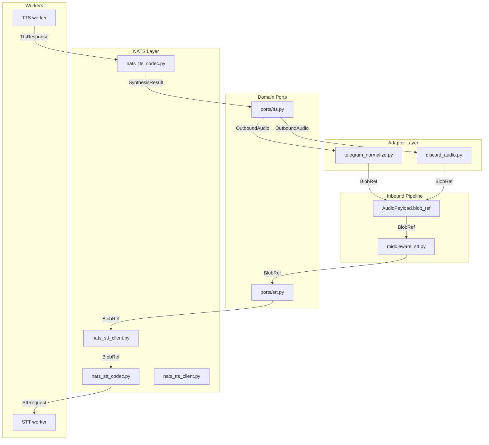
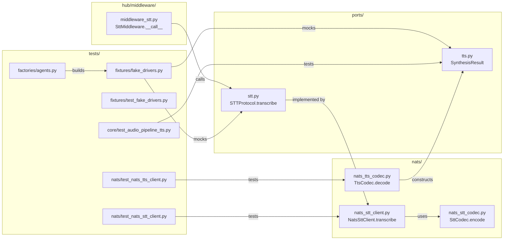

## Summary

Update Lyra hub-side voice contract (ports, middleware, codecs, clients) to exchange audio via `BlobRef` instead of inline `bytes`. Preserve backward-compatible `bytes` overload for attachment path. Update all test fixtures and docstrings.

## Architecture

### Data Flow

### File × Function Map

## Bootstrap Context

None required — this is a contract refactor on existing code, no new modules or external dependencies.

## Agents

| Agent | Task Count | Files | Subject |
|---|---|---|---|
| backend-dev-A | 6 | `ports/stt.py`, `ports/tts.py`, `middleware/middleware_stt.py`, `nats/nats_stt_codec.py`, `nats/nats_tts_codec.py`, `nats/nats_stt_client.py` | voice |
| tester-A | 6 | 6 test files | testing |
| doc-writer-A | 1 | `nats/stt_helpers.py` | docs |

## Wave Structure

4 waves, max 2 parallel agents. Elapsed ~1 day vs ~3 days sequential.

| Wave | Trigger | Agents | Tasks |
|---|---|---|---|
| 1 | start | backend-dev-A | T1→T4 (STT port, middleware, codec, client) |
| 2 | Wave 1 done | backend-dev-A | T5→T6 (TTS port, codec) |
| 3 | Wave 2 done | tester-A | T7→T12 (test fixtures) |
| 4 | Wave 3 done | doc-writer-A | T13 (docstrings) |

### Budget — per task

| Task | Items | Class | Est. ops | Split? |
|---|---|---|---|---|
| T1 | 1 | bounded | 3 | — |
| T2 | 1 | bounded | 3 | — |
| T3 | 1 | bounded | 3 | — |
| T4 | 1 | bounded | 3 | — |
| T5 | 1 | bounded | 2 | — |
| T6 | 1 | bounded | 2 | — |
| T7 | 2 | bounded | 3 | — |
| T8 | 1 | bounded | 2 | — |
| T9 | 1 | bounded | 3 | — |
| T10 | 1 | bounded | 3 | — |
| T11 | 1 | bounded | 3 | — |
| T12 | 1 | bounded | 2 | — |
| T13 | 1 | trivial | 1 | — |

**Total estimated ops: 31**

### Budget — per agent instance

| Instance | Tasks | Σ ops | Subjects | Split? |
|---|---|---|---|---|
| backend-dev-A | T1-T6 | 16 | voice | — |
| tester-A | T7-T12 | 16 | testing | — |
| doc-writer-A | T13 | 1 | docs | — |

## Micro-Tasks

### Slice 1+2 — STT port, middleware, codec, client

#### T1 — Update STT port signature

| Field | Value |
|---|---|
| Description | Update `STTProtocol.transcribe` to accept `BlobRef` as primary input, add `bytes` overload for attachment path |
| File | `src/lyra/core/ports/stt.py` |
| Code snippet | `async def transcribe(self, audio: BlobRef, mime: str) -> TranscriptionResult: ...` |
| Verify | `grep -n "BlobRef" src/lyra/core/ports/stt.py` |
| Expected | Shows `BlobRef` import and usage in `transcribe` |
| Time | 3 min |
| [P] | N |
| Agent | backend-dev-A |
| Subject | voice |
| Spec trace | SC-1, SC-2, SC-3 |
| Slice | V1+V2 |
| Phase | REFACTOR |
| Difficulty | 2 |

#### T2 — Update STT middleware

| Field | Value |
|---|---|
| Description | Replace `b""` placeholder in `SttMiddleware` with `msg.audio.blob_ref` |
| File | `src/lyra/core/hub/middleware/middleware_stt.py` |
| Code snippet | `hub._stt.transcribe(msg.audio.blob_ref, msg.audio.mime_type)` |
| Verify | `grep -n "blob_ref" src/lyra/core/hub/middleware/middleware_stt.py` |
| Expected | Shows `msg.audio.blob_ref` passed to `transcribe` |
| Time | 3 min |
| [P] | N |
| Agent | backend-dev-A |
| Subject | voice |
| Spec trace | SC-5 |
| Slice | V1 |
| Phase | REFACTOR |
| Difficulty | 2 |

#### T3 — Update STT codec

| Field | Value |
|---|---|
| Description | Change `SttCodec.encode` to accept `BlobRef` and embed it directly in `SttRequest` |
| File | `src/lyra/nats/nats_stt_codec.py` |
| Code snippet | `def encode(self, blob_ref: BlobRef, mime: str, params: SttEncodeParams) -> bytes:` |
| Verify | `grep -n "blob_ref" src/lyra/nats/nats_stt_codec.py` |
| Expected | Shows `blob_ref` parameter and direct embedding in `SttRequest` |
| Time | 3 min |
| [P] | N |
| Agent | backend-dev-A |
| Subject | voice |
| Spec trace | SC-6, SC-7 |
| Slice | V2 |
| Phase | REFACTOR |
| Difficulty | 2 |

#### T4 — Update STT client

| Field | Value |
|---|---|
| Description | Update `NatsSttClient.transcribe` to accept `BlobRef` and pass it to `SttCodec.encode` |
| File | `src/lyra/nats/nats_stt_client.py` |
| Code snippet | `async def transcribe(self, audio: BlobRef, mime: str) -> TranscriptionResult:` |
| Verify | `grep -n "BlobRef\|transcribe" src/lyra/nats/nats_stt_client.py` |
| Expected | Shows `BlobRef` in signature and codec call |
| Time | 3 min |
| [P] | N |
| Agent | backend-dev-A |
| Subject | voice |
| Spec trace | SC-4 |
| Slice | V2 |
| Phase | REFACTOR |
| Difficulty | 2 |

### Slice 3+4 — TTS port, codec

#### T5 — Update TTS result shape

| Field | Value |
|---|---|
| Description | Remove `audio_bytes` from `SynthesisResult`, make `blob_ref` required |
| File | `src/lyra/core/ports/tts.py` |
| Code snippet | `@dataclass class SynthesisResult: mime_type: str; duration_ms: int | None; waveform_b64: str | None; blob_ref: BlobRef; error: str` |
| Verify | `grep -n "audio_bytes\|blob_ref" src/lyra/core/ports/tts.py` |
| Expected | `audio_bytes` not found; `blob_ref` is present without `| None` |
| Time | 2 min |
| [P] | N |
| Agent | backend-dev-A |
| Subject | voice |
| Spec trace | SC-8, SC-9 |
| Slice | V3+V4 |
| Phase | REFACTOR |
| Difficulty | 2 |

#### T6 — Update TTS codec

| Field | Value |
|---|---|
| Description | Remove `audio_bytes` from `TtsCodec.decode` `SynthesisResult` constructor; add sentinel `BlobRef` for error paths |
| File | `src/lyra/nats/nats_tts_codec.py` |
| Code snippet | `return SynthesisResult(mime_type=resp.mime_type, duration_ms=resp.duration_ms, waveform_b64=resp.waveform_b64, blob_ref=resp.blob_ref)` |
| Verify | `grep -n "audio_bytes" src/lyra/nats/nats_tts_codec.py` |
| Expected | `audio_bytes` not found in file |
| Time | 2 min |
| [P] | N |
| Agent | backend-dev-A |
| Subject | voice |
| Spec trace | SC-10, SC-11 |
| Slice | V3+V4 |
| Phase | REFACTOR |
| Difficulty | 2 |

### Slice 5 — Test fixtures

#### T7 — Update fake drivers

| Field | Value |
|---|---|
| Description | Update `FakeStt` and `FakeTts` in test fixtures to use new signatures |
| File | `tests/fixtures/fake_drivers.py` |
| Code snippet | `FakeStt.transcribe(audio: BlobRef, mime: str)` and `FakeTts` returns `SynthesisResult(blob_ref=...)` |
| Verify | `grep -n "audio_bytes\|BlobRef" tests/fixtures/fake_drivers.py` |
| Expected | `audio_bytes` not found; `BlobRef` used in `FakeStt` |
| Time | 3 min |
| [P] | Y |
| Agent | tester-A |
| Subject | testing |
| Spec trace | SC-12 |
| Slice | V5 |
| Phase | RED-GATE |
| Difficulty | 3 |

#### T8 — Update fake driver tests

| Field | Value |
|---|---|
| Description | Update assertions in `test_fake_drivers.py` to match new signatures |
| File | `tests/fixtures/test_fake_drivers.py` |
| Code snippet | Assert `BlobRef` passed to `FakeStt.transcribe`; assert `result.blob_ref` on `FakeTts` |
| Verify | `grep -n "audio_bytes\|blob_ref" tests/fixtures/test_fake_drivers.py` |
| Expected | `audio_bytes` not found; `blob_ref` assertions present |
| Time | 2 min |
| [P] | Y |
| Agent | tester-A |
| Subject | testing |
| Spec trace | SC-12 |
| Slice | V5 |
| Phase | RED-GATE |
| Difficulty | 2 |

#### T9 — Update STT client tests

| Field | Value |
|---|---|
| Description | Update `test_nats_stt_client.py` to pass `BlobRef` instead of `bytes` to `client.transcribe` |
| File | `tests/nats/test_nats_stt_client.py` |
| Code snippet | `client.transcribe(BlobRef(...), "audio/ogg")` |
| Verify | `grep -n "transcribe" tests/nats/test_nats_stt_client.py` |
| Expected | Shows `BlobRef` passed to `transcribe` |
| Time | 3 min |
| [P] | Y |
| Agent | tester-A |
| Subject | testing |
| Spec trace | SC-12 |
| Slice | V5 |
| Phase | RED-GATE |
| Difficulty | 3 |

#### T10 — Update TTS client tests

| Field | Value |
|---|---|
| Description | Update `test_nats_tts_client.py` to assert `blob_ref` instead of `audio_bytes` |
| File | `tests/nats/test_nats_tts_client.py` |
| Code snippet | `assert result.blob_ref is not None` |
| Verify | `grep -n "audio_bytes\|blob_ref" tests/nats/test_nats_tts_client.py` |
| Expected | `audio_bytes` not found; `blob_ref` assertions present |
| Time | 3 min |
| [P] | Y |
| Agent | tester-A |
| Subject | testing |
| Spec trace | SC-12 |
| Slice | V5 |
| Phase | RED-GATE |
| Difficulty | 3 |

#### T11 — Update audio pipeline TTS tests

| Field | Value |
|---|---|
| Description | Update `test_audio_pipeline_tts.py` to use `SynthesisResult(blob_ref=...)` |
| File | `tests/core/test_audio_pipeline_tts.py` |
| Code snippet | `SynthesisResult(blob_ref=BlobRef(...), mime_type="audio/ogg", ...)` |
| Verify | `grep -n "audio_bytes\|blob_ref" tests/core/test_audio_pipeline_tts.py` |
| Expected | `audio_bytes` not found; `blob_ref` present in constructors |
| Time | 3 min |
| [P] | Y |
| Agent | tester-A |
| Subject | testing |
| Spec trace | SC-12 |
| Slice | V5 |
| Phase | RED-GATE |
| Difficulty | 3 |

#### T12 — Update agent factories

| Field | Value |
|---|---|
| Description | Update `tests/factories/agents.py` to build mock STT/TTS with new signatures |
| File | `tests/factories/agents.py` |
| Code snippet | `make_mock_stt` returns callable accepting `BlobRef` |
| Verify | `grep -n "audio_bytes\|BlobRef" tests/factories/agents.py` |
| Expected | `audio_bytes` not found; `BlobRef` used in mock STT |
| Time | 2 min |
| [P] | Y |
| Agent | tester-A |
| Subject | testing |
| Spec trace | SC-12 |
| Slice | V5 |
| Phase | RED-GATE |
| Difficulty | 2 |

### Slice 6 — Docstrings

#### T13 — Update STT helper docstrings

| Field | Value |
|---|---|
| Description | Update `stt_helpers.py` docstring to reference `BlobRef` instead of `bytes` |
| File | `src/lyra/nats/stt_helpers.py` |
| Code snippet | Docstring mentions `STTProtocol.transcribe(blob_ref, mime)` |
| Verify | `grep -n "transcribe" src/lyra/nats/stt_helpers.py` |
| Expected | Shows `BlobRef` or `blob_ref` in docstring |
| Time | 1 min |
| [P] | Y |
| Agent | doc-writer-A |
| Subject | docs |
| Spec trace | SC-12 |
| Slice | V6 |
| Phase | REFACTOR |
| Difficulty | 1 |

## Consistency Report

| Spec Item | Covered By | Status |
|---|---|---|
| SC-1 | T1 | ✓ |
| SC-2 | T1 | ✓ |
| SC-3 | T1 | ✓ |
| SC-4 | T4 | ✓ |
| SC-5 | T2 | ✓ |
| SC-6 | T3 | ✓ |
| SC-7 | T3 | ✓ |
| SC-8 | T5 | ✓ |
| SC-9 | T5 | ✓ |
| SC-10 | T6 | ✓ |
| SC-11 | T6 | ✓ |
| SC-12 | T7-T12 | ✓ |
| SC-13 | T7-T13 | ✓ |
| SC-14 | T7-T13 | ✓ |

**Coverage:** 14/14 success criteria covered.
**Untraced:** None.
**Exemptions:** Attachment path (`simple_agent_prompts.py`) uses `bytes` overload — tracked separately, not in scope.

## Task Seeding Blueprint

### Wave 1 — no deps, 1 agent

| Task | Agent instance | blockedBy | Subject |
|---|---|---|---|
| T1 | backend-dev-A | — | voice |
| T2 | backend-dev-A | T1 | voice |
| T3 | backend-dev-A | T2 | voice |
| T4 | backend-dev-A | T3 | voice |

### Wave 2 — after Wave 1, 1 agent

| Task | Agent instance | blockedBy | Subject |
|---|---|---|---|
| T5 | backend-dev-A | T4 | voice |
| T6 | backend-dev-A | T5 | voice |

### Wave 3 — after Wave 2, 1 agent

| Task | Agent instance | blockedBy | Subject |
|---|---|---|---|
| T7 | tester-A | T6 | testing |
| T8 | tester-A | T7 | testing |
| T9 | tester-A | T7 | testing |
| T10 | tester-A | T7 | testing |
| T11 | tester-A | T7 | testing |
| T12 | tester-A | T7 | testing |

### Wave 4 — after Wave 3, 1 agent

| Task | Agent instance | blockedBy | Subject |
|---|---|---|---|
| T13 | doc-writer-A | T12 | docs |

## Task IDs

<!-- Generated by /plan. Used by /implement to resume tasks on session restart. -->
- T1: {task_id} — voice
- T2: {task_id} — voice
- T3: {task_id} — voice
- T4: {task_id} — voice
- T5: {task_id} — voice
- T6: {task_id} — voice
- T7: {task_id} — testing
- T8: {task_id} — testing
- T9: {task_id} — testing
- T10: {task_id} — testing
- T11: {task_id} — testing
- T12: {task_id} — testing
- T13: {task_id} — docs
