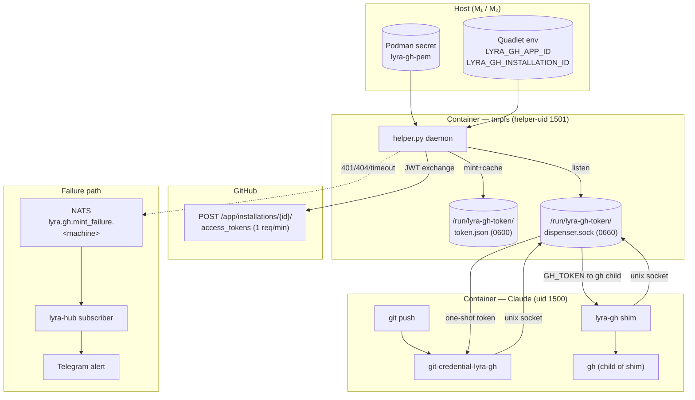
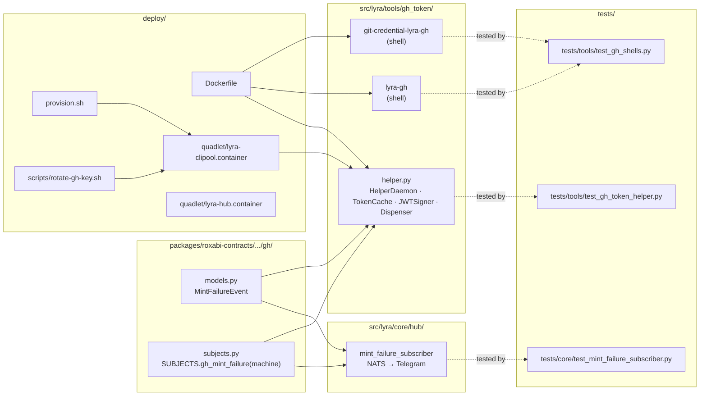

## Summary

Add `lyra[bot]` GitHub identity to `lyra-clipool` via a token-mint helper running under a distinct uid (1501),
tmpfs-backed cache, Unix socket dispenser, transparent git credential helper + `lyra-gh` shim. Token never
reaches Claude's subprocess env. 8 slices: helper → shells → image/Quadlet → provision → rotate → hub-alert
→ App-reg/branch-protection → M₂ Lyra-dev. Lifts decisions from approved spec (no re-debate).

## Architecture

### Data Flow

### File × Function Map

## Bootstrap Context

3-expert consensus panel (architect + security-auditor + devops) verdict at
`artifacts/analyses/lyra-github-app-identity-consensus.mdx` (commit `8983d0f1` on branch
`docs/github-app-consensus` — not yet merged into `staging`; reachable via
`git show 8983d0f1:artifacts/analyses/lyra-github-app-identity-consensus.mdx`). Locked decisions
treated as binding — no re-debate. Spec at `artifacts/specs/1078-github-app-identity-spec.mdx`
encodes 20 binary acceptance criteria and 8 slices. χ-1 (rate-limit guard) and χ-4 (envelope schema)
resolved during review. χ-2 (`/proc hidepid=2`) is a runtime decision at slice-3 implementation —
non-blocking for plan generation.

## Agents

| Agent | Tasks | Files |
|-------|-------|-------|
| backend-dev | T1, T2, T3, T4, T6, T7, T17 | `packages/roxabi-contracts/.../gh/`, `src/lyra/tools/gh_token/*`, `src/lyra/core/hub/mint_failure_subscriber.py` |
| devops | T9, T10, T11, T13, T15, T19, T20, ~~T21~~, T22 | `Dockerfile`, `deploy/quadlet/*.container`, `deploy/provision.sh`, `deploy/scripts/rotate-gh-key.sh`, github.com config |
| tester | T5, T8, T12, T14, T16, T18 | `tests/tools/*`, `tests/core/test_mint_failure_subscriber.py`, smoke runbooks |
| security-auditor | T23 | (read-only audit pass) |
| doc-writer | T24 | `docs/ops/gh-key-rotation.md` |

## Wave Structure

7 waves, max 5 ∥ agents at peak (Wave 1). Elapsed ~3–5 days parallel vs ~2 weeks sequential.

| Wave | Trigger | Agents | Tasks |
|------|---------|--------|-------|
| 1 | start | 5 ∥ | backend-dev-A: T1 · devops-A: T11 · devops-B: T13→T15 · devops-C: T19→T20 |
| 2 | T1 done | 4 ∥ | backend-dev-A: T2 · backend-dev-B: T17 · tester-A: T14 (after T13) · doc-writer: T24 (after T15) |
| 3 | T2 done | 2 ∥ | backend-dev-A: T3 · devops-A: T9 |
| 4 | T3+T9 done | 4 ∥ | backend-dev-A: T4 · backend-dev-B: T6 · backend-dev-C: T7 · devops-A: T10 |
| 5 | T4,T6,T7,T10 done | 2 ∥ | tester-A: T5 (RG-V1) → T12 (RG-V3) · tester-B: T8 (RG-V2) → T16 |
| 6 | Wave 5 + T17 done | 2 ∥ | tester-A: T18 (RG-V6) · security-auditor: T23 |
| 7 | V1–V6 + T19+T20 done | 1 | devops-A: T22 |

## Consistency Report

- Criteria covered: 20/20 (all 20 binary ACs traced to ≥1 task)
- Uncovered criteria: none
- Tasks without spec backing: none
- Gold plating exemptions: 1 (T24 rotation runbook — docs sole-purpose)
- Total tasks: 24 (above F-lite 5–15 ceiling — driven by 8-slice scope; 8 slices × ≥2/slice floor + cross-cutting)

## Micro-Tasks

### Slice V1 — Token-mint helper + envelope schema

#### T1: Add `gh/` contract module to `roxabi-contracts` (envelope + subject) [P] → backend-dev
- **File:** `packages/roxabi-contracts/src/roxabi_contracts/gh/{__init__.py,models.py,subjects.py,fixtures.py}`
- **Snippet:** `class MintFailureEvent(ContractEnvelope): machine: str; reason: str; http_status: int | None; retries: int` + `SUBJECTS.gh_mint_failure(machine: str) -> str`
- **Verify:** `uv run pytest packages/roxabi-contracts/tests/test_gh.py -q`
- **Expected:** schema validates; subject pattern matches `lyra.gh.mint_failure.<machine>`
- **Time:** 8 min · **Difficulty:** 2
- **Traces:** N9 → AC mint-failure-#1 (envelope ContractEnvelope fields) · χ-4
- **Phase:** RED→GREEN

#### T2: Implement `helper.py` core (JWT signer + token cache + GitHub API exchange) → backend-dev
- **File:** `src/lyra/tools/gh_token/helper.py`
- **Snippet:** `class JWTSigner` (RS256 from PEM) · `class TokenCache(path: Path)` · `async def mint(app_id, install_id) -> InstallationToken`
- **Verify:** `uv run pytest tests/tools/test_gh_token_helper.py::test_mint_against_stub -q`
- **Expected:** stub returns 201 → cache populated, token expiry tracked
- **Time:** 10 min · **Difficulty:** 4
- **Traces:** N4 → S1 · AC identity-#1, AC functional-#1
- **Phase:** GREEN

#### T3: Add Unix socket dispenser to helper.py (listen on `/run/lyra-gh-token/dispenser.sock`) → backend-dev
- **File:** `src/lyra/tools/gh_token/helper.py`
- **Snippet:** `async def serve(sock_path: Path)` — accept conns, parse 1-line request `get|peek`, write `username=x-access-token\npassword=…\n`, close
- **Verify:** `uv run pytest tests/tools/test_gh_token_helper.py::test_dispenser_socket -q`
- **Expected:** socket created mode 0660, group `lyra-tokenuser`; protocol round-trip works
- **Time:** 8 min · **Difficulty:** 3
- **Traces:** N6 → S1 · AC functional-#1, AC isolation-#1
- **Phase:** GREEN

#### T4: Add near-expiry refresh + lock+mint cap ≤10 s + hard-cap mint at 1/45 s → backend-dev
- **File:** `src/lyra/tools/gh_token/helper.py`
- **Snippet:** `async def refresh_loop()` background task · `asyncio.Lock()` around mint · `RateLimiter(min_interval_s=45)`
- **Verify:** `uv run pytest tests/tools/test_gh_token_helper.py::test_refresh_and_caps -q`
- **Expected:** 12 rapid mint calls produce ≤2 GitHub API hits in 60 s; cap returns cached on burst
- **Time:** 8 min · **Difficulty:** 4
- **Traces:** N4 (caps) · UC4, edge: crash-loop · χ-1
- **Phase:** GREEN

#### T5: RED-GATE V1 — full helper unit test pass against GitHub API stub → tester
- **File:** `tests/tools/test_gh_token_helper.py`
- **Snippet:** stub via `respx` or fixture; exercise mint, cache hit, near-expiry refresh, dispenser, mint-failure event emit
- **Verify:** `uv run pytest tests/tools/test_gh_token_helper.py -q`
- **Expected:** all helper tests pass; failure path emits `MintFailureEvent`
- **Time:** 10 min · **Difficulty:** 4
- **Traces:** RED-GATE V1
- **Phase:** RED-GATE

### Slice V2 — Credential helper + `lyra-gh` shim

#### T6: Write `git-credential-lyra-gh` script (git protocol `get` over socket) [P] → backend-dev
- **File:** `src/lyra/tools/gh_token/git-credential-lyra-gh`
- **Snippet:** `#!/bin/sh` · `[ "$1" = get ] || exit 0` · `socat - UNIX-CONNECT:/run/lyra-gh-token/dispenser.sock <<< 'get'`
- **Verify:** `bash -n src/lyra/tools/gh_token/git-credential-lyra-gh && shellcheck src/lyra/tools/gh_token/git-credential-lyra-gh`
- **Expected:** syntax + shellcheck clean
- **Time:** 5 min · **Difficulty:** 2
- **Traces:** N7 → U1 · AC functional-#1
- **Phase:** GREEN

#### T7: Write `lyra-gh` shim script (socket → token → exec gh with scoped env) [P] → backend-dev
- **File:** `src/lyra/tools/gh_token/lyra-gh`
- **Snippet:** `#!/bin/sh` · `T=$(socat - UNIX-CONNECT:…/dispenser.sock <<< 'get' | sed -n 's/^password=//p')` · `exec env GH_TOKEN="$T" gh "$@"`
- **Verify:** `bash -n src/lyra/tools/gh_token/lyra-gh && shellcheck src/lyra/tools/gh_token/lyra-gh`
- **Expected:** syntax + shellcheck clean
- **Time:** 5 min · **Difficulty:** 2
- **Traces:** N8 → U2 · AC functional-#3
- **Phase:** GREEN

#### T8: RED-GATE V2 — integration test: `git push` + `lyra-gh` against mock dispenser → tester
- **File:** `tests/tools/test_gh_shells.py`
- **Snippet:** spawn local mock dispenser, configure git credential helper, run `git push` against `git daemon` test repo
- **Verify:** `uv run pytest tests/tools/test_gh_shells.py -q`
- **Expected:** push succeeds with stub token; `lyra-gh` `--version` succeeds with mock
- **Time:** 10 min · **Difficulty:** 4
- **Traces:** RED-GATE V2 · AC functional-#1, #3
- **Phase:** RED-GATE

### Slice V3 — Image + Quadlet wiring + hub-clean verification

#### T9: Update `Dockerfile` (drop gh, create users/groups, copy tools, bake git config tmpl) → devops
- **File:** `Dockerfile`
- **Snippet:** `RUN groupadd -g 1502 lyra-tokenuser && useradd -u 1501 -G lyra-tokenuser lyra-gh && usermod -aG lyra-tokenuser lyra` · `COPY src/lyra/tools/gh_token/ /opt/lyra-gh/` · `RUN ln -s /opt/lyra-gh/lyra-gh /usr/local/bin/lyra-gh` · drop any `apt install gh` / `gh` package · `COPY deploy/git.config.tmpl /etc/lyra/git.config.tmpl`
- **Verify:** `grep -E '^(RUN apt-get install.*\bgh\b\|.*github-cli)' Dockerfile` returns empty AND `grep -q 'lyra-tokenuser' Dockerfile` AND `grep -q 'useradd -u 1501' Dockerfile`
- **Expected:** all 3 conditions satisfied
- **Time:** 8 min · **Difficulty:** 3
- **Traces:** N3 → S1 · AC functional-#4 (no plain gh), AC hardening-#1
- **Phase:** GREEN

#### T10: Update `deploy/quadlet/lyra-clipool.container` (Tmpfs/Secret/Env + StartLimit + git-config strategy + decide χ-2) → devops
- **File:** `deploy/quadlet/lyra-clipool.container`
- **Snippet:** add lines: `Tmpfs=/run/lyra-gh-token:mode=0700,uid=1501,gid=1501` · `Secret=lyra-gh-pem,target=/run/secrets/gh-app.pem,mode=0400,uid=1501,gid=1501` · `Environment=LYRA_GH_APP_ID=…` · `Environment=LYRA_GH_INSTALLATION_ID=…` · `StartLimitIntervalSec=60` · `StartLimitBurst=5` · choose `Environment=GIT_CONFIG_GLOBAL=/etc/lyra/git.config.tmpl` (preferred — simpler) OR `Tmpfs=/home/lyra/.config/git:…` + `ExecStartPre=…` · decide χ-2 hidepid=2 (default: skip — opt-in via security-opt only if ops introspection drops are acceptable)
- **Verify:** `grep -E 'StartLimitIntervalSec|StartLimitBurst|lyra-gh-pem|GIT_CONFIG_GLOBAL\|/home/lyra/.config/git' deploy/quadlet/lyra-clipool.container` shows all expected lines
- **Expected:** every required directive present; ReadOnly=true preserved (no new writable Volume=)
- **Time:** 10 min · **Difficulty:** 4
- **Traces:** S1 · AC hardening-#1, #2 · χ-1, χ-2
- **Phase:** GREEN

#### T11: Verify `lyra-hub.container` clean (no PEM, no LYRA_GH_*, no gh) [P] → devops
- **File:** `deploy/quadlet/lyra-hub.container` (read-only check; commit only if it currently has anything to remove)
- **Snippet:** N/A — verification gate
- **Verify:** `grep -iE 'pem\|gh_app\|gh-app\|lyra-gh\|LYRA_GH_' deploy/quadlet/lyra-hub.container` returns empty
- **Expected:** zero matches (preserves issue #941 boundary)
- **Time:** 2 min · **Difficulty:** 1
- **Traces:** S2 · AC hardening-#3
- **Phase:** GREEN

#### T12: RED-GATE V3 — clipool restart + smoke (subuid + StartLimit + git push + which gh empty) → tester
- **File:** `tests/runbooks/v3_smoke.md` (manual procedure doc) + executed on M₁
- **Snippet:** `make lyra-clipool restart` · `podman exec lyra-clipool id lyra-gh` (verify uid 1501 mapped) · `podman exec lyra-clipool which gh; which lyra-gh` · `podman exec lyra-clipool su - lyra -c 'git config --global --get credential.helper'` · force 5 quick fails → check `systemctl --user status lyra-clipool` shows StartLimit hold
- **Verify:** all 5 sub-checks pass per spec ACs
- **Expected:** uid 1501 resolves inside `keep-id:uid=1500` namespace; `which gh` empty; `credential.helper`=lyra-gh; StartLimit hold after 5 fails
- **Time:** 10 min · **Difficulty:** 4
- **Traces:** RED-GATE V3 · AC functional-#2,#3,#4 · AC hardening-#1,#2 · AC isolation-#3
- **Phase:** RED-GATE

### Slice V4 — provision.sh extension

#### T13: Extend `deploy/provision.sh` with idempotent secret bootstrap [P] → devops
- **File:** `deploy/provision.sh`
- **Snippet:** declare `GH_PEM_PATH` near top with `USER_RE`-style validation; after agent-user section: `podman secret inspect lyra-gh-pem &>/dev/null || podman secret create lyra-gh-pem "$GH_PEM_PATH"`
- **Verify:** `bash -n deploy/provision.sh && shellcheck deploy/provision.sh` AND grep `lyra-gh-pem`
- **Expected:** clean syntax + new block referenced
- **Time:** 5 min · **Difficulty:** 2
- **Traces:** S3 · AC ops-#1
- **Phase:** GREEN

#### T14: Idempotency test — run `provision.sh` twice on clean host → tester
- **File:** `tests/runbooks/v4_provision_idempo.md` (manual on M₁ test slot)
- **Snippet:** `podman secret rm lyra-gh-pem || true` · `bash deploy/provision.sh` · `podman secret inspect lyra-gh-pem > /tmp/a` · `bash deploy/provision.sh` · `podman secret inspect lyra-gh-pem > /tmp/b` · `diff /tmp/a /tmp/b`
- **Verify:** diff empty, both runs exit 0
- **Expected:** zero state diff; missing/invalid `GH_PEM_PATH` exits non-zero with clear message
- **Time:** 5 min · **Difficulty:** 2
- **Traces:** AC ops-#1
- **Phase:** RED-GATE

### Slice V5 — rotate-gh-key.sh automation

#### T15: Create `deploy/scripts/rotate-gh-key.sh` [P] → devops
- **File:** `deploy/scripts/rotate-gh-key.sh`
- **Snippet:** header comment documents TCP-reset of in-flight ops · `set -euo pipefail` · arg `$1` = new pem path · `podman secret rm lyra-gh-pem` · `podman secret create lyra-gh-pem "$1"` · `systemctl --user restart lyra-clipool` · `until curl -sf <healthcheck>; do sleep 0.5; done`
- **Verify:** `bash -n deploy/scripts/rotate-gh-key.sh && shellcheck deploy/scripts/rotate-gh-key.sh`
- **Expected:** clean syntax
- **Time:** 5 min · **Difficulty:** 2
- **Traces:** S4 · AC ops-#2
- **Phase:** GREEN

#### T16: Rotation test — measure ≤10 s downtime on M₁ → tester
- **File:** `tests/runbooks/v5_rotate.md` (manual on M₁)
- **Snippet:** generate test PEM · `time bash deploy/scripts/rotate-gh-key.sh /tmp/test.pem` · record wall-clock
- **Verify:** time field ≤10 s; healthcheck pass at end
- **Expected:** ≤10 s end-to-end
- **Time:** 5 min · **Difficulty:** 2
- **Traces:** AC ops-#2
- **Phase:** RED-GATE

### Slice V6 — Hub mint-failure NATS subscriber → Telegram

#### T17: Add `mint_failure_subscriber` to hub event-bus → backend-dev
- **File:** `src/lyra/core/hub/mint_failure_subscriber.py` (new) + register in hub bootstrap
- **Snippet:** subscribe `lyra.gh.mint_failure.>` · parse `MintFailureEvent` · format → call existing telegram-alert path
- **Verify:** `uv run pytest tests/core/test_mint_failure_subscriber.py -q`
- **Expected:** publish stub event → telegram-send called with formatted text
- **Time:** 8 min · **Difficulty:** 3
- **Traces:** N9 → S5 · AC mint-failure-#1, #2
- **Phase:** GREEN

#### T18: RED-GATE V6 — end-to-end mint failure simulation (revoke installation token) → tester
- **File:** `tests/runbooks/v6_mint_failure.md` (manual integrating real hub + clipool on M₁)
- **Snippet:** revoke installation token via GitHub UI · trigger Claude `git push` → fail · `nats sub lyra.gh.mint_failure.>` shows event with `contract_version`/`trace_id`/`issued_at` · staging Telegram chat receives alert ≤30 s
- **Verify:** both NATS event AND Telegram message observed
- **Expected:** envelope schema valid; Telegram message arrives within 30 s
- **Time:** 10 min · **Difficulty:** 3
- **Traces:** RED-GATE V6 · AC mint-failure-#1, #2
- **Phase:** RED-GATE

### Slice V7 — App registration + branch protection (manual one-time)

#### T19: Register `Lyra-prod` GitHub App + verify permissions [P] → devops
- **File:** github.com/settings/apps (manual UI) + record IDs in spec/runbook
- **Snippet:** create App `Lyra-prod` · permissions exactly `contents:write`, `pull-requests:write`, `issues:write` · install on Roxabi org allowlisted to relevant repos · download PEM · run `gh api /apps/lyra-prod` and assert no extra perms
- **Verify:** `gh api /apps/<slug> --jq '.permissions'` returns exactly those 3 keys
- **Expected:** non-empty App ID + installation ID; permissions spec match
- **Time:** 8 min · **Difficulty:** 2
- **Traces:** N1 · AC identity-#1, #2
- **Phase:** GREEN [manual]

#### T20: Set Roxabi/lyra `main` branch protection (auto-merge off for `lyra[bot]`, reviewer ≥1, force-push reject) [P] → devops
- **File:** github.com/Roxabi/lyra/settings/branches (manual UI) + verification via gh api
- **Snippet:** required reviewers ≥1 · disable allow_auto_merge for PRs authored by `lyra[bot]` · enforce_admins as appropriate · disable force pushes
- **Verify:** `gh api repos/Roxabi/lyra/branches/main/protection --jq '.required_pull_request_reviews.required_approving_review_count, .allow_force_pushes.enabled'`
- **Expected:** approver count ≥1; force_pushes disabled; auto-merge guarded
- **Time:** 5 min · **Difficulty:** 2
- **Traces:** N10 · AC branch-#1, #2, #3
- **Phase:** GREEN [manual]

### Slice V8 — M₂ Lyra-dev parallel deployment (configuration repeat)

#### ~~T21: Register `Lyra-dev` GitHub App on github.com (scoped to dev/test repos only, NOT org-wide) → devops~~ — **removed (2026-05-06)**

> Collapsed to single App `lyra-harness` (id 3619198, install_id 129952244) on both M₁ and M₂. See spec AC #10 update.

#### T22: M₂ deploy — provision + restart + smoke push from dev clipool → devops
- **File:** M₂ host operations
- **Snippet:** copy PEM · `GH_PEM_PATH=… bash deploy/provision.sh` · `make lyra-clipool restart` · smoke `git push` against test repo · verify Quadlet env on M₂ = M₁ (same `LYRA_GH_APP_ID=3619198`)
- **Verify:** smoke push succeeds; M₁ unaffected (check M₁ healthcheck still ✓); both hosts show same `app_id`
- **Expected:** all 3 conditions hold
- **Time:** 10 min · **Difficulty:** 3
- **Traces:** UC7 · AC identity-#3
- **Phase:** RED-GATE [manual]

### Cross-cutting

#### T23: Security audit pass on token-isolation invariants → security-auditor
- **File:** read-only audit, no code changes (output: notes appended to plan or follow-up issue if findings)
- **Snippet:** verify uid 1501 ≠ 1500 throughout · `cat /run/lyra-gh-token/token.json` from uid 1500 → "Permission denied" · `env | grep -iE 'gh_token|github_token'` from Claude shell empty · no env contains `^ghs_[A-Za-z0-9]{36,}$` · `ReadOnly=true` preserved · no env-var trace after `lyra-gh` exits
- **Verify:** all 6 invariants observed and documented
- **Expected:** zero findings; if any → file follow-up issue, do not block merge
- **Time:** 8 min · **Difficulty:** 3
- **Traces:** AC isolation-#1, #2, #3 · AC hardening-#1
- **Phase:** REFACTOR

#### T24: Document GitHub key rotation runbook [P] → doc-writer
- **File:** `docs/ops/gh-key-rotation.md` (new)
- **Snippet:** when to rotate · how to call `rotate-gh-key.sh` · expected ≤10 s downtime · TCP-reset behavior on in-flight ops · how to verify post-rotation · what to do on failure (rollback to prior PEM via `secret rm`+`secret create` with archived PEM)
- **Verify:** `test -f docs/ops/gh-key-rotation.md && grep -q 'rotate-gh-key.sh' docs/ops/gh-key-rotation.md`
- **Expected:** runbook exists, references the script
- **Time:** 8 min · **Difficulty:** 2
- **Traces:** UC6 · (gold-plating exemption: docs sole-purpose)
- **Phase:** REFACTOR

## Task Seeding Blueprint

<!-- Used by /implement to seed TaskCreate calls on session start.
     Format: T{n} | agent-instance | blockedBy | subject
     blockedBy refs T-numbers within this list.
     Agent instances named so parallel tasks map to distinct spawned agents.
     Seed in wave order; within a wave all rows are parallel (∥). -->

### Wave 1 — no deps, 5 agents ∥

| Task | Agent instance | blockedBy | Subject |
|------|---------------|-----------|---------|
| T1 | backend-dev-A | — | Add gh/ contract module to roxabi-contracts |
| T11 | devops-A | — | Verify lyra-hub.container has no PEM/gh references |
| T13 | devops-B | — | Extend provision.sh with idempotent secret bootstrap |
| T15 | devops-B | T13 | Create rotate-gh-key.sh |
| T19 | devops-C | — | Register Lyra-prod App + verify permissions |
| T20 | devops-C | T19 | Set Roxabi/lyra branch protection |

### Wave 2 — after T1, 4 agents ∥

| Task | Agent instance | blockedBy | Subject |
|------|---------------|-----------|---------|
| T2 | backend-dev-A | T1 | Implement helper.py core (JWT + cache + API exchange) |
| T17 | backend-dev-B | T1 | Add mint_failure_subscriber in hub |
| T14 | tester-A | T13 | Idempotency test for provision.sh |
| T24 | doc-writer | T15 | Document gh-key-rotation runbook |

### Wave 3 — after T2, 2 agents ∥

| Task | Agent instance | blockedBy | Subject |
|------|---------------|-----------|---------|
| T3 | backend-dev-A | T2 | Add Unix socket dispenser to helper.py |
| T9 | devops-A | T2 | Update Dockerfile (drop gh, users/groups, copy tools) |

### Wave 4 — after T3+T9, 4 agents ∥

| Task | Agent instance | blockedBy | Subject |
|------|---------------|-----------|---------|
| T4 | backend-dev-A | T3 | Add near-expiry refresh + lock+mint cap + 1/45s |
| T6 | backend-dev-B | T3 | Write git-credential-lyra-gh script |
| T7 | backend-dev-C | T3 | Write lyra-gh shim script |
| T10 | devops-A | T9 | Update lyra-clipool.container Quadlet |

### Wave 5 — after T4,T6,T7,T10, 2 agents ∥

| Task | Agent instance | blockedBy | Subject |
|------|---------------|-----------|---------|
| T5 | tester-A | T4 | RED-GATE V1 helper unit tests |
| T8 | tester-B | T6,T7 | RED-GATE V2 git-push integration test |
| T12 | tester-A | T5,T10,T11 | RED-GATE V3 clipool restart + smoke |
| T16 | tester-B | T8,T15,T10 | Rotation test ≤10s |

### Wave 6 — after Wave 5 + T17, 2 agents ∥

| Task | Agent instance | blockedBy | Subject |
|------|---------------|-----------|---------|
| T18 | tester-A | T12,T17 | RED-GATE V6 mint failure E2E |
| T23 | security-auditor | T12 | Security audit token-isolation invariants |

### Wave 7 — after V1–V6 + T19+T20, 1 agent

| Task | Agent instance | blockedBy | Subject |
|------|---------------|-----------|---------|
| ~~T21~~ | ~~devops-A~~ | ~~T19~~ | ~~Register Lyra-dev App on M₂~~ — removed (2026-05-06) |
| T22 | devops-A | T18 | M₂ deploy + smoke push |

## Task IDs

<!-- Generated by /plan. Used by /implement to resume tasks on session restart. -->
- T1: 1 — Add gh/ contract module to roxabi-contracts
- T2: 2 — Implement helper.py core (JWT + cache + API exchange)
- T3: 3 — Add Unix socket dispenser to helper.py
- T4: 4 — Add near-expiry refresh + lock+mint cap + 1/45s
- T5: 5 — RED-GATE V1 helper unit tests
- T6: 6 — Write git-credential-lyra-gh script
- T7: 7 — Write lyra-gh shim script
- T8: 8 — RED-GATE V2 git push integration test
- T9: 9 — Update Dockerfile (drop gh, users/groups, copy tools)
- T10: 10 — Update lyra-clipool.container Quadlet
- T11: 11 — Verify lyra-hub.container clean
- T12: 12 — RED-GATE V3 clipool restart + smoke
- T13: 13 — Extend provision.sh
- T14: 14 — Idempotency test for provision.sh
- T15: 15 — Create rotate-gh-key.sh
- T16: 16 — Rotation test ≤10s
- T17: 17 — Add mint_failure_subscriber in hub
- T18: 18 — RED-GATE V6 mint failure E2E
- T19: 19 — Register Lyra-prod App
- T20: 20 — Set Roxabi/lyra branch protection
- T21: 21 — Register Lyra-dev App on M₂ **(removed 2026-05-06 — collapsed to single App lyra-harness)**
- T22: 22 — M₂ deploy + smoke push
- T23: 23 — Security audit token-isolation invariants
- T24: 24 — Document gh-key-rotation runbook
