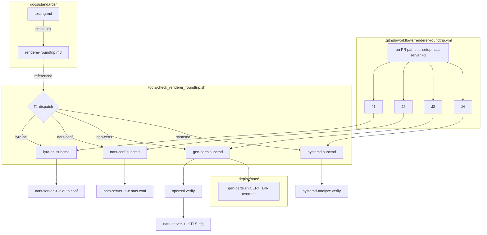
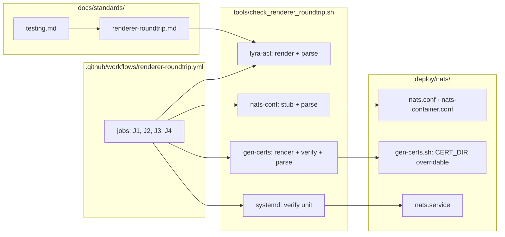

## Summary

Ship a generic `renderer-roundtrip` CI workflow that validates 4 renderers (lyra-acl genkeys, deploy/nats/nats.conf, gen-certs.sh, deploy/nats/nats.service) via their actual downstream consumers (`nats-server -t -c`, `openssl verify`, `systemd-analyze verify`), plus a standards doc + cross-link from testing.md.

## Architecture

## Agents

| Agent | Task count | Files |
|---|---|---|
| devops | 3 | `.github/workflows/renderer-roundtrip.yml`, `tools/check_renderer_roundtrip.sh`, `deploy/nats/gen-certs.sh` |
| doc-writer | 2 | `docs/standards/renderer-roundtrip.md`, `docs/standards/testing.md` |
| tester | 5 | RED-GATE verifications (1 per slice) |

## Wave Structure

3 waves, max 2 parallel agents. Elapsed ~1 hour vs ~2 hours sequential.

| Wave | Trigger | Agents | Tasks |
|------|---------|--------|-------|
| 1 | start | 2 ∥ | devops-A: T1→T3 · doc-writer-A: T2→T5 |
| 2 | Wave 1 done | 1 | devops-A: T4 |
| 3 | Wave 2 done | 1 | tester-A: T6, T7, T8, T9, T10 (serial; each <10 min) |

### Budget

| Task | Items | Class | Est. ops | Split? |
|------|-------|-------|----------|--------|
| T1 (F2 1-line edit) | 1 file | trivial | 2 | — |
| T2 (D1 doc, 6 sections) | 1 file | judgmental | 8 | — |
| T3 (T1 helper, 4 subcmds) | 1 file | judgmental | 10 | — |
| T4 (W1 workflow, 4 jobs) | 1 file | judgmental | 6 | — |
| T5 (L1 cross-link) | 1 file | bounded | 3 | — |
| T6–T10 (RED-GATEs) | 5 verifs | bounded | 15 | — |

**Total estimated ops: ~44**

## Consistency Report

| Spec criterion | Trace | Task |
|---|---|---|
| Workflow + conventions | SC1 | T4 |
| Slice 1 — lyra-acl 62-char fail | SC2 | T6 (RED-GATE V1) |
| Slice 2 — nats.conf stray `}` fail | SC3 | T7 (RED-GATE V2) |
| Slice 3 — gen-certs invalid cert fail | SC4 | T8 (RED-GATE V3) |
| Slice 4 — service ExecStart= fail | SC5 | T9 (RED-GATE V4) |
| Clean staging all green | SC6 | T4 + RED-GATEs invert |
| D1 sections + worked example | SC7 | T2 + T10 |
| testing.md cross-link | SC8 | T5 + T10 |
| D1 reviewer checklist | SC9 | T2 + T10 |

Coverage: 9/9 SCs traced.

## Micro-Tasks

### V1 — lyra-acl parse-gate

**T1 [P] — F2: `CERT_DIR` overridable in gen-certs.sh** *(devops, GREEN, difficulty 1)*

- File: `deploy/nats/gen-certs.sh`
- Change: `CERT_DIR="/etc/nats/certs"` → `CERT_DIR="${CERT_DIR:-/etc/nats/certs}"`
- Verify: `CERT_DIR=/tmp/foo bash -c 'CERT_DIR="${CERT_DIR:-/etc/nats/certs}"; echo "$CERT_DIR"'`
- Expected: `/tmp/foo`
- Spec trace: enables SC4

### V5 — standards doc (parallel with V1–V4 prep)

**T2 [P] — D1: write standards doc** *(doc-writer, GREEN, difficulty 2)*

- File: `docs/standards/renderer-roundtrip.md` (new)
- Sections (each non-empty): Pattern · When to apply · Required shape · Worked example · Failure modes · Reviewer checklist
- Worked example: full verbatim invocation `bash tools/check_renderer_roundtrip.sh lyra-acl $TMPDIR`
- Reviewer checklist line: "Does this PR add or modify a config renderer? If yes, verify a roundtrip test in `renderer-roundtrip.yml` covers it."
- Verify: `test -f docs/standards/renderer-roundtrip.md && grep -c '^## ' docs/standards/renderer-roundtrip.md`
- Expected: `6` (six top-level sections)
- Spec trace: SC7, SC9

### Cross-slice helper

**T3 — T1 helper script with 4 subcommands** *(devops, GREEN, difficulty 3, blockedBy T1)*

- File: `tools/check_renderer_roundtrip.sh` (new)
- Shebang `#!/usr/bin/env bash`, `set -euo pipefail`, dispatch on `$1`
- Subcommands:
  - `lyra-acl <tmpdir>`: invoke `lyra-acl genkeys --regen-authconf` → parse output → assert ∀ nkey: len==56 ∧ no embedded `\n` in quoted strings → `nats-server -t -c $tmpdir/auth.conf`
  - `nats-conf <tmpdir>`: create stub `$tmpdir/nkeys/auth.conf` (empty authorization block) → `nats-server -t -c deploy/nats/nats.conf` then `deploy/nats/nats-container.conf`
  - `gen-certs <tmpdir>`: `CERT_DIR=$tmpdir bash deploy/nats/gen-certs.sh` → `openssl verify -CAfile $tmpdir/ca.crt $tmpdir/server.crt` → emit minimal TLS-only nats config to `$tmpdir/tls.conf` referencing those paths → `nats-server -t -c $tmpdir/tls.conf`
  - `systemd <unit-path>`: `systemd-analyze verify <unit-path>` (allow warnings, fail on errors)
- Error format: `expected X, got Y` style diffs on invariant violations
- Verify: `bash -n tools/check_renderer_roundtrip.sh && tools/check_renderer_roundtrip.sh 2>&1 | grep -E 'lyra-acl|nats-conf|gen-certs|systemd'`
- Expected: usage line listing all 4 subcommands
- Spec trace: T1 affordance (W1 wiring), SC2–SC5

**T4 — W1 workflow file** *(devops, GREEN, difficulty 2, blockedBy T3)*

- File: `.github/workflows/renderer-roundtrip.yml` (new)
- Top-level: `permissions: contents: read`, `concurrency: group: renderer-roundtrip-${{ github.ref }}, cancel-in-progress: true`
- Triggers: `pull_request` (paths: `lyra-acl/**`, `deploy/nats/**`, `tools/check_renderer_roundtrip.sh`, `.github/workflows/renderer-roundtrip.yml`), `workflow_dispatch`
- Each job: `runs-on: ubuntu-latest`, `timeout-minutes: 10`, `actions/checkout@de0fac2e4500dabe0009e67214ff5f5447ce83dd # v6`, `set -euo pipefail` in run blocks
- Composite install step `Install nats-server` (jobs J1–J3): NATS_VERSION=2.10.22 tarball+SHA256, mirror `.github/workflows/ci.yml` lines 28–42
- Cache nats-server tarball: `actions/cache@<pinned>` keyed on `nats-server-${{ env.NATS_VERSION }}-${{ runner.arch }}`
- Jobs:
  - J1 `lyra-acl-parse`: install nats-server → `lyra-acl genkeys --regen-authconf` → `tools/check_renderer_roundtrip.sh lyra-acl $RUNNER_TEMP/lyra-acl`
  - J2 `nats-conf-parse`: install nats-server → `tools/check_renderer_roundtrip.sh nats-conf $RUNNER_TEMP/nats-conf`
  - J3 `gen-certs-roundtrip`: install nats-server → `tools/check_renderer_roundtrip.sh gen-certs $RUNNER_TEMP/certs`
  - J4 `nats-service-verify`: (no nats-server needed) → `tools/check_renderer_roundtrip.sh systemd deploy/nats/nats.service`
- Verify: `yamllint .github/workflows/renderer-roundtrip.yml && grep -c '^  [a-z-]*:$' .github/workflows/renderer-roundtrip.yml`
- Expected: 4 (job count)
- Spec trace: SC1, SC6

**T5 [P] — L1: cross-link from testing.md** *(doc-writer, GREEN, difficulty 1, blockedBy T2)*

- File: `docs/standards/testing.md` (edit)
- Insert under existing "Integration tests" heading (or add "Config validation" subsection if absent): one paragraph + link to `renderer-roundtrip.md`
- Verify: `grep -c "renderer-roundtrip" docs/standards/testing.md`
- Expected: `≥1`
- Spec trace: SC8

### RED-GATEs (Wave 3 — Verify slices)

**T6 — RED-GATE V1: J1 fails on 62-char nkey** *(tester, RED-GATE, difficulty 2, blockedBy T4)*

- Locally: patch `lyra-acl genkeys` to emit 62-char nkeys → run `act -j lyra-acl-parse` (or push to a throwaway branch) → confirm J1 fails with output containing `expected 56` and `got 62` → revert patch
- Verify: J1 fails with the expected diff strings
- Spec trace: SC2

**T7 — RED-GATE V2: J2 fails on stray `}`** *(tester, RED-GATE, difficulty 1, blockedBy T4)*

- Locally: append a stray `}` to `deploy/nats/nats.conf` → run J2 → confirm exit non-zero → revert
- Spec trace: SC3

**T8 — RED-GATE V3: J3 fails on invalid cert** *(tester, RED-GATE, difficulty 2, blockedBy T4)*

- Locally: remove `-subj` flag from one openssl invocation in `gen-certs.sh` (or otherwise break cert) → run J3 → confirm exit non-zero (openssl or nats-server step) → revert
- Spec trace: SC4

**T9 — RED-GATE V4: J4 fails on bad service** *(tester, RED-GATE, difficulty 1, blockedBy T4)*

- Locally: inject `ExecStart=` (empty value) into `deploy/nats/nats.service` → run J4 → confirm `systemd-analyze verify` exits non-zero → revert
- Spec trace: SC5

**T10 — RED-GATE V5: docs complete** *(tester, RED-GATE, difficulty 1, blockedBy T5)*

- Confirm `docs/standards/renderer-roundtrip.md` has all 6 non-empty sections, reviewer-checklist item present, worked example contains the verbatim `tools/check_renderer_roundtrip.sh lyra-acl` invocation
- Confirm `docs/standards/testing.md` links to `renderer-roundtrip.md`
- Spec trace: SC7, SC8, SC9

## Task Seeding Blueprint

<!-- Used by /implement to seed TaskCreate calls on session start.
     Format: T{n} | agent-instance | blockedBy | subject
     blockedBy refs T-numbers within this list (not session task IDs).
     Agent instances are named so parallel tasks map to distinct spawned agents.
     Seed in wave order; within a wave all rows are parallel (∥). -->

### Wave 1 — no deps, 2 agents ∥

| Task | Agent instance | blockedBy | Subject |
|------|---------------|-----------|---------|
| T1 | devops-A | — | F2: `CERT_DIR` overridable in deploy/nats/gen-certs.sh |
| T2 | doc-writer-A | — | D1: write docs/standards/renderer-roundtrip.md (6 sections, reviewer checklist, worked example) |

### Wave 2 — after Wave 1, 2 agents ∥

| Task | Agent instance | blockedBy | Subject |
|------|---------------|-----------|---------|
| T3 | devops-A | T1 | T1 helper: tools/check_renderer_roundtrip.sh with lyra-acl/nats-conf/gen-certs/systemd subcommands |
| T5 | doc-writer-A | T2 | L1: cross-link from docs/standards/testing.md to renderer-roundtrip.md |

### Wave 3 — after T3, 1 agent

| Task | Agent instance | blockedBy | Subject |
|------|---------------|-----------|---------|
| T4 | devops-A | T3 | W1: .github/workflows/renderer-roundtrip.yml with 4 parallel jobs + nats-server install + conventions |

### Wave 4 — after T4 + T5, 1 tester (serial)

| Task | Agent instance | blockedBy | Subject |
|------|---------------|-----------|---------|
| T6 | tester-A | T4 | RED-GATE V1: confirm J1 fails on 62-char nkey injection |
| T7 | tester-A | T4, T6 | RED-GATE V2: confirm J2 fails on stray `}` in nats.conf |
| T8 | tester-A | T4, T7 | RED-GATE V3: confirm J3 fails on invalid cert |
| T9 | tester-A | T4, T8 | RED-GATE V4: confirm J4 fails on bad service unit |
| T10 | tester-A | T5, T9 | RED-GATE V5: confirm D1 sections + reviewer checklist + testing.md cross-link |

## Task IDs

<!-- Generated by /plan. Used by /implement to resume tasks on session restart. -->
- T1: 11 — F2: CERT_DIR overridable in deploy/nats/gen-certs.sh
- T2: 12 — D1: write docs/standards/renderer-roundtrip.md
- T3: 13 — T1 helper: tools/check_renderer_roundtrip.sh with 4 subcommands
- T4: 14 — W1: .github/workflows/renderer-roundtrip.yml with 4 parallel jobs
- T5: 15 — L1: cross-link docs/standards/testing.md → renderer-roundtrip.md
- T6: 16 — RED-GATE V1: J1 fails on 62-char nkey injection
- T7: 17 — RED-GATE V2: J2 fails on stray `}` in nats.conf
- T8: 18 — RED-GATE V3: J3 fails on invalid cert
- T9: 19 — RED-GATE V4: J4 fails on bad service unit
- T10: 20 — RED-GATE V5: docs complete
