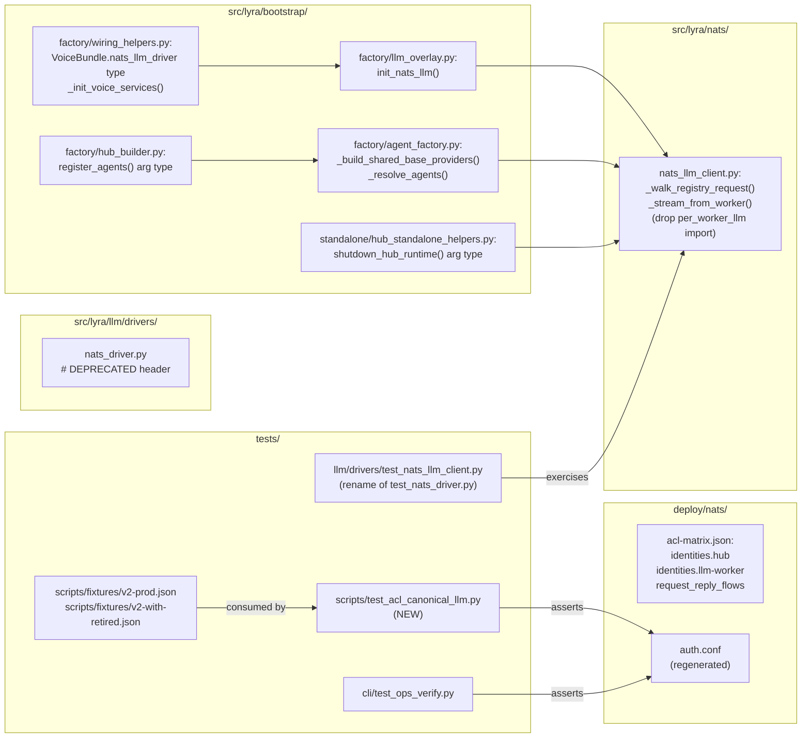

## Summary

Migrate the LLM NATS wire to its canonical contract end-to-end: flip
`acl-matrix.json` to canonical subjects → regenerate `auth.conf` → swap
`NatsLlmDriver` for `NatsLlmClient` in hub bootstrap → drop the
`per_worker_llm` publish path → mark legacy driver `# DEPRECATED`. All
three slices ship in a single PR; deploy is atomic on M₁ (regenerate
auth.conf + restart hub + restart llm-worker from sister PR llmCLI #12).

## Architecture

### Data flow

```mermaid
flowchart TD
    subgraph SRC["ACL source (deploy/nats/)"]
        MTX[acl-matrix.json<br/>identities.hub + llm-worker]
        RND[scripts/_renderer.py]
        AUTH[auth.conf<br/>regenerated]
    end
    subgraph BOOT["Hub bootstrap"]
        OV[llm_overlay.py<br/>init_nats_llm]
        WH[wiring_helpers.py<br/>VoiceBundle]
        HB[hub_builder.py<br/>register_agents]
        AF[agent_factory.py<br/>_build_shared_base_providers]
        HS[hub_standalone_helpers.py<br/>shutdown_hub_runtime]
    end
    subgraph CLIENT["Hub-side client"]
        NLC[nats_llm_client.py<br/>NatsLlmClient]
        LEGACY[nats_driver.py<br/>NatsLlmDriver — DEPRECATED]
    end
    subgraph CONT["Contracts (read-only)"]
        SUB[roxabi_contracts.llm.subjects.SUBJECTS]
        ENV[LlmRequest / LlmChunkEvent / LlmResponse]
    end

    MTX -->|lyra-acl genkeys --regenerate| RND --> AUTH
    SUB --> NLC
    ENV --> NLC
    OV --> NLC
    WH -.annotates.-> NLC
    HB -.annotates.-> NLC
    AF -->|registers "nats" slot| NLC
    HS -->|stop on shutdown| NLC
    LEGACY -.removed in follow-up.-> NLC

    classDef changed fill:#fde68a,stroke:#92400e
    classDef new fill:#bbf7d0,stroke:#166534
    classDef deprecated fill:#fecaca,stroke:#991b1b
    class MTX,AUTH,OV,WH,HB,AF,HS,NLC changed
    class LEGACY deprecated
```

### File × Function map



## Bootstrap Context

- ACL source-of-truth is `deploy/nats/acl-matrix.json` (JSON, not YAML as
  the issue body says). `lyra-acl genkeys --regenerate` deterministically
  emits `auth.conf` from this matrix via
  `scripts/_renderer.py:render_auth_conf`.
- `NatsLlmClient` already imports
  `roxabi_contracts.llm.SUBJECTS, per_worker_llm, validate_worker_id`;
  Slice 2 drops `per_worker_llm` only — `validate_worker_id` is still
  used in `_on_heartbeat` (line 127).
- Hub annotations across `bootstrap/factory/*.py` and
  `bootstrap/standalone/*.py` use **string-quoted** type hints (`from
  __future__ import annotations` in some, TYPE_CHECKING-guarded imports
  in all) — type changes are confined to the import + annotation
  strings, no runtime import changes.
- `register_agents` in `hub_builder.py` and `_init_voice_services` in
  `wiring_helpers.py` keep the parameter name `nats_llm_driver` —
  callers pass it positionally; renaming would broaden blast radius.
  Only the **type annotation** changes.
- Test fixture files `tests/scripts/fixtures/v1-legacy.json` and
  `v2-with-retired.json` represent historical snapshots; only
  `v2-prod.json` and `v2-with-retired.json` track the live matrix —
  `v1-legacy.json` is deliberately frozen for legacy-detection tests.
- 972-line `tests/llm/drivers/test_nats_driver.py` is heavily coupled
  to the legacy ad-hoc JSON wire format — a substantial slice of those
  tests do not survive the migration. Strategy: rename file to
  `test_nats_llm_client.py`, replace body with envelope-path tests
  (publish to `SUBJECTS.generate_request`, parse `LlmChunkEvent` /
  `LlmResponse`, heartbeat on `lyra.llm.heartbeat`).

## Agents

| Agent instance | Domain | Task count | Files |
|---------------|--------|------------|-------|
| devops-A | ACL config + manual ops | 4 | `deploy/nats/acl-matrix.json`, `deploy/nats/auth.conf`, follow-up issue creation |
| backend-dev-A | Hub-side NATS client | 2 | `src/lyra/nats/nats_llm_client.py`, `src/lyra/llm/drivers/nats_driver.py` |
| backend-dev-B | Bootstrap wiring | 5 | `src/lyra/bootstrap/factory/llm_overlay.py`, `wiring_helpers.py`, `hub_builder.py`, `agent_factory.py`, `bootstrap/standalone/hub_standalone_helpers.py` |
| tester-A | ACL regression + fixtures | 3 | `tests/scripts/test_acl_canonical_llm.py` (NEW), `tests/scripts/fixtures/v2-prod.json`, `tests/scripts/fixtures/v2-with-retired.json` |
| tester-B | Driver/client test migration | 2 | `tests/llm/drivers/test_nats_llm_client.py` (renamed), `tests/cli/test_ops_verify.py` |

## Wave Structure

3 waves, max 4 parallel agents. Elapsed ~2.5h vs ~6h sequential.

| Wave | Trigger | Agents | Tasks |
|------|---------|--------|-------|
| 1 | start | 3 ∥ | devops-A: T1→T2 · backend-dev-A: T3 · backend-dev-B: T4→T5 |
| 2 | Wave 1 done | 3 ∥ | tester-A: T6→T7 · tester-B: T8→T9 · backend-dev-A: T10 |
| 3 | Wave 2 done | 1 (sequential gate) | devops-A: T11 (file follow-up issue) · RED-GATE: T12 (atomic verify) |

## Consistency Report

| AC (from spec) | Covered by | Status |
|----------------|-----------|--------|
| AC-1: hub publish `lyra.llm.generate.request`, subscribe `lyra.llm.heartbeat` | T1 + T6 | ✓ |
| AC-2: llm-worker subscribe `lyra.llm.generate.request`, publish `lyra.llm.heartbeat` | T1 + T6 | ✓ |
| AC-3: auth.conf no longer references `lyra.llm.request` (without `.generate.`) nor `lyra.llm.health.*` | T2 + T6 | ✓ |
| AC-4: `init_nats_llm()` returns `NatsLlmClient \| None` | T4 | ✓ |
| AC-5: All five wiring points reference `NatsLlmClient` | T4 + T5 | ✓ |
| AC-6: `NatsLlmClient` publishes to `SUBJECTS.generate_request` (not per-worker), import removed | T3 | ✓ |
| AC-7: `NatsLlmDriver` source begins with `# DEPRECATED — …` | T10 + T11 | ✓ |
| AC-8: `pytest tests/llm/drivers/test_nats_*` passes against migrated client path | T8 | ✓ |

Coverage: 8/8. Untraced: 0. Exemptions: none.

## Micro-Tasks

### Slice 1 — ACL canonical migration (T1, T2, T6, T7)

#### T1 [P] · devops-A · RED · Difficulty 2 · 4 min · spec-trace AC-1, AC-2

**Edit `deploy/nats/acl-matrix.json`** — flip canonical subjects.

```json
// request_reply_flows entry
{ "requester": "hub", "responder": "llm-worker", "subject": "lyra.llm.generate.request" },

// identities.hub.publish — replace "lyra.llm.request" with "lyra.llm.generate.request"
// identities.hub.subscribe — replace "lyra.llm.health.*" with "lyra.llm.heartbeat"

// identities.llm-worker.publish — replace "lyra.llm.health.*" with "lyra.llm.heartbeat"
// identities.llm-worker.subscribe — replace "lyra.llm.request" with "lyra.llm.generate.request"
```

Verify: `jq '.identities.hub.publish, .identities["llm-worker"].subscribe' deploy/nats/acl-matrix.json | grep -c "lyra.llm.generate.request"`
Expected: `2`

#### T2 · devops-A · RED · Difficulty 2 · 3 min · spec-trace AC-3 · blockedBy T1

**Regenerate `deploy/nats/auth.conf`** from updated matrix.

```bash
uv run lyra-acl genkeys --template-only > deploy/nats/auth.conf.new
mv deploy/nats/auth.conf.new deploy/nats/auth.conf
```

(Production deployment uses `sudo … --regenerate`; commit-time uses
`--template-only` since the rendered file already lives in the repo and
nkeys are not committed.)

Verify: `grep -E "lyra\.llm\.request[^.]|lyra\.llm\.health\.\*" deploy/nats/auth.conf || echo "CLEAN"`
Expected: `CLEAN`

#### T6 [P] · tester-A · GREEN · Difficulty 2 · 5 min · spec-trace AC-1, AC-2, AC-3

**Add `tests/scripts/test_acl_canonical_llm.py`** — regression test.

Skeleton:
```python
import re
from pathlib import Path

AUTH_CONF = Path("deploy/nats/auth.conf").read_text()

def test_hub_canonical_publish():
    # hub block contains canonical request
    assert "lyra.llm.generate.request" in AUTH_CONF

def test_hub_canonical_subscribe():
    assert "lyra.llm.heartbeat" in AUTH_CONF

def test_no_legacy_subjects():
    # legacy "lyra.llm.request" without .generate. must not appear
    assert not re.search(r'"lyra\.llm\.request"', AUTH_CONF)
    # legacy heartbeat pattern must not appear
    assert "lyra.llm.health.*" not in AUTH_CONF
```

Verify: `uv run pytest tests/scripts/test_acl_canonical_llm.py -v`
Expected: `3 passed`

#### T7 [P] · tester-A · GREEN · Difficulty 1 · 4 min · spec-trace AC-3

**Update fixture files** — bring matrix-snapshot fixtures in line.

- `tests/scripts/fixtures/v2-prod.json`: same subject rewrites as T1
- `tests/scripts/fixtures/v2-with-retired.json`: same subject rewrites
- **Do not** modify `v1-legacy.json` (frozen for legacy-detection
  tests)

Also: `tests/cli/test_ops_verify.py` lines 27, 124 — update legacy
subject refs to canonical (or, if testing legacy detection, leave and
add note).

Verify: `uv run pytest tests/scripts/ tests/cli/test_ops_verify.py -q`
Expected: all passing

### Slice 2 — Hub bootstrap switch + client publish fix (T3, T4, T5, T8)

#### T3 [P] · backend-dev-A · GREEN · Difficulty 3 · 8 min · spec-trace AC-6

**Edit `src/lyra/nats/nats_llm_client.py`** — drop per-worker publish.

In `_walk_registry_request` (line 246) and `_stream_from_worker`
(line 214):

```python
# OLD: target = per_worker_llm(worker.worker_id)
target = SUBJECTS.generate_request
```

Remove `per_worker_llm` from the import block (line 35-37):

```python
# OLD:
# from roxabi_contracts.llm import (
#     SUBJECTS, ..., per_worker_llm, validate_worker_id,
# )
from roxabi_contracts.llm import (
    SUBJECTS,
    LlmChunkEvent,
    LlmRequest,
    LlmResponse,
    validate_worker_id,
)
```

Keep `WorkerRegistry.ordered_by_score()` and `mark_stale(worker_id)` —
score ordering still drives retry-walk-on-timeout behaviour. Worker
selection now informs only "which timeout was attributed to whom" for
mark-stale, not the publish target subject.

Verify: `uv run pyright src/lyra/nats/nats_llm_client.py && grep -c per_worker_llm src/lyra/nats/nats_llm_client.py`
Expected: `0` (pyright clean + zero per_worker_llm references)

#### T4 [P] · backend-dev-B · GREEN · Difficulty 2 · 5 min · spec-trace AC-4

**Edit `src/lyra/bootstrap/factory/llm_overlay.py`** — instantiate
`NatsLlmClient`.

```python
# Annotation:
async def init_nats_llm(nc: "NATS | None") -> "NatsLlmClient | None":
    ...

# Body:
from lyra.nats.nats_llm_client import NatsLlmClient
client = NatsLlmClient(nc=nc)
await client.start()
log.info("NatsLlmClient: initialised (NATS_URL=%s)", scrub_nats_url(...))
return client
```

Update TYPE_CHECKING import: `from lyra.nats.nats_llm_client import NatsLlmClient`.

Verify: `uv run pyright src/lyra/bootstrap/factory/llm_overlay.py`
Expected: 0 errors

#### T5 · backend-dev-B · GREEN · Difficulty 2 · 8 min · spec-trace AC-5 · blockedBy T4

**Update type annotations across 4 wiring points.**

Files (all change `NatsLlmDriver | None` → `NatsLlmClient | None` in
strings + TYPE_CHECKING imports):

1. `src/lyra/bootstrap/factory/wiring_helpers.py` (line 50, 64)
2. `src/lyra/bootstrap/factory/hub_builder.py` (line 43, 156)
3. `src/lyra/bootstrap/factory/agent_factory.py` (line 23, 47, 82, 202)
4. `src/lyra/bootstrap/standalone/hub_standalone_helpers.py` (line 26, 114)

Keep parameter name `nats_llm_driver` — callers pass positionally;
renaming widens blast radius unnecessarily for a type-only change.

Verify:
```bash
uv run pyright src/lyra/bootstrap/ && \
  ! grep -rn "NatsLlmDriver" src/lyra/bootstrap/
```
Expected: pyright clean + no `NatsLlmDriver` reference in `bootstrap/`

#### T8 [P] · tester-B · GREEN · Difficulty 4 · 15 min · spec-trace AC-8 · blockedBy T3

**Migrate `tests/llm/drivers/test_nats_driver.py` → `test_nats_llm_client.py`.**

The legacy file (972 lines) is tightly coupled to the ad-hoc JSON wire
format. Strategy:

1. `git mv tests/llm/drivers/test_nats_driver.py tests/llm/drivers/test_nats_llm_client.py`
2. Replace body with envelope-path tests:
   - publish assertion targets `lyra.llm.generate.request`
   - heartbeat subscriber on `lyra.llm.heartbeat`
   - parse `LlmChunkEvent` / `LlmResponse` (Pydantic envelope round-trip)
   - circuit breaker + worker-registry behaviour preserved
3. Drop tests asserting the legacy `lyra.llm.request` /
   `lyra.llm.health.*` subjects (lines 96, 667 etc.).

Aim for ~150–250 lines covering: streaming happy path, non-streaming
happy path, malformed chunk → circuit-breaker, no-worker → unavailable,
heartbeat ingestion → worker becomes alive.

Verify: `uv run pytest tests/llm/drivers/test_nats_llm_client.py -v`
Expected: all green

### Slice 3 — Driver deprecation + follow-up (T9 absorbed into T7, T10, T11)

#### T10 [P] · backend-dev-A · GREEN · Difficulty 1 · 2 min · spec-trace AC-7 · blockedBy T11

**Add deprecation header to `src/lyra/llm/drivers/nats_driver.py`.**

Insert above the module docstring (line 1):

```python
# DEPRECATED — replaced by lyra.nats.nats_llm_client.NatsLlmClient (issue #<follow-up-N>).
# Kept transiently while the test suite migrates and downstream consumers
# (clipool worker, llmCLI #12) finish the canonical contract switch. Slated
# for full removal in issue #<follow-up-N>.
```

`<follow-up-N>` = issue number returned by T11.

Verify: `head -1 src/lyra/llm/drivers/nats_driver.py | grep -q "DEPRECATED"`
Expected: exit 0

#### T11 · devops-A · REFACTOR · Difficulty 1 · 3 min · spec-trace AC-7

**File the follow-up removal issue** — required by AC-7 referencing `#N`.

```bash
gh issue create \
  --title "chore(llm): remove legacy NatsLlmDriver after canonical migration lands" \
  --label "size:S,P3-low,enhancement" \
  --body "Follow-up to #1104. Once llmCLI #12 ships and the canonical
NATS LLM wire is stable in production for >2 weeks, delete:

- \`src/lyra/llm/drivers/nats_driver.py\`
- Any remaining references in \`src/lyra/bootstrap/\`
- Hub-builder \`nats_llm_driver\` parameter (rename to \`nats_llm_client\`)

Verifies: \`grep -r 'NatsLlmDriver' src/\` returns nothing, hub starts clean."
```

Capture the new issue number; thread it back into T10.

Verify: `gh issue view <N> --json number --jq .number`
Expected: numeric issue ID

### RED-GATE — atomic verification (T12)

#### T12 · all agents · RED-GATE · Difficulty 2 · 6 min · blockedBy T2, T5, T6, T7, T8, T10

**Atomic deploy precondition gate.** Confirms the PR represents a
self-consistent migration before opening for review.

```bash
# 1. ACL canonical
grep -E '"lyra\.llm\.request"|"lyra\.llm\.health\.\*"' deploy/nats/auth.conf | grep -v "//\|#" && echo FAIL || echo CLEAN

# 2. Bootstrap clean
grep -rn "NatsLlmDriver" src/lyra/bootstrap/ && echo FAIL || echo CLEAN

# 3. Client clean
grep -n "per_worker_llm" src/lyra/nats/nats_llm_client.py && echo FAIL || echo CLEAN

# 4. Driver deprecated
head -1 src/lyra/llm/drivers/nats_driver.py | grep -q DEPRECATED && echo CLEAN || echo FAIL

# 5. Full test + typecheck + lint
uv run pyright && uv run ruff check . && uv run pytest tests/llm tests/scripts tests/cli/test_ops_verify.py -q
```

Expected: all `CLEAN`, pyright + ruff + pytest all 0-exit.

## Task Seeding Blueprint

<!-- Used by /implement to seed TaskCreate calls on session start.
     Format: T{n} | agent-instance | blockedBy | subject
     blockedBy refs T-numbers within this list (not session task IDs).
     Agent instances are named (tester-A/B, backend-dev-A/B, devops-A)
     so parallel tasks map to distinct spawned agents.
     Seed in wave order; within a wave all rows are parallel (∥). -->

### Wave 1 — no deps, 3 agents ∥

| Task | Agent instance | blockedBy | Subject |
|------|---------------|-----------|---------|
| T1 | devops-A | — | Edit acl-matrix.json — flip hub + llm-worker subjects to canonical |
| T2 | devops-A | T1 | Regenerate auth.conf via lyra-acl genkeys --template-only |
| T3 | backend-dev-A | — | nats_llm_client.py — drop per_worker_llm, publish on SUBJECTS.generate_request |
| T4 | backend-dev-B | — | llm_overlay.py — instantiate NatsLlmClient instead of NatsLlmDriver |
| T5 | backend-dev-B | T4 | Type annotations across wiring/hub/agent factory/standalone helpers |

### Wave 2 — after Wave 1, 3 agents ∥

| Task | Agent instance | blockedBy | Subject |
|------|---------------|-----------|---------|
| T6 | tester-A | T2 | Add tests/scripts/test_acl_canonical_llm.py — 3 regression assertions |
| T7 | tester-A | T6 | Update v2-prod.json + v2-with-retired.json fixtures + test_ops_verify.py refs |
| T8 | tester-B | T3 | Rename + replace test_nats_driver.py → test_nats_llm_client.py with envelope tests |

### Wave 3 — after Wave 2, sequential gate

| Task | Agent instance | blockedBy | Subject |
|------|---------------|-----------|---------|
| T11 | devops-A | T7, T8 | gh issue create — follow-up removal issue for legacy driver |
| T10 | backend-dev-A | T11 | nats_driver.py — add # DEPRECATED header citing T11's issue number |
| T12 | devops-A | T10 | RED-GATE — atomic verify (5 checks: ACL, bootstrap, client, header, full test/lint) |

## Coordination Reminder

PR opens against `staging`. Sister PR llmCLI [#12](https://github.com/Roxabi/llmCLI/issues/12)
must reach "ready for review" simultaneously. M₁ smoke test
(`HarnessCLI → hub → llmCLI worker → LiteLLM → llama-server`) gates
the merge — operator runs after both PRs land on `staging`. This is
**not** an automated AC; surface in PR description per spec
"Coordination Gate" section.
