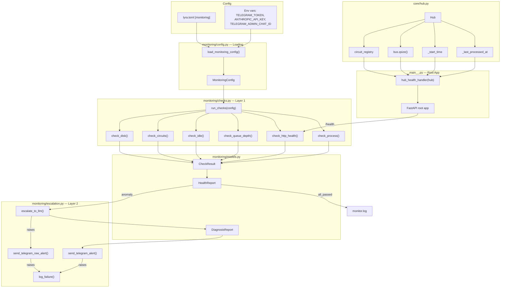
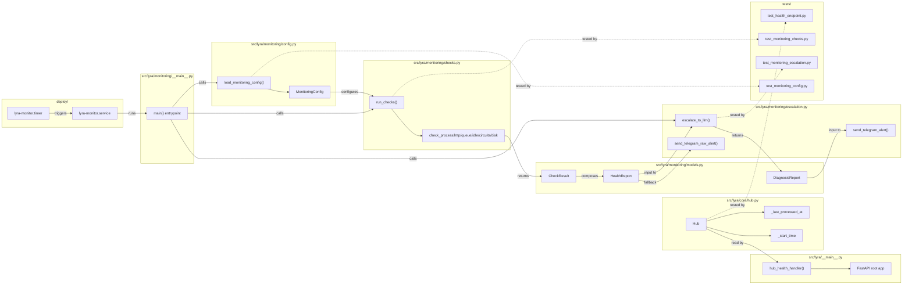

## Summary

Two-layer monitoring system: a standalone Python script runs 6 deterministic health checks (Layer 1) via systemd timer, escalating to an LLM diagnosis + Telegram alert (Layer 2) only on anomaly. Requires a new root FastAPI app with `/health` endpoint, a `lyra.monitoring` module, and systemd units.

## Architecture

### Data Flow

### File x Function Map

## Agents

| Agent | Task count | Files |
|-------|-----------|-------|
| backend-dev | 6 | `core/hub.py`, `__main__.py`, `monitoring/models.py`, `monitoring/config.py`, `monitoring/checks.py`, `monitoring/escalation.py`, `monitoring/__main__.py` |
| tester | 4 | `tests/test_health_endpoint.py`, `tests/test_monitoring_checks.py`, `tests/test_monitoring_escalation.py`, `tests/test_monitoring_config.py` |
| devops | 1 | `deploy/lyra-monitor.timer`, `deploy/lyra-monitor.service` |

## Consistency Report

- Criteria covered: 12/12
- Uncovered criteria: none
- Tasks without spec backing: none
- Gold plating exemptions applied: 0

## Reference Patterns

- **Config loading:** `_load_circuit_config()` in `__main__.py` (lines 35–68) — TOML + env pattern
- **Dataclasses:** `CircuitStatus` in `circuit_breaker.py` (line 40) — frozen dataclass pattern
- **Test style:** `test_circuit_config.py` — class-grouped, monkeypatch, tmp_path fixtures

## Micro-Tasks

### Slice V1: Root FastAPI app + /health

#### Task 1: Write /health endpoint tests → tester
- **File:** `tests/test_health_endpoint.py`
- **Snippet:** `class TestHealthEndpoint: async def test_health_returns_json(...)`
- **Verify:** `grep -q 'test_health_returns_json' tests/test_health_endpoint.py` (ready)
- **Expected:** Test file contains tests for /health response shape, queue_size, uptime_s, circuits
- **Time:** 5 min
- **Difficulty:** 2
- **Traces:** SC-1, SC-2, U1
- **Phase:** RED

#### RED-GATE: RED complete V1 → tester
- **Verify:** All test tasks for V1 marked complete
- **Phase:** RED-GATE

#### Task 2: Add _last_processed_at and _start_time to Hub → backend-dev
- **File:** `src/lyra/core/hub.py`
- **Snippet:** `self._start_time = time.monotonic()` in `__init__`, `self._last_processed_at: float | None = None` updated after `self.bus.task_done()`
- **Verify:** `grep -q '_last_processed_at' src/lyra/core/hub.py && grep -q '_start_time' src/lyra/core/hub.py` (ready)
- **Expected:** Hub tracks both timestamps
- **Time:** 3 min
- **Difficulty:** 1
- **Traces:** SC-3
- **Phase:** GREEN

#### Task 3: Create root FastAPI app with /health endpoint → backend-dev
- **File:** `src/lyra/__main__.py`
- **Snippet:** `app = FastAPI()` root app, `@app.get("/health") async def health()` returning `{queue_size, last_message_age_s, uptime_s, circuits}`
- **Verify:** `uv run pytest tests/test_health_endpoint.py -v` (deferred)
- **Expected:** All /health tests pass
- **Time:** 8 min
- **Difficulty:** 3
- **Traces:** SC-1, SC-2, U1
- **Phase:** GREEN

### Slice V2: Layer 1 checks + config

#### Task 4: Write monitoring config + checks tests [P] → tester
- **File:** `tests/test_monitoring_config.py`
- **Snippet:** `class TestMonitoringConfig: def test_load_defaults(...)`, `def test_load_from_toml(...)`
- **Verify:** `grep -q 'test_load_defaults' tests/test_monitoring_config.py` (ready)
- **Expected:** Tests for default config, TOML overrides, env var secrets
- **Time:** 4 min
- **Difficulty:** 2
- **Traces:** SC-5, SC-6
- **Phase:** RED

#### Task 5: Write Layer 1 check unit tests [P] → tester
- **File:** `tests/test_monitoring_checks.py`
- **Snippet:** `class TestCheckProcess: def test_active_service(...)`, `class TestRunChecks: def test_all_pass(...)`
- **Verify:** `grep -q 'test_all_pass' tests/test_monitoring_checks.py` (ready)
- **Expected:** Tests for each of 6 checks + run_checks orchestrator + exit codes
- **Time:** 5 min
- **Difficulty:** 3
- **Traces:** SC-4, SC-6, SC-11
- **Phase:** RED

#### RED-GATE: RED complete V2 → tester
- **Verify:** All test tasks for V2 marked complete
- **Phase:** RED-GATE

#### Task 6: Create monitoring models [P] → backend-dev
- **File:** `src/lyra/monitoring/models.py`
- **Snippet:** `@dataclass(frozen=True) class CheckResult: name: str; passed: bool; detail: str; timestamp: datetime` + `HealthReport` + `DiagnosisReport`
- **Verify:** `uv run python -c 'from lyra.monitoring.models import CheckResult, HealthReport, DiagnosisReport'` (ready)
- **Expected:** All 3 dataclasses importable
- **Time:** 3 min
- **Difficulty:** 1
- **Traces:** SC-4
- **Phase:** GREEN

#### Task 7: Create monitoring config loader [P] → backend-dev
- **File:** `src/lyra/monitoring/config.py`
- **Snippet:** `@dataclass class MonitoringConfig: ...` + `def load_monitoring_config(config_path: str | None = None) -> MonitoringConfig`
- **Verify:** `uv run pytest tests/test_monitoring_config.py -v` (deferred)
- **Expected:** Config loads from TOML + env vars
- **Time:** 5 min
- **Difficulty:** 2
- **Traces:** SC-5, SC-6
- **Phase:** GREEN

#### Task 8: Implement 6 Layer 1 check functions → backend-dev
- **File:** `src/lyra/monitoring/checks.py`
- **Snippet:** `def check_process(service: str) -> CheckResult`, `async def check_http_health(url: str, timeout: int) -> tuple[CheckResult, dict | None]`, `def run_checks(config: MonitoringConfig) -> HealthReport`
- **Verify:** `uv run pytest tests/test_monitoring_checks.py -v` (deferred)
- **Expected:** All 6 checks + orchestrator tests pass
- **Time:** 8 min
- **Difficulty:** 3
- **Traces:** SC-4, SC-6, SC-11
- **Phase:** GREEN

#### Task 9: Create monitoring CLI entrypoint → backend-dev
- **File:** `src/lyra/monitoring/__main__.py`
- **Snippet:** `def main() -> int:` loads config, runs checks, returns exit code. `python -m lyra.monitoring`
- **Verify:** `uv run python -c 'from lyra.monitoring.__main__ import main'` (ready)
- **Expected:** Entrypoint importable, wires config → checks → exit code
- **Time:** 4 min
- **Difficulty:** 2
- **Traces:** SC-4, SC-11, S2
- **Phase:** GREEN

### Slice V3: Layer 2 LLM + Telegram alert

#### Task 10: Write escalation + notification tests → tester
- **File:** `tests/test_monitoring_escalation.py`
- **Snippet:** `class TestEscalateToLLM: async def test_calls_anthropic(...)`, `class TestSendTelegramAlert: async def test_sends_message(...)`
- **Verify:** `grep -q 'test_calls_anthropic' tests/test_monitoring_escalation.py` (ready)
- **Expected:** Tests for LLM call, Telegram alert, raw alert fallback, log-only fallback
- **Time:** 5 min
- **Difficulty:** 3
- **Traces:** SC-7, SC-8, SC-9, SC-10
- **Phase:** RED

#### RED-GATE: RED complete V3 → tester
- **Verify:** All test tasks for V3 marked complete
- **Phase:** RED-GATE

#### Task 11: Implement LLM escalation + Telegram notification → backend-dev
- **File:** `src/lyra/monitoring/escalation.py`
- **Snippet:** `async def escalate_to_llm(report: HealthReport, config: MonitoringConfig) -> DiagnosisReport`, `async def send_telegram_alert(diagnosis: DiagnosisReport, config: MonitoringConfig) -> None`, `async def send_telegram_raw_alert(report: HealthReport, config: MonitoringConfig) -> None`
- **Verify:** `uv run pytest tests/test_monitoring_escalation.py -v` (deferred)
- **Expected:** All escalation + notification tests pass
- **Time:** 8 min
- **Difficulty:** 3
- **Traces:** SC-7, SC-8, SC-9, SC-10, N1, N2
- **Phase:** GREEN

#### Task 12: Wire Layer 2 into monitoring entrypoint → backend-dev
- **File:** `src/lyra/monitoring/__main__.py`
- **Snippet:** Update `main()` to call `escalate_to_llm()` on anomaly, `send_telegram_alert()` / `send_telegram_raw_alert()` with try/except fallback chain, `log_failure()` as last resort
- **Verify:** `uv run pytest tests/test_monitoring_checks.py tests/test_monitoring_escalation.py -v` (deferred)
- **Expected:** Full pipeline: checks → escalation → notification → logging
- **Time:** 5 min
- **Difficulty:** 2
- **Traces:** SC-7, SC-8, SC-9, SC-10, SC-11
- **Phase:** GREEN

### Slice V4: systemd timer integration

#### Task 13: Create systemd timer + service units → devops
- **File:** `deploy/lyra-monitor.timer`, `deploy/lyra-monitor.service`
- **Snippet:** `[Timer] OnBootSec=1min OnUnitActiveSec=5min` + `[Service] ExecStart=/usr/bin/python -m lyra.monitoring`
- **Verify:** `test -f deploy/lyra-monitor.timer && test -f deploy/lyra-monitor.service` (ready)
- **Expected:** Both unit files exist with correct directives
- **Time:** 4 min
- **Difficulty:** 2
- **Traces:** SC-12, S1
- **Phase:** GREEN
