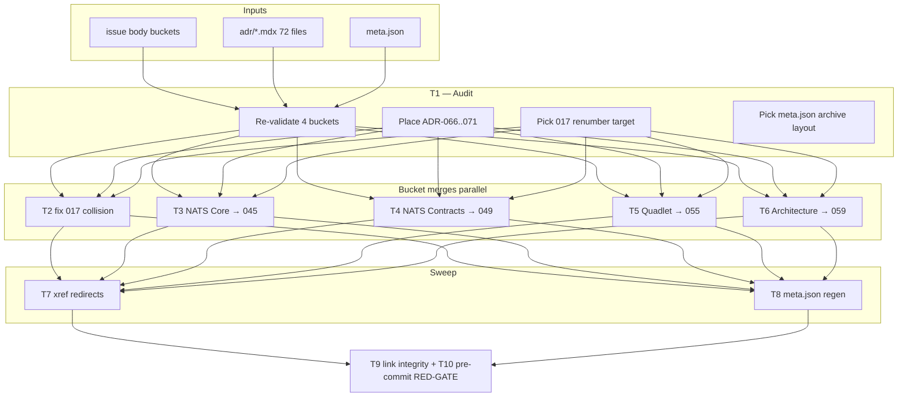
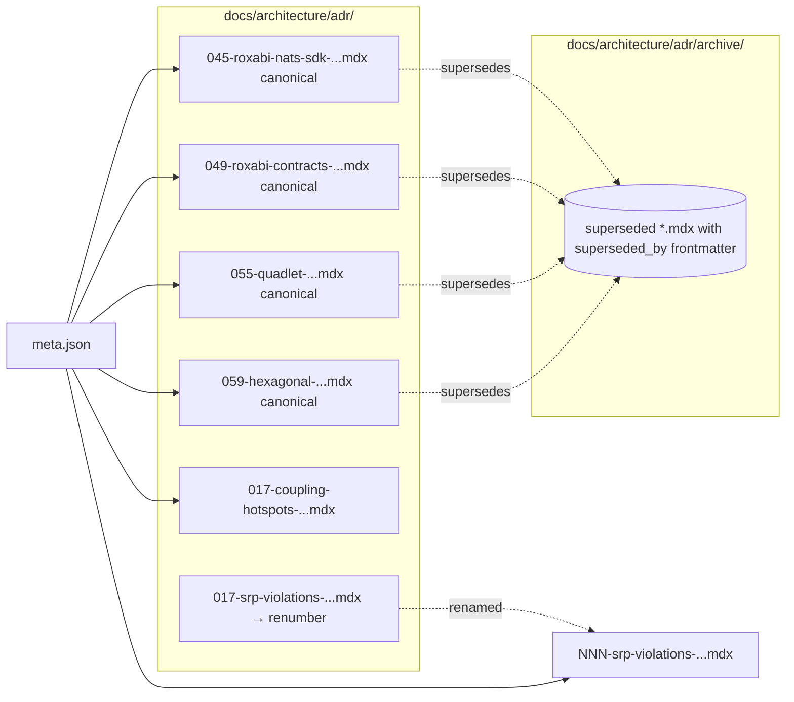

## Summary

Audit-first consolidation of `docs/architecture/adr/` from 72 live + 0 archived to ~30 live + the rest archived. One audit task gates four parallel bucket-merge tasks (NATS Core, NATS Contracts, Quadlet, Architecture) plus the ADR-017 collision fix; xref sweep, `meta.json` regen, link integrity, and pre-commit gate close out the work.

## Architecture





## Bootstrap Context

- `docs/architecture/adr/` — 72 live `.mdx` + `meta.json` + `051-rollout-evidence.md` (companion, leave in place)
- ADR body status convention: `## Status\nAccepted`. The `superseded_by:` and `supersedes:` frontmatter fields are **new** to this work.
- Reference for similar bulk-move work: PR #1004 (closed, 72 commits stale) — re-use raw move list, do not blindly replay.
- `meta.json` is consumed by Fumadocs sidebar — the `pages` array must list every live ADR slug.
- Pre-commit hooks: lint, typecheck, file-length, folder-size, import-layers (per `.claude/stack.yml`).

## Agents

| Agent | Tasks | Files |
|---|---|---|
| doc-writer-A | T1 (audit), T7 (xref sweep) | `artifacts/`, `docs/architecture/adr/**`, `src/**`, `packages/**` |
| doc-writer-B | T2 (017 collision) | one ADR-017 file + meta.json + xrefs |
| doc-writer-C | T3 (NATS Core → 045) | adr/{037,040,047,062,045}.mdx + archive |
| doc-writer-D | T4 (NATS Contracts → 049) | adr/{044,050,049,066?}.mdx + archive |
| doc-writer-E | T5 (Quadlet → 055) | adr/{053,054,056,055,068?}.mdx + archive |
| doc-writer-F | T6 (Architecture → 059) | adr/{048,060,061,059}.mdx + archive |
| devops-A | T8 (meta.json), T9 (link integrity), T10 (pre-commit gate) | `meta.json`, repo-wide grep, hook run |

`tester` not assigned — pure docs reorg, no code paths.

## Wave Structure

4 waves, max 5 parallel agents. Elapsed ~1 working session vs ~3 sequential.

| Wave | Trigger | Agents | Tasks |
|------|---------|--------|-------|
| 1 | start | 1 | doc-writer-A: T1 |
| 2 | T1 done | 5 ∥ | doc-writer-B: T2 · doc-writer-C: T3 · doc-writer-D: T4 · doc-writer-E: T5 · doc-writer-F: T6 |
| 3 | Wave 2 done | 2 ∥ | doc-writer-A: T7 · devops-A: T8 |
| 4 | Wave 3 done | 1 | devops-A: T9 → T10 (RED-GATE) |

## Consistency Report

- Acceptance criteria covered: 10/10
  - SC-1 archive dir exists → T2..T6 (each creates/uses), final state verified by T9
  - SC-2 no two live ADRs share prefix → T2
  - SC-3 every archive has `superseded_by` → T3..T6 + T9 grep
  - SC-4 archived `## Status` reads "Superseded by …" + canonical lists `supersedes:` → T3..T6 + T9 grep
  - SC-5 live ADR count 25–35 → emerges from T2..T7; T9 verifies
  - SC-6 four canonical buckets land → T3..T6
  - SC-7 ADR-066–071 placements documented → T1 audit doc
  - SC-8 meta.json contains only live slugs (or live + archive sub-page) → T8
  - SC-9 grep no archived-id refs in live bodies → T7 + T9
  - SC-10 pre-commit passes → T10
- Slice coverage: S1↔T1 · S2↔T2 · S3↔T3 · S4↔T4 · S5↔T5 · S6↔T6 · S7↔(dynamic, T1 may add T6.5) · S8↔T9+T10. T7 + T8 are connective tasks not enumerated in spec slices but required by SC-8/SC-9.
- Untraced tasks: none. T7 + T8 are sub-affordances F5/F6 from the breadboard.
- Exemptions: none.

## Micro-Tasks

### Wave 1 — Audit (gates everything)

#### T1 [doc-writer-A] — Re-audit buckets and produce decisions document

- **Files:** `artifacts/1145-adr-audit.md` (write), `docs/architecture/adr/*.mdx` (read all 72)
- **Snippet shape:**
  ```md
  # ADR consolidation audit (2026-05-08)
  ## Bucket: NATS Core (target ADR-045)
  - 037: KEEP MERGE (content X, Y) | DROP (already covered) | RECLASSIFY (→ bucket Z)
  - 040: ...
  ## ADR-066–071 placement
  - 066 WorkerError envelope: → NATS Contracts bucket / standalone live / archive (rationale)
  - ...
  ## ADR-017 collision
  - Renumber: 017-srp-violations-... → 072-srp-violations-... (rationale)
  ## meta.json archive layout
  - Decision: omit archive entirely / add archive sub-page (rationale)
  ## Final live ADR count estimate
  - 30 ± 2 after this PR
  ```
- **Verify:** `test -f artifacts/1145-adr-audit.md && grep -c "^## Bucket:" artifacts/1145-adr-audit.md`
- **Expected:** file exists; ≥4 buckets sectioned; explicit decisions for ADR-066..071 and 017 collision and meta.json layout
- **Time:** 30–45 min
- **Spec trace:** S1, SC-7
- **Phase:** RED (research)
- **Difficulty:** 3
- **Parallel-safe:** N/A (Wave 1 only)

### Wave 2 — Parallel bucket processing (after T1)

For each merge task below, the recipe is the same:

```text
1. Read canonical target + each source.
2. Edit canonical body to fold in unique decisions/rationale from sources (preserve evidence).
3. Add `## Supersedes` body section in canonical OR `supersedes:` frontmatter list.
4. For each source: git mv to archive/, add `superseded_by: <canonical-id>` frontmatter,
   change body `## Status` to "Superseded by ADR-NNN — see <canonical-slug>".
5. Defer meta.json edits to T8.
6. Defer xref redirects to T7.
```

#### T2 [P] [doc-writer-B] — Fix ADR-017 collision

- **Files:** `docs/architecture/adr/017-srp-violations-and-remediation-strategy.mdx` (rename), `docs/architecture/adr/017-coupling-hotspots-and-decoupling-strategy.mdx` (untouched), meta.json edits deferred to T8
- **Snippet shape:** `git mv 017-srp-violations-and-remediation-strategy.mdx <NNN>-srp-violations-and-remediation-strategy.mdx` where NNN comes from T1 audit
- **Verify:** `ls docs/architecture/adr/017*.mdx | wc -l`
- **Expected:** `1`
- **Time:** 5 min
- **Spec trace:** S2, SC-2
- **Phase:** GREEN
- **Difficulty:** 1
- **Parallel-safe:** Y

#### T3 [P] [doc-writer-C] — Merge NATS Core bucket → ADR-045

- **Files:** `docs/architecture/adr/{037,040,047,062}.mdx` (archive), `docs/architecture/adr/045-*.mdx` (enrich)
- **Verify:** `ls docs/architecture/adr/archive/0{37,40,47,62}*.mdx 2>/dev/null | wc -l && grep -l "superseded_by: ADR-045\|superseded_by: 045" docs/architecture/adr/archive/0{37,40,47,62}*.mdx | wc -l`
- **Expected:** `4` and `4`
- **Time:** 25 min
- **Spec trace:** S3, SC-1, SC-3, SC-4, SC-6
- **Phase:** GREEN
- **Difficulty:** 3
- **Parallel-safe:** Y

#### T4 [P] [doc-writer-D] — Merge NATS Contracts bucket → ADR-049

- **Files:** `docs/architecture/adr/{044,050}.mdx` (archive), `docs/architecture/adr/049-*.mdx` (enrich), `docs/architecture/adr/066-*.mdx` (per T1 placement decision: archive into 049, keep live, or move to other bucket)
- **Verify:** `ls docs/architecture/adr/archive/0{44,50}*.mdx 2>/dev/null | wc -l` (+ 066 if T1 said archive)
- **Expected:** `≥2`, ADR-049 enriched, 066 placement honored
- **Time:** 20 min
- **Spec trace:** S4, SC-1, SC-3, SC-4, SC-6, SC-7
- **Phase:** GREEN
- **Difficulty:** 3
- **Parallel-safe:** Y

#### T5 [P] [doc-writer-E] — Merge Quadlet bucket → ADR-055

- **Files:** `docs/architecture/adr/{053,054,056}.mdx` (archive), `docs/architecture/adr/055-*.mdx` (enrich), `docs/architecture/adr/068-*.mdx` (per T1 placement decision)
- **Verify:** `ls docs/architecture/adr/archive/0{53,54,56}*.mdx 2>/dev/null | wc -l` (+ 068 if applicable)
- **Expected:** `≥3`, ADR-055 enriched, 068 placement honored
- **Time:** 20 min
- **Spec trace:** S5, SC-1, SC-3, SC-4, SC-6, SC-7
- **Phase:** GREEN
- **Difficulty:** 3
- **Parallel-safe:** Y

#### T6 [P] [doc-writer-F] — Merge Architecture bucket → ADR-059

- **Files:** `docs/architecture/adr/{048,060,061}.mdx` (archive), `docs/architecture/adr/059-*.mdx` (enrich)
- **Verify:** `ls docs/architecture/adr/archive/0{48,60,61}*.mdx 2>/dev/null | wc -l`
- **Expected:** `3`
- **Time:** 20 min
- **Spec trace:** S6, SC-1, SC-3, SC-4, SC-6
- **Phase:** GREEN
- **Difficulty:** 3
- **Parallel-safe:** Y

> **T6.5 (conditional):** if T1 audit identifies new buckets (S7), insert one merge task per bucket here on the same wave. Pattern identical to T3–T6.

### Wave 3 — Sweep (after Wave 2)

#### T7 [P] [doc-writer-A] — Update inbound cross-references

- **Files:** any file under `docs/`, `src/`, `packages/`, `artifacts/` that references an archived ADR id by its old number where redirection to the canonical is correct. Skip the archive folder itself.
- **Snippet shape:**
  ```bash
  rg -l "\bADR-0(37|40|44|47|48|50|53|54|56|60|61|62)\b" -- docs/ src/ packages/ \
    | grep -v docs/architecture/adr/archive/ \
    | xargs -I{} sed -i 's/ADR-037/ADR-045/g; s/ADR-040/ADR-045/g; ...' {}
  ```
  (Per-id mapping derived from T1 audit + Wave 2 outputs. Apply by hand where context disambiguates.)
- **Verify:** `rg -c "\bADR-0(37|40|44|47|48|50|53|54|56|60|61|62)\b" docs/architecture/adr/*.mdx src/ packages/ 2>/dev/null | grep -v ':0' | wc -l`
- **Expected:** `0` (no live file references an archived id)
- **Time:** 25 min
- **Spec trace:** SC-9
- **Phase:** REFACTOR
- **Difficulty:** 3
- **Parallel-safe:** Y

#### T8 [P] [devops-A] — Regenerate meta.json from filesystem

- **Files:** `docs/architecture/adr/meta.json`
- **Snippet shape:**
  ```bash
  ls docs/architecture/adr/*.mdx | xargs -n1 basename -s .mdx | sort > /tmp/live_adrs
  # then write meta.json pages array from /tmp/live_adrs (+ archive sub-page if T1 chose that)
  ```
- **Verify:** `jq -r '.pages[]' docs/architecture/adr/meta.json | sort > /tmp/meta_pages && diff /tmp/live_adrs /tmp/meta_pages`
- **Expected:** empty diff (modulo any archive sub-page entry per T1 decision)
- **Time:** 10 min
- **Spec trace:** SC-8
- **Phase:** REFACTOR
- **Difficulty:** 2
- **Parallel-safe:** Y

### Wave 4 — RED-GATE (final verification)

#### T9 [devops-A] — Link integrity + count check

- **Files:** none modified; verification only
- **Snippet shape:**
  ```bash
  # Live count between 25 and 35
  count=$(ls docs/architecture/adr/*.mdx | wc -l)
  test "$count" -ge 25 && test "$count" -le 35

  # Every archive ADR has superseded_by frontmatter
  for f in docs/architecture/adr/archive/*.mdx; do
    head -10 "$f" | grep -q '^superseded_by:' || { echo "MISSING superseded_by: $f"; exit 1; }
  done

  # Every superseded_by target resolves to a live ADR
  # No two live ADRs share a numeric prefix
  ls docs/architecture/adr/*.mdx | sed 's|.*/\([0-9]\+\).*|\1|' | sort | uniq -d | grep -q . && exit 1

  # No live file references an archived id
  rg "\bADR-0(37|40|44|47|48|50|53|54|56|60|61|62)\b" docs/architecture/adr/*.mdx src/ packages/ 2>/dev/null | grep -v ':0' | grep -v archive/ && exit 1 || true
  ```
- **Verify:** all assertions above
- **Expected:** zero exit (all pass)
- **Time:** 10 min
- **Spec trace:** SC-1, SC-2, SC-3, SC-5, SC-9
- **Phase:** RED-GATE
- **Difficulty:** 2
- **Parallel-safe:** N (must run after T7+T8)

#### T10 [devops-A] — Pre-commit gate

- **Files:** none modified
- **Snippet shape:** `pre-commit run --all-files`
- **Verify:** `echo $?`
- **Expected:** `0`
- **Time:** 5 min
- **Spec trace:** SC-10
- **Phase:** RED-GATE
- **Difficulty:** 1
- **Parallel-safe:** N

## Wave Structure (compact)

4 waves · max 5 ∥ · ~1 session vs ~3 sequential.

| Wave | Trigger | ∥ | Tasks |
|------|---------|---|-------|
| 1 | start | 1 | doc-writer-A: T1 |
| 2 | T1 done | 5 | doc-writer-B: T2 · doc-writer-C: T3 · doc-writer-D: T4 · doc-writer-E: T5 · doc-writer-F: T6 (+ T6.5 conditional) |
| 3 | Wave 2 done | 2 | doc-writer-A: T7 · devops-A: T8 |
| 4 | Wave 3 done | 1 | devops-A: T9 → T10 |

## Task Seeding Blueprint

<!-- Used by /implement to seed TaskCreate calls on session start. -->

### Wave 1 — no deps, 1 agent

| Task | Agent instance | blockedBy | Subject |
|------|---------------|-----------|---------|
| T1 | doc-writer-A | — | Audit & decisions doc (`artifacts/1145-adr-audit.md`) |

### Wave 2 — after T1, 5 agents ∥

| Task | Agent instance | blockedBy | Subject |
|------|---------------|-----------|---------|
| T2 | doc-writer-B | T1 | Fix ADR-017 collision (rename one of the two) |
| T3 | doc-writer-C | T1 | Merge NATS Core bucket → ADR-045 + archive sources |
| T4 | doc-writer-D | T1 | Merge NATS Contracts bucket → ADR-049 + archive sources (honor 066 placement) |
| T5 | doc-writer-E | T1 | Merge Quadlet bucket → ADR-055 + archive sources (honor 068 placement) |
| T6 | doc-writer-F | T1 | Merge Architecture bucket → ADR-059 + archive sources |

### Wave 3 — after Wave 2, 2 agents ∥

| Task | Agent instance | blockedBy | Subject |
|------|---------------|-----------|---------|
| T7 | doc-writer-A | T2,T3,T4,T5,T6 | Update inbound xrefs (archived ids → canonical) across docs/, src/, packages/ |
| T8 | devops-A | T2,T3,T4,T5,T6 | Regenerate meta.json from filesystem |

### Wave 4 — after Wave 3, sequential

| Task | Agent instance | blockedBy | Subject |
|------|---------------|-----------|---------|
| T9 | devops-A | T7,T8 | RED-GATE link integrity + count check |
| T10 | devops-A | T9 | RED-GATE pre-commit run --all-files |

## Task IDs

<!-- Generated by /plan. Used by /implement to resume tasks on session restart. Populated in Step 6a/6b. -->
