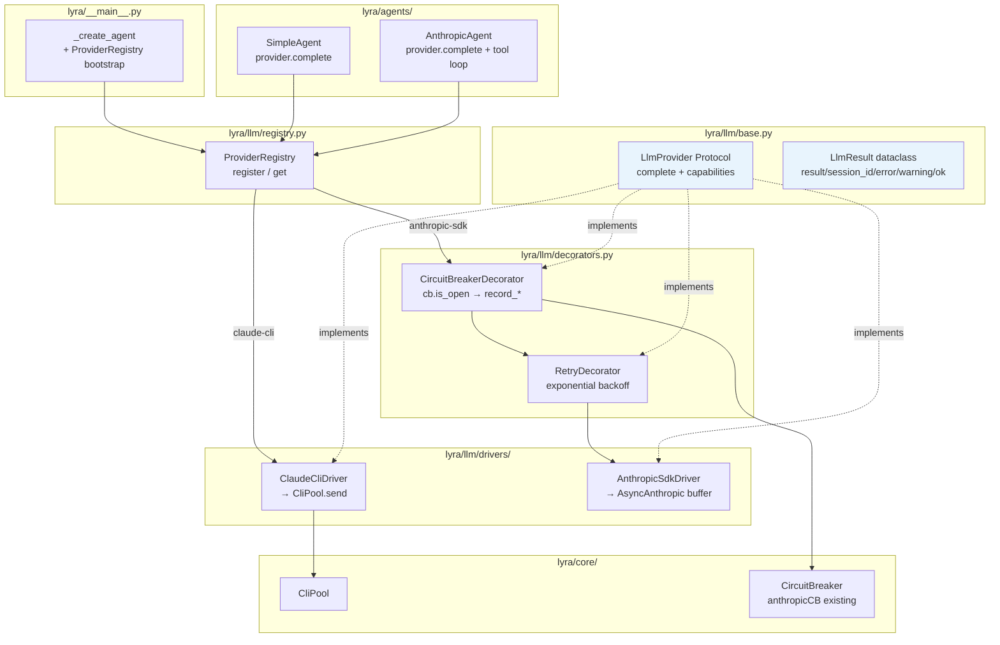
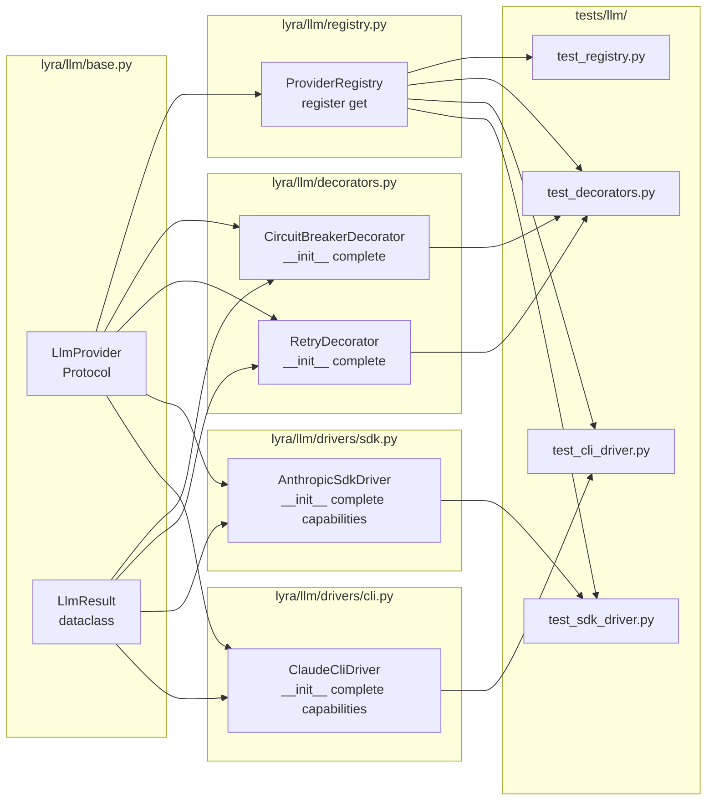

## Summary

Extract LLM dispatch into a new `lyra.llm` module by introducing `LlmProvider` Protocol, `LlmResult`, `ProviderRegistry`, two drivers (`ClaudeCliDriver`, `AnthropicSdkDriver`), and a `CircuitBreakerDecorator(RetryDecorator(driver))` chain. Migrate `SimpleAgent` and `AnthropicAgent` to call `provider.complete()` instead of `CliPool.send()` / embedded SDK client. No behavior change for callers; `AnthropicAgent.process()` changes from `AsyncIterator[str]` to `Response` (streaming intentionally removed, see spec).

## Architecture





## Design Note: `complete()` Signature Extension

The spec defines `complete(pool_id, text, model_cfg, system_prompt)`. `AnthropicSdkDriver` also needs the conversation history (currently in `pool.sdk_history`) to build the Anthropic messages array. Resolution: `complete()` gets a keyword-only `messages` parameter:

```python
async def complete(
    self,
    pool_id: str,
    text: str,
    model_cfg: ModelConfig,
    system_prompt: str,
    *,
    messages: list[dict] | None = None,  # SDK history; ignored by ClaudeCliDriver
) -> LlmResult: ...
```

`AnthropicAgent.process()` builds `messages = list(pool.sdk_history) + [{"role": "user", "content": text}]` and passes it. `ClaudeCliDriver` ignores the `messages` parameter. History persistence (`pool.extend_sdk_history`) stays in `AnthropicAgent.process()`.

## CB Wiring Note

`CircuitBreakerDecorator` for `AnthropicSdkDriver` uses `circuit_registry.get("anthropic")` — the **same** `CircuitBreaker` instance the hub pre-flight check already uses (hub.py:420). They share one instance; no double-registration needed.

## Agents

| Agent | Slices | Files |
|-------|--------|-------|
| backend-dev | S1–S4 | `lyra/llm/*`, `agents/anthropic_agent.py`, `agents/simple_agent.py`, `__main__.py` |
| tester | S2–S5 | `tests/llm/*` |

## Consistency Report

| Metric | Count |
|--------|-------|
| Success criteria covered | 17/17 |
| Breadboard affordances traced | 15/15 |
| Slices covered | 5/5 |
| Uncovered items | 0 |
| Exemptions | 0 |

## Micro-Tasks

---

### S1 — lyra.llm skeleton

**RED-GATE S1:** All S1 tasks must be GREEN before S2 begins.

---

#### T1 — Create `lyra/llm/base.py` — LlmResult + LlmProvider Protocol

- **File:** `src/lyra/llm/base.py`
- **Agent:** backend-dev
- **Slice:** S1 / Phase: GREEN
- **Difficulty:** 2
- **Time:** 5 min
- **Parallel-safe:** N (defines types used by T2–T9)
- **Spec trace:** SC-1, SC-2

```python
from __future__ import annotations
from dataclasses import dataclass, field
from typing import Protocol, runtime_checkable
from lyra.core.agent import ModelConfig

@dataclass
class LlmResult:
    result: str = ""
    session_id: str = ""
    error: str = ""
    warning: str = ""

    @property
    def ok(self) -> bool:
        return not self.error

@runtime_checkable
class LlmProvider(Protocol):
    capabilities: dict

    async def complete(
        self,
        pool_id: str,
        text: str,
        model_cfg: ModelConfig,
        system_prompt: str,
        *,
        messages: list[dict] | None = None,
    ) -> LlmResult: ...
```

- **Verify:** `uv run pyright src/lyra/llm/base.py`
- **Expected:** no errors

---

#### T2 — Create `lyra/llm/registry.py` — ProviderRegistry

- **File:** `src/lyra/llm/registry.py`
- **Agent:** backend-dev
- **Slice:** S1 / Phase: GREEN
- **Difficulty:** 2
- **Time:** 3 min
- **Parallel-safe:** N (after T1)
- **Spec trace:** SC-3

```python
from .base import LlmProvider

class ProviderRegistry:
    def __init__(self) -> None:
        self._drivers: dict[str, LlmProvider] = {}

    def register(self, backend: str, driver: LlmProvider) -> None:
        self._drivers[backend] = driver

    def get(self, backend: str) -> LlmProvider:
        try:
            return self._drivers[backend]
        except KeyError:
            registered = sorted(self._drivers)
            raise KeyError(
                f"No provider for {backend!r}. Registered: {registered}"
            ) from None
```

- **Verify:** `python -c "from lyra.llm.registry import ProviderRegistry; print('ok')"`
- **Expected:** `ok`

---

#### T3 — Create `lyra/llm/__init__.py` and `lyra/llm/drivers/__init__.py`

- **File:** `src/lyra/llm/__init__.py`, `src/lyra/llm/drivers/__init__.py`
- **Agent:** backend-dev
- **Slice:** S1 / Phase: GREEN
- **Difficulty:** 1
- **Time:** 2 min
- **Parallel-safe:** Y
- **Spec trace:** SC-1, SC-4

```python
# lyra/llm/__init__.py
from .base import LlmProvider, LlmResult
from .registry import ProviderRegistry

__all__ = ["LlmProvider", "LlmResult", "ProviderRegistry"]

# lyra/llm/drivers/__init__.py
# (empty)
```

- **Verify:** `uv run pyright src/lyra/llm/` then `uv run pytest --co -q 2>&1 | head -5`
- **Expected:** pyright clean; no import errors

---

**RED-GATE S1 PASSED** → proceed to S2.

---

### S2 — AnthropicSdkDriver + AnthropicAgent migration

**RED-GATE S2:** S2 tasks must be GREEN (pyright + tests) before S3.

---

#### T4 — Create `lyra/llm/drivers/sdk.py` — AnthropicSdkDriver

- **File:** `src/lyra/llm/drivers/sdk.py`
- **Agent:** backend-dev
- **Slice:** S2 / Phase: GREEN
- **Difficulty:** 3
- **Time:** 8 min
- **Parallel-safe:** N (after T1)
- **Spec trace:** SC-5, SC-6, SC-7

```python
from __future__ import annotations
import logging
from typing import Any
import anthropic
from lyra.core.agent import ModelConfig
from lyra.llm.base import LlmProvider, LlmResult

log = logging.getLogger(__name__)

TOOLS: list[dict[str, Any]] = [...]  # copy from anthropic_agent.py

class AnthropicSdkDriver:
    capabilities = {"streaming": False, "auth": "api_key"}

    def __init__(self, api_key: str) -> None:
        self._client = anthropic.AsyncAnthropic(api_key=api_key)

    async def complete(
        self,
        pool_id: str,
        text: str,
        model_cfg: ModelConfig,
        system_prompt: str,
        *,
        messages: list[dict] | None = None,
    ) -> LlmResult:
        # Buffer full stream; return LlmResult
        # Tool use loop stays in agent — driver calls one SDK turn
        ...
```

- **Verify:** `uv run pyright src/lyra/llm/drivers/sdk.py`
- **Expected:** no errors; `isinstance(AnthropicSdkDriver(), LlmProvider)` is True

---

#### T5 — Migrate `anthropic_agent.py` — inject provider, remove SDK client, change return type [P]

- **File:** `src/lyra/agents/anthropic_agent.py`
- **Agent:** backend-dev
- **Slice:** S2 / Phase: REFACTOR
- **Difficulty:** 4
- **Time:** 10 min
- **Parallel-safe:** N (after T4)
- **Spec trace:** SC-8, SC-9, SC-10

Key changes:
- Constructor: replace `AsyncAnthropic(api_key=...)` construction with `provider: LlmProvider` injection
- Remove `# type: ignore[override]` comment — `process()` now returns `Response` matching `AgentBase`
- `process()`: builds `messages` from `pool.sdk_history`, calls `await self._provider.complete(pool.pool_id, llm_text, effective, effective.system_prompt, messages=messages)`, handles tool-use loop externally using SDK (tool loop calls SDK directly via `self._client` — keep `_client` as fallback for tool continuation turns, or move tool loop into driver separately)

> **Note on tool use:** `AnthropicSdkDriver.complete()` handles ONE non-tool turn. Tool-use continuation turns are still handled by `AnthropicAgent` directly via the SDK. The `AnthropicAgent` keeps a reference to `self._sdk_client` (or exposes via driver) for tool continuation. This is acceptable for F-lite — tool-use SDK dispatch stays in the agent for this issue.

- **Verify:** `uv run pyright src/lyra/agents/anthropic_agent.py` + `uv run pytest tests/ -x -q`
- **Expected:** pyright clean; existing tests pass

---

#### T6 — Update `__main__.py` — construct AnthropicSdkDriver, pass to AnthropicAgent [P]

- **File:** `src/lyra/__main__.py`
- **Agent:** backend-dev
- **Slice:** S2 / Phase: REFACTOR
- **Difficulty:** 3
- **Time:** 5 min
- **Parallel-safe:** N (after T4, T5)
- **Spec trace:** SC-9 (SystemExit without API key), U1 wiring

In `_create_agent()`:
```python
if backend == "anthropic-sdk":
    from lyra.agents.anthropic_agent import AnthropicAgent
    from lyra.llm.drivers.sdk import AnthropicSdkDriver
    api_key = os.environ.get("ANTHROPIC_API_KEY")
    if not api_key:
        raise SystemExit("Missing required env var: ANTHROPIC_API_KEY")
    provider = AnthropicSdkDriver(api_key)
    return AnthropicAgent(config, provider, ...)
```

- **Verify:** `uv run pyright src/lyra/__main__.py` + `ANTHROPIC_API_KEY="" python -m lyra 2>&1 | grep SystemExit || echo "expected"`
- **Expected:** pyright clean

---

#### T7 — Unit tests: `tests/llm/test_sdk_driver.py` [P]

- **File:** `tests/llm/__init__.py`, `tests/llm/test_sdk_driver.py`
- **Agent:** tester
- **Slice:** S2 / Phase: RED (write alongside T4-T5)
- **Difficulty:** 3
- **Time:** 10 min
- **Parallel-safe:** Y (after T4)
- **Spec trace:** SC-11

Tests:
- `test_complete_buffers_stream`: mock `AsyncAnthropic.messages.stream()` yielding deltas → verify `LlmResult.result == accumulated`
- `test_complete_error_propagates`: mock raises `anthropic.APIError` → verify `LlmResult.ok == False`, `LlmResult.error` set
- `test_capabilities_streaming_false`: `driver.capabilities["streaming"] == False`
- `test_complete_ok_property`: `LlmResult(result="hello").ok == True`, `LlmResult(error="x").ok == False`

- **Verify:** `uv run pytest tests/llm/test_sdk_driver.py -v`
- **Expected:** all pass

---

**RED-GATE S2 PASSED** → proceed to S3.

---

### S3 — ClaudeCliDriver + SimpleAgent migration

**RED-GATE S3:** S3 tasks GREEN before S4.

---

#### T8 — Create `lyra/llm/drivers/cli.py` — ClaudeCliDriver

- **File:** `src/lyra/llm/drivers/cli.py`
- **Agent:** backend-dev
- **Slice:** S3 / Phase: GREEN
- **Difficulty:** 2
- **Time:** 5 min
- **Parallel-safe:** N (after T1)
- **Spec trace:** SC-12, SC-13

```python
from lyra.core.agent import ModelConfig
from lyra.core.cli_pool import CliPool
from lyra.llm.base import LlmProvider, LlmResult

class ClaudeCliDriver:
    capabilities = {"streaming": False, "auth": "oauth_only"}

    def __init__(self, pool: CliPool) -> None:
        self._pool = pool

    async def complete(
        self,
        pool_id: str,
        text: str,
        model_cfg: ModelConfig,
        system_prompt: str,
        *,
        messages: list[dict] | None = None,  # ignored
    ) -> LlmResult:
        cli_result = await self._pool.send(pool_id, text, model_cfg, system_prompt)
        return LlmResult(
            result=cli_result.result,
            session_id=cli_result.session_id,
            error=cli_result.error,
            warning=cli_result.warning,
        )
```

- **Verify:** `uv run pyright src/lyra/llm/drivers/cli.py`
- **Expected:** clean

---

#### T9 — Migrate `simple_agent.py` — inject provider, replace CliPool.send [P]

- **File:** `src/lyra/agents/simple_agent.py`
- **Agent:** backend-dev
- **Slice:** S3 / Phase: REFACTOR
- **Difficulty:** 2
- **Time:** 5 min
- **Parallel-safe:** N (after T8)
- **Spec trace:** SC-14, SC-15

- Replace `cli_pool: CliPool` parameter with `provider: LlmProvider`
- Replace `await self._pool.send(pool.pool_id, text, model_cfg, ...)` with `await self._provider.complete(pool.pool_id, text, model_cfg, system_prompt)`
- `LlmResult.ok`, `LlmResult.error`, `LlmResult.session_id`, `LlmResult.warning` map 1:1 to existing `CliResult` fields

- **Verify:** `uv run pytest tests/ -x -q`
- **Expected:** all pass

---

#### T10 — Update `__main__.py` — construct ClaudeCliDriver, pass to SimpleAgent [P]

- **File:** `src/lyra/__main__.py`
- **Agent:** backend-dev
- **Slice:** S3 / Phase: REFACTOR
- **Difficulty:** 2
- **Time:** 3 min
- **Parallel-safe:** N (after T8, T9)
- **Spec trace:** SC-16, U1 wiring

In `_create_agent()`:
```python
if backend in ("claude-cli", "ollama"):
    if cli_pool is None:
        raise RuntimeError(f"CliPool required for {backend} backend")
    from lyra.llm.drivers.cli import ClaudeCliDriver
    provider = ClaudeCliDriver(cli_pool)
    return SimpleAgent(config, provider, ...)
```

- **Verify:** `uv run pyright src/lyra/__main__.py`
- **Expected:** clean

---

#### T11 — Unit tests: `tests/llm/test_cli_driver.py` [P]

- **File:** `tests/llm/test_cli_driver.py`
- **Agent:** tester
- **Slice:** S3 / Phase: RED
- **Difficulty:** 2
- **Time:** 8 min
- **Parallel-safe:** Y (after T8)
- **Spec trace:** SC-17

Tests:
- `test_complete_delegates_to_pool`: mock `CliPool.send()` → verify `ClaudeCliDriver.complete()` calls it with correct args
- `test_complete_translates_cli_result`: `CliResult(result="hi", session_id="s1")` → `LlmResult(result="hi", session_id="s1", ok=True)`
- `test_complete_error_propagates`: `CliResult(error="timeout")` → `LlmResult(ok=False, error="timeout")`
- `test_capabilities`: `capabilities == {"streaming": False, "auth": "oauth_only"}`

- **Verify:** `uv run pytest tests/llm/test_cli_driver.py -v`
- **Expected:** all pass

---

**RED-GATE S3 PASSED** → proceed to S4.

---

### S4 — RetryDecorator + CircuitBreakerDecorator + registry wiring

**RED-GATE S4:** S4 tasks GREEN before S5.

---

#### T12 — Create `lyra/llm/decorators.py` — RetryDecorator + CircuitBreakerDecorator

- **File:** `src/lyra/llm/decorators.py`
- **Agent:** backend-dev
- **Slice:** S4 / Phase: GREEN
- **Difficulty:** 3
- **Time:** 10 min
- **Parallel-safe:** N (after T1)
- **Spec trace:** SC-18, SC-19, SC-20, SC-21

```python
import asyncio
from lyra.core.circuit_breaker import CircuitBreaker
from lyra.core.agent import ModelConfig
from lyra.llm.base import LlmProvider, LlmResult

class RetryDecorator:
    capabilities: dict  # delegates to inner.capabilities

    def __init__(self, inner: LlmProvider, max_retries: int = 3, backoff_base: float = 1.0) -> None:
        self._inner = inner
        self._max_retries = max_retries
        self._backoff_base = backoff_base

    async def complete(self, pool_id, text, model_cfg, system_prompt, *, messages=None) -> LlmResult:
        # exponential backoff: delay = base * 2^k, k = attempt index
        ...

class CircuitBreakerDecorator:
    capabilities: dict  # delegates to inner.capabilities

    def __init__(self, inner: LlmProvider, cb: CircuitBreaker) -> None:
        self._inner = inner
        self._cb = cb

    async def complete(self, pool_id, text, model_cfg, system_prompt, *, messages=None) -> LlmResult:
        if self._cb.is_open():
            status = self._cb.get_status()
            retry_after = status.retry_after or 0.0
            return LlmResult(error=f"Circuit '{self._cb.name}' is open. Retry in {retry_after:.0f}s.")
        result = await self._inner.complete(pool_id, text, model_cfg, system_prompt, messages=messages)
        if result.ok:
            self._cb.record_success()  # no-op when CLOSED; intentional
        else:
            self._cb.record_failure()
        return result
```

- **Verify:** `uv run pyright src/lyra/llm/decorators.py`
- **Expected:** clean

---

#### T13 — Wire ProviderRegistry into `__main__.py` + use `"anthropic"` CB [P]

- **File:** `src/lyra/__main__.py`
- **Agent:** backend-dev
- **Slice:** S4 / Phase: REFACTOR
- **Difficulty:** 3
- **Time:** 5 min
- **Parallel-safe:** N (after T12, T6, T10)
- **Spec trace:** SC-22, U1 wiring, CB wiring note

```python
from lyra.llm import ProviderRegistry
from lyra.llm.decorators import CircuitBreakerDecorator, RetryDecorator

def _build_registry(circuit_registry: CircuitRegistry, cli_pool: CliPool | None, ...) -> ProviderRegistry:
    registry = ProviderRegistry()
    if cli_pool:
        from lyra.llm.drivers.cli import ClaudeCliDriver
        registry.register("claude-cli", ClaudeCliDriver(cli_pool))

    api_key = os.environ.get("ANTHROPIC_API_KEY")
    if api_key:
        from lyra.llm.drivers.sdk import AnthropicSdkDriver
        sdk_driver = AnthropicSdkDriver(api_key)
        retry = RetryDecorator(sdk_driver, max_retries=3, backoff_base=1.0)
        anthropic_cb = circuit_registry.get("anthropic")
        if anthropic_cb:
            registry.register("anthropic-sdk", CircuitBreakerDecorator(retry, anthropic_cb))
        else:
            registry.register("anthropic-sdk", retry)
    return registry
```

Then update `_create_agent()` to use `registry.get(backend)` and pass `provider` to agent.
Also resolve `TODO(#123)` in `create_health_app()`.

- **Verify:** `uv run pyright src/lyra/__main__.py` + `uv run pytest tests/ -x -q`
- **Expected:** clean + tests pass

---

#### T14 — Unit tests: `tests/llm/test_decorators.py` [P]

- **File:** `tests/llm/test_decorators.py`
- **Agent:** tester
- **Slice:** S4 / Phase: RED
- **Difficulty:** 4
- **Time:** 12 min
- **Parallel-safe:** Y (after T12)
- **Spec trace:** SC-18–SC-22

Tests:
- `test_retry_retries_on_error`: mock inner returns error 3 times → `RetryDecorator` calls inner exactly 3+1=max_retries times (first attempt + retries)
- `test_retry_returns_on_success`: mock inner returns ok first try → inner called once
- `test_retry_backoff`: verify `asyncio.sleep` called with `base * 2^k` values
- `test_cb_open_circuit_returns_error`: `cb.is_open() == True` → `LlmResult(ok=False)` without calling inner
- `test_cb_records_success`: successful inner → `cb.record_success()` called
- `test_cb_records_failure`: failing inner → `cb.record_failure()` called
- `test_cb_record_success_closed_noop`: circuit CLOSED → `record_success()` is no-op (no assertion error)

- **Verify:** `uv run pytest tests/llm/test_decorators.py -v`
- **Expected:** all pass

---

**RED-GATE S4 PASSED** → proceed to S5.

---

### S5 — Integration tests

---

#### T15 — Integration tests: `tests/llm/test_registry.py`

- **File:** `tests/llm/test_registry.py`
- **Agent:** tester
- **Slice:** S5 / Phase: GREEN
- **Difficulty:** 2
- **Time:** 5 min
- **Parallel-safe:** Y
- **Spec trace:** SC-23, SC-24, SC-25

Tests:
- `test_registry_get_cli_driver`: register `ClaudeCliDriver(mock_pool)` → `registry.get("claude-cli")` returns it
- `test_registry_get_sdk_driver`: register `AnthropicSdkDriver(key)` → `registry.get("anthropic-sdk")` returns it
- `test_registry_keyerror_unregistered`: `registry.get("ollama")` raises `KeyError` with message `"No provider for 'ollama'. Registered: ['anthropic-sdk', 'claude-cli']"`
- `test_full_suite`: `uv run pytest` green

- **Verify:** `uv run pytest tests/llm/ -v && uv run ruff check . && uv run pyright`
- **Expected:** all green

---

## Task Summary

| # | Task | Agent | Slice | Phase | Parallel |
|---|------|-------|-------|-------|---------|
| T1 | LlmResult + LlmProvider Protocol | backend-dev | S1 | GREEN | N |
| T2 | ProviderRegistry | backend-dev | S1 | GREEN | N |
| T3 | __init__ files | backend-dev | S1 | GREEN | Y |
| T4 | AnthropicSdkDriver | backend-dev | S2 | GREEN | N |
| T5 | Migrate AnthropicAgent | backend-dev | S2 | REFACTOR | N |
| T6 | __main__.py SDK path | backend-dev | S2 | REFACTOR | N |
| T7 | Unit tests: sdk_driver | tester | S2 | RED | Y |
| T8 | ClaudeCliDriver | backend-dev | S3 | GREEN | N |
| T9 | Migrate SimpleAgent | backend-dev | S3 | REFACTOR | N |
| T10 | __main__.py CLI path | backend-dev | S3 | REFACTOR | N |
| T11 | Unit tests: cli_driver | tester | S3 | RED | Y |
| T12 | RetryDecorator + CircuitBreakerDecorator | backend-dev | S4 | GREEN | N |
| T13 | Wire ProviderRegistry in __main__.py | backend-dev | S4 | REFACTOR | N |
| T14 | Unit tests: decorators | tester | S4 | RED | Y |
| T15 | Integration tests: registry | tester | S5 | GREEN | Y |
